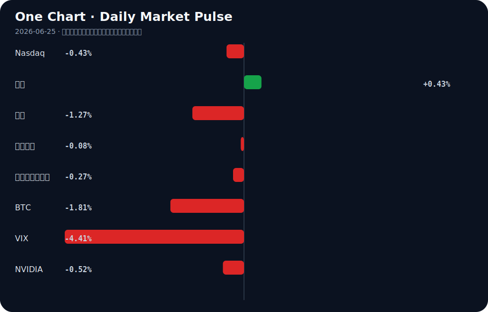

# Daily Intelligence
> 2026-06-25｜Thursday

## Today’s Thesis｜今日一句话
物理AI与应用落地正重塑产业生产力，但算力成本与安全治理的显性化将加剧区域与行业的K型分化。

## ① Executive Summary｜30 秒
- **AI**：物理AI（具身智能/端侧硬件）与应用落地成为主线，但AI coding成本逼近人类薪酬、安全治理从共识走向行动，意味着AI进入成本与合规约束期 [A20][A9][A21]。
- **商业**：出行、制造等实体产业加速与AI研究院共建创新中心，人形机器人核心硬件（灵巧手）成为政策发力点 [A7][A1][B7]。
- **宏观**：AI热潮未带来普惠繁荣，反而加剧韩国与台湾等依赖半导体地区的K型经济分化；央行购金与PCE数据前避险情绪升温 [B3][B21][B14]。

## ② AI Daily

### 物理AI与端侧设备爆发
**What Happened**：链博会展示物理AI走向真实社会，AI电脑、AI眼镜等端侧设备普及；2026年被定义为物理AI演进的第三波浪潮 [A12][A21]。
**Why It Matters**：AI正从云端算力竞赛转向端侧与物理世界交互，打开了具身智能与消费电子增量的第二曲线。
**Second-order Effect**：物理AI普及 → 端侧算力与存储需求激增 → 边缘计算芯片与内存（如Micron）重构估值 [A23]。

### AI应用落地的成本显性化
**What Happened**：AI coding的token成本正逼近人类程序员薪酬；同时AI伪造风险引发法律追责（纽约州候选人因AI使用被诉伪造） [A20][A19]。
**Why It Matters**：效率提升的背面是算力成本与合规风险，AI商业化不再是单纯的技术降维打击，而是ROI与合规的算账。
**Second-order Effect**：Token成本高企 → 企业精细化调用模型 → 推理优化与垂直小模型需求爆发 → 开源生态获得比较优势 [A8]。

### 智能体安全治理行动化
**What Happened**：ISC.AI 2026在京开幕，提出智能体时代安全治理从共识走向行动 [A9]。
**Why It Matters**：随着AI进入现实世界并具备自主行动能力（智能体），安全不再是事后补救，而是部署的前置条件。
**Second-order Effect**：治理行动化 → AI合规与审计工具成为刚需 → 具备安全与合规壁垒的AI服务商获得溢价。

## ③ Business Daily

**自动驾驶**：曹操出行联合上海人工智能研究院成立AI创新中心，推动出行场景AI化 [A7]；中国汽车零部件在墨西哥等地影响力增长，供应链深度嵌入全球制造 [B11]。

**制造**：通用股份等实体企业与三方共建AI应用创新实验室，政企联动盘活存量资产打造“AI样板” [A1][A5]；中国各省市出台机器人灵巧手政策，核心硬件技术突破成为重点 [B7]。

**能源**：H2SITE获战略投资加速氢能生产与分离方案的工业部署 [B2]；AI被视为环境的盟友，赋能清洁能源与蓝色经济 [A4][B23]。

## ④ Macro Observation｜机制分析

**世界正在发生什么？** 
AI热潮并未带来普遍的繁荣，而是加剧了经济体内部的K型分化。韩国与台湾的经济鸿沟在AI热潮下扩大 [B3]；同时，央行持续购金支撑金价底部，黄金突破4000美元关口 [B21][B16]。

**为什么发生？** 
AI产业链具有极高的资本与技术密度，资源向头部半导体与算力节点集中，导致缺乏核心抓手的区域或产业被抽血，形成反身性的虹吸效应。黄金的强势则是对法币贬值与地缘不确定性的对冲反馈。

**资本如何流动？** 
资本正从宽基风险资产（Nasdaq微跌、BTC下跌）流出，涌入避险资产（黄金上涨、美债收益率下降）与产业政策驱动的特定领域（机器人灵巧手、氢能、太空经济）[B7][B2][B19]。ETF资金仍在逆势净流入AI板块 [A17]。

**接下来关注什么？** 
关注关键PCE通胀数据对美元及降息预期的冲击 [B14]；关注白宫在美股回调时可能的市场干预逻辑 [B8]；以及AI算力成本曲线是否会在三季度引发企业IT支出的预算重估。

## ⑤ Signal Dashboard
| 指标 | 最新值 | 今日 | 信号 |
|---|---:|:---:|---|
| [Nasdaq](https://finance.yahoo.com/quote/%5EIXIC) | 25,476.64 | ↓ -0.43% | 风险偏好降温 |
| [黄金](https://finance.yahoo.com/quote/GC%3DF) | 4,007.50 | ↑ +0.43% | 避险/通胀对冲增强 |
| [原油](https://finance.yahoo.com/quote/CL%3DF) | 69.45 | ↓ -1.27% | 通胀压力缓解 |
| [美元指数](https://finance.yahoo.com/quote/DX-Y.NYB) | 101.52 | ↓ -0.08% | 中性 |
| [十年美债收益率](https://finance.yahoo.com/quote/%5ETNX) | 4.45 | ↓ -0.27% | 利好久期资产 |
| [BTC](https://finance.yahoo.com/quote/BTC-USD) | 61,532.61 | ↓ -1.81% | 风险偏好降温 |
| [VIX](https://finance.yahoo.com/quote/%5EVIX) | 18.63 | ↓ -4.41% | 风险偏好改善 |
| [NVIDIA](https://finance.yahoo.com/quote/NVDA) | 199.00 | ↓ -0.52% | 风险偏好降温 |

## ⑥ Deep Insight

**AI Token成本与人类薪酬的交叉点：被忽视的“生产力逆风”**

市场对AI的定价逻辑长期建立在“边际成本趋近于零”的互联网范式上，但AI coding token成本正在逼近人类薪酬 [A20]，这一交叉点揭示了一个容易被忽略的非共识视角：AI在短期可能不是通缩引擎，而是通胀与成本粘性的来源。

Vinod Khosla等乐观派认为AI将带来激进的通缩世界 [A22]，其隐含假设是算力供给无限且成本指数级下降。然而，当前大模型的推理成本并未遵循摩尔定律的陡降曲线，而是受制于能源、内存带宽与数据中心建设的物理约束。当企业发现使用AI编写代码的账单与雇佣初级程序员的薪水相差无几时，ROI的算账逻辑将发生根本性反转。AI不再是“不用白不用”的效率红利，而是需要精打细算的资本开支。

这种成本显性化将产生三个被低估的连锁反应：第一，企业从“模型军备竞赛”转向“推理效率优化”，催生对垂直小模型和端侧计算的迫切需求，这正是物理AI与端侧设备爆发的底层经济学动因 [A21]；第二，开源模型获得比较优势，中国大规模AI开源之所以能推进，本质上是对高昂闭源API成本的套利 [A8]；第三，AI基础设施的过度建设可能面临闲置风险，若应用端的付费意愿被token成本天花板压制，算力泡沫将面临出清。

反方观点认为，模型架构创新（如MoE、稀疏化）将迅速把token成本打下来，当前的昂贵只是暂时的过渡期。证伪条件：未来两个季度内，若头部云厂商的AI毛利率持续低于30%，且企业AI软件的客单价无法提升，则证明成本曲线未如期下降，AI的商业化将陷入“越用越亏”的泥潭，大摩所说的“勇敢者游戏”将只属于少数能跨越成本死亡谷的巨头 [A16]。

## ⑦ Tomorrow Watch
1. 美国PCE通胀数据发布，验证美元指数与降息预期的方向 [B14]。
2. 加拿大央行公布审议细节，观察2.25%利率维持期的终点信号 [B18]。
3. 黄金在4000美元关口的多空博弈，央行购金数据与白宫潜在干预市场逻辑的验证 [B16][B8]。
4. ISC.AI 2026智能体安全治理具体行动方案落地，关注合规标准对AI应用部署节奏的影响 [A9]。
5. Micron等AI基础设施财报，验证端侧AI与物理AI浪潮对存储芯片需求的实际拉动 [A23]。

## ⑧ One Chart

图表呈现了跨资产风险偏好的分化：黄金与美债收益率同向共振指向避险，而科技股与BTC的同步回落显示宏观不确定性正在压制风险资产。这种相关性并不构成因果，但资金流动的趋同暗示市场正在为高利率与高算力成本的持续期重新定价。

## ⑨ Quote of the Day
> “Price is what you pay. Value is what you get.”
> — Warren Buffett

## ⑩ Action Items｜今天值得思考什么
1. 追踪AI coding token成本在企业财报中的披露，评估其对软件服务定价权的侵蚀。
2. 验证物理AI（端侧设备）的出货量数据是否支撑边缘算力芯片的景气度假设。
3. 比较开源与闭源大模型在推理成本上的实际差异，寻找企业级应用的套利空间。
4. 关注韩国与台湾在半导体周期中的K型分化指标，警惕产业链重构的局部风险。
5. 思考白宫潜在市场干预对黄金定价逻辑的长期扭曲效应。

## 信息边界
本报告新闻源覆盖Google News聚合的AI中文/英文源及全球宏观/商业源，时效截至2026年6月25日早间。市场数据为最近交易日收盘值。宏观机制分析基于新闻事实的推断，重要判断请回溯原文验证。

## Sources

### AI

- [A1：三方共建“通用人工智能应用创新实验室”，通用股份加速AI战略落地-公司动态 - 证券市场周刊](https://news.google.com/rss/articles/CBMiZEFVX3lxTE9Ld3I5OGxPWk9hWEZtdGQ2YkJfUHB1dHZ5T2dsLXFJUW5iOXhvWVByU2JXaUp6QzhILXUtVVAtN0tUNzdyT2xoZktRaEI0ZlVMNnFEUlVvQW1sMVlmV0pDRm9xQ2I?oc=5) — Google News · AI 中文
- [A4：Partner Insight: Artificial Intelligence – the environment's ally - Investment Week](https://news.google.com/rss/articles/CBMiqwFBVV95cUxNLTBNaEFJV2hUMFVXcU9BQXBWcFRFMTNaUkEyMzFHNW8yeGVZNzlXa19DZklRYTZETzZudnJfaC1sTXp5OGp2bHp3a0RFT2hJb2dzdzdZM2tWRDMzQm9rYkFVaWdUSWV2MTJLYkEzN2NzeXN6Y3V4aER1RG5ZN1FYNXZFaF9ISUE5VDZ3Yk9Rb1Bvc3FETnRPczIxNU9Ha2p1YXRKRHRKWTAzWkE?oc=5) — Google News · AI
- [A5：政企联动盘活存量资产 湘潭打造新质生产力“AI样板” - 新浪网](https://news.google.com/rss/articles/CBMifkFVX3lxTFBFNUZwMkxJT0wzLUJNalROUmRqTnVNTmVVQmxsZlZ1N1h3bWJ6ZjBhdWNPai1CcmxFSGtMRTFFSGs4NjMxdUI0ekJJbi1HLTMxRlQyVU1vOVZBVFR4SG1nUUtSaDB6U0FOc05QYkZjUmt0MGRHazNRamlLeFVkUQ?oc=5) — Google News · AI 中文
- [A7：曹操出行联合上海人工智能研究院成立AI创新中心 - DoNews](https://news.google.com/rss/articles/CBMiXkFVX3lxTE1BOFBleDMzb2VjRmlPWlpMZzFrMHZKTjh2Sl83OFF2V0lEcnV6S3d1M2VBQnZrMlhqd1RaNjNMZl8tVTJ1aW5DakYtTVpXeGZPZUpfb1BQNThSX01HZ1E?oc=5) — Google News · AI 中文
- [A8：中国大规模AI开源，美国为什么不敢跟？ - 新浪网](https://news.google.com/rss/articles/CBMicEFVX3lxTE5ZaE1WblNJeDVlYUJ5bmxneE1RMldCa0NMeE1SVldqZUNsbHBRQ01FZGhUZXhnMGI4ZUtyMTJrOGNqY0xvX21KRE5QVzlKVkFZYURWMWJvQVl0UUhPbkVjVE1GTXNuUGNHNExtbzk2UFc?oc=5) — Google News · AI 中文
- [A9：ISC.AI 2026在京开幕：智能体时代安全治理从共识走向行动 - 新浪网](https://news.google.com/rss/articles/CBMifkFVX3lxTE9veWdKVWRQbl9DVk13eVZfVXNjUnF5YURqanJrT3ppT1JFUE1oZk9ESmFKWEZLY3p5azZoU0ZvdzFFMTljMWpfVWlFQWhSLW0zOWZTQ2RPcThaT19aeGZxU1B1SWpiaUZqazVWNHc4b3RlRms4RWhyRU9HY0h2QQ?oc=5) — Google News · AI 中文
- [A12：探访链博会“人工智能专区”：物理AI走向真实社会，AI电脑、AI眼镜“飞入寻常百姓家”｜聚焦链博会 - 搜狐网](https://news.google.com/rss/articles/CBMiiAFBVV95cUxPYjhDbFN5WmpGQUVsR2JsR3RueVFEU0FZbTl4aFVBTkgyZWJYYjdrR2lVeXZmd2cycEdFeTQtbXhDbVNKVjNCdjZhQklwOUNiaGZTRk1QQ1NTWkZuOGdSeTdoVzM0SWRKcXVLQm5qYll2MWI5c1RyTkh2NHBSUUs5NE0tbFpPTnJR?oc=5) — Google News · AI 中文
- [A16：别被“AI鬼故事”吓跑！大摩：“勇敢者游戏”即将上演 这些行业或占据上风 - 财联社](https://news.google.com/rss/articles/CBMiSEFVX3lxTE9HTGdKdVdIRXhpMXlyM3Y4dExtMGNOVGVhazVjam5FOWJDZUZTaUotWnVjd2hRVERHMlJrY0lLUWo4VHRHbUFsNw?oc=5) — Google News · AI 中文
- [A17：6月24日AI人工智能ETF平安（512930）份额增加1200.00万份，最新份额42.73亿份，最新规模31.89亿元 - 新浪财经](https://news.google.com/rss/articles/CBMimwFBVV95cUxQaHhWaDUwbmdROTZweldITFVvOFZ5RTFlaHloNlFaOVlJWnNFUVItdEN1YTByUEp3SWFHdWRXeEMzb3hQU1dubnlqTDZMS3Ftb2MtTHluMHAwT3gwNzQwRzVINWlHTmdnTjIyb01CYkRNWElJVi1IOTB4TWNUVGppeENIMVJ1cnJuWmNFZVVTeHhqdDc5dnh2a29OTQ?oc=5) — Google News · AI 中文
- [A19：Queens State Assembly Candidate Charged With Forgery for A.I. Use - The New York Times](https://news.google.com/rss/articles/CBMiggFBVV95cUxQS2U1LUEwWG5fMXN0d0lZYWRMVlR6STUxWmRyUFdDMkptN2RDRFBaQTNxS25jakJyd09EcXl2VWdVajJNX01fVzN0M3dlYV9PY3UyelptNzBmSHRlREc0OEJZMzN2YTdSQl8wWDRUbUxsMUpRMldvdlg2WDIweEJIZ3Rn?oc=5) — Google News · AI
- [A20：AI coding token costs are on track to rival human payroll - cio.com](https://news.google.com/rss/articles/CBMinwFBVV95cUxOdF92N19jMERSUm5BbTZVc2pPTlpsVEtSVjBZZWFsZ3RTQzIwUUtUU09aM3RDVUxNMlJTZlRmTjFPNl9TcUs4Qkc2U3ZzcEkzS0JRV2M1aFBzQzZOMmJsdFZuNUJSMU9aVVh6TGY2SjFpTmg3eklscWpZNGdLQUQzOHlyVEFzUUxxT0p3WDVTSU5udG81bi04dGVSVVFqNjg?oc=5) — Google News · AI
- [A21：2026物理AI：人工智能演进的第三波浪潮 - 电子工程专辑](https://news.google.com/rss/articles/CBMiU0FVX3lxTE1qR2N4UE9sT2c0dHlDYnRnTm0wclFNMTlxREhVeThWZ09oQ0toc3pMcGxKRTE3S2o5NTE4cEJjZkgyTWcwV2ktaHM5SFBnVEx2anRF?oc=5) — Google News · AI 中文
- [A22：The Coming Deflationary World: Vinod Khosla’s Radical and Unapologetically Contrarian Views on Artificial Intelligence - American Kahani](https://news.google.com/rss/articles/CBMi6AFBVV95cUxPUVFITXdDSkhEOG04ZWNlM2lURmUtNFZpbXdDd09lekliWVA2UGtVWkdFMVN0UlloTmxJc05yXzhBRDQ5Y1pySTdlaGYtdDNzZmRBQy1QT3lwQkU1ZWswRkdsc1dmeHUzOWZTWV8yVm1mcExWNE9nNTVVaGd2R1FpeEpRNVJrNGV0aFpWZXVFclpzX0ZBQXBvR09Bd2FOOXhtQTkySUx0c3p6cDAtRXMtYXFWalBrdWFLcnpUZHpvRmljbDJQTFJ3bEd6RGJDcW96LW1Vai1jbmNHZ3VzMkQxb3hBVDFhdmsw?oc=5) — Google News · AI
- [A23：Micron Just Broke the Mold for Artificial Intelligence (AI) and Its Stock is Soaring - The Motley Fool](https://news.google.com/rss/articles/CBMiwwFBVV95cUxPTUNCcE1saEllQ3NnWFRnb3Zja2ppQ2hVTUlPT1E3S3p4V2kzV3JlUWZFeld2NEkyenJwZzhzS1Zlb0pIMXp4M2R1VWJ3czBlRnJNQTJBSFdNUnYxa0l4T0RNU2xBRW1RN0lFb0wybVBIc1ZsMmxKLVJSMHRQTk1acnBLdS1uU3RWT18zOS1JM2EyTk5JZXo5Zlo2RGdETnJXWVEwZ1dfSTNQRmppdW9tUHAyeWRGZU90eEdTcGtpVVppMDQ?oc=5) — Google News · AI

### Business & Macro

- [B2：H2SITE Secures New Strategic Investment to Accelerate Industrial Deployment of Hydrogen Production and Separation Solutions - Business Wire](https://news.google.com/rss/articles/CBMijAJBVV95cUxPY0pNWWxFdVU4UWVNV2w0UG9fOVEwY2VoV0F2Q19GX21DRFRQdUdZeTdiZ1h2YnlVM1JGVlowYU9uWFNWU1E1eXJpNHB5QUsxanU5RkJXb0szcUZJZ0lFbEIxMW5QbjBrR3QxaUdzRmMxUl9qN1NWNnVTLVRSM1JmU0piUktaWm9sSVdNbnhWdFBnbThtX3l5MWRPRkVsUEl6T1lIM1A3clZCVm92SGVUeE1ZOFVrbWh4RGxjM3NYMkhBSzZBQVoxV2RQbGtfU2VQV3F0Q09vcW11RTZ3VUl5ZWxBZ3pTQTEySnlSeEh5OWQwTG4tUzJTY2xZcTZKbWpfd2ZHaU9OQlZPUXhG?oc=5) — Google News · Technology Business
- [B3：AI热潮下的“K型分化”警钟：韩国台湾经济鸿沟扩大 - 纽约时报中文网](https://news.google.com/rss/articles/CBMicEFVX3lxTE9zLV9xa2p3dzhVaUpIb3pUWUZnT3RfZHBXc3AtZXlOOWJtT1g5WHZxNThsTmY2U1IxZDZsbkIwVXNZaEtLRk1mcV9QOUZSVmgteGpJVFZyTktOcWNIRkkxRGhnelByWFVCNmRZX3dMMEk?oc=5) — Google News · 行业
- [B7：重磅！2026年中国及31省市机器人灵巧手行业政策汇总及解读（全）“作为人形机器人核心硬件技术突破是政策发力重点” - 新浪财经](https://news.google.com/rss/articles/CBMieEFVX3lxTFA2aWt1RV8zRW5KeHljMk1EVnBwNlVWSzZ4cFZYMmFKQkZCVTZyTXZFcV9hbFRBNktGUjVrXy1FTTNMUmJZSzRQbmNQM1ZEQVRNbGVmODJkUFRROHJlRl9qNXdNVWpoR0NqamswTlZoeTliYzVkbXNWTA?oc=5) — Google News · 行业
- [B8：The White House May Intervene to Support the Market: Gold Trading Logic Amid US Stock Pullback - Bitget](https://news.google.com/rss/articles/CBMiY0FVX3lxTE5XYmMwR1BSdkd0YWdWTTNYV1BVQ3dwTm1jaHdXalo1NzNaU1JtQ3R6RTM3eWNzYmFoVGc3TUpWYTZjQVlWTlZUR1hoaXNXd1o2Z1MwWVFERkVVTHBHNDZVZVlIZ9IBY0FVX3lxTE5XYmMwR1BSdkd0YWdWTTNYV1BVQ3dwTm1jaHdXalo1NzNaU1JtQ3R6RTM3eWNzYmFoVGc3TUpWYTZjQVlWTlZUR1hoaXNXd1o2Z1MwWVFERkVVTHBHNDZVZVlIZw?oc=5) — Google News · Markets Policy
- [B11：China’s Auto Influence Grows as Vehicles Rely on its Parts - Mexico Business News](https://news.google.com/rss/articles/CBMimwFBVV95cUxNTWRxQzI3RWRTbHcyNzhHQW9WQTNmX2FjWVhSTUxvdEtTQTRJbDljLWxxQTBqa2pSZkM4OE1zU3B2MUNvbEFxMTMwS3hvSEVnNkhiRnJvX2J0VjVvaFBha2hJWElYUXNhaW15VlhkdEc1VVFSUlFkdThiUlVDdlZMQTA3Rk1TR0ktMXNQTmJ5OEtjSnlFNEF2V3VyUQ?oc=5) — Google News · Technology Business
- [B14：US Dollar Gains Ground As Traders Brace For Key PCE Inflation Data - Bitcoin World](https://news.google.com/rss/articles/CBMid0FVX3lxTE1fME5DX0l5Q3JrTllzTWJwTk1GSVpVMFRCZXoxUmhqU3UyOW5kaW5LbElkR0kwVmcwMkRzRFM2S1RZTk15ajFseGN1ZHlZWWFhM2x4bGF3TVNiX0ZWZm9RU1NhckhSeUZNZXlUTm4waDBZR2pNZWI0?oc=5) — Google News · Markets Policy
- [B16：Gold’s $4,000 Crack Exposes the Debasement Trade’s Weak Spit - Investing.com UK](https://news.google.com/rss/articles/CBMisgFBVV95cUxPRzdUTGV4Z0dGeVZfQXFfcktmajlEWlY2V1hBNFpRM1kyYVRHX0Y1OUV4MWx5M2VKSXdRa2RuekY0Q2I4T3BEM1AyVkpfVHN6aEgya0FrTXY5VVpINjh1TVJnNE5TWmgyRU1IM19pMnZhVXhtWFB6cXNFWW54aDFodDdnbk9iYmdUSUZ1UHRnZHFIcjdOdFpRM0xmc00xRFZHcXpVZl9MN2Z2MzdQS1hQQmNR?oc=5) — Google News · Markets Policy
- [B18：Bank of Canada holds rate at 2.25% for fifth straight meeting as deliberations go public - Crypto Briefing](https://news.google.com/rss/articles/CBMiggFBVV95cUxOc0xwV1lBNG9mYmFxRy05Qkxka3FVZ01qRFJmMlF3SnNyWkpQeGJfdlNoc1k3ekxUbXU1dnp0NlZuTFlfRFBwNjVBQjBFNFVVVkFDdjkyNFVzTnpTOGtIM21qLWhVWXpfY0tSaGRfRU44M0Z5TjJGbEg2T2xueEdFTGd3?oc=5) — Google News · Markets Policy
- [B19：Space Economy Emerges as Trillion-Dollar Growth Sector in Global Economy - Fana News -](https://news.google.com/rss/articles/CBMirwFBVV95cUxNOGFaLThLVkFDb2NwcWFjVS12b3NDSWFWbERkVjVWQk1aVTU5Wk5mSkhzZHFvcVpsc2FMbEVkcEY4Z3RpMGdqY2k5WWo5aXhUS3lrUk1hTlA5NzlNRWh3X2RfcXF2eUxUUGhnWTdVY0p5MjRQcW1IWC0tZ1VuY0RLWmFlWDZNUlVudXFpY3RWNG9XcWc0ZHE2Z295Y0xIdTlaQWtVZHFYbTZjM01FZWdV?oc=5) — Google News · Global Economy
- [B21：How Central Bank Gold Buying Shapes the Gold Price Floor in 2026 - Discovery Alert](https://news.google.com/rss/articles/CBMihgFBVV95cUxOYmw3WW1abnBuSjNlZEsxYzlrdDc3ZkFKSFQ1MUdwdjlURWdPNk14X1hvVGVvYVZZNVM5Z2dhMXFVLXNYQllqZlBrOURDQUVoVHdaVXdNNXVIZGJRVksxVVZQcHRjaldkZWh4UVVTSXF4MEZBRmdmTU1kZ1Q4c2lsOGRPSkxKQQ?oc=5) — Google News · Markets Policy
- [B23：Clean Energy & Blue Economy - Delaware Business Times](https://news.google.com/rss/articles/CBMikwFBVV95cUxOM2RvcUxpT0w0UU1ySWt4TFdHa0JkOGFiUHVaZDBBZ3lFQ0lGbFE1NHFfSFpKdDl1ZjJBMUpQZ0tOVEZsUXVwb01JRVg2Tm55TmJqRE9UZEMwWmVOdlB5NDN4azduSWYzNHVxUk1QS2ZNWlNNUzBRTWFTa0w1OHJtZnhXc2FrT2ZobnRWekc1R19iLU3SAZMBQVVfeXFMTjNkb3FMaU9MNFFNcklreExXR2tCZDhhYlB1WmQwQWd5RUNJRmxRNTRxX0haSnQ5dWYyQTFKUGdLTlRGbFF1cG9NSUVYNk5ueU5iakRPVGRDMFplTnZQeTQzeGs3bklmMzR1cVJNUEtmTVpTTVMwUU1hU2tMNThybWZ4V3Nha09maG50VnpHNUdfYi1N?oc=5) — Google News · Technology Business
