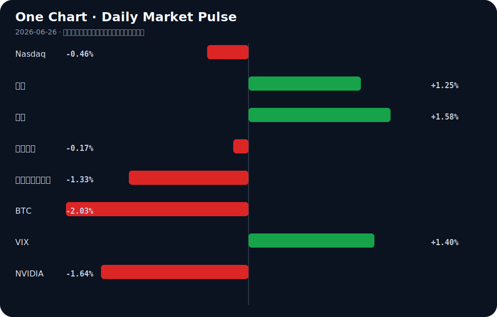

# Daily Intelligence
> 2026-06-26｜Friday

## Today’s Thesis｜今日一句话
AI正陷入“落地幻觉”与“资本狂热”的严重背离：企业端转型成功率不足5%与消费端超90%差评，正倒逼资本从模型军备竞赛转向治理、幻觉纠偏与物理基础设施。

## ① Executive Summary｜30 秒
- **AI**：AI应用遭遇信任与成效双重危机（<5%转型成果，>90%差评），资本开始从大模型军备竞赛转向专攻幻觉与合规的初创公司[A1][A10][A17]。
- **商业**：地缘政治重塑技术与供应链，法国暂停阿里AI测试、欧盟重构采购机制，迫使企业从单一技术研发转向全生态能力建设[A5][A7][A8]。
- **宏观**：全球央行持续重定价致避险资产逻辑生变（黄金跌破4000），而AI算力需求与能源成本的矛盾正成为新的宏观通胀变量[B3][B21]。

## ② AI Daily

### AI落地遭遇信任墙，资本急转弯
**What Happened**
超90%提及AI的客户评价为负面[A1]，不到5%的公司报告AI带来“转型”成果[A10]；与此同时，Scaled Cognition获1亿美元融资专攻AI幻觉[A17]，5亿美元基金推动工人AI再培训[A16]。

**Why It Matters**
狂热叙事与惨淡落地形成巨大反差，证明当前AI的边际效益在消费端和通用企业端接近枯竭，可靠性与组织适配性成为核心瓶颈，而非模型参数量。

**Second-order Effect**
企业AI预算从“模型训练”转向“护栏与纠偏” → 专攻幻觉与合规的初创公司估值重估 → 大模型C端订阅退潮，B端垂直场景整合商崛起。

### AI模型的地缘政治化
**What Happened**
法国财政部以“中国倾向”为由暂停测试阿里AI模型[A8]；中国呼吁在AI全球治理中成为规则制定者[A7]。

**Why It Matters**
AI模型已成为主权延伸的载体，数据与价值观的边界正在固化，技术脱钩从硬件（算力芯片）正式蔓延至模型应用层。

**Second-order Effect**
地缘审查加码 → 跨国云与模型服务商被迫分区域维护独立模型 → 全球AI标准碎片化，出海合规成本激增。

### AI的物理化与能源吞噬
**What Happened**
BlackBerry营收因“物理AI”跳涨26%[A24]；AI算力需求可能推高居民电费[A21]；AI正从聊天机器人变为车间同事重构供应链[A3]。

**Why It Matters**
AI正在从数字域向物理域（工厂、电网、自动驾驶）渗透，但其高昂的能源强度开始与民生资源产生直接冲突，算力成本不再仅是CAPEX，而是宏观能源变量。

**Second-order Effect**
算力扩张推高区域电价 → 民生与科技巨头争夺电力配额 → 倒逼数据中心向新能源富集区或海外迁移。

## ③ Business Daily

### 科技
OpenAI倾向于将IPO推迟至明年[A15]，反映在宏观利率高企与盈利模式未稳的交叉点上，顶级AI公司选择延后定价。AI人才需求正从“单一技术研发”向“全生态能力”延展[A5]，纯算法团队估值见顶。

### 制造
AI从聊天机器人转向车间，重构供应链韧性[A3][A18]。这并非简单的自动化，而是将AI嵌入排产、物流与库存决策，以对冲地缘脱钩带来的断链风险。

### 能源
Valgotech宣布在印第安纳州新建硫电池产线[B6]，试图填补AI与电网冲击下的储能缺口；铜价因AI贸易乐观情绪上涨[B21]，但央行紧缩恐惧同时施压，资源股在通胀与利率的夹缝中定价。

### 医疗
Medicare的AI试点证明：审批容易，支付困难[A19]。这揭示了AI在强监管行业的典型困境——算法可以加速流程，但无法绕过既有的支付利益链与责任归属。

## ④ Macro Observation｜机制分析

**世界正在发生什么？**
黄金跌破4000美元核心支撑[B3]，前端收益率上升和央行重定价削弱避险需求；同时，日经创新高而日本央行加码紧缩[B23]，印尼面临超5万人裁员危机[B11]。

**为什么发生？**
全球资本正在重估“滞胀”的概率：AI算力推升铜价与电力成本（通胀粘性）[B21][A21]，而央行（如日本、巴西）在通胀前退缩或犹豫，导致长短端利率博弈加剧与市场混乱[B12][B23]。

**资本如何流动？**
资本正从纯软件AI概念流向有物理资产支撑的算力基础设施（铜、电网、硫电池）[B6][B21]，以及具备确定性的宏观情绪数据集[B5]。避险资金不再单向流入黄金，而是寻找新锚定物。

**接下来关注什么？**
关注“AI通胀反身性”：AI推高能源/金属价格 → 核心通胀难降 → 央行维持高利率 → 压制AI企业利润与估值。**事实**是黄金跌破4000与铜价上涨；**推断**是AI是推高电价的核心因素，这需后续电价结构数据验证。

## ⑤ Signal Dashboard

| 指标 | 最新值 | 今日 | 信号 |
|---|---:|:---:|---|
| [Nasdaq](https://finance.yahoo.com/quote/%5EIXIC) | 25,358.60 | ↓ -0.46% | 风险偏好降温 |
| [黄金](https://finance.yahoo.com/quote/GC%3DF) | 4,040.10 | ↑ +1.25% | 避险/通胀对冲增强 |
| [原油](https://finance.yahoo.com/quote/CL%3DF) | 71.45 | ↑ +1.58% | 通胀压力上升 |
| [美元指数](https://finance.yahoo.com/quote/DX-Y.NYB) | 101.44 | ↓ -0.17% | 外部压力缓解 |
| [十年美债收益率](https://finance.yahoo.com/quote/%5ETNX) | 4.39 | ↓ -1.33% | 利好久期资产 |
| [BTC](https://finance.yahoo.com/quote/BTC-USD) | 59,758.78 | ↓ -2.03% | 风险偏好降温 |
| [VIX](https://finance.yahoo.com/quote/%5EVIX) | 18.89 | ↑ +1.40% | 避险升温 |
| [NVIDIA](https://finance.yahoo.com/quote/NVDA) | 195.74 | ↓ -1.64% | 风险偏好降温 |

## ⑥ Deep Insight

### AI的“物理化”与能源反身性陷阱

当前市场对AI的定价仍停留在“软件革命”的叙事中，认为其将带来无尽的生产力通缩。然而，一个容易被忽略的非共识视角是：AI正在从通缩力量反转为通胀力量，且这一过程具有强烈的反身性。

随着AI从聊天机器人走向“车间里的同事”[A3]与“物理AI”[A24]，其运行载体从云端服务器扩展至工厂机器人、自动驾驶和实时电网调度。这一物理化进程对能源和基础金属的消耗呈指数级增长。铜价因AI贸易乐观情绪而上涨[B21]，AI甚至可能直接推高居民电费[A21]。这意味着，AI不再是只消耗算力的代码，而是与民生抢夺电力、与制造业抢夺铜的实体“巨兽”。

这就形成了一个致命的反身性陷阱：资本押注AI算力扩张 → 算力推升电力与金属需求 → 基础资源价格大涨引发通胀粘性 → 央行被迫维持高利率（如日银加码紧缩[B23]） → 高利率反噬AI企业的资本开支与估值，同时压制宏观总需求。

在这个循环中，AI的物理化越成功，其对宏观流动性的抽血就越严重。5%的转型成功率[A10]与90%的差评[A1]说明当前AI的软性产出根本无法覆盖其硬性资源成本。当华尔街发现AI的毛利率受制于电费和铜价时，当前的估值逻辑将面临重估。

**反方观点**认为，技术进步终将解决能源瓶颈，例如硫电池等新型储能的扩产[B6]将平滑电力峰值，且AI最终会通过优化电网和供应链实现净节能，长期仍是通缩的。

**证伪条件**：1. 未来两年内，数据中心PUE（能源使用效率）出现断崖式下降，且新型储能大规模商用，使算力边际能源成本趋近于零；2. 核心通胀数据在算力大扩张的背景下持续回落，证明AI的效率红利大于其资源消耗。

## ⑦ Tomorrow Watch
1. 验证OpenAI是否正式宣布推迟IPO至2027年[A15]。
2. 观测黄金是否能收复4000美元关口，或继续受前端收益率压制[B3]。
3. 追踪法国财政部对阿里AI模型的最终审查决定，是否从暂停转为永久禁用[A8]。
4. 关注印尼超5万人的裁员预警是否转化为实际失业数据[B11]。
5. 比较AMD、Broadcom、Nvidia在AI计算股争夺战中的下一季度资本支出指引[A20]。

## ⑧ One Chart

图表显示了主要资产类别的近期脉冲方向。黄金与原油的同向上涨与纳指及BTC的下跌并存，暗示宏观资金在通胀预期与风险偏好之间出现分化，并非简单的风险-on/off二元逻辑。

## ⑨ Quote of the Day
> “The future is already here — it is just not evenly distributed.”
> — William Gibson

## ⑩ Action Items｜今天值得思考什么
1. **思考**：AI的物理化扩张是否正在侵蚀你所在行业的能源成本优势？
2. **验证**：企业AI转型不足5%的瓶颈，究竟是模型能力不足，还是组织结构与数据治理未就绪[A10]？
3. **追踪**：欧盟公共采购机制重构[B8]对中国科技企业出海订单的实际挤出效应。
4. **比较**：专攻AI幻觉与合规的初创公司[A17]与基础大模型公司的估值倍数差异。
5. **关注**：央行紧缩立场（如日银[B23]）与AI算力通胀逻辑的博弈对长久期资产的压制程度。

## 信息边界
本报告信息来源于公开新闻聚合，覆盖AI产业动态、全球宏观政策及市场情绪，时效截至2026年6月25日晚间。市场数据反映最近交易日收盘或盘中情况。重要地缘政治及金融判断基于新闻摘要推断，读者需回到原文验证事实完整性。

## Sources

### AI

- [A1：On Your Side: Over 90% of customer reviews mentioning AI services express negative experiences. - clipped version - KY3](https://news.google.com/rss/articles/CBMi1wFBVV95cUxPZnA4OWNicmxVSHNtV1FZNWNkSVlRRUFQekNLc1pURU9lODE0RG5aWmJwR2dEd1RGakU4d3hxNHNWZ1ZPY3V5MDRJT3NacXJ4R1U3NzhWQ1prbnBDWmtHcl9MNXpLdWdpU2VVM1NFWDUxNFFwUWtlUTNtMVlKSzUtSW5yNVhoZWpUMnIxYUxjbkhybmpkWEFyOVJPTFcxN1E1NWRTQ25jUFF4R0lGa2dXNjNRcHFFR2pJYkNIUzR2cXl4R01hTGhqU0FwTnVGWFEyX2ZQS2FiTQ?oc=5) — Google News · AI
- [A3：从“聊天机器人”到“车间里的同事” 人工智能如何重构供应链韧性 - 中国青年网](https://news.google.com/rss/articles/CBMiZEFVX3lxTE42Wmw3X2VKVFN3UWI3a01EWFc2cE9xc0dsVW5zUlNmdlY3X3hxT2Y2QU5PMEFvQlc1U1plNmlRbVVVLWVMaldxc0xSX0JBckdESlI5QmtuaWJSMjZCR094LW5HSmE?oc=5) — Google News · AI 中文
- [A5：科锐国际陆同伟：AI人才需求正从“单一技术研发”向“全生态能力”延展 - cb.com.cn](https://news.google.com/rss/articles/CBMiYkFVX3lxTE9feWU4anh2d29xbk5qT2FtVEo4RGh0VTBXMG0wTGl1YUFodXR1aU1kTWE2MnV1UjVVWEZ6SHVBRGFxVzlKZDluRTBhTUdITWVFQVp6QTVXZUR2cjFnTE05d1lB?oc=5) — Google News · AI 中文
- [A7：AI全球治理，中国要成为规则制定者 - 新浪财经](https://news.google.com/rss/articles/CBMipwFBVV95cUxQVVFqajlMWnN4UkV4VGczTDZ5SnI5blpiaHVCNjJzWE9FdWc4V0tNMzd5OUZsTzZwRWN2OVZPcU1mLVNVbmlsNm9JR0otYlN5Zk5DbzNxbzVCVmQ3VXNuSkxtNkJOVjJNRnNjVGItRGxFMFdYLWRHeUNHQWZzVHdqTnROR0pJWktBazh1R1JMZFJEODVqVEZSTllzNS1MSkc3SXVNRVU1MA?oc=5) — Google News · AI 中文
- [A8：法国财政部暂停测试阿里AI模型 涉“中国倾向”引起争议 - RFI](https://news.google.com/rss/articles/CBMi7gJBVV95cUxNTndhbTNfbTBhYmNPS3J2TzktdURxMDVjQUxWZTVSSGlKeDJqZWI3QmdJYmJVNTBkOVc2YXlkenRpcko3azlreF90WEJDTmxQUGhHQ0JNSEhJRHF3emp0MV8xY3RhSWNSMVpJQ2I0dDJ0Nnp5WTRXaHJpc2VhdE5XU0ZQZHhFblRRUkNQS2VhWjluSHdDMF9BWkR3Z1M4Nl9selk1RXQ4QW41NVAtUzFDN01DOUtrWE1VWEZHODBtM3ZpdjJSRGRkemVRVHdMVEZIZ0hJLUVXUHM5eTJ2LXNoQXVYdzd2RHlRMlBIYl9CeGZPbkhJRVFVVE54Tm52VTdEYXg2TVRIRkg5ckxhZ0lGTl9NQU1ibHJLcEh0TWdWeEJPWFdhdVRNd3ZzaHRQZ0tDZEJ6Y3QydGxjRFd0UUFsMDhNRXp0Y1BZUWJjckVGT00tbUlNSm9aVzRuVWZqNTlORXkyZXBwa0JMdjQxZEE?oc=5) — Google News · AI 中文
- [A10：This week in 5 numbers: Not even 5% of companies report ‘transformational’ outcomes from AI - HR Dive](https://news.google.com/rss/articles/CBMimwFBVV95cUxPUGFZckNhdHRaRl8yb2paVlV5cDBydWNxV2ZGb25wWFhiYU80YzM4OFpqOWRoNjVzRWloTkRhamVxcjFhdHltS3R4ck85NU45YWJvdlI0aWtFZ0VyQnFxZ09FMGhIM2djYnl3Vld3ZEFxcWRZLTlhSlVLY3lYN0s2UFJHdURqR0ZFd1J5V3Fueml6bTFqLW1BQmJsRQ?oc=5) — Google News · AI
- [A15：OpenAI Leans Toward Holding Up I.P.O. Until Next Year - The New York Times](https://news.google.com/rss/articles/CBMijgFBVV95cUxOX1h6bTA1cUUtN3ZZdWpZcnNZUG5IS2VsekVLdDBkNWpGQjFXUXJaODl4Q3pweU1mbmFjRmVXZTB1ZURPOVhreWpJZnRoTThaV1dsMXNKYVBSR3h4LWJUSUhjYklrcHhPZDk4Y0d5OU84dGNXTklvRUxZUzNDNV9kZWZCbFF2UmxkLUNtNGtR?oc=5) — Google News · AI
- [A16：A new $500 million push to retrain workers for an AI-driven future - The Independent](https://news.google.com/rss/articles/CBMiqAFBVV95cUxPRzZQMzY1MEpJMzVWMHU3ajJBSjhiclZkMjEwM013Ui1xdl9sODkzRjljM0RyaXc4aWVKa2VrdjJaUGxUSHVKN3R5cGY5NndlTHdjaWdxR1FnNEdtUGF5bVlpQk53SnFOX0JLaDhSTGpJbTF2UWMwVWdPdFFqSmNaYXM4SUZOaHplRDh0aVdWTC1oZWc0RDQxejFneVRtOUNzZW9hSU1IV2g?oc=5) — Google News · AI
- [A17：Scaled Cognition Raises $100 Million to Address AI Hallucinations - PYMNTS.com](https://news.google.com/rss/articles/CBMivwFBVV95cUxQVS11UHVvLWJSTWlFanBrdFFySTJsb1kxeHRYQzVxTVN5VjNoVUZDQmhtMlduYVNCak8xYjl6T05weUtHc2h2NlZOMFBvRVJnVVhIczZzQ2VLNXMyZklXcWZlZ0FZUjR5YjVic1RRNllzb2NRenRNNVdZODFXQTB0aEtJcFlOMmF4S3AzXzJ1alZVdW1LRFFUNVE1Wm9zN242NEJzSEJKd1p3N0dpMnBwaGZpUzJ1WXlrYjVqRnJ0RQ?oc=5) — Google News · AI
- [A18：AI on the Factory Floor: A Primer for Manufacturers - The National Law Review](https://news.google.com/rss/articles/CBMif0FVX3lxTE9wSlJ1OExXUjRlUFpTZjRQeUsyTV8zSXoya1RjQWNFNFhmVkRMMmgzWEI5R1l1dE96U2RxdkNEUDBNQzkyZzA5ODdNSUo0ZFh4d2VUcHdQUkNOYm1BZUhtV1RkNVlGMXZBWGE3eXJkVzVPalA5QTFFNk01a1VyRlXSAX9BVV95cUxPcEpSdThMV1I0ZVBaU2Y0UHlLMk1fM0l6MmtUY0FjRTRYZlZETDJoM1hCOUdZdXRPelNkcXZDRFAwTUM5MmcwOTg3TUlKNGRYeHdlVHB3UFJDTmJtQWVIbVdUZDVZRjF2QVhhN3lyZFc1T2pQOUExRTZNNWtVckZV?oc=5) — Google News · AI
- [A19：Medicare’s AI Pilot Proves Approvals Are Easy. Payments Are Hard. - PYMNTS.com](https://news.google.com/rss/articles/CBMivAFBVV95cUxPYzExV0RiU014d0FzM01NNWx0eDhfSnJERzNLdUxObGlWckEwQ05FbzJGbXpaWDNaWnJ1MW1vY2JaeVdVMFZ1cmppT3Rva3VmelN5N0FxV2JGWkN6MjJWaXRNaHh6a2p2cWtQNi03S1pPRmtCWG4zaHhTdUpuNjRDdUZDd0phOE1MbmJzbUpXV3ltNndWY0lIVGtVcllJNlBWVTN3dHhEMEZnSmpOelc0cGxsaDdPT2RwWGMzUg?oc=5) — Google News · AI
- [A20：Battle of the Artificial Intelligence (AI) Computing Companies: Is AMD, Broadcom, Nvidia, or Marvell the Best Stock to Buy Now? - Yahoo Finance](https://news.google.com/rss/articles/CBMiqwFBVV95cUxOc2g2Z040cXhzcGd6YTRpVDRDWEJIMWxFRHRIckZQSXZycU9SYzdsWGRXQVNqcHR3RVRJX3h4dUx4LWppblBmV3B4S1VIOUUzRU5lQ3Bjd1dsV0RTYmxQaks2N1lDMUlrYVRjSmpxalVRazZUWFFpY3AxMmllMXpUd3VrMTlQUWZodWI5ZFdTUzFfVko5bjdDZnI3TzcyMloxUm83NWFPVXRrVkU?oc=5) — Google News · AI
- [A21：WHAT THE TECH? Could Artificial Intelligence Raise Your Electric Bill? - Local 3 News](https://news.google.com/rss/articles/CBMi-AFBVV95cUxNZXNFajBPVkFnT1FQVVJBZ1dJMTdzbHQtSjRPMXBtek5GRWN5cmdKYWhyR0ZFM0xCbkpWRTUteU9fd2JreVZTY3JoWXZyODNzb2psSE0xOUpma0xpUzctdnlTR1NsbmR6RDItT0lFUG9NaU1vVnB5bFh1SkVUa1RGd1BCTmF3dlVHT2twOFpRcFA3RGdkUVpqeUVObThMUnVlSVNyVVdmUUg2VkY4NDh4NXQzWTNXeUYwTFUyWDRkeUpGT3J4U3lieHZ0anpKR1JDNXRQaUViT0lIWkRWd1V2OWNiYVdzM1dtaXRXQXBPUkN5N2xVUFItVQ?oc=5) — Google News · AI
- [A24：BlackBerry Dials Into Physical AI as Revenues Jump 26% - PYMNTS.com](https://news.google.com/rss/articles/CBMisAFBVV95cUxOMkJ1dmRjNmhYR2FUUUJmVFpDdlEtdENiX3hvNGoycTd2OUJaY2g3RjMxNG1lM1lJLXRzY0dYRzVRY19FMjYzNVhjRU9RVVNjekpzVW1QcEROMTRQblNBQWZZc193T3NRNU5ZazA0dmJ0dmEya2drUE5xQ21qOXA5ZWhtVFZWQ3hyWUM2LTdVNUFDcUdTQTBNWFZ5dzVhZXdhUXM4VzAzbkFqbVdSbGNXRg?oc=5) — Google News · AI

### Business & Macro

- [B3：Gold slips below $4,000 as higher front-end yields and central bank repricing dent haven demand - VT Markets](https://news.google.com/rss/articles/CBMi2AFBVV95cUxOWEtkckxGdk5sS083cWdPSXZMWHd6cHA1ZTBpcElpSXd2WXdsX21iSFNlVXJ3NVNHbkctU0tmUVYzMDlyOVh0Z3FBN0h4NG9HMm43Z0J5MmhobmNSNjRsbnZhdzEzWVpueDJJb2F6V1RNTjhhcTBISktqMExObWpJR1JHeXF6dnNGNjB1dklDbFJqd0FGX3JmNDRKUDJiTjNmeG5Ednh5UlpmVnhVcnBwWWtndWlTYzJpcDJlR2pMMWlIME9vV0l2RElIa2o4RVM5R1ZMMmUzLWM?oc=5) — Google News · Markets Policy
- [B5：Permutable Launches Global Macro Sentiment Indices, an AI-Native Dataset for Tracking Inflation, Policy and FX Risk Before Official Data Catches Up - markets.businessinsider.com](https://news.google.com/rss/articles/CBMirAJBVV95cUxNZjFGQXE0dk9CQjBTb3JqU2N4eU9XUnpWN3hUbkRWUTZnRHpuM2xFdXo4cjRLNFdMMUN4N1RMclJZOHBLLWdXWGN3RWM2d1QxQlNaMFBqLVppM0RxUzFzUXNVWDRTVkdwLVF2NDJoUUNGNEE3emJ6RDNRaGhXWHZlLWU3X2p3ZjdfNXlFUzdBS01xTW5YUG5DaDl3MXlHa3k0NW1WUGpmVUVLeHZOYU1oYkJmOW5KTldUSGEyMW5lZ24wYnVHZVlaUm50RG5uTE9YV2N5dFNMZ2o1VnVMeC1uT0J1VWNwTUZYNVFoekJOdU9IOUF6ZlhJUXB2dE52ZWZERTlQODRIYnVHSHdNTFh6MFlaTmNjUHdpdWhHdEc0YzBqV0g5bFRqN0l5N0s?oc=5) — Google News · Markets Policy
- [B6：Valgotech Announces New Indiana Battery Production Facility to Expand Domestic Sulfur Battery Manufacturing - markets.businessinsider.com](https://news.google.com/rss/articles/CBMi-gFBVV95cUxPWGc2UFVzYWVucEJmM0tMZlpTeV9hdFBPOTFaRjZoTG5yX1BSdVUxcXVGa0p5bDRCLWNiTGdCWFhoSWRSUWRiVjRkY29qZmZpeE5hMTFmUXdpMV9GVERPMFNkUUNtei1HNHJfVHJKemdJV0VQT3BzalJ0UC1TU19pX0NJaVlDMVRoNEdLUFlYam5MSTVubHJDRVZHVE5GWjBzWUxMY09paXVpM0tPMi1rNXZScnN5WHZfNnBrcGRjMXZXOG1kakFYMTg4V0hxVUsyZFZoMjVTZkVIRU9pSWtRbGFaNlhyU1VLc2N3dzdSaWliMC1aTVFOR2Z3?oc=5) — Google News · Technology Business
- [B8：欧盟公共采购机制：从产业政策到市场准入重构的系统性转向 - 风闻](https://news.google.com/rss/articles/CBMiakFVX3lxTE5WUkwwRTVCNGxSTUpYMXFHd3B3dlNHaTFwTnJBaHZTU1ZRWUNiR0duR1VjTDd1TFlMdzNXOEw2WGlrQkppbDdyNVRuS09sTzM0LXFGZWY2ZDZfZTlLekRIY3hORy0zbm9FU2c?oc=5) — Google News · 行业
- [B11：INDONESIA Employment crisis with more than 50,000 people at risk of layoffs - AsiaNews.it](https://news.google.com/rss/articles/CBMirAFBVV95cUxNeFNqV2l1R0ZPc1QyaFlfQzduZC02dndBZVpPVm83bEVOamhYdFBSU245N1FSODMzMzhWUFFTeFdSYVlOTTAzQVlVajk1a3gxZlZFaHpZOVl2a3BhYzRoNFU1b2hSMnE0cVNBc01aZGNfZ0JlOHZ6cHpKQ0NJSXhuYy04RXV3b1J5N0ZORHh4TjVFZTFydnE3M1FVY1RhampQMnN3YmxJV0ppOU9J?oc=5) — Google News · Global Economy
- [B12：Brazil central bank says policy horizon unchanged after market confusion - Reuters](https://news.google.com/rss/articles/CBMiwAFBVV95cUxNc0dPeE5PQzJ2VVNKWHZkTU1nbUJ2OGZFRjVNQUhnUkRSbHFmZ1NFM1ZHajlIS1pnbWhuOVY3Y1dhVlFmMlFPR3lRNG01dmJiQkFPNVUxa1dBeEhyMmZvUndDMEpzUXZwb191VTN3RFBxTnpUSVBscDBXTlE5OXR3VHFGUEd4WFoxbmF2Y3ZFMnZxR1hQaXZMWlVCbEFPc3ZOTjdrMEJzQ21vY0JWRGxab1ZFUEprQ2tvdEEzdFphdy0?oc=5) — Google News · Markets Policy
- [B21：Copper Prices Rise on AI Trade Optimism Amid Central Bank Tightening Fears - News and Statistics - IndexBox](https://news.google.com/rss/articles/CBMiowFBVV95cUxPOXNzd1JPRzRJMXlnOEc1UWZZZXFZZmdZV3EzNWNjVFlzNEhDbG4yZTI5SUIyNWJxOXRBeDlLdXp1UDdRYTREdVlCMTdfVnNnYUpIb3RkUEwzdVY1N21ZWUdQYXR4U2NrOEd2dlBiV3prbTVIQ3VyTlpzRk9EdFk5anpPaFF3Y1BsaVU3d2s3VGl6NE5wbEw4UWdZTDNOUUU0WTFn?oc=5) — Google News · Markets Policy
- [B23：Nikkei reaches new record as BoJ intensifies its restrictive stance - equiti.com](https://news.google.com/rss/articles/CBMitwFBVV95cUxPMHpuN0dzVFdsTXc2LUpoME5WbHgtczNZeVV0N2gwUy0wZlZUWEY1YTJJYUhGRnRfc09QZ1ExdDdwbnk0d1NaVVRraTNlRzZscnVZY0dmaDZobnI0eU1RRnBVeXAyNVpMeFVRajVEZEYwc1FHdjNKaVhrc0ZwdzdXU1JIWHpsckN4QnBmYnBlbW83ZGtxY2V5WlBCMjFLd29lQnlvQ2drVlZJb0dkNEcyemZ1X3hCd1E?oc=5) — Google News · Markets Policy
