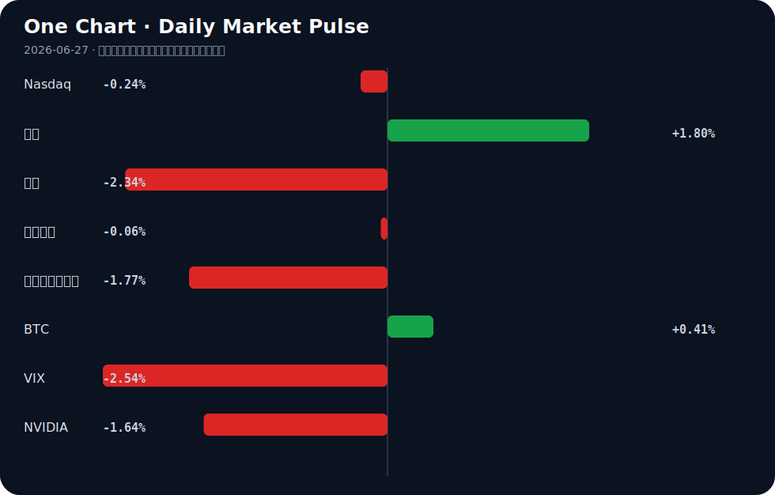

# Daily Intelligence
> 2026-06-27｜Saturday

## Today’s Thesis｜今日一句话
AI发展正从模型能力竞赛转向基础设施与监管瓶颈竞赛，硬件重构与主权妥协将成为决定AI落地速度的核心变量。

## ① Executive Summary｜30 秒
- **AI**：Anthropic寻求与美国政府达成解除模型限制协议[A5]，苹果因端侧AI内存危机跳过M6直指M7[A15]，AI从纯算法竞赛进入合规与硬件重构期。
- **商业**：AI概念股下挫拖累华尔街大盘[B9]，但地方经济正将“词元经济”作为招商引资新引擎[B13]，资本在宏观犹豫中寻找微观实体落地。
- **宏观**：IMF支持美联储放弃僵化前瞻指引[B12]，美元随原油走弱[B22]，市场在通胀缓解与劳动力市场考验（NFP）间寻找新平衡[B3]。

## ② AI Daily

### Anthropic与主权权力的制度性妥协
**What Happened**
Anthropic正推进与美国政府达成协议，以解除对AI模型的限制[A5]。
**Why It Matters**
这标志着AI头部实验室与国家机器的深度绑定。安全对齐不再仅是技术问题，而是换取商业运行许可的政治筹码。
**Second-order Effect**
合规门槛提高 → 中小开源模型生存空间受挤压 → 开源社区被迫组建防御联盟（如Linux基金会发起Akrites项目抵御AI剥削[A14]）。

### 端侧AI的内存墙与硬件跳代
**What Happened**
苹果遭遇“AI内存危机”[A1]，决定在2027款Mac中跳过高阶M6，直接搭载专注AI的M7芯片[A15]。
**Why It Matters**
算力膨胀速度远超端侧内存带宽增速，传统架构已无法承载本地大模型，硬件迭代必须为AI让路重构。
**Second-order Effect**
端侧模型参数膨胀 → 内存危机爆发 → 芯片架构跳代(M6至M7) → 边缘计算硬件溢价上升，供应链价值向存储与封装转移。

### 搜索入口的幻觉反噬与护栏基建
**What Happened**
DuckDuckGo引入AI摘要后，误称特朗普死于狂犬病[A22]；同期AgentKits推出60个带护栏的生产级智能体蓝图[A11]。
**Why It Matters**
生成式AI直接接入搜索入口正在摧毁信息验证机制，公众信任度下降将倒逼“护栏”成为独立且庞大的基础设施赛道。
**Second-order Effect**
AI幻觉引发公共事件 → 搜索引擎信任赤字 → 护栏/验证工具需求激增 → 无护栏AI应用面临监管熔断。

## ③ Business Daily

### 科技与制造
苹果跳过M6转向AI专用M7芯片[A15]，本田在美启动AI数据中心电池生产（从EV战略转向）[A23]。制造端正在响应算力与电力的双重基础设施需求，硬件产能分配从终端消费品向算力基础设施倾斜。

### 金融与能源
SpaceX在完成250亿美元债务交易数天后遭债券抛售[A10]，AI股票下挫使华尔街面临周度亏损[B9]。同时，AI推高电力需求的预期引发居民电费上涨担忧[A4]，PIC则注资氢能公司以促进绿色制造[B16]。资本正在对高估值AI概念股进行风险重估，同时向能源解法溢出。

## ④ Macro Observation｜机制分析

**世界正在发生什么？**
全球主要亚洲与欧洲市场呈现负面趋势[B15]，华尔街因AI股拖累走弱[B9]，但十年期美债收益率下行与原油价格走弱正释放通胀缓解信号[B10][B22]。

**为什么发生？**
美联储转向更鹰派但放弃僵化前瞻指引[B8][B12]，市场正在重新定价“数据依赖”的利率路径。AI产业从概念期进入基础设施期，资本支出巨大但短期回报不明（如SpaceX债券抛售[A10]），引发反身性抛售。

**资本如何流动？**
资本正从高估值AI概念股撤出[B9]，流向具有确定性的微观实体（如词元经济招商引资[B13]、广东AI产业营商环境建设[B1]）以及能源配套（氢能[A16]、数据中心电池[A23]）。

**接下来关注什么？**
NFP就业数据将成为美元走势的试金石[B3]。若劳动力市场依旧强劲，鹰派预期将再起，进一步挤压高久期AI资产；若走弱，则宏观宽松预期将再次托底科技股。

## ⑤ Signal Dashboard

| 指标 | 最新值 | 今日 | 信号 |
|---|---:|:---:|---|
| [Nasdaq](https://finance.yahoo.com/quote/%5EIXIC) | 25,297.62 | ↓ -0.24% | 中性 |
| [黄金](https://finance.yahoo.com/quote/GC%3DF) | 4,103.00 | ↑ +1.80% | 避险/通胀对冲增强 |
| [原油](https://finance.yahoo.com/quote/CL%3DF) | 70.24 | ↓ -2.34% | 通胀压力缓解 |
| [美元指数](https://finance.yahoo.com/quote/DX-Y.NYB) | 101.37 | ↓ -0.06% | 中性 |
| [十年美债收益率](https://finance.yahoo.com/quote/%5ETNX) | 4.37 | ↓ -1.77% | 利好久期资产 |
| [BTC](https://finance.yahoo.com/quote/BTC-USD) | 59,963.75 | ↑ +0.41% | 风险偏好改善 |
| [VIX](https://finance.yahoo.com/quote/%5EVIX) | 18.41 | ↓ -2.54% | 风险偏好改善 |
| [NVIDIA](https://finance.yahoo.com/quote/NVDA) | 192.53 | ↓ -1.64% | 风险偏好降温 |

## ⑥ Deep Insight

**算力主权与硬件重构：AI竞赛的隐秘下半场**

当我们凝视AI的演进时，往往被模型参数的Scaling Law所吸引，却忽视了正在成型的物理与制度天花板。今日的信号强烈暗示：AI竞赛的决定性因素正在从算法规模转向硬件重构与算力主权。

首先是不可逾越的“内存墙”。苹果因AI内存危机不仅成为社区嘲讽的对象（甚至传出带回初代Apple I的荒诞叙事[A1]），更在产品规划上做出了激进反应——跳过高阶M6，直接为2027款Mac部署AI专用的M7芯片[A15]。这并非简单的产品节奏调整，而是端侧架构的底层重构。传统冯诺依曼架构下，内存带宽与容量的增速远不及模型参数膨胀，算力闲置等待数据喂入已成为最大浪费。当苹果这样的软硬一体巨头被迫以跳代来应对时，意味着整个行业必须将资本与研发重心向存储架构、封装技术（如HBM及更激进互联方案）倾斜。硬件的溢价权将从纯算力核心向内存子系统转移。

其次是“电力墙”与能源主权的浮现。AI的尽头是能源并非虚言。当AI算力需求开始推高居民电费账单时[A4]，产业扩张已触及民生底线。本田将美国的电池产能从EV转向AI数据中心[A23]，以及资本向氢能等绿色制造领域的涌入[A16]，揭示了新的资本配置逻辑：谁掌握了适配AI的稳定电力供给，谁就掌握了下一个十年的算力主权。这不再是单纯的科技股叙事，而是重资产、长周期的能源与基建叙事。

最后是“合规墙”与政治主权的交易。Anthropic寻求与美国政府达成协议以解除模型限制[A5]，这是科技巨头与国家机器的深度绑定。安全合规不再是研发成本，而是进入市场的牌照。这种制度性妥协将引发反身性：合规门槛越高，未合规的开源生态生存空间越窄，迫使Linux基金会等组织发起Akrites项目以抵御AI对开源的剥削[A14]。算法的控制权正演变为地缘政治的筹码。

**反方观点**：算法效率的突破可能推迟硬件重构的必要性。若量化、蒸馏或全新稀疏架构能在现有内存与电力约束下实现等效智能，则硬件与能源的溢价将被削弱。

**证伪条件**：若未来12个月内，消费级端侧设备无需架构跳代（如仍沿用传统内存总线），即可流畅运行参数量超越当前旗舰10倍的本地模型，上述“硬件重构主导AI落地”的论点即被证伪。

## ⑦ Tomorrow Watch
1. 美国NFP就业数据发布，验证劳动力市场降温与否及对美联储路径的修正[B3]。
2. Anthropic与美国政府解除AI模型限制协议的官方声明或细节披露[A5]。
3. 苹果M7芯片架构流片或供应链信息，确认内存架构重构方向[A15]。
4. SpaceX债券价格是否止跌企稳，测试高债务AI/航天资本市场的承压极限[A10]。
5. DuckDuckGo对AI摘要幻觉事件（特朗普死因误报）的官方回应或产品调整[A22]。

## ⑧ One Chart

图表显示风险偏好在宏观与微观层面出现分化：宏观层面，十年期美债收益率下行与VIX回落共同指向避险情绪缓和与久期资产回暖；但在微观层面，以NVIDIA为代表的AI核心资产与纳指同步微跌，暗示资本正在从纯AI概念中阶段性撤离，这种分化表明市场在为宏观宽松定价的同时，正在重估AI的商业化兑现周期。

## ⑨ Quote of the Day
> “The future is already here — it is just not evenly distributed.”
> — William Gibson

## ⑩ Action Items｜今天值得思考什么
1. 追踪 Anthropic 与美国政府的协议细节，评估合规壁垒对国内大模型出海的映射效应。
2. 验证 苹果 M7 芯片的内存带宽规格，确认端侧 AI 是否已彻底抛弃传统内存互联方案。
3. 比较 本田 EV 电池与 AI 数据中心电池的产能切换成本，测算能源与算力置换的毛利率差异。
4. 关注 NFP 数据对美联储前瞻指引的修正，验证 IMF 所支持的“数据依赖”路径对久期资产的实际影响。
5. 思考 DuckDuckGo 幻觉事件对搜索入口信任度的长期侵蚀，评估护栏与验证工具（如 AgentKits）的独立商业化空间。

## 信息边界
本报告事实来源覆盖 Hacker News、Google News 及部分主流财经媒体，时效截至 2026年6月26日收盘及晚间资讯。市场数据反映最近交易日收盘状况。部分新闻来源为二手聚合，重要判断（如 Anthropic 政府协议、苹果芯片跳代）需提醒读者回到原文验证。

## Sources

### AI

- [A1：Due to the AI memory crisis, Apple is bringing back the original Apple I](https://old.reddit.com/r/MacStudio/comments/1ugkygr/due_to_the_ai_memory_crisis_apple_is_bringing/) — Hacker News · AI
- [A4：What the Tech: Could artificial intelligence raise your electric bill? - WRDW](https://news.google.com/rss/articles/CBMingFBVV95cUxOSTRZRFVYM2FNeEpMcVRDUkRzZWNCQkNKeGI0NGdXTkt6UFExNFM1X1FzdFZXdElBbVhmWDdPSlA1Wno4a0xMVC1sQzZJaXFTTUpFRGloSXNUVE50NGJoQUc1SHhnSnRRUE4xQzJ2Z01CNURucEhLZDhISnlTWk43cnpHU0tZMGVIY1Roc1RldW1uRi1tVjdORkxmczJQQQ?oc=5) — Google News · AI
- [A5：Anthropic Moves Toward Deal with US to Lift Curbs on AI Models](https://www.bloomberg.com/news/articles/2026-06-26/anthropic-moves-toward-deal-with-us-to-lift-curbs-on-ai-models) — Hacker News · AI
- [A10：SpaceX bonds sell off days after AI and rocket group's $25B debt deal](https://www.ft.com/content/04f98e21-4ce7-43d2-8651-44557e12c31c) — Hacker News · AI
- [A11：AgentKits – 60 production-ready AI agent blueprints with guardrails](https://www.agent-kits.com) — Hacker News · AI
- [A14：Linux Foundation and Others Launch Akrites Defend Open-Source from AI Exploits](https://www.phoronix.com/news/Akrites) — Hacker News · AI
- [A15：2027 Macs to Get AI-Focused M7 Chips as Apple Skips High-End M6](https://www.macrumors.com/2026/06/25/2027-macs-m7-chips/) — Hacker News · AI
- [A16：Concrete Problems in AI Safety – Dario Amodei (2016) [video]](https://www.youtube.com/watch?v=F25i0sgrp9M) — Hacker News · AI
- [A22：DuckDuckGo, Unable to Resist AI's Pull, Mistakenly Claims Trump Died of Rabies](https://gizmodo.com/duckduckgo-unable-to-resist-the-pull-of-ai-mistakenly-claims-trump-died-of-rabies-2000777863) — Hacker News · AI
- [A23：Honda starts AI data center battery production in US after EV pivot - Nikkei Asia](https://news.google.com/rss/articles/CBMi0AFBVV95cUxNdHFuZzBMSDBEUk1fQXdoS2V0OUVGM3JfUjZSZ0R5Y2pFZFJnUEhIVG9iWFZnbFI5VjFuTVJwNjJRVGdQVlRlTmxibGswaWJVbGJqR1BKUzljUExTYW5nUUFWdzNGMjRwMUFhUmZSWmNaSlNSTEV6S3MtdFZkVy1na29iZlN3Vl9HSTJ4VWREV1ZWNkJZLUc2QTZIQlZsZ0dlRzVfd3U3UGd4cUp3Sk02dnFJWkRSSVdqV0gyVjBLUkMxX19wZ0FfSEplTnVNc2xZ?oc=5) — Google News · AI

### Business & Macro

- [B1：AI产业突破3000亿，广东应如何优化营商环境？ - 新浪财经](https://news.google.com/rss/articles/CBMimAFBVV95cUxNSlFHMUticG5XdWswaC01Qk1rX29YdXE5VDRBRkZpSmxTZWUxNTNyTmpBT0JDZFJXemxuQmxwVWhnN1llNEJwZWNVTVR4TDl2b0R6TDBSYWV1SFJqV0pqWUhabkItaWxGbEZCSENoUnhTUWx0ME8yamVUd2NPQ1l5bG9OQjk5dEZSSjlVQUkwb0FfTTVuZlZFRA?oc=5) — Google News · 行业
- [B3：Forecasting the upcoming week: US Dollar faces labor market test as NFP takes center stage - Bitget](https://news.google.com/rss/articles/CBMiY0FVX3lxTFBYYUR4V3ZUWUIzZmYwcEFDaTFZQ3Y2bGhHMnRJWkI2Zl9EVmVPNXo2MDlkaEdJSUVoeDNGY3FuWW1MMlc1b2FZeVlqbnlGbkpwWE9jWENxYWNHVU90cEx0QmF5b9IBY0FVX3lxTFBYYUR4V3ZUWUIzZmYwcEFDaTFZQ3Y2bGhHMnRJWkI2Zl9EVmVPNXo2MDlkaEdJSUVoeDNGY3FuWW1MMlc1b2FZeVlqbnlGbkpwWE9jWENxYWNHVU90cEx0QmF5bw?oc=5) — Google News · Markets Policy
- [B8：Euro H2 2026 Outlook: EUR/USD Tests Pivotal Support as Fed Turns More Hawkish - FOREX.com](https://news.google.com/rss/articles/CBMizgFBVV95cUxPcDJETTd2NDZQTGtCSEFLRnhaZV9pbDZhWXVEcUcydmNtUGlobEQwdi1BSDh2ZTB3RTNjS2xqNV9xZ092NFRmU1ZPRHAyTXlrYTZkOFAyWGVrUlFBMFJjcFRHRndOalR3cF91R1ZlRngtUFBPeEJPT29FbTdDa0MxdW50c2daSHdiT3A4UmNMTnM4SEpIXzdKQ3YwQnpTbTB3NS1uMTItYXBSV1JvT0Ezbmdyc01mWDVBM25URVVhSGVGZ2t5SXRjNEEwekJHUQ?oc=5) — Google News · Markets Policy
- [B9：Most of Wall Street rises, but sinking AI stocks keep it on track for a losing week - Audacy](https://news.google.com/rss/articles/CBMiswFBVV95cUxNWVQxOTUzY0hlOVcxaEtRTERZeF90MUU2ZnJKZ3RsWUhFN0RtLW42SFJVYmxIaG1YRXQxMkxBTGdYeTZGUEVPdDAxT3pBNFBKckY2RWh4c3o3bzNBNmg3R2NfTERqQ1NFQlU1TGh6UHdONHRKLWU0TElIaWlkRnUyNHdvXzFXbFFsZTloVkw2RlBNWHFGUlJ5VWsxc1A5SnpUTkJFc3NsSnRINnNWSUpIaWRKcw?oc=5) — Google News · Technology Business
- [B10：Health and well-being – Multiple Benefits of Energy Efficiency for Business – Analysis - IEA – International Energy Agency](https://news.google.com/rss/articles/CBMiowFBVV95cUxQOURZYUxhTjl5WDdwZGJZVEdmZ3NOUUxmWG1DREpoN2VSY1d5T1VGa2R6S1JwTFFnSXN0MHJ1WUtmQnVialZDZ2xJQTU2WHhmd05GbHU2b1ZDa3A3c2FpLV9NMU81eWVTZFRnQXNHN3pNOTQ0eVYwTktXQVpBRzA1elBDbGE5RUNTYjVCSWY4U2drbEVVS3QtOHVIaUl0RVNvT3kw?oc=5) — Google News · Technology Business
- [B12：IMF Backs Fed's Shift from Rigid Forward Guidance - Devdiscourse](https://news.google.com/rss/articles/CBMiqgFBVV95cUxOSUhpdXAzdG1RN2djLTA1c3cydkhadVp4UDh5TndVLS1NeHJ2RWRKSzBQNWNCMFB1dHpOb01UcGtHSEZKWTVlOFRZa1VuN2w5b3VLSDZJa0VWaExYREZoR3dOLTFrRlhnUjZ6RFBqU2c4VTFOclJxTHc0VXh3RDNabUJQc3lHcGZ0bnNrQlNwR0RtaG1raU9Xb3hNY2d1cEhiN3Y2REMtaEVOd9IBqgFBVV95cUxOSUhpdXAzdG1RN2djLTA1c3cydkhadVp4UDh5TndVLS1NeHJ2RWRKSzBQNWNCMFB1dHpOb01UcGtHSEZKWTVlOFRZa1VuN2w5b3VLSDZJa0VWaExYREZoR3dOLTFrRlhnUjZ6RFBqU2c4VTFOclJxTHc0VXh3RDNabUJQc3lHcGZ0bnNrQlNwR0RtaG1raU9Xb3hNY2d1cEhiN3Y2REMtaEVOdw?oc=5) — Google News · Markets Policy
- [B13：点咖啡送Token券 词元经济成多地招商引资新引擎 - 新浪财经](https://news.google.com/rss/articles/CBMiqwFBVV95cUxPTFhkdUFyQ1RkNGF2Wmp5cC11TklyWmpNQ1FrWGJKUTR5b0hJU3cxcXhIV05qZEYxM1pNMXB5TzRpSDYtVDdBQzMxUjZuazZSMnduTXRYODRSeWVmT19XbFZiSE1CaGhCVjJ1VVdRN1RyazBWV05pVGRGVkNuU0swSEd4RWpnbHlwU1RIVjluZjNBaEF5Q1FpTUlWMGFZZl93cTBBY0xlZDVOdWM?oc=5) — Google News · 行业
- [B15：Major Asian & European markets display negative trend - News On AIR](https://news.google.com/rss/articles/CBMigwFBVV95cUxNRTdGbkhlZmxlbGY3cWNvLTJNNXAzQ1dVcTZvREVoNEZRYzJ5a29LWVJzaV9aLUlxNmFTczAyLVRMcGhNeFA0NDdRQVhqVUNxZEdaQkZLYWtpcWkydTVOemFpRDJ0ejctaGctb0IxRlZranp3X0dSUDhhaGNkaXpKU0xBSQ?oc=5) — Google News · Markets Policy
- [B16：PIC Backs Hydrogen Firm to Boost Green Manufacturing - Devdiscourse](https://news.google.com/rss/articles/CBMisAFBVV95cUxPRG1nS2NBb3A2Z1NYT3laM1FyVXlaRWJzUnZMTDl1WXdRa0ZUSWhPb3VKakJTcXZ3OXRkUHFoR21EOFc2eGdxbWVWZy1DTFdzaUF6d25rVTZ3dy12LWpUM2JpUGRtOExGUGJiYUN0cko1MVN2RGpBTk1EX0xic25CMHJhMzhVdzFVNFhFMnBJQ3VrdTQydDhLWHVmOER5LTluYkN5c1ByYWViUFoxd1FZbdIBsAFBVV95cUxPRG1nS2NBb3A2Z1NYT3laM1FyVXlaRWJzUnZMTDl1WXdRa0ZUSWhPb3VKakJTcXZ3OXRkUHFoR21EOFc2eGdxbWVWZy1DTFdzaUF6d25rVTZ3dy12LWpUM2JpUGRtOExGUGJiYUN0cko1MVN2RGpBTk1EX0xic25CMHJhMzhVdzFVNFhFMnBJQ3VrdTQydDhLWHVmOER5LTluYkN5c1ByYWViUFoxd1FZbQ?oc=5) — Google News · Technology Business
- [B22：Dollar Weakens with Crude Oil Prices - TradingView](https://news.google.com/rss/articles/CBMimwFBVV95cUxPRW5XWXNuUkJHY3NsZ180WU1qX0pJMDhTbXpoclZtaHJaUC1DVHVfQXBJUlpoc3djZUg5UTVpMVppMEQ2bzhSRmhrb2U5UUo2Qy0zdGNDZjMzZHBpRENxdlBUTWpkcUR6WUJDZ1ZGSFFkUTl6Wk96Z3g2d18zSjVrdHR0ZUdRX1pqSUtvYThNODlsSjd2M3U4V2R1Yw?oc=5) — Google News · Markets Policy
