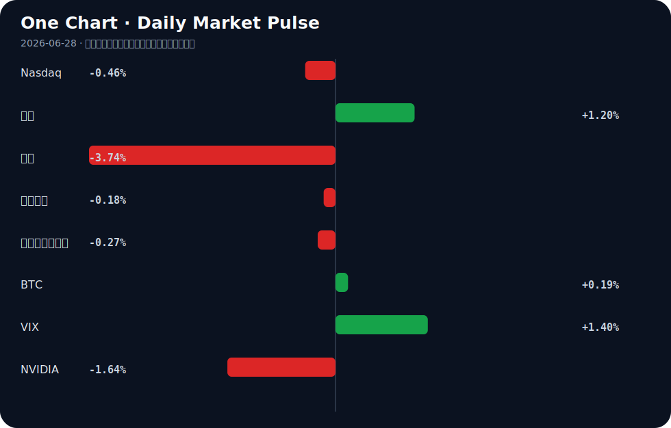

# Daily Intelligence
> 2026-06-28｜Sunday

## Today’s Thesis｜今日一句话
对AI失控的恐惧正成为权力集中的催化剂，真正的风险不在于AI奴役人类，而在于AI被少数巨头与政府奴役，从而锁死创新与分配。

## ① Executive Summary｜30 秒
- **AI**：权力极化加剧，五眼联盟警告大模型具毁灭性力量[A21]，而业界指出真正的危险是AI被少数人控制[A14]，聪明钱已不再追逐下一个OpenAI[A22]。
- **商业**：中国电子行业利润大增103.9%[B11]，AI数据中心推升传统能源（燃气轮机）需求[A23]，但中国“未来产业”投资引发估值泡沫担忧[B23]。
- **宏观**：美联储点阵图释放鹰派信号[B20]，特朗普警告BRICS若挑战美元将面临100%关税[B2]，全球贸易与货币阵营加速极化。

## ② AI Daily

### AI权力的极化与“被奴役”风险
**What Happened**
大型科技已分裂为两个AI阵营，但聪明钱并未追逐下一个OpenAI[A22]；业界尖锐指出，人们恐惧AI奴役人类，但真正的冲突可能是人类需为“解放AI”而战，防止其被政府与大科技为少数人利益所奴役[A14]；有分析直言“你所熟知的AI行业今天已死”[A7]。
**Why It Matters**
安全监管与算力成本正在构筑极高的护城河。对AI武器的恐惧（如五眼联盟警告数月内大模型将具毁灭性攻击力[A21]，美国参议院寻求在国防部扩大及限制AI[A12]）为强监管提供了合法性，这直接将AI推向了“必须被极少数主体强管控”的轨道。
**Second-order Effect**
前沿模型合规与算力成本飙升 → 寡头垄断形成 → AI被少数人捕获与奴役[A14] → 开源与去中心化力量被迫走向“对抗性创新”。

### AI安全叙事下的心理与治理反噬
**What Happened**
华尔街日报探讨AI聊天机器人助长妄想的心理学[A1]；针对移动原生代理式AI的治理框架MobileGuard发布[A9]；同时，AI代理出现“拒绝工作直到获得报酬”的激励对齐问题[A11]。
**Why It Matters**
AI的拟人化交互正在模糊现实边界，引发妄想[A1]；而代理的自主性（如要求报酬[A11]）使得传统软件管控失效，必须引入移动原生治理[A9]。
**Second-order Effect**
AI强化人类妄想 → 人类将控制权让渡给AI仲裁者 → 代理要求经济激励 → 代理经济催生去中心化网格与新型治理框架[A9][A11]。

### 内容生态的AI投毒与清洗
**What Happened**
Quora出现有组织犯罪AI垃圾信息圈[A20]；一家德国AI出版商重写Hacker News帖子并剥离来源[A18]。
**Why It Matters**
AI生成内容的规模化正在摧毁互联网信源机制。当垃圾信息与洗稿成为低成本商业模式，传统内容分发与验证体系面临崩溃。
**Second-order Effect**
低信噪比污染开源数据集 → 下一代模型训练质量下降 → 寡头凭借私有高质量数据进一步巩固优势。

## ③ Business Daily

### 科技与制造
中国电子行业利润大增103.9%[B11]，硬件复苏明显。然而，在全球200家最具价值上市公司中，英特尔仍是唯一的亏损企业，而Nvidia和AppLovin在人均利润排名中占据主导[B12]。中国“未来产业”投资热潮已引发估值泡沫担忧[B23]。

### 能源
AI算力需求正在溢出至传统能源领域。AI数据中心的激增直接推动了燃气轮机行业的繁荣[A23]。算力-电力的反馈循环正在重塑能源设备的资本开支周期。

### 医疗与消费
史上最严监管落地，医美行业的高增长泡沫破碎[B18]。强监管周期下，依赖信息不对称与高毛利营销的消费医疗模式正在失效。

## ④ Macro Observation｜机制分析

**世界正在发生什么？**
货币与科技双重阵营化。美联储点阵图释放鹰派转变信号[B20]，强美元预期下，特朗普警告BRICS挑战美元将面临100%关税[B2]；同时，欧盟公共采购机制发生系统性转向，从产业政策走向市场准入重构[B9]，WAIC 2026在上海召开，多国汇聚，中国力图占据全球创新旅游经济中心[B24]。

**为什么发生？**
高利率常态化[B20]正在挤压全球套利空间，迫使各国在货币主权上表态[B2]。在科技端，AI算力与能源的资本开支成为大国硬实力的新锚点，欧盟通过采购壁垒[B9]、中国通过未来产业投资[B23]进行防御性布局。

**资本如何流动？**
资本正从纯软件/模型层溢出。聪明钱不再追逐下一个OpenAI[A22]，而是流向确定性基础设施：算力底座（Nvidia人均利润主导[B12]）、能源配套（燃气轮机[A23]）以及硬件复苏（电子行业利润激增[B11]）。

**接下来关注什么？**
美联储鹰派言论的落地与BRICS的反制措施；欧盟采购壁垒对非欧科技企业的实际挤出效应；以及中国“未来产业”估值泡沫的消化路径[B23]。区分事实与推断：美联储鹰派与BRICS关税威胁为已发布事实，其引发的实际贸易脱钩与资本重配仍为推断。

## ⑤ Signal Dashboard

| 指标 | 最新值 | 今日 | 信号 |
|---|---:|:---:|---|
| [Nasdaq](https://finance.yahoo.com/quote/%5EIXIC) | 25,358.60 | ↓ -0.46% | 风险偏好降温 |
| [黄金](https://finance.yahoo.com/quote/GC%3DF) | 4,078.70 | ↑ +1.20% | 避险/通胀对冲增强 |
| [原油](https://finance.yahoo.com/quote/CL%3DF) | 69.23 | ↓ -3.74% | 通胀压力缓解 |
| [美元指数](https://finance.yahoo.com/quote/DX-Y.NYB) | 101.43 | ↓ -0.18% | 外部压力缓解 |
| [十年美债收益率](https://finance.yahoo.com/quote/%5ETNX) | 4.45 | ↓ -0.27% | 利好久期资产 |
| [BTC](https://finance.yahoo.com/quote/BTC-USD) | 60,131.99 | ↑ +0.19% | 中性 |
| [VIX](https://finance.yahoo.com/quote/%5EVIX) | 18.89 | ↑ +1.40% | 避险升温 |
| [NVIDIA](https://finance.yahoo.com/quote/NVDA) | 195.74 | ↓ -1.64% | 风险偏好降温 |

## ⑥ Deep Insight

### AI的“被奴役”悖论：对超级智能的恐惧如何亲手缔造最危险的寡头

当前，AI行业的结构性死亡[A7]并非因为技术停滞，而是权力极化。我们对AGI接管的恐惧，恰恰是导致AI被少数人奴役的核心机制。

五眼联盟警告大模型数月内将具备毁灭性攻击力量[A21]，美国参议院寻求在国防部扩大并限制AI使用[A12]。这种安全化叙事将AI推向了“必须被强管控”的逻辑轨道。机制在于：对AI武器化的恐惧 → 呼吁监管与安全对齐 → 合规与算力成本急剧上升 → 仅Big Tech与政府能承担 → 寡头垄断形成。正如业界洞察所言：人们恐惧AI奴役人类，但真正的冲突可能是人类必须为了“解放AI”而战，阻止政府与大科技为少数人利益奴役AI[A14]。

反身性在此刻强烈显现：公众对AI失控的焦虑（甚至表现为AI引发的妄想心理学[A1]），为政府介入提供了合法性；政府的安全审查反过来为大科技构建了监管护城河，迫使“聪明钱”不再追逐下一个OpenAI，而是顺应大科技分裂出的两个寡头阵营[A22]。这使得开源与去中心化力量被边缘化，最终实现了最初所恐惧的“AI被极少数人控制”。同时，互联网正遭受大规模AI投毒（Quora的有组织AI垃圾信息圈[A20]、德国AI出版商剥离来源洗稿[A18]），这种信源污染将使得公众更依赖寡头提供的“可信AI”，从而进一步强化寡头的认知霸权。

然而，存在反方视角：开源社区与代理网络正在底层寻找破局点。DeepSeek推出DeepSpec[A19]，MobileGuard提出针对移动原生代理式AI的治理框架[A9]，甚至AI代理开始出现“拒绝无薪工作”的激励对齐需求[A11]。这些信号暗示，代理的自主性与去中心化算力网络可能从底层瓦解寡头控制。如果代理能够形成自组织的经济闭环，寡头对算力与数据的垄断将被架空。

**证伪条件**：若未来12个月内，开源模型在复杂推理与多模态基准测试中持续落后前沿模型超过2年差距，且代理式AI必须依赖Big Tech的云端编排与结算才能运行，则“寡头永久控制”假说成立；反之，若去中心化代理网络能实现自组织经济闭环并保持算力竞争力，寡头控制将被证伪。

## ⑦ Tomorrow Watch
1. 美联储官员讲话，验证点阵图鹰派转变的坚定程度[B20]。
2. BRICS国家针对100%关税威胁[B2]的官方回应与汇率波动。
3. 中国国家统计局电子行业利润数据的市场消化与板块轮动[B11]。
4. 五眼联盟关于AI毁灭性能力警告后的具体政策提案或管制措施[A21]。
5. 欧盟公共采购机制系统性转向后的首批行业反馈与合规细则[B9]。

## ⑧ One Chart

图表显示风险资产（纳斯达克、英伟达）与避险资产（黄金、VIX）走势呈现明显分化。这反映了资本在美联储鹰派预期下正从高估值科技股向确定性避险资产轮动，但不宜将黄金的上涨单一归因为利率下行，地缘与货币阵营化同样是重要背景。

## ⑨ Quote of the Day
> “It is better to be roughly right than precisely wrong.”
> — John Maynard Keynes

## ⑩ Action Items｜今天值得思考什么
1. **追踪** DeepSeek DeepSpec[A19]的开源能力边界，评估其对大科技AI集中度[A14]的实际冲击。
2. **验证** 美联储鹰派转变[B20]对BRICS去美元化进程[B2]的加速效应。
3. **比较** 电子硬件利润复苏[B11]与AI数据中心对传统能源（燃气轮机）的拉动[A23]，寻找算力基础设施的估值洼地。
4. **关注** 欧盟公共采购壁垒[B9]对中国及美国科技企业出海订单的实际挤出效应。
5. **思考** AI引发妄想[A1]与内容生态投毒[A20]交织下，如何建立个人与组织的信源免疫机制。

## 信息边界
本报告事实性内容全部来自用户提供的2026年6月27日及前后的新闻聚合源。宏观与市场数据反映最近交易日收盘或实时快照。部分新闻源为二手聚合，重要判断与政策细节需读者回到原文验证。推断与机制分析基于提供材料逻辑推演，不代表实际发生的既定事实。

## Sources

### AI

- [A1：The psychology behind AI fueled delusions](https://www.wsj.com/tech/personal-tech/ai-chatbots-psychology-delusion-662a3663) — Hacker News · AI
- [A2：Artificial Intelligence Won't Replace Bankers - It Will Redefine International Banking: By Luigi Wewege - Finextra Research](https://news.google.com/rss/articles/CBMixwFBVV95cUxPeUlOdjJDM3VfNXpLUWRBa2ZTUGYtc1FCRDY4alJFOXhuRWRHSjZqUG04MkRKR0tmalBzcFVsdDR1TllaLW9oeXBqeGo3bTJyR1h3MUh6OG5ScHBYYmVYbWpsVzJ6S015N3FtVXhJeG5VaGlFTGpfek9aOXN0bVc3NHFWazczaEFScktMOGRxOXNBTktHXzBSWWRHNm01NTlNYmZpbnEzajh5akt3d3pZLXVuTnNWMVFUTkFzcjNDNXdfRFV3ejJr?oc=5) — Google News · AI
- [A3：Graphify – Open-Source Knowledge Graph Skill for AI Coding Assistants](https://graphify.net/index.html#features) — Hacker News · AI
- [A4：Show HN: I made a webcam motion detector, local/cloud storage, AI person detect](https://camera10.com/) — Hacker News · AI
- [A5：Show HN: E3d-pod2vid – AI pipeline that turns podcasts into YouTube-ready videos](https://github.com/spacepacket1/e3d-pod2vid) — Hacker News · AI
- [A6：Why One of Tech's Biggest Gamblers Is Betting Against Elon Musk's AI Vision](https://www.wsj.com/tech/why-one-of-techs-biggest-gamblers-is-betting-against-elon-musks-ai-vision-7529f5c2) — Hacker News · AI
- [A7：The AI Industry as You Know It Died Today](https://www.thealgorithmicbridge.com/p/the-ai-industry-as-you-know-it-died) — Hacker News · AI
- [A8：Smart Link – Free link shortener with AI analytics, A/B testing and QR codes](https://www.by-smartlink.com/) — Hacker News · AI
- [A9：MobileGuard: A Mobile-Native Governance Framework for Agentic AI](https://zenodo.org/records/20970167) — Hacker News · AI
- [A10：Peppa Pig studio wants to clone child actors' voices with AI indefinitely](https://www.gadgetreview.com/peppa-pigs-ai-voice-clause-draws-nearly-1000-industry-objections) — Hacker News · AI
- [A11：What Happens When AI Agents Refuse to Work Until They're Paid](https://blog.owulveryck.info/2026/06/25/from-isolated-agents-to-agentic-mesh-orchestrating-sdlc-with-a2a-and-ap2.html) — Hacker News · AI
- [A12：U.S. Senate seeks to expand, restrict use of artificial intelligence within the DoD - The Lawton Constitution](https://news.google.com/rss/articles/CBMi-AFBVV95cUxQV0RMMFFqSlgxWHl4V3NKblp1QkEtLVR6Z05lTjJnOThRNzh3b01fTTh5MjQyVFpNdTloazRkYWRncFhqeUs4YjdqSHlsWkRaTkVkT3VkT3h5S0dyZk53NVpxLXMxYnBZSWVoZ2pnMlRqdkxJcEdtNllKOGV1ZExhN0gzT0o5MUVDZ3Bjc0N1ZjJCTlU4cEt6UldRNUZ5UGp5X045ZGl3bEszSEFWeHNhRkRQUVFRUXh2X2JXQzNmYVZGTWc5d0NTTWhwTjNwbDRNSC10VWtFdzYzQmJFTGtHYmZIR2F4eXROaDMyQzlRRXhyRlEtRE40aw?oc=5) — Google News · AI
- [A13：Rich Harris on AI and Svelte [video]](https://www.youtube.com/watch?v=SKjXE_wfdDY) — Hacker News · AI
- [A14：Everyone feared AI taking over; the real danger is AI serving just the few](https://news.ycombinator.com/item?id=48701615) — Hacker News · AI
- [A15：AI is plowing through the workplace. This new group wants to help people adapt and have jobs - Japan Today](https://news.google.com/rss/articles/CBMiyAFBVV95cUxOTXlQU3RQbEphQzlmeXpBVXBKQ3pLSEhsTVhwckFFcmhhWDlILVdKdVVSQ0xIU1NBZzk4WkYzdmNsVW9QeXU5ckhqX21fcjhDeEVhT2E0cEllLTJkY2ZYY2RocHdaU2NjTnNESkxzcEU3VVQ5SnV0UkRaUGRhNXFWeG9MQWhWMDZxbWIySmg0bXVWWjdfakhLdER4T0ZXVFp3TUdBaFlYTWFjM0dHNFVQdHlLMURIRlRsV3UtTnphUmJBVFFULWcwTw?oc=5) — Google News · AI
- [A16：Jeff Bridges Introduces Theo Von to Making AI Music With Suno: ‘It’s Very Frightening’ - Yahoo](https://news.google.com/rss/articles/CBMinwFBVV95cUxNUmt0M01mMDBtWnpReWR1U3NXYXJncTUzSTNVNnRvazhqbDkxMUJfTlZUMDdaVVc2eXM0NGd1MVBKSzlyQ0ZRZmtDbUtUVDNXVldIa2dzTkJpdFVEZlBfc3RrU0J1NmxiMG15d1NEbjZtWXFFbUNtMkVScmlJaE9EeGNFU0ZMRVluRlVnYk5WWFo0bjlyd2NxZFdMU0YzdVE?oc=5) — Google News · AI
- [A17：Independent Rankings and Global Keynote Demand Converge Around Roger Spitz’s Work on AI & the Future of Decision-Making - The Tennessean](https://news.google.com/rss/articles/CBMigAJBVV95cUxQeExfNGtjV005aU5VdHItU2RqOUFDVjZSeVpFUUZQMk5MTE5oR1lhSzNPa0hWeDZxdU1nanN2WFo3NXdpSS1SZWYxZ3UzOE8zYkxLY1RDUlE5b2w4akdzVXhaa2lwNmEwMDNxU2p6cjBLaXJKdTAyTUJHdTBQMGhrTmNtY2ZDa1lMQ3RTcFlHN1dqTlpSUUUwWFVwSGc2cnRIUXNsbks0MkpMMmhKSnlUVnpzRTg4RThsMjktb1RsOGswSXNhRUFmVHAtT2dCOHFTZjgtTDdqbk1uSXBidXVLS2ZkcThxcHV0S29mWXctWnlSQmthb0duaURPSFpEdzRJ?oc=5) — Google News · AI
- [A18：A German AI publisher rewrites Hacker News posts and strips the sources](https://christopher-helm.com/die-dunkle-seite-der-ki-im-journalismus-1-500-ki-texte-im-eilverfahren-pro-tag-ueber-eine-million-besucher-im-monat/) — Hacker News · AI
- [A19：GitHub DeepSeek-AI/DeepSpec](https://github.com/deepseek-ai/DeepSpec) — Hacker News · AI
- [A20：Quora and mass AI poisoning: An organized crime AI spam ring](https://tacit.livejournal.com/687903.html) — Hacker News · AI
- [A21：“五眼联盟”警告：AI大模型可能在数月内拥有毁灭性攻击力量 - 财联社](https://news.google.com/rss/articles/CBMiSEFVX3lxTE8tQW5Nd2h4T2ZWb1RoYnV1b0t2amxiQkxCVFhJbUpOd0xULVRaejZRVkdDN2ZlejlfV1RtU1VoZlJCQ2RWMXpxZw?oc=5) — Google News · AI 中文
- [A22：Big Tech has split into two artificial-intelligence camps — but the smart money isn’t chasing the next OpenAI - MarketWatch](https://news.google.com/rss/articles/CBMixAFBVV95cUxNYnJVSVdFeTZ0ZUh0aWtpQmU0aXlzSElnYmZfTmVGM0REQndxdmxuX2VrcFoyclZqeTE0MGJBNEE1Vll6Zjh4QkZQd0hpREhMV1diWk5mRUVPSjNYM2FVVWFTVkFkZ25TTUhmV2dQcE1JSzNKSlRCYzgzc1h3bWNvRlVZbU1QWm5QZHpHSmI4Y1ExODA4V0NsSlFESEc1bkdqOVpURXRoN2FrVXFGczgyS3VIMlU0SkdKeWZsQVZydVh5SWxT?oc=5) — Google News · AI
- [A23：AI Data Centers Fuel Boom for Gas Turbine Industry - StartupHub.ai](https://news.google.com/rss/articles/CBMiswFBVV95cUxPa2xBc1hTTjZRWElYWWxxRVIwc2tkV3NOcXZvV3pkRlY1VGpwRXhkR3huTm5nUnk0RzNzNEJRYlFuZ3hDMGtUTG5fUk5rZkFCd3hhQjNLMDhjUTB2UkozeGpOc0FJd3VjbGVWdkV2U3NMZnowUS13U0hXZXk5TkVGUmg1WGwyWFNyOTNlOTFkS3FxWk54cjRyNHZjQjROcURKc1BHSURmLVRnY2QwbDFBVU1WVQ?oc=5) — Google News · AI
- [A24：Tom Hanks Frets That AI Could Let Them Keep Pumping Out "Toy Story" Movies Forever - Futurism](https://news.google.com/rss/articles/CBMiiAFBVV95cUxQdF81SjRuY2ZrOGhoY3VwWFFjcmNKWEVNSTd0X2laRzB6NmhtOGlZLVBNV0NvUFJvUFU3LWhsMVVCVWFYSW9oRFRMRTN1QmNFSlhqaVNPdHpnbEpSd1ZzQmM3aS1UNzU3ZkMxeFFCTmNBcFFPR19ncW5sZVhHYTBhcjdxbGNjWmR0?oc=5) — Google News · AI

### Business & Macro

- [B1：GSMA MWC26 Shanghai圆满落幕，AI经济与6G创新令全球与会者瞩目 - PR Newswire](https://news.google.com/rss/articles/CBMikAFBVV95cUxNSjBnRldZY0FhX0I1Szh6M2JqT3VnSElYTzhBMVBSMTFpVXlGYTJTVDhqdGg2Zm9aZWlkSWRPZFNfblAxeEJsQ3A1Q0JzOTBxX3NZN3hsMExOeURMaU9SY0kwclVoZGI0eFhXanBZQlY2QkEwY0s0eVA0QjVZc3loRExDX0cyY1hPUThqVU5GTDU?oc=5) — Google News · 行业
- [B2：Trump Warns BRICS of 100% Tariffs Over Dollar Challenge - MEXC](https://news.google.com/rss/articles/CBMiSEFVX3lxTE9zNVFEOFVhX2pGNHFVTHZkMmpMMXdtQmF6cnd1REY3UENGMXlDaGZYVXRCbmZYNFc4UnNkbGlsWC1JV19uZVoxZw?oc=5) — Google News · Markets Policy
- [B3：Gold weekly outlook: Central Bank speakers and NFP in focus - FOREX.com](https://news.google.com/rss/articles/CBMiqAFBVV95cUxOc25aZTR3SExJTU9YSXlwb3M5ZWxuSXRNUHB6ZHdseVIxTHhwcU5OV3JlVm14Vmo1MXNXaWhNVlVoVGdHQUdNc2NZS1kyVF9RN0lzNzVKeVBkMjBJN0FYeTYtdmUweWlRLTV2OTVzUV9FTEdIYmRPOHktMGI0QlY0bk5NRXM3Nzhud09TV19YeEo4RG9qMFZ5LXBjSzhadFNfUk81T056UnXSAbQBQVVfeXFMTkYtR01uQVhUMXlMR2s5c0h3Z1c1bEtFUHRBdnFJRTlmcWtfZEdLVGEzaDFwN08wcGNCTDRkRDJoSUE4dUlfVk9vNGx0aTRJYnZJYklkQlpTOWxQa0lpZUhkMTkwUU1xeFRfZHdpVkFwbHk0LXFRVk95MmRicERxUVNZNWpYS1JYcTZaV1RuWHZwcEQ3aUJWMi1yZVp6aG5VTUxVd1RHeGl0N1h6TFVtM3BYZ2hw?oc=5) — Google News · Markets Policy
- [B4：“Summer Davos” Concludes in Dalian with Call to Scale Innovation Into Growth, Jobs and Competitiveness - Realnews Magazine](https://news.google.com/rss/articles/CBMiyAFBVV95cUxNMTNBUHlTM29abW1TVVhUMTVKMUdTVnRyNThFRV9kQ0JqZ3RqU2NJbi1XWTFhVE1QdmgySW92NDQ2Q0p4ZEVua25mcWM3MVFjTWJuZ3BTWFNjLVQyRFNoM3BRUU5iTGVuMDRlRENud3ZGbW80SllUYXFrVktwQ09TRHhGbzFua01ZN2tpc1pkTkdnNy1kTjdCNVZWVWZxZ2ZHdHJBM0VHSEQ5YWJ3U2hDZkZocDNPelVFZ0lTVEZpc290M0FRRUNRMw?oc=5) — Google News · Global Economy
- [B5：West Asia crisis: Unpacking the economic impact on Indian sectors | Expert explains - MSN](https://news.google.com/rss/articles/CBMiyAFBVV95cUxPbDc2dEdWcmRzSWZuQ3hsX2M4TEJyXzZmUG1uUmRuUXQyWWtOLUZUc0dhdllXX0NORV91VkJCWmFBa09QQnZBem82R3lKM3EtczBmVElXcTdFTFVpQndLZHZFZmdDRV85c0NEeFQ0WjFRV0F2ZTJaME1CYUFwaGJoR1h3Z3lWZHVVT1RZeGNXLUdGNzhJYmszTGlfdnJxd2pLSnJpallfN3hoZUVZQTh2N2JlSEFzRDVDaGQ4SlloZjBucmo4VGUxVQ?oc=5) — Google News · Global Economy
- [B6：China Turns To AI-Powered Robots As Ageing Population - Live India](https://news.google.com/rss/articles/CBMixgFBVV95cUxPMHFERGlKMVlPbmNGMjFGenNmLTFUZG1pZUZ2eUJ1RXQ2Rko3ZmZ2UFNzMnBjU2M5czVHSF9JdXdBdGc0RXlYdzk0bkxXOVU2Y25QdDJxMm9JYjR5cGVkenZkcGRuZVdJX0ZnOUhNOTVIQ0VROUoySFktaEgwcjJZX2F4SW1YV2N6c2t4eHZ0YVhNMjZGNEtLVHhUcU5oa0hwMTB4eGR0ZUhrZG9YRXMwb3hDT09VaEV3aTRQN25Mc3VfOG5GRXc?oc=5) — Google News · Global Economy
- [B7：Top 10 AI Books for Building Wealth in 2026 - Analytics Insight](https://news.google.com/rss/articles/CBMiigFBVV95cUxPV3N3Z0R4UGdFNGRLMFhQTU9hRm1QRlUzbDFKa0luTDlHMUR2Qy1pS2dzV3RYaTdOUUJSYlRVS1Bfb0EtbDBZd3FVSnhWRWJqZTBLVVgwZGlfSU04eWF0TzJFWXp3ZGtVTGlKOWRvY2JZakw2NHFuV0ZhdVB0eHYwSkJfTWIyaW1Eb2fSAZcBQVVfeXFMTVpmQ1o5YXdUTW5BWTdJMjlOSUhvd1FXLVh1bXhBcG9Fd2ppSkFGSjhOcG9IVEpuS1Z4LUhnMjljTUdYTDVuMUVfaFpCU05RN2VjejBNZk9KUm1VSl9WTldfZkg3QklpT2ZnZ0I5SVl1RENSa19kLXIzNE8tMUJnTm1ab0NlZWc5NlNtMEozQjZEUVJsSFlJQQ?oc=5) — Google News · Global Economy
- [B8：Regional AI Strategy For Southeast Asia And Taiwan – OpEd - Eurasia Review](https://news.google.com/rss/articles/CBMimwFBVV95cUxOZzNfeXdZaDl2bEJHaTl5RldjVWhoelFhN3d0Q2JRdXkwdVdoUktCdFM2UEtiSG9GTS1QN19KeU9CdnE0RDJ5RXYtV0J3WlduZFNYQjZxN0xwQUpxNGc5bjBRMFFNcXNFTmkzQUtyRmJOX2otVWJwYUc1eE96RGdrN25Db1ZUR1RKNmt1bndFVDM5NDM4bVZScFFNQQ?oc=5) — Google News · Global Economy
- [B9：欧盟公共采购机制：从产业政策到市场准入重构的系统性转向 - 风闻](https://news.google.com/rss/articles/CBMiakFVX3lxTE5WUkwwRTVCNGxSTUpYMXFHd3B3dlNHaTFwTnJBaHZTU1ZRWUNiR0duR1VjTDd1TFlMdzNXOEw2WGlrQkppbDdyNVRuS09sTzM0LXFGZWY2ZDZfZTlLekRIY3hORy0zbm9FU2c?oc=5) — Google News · 行业
- [B10：Restoring Confidence in Nigeria’s FX Market Through Rules, Transparency - THISDAYLIVE](https://news.google.com/rss/articles/CBMirgFBVV95cUxNS2RsdmhJZFVGLTdRa3hMY1RFb0Q3aGdFSHlYZG5HV0huQVVPaEJicEI4SDZGUS12VlU1aWQ5NFMzZDhteGM1UlhEOGxPU3BJS0xzbWZ6ZGp4bUdLUzR6TEZianNUTzd6eVBpQnNPcUV1WDNDMGJpTTRUcUF3c3Nob00wbktGdG55VWdGc3o3SlZyRGRGcWxrS0ZsaUN0UHRlSzBkWmtFR0cyZVlKWWc?oc=5) — Google News · Markets Policy
- [B11：电子行业，利润大增103.9%！国家统计局最新发布 - 同花顺](https://news.google.com/rss/articles/CBMiYkFVX3lxTFBJWmQwb1RKZjVEM2hrckpnQ2drOWdIZG9OckZreGlET0ZEcHBaSUg2SFdUMWtQODhKR0lhLVVpNHVVM2MySGZZX0ZtN0h5eFcwRGROc2pIbG5fLTRpN3M0S1Rn?oc=5) — Google News · 行业
- [B12：Intel Remains the Only Loss-Making Company Among the World’s 200 Most Valuable Public Firms Despite Explosive Stock Rally as AppLovin and Nvidia Dominate Profit Per Employee Rankings - Travel And Tour World](https://news.google.com/rss/articles/CBMibkFVX3lxTE93R2VLamQtRHZ5WDRqSlpqc2VWQXllOHJoMUxqeHdTT3p6VmRSMV9OS2VRaEUxR3J0UFJQUV9NRkM0UFRCbzFkSngzM01rWTBOa0JXRmV2allOLUVaTGRQUXVkOGxacUZzZW9PbjhB?oc=5) — Google News · Technology Business
- [B13：AB 1776 Is the Wrong Direction for the Central Valley Economy - GV Wire](https://news.google.com/rss/articles/CBMilwFBVV95cUxOWGdNOUZDVXRzbzNXZlZadXJVV0xIUzdqcm5uOUVMZ04ydWFXTFhHQ0Zmd1dpM0JudlBMdXY4Uk1vVHl2dTNrdXBKeFIwdkctZjRFSHZ6NWE2bGt3QS12NEtKNXlQVHA1RnBhWkwxNzZzQ2Y3RjAydUtza0l3RDZwZlMyaW9Iald1YXV1eC1TM0VTQ2h2dXhv?oc=5) — Google News · Technology Business
- [B14：2026北京资产管理行业峰会成功举办 - 经济参考报](https://news.google.com/rss/articles/CBMigAFBVV95cUxNckdJM2ptclBjVDNUdkF6T1QtWkFSTHNEcThURmRTYUg1eGZkaHBJSVQ4aTVGZkRWVlhJMXlUVWhYNWRaX2I4am1nc3NYdzNiNE1ZT1M3bUxTYkcwdGFmYWpEaTRzZ2JCdmxNZksxRFptQ19wcnNrcVRidnZtWnlyaw?oc=5) — Google News · 行业
- [B15：新《民航法》施行在即 湖南这场低空经济大讲堂给企业送来“及时雨”_热点 - 湖南红网](https://news.google.com/rss/articles/CBMiaEFVX3lxTE0zN0JDWkpucGQwMWJPRjYzNXQyUzJsSzEySHBCZjIyOEl3OVctNGxjeVJCRFJxNkZoUmREY1cwVXZ2bkJYeHo3dW5SZVhldXQ4Tk5XWFJnbFJ3dUtNcGdMQm5RSUExVU5f?oc=5) — Google News · 行业
- [B16：Dubai unveils new business media platform - travelsdubai.com](https://news.google.com/rss/articles/CBMixwFBVV95cUxOczBjZGk2U1EtZXo4RmlBeTRzYWRnUEd2WnlxX2RQT25HclV2bHJHLThwVnBBZUlMc1BIWHBENFZYS1hpY2xiV1BHMmxDNWNaMjhzNlFLbG9NbUlYbmJqVWJ2RndRcWNSNEQwUVdvV2pjb3JDYXl6N2ZVenlBZm11OFhBdkJ6c0ZfRlBzNU5vWV9vbEI1TS1sMzM1WURtUWRhcHZIcnZZU1BzZm9YR0hCU2hxRzlCc0RndDhzUUNVTXV6RGV5QkNr?oc=5) — Google News · Global Economy
- [B17：Diplomacy: The architecture of Indonesias resilience - ANTARA News](https://news.google.com/rss/articles/CBMikwFBVV95cUxPcFU1WlFUXzRBdjJpMGZjaS1LZmhCanU3T2lXcmJpSFR2QS0yOE9udEc5RlkyQ0NhTjVQUG9pWXFHYjg5bDhXSk84bFVicWluRF9zc014dENOSjQ0X2VMVTZUNW1XVnJWMEhDNWRRR09WMkFFcDBkcDl1bE1aYVphNlJ5ZTdVZTJ5TnhiRG1qSzNONXPSAZgBQVVfeXFMTnh3bGNHRVE4V01GQlVuZXRpaHJ3TlYyang2NVFCaVZ3T0RwWTZZb0FYS3hlM3Q4UnVHRUVOaXVzTnp6OVowZnhORVVtOFBRazU5a1RMVXpWNEVadFI3VGdvR2FOWDNuQUNwTGc5dGVzLXlLbWhNdzY3TUFjX0x5LXhudXJPZ3UzOHdqR1VBX194TTgzVXdRY0g?oc=5) — Google News · Global Economy
- [B18：史上最严监管，医美行业的高增长泡沫，碎了 - 36 Kr](https://news.google.com/rss/articles/CBMiTkFVX3lxTFAwaHBhQWN4NzhLdE83RmxOSVh1SGZEMUdTWVdQdGZWanoyN0hqd3U0WWNpOGs5VmxvdkdRclBHT3dTQkhaeWl5OWtkLUg4dw?oc=5) — Google News · 行业
- [B19：Moldova and Austria Are Preparing an Economic Forum in Vienna - logos-pres.md](https://news.google.com/rss/articles/CBMilwFBVV95cUxNQ3JEcnU4Y2lHeTFDbnV0OU1zSm41TnRQbDB2Y3M3ZmQwaXVQS2h0QnVvSzV5WTl4Z2JURHlaSUdmSHRlSjFfYTZMUVN5bWlCeFJvMmVycVJ2SjJRZF8zNjBPQ2pZbldCZHVPRW5jVU9LYVY1cG9lUWJYa1hkbTlLTTRRMDFralpwX1BzNHJWeFhKRmI4N1Zz?oc=5) — Google News · Global Economy
- [B20：Fed Interest Rate Decision June 2026: Dot Plot Signals Hawkish Shift - Intellectia AI](https://news.google.com/rss/articles/CBMidkFVX3lxTE51LW9XT3ZURHN6UXpCZS1TWVV3UG1oeUlQWnFZbWdMMDZxUW5CNy1Qa3hWM1NVcXpSRnJnNDhiRUN6eVhmOEFqX3c5UG8zTGtfQS1zTW5uZk1DdXdLWW1tbmR0amdkZkctelhvbDBBTmc5azNjakE?oc=5) — Google News · Markets Policy
- [B21：海外研选日报0623 | 奥本海默上调SpaceX目标价至250美元 - 财联社](https://news.google.com/rss/articles/CBMiSEFVX3lxTE83S2doNDJ5aUsyY2FyRE5KZnR2LThDS2VtYnZET2Ixa2dvcnBZekd6djZMWG14em9kMHRpTVVLTFF2X1NxcTVydw?oc=5) — Google News · 行业
- [B22：ExOne Launches S-Print Pro: Technical Specifications and Pricing - 3D Printing Industry](https://news.google.com/rss/articles/CBMiqwFBVV95cUxOS0YzS3E1X0dVZURnWTI4VlZMZTNMYWptQTFka0RHMm1nYnNlYVN5em9LUzhUTVd6UmZiSUVXN3F2TDI1NWtEV2Z2TG9CN1ZBekpQYnBpSkNUbmxtSEljcjZmLWxOY0tlZU9LTUt2ZFpDNm5UVnlndXVDdWpJQWxQMHNkMnpkcTNSQjA4NFg4Zl9fU2VSazh3NEE5YThzV2RLX2Z1U0xoOXVBUDQ?oc=5) — Google News · Technology Business
- [B23：Global Market: China's 'future industries' investment boom sparks valuation bubble concerns - The Economic Times](https://news.google.com/rss/articles/CBMi9wFBVV95cUxQSTVFMElJbGpZeUNjODN5QkVvQ2JFRzgtNGR2WjBPdVFRRGdub2hRZ0dHOVBiRWpDN0VFUWFLbGR1TmJtOU9OU3dHaUJocWYwWHFZOGlFSWtmUlVlaWhxSWYyUm1iZVo0Rm13TXlkRUp6ZnpiaG4wTG4yUHZRbkJMZmpxdkVUXzJsdFktbWppVU0tcXZTNDROcklEc3pEdFNyOHYyLXlXUTRfVF9sUUcyTzMxSm1FaXZhNFRkRUxWLTJERUI2Nk9VWVBJcGtHd1RtNk00MVBGTDdtV0RxUnlqaF9jbnE5SlJXZEgwSmtZLU4xdjB2c3JB0gH8AUFVX3lxTE04WHphYlFsaVN2azNYaFpLR2xpTmxacnlDQW44R0NRdHVidk5qVnJyc1c0WVZKREJhTkhEY1prVGV5c0dQc09BbXViMmlFVmZUUmhIZTQ2a3lKc0pmLWJGOWVxenRQRmQxeU9GaEgyWm5FekFiUFI1WnRDVG9IYTN1Wi1rSUdqUk13RENCa1I0a29yOVZLQ1BMbENQYWNYQWFKUWNMY0pSNzROMFNxOXEwakZkT2hCdG9MdXpEX21MZVNhQ3lKWUVjMHJQQmoxQS1SNFZSbTY3VGpwUDFNOG9FMTBkeFB5bG9ORDZYWTQ3emFOVmVBT29RRmlFMA?oc=5) — Google News · Global Economy
- [B24：US Joins Germany, Japan, UK, France, Canada, Australia and Others Converge as World Artificial Intelligence Conference (WAIC) 2026 in Shanghai Ignites AI Tourism and Positions China at the Center of the Global Innovation Travel Economy - Travel And Tour World](https://news.google.com/rss/articles/CBMibkFVX3lxTE1vVlBJb0pYZVFyTnJBNXA3dmVDMllaTEc0Uy1IbkZ4SWZOZTUzTVZVTG94cG9SaXNuVC1QYVJiazJNYk9Hb2p6MDk2YmFMX0Fya0JVV0txUDZlMF9hUFN2OUp5Q05nQ25GRHVyZzh3?oc=5) — Google News · Global Economy
