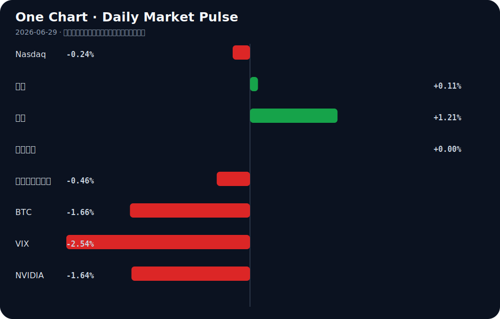

# Daily Intelligence
> 2026-06-29｜Monday

## Today’s Thesis｜今日一句话
AI基础设施资本支出正进入不可逆的重资产锁定阶段，而宏观利率的"Higher for Longer"正在加速淘汰缺乏自洽商业闭环的AI应用层公司。

## ① Executive Summary｜30 秒
- **AI**：SpaceX豪掷600亿美元押注AI [A18]，AI云与基建股狂飙 [A17]，资本正从概念炒作转向基础设施与垂直整合的确定性。
- **商业**：医疗AI达成25亿美元重磅合作 [A6]，美国制造业脱钩法案推进 [B12]，新兴市场产业链加速向高附加值跃迁 [B18]。
- **宏观**：新任美联储主席沃什首秀按兵不动，释放"Higher for Longer"鹰派信号 [B15, B16]，美元创13个月新高 [B14]，全球资本在滞胀边缘重估久期资产。

## ② AI Daily

### 1. SpaceX的600亿美元AI豪赌
**What Happened**: SpaceX投入600亿美元于AI，引发其是否在构建下一个亚马逊的猜测 [A18]。
**Why It Matters**: 轨道数据与算力的结合是终极护城河，马斯克正在补齐xAI的物理世界数据与算力基建短板，资本开支规模已脱离传统创业范畴。
**Second-order Effect**: 卫星网络与AI的融合将催生离线原生大模型，边缘算力需求激增，传统云厂商的垄断地位面临地缘与物理维度的挑战。
A → B → C: 星链数据获取 → 专属算力基建构建 → 离线原生AI模型涌现 → 边缘计算重塑云格局

### 2. AI制药的百亿级兑现
**What Happened**: Insilico与SK启动最高25亿美元的神经免疫AI药物合作 [A6]。
**Why It Matters**: AI在药物发现领域的价值不再停留在降本增效，而是直接对赌商业化里程碑分成，这是AI应用层罕见的重资产兑现。
**Second-order Effect**: 传统药企的管线估值逻辑将被重写，AI靶点发现能力从外包服务升级为核心资产，未拥抱AI的药企面临管线枯竭风险。
A → B → C: AI靶点发现 → 缩短临床周期 → 里程碑付款兑现 → 药企重估AI管线资产

### 3. 垄断警告与自主代理的崛起
**What Happened**: 纳德拉警告AI不能掌握在少数人手中 [A14]；Nearform提出"代理构建代理" [A24]；警察对AI的使用规则滞后 [A11]。
**Why It Matters**: 算力与数据的寡头化趋势加剧，但技术底层的自演化（Agent构建Agent）正在提供一种去中心化的反制可能，同时引发监管失控担忧。
**Second-order Effect**: AI开发成本的结构性下降可能打破巨头垄断，但也可能因自主代理的不可解释性引发社会系统的监管熔断。
A → B → C: 算力寡头化 → 开源/代理自演化反制 → 开发民主化 → 监管滞后性风险爆发

## ③ Business Daily

### 医疗
AI正从辅助工具向核心资产跃迁。Insilico与SK达成最高25亿美元合作 [A6]，RBC覆盖GE医疗 [B2]，显示资本正重估AI在药物发现与医疗交付中的现金流生成能力。医疗行业的高毛利特性使其成为少数能覆盖AI高昂折旧成本的应用领域。

### 制造/供应链
全球供应链在政治经济学与成本间重塑。美国民主党推法案减低对华依赖 [B12]，越南向高附加值跃迁 [B18]，而孟加拉国服装业陷入亏损裁员 [B5]，德国受汽车业拖累 [B3]。低端制造正在寻找新洼地，中端制造在政治压力下回流或转移，中国的机遇在于创新驱动 [B20] 与银发经济 [B11]。

### 通信/基建
网络即计算机。英伟达倡议6G与AI融合 [A20]，SpaceX 600亿投AI [A18]，通信网络正从传输管道演变为AI算力的物理延伸。缺乏算力与网络协同的芯片将拖累整体AI进度 [A13]。

## ④ Macro Observation｜机制分析
**世界正在发生什么？** 全球进入"Late cycle, last dance" [B6]，新任美联储主席沃什维持利率不变，确立"Higher for Longer"基调 [B15, B16]，美元触及13个月新高 [B14]。

**为什么发生？** 通胀粘性与政治压力迫使美联储维持高压。尽管存在对特朗普政策的担忧，外资仍在买入美元资产 [B14]，这构成了强美元的反身性循环：美元强 → 资本流入 → 美元更强。

**资本如何流动？** 资本正从高风险长久期资产（BTC↓, NVDA↓）流出，转向短期确定性（美元资产、5年期国债 [B4]）与结构性新兴市场（越南跃迁 [B18]，发展中经济体拥抱自由化 [B1]）。BIS警告稳定币可能碎片化全球金融体系 [B7]，反映了流动性在寻找法币体系的高压替代出口。

**接下来关注什么？** 关注美元强势对边缘新兴市场（如孟加拉国 [B5]）的债务抽血效应，以及"Higher for Longer"是否最终刺破依赖廉价资本的AI基建估值泡沫。

## ⑤ Signal Dashboard
| 指标 | 最新值 | 今日 | 信号 |
|---|---:|:---:|---|
| [Nasdaq](https://finance.yahoo.com/quote/%5EIXIC) | 25,297.62 | ↓ -0.24% | 中性 |
| [黄金](https://finance.yahoo.com/quote/GC%3DF) | 4,083.00 | ↑ +0.11% | 中性 |
| [原油](https://finance.yahoo.com/quote/CL%3DF) | 70.07 | ↑ +1.21% | 通胀压力上升 |
| [美元指数](https://finance.yahoo.com/quote/DX-Y.NYB) | 101.36 | → +0.00% | 中性 |
| [十年美债收益率](https://finance.yahoo.com/quote/%5ETNX) | 4.37 | ↓ -0.46% | 利好久期资产 |
| [BTC](https://finance.yahoo.com/quote/BTC-USD) | 58,943.42 | ↓ -1.66% | 风险偏好降温 |
| [VIX](https://finance.yahoo.com/quote/%5EVIX) | 18.41 | ↓ -2.54% | 风险偏好改善 |
| [NVIDIA](https://finance.yahoo.com/quote/NVDA) | 192.53 | ↓ -1.64% | 风险偏好降温 |

## ⑥ Deep Insight
当前资本市场对AI的定价存在一个危险的共识割裂：一方面，基建层（如SpaceX豪掷600亿美元 [A18]、英伟达探索6G与AI融合 [A20]）正以不可逆的重资产投入锁定未来十年的算力底座；另一方面，应用层却面临商业闭环缺失的质疑，以至于Mark Cuban推测AI或将消亡 [A5]。这种割裂的根本原因在于，市场严重低估了AI从"数字幻象"向"物理实体"渗透时的接口带宽与能源硬约束。

苹果押注AI架构并明确相关成本 [A8]，实质上是在向市场摊牌：端侧AI的边际成本无法像传统SaaS软件那样趋近于零。当AI的推理需求从生成文本转向驱动物理世界（如自动驾驶、机器人、智慧城市临床试验 [A23]）时，数据采集、传输延迟与能源消耗构成了三重物理天花板。SpaceX的600亿支出并非单纯的GPU采购，而是试图通过星链解决数据传输与边缘算力的物理闭环，这是一种极其昂贵的系统级突围。

这形成了一个严酷的反馈循环：算力需求激增 → 电力与带宽瓶颈凸显 → 基建资本支出飙升（如SpaceX 600亿） → 折旧压力侵蚀利润 → 逼迫AI向极高毛利的垂直领域（如Insilico与SK高达25亿美元的制药合作 [A6]）收敛以覆盖成本。无法进入物理世界或高毛利领域的AI应用，将在"Higher for Longer"的宏观利率 [B15] 下因无法覆盖资本成本而出清。

反方观点认为，算法效率的指数级提升（如Spec-Driven Development [A12] 或更优模型架构）将打破这一物理约束，使推理的边际成本再次坍塌，从而延续SaaS时代的零边际成本神话。证伪条件则非常清晰：若未来两到三年内，全球主要超算中心出现常态化限电或电价飙升，且AI应用层的整体毛利率因算力成本分摊而持续下滑，则物理约束论成立，AI将沦为重资产的公用事业；若算力成本曲线继续以超越摩尔定律的速度下降，且端侧设备无需承担巨额折旧即可运行高效模型，则物理约束论证伪，AI应用层将迎来估值重估。

## ⑦ Tomorrow Watch
1. 验证全球首个AGI"智慧城市"临床试验候补名单的实际注册情况及退伍军人优先条款的执行细节 [A23]。
2. 追踪新任美联储主席沃什"鹰派暂停"后，美国5年期国债收益率的波动及债券经理的调仓动向 [B4, B16]。
3. 观察美元指数在创13个月新高后，对新兴市场（如越南、孟加拉国）资本流动的抽血效应 [B14, B18, B5]。
4. 关注英伟达6G与AI融合联盟倡议的具体创始成员名单及初步技术路线图 [A20]。
5. 监测Insilico与SK的25亿美元AI制药合作在资本市场对相关管线估值的重估反应 [A6]。

## ⑧ One Chart

图表显示近期风险资产与避险资产的分化走势。纳斯达克与BTC的同步降温伴随着黄金的微弱走强与美债收益率的下行，暗示宏观流动性在"Higher for Longer"预期下正从高弹性资产撤出。这种资产价格的共振更多反映了风险偏好的整体收缩，而非特定行业基本面的单边恶化。

## ⑨ Quote of the Day
> “The big money is not in the buying and selling, but in the waiting.”
> — Charlie Munger

## ⑩ Action Items｜今天值得思考什么
1. 验证：苹果AI架构投入成本的明细构成，判断其是否将算力折旧转嫁给开发者 [A8]。
2. 比较：越南产业链向高附加值跃迁 [B18] 与孟加拉国服装业亏损裁员 [B5] 的结构性差异，评估供应链重构的赢家与输家。
3. 追踪：SpaceX 600亿美元AI支出的具体流向，区分算力采购、数据标注与星链整合的比例 [A18]。
4. 关注：BIS关于稳定币碎片化全球金融体系的警告细节，评估其对跨境结算代币化业务的长期影响 [B7]。
5. 思考：在"代理构建代理" [A24] 与警察无规则使用AI [A11] 并存的局面下，自主系统的合规边界应如何界定。

## 信息边界
- **来源覆盖**：主要覆盖AI基础设施/制药、美联储货币政策、全球供应链（越南、孟加拉国、德国）及部分科技巨头动态。
- **时效**：新闻源截至2026年6月28日GMT时间，市场数据为最近交易日收盘值。
- **限制**：部分商业评论（如Motley Fool对AI云股票的看多 [A17]）带有主观推介性质；Mark Cuban关于AI消亡的言论 [A5] 属于个人推测；SpaceX 600亿美元支出的具体用途尚待原始财报验证，当前仅为二手聚合信息。

## Sources

### AI

- [A1：This Nvidia-Backed Artificial Intelligence (AI) Infrastructure Stock Has Multibagger Potential. It Is Trading at an Incredibly Attractive Valuation Right Now - The Globe and Mail](https://news.google.com/rss/articles/CBMi0wJBVV95cUxNR3BneEc5OFlfeFNSbG5SV3NzSVZ0RkVHNkR6eFZXWHN1TzhLTy1uc3BSZk9BTWdtRnQ5cVVOaVNUUUJ0RWVhelFPcXVWNV9vUXRWMkxTUEFVRk84ZkxJdFZTdmFaWDlyWFpwUTQyQmJ0a2ZUc2h0U190VTN4U0YwZWdVdWYteGhnUmI0U29pc0ctQVN5b0lPWkVjWVhWVWJheVR4N3NBYk9DZnVnS2xWWUhNTjhKc3Z0OVNvOVNUZU1qcnN4c0FDNXVReWktb2NQZEFSbWpsbTk5aWJINVZzWHVTd2Y2M3o4U1d6SEhEdzVPcnczYUl4SGg1THlSZnUwV0tMTGxIV0dTRzl3OVJnUlRtYk51dVhWM0pPM2NPQjVMRzNKd2RMd2JTQm04b0todmlpOFRiNG5Db0oxUGlGTXZkU0t3SEJsN1ZmakRyZjFVeFE?oc=5) — Google News · AI
- [A2：This Nvidia-Backed Artificial Intelligence (AI) Infrastructure Stock Has Multibagger Potential. It Is Trading at an Incredibly Attractive Valuation Right Now - The Motley Fool](https://news.google.com/rss/articles/CBMimAFBVV95cUxQWmhBbFhEWkVlZEpnVktHNTVGMUlYWS15R0llTXd3bjlpNm1nWDU2MGtiTjNiTXBBVmxaSVFpdThEVmREMURkYWlDOVA3c2ZHYUFUVzJZemI2RnM5Nmozdm9NODFGM1F4Z0ZKYWtKVXZfRWhzZWlaTFZqaWcyTS1udFpoeER4NDFWQ3UxQnQyak5jcGZ4eE0tMw?oc=5) — Google News · AI
- [A5：马克·库班推测人工智能或将消亡 认为就业有望复苏 - 新浪财经](https://news.google.com/rss/articles/CBMijwFBVV95cUxQODN3dmNCSmUteVFLNHpmUU9qUzZRQ1dIV2dXOTdFMXZwb0ptTVMyM1o5QTRGRWdyOE5MOFh6d1N5bGIxWFlkcDVzOTVBTTlSRTVpNjRnOHFIYlEzNUlxVTFWOTlWWmV1elV6bzdkTlF1bDYzUjVxTjg2OXEyNG9vWU1LMGFITkF3ME5jY1BUZw?oc=5) — Google News · AI 中文
- [A6：Insilico, SK Launch Up-to-$2.5B Neuroimmune AI Drug Collaboration - Genetic Engineering and Biotechnology News](https://news.google.com/rss/articles/CBMivwFBVV95cUxPdHl6d3J4SGpVd2syeUVJalJCaTdQcDh2ZnhZdDJvUkRxNDMwZ3ZiOThyaWgzQktpb3ZTbTkzRXpJU3ZBNm1vSWNTYVZ1VWUwMVItLWQ4VXZUTlRZcEJTTlcxakEzcXJwdWxXNU14bGRqSm9FMXNWZi12VTlhSzJrUTd3ZWpZTG95VnJ5X3V1dVhxa2JITzZJcWVtZmFwN2NyN29fRjM4ZXFZRmJHNm1yWURRamRMVk5ibDhYREctaw?oc=5) — Google News · AI
- [A8：苹果押注人工智能架构 相关投入成本现已明确 - 新浪财经](https://news.google.com/rss/articles/CBMijwFBVV95cUxOMndaYmxIQnBIdU5COUhmU2ZCVkxTbGpSbGI5Z1lsb2dVU1gxQXg2a3QzUGJ4M0FkSTVjSXFTeW5iOW1nNHRMV3dfdkotcGItdVdCaXVLWi1oQzYtX25nbXZRbXotSTQwWklHRzB2TWJ3RHY4YW4zRnJyUTBKSzJhRDFPblFoZVpVQnVmVlVqWQ?oc=5) — Google News · AI 中文
- [A11：Police use of artificial intelligence grows as rules lag behind - Dailyfly News](https://news.google.com/rss/articles/CBMiogFBVV95cUxPOG1PcjlKUzhHQ0V6TzBZRFdsYWxXUGdfNURqSzRoN0lzWmJYalkwVGJXdVUzd05jVEVxdV90ckcxd1ZoU1Y5SFZjQVZhRmRlSHBULWRWb1l3eVB0azFMX3Zfa053NGgyUXloblNyaXpfTjMxRHlfdHVxTW1lWk03OFhYcWw0UHZmUGw1RU04UXJleHE0SDFfU3ZXWFdVV2dQckE?oc=5) — Google News · AI
- [A12：Erik Hanchett on Spec-Driven Development with AI - StartupHub.ai](https://news.google.com/rss/articles/CBMisAFBVV95cUxNVGF4NGVhVDFlYlFGYTVKdDhjRG1qUWNtWFdqOU9DeGpiUjZ6cUFBbEZFVGE2VU1kczFwTHk5bWxhZjE0NVJzaUVkOFRkYThETXB6MmIyMGdub0R6dmdaUEVHRzlqMG5pYzEzY2ViTHBQQjdCYVdsbTRfS2dIb0lIQm9rSndaZ2RJWXJRZHJmRkU3Z2pYWjFqOHZBSTZDd202U3ViWlRSY3RNUkNuQVNDeg?oc=5) — Google News · AI
- [A13：“算力资源借我一用”…拖中国AI后腿的芯片 - 朝鮮日報中文版](https://news.google.com/rss/articles/CBMikAFBVV95cUxOcFd4c2Vwc1JvOVlvRlhlTV9LY3dRZGhFUl9lRVNsOXRYRDYxYnJpR01nWURqRFI3T1FERHdPZGN6SWZPTmJFdm92OElFVktaT1VpZkV1V1VIMzd0X19kSmZ0RUF2b25NN0lta0F6b0RySFl0SVlWN250SHkzRzJMRHZWR19xYWF1UUg1Y29yVkE?oc=5) — Google News · AI 中文
- [A14：Satya Nadella warns: artificial intelligence cannot be left in the hands of a few - Demócrata](https://news.google.com/rss/articles/CBMiugFBVV95cUxNY044Z3l6bl9lRjhlbHB5d1hLMk80bXpfY1JUNjZWYmpfMlpMRUc3QzNtZlc2VnFBdENDdGtMVldIOVhscGVqQXluYy11ZHAzWlBSYU9heVlxZlBHcVNiMDYxcmJkYWsxa2FoaUhVU2NsTnlzdDZZR3F3ZUlmOUY5ck9valEtMDRrTDlDSFY5MkVMTl9LMXpNX0xkckJJR0gxT0pIV3RrWWFZWG03YlNnc2tHQmtUYVVZM1HSAb8BQVVfeXFMUFg4aDY4TWktaEczaklzSmJZN1c4Z2FOclhOeG1UanlZMi0yc2JzMFB1c0NzTEdyQ3d3eVlvUFU2VTRZVFUwWDBoMENiNjQzb1kwYWdxNTgxVV9WU0V1UWs5N1ozNUsxei1leS1UaWpQTFlNZUNpa1hRaS1STEJRLTBYcEhTVTcxSmg2NWhJbUZVX3lEWmVCSjJxNUVHVnkzVTlWY243dVN3TXIxYzY0YnlESFp5bWxpSDVOenBUZnM?oc=5) — Google News · AI
- [A17：This Artificial Intelligence (AI) Cloud Stock Has Crushed Amazon, Microsoft, and Google in 2026. It Can Continue Skyrocketing After 184% Gains - The Motley Fool](https://news.google.com/rss/articles/CBMimAFBVV95cUxOdmpTeEpEWFM4Vy03ZmJ5T1lNSlUxLXNzbW1CS08xUXAyWm5YczhJdmZYSndJV25RM2w5Vjk4Y1NBbWZOcWVtUG96TnRBOElTNDZBZHEyLW94VjNVcHlrcmNrRi03SFA2MHVTUkM0ZnBmeHZzRzJBSi1GVVYyanI2NWh0NVlwRTQ1YmRhRjlSRkNkcTFqT0FWVA?oc=5) — Google News · AI
- [A18：SpaceX Just Spent $60 Billion on Artificial Intelligence (AI). Could Elon Musk Be Building the Next Amazon? - Yahoo Finance](https://news.google.com/rss/articles/CBMilwFBVV95cUxNTU82NjdmRGdrWmY0bEp2VW80VDVtYTNtTHZFa3VReXJvanFPbGhkNWZ1ckV2WWRuNUZCS1pwR0ZPRzlULXc4ckNYVl9lNk1MNXk1Zk9JM09WekN3QzJDV256Y1AtNHU5YTZZY2hxT3dvV1lmZU9MZllUYTJCelEyVmY4SW5sOFhfTjJLcHc4SlJBdkw3X0Jr?oc=5) — Google News · AI
- [A20：英伟达发布通信网络基建联盟倡议 探索6G与人工智能深度融合 - 财联社](https://news.google.com/rss/articles/CBMiSEFVX3lxTE9nNkNnWFlmdkUzeGhzMVVpdWpQQl9xUzRibGtPTTlaTC02aHZlOHJ2QVVISnQ4YjRRVU9VQzZHNDJNVkJJaXRfSQ?oc=5) — Google News · AI 中文
- [A23：全球首个通用人工智能“智慧城市”临床试验本周一开放候补名单 美国退伍军人优先 - 新浪财经](https://news.google.com/rss/articles/CBMijwFBVV95cUxONlQtaTZycmxXNGhnUDNTQ29YVVN5WjBrTEZSY0VNaXJ4d2VoSmhmdVI1SVFocnNBTU13VmplTk12Nl8zTTExRDVKOGJFUUY5TW9Xa2NQNzlCWk1EcjJ2MEJDRG9NTDVPb1Z4bVZqQno1UmxvSVY0dllobm1uYXV0NTNaMnZFVzl6MVp5TnZiMA?oc=5) — Google News · AI 中文
- [A24：Agents Building Agents: Nearform's AI Approach - StartupHub.ai](https://news.google.com/rss/articles/CBMirAFBVV95cUxOcDlsQW1UaXBEWHVrM1Y0cERDMWlLMENqa0RZUllqd0RXb25taVlmRXAyRmk4UTFQb0p5am42Q0toSUFQTGNfbThjRm9CMVQwazh1aGlfSnphNi1vVE5sLWVNRjFxMGgwVXV6M3pyZTZQQWtmdnpSczREZnRNcHN6bm9nMUwwYVduWVVhd1hvR05qOHg3cnFtM2dHOHhoMkNnWU5nUnFGbHdRbmxZ?oc=5) — Google News · AI

### Business & Macro

- [B1：Opinion | Developing economies embrace liberalization as the West retreats - The Washington Post](https://news.google.com/rss/articles/CBMirgFBVV95cUxQcjdmenktU2czVF9hOWNEaXdPdUQyVzRmXzl5S0tHODVkOTdrTFg2MXFPcHlYVU11SE9XdWQ3eEdwS3poeEM1ZzFpV0hXdm1yN0tJM3I2WDA0R3NxdXNZN1JrMUFvREp5VEF6Z2lUTXc5QzZwT252QkhyRVRiR1U2NkR0bWFnV2NTQ1BPYzFiaTdpalRscmlzOE0yMlhYSUd1M2NUa2FTRElrZkVKYlE?oc=5) — Google News · Global Economy
- [B2：RBC Capital Initiates Coverage of GE HealthCare Technologies Inc. (GEHC) - Insider Monkey](https://news.google.com/rss/articles/CBMiuwFBVV95cUxNaW1aaGc0el9oNGI4anRKX2dzY0hVdnRQdEhxdm9jTV9tTzhTQUVhUmhZaFVWZG9SSGNaYk1mMlp3bzZoUHJZVzRubjNob0FlX1p5NG1vR2Q4MWlVeDlTVzZEc2h0M3lWNFBSUHBkVWdMMEpFX0Z1UlZzdU10UWFfdjJpVWdtbWh0ZDdGUlRvQjRpTk5yVFlHVWQ1SEhRSE1EUFdXWlpUYU9sSU9PbU9fYU5rcXVYU0JOX2hj0gG7AUFVX3lxTE1pbVpoZzR6X2g0YjhqdEpfZ3NjSFV2dFB0SHF2b2NNX21POFNBRWFSaFloVVZkb1JIY1piTWYyWndvNmhQcllXNG5uM2hvQWVfWnk0bW9HZDgxaVV4OVNXNkRzaHQzeVY0UFJQcGRVZ0wwSkVfRnVSVnN1TXRRYV92MmlVZ21taHRkN0ZSVG9CNGlOTnJUWUdVZDVISFFITURQV1daWlRhT2xJT09tT19hTmtxdVhTQk5faGM?oc=5) — Google News · Technology Business
- [B3：Germany's DAX 40 Weekly Review: Frankfurt Benchmark Falls 1.29% as Technology Headwinds and Auto Sector Weakness Weigh on Europe's Largest Economy - BBN Times](https://news.google.com/rss/articles/CBMiiwJBVV95cUxNSFhpMXdQcnN5S2puV3pGbFVxN0RTMW9qNHFZSlp2Y3ZaV3RWWGtfdWRoRzUwRlA1dkNibTFuWllIYmRCYVRSMEM4NUhyLW1aVDNBT0ZMLXV1S2pRa2FRUV9rVlIxZW5KN1E4M1JQaktLTXN4NmhKXzBfN0FaMmNNMEM1Z2l6UV9YbEMxOHVEX3BYWGVLejM4M1EwSWpaSVBKYXdNNVpWUXd4RThnNENncGI5bXZFVm9fUUsyMnh1Nm9MTE1JUmNMdlNPaGx1X1BwVWJYejFPUmNTWmwwMDJGQ01aNk10cjkwZ08zRWNLZHNUenlGemZsZkh0NnhBSTFIZmJsOGZDT3V2Vm8?oc=5) — Google News · Technology Business
- [B4：Bond managers target five-year Treasuries amid Kevin Warsh’s Fed era - Crypto Briefing](https://news.google.com/rss/articles/CBMifEFVX3lxTFAxQ0NmSnRscjA2dDNUakV0bktaSkRjaEktS3NadzlKR1VYUWhhb21xd2xZNXlpdXU1QlZRdHpIOTVxQi02S3BPTjZQZF9qM2I3VWtMbmZpUWZHYmUwSUFqc1lDM3ZwSFJRU3VMd0lKNnVId2xORjZqM3l3R0E?oc=5) — Google News · Markets Policy
- [B5：Garments Industry in Bangladesh Swirls Within Losses and Layoffs - dailyasianage.com](https://news.google.com/rss/articles/CBMipgFBVV95cUxNRWs5Y2NmVmZWT2o2UmxWUUlBRFMxd0NTRVl4SFEyLVhwZWgtN2F1cy1tWnJlcHpfaUJPNGhFU1g3SGs3cnJaTkN5QU5uX2pUV3BfMkppMUtoaUYzMUpvVWZIZk9WV1pkVnBHM3hwVnRCWUlROHBGcnpYclVVTlA4VVFlYnlydkgwSzJ2MGxoT1RPb1ZqNVFUcEdxSjd1a05MMy1XX2tB?oc=5) — Google News · Global Economy
- [B6：Late cycle, last dance - The Globe and Mail](https://news.google.com/rss/articles/CBMiqwFBVV95cUxOakd3ZVQxYk90MFBSb1Y1V0tMZThyb3pNNlA4cWlwQmVka2tEal9nOGIxWDdNZnRoTkExMEpzNTQxVW5OVEZBSjl2TUxMYy0yd1NwRE9RMVBWUmo2Q2R2Z1ZQVDRIR3p5cUtVUTJoS0lQZlhValExYTBLVURKYzlVampqdU02UmRlWHp1Sjc3X1lpZTk2LTY5M2w0cjRMWlBNMFpGU0djcnJBUEU?oc=5) — Google News · Global Economy
- [B7：BIS warns stablecoins risk fragmenting global financial system - TradingView](https://news.google.com/rss/articles/CBMixAFBVV95cUxOYmk2TnptUGxrOF9EcFlQXzJ3V2M2T3lUUUZkUDdnZElCLUJ3bXJjY2t1RW0zdmxXdWZzM01oWUx2WW5icnJmUWRRYVdEX2o5cmJsZUFqUW1nZnpvcXFLUzh2YXB4TzVPWEdneHFSSUhrclprN3pObVI3TEE3UThDYUZXX3I5Sy1uM0t0OHZEaGpueHB1bVpfc1JrZTRzM1dwT2ZfOTRvcUZTNE5aY2tVTEFtWVlQQ21mWFgwcEZWejhzMmQw?oc=5) — Google News · Markets Policy
- [B11："十五五"重磅：城市更新 × 银发经济，万亿协同赛道迎来历史性新机遇 - AgeClub](https://news.google.com/rss/articles/CBMiVkFVX3lxTFB1a1VPZjh5VzBUand6dG1tcVJ6MlJsNUFVM0RaRmxuMloxSjJmb1lQQjhlRXdrZFoxRzNKTVdod2FLWDFlRXBsYU91MXhsTjNoZ0V1RnVR?oc=5) — Google News · 行业
- [B12：Democrats Introduce Bill to Boost U.S. Manufacturing, Reduce Reliance on China - INDIA New England News](https://news.google.com/rss/articles/CBMiqAFBVV95cUxNbkdQRWc2aVlORzJLVFJUdlJqcERpMzZvd3RBRmtzb3ZGVDBmNlRINHJGZVJUaS1xNzFfNjR6b3BRVEJXWVR3Z0dZYU1kN0RyYkN6a0Z5ZlIxVE5QWTdRYmdRSDAxSnJpWExVdnNyVGZRSVNmbFVVWWdHZkhmVXJjeUw2UHB1MEVQSEVaMUJWeWRGQjh5QnpZMU5JU3pUbVo1UHpuTS1seVo?oc=5) — Google News · Global Economy
- [B14：Dollar hits 13-month high as foreign investors overlook worries about Trump - The Washington Post](https://news.google.com/rss/articles/CBMipgFBVV95cUxOb0Q3dmM1c0RBcTdPTzR2M2JOMnNNcFVaTE5ORkU3U29TY2ZSN3VFTi1pX1FfRzNLdVR5R2VUTVlHX2x4b2NPaExYbEV6cmhvYVVXUE1lb1hUZFNORXJsZEFtMHRfQnoyUldqYjJWdUJrOURTTk11NkRHWmNlTExYYlhBbWJLRldDT0pJVl9PcEtqclR0bl9qVFByNjlsbzBNWllHWDJR?oc=5) — Google News · Markets Policy
- [B15：Fed Rate Decision June 2026: A Hawkish Pause Signals Higher for Longer - Intellectia AI](https://news.google.com/rss/articles/CBMieEFVX3lxTE1DbGJxN3U0TlhXWEdLcG5abFFqZWtmaEszVzZqREZyVW5GTTRYbFRCZHNWS2ZSNk9ZQnJqZ0RseGp5RTNWWklZZ0E4dXlSUlIxMlJrQTQ3MHBFcmxtM0dTOUhFSEFCcUlQblQwTHZWb3UzMUp2YWZTcw?oc=5) — Google News · Markets Policy
- [B16：Kevin Warsh holds interest rates steady in first policy meeting as Fed chair - Crypto Briefing](https://news.google.com/rss/articles/CBMiekFVX3lxTE5FODBIUTdqUWFERC03WnRKeWRJT3A4c3l3Ri1NaGtEQzdMNmZQVXgwM1hEYjl5Y1p5LTZsa2JWemlZRDJRTXNJeHhESXNJVk8xYkhwMGVBSmhGZi1kb251VlFzTDJILTYzNmNka2pLR2U4SW5Cd01mc0RR?oc=5) — Google News · Markets Policy
- [B18：Vietnam moves beyond production hub to higher-value link in global value chain - VOV.VN](https://news.google.com/rss/articles/CBMixwFBVV95cUxPR2lFZk9uTjlLdFhIZ0NFZzZiVnpQTGZvdExyaUZDS2NOMW02YU5ydmRMRWEzcEE2cm1kNnZaLW5HWEVhQzdXRjVKRDVyV1Nza2poek1Ta2tUd1JMZkIyT2ZLU3I1R3h2dDNMUm9JVXBvRHlwdnl4TUpzakhXSVdobW0zd1RjWEdGTnJxTDVqSVFDeUFIODBRZ0FiVXZmVjd5NVJtOGNWS3UzbTd0d2tFMWd3akt0VEtOMTZQdHduYWxmVncwTEVZ?oc=5) — Google News · Global Economy
- [B20：GT Voice: As 'world's toughest gym,' Chinese industry is powered by innovations - Global Times](https://news.google.com/rss/articles/CBMiYkFVX3lxTE5KcnhKWmRMYXNZMy0wdHphTk5WQk9kRFcyaktmTEJnSzRwR2xYMDU1Z0MyMmUyZlpCREs0cXlRa0gxaTI2V1BXbzdlb2lhRmZNa1BvN2x0YUg4WU1NSFR0bWtn?oc=5) — Google News · Global Economy
