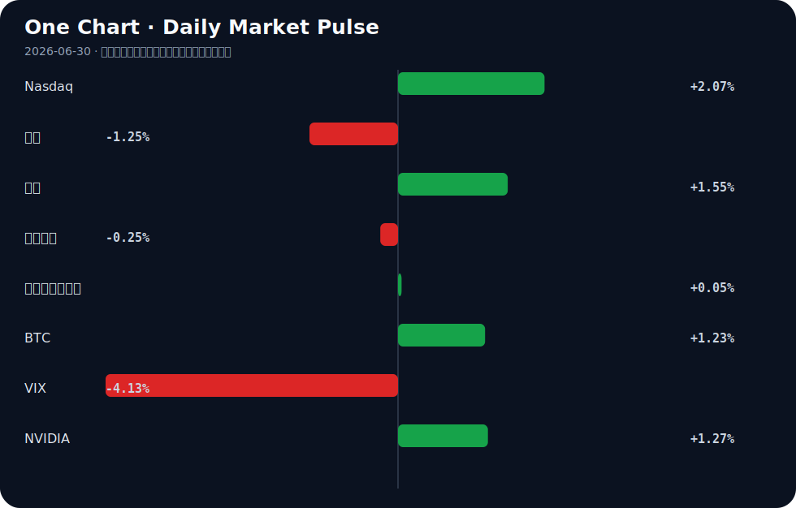

# Daily Intelligence
> 2026-06-30｜Tuesday

## Today’s Thesis｜今日一句话
AI在初级岗位的替代效应正遭遇现实摩擦力的反噬，企业被迫回招人类专家以修补AI缺陷，形成“替代-回退-重构”的震荡期。

## ① Executive Summary｜30 秒
- **AI**：福特因AI质检故障回招350名老员工，顶尖院校科技毕业生遭遇“AI挤出效应”，AI落地正从理想化替代走向现实修补 [A7][A16][A23]。
- **商业**：工业AI与西门子闭环重塑制造生命周期，AI驱动电子与有色金属利润狂飙，但词元经济的算力成本仍是核心约束 [B3][B20][A17][B23]。
- **宏观**：美最高法院捍卫美联储独立性安抚市场，风险偏好回升；墨西哥央行按兵不动维持6.5%利率，BorgWarner加速向墨转移EV产能 [B14][B2][B11]。

## ② AI Daily

### 福特AI质检受挫与人类专家回招
**What Happened**
福特汽车因AI质检系统表现不及预期，决定重新雇用350名经验丰富的“灰胡子”前检验员 [A7][A16]。
**Why It Matters**
这标志着制造业AI替代人类劳动力的单向叙事破裂，边缘场景下的容错率不足迫使企业为AI的失误买单。
**Second-order Effect**
AI部署成本重估 → 资本从纯替代转向人机协同 → 具备复杂物理世界经验的“老手”议价权上升。

### 科技毕业生的“AI挤出效应”
**What Happened**
美国顶尖院校科技毕业生面临严重就业困境，有毕业生申请8000份工作无果，感觉被AI拒之门外 [A23]。
**Why It Matters**
AI正在切断“新手到专家”的技能培养飞轮。如果初级岗位消失，未来将无合格的“灰胡子”可供回招。
**Second-order Effect**
初级岗位被AI接管 → 人才梯队断层 → 长期人力资本短缺引发薪资通胀。

### 工业AI闭环与能源约束对冲
**What Happened**
西门子与IFS合作利用工业AI闭环产品生命周期 [B3]；同时LSE探讨AI的能源经济学 [A17]，中国前5月工业利润因AI浪潮加速 [B20]。
**Why It Matters**
AI的价值捕获正从软件端向重资产制造端转移，但算力扩张受制于能源物理极限。
**Second-order Effect**
工业AI提升利润 → 算力需求激增 → 能源成本逼近收益阈值 → 倒逼算法能效革命。

## ③ Business Daily

**制造**
西门子与IFS合作，试图通过工业AI跨越产品生命周期的数据孤岛，实现闭环管理 [B3]。在中国，AI浪潮正直接转化为工业企业利润，电子与有色金属行业利润“狂飙”，推动前5月工业利润加速增长 [B20]。然而，词元经济的繁荣背后，LSE的研究警示AI能源经济学正面临边际成本递增的拐点 [A17][B23]。

**医疗**
美国卫生与公众服务部（HHS）誓言优先考虑AI在临床护理中应用的指导与协调 [A8]。这暗示医疗AI的野蛮生长阶段结束，合规与准入门槛正在实质性抬高。

**汽车**
福特AI质检的受挫迫使老员工返岗 [A7][A16]，揭示了自动化在长尾缺陷识别上的脆弱性。与此同时，汽车后市场正从“代步”向“玩车”转型，激活万亿蓝海 [B1]；BorgWarner投资4900万美元在墨西哥扩建EV零部件，供应链向低成本区域转移的趋势未变 [B11]。

## ④ Macro Observation｜机制分析

**世界正在发生什么？**
美国最高法院在特朗普诉Cook案中维护了美联储的独立性 [B14]。这一制度护栏的加固，暂时压制了政治干预货币政策的尾部风险。市场风险偏好显著修复，VIX下降，资金从避险资产（黄金下跌）流向风险资产（纳斯达克、BTC上涨）[B16]。

**为什么发生？**
宏观不确定性下降带来了估值模型的分母端修复。同时，AI在工业端兑现利润 [B20]，为科技股提供了分子端支撑，形成了“制度稳定+盈利兑现”的双重利好。

**资本如何流动？**
资本正沿着“避险松绑”和“产业重构”两条主线流动：一是从黄金向纳斯达克与加密资产溢出 [B16]；二是向具备制度套利空间的区域转移，如墨西哥固守6.5%利率吸引EV产能 [B2][B11]。

**接下来关注什么？**
关注风险偏好修复的持续性。若AI算力能源成本 [A17] 挤压科技巨头利润，或美联储独立性的法律余震引发新的政治博弈，反身性将触发：风险偏好上升 → 科技估值扩张 → 融资推高算力能耗 → 成本反噬利润 → 估值收缩。

## ⑤ Signal Dashboard

| 指标 | 最新值 | 今日 | 信号 |
|---|---:|:---:|---|
| [Nasdaq](https://finance.yahoo.com/quote/%5EIXIC) | 25,820.14 | ↑ +2.07% | 风险偏好改善 |
| [黄金](https://finance.yahoo.com/quote/GC%3DF) | 4,027.80 | ↓ -1.25% | 避险需求回落 |
| [原油](https://finance.yahoo.com/quote/CL%3DF) | 70.30 | ↑ +1.55% | 通胀压力上升 |
| [美元指数](https://finance.yahoo.com/quote/DX-Y.NYB) | 101.11 | ↓ -0.25% | 外部压力缓解 |
| [十年美债收益率](https://finance.yahoo.com/quote/%5ETNX) | 4.37 | → +0.05% | 中性 |
| [BTC](https://finance.yahoo.com/quote/BTC-USD) | 60,266.85 | ↑ +1.23% | 风险偏好改善 |
| [VIX](https://finance.yahoo.com/quote/%5EVIX) | 17.65 | ↓ -4.13% | 风险偏好改善 |
| [NVIDIA](https://finance.yahoo.com/quote/NVDA) | 194.97 | ↑ +1.27% | 风险偏好改善 |

## ⑥ Deep Insight

### 灰胡子悖论：AI正在摧毁其未来所需的劳动力供给

福特汽车因AI质检系统频发故障，被迫重新雇用350名被称为“灰胡子”的资深检验员 [A7][A16]。与此同时，美国顶尖理工科毕业生正面临史无前例的就业寒冬，有毕业生投递8000份简历仍一无所获，他们明确感受到被AI挤出初级岗位 [A23]。这两则看似无关的新闻，拼凑出一个致命的系统性悖论：AI正在消灭培养未来专家所需的初级岗位，却又在高级别边缘场景中因自身缺陷而极度依赖这些专家。

当前市场对AI的定价逻辑，建立在“线性替代”的假设上——AI替代初级劳动力，降低成本，利润扩张。然而，这忽略了人力资本形成的时间周期与反馈机制。专家不是天生的，而是在成千上万个边缘案例的试错与处理中成长起来的。当AI接管了初级代码编写、基础质检和常规分析，它实际上切断了人才梯队的底座。

福特的回招是一个强烈的信号：AI在处理分布内数据时效率极高，但在面对现实世界长尾的、非分布的异常时，其容错率极低。此时，唯有依赖拥有丰富隐性知识的“灰胡子”来兜底。但如果初级岗位被AI长期霸占，5到10年后，谁来成为新的“灰胡子”？

这构成了一个反身性陷阱：企业越是在初级岗位广泛部署AI，未来能够修补AI缺陷的高级专家就越稀缺；专家越稀缺，AI系统在边缘场景下的故障成本就越高；故障成本越高，企业越需要付出溢价回招老专家，最终导致AI部署的ROI远低于预期。AI替代的不是某个人，而是切断了自己未来进化的数据源和验证者。

**非共识视角**：市场认为AI的进步是算力与算法的单向函数，但实际上，AI在复杂物理与社会系统中的可靠性，高度依赖于人类专家的隐性知识作为对齐与纠偏的锚点。AI的过度替代正在抽空这个锚点。

**反方观点**：AI将创造全新的初级岗位形态（如AI审计员、提示词工程师），形成新的人才飞轮；且随着模型能力跃升，AI终将自我修复边缘缺陷，减少对人类专家的依赖。

**证伪条件**：1. 未来两年内，AI密集部署行业的初级岗位数量不降反增；2. 无人干预下，AI系统处理非分布边缘案例的故障率出现量级性下降；3. 类似福特回招人类专家的事件被证明仅为技术过渡期的孤立案例，而非系统性趋势。

## ⑦ Tomorrow Watch
1. 验证福特汽车重新雇用350名质检员的实际到岗进度及对产线良率的影响。
2. 追踪美国最高法院特朗普诉Cook案后，市场对美联储下半年降息路径的预期调整。
3. 关注西门子与IFS工业AI闭环合作在首批客户中的部署反馈。
4. 观察HHS关于临床AI应用的优先指导方针具体条款发布。
5. 验证墨西哥央行在维持6.5%利率后，比索汇率及EV产业链外资的后续动向。

## ⑧ One Chart

图表显示风险资产（纳斯达克、BTC）与避险资产（黄金）出现显著分化，VIX骤降表明宏观恐慌情绪消退。风险偏好回升与科技股走强在时间上高度相关，但相关不等于因果，基本面的盈利支撑（如AI驱动工业利润）仍是决定资产韧性的底层变量。

## ⑨ Quote of the Day
> “The big money is not in the buying and selling, but in the waiting.”
> — Charlie Munger

## ⑩ Action Items｜今天值得思考什么
1. **思考**：你的行业中，哪些“灰胡子”岗位正因AI被裁撤，又可能在何时因AI的边界失效而被重招？
2. **验证**：AI带来的初级岗位消失，是否已经在你的公司人才梯队中形成断层。
3. **追踪**：工业利润（如电子、有色）因AI狂飙的可持续性，对比其算力能源成本的增速。
4. **比较**：制度护栏（如美联储独立性裁决）对不同风险资产（BTC vs 黄金）的边际影响差异。
5. **关注**：传统汽车后市场向“玩车”转型的万亿蓝海中，AI质检失败的教训如何影响服务链的重构。

## 信息边界
本简报事实部分严格限定于用户提供的Google News RSS聚合摘要。宏观与市场数据反映最近交易日收盘情况。部分新闻来源为二手聚合，重要推断（如“灰胡子悖论”、资本流动机制）基于材料逻辑推演，尚未经一手调研验证，读者需回到原文核实。

## Sources

### AI

- [A3：AI & Tech Brief: Exclusive|Amnon Shashua preps AI coding product - The Washington Post](https://news.google.com/rss/articles/CBMizgFBVV95cUxPR0RQZjNoVmJON254b0kySVpPdkZhYUNLcFkzT0ZrRVRTek9BaEZDc0l0T0xBaFhqVmphZlRzSG1HdzdpSWNLYTJZR0tsRlVnbDJXY0FZT192NEt1V3hRSUdTdnN4OGFYTkx5cU1oVFFNN2lZLXFvNXl6ZldMT1haRzNMOFo4LUUxaWZiMzVYMk0tX2E5dnhrWUo1ZlE4N3VRNUFnWjBjbDdCNWF4TTY1ejNOZkdsVktFYzkxQnJZWkg2WUFLdUFtbk5OWUU2dw?oc=5) — Google News · AI
- [A7：Ford AI hiccups push it to rehire ‘gray beard’ inspectors - Orange County Register](https://news.google.com/rss/articles/CBMimgFBVV95cUxPRlgwd2VpMGpPWEVYdmJBV0RsQ2Fra2g1SjJQOUYwbkJfUEZFUk5SVzJIX3hpN0E1REFCS00xbXVLY0syVkhudUszd3IxZ1BSUXNkelMxZVhtaEhmYWx0ay1TVGllNC1FVUI0RXBJNVlNcVQ4OE16XzlLbnZEXzhOOUx0V0ZqbGVrd3cyWkJ0V3RhS09IeUVWVDln?oc=5) — Google News · AI
- [A8：HHS Vows to Prioritize Guidance, Coordination for AI Adoption in Clinical Care - ExecutiveGov](https://news.google.com/rss/articles/CBMiiwFBVV95cUxObERpZ0p4ak1lYjgyRnZFaXFWVy1rTlhCMjBCQnJWZlI2QUlPcWVaNmJKUUpaTHJFOGl4R2k0RU81Mk9tX2ctOEpYUC0tT0UzQm9ZVVQ1c1UxOWlBc0dqY1pUVV9BZEItR0NpVUdUZExIOTJGdkdoTHMzazJnbS1TOWhuWjJuY1JWel9z?oc=5) — Google News · AI
- [A16：Disappointed with AI, Ford moves to re-hire 350 former workers - Computerworld](https://news.google.com/rss/articles/CBMimgFBVV95cUxOWjNWdXltMUp5Z1ZCcmhkSVc2azZNTjR5RWVhNmV6MWJuY2ZYdkUzV2lGTjlSZEVieTJHcU9FNmdqdS1mRlItcVJxUEdFak9BRWlKb3FmbmlGRXlZd3JhcmhjS09HUTQtbU5TalZ5MlExRGRyYjJDQjNadVhBVm0xWHRfWjdYcWNBdkI0X0xrQW9jQmtvUWxHejJ3?oc=5) — Google News · AI
- [A17：Exploring the Energy Economics of Artificial Intelligence - The London School of Economics and Political Science](https://news.google.com/rss/articles/CBMizgFBVV95cUxNcHhfS25fLUFpejM3U1owV3RVV0hQdFJpaW5xejBvY1ota01FemFPcmxZdXczMUxsZEdwd3FJdE5MaEhLeVNFOXFUQ2RsNFhjM083ZWFlNjlyRUZ4R2pRSTc1emMybjB5M25pclkyZVVWWUlDTHI2cjcyMnB4Sko2RTJrNmJmNFpyamNzdm5wVkcyckpWSDlKU2d4dkdwNkF1ZUJ3dkNvd0lBTWZLQkljOGlnRy03U3Y4X29MZ2l3S0lreGxBdjAtOVVIQ0U2QQ?oc=5) — Google News · AI
- [A23：'I've applied for 8,000 jobs': Tech grads at top US schools feel shut out by AI - Nikkei Asia](https://news.google.com/rss/articles/CBMi3AFBVV95cUxORHlsTXdkNFJjOGZvVEJ1eDBxOGo0dmY0LXFpa2taQmdOcEFob0pNTmZhdEt5ZE9sdnhYMDNDd3h4bFVLVlJ3Z2Jna1dMTklWLUJmSnVlMzAyeXY3cU9tbHlyTFl1N09QWDlaMFIxUmxoQ01XYzNMQlRUTTVsNkJMV0ZVUUhzZS1pZlFiMldkMURJRWR5MUFsRlJuMVprUWVJdjBJbzVNLXNPQ3ZfdW1pRHRZX1hRTFhwRWstZUw2WkZ4NTdoZkYzY0lBTXNfdGxsX1A0VlFWRENxRXdN?oc=5) — Google News · AI

### Business & Macro

- [B1：从“代步”到“玩车” 汽车后市场激活万亿蓝海 - 21财经](https://news.google.com/rss/articles/CBMijAFBVV95cUxQQzhjd0pvVUpyV00wZzdLUl9YQnQwNXZ4aEFKcHR5RkNKYWFvcG5iTmpqNnJtNDBBcDNJTGpnNmI1TkxmTmVpck00bUxXQURwOE9TbUZTRWlfTmx0NGdpSTVEalFiLURlTDhVdzlfZ0xlQzI3dmx6N0NIQ2FiSU04cGViTkJ4dmhjNVh2ZA?oc=5) — Google News · 行业
- [B2：Banxico Holds Rates at 6.50% in Unanimous Decision - Mexico Business News](https://news.google.com/rss/articles/CBMiiwFBVV95cUxNZWJXdFR4azNiTUo1a2xGbllIbV9UMVc5X1YyNWVIYjZFOXUtS1Z1Wmx3TzR5R1lmSFhLcFltT1dRZ3FwYklRa29iSFJQZFk3LUgxeEpQelFaWlhpbHJpazVmbkxmU3llWjhvVkExMGZCT0pVcEQ3UzFJbXZnVmlrM21NM2oyRG5PajFF?oc=5) — Google News · Markets Policy
- [B3：Siemens and IFS Partner to Close the Loop Across the Product Lifecycle with Industrial AI - HPCwire](https://news.google.com/rss/articles/CBMizAFBVV95cUxQTlVWVjloaEh4Y1VBd0h2QTZnOWtRc0NUSEVLY3dYamVqdHg5RHpoUVAxRU5tckVOdnR6VUlnaWxWUDJCSE1tM2x0OF9EczlsQTV5YUJTVVlfWHVDWDNoY0ZDd0VZUGNueVlZZmNxamhMRFBFTUVYRzdtazNKR1hvaEdIcS1QUlN2QW85cmd4RXpVZ2xJVUZZVkxRaWpHcG9ZMWJWUGw1QzdXU1JZdHhET3h2clJ6VzFyc2trZnpPRG9OMDV4emltVW44eUs?oc=5) — Google News · Technology Business
- [B11：BorgWarner Invests US$49 Million in Mexico EV Component Expansion - Mexico Business News](https://news.google.com/rss/articles/CBMiqAFBVV95cUxNZHF6ZXhRVFBzdGhzTFVwTDN6S1F6bHNEVUhWRXhldFVqMmRwaDk0bzJiQzdHVWpJc253d2Z0M1czdm9MUWRueDdNbk80Z1JpT0lHRVZScVZqbGw0Y3E1TGlCVHpxaHQtMXJxaEhjN1hWZHRkVlhRS3RRT1liWEdXak9JdzcxclpGejJjUDFxMHdpdDg1aXU5bTNIbW80aGRnYkVVbjdCb0Y?oc=5) — Google News · Technology Business
- [B14：Supreme Court Upholds Fed Independence in Trump vs. Cook Decision - Devdiscourse](https://news.google.com/rss/articles/CBMivwFBVV95cUxPX3VmRTJBeS1rMjIxaW00dUxpdUU3QXlpemJHZmJuaUxlZTdZaDdrZzc0ZEpndWF4dG40b3FrWVFTSXVsOUhjZU9wMU1vbnppUmZuYm8tMlJ2NHVqQ0VtbWpyZFRZNDdTOEZCV3ZnVXFWa2hZYThoSFBvSEpMNmNPaHFSdVh5aFpaenhEdDlUNzFIWWpQSF9EeVJiZUVEbmZKM2lBNS1GNlljTlplcHZIVWVNTTlJc3dEZlU3NVhCNNIBvwFBVV95cUxPX3VmRTJBeS1rMjIxaW00dUxpdUU3QXlpemJHZmJuaUxlZTdZaDdrZzc0ZEpndWF4dG40b3FrWVFTSXVsOUhjZU9wMU1vbnppUmZuYm8tMlJ2NHVqQ0VtbWpyZFRZNDdTOEZCV3ZnVXFWa2hZYThoSFBvSEpMNmNPaHFSdVh5aFpaenhEdDlUNzFIWWpQSF9EeVJiZUVEbmZKM2lBNS1GNlljTlplcHZIVWVNTTlJc3dEZlU3NVhCNA?oc=5) — Google News · Markets Policy
- [B16：Bitcoin Holds Near $60K as Gold Safe-Haven Debate Reignites - Bitget](https://news.google.com/rss/articles/CBMiY0FVX3lxTFBDZnZpQkhIeW44U0lOLTMzS3JGTkxfblNLbGhLanQwVUJIX00zTFludlBKSVRJWmhBcm45bUpFV2phOGppZE1keFZPU2VRcjl0TGJpRWM5RVktRG5ISlgyNVZta9IBY0FVX3lxTFBDZnZpQkhIeW44U0lOLTMzS3JGTkxfblNLbGhLanQwVUJIX00zTFludlBKSVRJWmhBcm45bUpFV2phOGppZE1keFZPU2VRcjl0TGJpRWM5RVktRG5ISlgyNVZtaw?oc=5) — Google News · Markets Policy
- [B20：AI浪潮带动电子、有色利润“狂飙” 前5月工业利润再加速 - 21财经](https://news.google.com/rss/articles/CBMigwFBVV95cUxPd3RMbHF3ZHl1Qmc2SGJ3Ni02cG5xc0tCMjNZS29lcGZqeUtPRGE1VEl3akRyc1Y5RFNEbWFOZXdhYnZMSVFKNHBKNm5Hb0UwZmY2UUtldnNpQWRjUWpadktjSW1MUnh2VWlMNWNHbzNFVWhIOVNTUjB0djRlV1ltSHlHVQ?oc=5) — Google News · 行业
- [B23：词元经济 - 搜狐网](https://news.google.com/rss/articles/CBMijAFBVV95cUxOenpkYjUwalg4cUpSRlNjbk9IVlZHWUdROUxmQm1HNllmWTJISDYxd1M0R2NWYVR5WHZDTXZaWnV2WGdhYkdUaWNSSGZHSVE3ekFBNHAxb25BeVlRMlpMSEpoZm1MeDhjV0tWMVMtR2FBX0h3ekhUM29FMWY4bmplbXhoSE80VzlfLVlaNw?oc=5) — Google News · 行业
