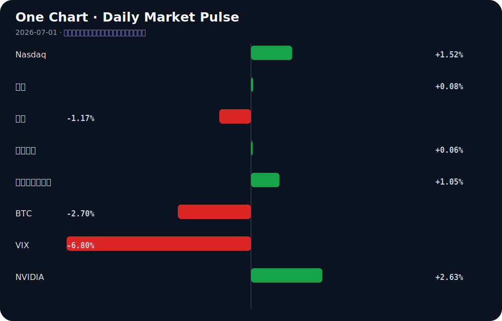

# Daily Intelligence
> 2026-07-01｜Wednesday

## Today’s Thesis｜今日一句话
AI 发展正从单纯的模型规模竞赛转向本地化隐私记忆与代理架构，而宏观资本在关税受挫与制造业复苏中重拾风险偏好，但忽视了AI代理同质化可能引发的系统性金融风险。

## ① Executive Summary｜30 秒
1. **AI**：焦点从构建更好的聊天机器人转向本地优先的代理隐私记忆架构[A1][A15]与模拟世界训练[A4]，同时开源社区开始抵制AI生成的代码[A18]。
2. **商业**：AI投资热潮从Nvidia向内存和CPU芯片蔓延[A6]，能源巨头在清洁能源项目上战略撤退[B9]并转向AI资产管理[B19]。
3. **宏观**：中国制造业PMI在AI出口动能支撑下重返扩张区间[B20]，特朗普关税失败引发全球市场反弹[B22]，但英格兰银行警告AI代理可能导致市场崩盘[B4]。

## ② AI Daily

### 本地优先的代理记忆架构崛起
#### What Happened
开发者发布了“Commonplace”（自托管、隐私分层的代理记忆）[A1]和“Mimir”（本地优先加密记忆，单一Rust二进制文件）[A15]，为长视野AI代理提供安全上下文保持方案。
#### Why It Matters
长视野代理被视为下一个前沿[A12]，但若缺乏持久、私有、安全的记忆，代理将沦为无状态的云端玩具，无法处理企业与金融的敏感任务。
#### Second-order Effect
本地优先代理记忆成熟 → 企业对AI代理信任增加 → 敏感工作流采用激增 → 云端SaaS数据粘性削弱。

### 聊天机器人收益递减与模拟世界转向
#### What Happened
《科学》报道，随着更好的聊天机器人变得更难构建，AI研究正转向模拟世界[A4]。
#### Why It Matters
纯语言模型的扩展面临边际收益递减，模拟环境为代理提供了交互式、基于物理规则的训练场，是通向具身智能的跳板。
#### Second-order Effect
聊天机器人扩展停滞 → 算力与数据向模拟世界倾斜 → AI从文本生成转向自主物理/战略推理。

### 开源社区的AI代码抵制潮
#### What Happened
游戏引擎Godot宣布不再接受AI撰写的代码贡献，理由是无法信任重度AI用户理解其代码以进行修复[A18]。
#### Why It Matters
挑战了AI无缝提升所有软件开发效率的假设，代码可维护性与责任归属成为核心摩擦点。
#### Second-order Effect
AI代码生成量增加 → 维护与调试摩擦加剧 → 开源项目强制要求人类验证或全面禁止AI代码。

## ③ Business Daily

### 科技
AI投资热潮正从Nvidia向外溢出，内存和CPU成为新的资本焦点[A6]。亚洲第四大经济体韩国正乘着全球AI热潮，向内存芯片制造商注入巨额资金，使其成为该行业的关键齿轮[B5]。与此同时，市场出现显著分化：股票创历史新高，而比特币因美联储政策担忧暴跌[B15]。

### 能源
能源正成为下一个商业战场[B17]。Air Products战略性地放弃路易斯安那清洁能源项目后，股价上涨9%[B9]，显示资本对高成本绿色转型的耐心正在消退。相反，传统能源正在吸收AI红利，哈里伯顿与Shape Digital合作进行AI资产管理[B19]，用AI提升存量资产的产出效率。

### 制造
中国6月制造业PMI重返扩张区间，AI出口动能成为支撑经济的关键力量[B20]。与此同时，许多分析师预期AI将替代工人，但新的公司数据讲述了不同的故事[A9]，暗示制造业正在经历人机协作的生产重组而非单纯替代。

## ④ Macro Observation｜机制分析

**世界正在发生什么？** 
全球风险资产正在重新定价。特朗普关税失败消除了一个主要的贸易不确定性，引发了全球市场反弹[B22]。中国制造业复苏[B20]与加拿大经济反弹[B12]为实体侧提供支撑。然而，风险偏好在资产间出现分化，加密货币被抛售而股票创历史新高[B15]。

**为什么发生？** 
关税受挫降低了全球供应链摩擦溢价，促使资本回流权益市场。中国制造业复苏并非依赖传统基建，而是由AI驱动的出口动能支撑[B20]，这标志着技术渗透正在重塑出口比较优势。

**资本如何流动？** 
资本正从集中的算力寡头（Nvidia）溢出到基础设施层（内存/CPU）[A6]，从高风险绿色溢价项目[B9]撤出，转向传统能源的AI优化[B19]。投机资本正撤离对利率敏感的加密资产[B15]。

**接下来关注什么？** 
英格兰银行对AI代理可能导致市场崩盘的警告[B4]。*推断*：若高频交易与资产管理广泛采用同源AI代理[A12]，在极端行情下将形成反身性反馈循环——代理同质化卖出→价格下跌→触发止损→更多代理卖出。系统性风险将从“杠杆过高”转向“代理同质化”。

## ⑤ Signal Dashboard

| 指标 | 最新值 | 今日 | 信号 |
|---|---:|:---:|---|
| [Nasdaq](https://finance.yahoo.com/quote/%5EIXIC) | 26,213.72 | ↑ +1.52% | 风险偏好改善 |
| [黄金](https://finance.yahoo.com/quote/GC%3DF) | 4,025.50 | ↑ +0.08% | 中性 |
| [原油](https://finance.yahoo.com/quote/CL%3DF) | 69.92 | ↓ -1.17% | 通胀压力缓解 |
| [美元指数](https://finance.yahoo.com/quote/DX-Y.NYB) | 101.17 | ↑ +0.06% | 中性 |
| [十年美债收益率](https://finance.yahoo.com/quote/%5ETNX) | 4.42 | ↑ +1.05% | 成长估值承压 |
| [BTC](https://finance.yahoo.com/quote/BTC-USD) | 58,513.83 | ↓ -2.70% | 风险偏好降温 |
| [VIX](https://finance.yahoo.com/quote/%5EVIX) | 16.45 | ↓ -6.80% | 风险偏好改善 |
| [NVIDIA](https://finance.yahoo.com/quote/NVDA) | 200.09 | ↑ +2.63% | 风险偏好改善 |

## ⑥ Deep Insight

当前关于人工智能的叙事，大多仍停留在模型参数规模与算力军备竞赛的表层，但真正决定AI能否深入重塑商业与金融体系的隐性瓶颈，其实是“记忆的私有化与主权”。今日开源社区接连发布Commonplace（自托管的隐私分级记忆）[A1]与Mimir（本地优先加密记忆）[A15]，标志着AI发展的重心正从“推理能力”向“状态保持与隐私控制”发生结构性转移。

长视野AI代理被视为下一个前沿[A12]，但若代理无法在跨越数天甚至数月的任务中保持连贯且安全的上下文，其商业价值将局限于无状态的对话玩具。企业数据与金融交易指令具有极高的隐私与合规壁垒，云端托管的记忆池天然存在数据泄露与越权访问的单点故障风险。因此，本地优先、端侧加密记忆架构，实质上是AI代理进入核心业务流的入场券。

这一机制在金融市场中具有强烈的反身性。英格兰银行已警告AI代理可能导致市场崩盘[B4]。若大量代理共享同一云端记忆或策略库，在极端行情下极易触发同质化的踩踏交易；反之，若代理基于本地私有记忆与差异化数据独立决策，市场的异质性将增加，反而有助于吸收冲击。同时，中国要求标记AI生成内容[A23]，亦是从监管端倒逼AI系统必须具备内容溯源与状态隔离能力。

容易被忽略的视角是：AI硬件的投资热潮从Nvidia向内存和CPU蔓延[A6]，不仅是因为算力需求外溢，更是因为持久化记忆与高频状态读写对存储架构提出了全新要求。内存芯片的爆发，本质上是AI“记忆基建”的折射。当代理从云端无状态API转向本地有状态进程，计算瓶颈将从浮点运算转移到内存带宽与加密解密开销。

反方观点认为，本地优先的私有记忆会削弱AI代理的群体协作规模与全局优化能力，孤立的代理可能更安全但更笨拙，无法实现跨组织的知识涌现。

证伪条件：某主流云服务商推出基于完全同态加密或零知识证明的云端记忆标准，且被金融与医疗等强监管行业大规模采纳，证明端侧加密并非实现隐私记忆的唯一且最优路径，云端依然可以兼顾规模与安全。

## ⑦ Tomorrow Watch
1. 验证中国6月制造业PMI重返扩张区间后的细分数据，特别是AI出口动能的具体贡献度[B20]。
2. 追踪韩国针对内存芯片制造商的巨额资金注入政策的具体落地规模与受补贴企业名单[B5]。
3. 关注英格兰银行关于AI代理引发市场崩盘风险的详细政策讨论或预警文件发布[B4]。
4. 验证Godot引擎拒绝AI代码贡献后，开源社区其他大型项目是否跟进制定类似的AI代码禁令或审查机制[A18]。
5. 追踪Air Products放弃路易斯安那清洁能源项目后的资本重新配置方向及传统能源资产管理的AI化进展[B9, B19]。

## ⑧ One Chart

图表显示了近期风险偏好的显著分化：权益市场（Nasdaq）向上突破，而加密资产（BTC）面临沉重抛压。这种分化表明资本正在从对利率敏感的投机性数字资产轮动到受关税缓和与制造业复苏驱动的成长股，尽管相关性并不意味着因果。

## ⑨ Quote of the Day
> “Price is what you pay. Value is what you get.”
> — Warren Buffett

## ⑩ Action Items｜今天值得思考什么
1. 思考：若AI代理的记忆全面本地化，SaaS行业的云端数据粘性商业模式将如何解构？
2. 验证：韩国内存芯片产能扩张是否会导致下半年存储芯片价格战，从而改变AI算力成本曲线[A6, B5]。
3. 关注：开源社区对AI生成代码的抵制[A18]是否会演变为软件工程界的“人类验证”行业标准。
4. 比较：特朗普关税受挫引发的全球市场反弹[B22]与美联储政策担忧对资产定价的拉扯力度。
5. 追踪：长视野AI代理[A12]在金融高频交易中的渗透率，以评估系统性风险的积累速度[B4]。

## 信息边界
本报告事实来源限于提供的AI及商业/宏观新闻聚合源。时效覆盖至2026年6月30日晚间（UTC）。市场数据反映最近交易日收盘情况。部分新闻源为二手聚合（如Google News、Hacker News），重要推断需回溯原文验证。未包含未提供的其他经济数据或地缘政治事件。

## Sources

### AI

- [A1：Commonplace: Self-hosted, privacy-tiered memory for your AI agents](https://github.com/itsmeduncan/commonplace) — Hacker News · AI
- [A4：As better chatbots get harder to build, AI turns to simulated worlds](https://www.science.org/content/article/better-chatbots-get-harder-build-ai-turns-simulated-worlds) — Hacker News · AI
- [A6：The artificial intelligence (AI) investment craze is rapidly spreading from Nvidia to memory and CPU.. - 매일경제](https://news.google.com/rss/articles/CBMiS0FVX3lxTFBzUUV0cl9TRUh2Rm4zUzNWZHRvcDJmWmUyeEVvNkk5MktESHhOY3RJc1pqT1ZQRDNONTVLX1ZYc2hzTzJHQ3BMQVZuZw?oc=5) — Google News · AI
- [A9：Many Analysts Expected AI To Replace Workers. New Company Data Tells A Different Story. - International Business Times](https://news.google.com/rss/articles/CBMisgFBVV95cUxPQXYxMzcyY3JFb01PTU1BZVFLdWJDT21lLVNZckFZLXA3RUZVdnJlNVdLWjN6OVBXX2Q5LVRwMVhsUmFiRFlUV2MteGVWTXk2NEZlWm1Zd2dWRGNWZUVpYVk1QjJya0FNcmwyODhadDFMWnhfWEFDeXdmbXFwZmNtbjZSMkJ3MVhmbkVubm41WnRRMzlCZWNCTVZTaUpjeEpKUDJ2VFVaRHk2cVRqZ3BRNnVn?oc=5) — Google News · AI
- [A12：Why Long-Horizon AI Agents Are the Next Frontier in Artificial Intelligence - HackerNoon](https://news.google.com/rss/articles/CBMirgFBVV95cUxQQ3hseHJvNUxQZDlWdGd6U1JLamxSOHk2cFhhVWxqTkpSSExrUDFtY1ZzZ1drRGVua1BIMTAwWWlpQTZxSUdPZHRFdHJwM2lqSkx4bVNFZE5DcnByZS1yRnFVRi0tUzEwNGIyc19XdlB0TXctMllBVUxrWG0tbVNJek9tRnJsMk5FMVVGajFfNlRJTng1WGhOR3F2ZEtkQ3Y4WklmTTRuU2JjYzhnRFE?oc=5) — Google News · AI
- [A15：Show HN: Mimir – local-first encrypted memory for AI agents (single Rust binary)](https://github.com/Perseus-Computing-LLC/mimir) — Hacker News · AI
- [A18：Godot will no longer accept AI-authored code contributions](https://www.pcgamer.com/gaming-industry/open-source-game-engine-godot-will-no-longer-accept-ai-authored-code-contributions-we-cant-trust-heavy-users-of-ai-to-understand-their-code-enough-to-fix-it/) — Hacker News · AI
- [A23：Labelling AI-Generated Content in China](https://ocpl.substack.com/p/labelling-ai-generated-content-in) — Hacker News · AI

### Business & Macro

- [B4：Bank of England worries AI agents could cause market meltdown - The Times](https://news.google.com/rss/articles/CBMipwFBVV95cUxNX0xXT1FmR252UFRoSG05SW9tQVVUVjRjMnJ1eUhaYW9mb3ExNmpWaUlCTXE5S0NqczFvMVB4R3ZMZUppX2FRSlhZOXpnQm80blhyNUx3alA3OGY4Yy1sRE1oMDFrZWF0X3I5UmFUamVGSzhNSkNOVjdhanU1bWs0TDRTZG5wd0JZS0lOSWg3UmNpZFZmNjlfQ3g2VF9JV0l4UmJFazJuQQ?oc=5) — Google News · Markets Policy
- [B5：The enormous cash injection comes as Asia's fourth-largest economy rides high on a global AI boom, with South Korean memory chipmakers emerging as a crucial cog in the fast-moving industry. I via ANC 24/7 Link of full story in the comment section. - facebook.com](https://news.google.com/rss/articles/CBMi1wFBVV95cUxQN29BYXVlYnQwbUQ5Sl9FdVJyU1cwdWNmUk9uQzlsdTZfR0VTVUtNNnZ3LW8tTjMxV2pkNHprdE5XSnVFZjdqamI0NHdpMHFER0wzVGVRNDRiaW8ydjRQLXVnVlFWRE5ERDlkem5jMXk0ekVhZ0tOU0E0ZmJBT2RMZDd0Y181SGpweWo4QUZLdTNpNy1OLXVZS2hIb3dHYkRrWkdXZ1BJWm45VUZodDlyS05hR0tZTEVheDF6a1A4dEo1UERTenNSNTNmOG9STHFZVUFGaExmaw?oc=5) — Google News · Global Economy
- [B9：Air Products Shares Jump 9 Percent on Strategic Pivot Away from Louisiana Clean Energy Project - International Business Times Australia](https://news.google.com/rss/articles/CBMijwFBVV95cUxOUkMzZXl1TnE4dmRVWnBJaXBpNXR2OTYwVk1VbFVuRFRCYmxLMGN6Um1ZbmRJeDJiQ2JJUDhJcnE2VmI5NGRVY1pCaVNmeXdPWGRBVVZDM2RTU21ZWjlvUkl1Rk1TS1h4V1BqalJUQTE2WERIbzBROG1nSFJ1d0txazh2STFZeWxXdndZUDltSQ?oc=5) — Google News · Technology Business
- [B12：Canada's economy rebounds after a stagnant stretch - Transport Topics](https://news.google.com/rss/articles/CBMia0FVX3lxTE1STjhlWUFBQlYzVjBXUjQ5TWVfZ29lOVZnaVFKR09UYjR1N0ZVUlVpZGZOaEQyOVZ1NDJiNm5RY3Z6dVJqUVlwZjE3bTM2ZVgtZk16RmdFMm5jNXdOWU1OSjRER1ZfTUxmRjdB?oc=5) — Google News · Global Economy
- [B15：Markets Diverge: Equities Hit Records While Bitcoin Tumbles on Fed Policy Fears - Blockonomi](https://news.google.com/rss/articles/CBMipAFBVV95cUxPcnNQUTZyXy0xYnR1dWtVOEN0bnY3VG5DbnBWTnJMcmFDRW0tSG1TM2taaHVxMHFYQ2JORUpSWkdmdnc1OVpLcUpUR2xfQmV6cWw1aVpTNnJ0MWNzc1dFRVhXQUlFVnFNaDNoYnVCekNTakE2MTNJOWtGZlIzWXBCZnVQU3k3S21zY1NVWUZYdU52WXhaUVJOODM5RWsyU1l0blIyUA?oc=5) — Google News · Markets Policy
- [B17：Energy Is the Next Business Battleground - MikeWorldWide Names Darrin Kayser to Lead Growing Energy Practice - PR Newswire](https://news.google.com/rss/articles/CBMi9wFBVV95cUxPT1hyQWNYTGRwNzN6cHhhOWhFRUY4ZUxGaks3LWhLdC1yQ0ZwMXhZSUhYU0lldEFIZU1wSExPOE9FVk1EX01fd3FFcXpuUFltTU9JU2VPTHlfTVhfa01ySnU4dXVaU0V5OFl4SzZHTXpvekROaGd4VEJEUDkxS2FZOS1SWHVEbkpkTDdDRkdNbDI1N1hRWV9iaHN2dnUtY1B0N2ZlODJ6U2E2V0YxMFZOb2VzQmtSaW0tODBFZXN0RGJ4RXJhUGZWb1BzNV9nc3o5SGdiOEowVnF1Z3otTTdvbmZoVmQ0dmdXU1VUQlJiUlNIVUtUMVpJ?oc=5) — Google News · Technology Business
- [B19：Halliburton Teams Up With Shape Digital for AI Asset Management - TradingView](https://news.google.com/rss/articles/CBMiuwFBVV95cUxQSFptQTZOWWhLQVlaVENGUFFXODdwM0pMR0hxc1VjRkxlZEFyR1dIdW03Ymh4VEtSdUQ2WTd5QmJ2d0xqd2k1V2ZFRFF4bGhMSVVqU1k5T3M4ZTVjLThEdmpVelpydWV4SnAzVFl1RXc2YWtiRjYya2ttNGtyOXpHbWRpZ1BsVU9qQzRwcmNzTzdOZUZCVFNtMTVNbTRMSGlmd09oVWkyVllqNW9pZ1JSbUlzUWxXbGlEazZV?oc=5) — Google News · Technology Business
- [B20：中国6月制造业PMI重返扩张 AI出口动能支撑经济 - KLSE Screener](https://news.google.com/rss/articles/CBMiwAJBVV95cUxQMjBvckhuUktQSk1GWVVuUEdPVEw5QjVxSmR0Y2t6UEtoSWtGUTlTQ1BRc1kyQWFQTW9pOG9NX0xqX0ROTE9YX3BZS0U5SExWTmQxSFNiSmR5ZlVpRWNYZzEtUUd6cGloakpfQzJwNEZycFhoZGZjZkpvSWtzS0NSZFNMRk1RajNuSnpuYXVZMXRYOC1XZXRsUHR1WmFEWUpTcUoxME5kRE1MeGZfWDZMM05YUmlXWnl0eGR6V1FMYUtxbzBWb1kwZGtldmppamg3aVJPbmJGY2pBRGRMNGJLYnNHVFVnM1lIZjhfUjhvMUlQTkY2RnZyWTg1ZVNFOWI5ZlRvZ25GaHVvTlBOUzZuZThGZFU5NFhOaWlKa1Q3R0dUQTJrdlJyYXA2MDctRndWcjRIUkh4MEhJSGxoTEcwaQ?oc=5) — Google News · 行业
- [B22：Trump Tariff Defeat Ignites Global Market Rally in Unexpected Tailwind - streamlinefeed.co.ke](https://news.google.com/rss/articles/CBMipwFBVV95cUxPenFzQzBObGJVc1l3MXFpS2p5ejE2a1M5Zy1oWU5hYU9Ec254ZGhjUUtrd1pHU1FHLWppczJtTFBXLXVDNzM2N2xIUmNjaXI3UXo4VXIyem5GWjk2ejFRUXdMYklOdDRLM0x0UTNTR0l5dm54WEJuQUMtR0d3UEhia1R1VEVkUnJyNk5RMXA0a2xZajNwdUcweU1NZzRwUU5OWmFLSlpFdw?oc=5) — Google News · Markets Policy
