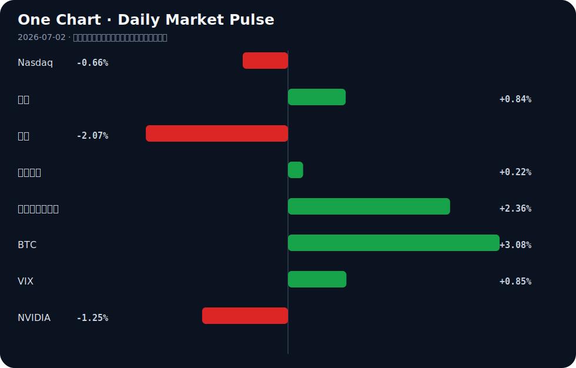

# Daily Intelligence
> 2026-07-02｜Thursday

## Today’s Thesis｜今日一句话
AI 正从虚拟生成向实体科学渗透，而宏观紧缩预期与贸易壁垒正迫使资本在“技术突围”与“避险收缩”间重新定价。

## ① Executive Summary｜30 秒
- **AI**：AI从内容生成（婚纱照[A1,A2]）向实体与专业领域（生命科学Physical AI[A23]）纵深，但文化反弹（拒绝AI广告[A4]、旧金山青年反感[A7]）同步加剧。
- **商业**：半导体与电子信息制造成为AI算力与实体经济的交汇点[B1,B7,B23]，传统服务业（影楼[A1]）面临结构性淘汰。
- **宏观**：Warsh通胀风险缓和论触发风险资产反弹[B14,B24]，但CUSMA破裂[B5,B19]与PMI微扩张[B12]暗示实体复苏仍受贸易碎片化拖累。

## ② AI Daily

### AI 替代传统影楼：高客单价服务业的解构
**What Happened**
AI婚纱照产品对传统影楼形成直接冲击，部分缺乏差异化的传统影楼面临淘汰[A1, A2]。

**Why It Matters**
标志着AI对实体服务业的替代从通用客服进入高客单价、重体验的垂类领域，打破了“重资产实体服务难以被虚拟化”的固有认知。

**Second-order Effect**
影楼倒闭 → 摄影师失业转型 → 婚纱/场地租赁等上下游需求萎缩

### Physical AI 进入生命科学：跨越数字边界
**What Happened**
华大智造联合上海人工智能实验室打造“生命科学实验室的Physical AI”[A23]。

**Why It Matters**
AI跨越数字边界，直接介入生物制造等实体实验流程，将算力转化为科研生产力，而非仅停留在数据分析层面。

**Second-order Effect**
算力需求激增 → 生物数据爆发 → 自动化实验闭环缩短新药研发周期

### AI 流量博弈与商业化闭环
**What Happened**
Cloudflare推出AI流量选项赋予网站控制权[A8]，Koah建立专为AI设计的广告网络[A10]，而Weird Al拒绝参与AI广告[A4]。

**Why It Matters**
AI的商业化闭环正在成型：既有基础设施层的流量博弈，也有应用层的变现尝试，同时伴随创作者的抵制，数据主权争夺白热化。

**Second-order Effect**
网站屏蔽AI爬虫 → AI模型数据枯竭 → 合成数据与专有数据源价值重估

## ③ Business Daily

**制造/科技**
AI正成为电子信息制造业的新增长引擎[B1]。在半导体领域，Vendavo收购Model N高科技业务部以扩张其在半导体制造中的领先地位[B23]，西南半导体产业也被视为国家增长潜力的关键[B7]。资本正在向算力基础设施与高端制造的交汇点集中。

**消费/零售**
消费服务业呈现极度分化：传统影楼因AI替代面临淘汰[A1,A2]，而零售业则将AI视为破解经营痛点的核心抓手[A16]。这表明同一技术对不同资产模式的行业既是毁灭也是重生。

## ④ Macro Observation｜机制分析

**世界正在发生什么？**
PMI重回荣枯线之上[B12]，但贸易壁垒正在加剧：美国拒绝CUSMA续签，Carney暗示无法签署[B5,B19]，直接威胁加拿大房贷市场与北美供应链稳定。

**为什么发生？**
制造业微扩张受AI算力投资拉动[B1]，但逆全球化政策（如CUSMA破裂）正在推升供应链摩擦成本，阻碍扩张的持续性。

**资本如何流动？**
Fed主席Warsh强调通胀仍太高但风险已下降[B13,B14]，这一表态触发了比特币突破6万美金的避险与投机买盘[B24]。然而，十年期美债收益率上行与美元偏强显示，宏观资本并未全面转向风险偏好，而是在“通胀缓和预期”与“金融条件偏紧”之间对冲。

**接下来关注什么？**
关注通胀预期与资产价格的反身性：若风险资产（如BTC）因“通胀风险下降”而过度上涨，将自发宽松金融条件，可能反噬通胀回落趋势，迫使Fed重新放鹰。

## ⑤ Signal Dashboard
| 指标 | 最新值 | 今日 | 信号 |
|---|---:|:---:|---|
| [Nasdaq](https://finance.yahoo.com/quote/%5EIXIC) | 26,040.03 | ↓ -0.66% | 风险偏好降温 |
| [黄金](https://finance.yahoo.com/quote/GC%3DF) | 4,056.70 | ↑ +0.84% | 避险/通胀对冲增强 |
| [原油](https://finance.yahoo.com/quote/CL%3DF) | 68.06 | ↓ -2.07% | 通胀压力缓解 |
| [美元指数](https://finance.yahoo.com/quote/DX-Y.NYB) | 101.41 | ↑ +0.22% | 金融条件偏紧 |
| [十年美债收益率](https://finance.yahoo.com/quote/%5ETNX) | 4.47 | ↑ +2.36% | 成长估值承压 |
| [BTC](https://finance.yahoo.com/quote/BTC-USD) | 60,361.96 | ↑ +3.08% | 风险偏好改善 |
| [VIX](https://finance.yahoo.com/quote/%5EVIX) | 16.59 | ↑ +0.85% | 市场稳定 |
| [NVIDIA](https://finance.yahoo.com/quote/NVDA) | 197.58 | ↓ -1.25% | 风险偏好降温 |

## ⑥ Deep Insight

当前AI的发展正经历一场从“数字生成”向“物理操控”的深刻跃迁。华大智造联合上海人工智能实验室打造生命科学领域的Physical AI [A23]，标志着AI不再仅满足于生成婚纱照 [A1, A2] 或处理票据 [A14]，而是试图接管实体世界的实验与生产流程。然而，这一跃迁正触发一个极易被忽略的反身性陷阱：数据枯竭与物理世界的反噬。

随着AI向物理世界渗透，其对高质量、特定场景的实体数据需求呈指数级增长。与数字文本不同，物理世界的交互数据极难通过纯逻辑推演生成，因为物理规律和实验误差具有不可妥协的严苛性。但与此同时，数据源头的封锁正在加剧。Cloudflare推出新的AI流量控制选项 [A8]，赋予网站屏蔽AI爬虫的规则制定权；创作者如Weird Al明确拒绝参与AI广告 [A4]，旧金山青年对AI产生强烈抵触 [A7]，这反映出数字内容生产者的集体抵制。这形成了一个致命的反馈循环：AI需要更多物理/垂类数据训练Physical AI → 数据拥有者因价值重估或利益受损而关闭数据接口 → 模型因数据饥荒而性能触顶 → 资本从“无差别的模型规模扩张”转向“昂贵的专有数据源争夺与自建”。

这种反身性意味着，AI的物理化进程越快，其面临的数据高墙就来得越早。传统观点认为算力是AI的唯一瓶颈，但在Physical AI时代，获取合法、高质量的现实交互数据将成为更核心的卡脖子环节。若数据壁垒固化，AI产业可能走向“封建割据”，少数拥有实体数据闭环的巨头（如自带实验室的华大智造）将垄断下一代模型，而依赖公开数据爬取的初创公司将面临出清。

反方观点认为，高保真仿真引擎与合成数据可能打破这一僵局。正如AI正在学习推理软件代码 [A6]，若Physical AI能通过极度逼真的物理仿真环境（如数字孪生实验室）生成足够泛化的交互数据，便可绕过现实数据采集的合规、成本与物理限制。

证伪条件：若未来12个月内，基于纯合成物理数据训练的开源Physical AI模型，在真实生命科学实验室或工业控制场景中的可靠性超越依赖专有真实数据的闭源模型，则上述“数据枯竭反身性”逻辑被彻底证伪。

## ⑦ Tomorrow Watch
1. 验证CUSMA破裂预期对加拿大房贷利率及北美供应链股的实际传导效应[B5,B19]。
2. 追踪华大智造Physical AI在生命科学实验室的具体落地场景与首批合作方[A23]。
3. 关注Cloudflare AI流量选项上线后，主流媒体与数据网站屏蔽AI爬虫的比例变化[A8]。
4. 观察AI婚纱照产品推出后，一线城市传统影楼的预订单量同比下滑幅度[A1,A2]。
5. 留意Fed官员后续讲话是否延续Warsh“通胀风险下降但绝对水平仍高”的口径[B14]。

## ⑧ One Chart

图表显示了各类资产在“通胀风险缓和”信号下的分化反应。BTC与黄金同步走强，而纳指与原油回落，暗示市场在流动性预期修复与实际增长放缓之间拉锯。

## ⑨ Quote of the Day
> “It is better to be roughly right than precisely wrong.”
> — John Maynard Keynes

## ⑩ Action Items｜今天值得思考什么
1. **思考**：当AI进入生命科学等实体领域，合规与伦理审查机制是否跟得上Physical AI的迭代速度[A23]？
2. **验证**：Cloudflare的AI流量控制是否会导致大模型厂商的数据获取成本指数级上升[A8]？
3. **比较**：AI婚纱照的边际成本与传统影楼的重资产运营模型，在客单价上的极限差异[A1,A2]。
4. **追踪**：CUSMA协定破裂预期下，加拿大及北美供应链的重构路径与替代方案[B5,B19]。
5. **关注**：PMI微扩张与十年期美债收益率上行的背离，是否预示着“无盈利复苏”的宏观脆弱性[B12]。

## 信息边界
本报告内容严格受限于提供的Google News RSS及Hacker News聚合源，时效覆盖至2026年7月1日夜间。市场数据反映最近交易日收盘或实时切片。新闻源多为二手聚合，重要判断需读者回到原文验证。未引入任何外部事实或未提供的数据。

## Sources

### AI

- [A1：人工智能冲击下哪些传统影楼会被淘汰？ - 新浪网](https://news.google.com/rss/articles/CBMif0FVX3lxTFBSVWpUVU80Z2lfZWljZW54bE02MFRMbGlyMFpLTUkxcHAyalV5TFpaSmV5Njk3UXlYUWVaZVVlMEc0QXpMdW5OQXhmZnNhRlBPdXBLeUM4ODZiNExCcU1jd2xVUWFDT3Vac01XY24wcHd5YnM3cjFOb2FYb3dTZ00?oc=5) — Google News · AI 中文
- [A2：人工智能婚纱照真的能替代传统影楼吗？ - 新浪网](https://news.google.com/rss/articles/CBMif0FVX3lxTE5VeERMY3ZqVDNxekZ5X2FNbHRnMDY4LUFHSmdtLXRTb0szUEhvWkhuMkZxUW9MTGwwUW1rVVpNalpRckdmaVFheUNyWC1URExSdlNhVnBnQVVYOXlCclVJUjRpY2tEVlVCVlhSMTFjRmJQOVR4bWtiWncwT1FMVUE?oc=5) — Google News · AI 中文
- [A4：Weird Al declined 'a nice pile of money' to star in AI ad](https://www.avclub.com/weird-al-yankovic-ai-commercial-exit) — Hacker News · AI
- [A6：Teaching AI to Reason About Software](https://soteria-tools.com/blog/teaching-ai) — Hacker News · AI
- [A7：'It's like having a dumb friend': Young San Franciscans hate AI](https://www.sfgate.com/tech/article/san-francisco-ai-backlash-22325141.php) — Hacker News · AI
- [A8：Your Site, your rules: new AI traffic options for all customers](https://blog.cloudflare.com/content-independence-day-ai-options/) — Hacker News · AI
- [A10：Koah – Ad network built for AI](https://www.koahlabs.com) — Hacker News · AI
- [A14：Show HN: ExpenseSpy – AI receipt scanner that exports to Excel, built solo](https://expensespy.com) — Hacker News · AI
- [A16：刘建军：人工智能成为破解零售经营痛点的核心抓手 - 新浪财经](https://news.google.com/rss/articles/CBMihwFBVV95cUxOSU9zRUpXVmpjbGQxTWEwQkd1ZUdIbHhZdF9JSUtIY2RyaWN1R3NWVmM3S3ltenN6RG5VeEhCNlFOS2U5YkF4ZXBHMGtfUF9SLXh2dVNibXBTSEx5QWhtTjVHS2xpSHQtWS1wY09BSWVkRC1mcU1LU3hFMGxJeldBWUV3SE80LWc?oc=5) — Google News · AI 中文
- [A23：超车主流大模型，华大智造联合上海人工智能实验室打造“生命科学实验室的Physical AI” - 新浪财经](https://news.google.com/rss/articles/CBMijAJBVV95cUxPTHBtWDc0TWdFYjdCdGhadTFGdlcxOFpCMWR5TXF2Y2RkN3dyeWE3VENZM3liSXVlWGF6MVFsQTREWVlka0NkOGZEb2pacUprYnRqbW5PeklYOHZsZUZ0U0RGYnZtc1dtZjlOU3ZmQWhLQTBQWWhKOXc3bXRUR0pvYU9SZm5QZ0JLSUstSGN3dE1PSk93MlljUWQyWmF3VGYyZjNFaHI1VU8yOWxUVkpZODBIVnZCdUpEWWFZYVlISVpRaE44WW5CQTNQV1ctY3pzRXhmcmhrQlFaVl9tbWl4X0FnMjJIN1RvM2dqdjdOdHRPVFR2RFdlbFFtejdWVTV3X0g5TVp3NUVCNldO?oc=5) — Google News · AI 中文

### Business & Macro

- [B1：AI带动电子信息制造业新增长 - 新浪网](https://news.google.com/rss/articles/CBMiggFBVV95cUxPTG9PbHIwVUlCbmVTS1c3OWM2UGp4SU9tSk9fTjVRa0JpMGRjNWtWR3hveXZTWDI3RjBhNWlTLVl3Z19LdG9Td2M0NDBzSEZGVm8xcmFlRTNkYXo0QWxjUW1YU3FOMzc4cHY1R2l0eEREM3pKdW5tb19fNW9WWHN4Q1lR?oc=5) — Google News · 行业
- [B5：US rejects CUSMA renewal, raising stakes for Canada's mortgage market - mpamag.com](https://news.google.com/rss/articles/CBMizwFBVV95cUxQel9sTG91SGRQZ1UySXoxbWRzbUI1enRubXFvX21teE8tMm9RU18yaUJWeFE4WGUxbGRXSmx1eVA2d2NmUklJaWV2STdRNmpkV3dlZ21QdVh6aUNyN3NIclVXa21TZkNfbmQxdU1MRzQ1ejlsanMtNnROMnJDWk9YS0FoeWUwZTNNdXNmZnhDaHp3RGhSbXhVakpLa3BQX3BHXzdhd2p2S0NJMWZsd3NEcGdQZjVGVmdPVldaNUxMaUtyTWFTeWVGbmpNY2k1ek0?oc=5) — Google News · Markets Policy
- [B7：Finding National Growth Potential in the Southwest Semiconductor Industry - Aju Press](https://news.google.com/rss/articles/CBMiV0FVX3lxTE1HeERCM3A5NWlqZXBGUlZTOU5YTXpQZ0hjVWU3WVkwc1Q2QjZZQTlBMHBCS0lzd0FuRmZsNmJjS0w5aDBlWHRfMHFmeFFrYmVhNDZETmd4TdIBV0FVX3lxTE1HeERCM3A5NWlqZXBGUlZTOU5YTXpQZ0hjVWU3WVkwc1Q2QjZZQTlBMHBCS0lzd0FuRmZsNmJjS0w5aDBlWHRfMHFmeFFrYmVhNDZETmd4TQ?oc=5) — Google News · Global Economy
- [B12：天风·固收 | 重回荣枯线之上——PMI数据点评 - 搜狐网](https://news.google.com/rss/articles/CBMijAFBVV95cUxNaTlUTGp6Y0RaenJNNW5Vd0dienRpdGl2TEZiNjYxVG1OODAxNGJxOUR5YVV3dk5HblRVRE1ORUxHSWFvbTdZNmdtT3FjbHFBTTVOdGhOaENCakpqYlBWbHNsUGE3aFFRZW5INUpFajUweEZockRyLVdRQ0tyY0JEaXctTVBjZ21GZFl3bA?oc=5) — Google News · 行业
- [B13：Federal Reserve Chair Warsh emphasizes political independence, signals focus on inflation - The Tribune-Democrat](https://news.google.com/rss/articles/CBMihwJBVV95cUxNRk9zclNUaV93eV9HVnhvNlVobXR1Rmx6TjhJRnBmS0tiNWZ0Tmp6RDJXQzgzYWFOUkhCSTZLTmJySEFKNGJ2bGZjczhhRlZyUUc0Y1B4SEctamVKWUoxRHo1a2NVQXR5blNRZk5qdnhvWXJyd1V4bXBZb1BSWVpmQVNadmp1cEJqSVFPZjJzcTJnUFJRUHpSSTRhTVQ4b0dKcTV4dUJWUDNjc2JFYm02QnpZTWFIZ1FaTUtyeHJmb2lMTkkwYmhzcVFIRko0cTVBSmVyN2ZoeEpWQzY1WkdGUnpzb0E4MC1yYU1ITDNLVzBQcndvZUhjd0RVcXpaMEgyNVBadElMSQ?oc=5) — Google News · Markets Policy
- [B14：Fed Chair Warsh Says Inflation Is Too High, But Risks Have Diminished Lately - Investopedia](https://news.google.com/rss/articles/CBMilAFBVV95cUxOa1dfS2t5TlZHU09hXzF0QUxxbVFpMl84U092QVgyOXNhMVpGbG5UeTZkaDgzQXc2bkhfNTR5Ymxvc3J4emc2SFJKb3pUOHNFckVMSjNaWlVodF94OHBzemlUWFdUbDVNUzhUWFgydHdlUTJPeXUweGRKeG55NUgwMlI2dXN6UDhNYlFDV3c1MmRXcjhh?oc=5) — Google News · Markets Policy
- [B23：Vendavo Signs Agreement to Acquire Model N High-Tech Business Unit to Expand Leading Position in High-Tech and Semiconductor Manufacturing - PR Newswire](https://news.google.com/rss/articles/CBMinwJBVV95cUxNSndOX2J4SjBuV1FxRC1jbEVId196eVhrb250NTllanhaY0hFMGhoQ3pYd0daTTJ2eXhFTDRoTmJkczlhOWl5TFM3YU54TlpkMWprN19qazRLZHplTWlOdWlGOTUtNmwxOFZReDlxM0RlZWhLQWkxTjlnVG9kUXlMRC13cU51d2JEeTZWcjBDdTJUel9DLWVWTV9hbmdxUWNfcnpfNGdUWXNST1ZHemlfWFBDYmswc2MtUno4V3FTY3NYVTMwUTdWeEc2V3NrU01sY0JHc3pWcTN1UUotZ1RoMUR5S0pMU1NUMUNKUDZRanNQZGcwS2pPcEFIN09KTi11MzBfNWJwM2ZTSXpDWk9oZ0ZpdVY3ei1WTklUdnQwcw?oc=5) — Google News · Technology Business
- [B24：Bitcoin breaks above $60,000 after Fed Chair Warsh said inflation risks has come down - CoinDesk](https://news.google.com/rss/articles/CBMizAFBVV95cUxQalhqWXlHMUNYVDBKN3plcHg4a3ljNnVXUm15MUpTckxTMVVJbjBnVzlWWWc1bHk2YTEyOHh6WlBqVEdnaEF0c1dTMU5xdXF5T214N0YxZTFOUENYdzFYWkJmemR4S1dCZEl6QWR5UzVLcXlnb3J5QUFSM2hBTG5xNWVLY0dBVzFKMmxIZlJhMnBPdERxMlJkNUg3ek9IY3M3dmV2dTV5STJVTTVSN2h2WHNXNl92M0VkNDRoNHZERU45b0dfLXFObGt4X0c?oc=5) — Google News · Markets Policy
