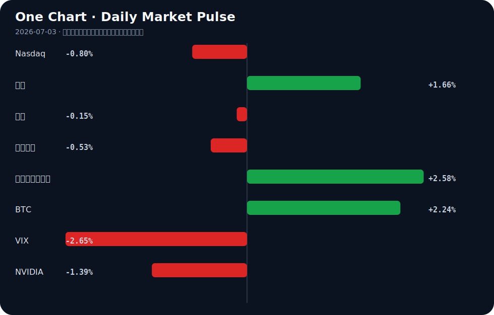

# Daily Intelligence
> 2026-07-03｜Friday

## Today’s Thesis｜今日一句话
AI的扩张正从纯粹的算力军备竞赛，转向受制于能源物理极限与地缘政治干预的双重约束，中心化AI模式的脆弱性开始暴露。

## ① Executive Summary｜30 秒
- **AI**：OpenAI提议向美国政府出让5%股份以换取生存空间，中心化AI面临地缘与监管双重夹击 [A8][A11][A22]。
- **商业**：华尔街AI顾问日收费达2.5万美元，而特斯拉却严控内部AI额度至每周200美元，AI资源的分配出现极端两极分化 [A12][A15]。
- **宏观**：美国劳动力市场增速不及预期，叠加中国经济结构分化，全球资本在不确定中重新评估风险资产 [B5][B7][B14]。

## ② AI Daily

### OpenAI的“招安”与中心化AI的脆弱性
**What Happened**
OpenAI提议给予美国政府5%股份 [A11]；特朗普政府试图限制OpenAI模型发布 [A8]；研究指出模型退役和贸易禁令暴露了中心化AI的脆弱性 [A22]。

**Why It Matters**
AI正从商业工具演变为国家基础设施。政府不再仅是监管者，而是直接以股权和行政令双重身份介入，中心化模型的地缘单点故障风险被显性化。

**Second-order Effect**
监管套利 → 资本向去中心化或开源模型转移 → 全球AI技术栈加速分裂与区域化。

### 能源约束成为AI扩张的硬墙
**What Happened**
Google因AI扩张电力消耗激增37% [A16]；分析指出“电态国家”崛起并主导AI驱动下的能源转型与地缘政治 [A2]。

**Why It Matters**
算力增长受限于电网承载力，AI的尽头是能源。超大规模数据中心正在从“算力集群”转变为“能耗巨兽”，电力获取能力决定算力上限。

**Second-order Effect**
AI算力需求 → 区域电力短缺/电价飙升 → 数据中心向清洁能源富集区转移 → 催生新型“算力-能源”地缘联合体。

### 中国AI的追赶与成本控制的两极
**What Happened**
中国AI模型逼近美国顶尖产品（“DeepSeek时刻”）[A7]；字节跳动今年AI支出被爆超2000亿 [A21]；特斯拉严控员工AI成本上限为200美元/周 [A15]。

**Why It Matters**
模型性能差距正在缩小，但应用端的ROI压力剧增。巨头重注基建，而实体企业在应用端面临严酷的成本审查，导致资源分配极端分化。

**Second-order Effect**
模型平权 → 企业内部AI工具成本审查趋严 → 独立小模型与端侧AI（如AMD AI PC [A17]）需求爆发。

## ③ Business Daily

### 制造
日本试图通过AI驱动在工厂机器人竞赛中反超中国和欧洲 [A10]；美国贸易代表吹捧制造业就业增长，认为宏观顺风正在构建 [B23]；防御技术公司的工厂交易推进 [B15]。AI与自动化正在重塑全球制造产能的分配逻辑，旧有的劳动力成本优势被算法与机器人密度取代。

### 医疗
墨西哥城推出1.25亿美元生物科技投资计划 [B12]；非洲疫苗主权目标面临最大障碍 [B24]；古巴医疗系统因能源短缺加深而衰退 [B21]。全球医疗健康产业呈现断层：资本向高回报的生物科技集中，而基础公共卫生在能源与供应链危机中持续失稳。

### 能源
布隆迪新水电产能有望重塑其经济与能源未来 [B18]；IMF施压某央行在改革截止日期前退出黄金市场 [B16]。新兴经济体正试图通过基建锁定能源主权，而国际金融机构则在推动金融资产与传统避险工具的脱钩。

## ④ Macro Observation｜机制分析

**世界正在发生什么？**
美国劳动力市场增速不及预期 [B7]，中国经济结构分化凸显 [B14]，欧洲增长受中国出口冲击大于贸易逆差本身 [B1]。全球需求端复苏不均，供应链重组带来的摩擦成本正在显现。

**为什么发生？**
全球正处于旧有全球化分工解体、新技术-能源范式尚未稳固的交替期。AI等新技术尚未产生足够的全要素生产率提升来对冲重置供应链的成本，导致宏观数据呈现结构性分化而非全面衰退。

**资本如何流动？**
资本从高估值且依赖低息的风险资产转向有确定性政策支持的基建与制造。印度两个月资本支出达2.5万亿卢比 [B2]，日本125亿美元押注印度制造 [B19]，资本正顺着“供应链去风险化”的政策指挥棒流向新制造中心。

**接下来关注什么？**
关注下半年中国针对结构分化的政策发力点 [B14]，以及亚洲货币在美元压力缓解后的反弹潜力 [B6]。

*事实与推断区分*：美国就业不及预期、印度基建支出高企为**事实**；亚洲FX将反弹、中国政策将偏向结构分化领域为**推断**。*反身性*：市场对经济结构分化的预期会加速资金撤离弱势部门，投向确定性资产，这种挤兑本身会加剧宏观经济的结构分化。

## ⑤ Signal Dashboard
| 指标 | 最新值 | 今日 | 信号 |
|---|---:|:---:|---|
| [Nasdaq](https://finance.yahoo.com/quote/%5EIXIC) | 25,832.67 | ↓ -0.80% | 风险偏好降温 |
| [黄金](https://finance.yahoo.com/quote/GC%3DF) | 4,136.00 | ↑ +1.66% | 避险/通胀对冲增强 |
| [原油](https://finance.yahoo.com/quote/CL%3DF) | 68.48 | ↓ -0.15% | 供需平衡 |
| [美元指数](https://finance.yahoo.com/quote/DX-Y.NYB) | 100.85 | ↓ -0.53% | 外部压力缓解 |
| [十年美债收益率](https://finance.yahoo.com/quote/%5ETNX) | 4.49 | ↑ +2.58% | 成长估值承压 |
| [BTC](https://finance.yahoo.com/quote/BTC-USD) | 61,350.00 | ↑ +2.24% | 风险偏好改善 |
| [VIX](https://finance.yahoo.com/quote/%5EVIX) | 16.15 | ↓ -2.65% | 风险偏好改善 |
| [NVIDIA](https://finance.yahoo.com/quote/NVDA) | 194.83 | ↓ -1.39% | 风险偏好降温 |

## ⑥ Deep Insight

**主权资本正在用“电网”和“股权”双重锁链重塑AI的权力拓扑**

当前市场普遍认为AI的瓶颈在于先进制程芯片的供给，但Google电力消耗激增37% [A16] 与“电态国家”的崛起 [A2] 揭示了一个更底层的硬约束：算力的尽头是物理电网的承载力。AI扩张本质上是一场能源兼并运动。当超大规模数据中心需要吉瓦级供电时，它们必须将自己锚定在特定地理区域，这使得中心化AI的脆弱性 [A22] 不仅体现在模型退役或贸易禁令的数字层面，更体现在物理层面——它们成了地缘政治中无法移动的活靶子。

OpenAI提议向美国政府出让5%股份 [A11]，表面上是监管套利，实质上是中心化AI向主权国家缴纳的“物理保护费”，以此换取电网接入权与政策豁免。这构成了一个反身性循环：地缘压力 → AI巨头让渡股权/绑定政府 → 技术栈封闭与国产化加速 → 贸易禁令加剧 → 中心化AI物理脆弱性进一步暴露。

与此同时，AI商业化内部正在发生剧烈的熵增。字节跳动豪掷超2000亿押注AI基建 [A21]，而特斯拉却将员工AI额度严控在每周200美元 [A15]。这种极度宽松与极度紧缩的并存，说明AI的ROI在微观层面尚未跑通，企业只能通过行政手段强行截断算力消耗。当“电态国家”开始以电价和碳配额对数据中心进行配给时，缺乏自备能源或主权背书的AI应用企业将面临算力断供风险。

**反方观点**：算法效率的跃升（如DeepSeek逼近顶尖产品 [A7]）或端侧AI（如AMD驱动的AI PC [A17]）的普及，可能使算力需求与能源消耗脱钩。若小模型能在本地完成绝大多数推理，数据中心的能源兼并将失去意义，从而绕开能源-地缘政治陷阱。

**证伪条件**：若未来两年内，全球超大规模数据中心资本支出增速放缓，但AI应用调用总量仍呈指数级增长，且未引发区域性电网过载或电价飙升，则“能源与地缘物理约束是AI硬墙”的论点将被证伪，说明算法效率提升成功对冲了能源需求。

## ⑦ Tomorrow Watch
1. 验证WAIC 2026上海开幕前（30天后）的300款AI产品首发动态及政策风向 [A24]。
2. 追踪OpenAI向美国政府出让5%股份提案的后续国会或白宫正式回应 [A11]。
3. 关注中国下半年针对经济结构分化的具体产业与货币政策发布 [B14]。
4. 观察美国6月非农数据不及预期后，美联储降息预期的市场重新定价过程 [B7]。
5. 验证字节跳动超2000亿AI支出的资金流向（算力基建 vs 模型研发比例）[A21]。

## ⑧ One Chart

图表展示了主要资产类别的近期脉冲方向。纳指与英伟达同步下行而黄金与美债收益率上行，暗示资金在科技成长股与无风险/避险资产间再平衡；BTC与VIX的同向改善则表明短期流动性未全面枯竭，而是进行结构性转移。

## ⑨ Quote of the Day
> “Price is what you pay. Value is what you get.”
> — Warren Buffett

## ⑩ Action Items｜今天值得思考什么
1. **关注**Google电力消耗激增37%背后的数据中心选址逻辑与区域电网负荷极限 [A16]。
2. **验证**“DeepSeek时刻”中国模型逼近顶尖产品的实际基准测试跑分与垂直场景落地差异 [A7]。
3. **比较**华尔街对AI顾问的溢价支付与实体企业（如特斯拉）对AI成本的严控，寻找AI应用ROI的拐点 [A12][A15]。
4. **追踪**印度2.5万亿卢比基建支出与日本125亿美元投资的落地进度，评估亚洲供应链重组速度 [B2][B19]。
5. **思考**OpenAI向政府出让股权的提议，会如何改变科技巨头与主权国家之间的博弈结构与反身性 [A11]。

## 信息边界
本报告信息源为Google News RSS聚合的中文及英文科技、商业与宏观新闻。时效覆盖至2026年7月2日傍晚（GMT）。市场数据为最近交易日收盘值。新闻来源多为二手聚合，重要判断与数据（如字节跳动2000亿支出、OpenAI 5%股权提议）需提醒读者回到原文验证。

## Sources

### AI

- [A2：The Rise Of ‘Electro-States’ And The AI-Driven Energy Transition: Navigating The New Geopolitics – OpEd - Eurasia Review](https://news.google.com/rss/articles/CBMi1AFBVV95cUxPU3lFOEUtYXJYUnFIT3lTbmdYMjJiVEZjLUxTSFVCbEZDWC1BdUIyV3RtWTRPQTZwNzUwMFJ6WUUwdnBpWGhhRzZwU21HbENMQURvWEp6MkhOVXdTMHhKbkkwTHN0TlRMMjF3MEZ4M0JqNEZiRHZFUTNYVkF3cFEwX0FfVnhvWDVYRi0wbDVWM2FWcU93Mjc3TjdsenptVWZDUkxCOWNVYW9tTmcxSmpNNW1uYk1QSzhqRHUwSnRXTEdBQnVEYUttTjAxVW9KckxjbFlibw?oc=5) — Google News · AI
- [A4：LLM Data Mixture Breaks When Training Pools Shift: Causal Inference Offers Fix - Tech Times](https://news.google.com/rss/articles/CBMizAFBVV95cUxOdUQ3LTloSDE4VmRrbTlSLWFDZHVKUElySml2Qm9xYXVXSTIwLUxyZkl1ZGcyZ3J4ZWxnYXk4Qkh0cmdkQkdCVTd5eTN3TTVtbDBaUkRjNkRJd0NNZE5VX2dBaG1JLWJCbUMzeGIycFFTaXFLRENHUlo0aUp2RTB4WXA3Q3lMd1MyT0pDQ29rT2x0VGg3UVV5ZENQZEk0Z3JqSDlPWDdsbXFMQ3dVZk1wdXlJQXI4RzNrc3g4c2lXclU1VktkMFU3OUI4dDQ?oc=5) — Google News · AI
- [A7：“DeepSeek时刻”？中国AI模型 逼近美国顶尖产品 - 文学城](https://news.google.com/rss/articles/CBMigAFBVV95cUxOV2VPZ0hUT0NEWEhGVWpoQXFaMGRrdEc1eTBVcDhyVERmbUxtaXVJRUlwV0xmUlRrSURsa2ZxZ0xSRWl5UXJpamZDVWEtTG5adElDWF83SklLVW9RSDBqeDNUaVRDVVZNZUUteFU4OU5KWG5mUUdWRDJNNzBRaW9pUg?oc=5) — Google News · AI 中文
- [A8：Fact Check Team: Trump moves to limit OpenAI model launch as their involvement grows - National Desk](https://news.google.com/rss/articles/CBMipwJBVV95cUxQcWNUdTJ5Vmd6TDNYeTlfMERIbXlNZlJyeFFDVzd3QWpYN09KbkItQi13VExzZnpnUVJmTm9USG1jMWpZOXg1bkE2bVpNSGRrOFgyYzVSRGVfVmdhdDlfYkhvUTBiWWFtOEUwMmt0dXJrZDRyYi1WcGZ3UVJHV0JUMFRQNV92RTJzUXcwWkZSSVRyc0NlbVRGSEdTVTNkZGM3UzdGdktDWHpXSmlid3JENVZtVi1WYXRtSDFtejBVaVJLQVoxNzl2dlhnbUoyZWN6dEZjUXNtcnc2VzlrSWMwNHR1UlJxb05oV2tGSGZ3eWN6bjNkQWp1WWE3dEpQdUJITktMbXJvM3haWXRyUExlMGxRMUNiSUpncFBjelZGOTFrNng3Mmo0?oc=5) — Google News · AI
- [A10：Japan eyes AI-powered comeback in factory robot race with China, Europe - Nikkei Asia](https://news.google.com/rss/articles/CBMi1AFBVV95cUxQd1JIQU5SLXg2T2xXYTk3dlVtdndieEY0VTB4a0pJZDFuWXk0MllZaTc4ZUliMmx2cms0Wk90dU9JRGZpZmRJV09NNEhGZU5YcG52WXBoMF84QVNYVmN5OUJzc2tfbDNhSlhqcGNfTTJxWUxncFZ1b1lWbGNYQXhTaU5kQjhNVkZyODNuNG9CWGNFR3RyZVJJMXV0RlFBeUpCZXUyWFRUZDFZd1IwaGVTUUc3SG83UkhnYThWLWhLLU41VFlZSk0taTJLNm15djdQNEFSMw?oc=5) — Google News · AI
- [A11：OpenAI Floats Giving Government 5% Share in Company - PYMNTS.com](https://news.google.com/rss/articles/CBMirAFBVV95cUxNbVZQa0JYamE4bG0wQmp0emhreWkydWZMRVF1aW1nMmNrd0FUVEdRMzJTT1NSblhES1hmVWw4WnRmOXlZWEIwd0NiazBqWVUxUlU4bmltUFMtYk8wazhNZnZzTjlLSTZXRTNIQ2FCWDZhUkVtR3pHaEs3WFV1eHZCakZYQl92a3JGd1U0SFY4a0IyMDlIREItUzBKTUl2SlpvOHBfUm5GT3NKakhQ?oc=5) — Google News · AI
- [A12：AI顾问成华尔街新顶流：单日收费2.5万美元 预约排到两个月后 - 财联社](https://news.google.com/rss/articles/CBMiSEFVX3lxTE1UOTBGNG5KTEEyV09IVXB4MXRaX0JmYTZKZlBiRnhyandBclJReTk1WnI3eDJTcHg4eklMZGV3cHF5dnZLYTkzdA?oc=5) — Google News · AI 中文
- [A15：严控AI成本 特斯拉将员工每周额度上限定为200美元 - 新浪财经](https://news.google.com/rss/articles/CBMiqgJBVV95cUxQbnZsTkEzTHVGY2V2cjhjbU9vX3VoTE5DUWhYdU9JdENDeVdrU0F5enZpNnZOa3I0WkdvM1FQRFVNMTRLcG15Uk03dnRoY3prM1FkTmY3V3lNWVAwYV91RkE2NVN1QzNnX2h0bXZTNXZGb2VnbW5XZk8yOEUzemhHRmJMd0RUTTFHRTFMT1NuUklMWXpETy1OVWd4eG15SVJka00zSkdUMFh6SlF5ZXpqbmJIUnVtQ3FaM3BnbThRSDVtZDNaVG9xRU5RNjJtczg1eGNkRXRMVi1Wem5KVFlGTEpGenZFN29zM0tsSHBZclptRVNhaDBBVE5YSERQVG9oQm42M3g2d0syTnNqeWtfRVlJcWkzX3I5RldrUmctNndJT1ZhRDFHaXFn?oc=5) — Google News · AI 中文
- [A16：Google’s AI Expansion Sparks Record 37% Power Use Surge - Android Headlines](https://news.google.com/rss/articles/CBMiowFBVV95cUxPbVRmaF9kVl81a0I2Y09jbGhqWFdybjF6LWxKUkZaQ3hPVy0yc0oybTJ2MDNZN2xlQTc5X2pSaHlmcUt4WUVUTkZVczhnUGNra2pxempKSjZnc3A4cHUxX1NhNVoxRDlpUWpEQi1xUXlEUGhIdkw2eTRuYUd6VEZqYU8xQzVKa0lYdUh5U3p6eFpWV1BDdDV6eDhyM1djeDJBU0dZ?oc=5) — Google News · AI
- [A17：AMD-Powered AI PCs Help Organizations Prepare for the Next Wave of Copilot - BizTech Magazine](https://news.google.com/rss/articles/CBMisAFBVV95cUxOSDdENVFmblhZNXozZ0MwNG9wZ242YlhkZEl0MC1HYzBqUk0tajFiYXoxcFFuLUJIQW9uWEsxWWJVeDR0aC1JdmROZVZxdmdLN2VCRUF2RFFXd2dZekxwWFRmQzVHOWwyVi1iSmw0SUNCSkpTd0dvZk80VTE2c2FOaUZ1bllNLUFjZjdNTTdhZ0d3YVNsbWNFSjRfUWlzSkpNWGlaUjU4RVY1aWhPckRKRA?oc=5) — Google News · AI
- [A21：【早报】字节被爆今年AI支出将超2000亿；我国第四代自主超导量子计算机上线 - 财联社](https://news.google.com/rss/articles/CBMiSEFVX3lxTFBuQ1FlSGRZV1RDNkRFcGs1ZDlNQWJqcEVXaGZObEUyUVl1VGRfZm05RGtQQ0picm1VTlpTakVtYkZDRnVqUVFRWA?oc=5) — Google News · AI 中文
- [A22：AI model retirement, trade bans expose fragility of centralized artificial intelligence - NL Times](https://news.google.com/rss/articles/CBMiswFBVV95cUxNanBxR3R6SXJpX1hxSkRlQ0EzaDc0WkdZM0dYMmp3LUhtRXltc2JyQy1GNThyWkdlc1JKSmp6QVE1cWhpbFJKbHF4VTdFTm9GMVZkY3dETXhtdUh5dEZNdllqR0NvbnBPRm9WcDg4d0UyajZGY0w3R1BjRVkwVDFlTEk1Q19ndk1LN0VHSWFjNG4wclFZOGNCSE03THdhcHVFTTNQSGZuenRHZWNuMl9BVlMyVQ?oc=5) — Google News · AI
- [A24：2026世界人工智能大会30天后上海开幕，300款AI产品全球首发 - 第一财经](https://news.google.com/rss/articles/CBMiU0FVX3lxTE5yYXNLUVNxMHNRU3N0RGRKUjVySTNzc2JvdWgwVEhRbkdMbzZLempLajhJckxOS2RFT0ZSR1R4TW01ZkV0OVRyVWFSRnRnc2xRY05z?oc=5) — Google News · AI 中文

### Business & Macro

- [B1：Europe growth hit more by China exports than bigger trade gap, Goldman says - Reuters](https://news.google.com/rss/articles/CBMi0AFBVV95cUxPNjJpdkF0c2oxMVlubW4wWnZuSEhkWmdHU3ZNeFRMMkIwVEtpd2JEUHdKTGxzcTVFUjJLNGlpbVdtc2RiSUt0UktBZmhzWUctRTlLelctTWVjOWV0SnRJV2VRNW8xSGNEazdCWkZJaVBXeWxod2RxbkRQRHZnejZfMnd2Y21IU3UwcUx4ZVlZUHA4YmkxdFdUeUJVWE1qdXdnT042MFV0SXpRSnBSdjJZT3FYbzJHQ3FjZlQzWWpodFZiT3ZoM0hkamJleVl5ZHRM?oc=5) — Google News · Markets Policy
- [B2：India Capex Hits ₹2.5 Lakh Crore In Two Months; Railways Lead - Whalesbook](https://news.google.com/rss/articles/CBMi2wFBVV95cUxQVlpVRnNPTUhOdzQyeDloZ3M0QUtYTjVkR1lHd0FZMXpCYXlUOWJUYUY4ckhjdUxpNHlHTXdla0ZqemhfWVhMZ1dtUzBGNWRSU3RVeTlVT3Y5bnpxR1VMc2QzWlFUblc2T1BoWXUzS05mc0d3Z05NOTZWNC1Lc2x0akVSRWFHcDZBN2ZhYkR2WGVqZkI2MDJodWNCWXZuNS1SR09iVUh5SnJrLTR3UFlqX1FkYXRIYXZaNU9Yd2c4Ym1hZklGLXlTRENrWVdIdEdrcmVwcWF3TUFtMFU?oc=5) — Google News · Global Economy
- [B5：Global stock markets face volatility amid economic uncertainty - Operativ Məlumat Mərkəzi](https://news.google.com/rss/articles/CBMinwFBVV95cUxON2R1WXpMNHhaRGJvV3dhYnNRUXIyMENlSnM2SE9yTXNjWTM0U2pGSVJMR2ZwMGY3eF9mdWhLc3NiaXJieUxJa0NqWW1HVHZpTTUtcVlfdm9hUDBMc01jbFNtNWMzSFV3Zkh1bHZxcURhUm1kRjRUazk0dU9oSXVxMjNwZEVfRV90VzFjd1hRMUhab0FCRldyY0doWkNMekk?oc=5) — Google News · Markets Policy
- [B6：Asian FX Poised for Sharp Rebound if US Pressure Eases, Says BNY - MEXC](https://news.google.com/rss/articles/CBMiSEFVX3lxTE1GNldNQy1QbDhxS0R1dng5VjBzdHF1SEd3TXhMdTdOX2FrQ2xXY3drNm5pb2RFSHBDQ1dpRUdoM2RsZTlnUmVwUA?oc=5) — Google News · Markets Policy
- [B7：6 月美国劳动力市场增速不及预期 - 新浪财经](https://news.google.com/rss/articles/CBMijgJBVV95cUxPeXZrQ3pHbWxwa0EyVlFpa3JpaEFpbU1uMk1fbkREZEZ1V0JobHZyajBiVVJqam9JYl8tclZYT3BwMWFLVk4wUDRXOVVhNmF2R3VSYnpVZlRGNkt1T245R1YwWTlZQl9DODVUVVFJOXhuRmFWQzYwalVic25meU9hc1drRjlLR0M1WmViUlRoR242LUYyMEFNOFZTSExXNm5MZ0FMSW02d0tQS0xNVzd3UXZXYlI5b1RoQzNhSkJhT19nQlN1NmlHNDN5SktERlFRMHZZaVV2bnplN2VabzdJQnFKb0JfbGhfM3lKaFBLQlJiQkN1Mm96c1hGY215eDdSTVZnNmpsTjRSWERQUlE?oc=5) — Google News · 行业
- [B12：Mexico City Unveils US$125 Million Biotech Investment Initiative - Mexico Business News](https://news.google.com/rss/articles/CBMiuAFBVV95cUxNek85U3ZZVFFpNWQxS3F6eldtVFZ5ci01dmdHbG5sTEN3bWFmcmZWSXh0MzVjR09RMk1sdjlDMF9KcXdJMVYxOHJzUjFGYndCTFN6MTl6Rkc3YXlDWEo5RmFvU1ctMXh6dWYySVZGTVUtZEdqa3NTbThyeXpWQXZWdGN6dzczLVhmREs1eERMaXJRcnpabEdBTHNvdlhNeHdsaE9PczRGNlBSWkZQS2ZzZnZNZVktRllL?oc=5) — Google News · Technology Business
- [B14：中国经济结构分化凸显，下半年政策如何发力 - 新浪财经](https://news.google.com/rss/articles/CBMirwFBVV95cUxNTmRSYUtVQ1lMVDhybktQWDhadklpRVRJcHhlcmk3S0x2Yk5mT2V4eF9Bb3lkNkJ2MVVNcnl0aUM1MkgzUVEtQnZ6bDRmRldiNWlzVmlhcENKUDRvX2ZVTTVYWTBCM19Iam8wUXh4eWppRWVPTDRKNEhtSG1PbWhjVUgzQkRpYTYwWDdkUDZHdG5GQldBd1NieGVVZHFGSS1FTmFweHFlcU8zS3pQMFhF?oc=5) — Google News · 行业
- [B15：Defense tech company’s Bridgeport factory deal moves toward closing - Hartford Business Journal](https://news.google.com/rss/articles/CBMipwFBVV95cUxNQ1V5UTNiTnU2WWhBVDBEOXFQemdlUm5ET1o3M0xUQTdlRXNNY2hhdUI3a29LNTlhRW9DTWFja3J0OF9sV3lmbW9tVWc1MFk3MERSQnlMZ1VMSUtKb0VKSGJGaWVaUWE3cVFLOThrazBoUHU2a0FEV0h4d3UyVklGa0pWbWpEY0kwOGM0M2ZfS3pfbkYwdWFGblBSck9FbkVIRW5lc2YtVQ?oc=5) — Google News · Technology Business
- [B16：IMF Presses Central Bank to Exit Gold Market as Reform Deadline Nears - Birr Metrics](https://news.google.com/rss/articles/CBMimgFBVV95cUxObDV2TDgwVm1XU0RiWFdZRTNkOUROZ0JUelJJNm5FUXBWZGp4SFp3RS1HcW1BaHV0RDZEQUhRR3lxX0ZKM1NmV0E4Z0tDQ2E5VzRHb3VSc2R0NXQzTHFBa1F4UnFIVldyWTZqMzB0OXFBb1ZZTkl3dmlnc05xY2c2TDZSWHpOMjl0NktRYlBDMnJ5Y1gwYURCMXB3?oc=5) — Google News · Markets Policy
- [B18：How Burundi's New Hydropower Capacity Could Reshape Its Economy, Industry, and Energy Future - Devdiscourse](https://news.google.com/rss/articles/CBMi3AFBVV95cUxPZGxDeFlzYW11R0lkOXQ3N3B3NGttRUlId1hwZE5Oemt5bUpYUDdrM3pKWl9NUTIxOEpHVkpsTXdKY1dCVTlDS0cxMkotWFdOYXpFWEtKU3RKUGFnWklKWllsVWlBWUZWdDBMMDJOT3dnZmtWQS1yNnVxb2Fqc1BETVhyWUkzaDkxbHpfWXpOYmd3X1NaVFlzRFJJWm12U2dLZlZkcXpuUHpPZWVUaUlOZjFjS1Myc3U0SHRJM0Nvb2xsRWhjazE1TEZyVG5pcTNkY1UzWFhzR3JRRHFI0gHcAUFVX3lxTE9kbEN4WXNhbXVHSWQ5dDc3cHc0a21FSUh3WHBkTk56a3ltSlhQN2szekpaX01RMjE4SkdWSmxNd0pjV0JVOUNLRzEySi1YV05hekVYS0pTdEpQYWdaSUpaWWxVaUFZRlZ0MEwwMk5Pd2dma1ZBLXI2dXFvYWpzUERNWHJZSTNoOTFsel9Zek5iZ3dfU1pUWXNEUklabXZTZ0tmVmRxem5Qek9lZVRpSU5mMWNLUzJzdTRIdEkzQ29vbGxFaGNrMTVMRnJUbmlxM2RjVTNYWHNHclFEcUg?oc=5) — Google News · Global Economy
- [B19：Can Japan's $12.5 Billion Bet Help India Become Asia's Next Manufacturing and Technology Powerhouse? - Devdiscourse](https://news.google.com/rss/articles/CBMi5AFBVV95cUxNLW1GQVdLei0yNWhWWWRjZ1NEMVRScUFGLXgzVnZuWjRSbjdoVldvWDZXNXBqUGRwc0dDSDlZZXhWallMZEpRSnMwck1lZGpWYVVReXdVS2dHSDhZOWxSYkhrUnV5b0VxM19IQlVHaUptbENzei1vZkNkV25qaGJrQTQyTFROc2NJeldZV0EyLURveE9XLWhxYUc0V0tQVXBhYkU2UjBVM2tWWEFnY2dFa0NDTUhueUVEaHJqWHRrbXZhc25Qd19qRGo1cUtwV1paX0FuSTFEM2ZfT0FaalJHU0hiUTLSAeQBQVVfeXFMTS1tRkFXS3otMjVoVllkY2dTRDFUUnFBRi14M1Z2blo0Um43aFZXb1g2VzVwalBkcHNHQ0g5WWV4VmpZTGRKUUpzMHJNZWRqVmFVUXl3VUtnR0g4WTlsUmJIa1J1eW9FcTNfSEJVR2lKbWxDc3otb2ZDZFduamhia0E0MkxUTnNjSXpXWVdBMi1Eb3hPVy1ocWFHNFdLUFVwYWJFNlIwVTNrVlhBZ2NnRWtDQ01IbnlFRGhyalh0a212YXNuUHdfakRqNXFLcFdaWl9BbkkxRDNmX09BWmpSR1NIYlEy?oc=5) — Google News · Technology Business
- [B21：Once a source of national pride, Cuba's healthcare system declines as energy shortages deepen crisis - Audacy](https://news.google.com/rss/articles/CBMivAFBVV95cUxNTFZsQ05ybDZpLTdEMjJfTHY3T3N5b1o4SVNpaVZ6QUxjQktOTnB4YjhNVHZteE1UUGFUZlJfMjdwYUN4QlhHRWx6UURmT3JTQjV4a0U4c20taHdZVEljR1BiOEEzRE1LUlcxT3pvLTFNa0tEU0JwLXVWbzhNZEhDeUE1OTBmNloxaDdQeGNFUU16eHJ5NVd6YXltWFJvNW5Wb1ZUWjVoQWtVNmkxRncxY1ZmOEp6Y2JVX0hEeA?oc=5) — Google News · Technology Business
- [B23：US Trade Representative Greer touts manufacturing job gains as macro tailwinds build for risk assets - Crypto Briefing](https://news.google.com/rss/articles/CBMic0FVX3lxTE5fVlJHbElBWkZ1YU84em9TVkVuZ3lhaENlUlBuLWFwRC1iTFZNaVFoY3ZicU9JeHQ0anFZVFQzZGJfUWw4bng4M1NhRWFlVlFWUjhyOW03ZEVpc2h1QkJaWUJKd3BLZDg4c2xPVVRqR1FpU00?oc=5) — Google News · Markets Policy
- [B24：Africa’s vaccine sovereignty goal is set for its biggest hurdle - Semafor](https://news.google.com/rss/articles/CBMinwFBVV95cUxPbFBzMHBOaFI5d2tzU0JqcElIREdEalNZSHU2eW0ydjZhblpEYWRsbmRFdkR2NnVxNWI5Yzh3bldDdG1vYXBCWmJwOXA2VzlMeXFuNTFiRUZYRWtUTDNib2dXUnhBRDg1WjZCQk1hNkoyY1lrdnBWNlJkWk1YVDQwY3o4a2pvT0xpOEd4MWcxNmFvZzJ3QXYwclUwTGRYeWM?oc=5) — Google News · Technology Business
