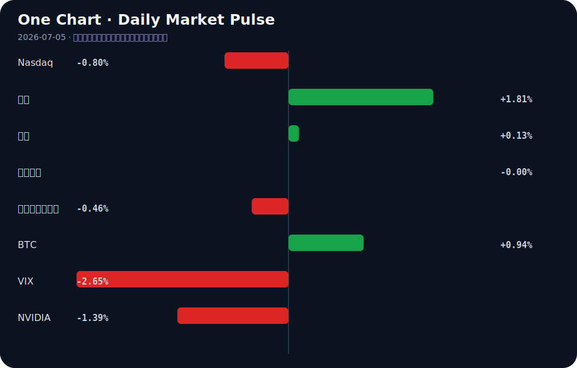

# Daily Intelligence
> 2026-07-05｜Sunday

## Today’s Thesis｜今日一句话
AI Agent 的商业化正撞上“成本墙”与“质量墙”，从替代人力的叙事转向人机协同的现实；同时，全球央行购金创本世纪新高，资本在技术不确定性中寻求实物资产确定性。

## ① Executive Summary｜30 秒
- **AI**：AI Agent 技术进展不及预期且运行成本飙升，企业开始引入预算协议限制支出，并在关键质量把控环节重新雇佣人类 [A3, A9, A11, A22]。
- **商业**：重度 AI 采用者反而增加雇佣，制药与制造巨头加速设立 AI 高管与工业 AI 合同，人机协同替代单纯替代 [A4, A8, A21]。
- **宏观**：全球央行黄金储备达本世纪最高水平，美联储 7 月大概率按兵不动，去美元化与避险需求正重塑全球资本锚点 [B10, B21]。

## ② AI Daily

### Agent 的成本与进展瓶颈
**What Happened**：Meta 扎克伯格承认 AI Agent 技术进展慢于预期 [A11]；AI 运行成本已超过被替代的工人 [A9]；开发者提出“原子预算预留”协议以阻止 Agent 失控支出 [A3]。
**Why It Matters**：打破了 AI 无限廉价替代人力的幻象，ROI 计算从“能力可行”转向“经济可行”，无预算约束的 Agent 在复杂任务中具有财务毁灭性。
**Second-order Effect**：Agent 预算协议标准化 → 企业 AI 支出可控化 → 垂直场景的 SaaS 订阅制重于按 Token 计费。

### 质量塌陷与人类回归
**What Happened**：福特汽车因 AI 未能匹配质量检查，重新雇佣人类工程师 [A22]。
**Why It Matters**：证明在容错率极低的工业制造环节，AI 的“统计概率正确”无法替代人类的“确定性验证”，1% 的缺陷率在工业规模下不可承受。
**Second-order Effect**：AI 质量缺陷 → 人类重新介入 → “AI 生成+人类审核”成为高价值流程标配。

### OS 级重构与记忆架构演进
**What Happened**：泄露视频显示微软正开发完全围绕 Copilot 和 Agentic AI 构建的轻量级 Copilot OS [A1]；行业反思检索不是 AI 未来，长期记忆机制才是关键 [A24]。
**Why It Matters**：AI 从应用层下沉到系统层，且从外部 RAG 检索转向内化记忆模型，这改变了计算交互的根本范式。
**Second-order Effect**：OS 级 Agent → 硬件唤醒机制优化（如 Wake-on-LAN [A13]）→ 端侧 AI 算力与内存超级周期强化 [A14]。

## ③ Business Daily

**制造**：福特重新雇佣人类工程师以弥补 AI 质量不足 [A22]；BigBear.ai 获得造船厂合同及供应链工具推进工业 AI [B8]；Carl Zeiss Meditec 完善制造分析 [B9]。AI 在制造业从“替代”走向“辅助与质检补位”。

**医疗**：基层医生配备“AI助手” [A12]；制药巨头任命 AI 高管 [A21]；健康中国政策释放商业健康险空间 [B22]。AI 在医疗的渗透从研发端向基层诊疗与保险支付端延伸。

**消费/物流**：中国今年快递业务量已超千亿件 [B1]；海天味业获回购利好支撑股价 [B4]。物流基建红利见顶，消费龙头靠回购稳市值，反映内需弱复苏下的防御性操作。

## ④ Macro Observation｜机制分析

**世界正在发生什么？** 全球央行将黄金持有量推至本世纪最高水平 [B10]，黄金价格在创纪录高位展现韧性 [B13]。美联储 7 月维持利率不变的概率达 82.4% [B21]。

**为什么发生？** 储备策略正在演变，央行对冲美联储政策风险与地缘不确定性 [B7, B24]。西方关于“产能过剩”的言论反映了对中国工业崛起的恼怒 [B2]，夏季达沃斯上中国展示工业实力 [B3]，全球供应链与防务市场（北约需要防务市场 [B17]）正在重组。

**资本如何流动？** （推断）资本正从高估值且进展遇阻的纯软件 AI Agent 概念流出，流入具有确定性的实物资产（黄金）与绿色经济（已超 10 万亿美元 [B20]）。AI 内存超级周期因端侧 OS 重构获得资金支撑 [A14]。

**接下来关注什么？** 美联储降息预期与央行购金的博弈 [B24]；AI 预算协议能否在开源社区形成事实标准 [A3]；中国低空经济与绿色经济的政策落地转化为订单的节奏 [B19, B20]。

## ⑤ Signal Dashboard

| 指标 | 最新值 | 今日 | 信号 |
|---|---:|:---:|---|
| [Nasdaq](https://finance.yahoo.com/quote/%5EIXIC) | 25,832.67 | ↓ -0.80% | 风险偏好降温 |
| [黄金](https://finance.yahoo.com/quote/GC%3DF) | 4,187.30 | ↑ +1.81% | 避险/通胀对冲增强 |
| [原油](https://finance.yahoo.com/quote/CL%3DF) | 68.78 | ↑ +0.13% | 供需平衡 |
| [美元指数](https://finance.yahoo.com/quote/DX-Y.NYB) | 100.86 | → -0.00% | 中性 |
| [十年美债收益率](https://finance.yahoo.com/quote/%5ETNX) | 4.37 | ↓ -0.46% | 利好久期资产 |
| [BTC](https://finance.yahoo.com/quote/BTC-USD) | 63,133.99 | ↑ +0.94% | 风险偏好改善 |
| [VIX](https://finance.yahoo.com/quote/%5EVIX) | 16.15 | ↓ -2.65% | 风险偏好改善 |
| [NVIDIA](https://finance.yahoo.com/quote/NVDA) | 194.83 | ↓ -1.39% | 风险偏好降温 |

## ⑥ Deep Insight

过去两年，AI 的核心叙事一直是“廉价且全能的劳动力替代”。但今天的信号表明，这一叙事正撞上两堵高墙：“成本墙”与“质量墙”。[A9] 明确指出 AI 变得比它取代的工人更昂贵，[A11] 承认 Agent 技术进展不及预期，而 [A22] 中福特重新雇佣人类工程师则是对质量塌陷的直接回应。

机制上，Agentic AI 需要多步推理、工具调用与迭代纠错。每一次循环都在消耗 Token。若没有 [A3] 提出的“原子预算预留”机制，一个简单的任务可能因 Agent 陷入死循环而指数级消耗资源。AI 的运行成本并不随模型缩小而线性下降，反而随任务复杂性指数上升。同时，[A4] 显示重度 AI 采用者雇佣了更多人，这意味着 AI 扩大了业务边界，而非单纯缩减人头，管理扩大的边界仍需人力。

在质量方面，大语言模型本质是概率机。在容错率高的文案生成中，99% 的概率正确尚可接受；但在福特的汽车制造质检中，1% 的缺陷率意味着大规模召回。人类工程师提供的是确定性验证，这是概率模型无法内生提供的。因此，“AI 生成+人类审核”将成为高价值流程的强制标配，但审核成本往往在初期 ROI 计算中被忽略。

非共识视角在于：市场仍将 AI 视为通缩力量（压低劳动力成本），但短期内 Agentic AI 实际上是通胀力量（推高算力与内存成本 [A14]、推高人类审核溢价）。AI 的真正价值不在于替代，而在于通过 OS 级重构（如 [A1] 的 Copilot OS）和记忆架构演进（[A24]）扩大可解决问题的边界，这需要庞大的 Capex 支撑。

反方观点认为，规模定律与更廉价的端侧模型（如 [A13] 的本地 RTX 5080 方案）终将打破成本墙，而自我纠错循环将攻克质量墙。证伪条件：若未来两三个季度内，AI SaaS 企业的毛利率显著扩张，同时 Agentic 工具的 ARPU 值稳定或下降，则成本墙被打破；若制造业的 AI 质检缺陷率在不依赖人类在环监督的情况下降至人类基线以下，则质量墙被打破。在此之前，应预期 [A3] 类预算协议与“AI 操作员”岗位的激增。

## ⑦ Tomorrow Watch
1. 验证微软 Copilot OS 泄露视频的真实性及官方回应 [A1]。
2. 追踪开源社区对“原子预算预留”协议（agent-budget-protocol）的采纳度与 Star 数 [A3]。
3. 关注美联储 7 月议息会议前最后几位官员的讲话，确认 82.4% 暂停加息概率的稳定性 [B21]。
4. 观察福特汽车重新雇佣人类工程师后的产能与质检数据披露 [A22]。
5. 监控全球央行黄金储备数据的下一期发布，验证“本世纪最高水平”趋势是否延续 [B10]。

## ⑧ One Chart

图表反映了风险偏好的分化：科技股（Nasdaq、NVIDIA）降温，而避险资产（黄金）与特定风险资产（BTC）同向上行。这种相关性暗示资本在从高估值科技板块流出时，并未全面撤退，而是在寻找替代的流动性出口，但这并不构成黄金与 BTC 具有相同宏观驱动的因果证明。

## ⑨ Quote of the Day
> “Price is what you pay. Value is what you get.”
> — Warren Buffett

## ⑩ Action Items｜今天值得思考什么
1. 思考：当 AI 推理成本超过人工成本时，企业的 AI 转型优先级应如何重排？
2. 验证：你所在行业的容错率是否允许 AI 独立决策，还是必须建立“AI 生成+人类审核”的闭环？
3. 比较：RAG 检索增强与长期记忆模型在具体业务场景中的边际成本差异 [A24]。
4. 追踪：央行购金行为与本国货币汇率波动之间的反身性影响 [B10]。
5. 关注：绿色经济（超 10 万亿美元 [B20]）与低空经济 [B19] 的政策补贴向商业化订单转化的时滞。

## 信息边界
- **来源覆盖**：AI 技术动态、全球宏观经济与央行政策、中美股债汇商核心资产、部分产业政策。
- **时效**：新闻截至 2026 年 7 月 4 日至 7 月 5 日晨（UTC）。
- **市场数据**：反映最近交易日收盘或盘中状况，存在滞后性。
- **限制**：部分新闻源自二手聚合或泄露视频，重要判断需回溯原文验证；未覆盖非英语/中文源的其他地缘突发新闻。

## Sources

### AI

- [A1：Microsoft Copilot OS revealed in LEAKED video: built on Copilot and agentic AI](https://www.windowscentral.com/microsoft/windows-11/microsoft-copilot-os-revealed-in-leaked-video-lightweight-windows-os-exploration-features-new-desktop-ui-built-entirely-around-copilot-and-agentic-ai) — Hacker News · AI
- [A3：RFC: Stopping runaway AI agent spend with atomic budget reservations](https://github.com/iamapsrajput/agent-budget-protocol/blob/main/RFC.md) — Hacker News · AI
- [A4：Ramp data shows heavy AI adopters hire more](https://econlab.substack.com/p/we-can-finally-say-ai-isnt-killing-jobs) — Hacker News · AI
- [A9：How AI Became More Expensive Than the Workers It Replaced [video]](https://www.youtube.com/watch?v=cfaZZPjA3g0) — Hacker News · AI
- [A11：Exclusive-Meta's Zuckerberg says AI agent tech progressing slower than expected](https://finance.yahoo.com/technology/ai/articles/exclusive-zuckerberg-says-ai-agent-201123441.html) — Hacker News · AI
- [A12：当基层医生有了“AI助手” - 新浪财经](https://news.google.com/rss/articles/CBMieEFVX3lxTE1rQTJqZkxnaXNlNTAwbHQ4X0p3RTRuR3h0QWJlUFNMcWxuTWZlXzU4Uzk2NVpLT3B6bFlfUzV0NWtZUm02NGFkQTNtODZnVjVOQVZWUVVWRVdWV0QyR1RaaFdIemIxMmNvWUx2MzNfa1YzZFdmZEI2Uw?oc=5) — Google News · AI 中文
- [A13：Show HN: Using Wake-on-LAN for an AI Project](https://guilhermefrj.medium.com/i-built-a-local-chatgpt-killer-on-a-single-rtx-5080-heres-everything-that-went-wrong-and-right-38343c516451) — Hacker News · AI
- [A14：The artificial intelligence (AI) memory supercycle is getting stronger. Here's how you can profit from this boom with less than $100 - MSN](https://news.google.com/rss/articles/CBMivgJBVV95cUxOalhoZUhkWjlGWEZwRHJfbC1RWHNPUVk0aDNhTFo3UEZwN3JfSDF1cmpkWUwyS0R0OGlvSnl1M0JOejVyYVNJeG85YXpYUXZZRmxtVlRxTG1DZU5rTzFmcTc1ODR5Q01NU0x3QTJ2VDJwdVVqVnNjUEVaend4cTB4WTZtVkdtNHdscWZ6UXlxRFljb3pSc2I0ZWYxNEs2c3BSa2EyZlh3WjFjMHYyNS1wM19aQ1dVb0tZenpzQjBZby1SVXdBQTBTNVROQloyTGJxYnI1QlVIM1lFTXE1ZDBFcFZaR2EyeGN2VHRqSnZlR21fS3NXeW40U0p6ZmlhczBrWlNjUjJwM1Z0Y1p2MjVOUzQ5b21kaEZxMFBfVmZHVjdDTW81TzQ1VVZfMFRaUFIySzJVYUIxc2dHOWVZNnc?oc=5) — Google News · AI
- [A21：刚刚，又一制药巨头任命AI高管 - 新浪财经](https://news.google.com/rss/articles/CBMilwJBVV95cUxPZnh1b0ZMdWw0RHNxbms0Yng3SlFuTHZHNzg3QmlycTdzRVFnWENsNGhreS1IMHV2OTRGOUhJVDdnNWRqeHNxeXF6czF1NHl3WUxsQWpYVTVicWQxSFRpQjR6c2N1YmtoaG1jNHpWdnVITjBSSm43WWd4TUc4STlENUk3REhpOW14ampBZVFYMUdMeGpGUnl1R2d5TE0xQWQwN0FkYVRrYzcwczgzLUlrdTlMQllRR3FBS0VxWFp0Y0F1T1AwNjBlNi13VXVXcHlzOEpJMGw5ZkhlZnBEeDczT3RRaVNjUGh6aXdyZDluOWhUVFctVkQ3SU5sVDVTM3Axb0JmZ2htN0pJZzQydlhRWld3Z000Rzg?oc=5) — Google News · AI 中文
- [A22：Ford rehires human engineers after AI fails to match quality checks](https://www.bbc.com/news/articles/cgrkd41n2v9o) — Hacker News · AI
- [A24：Retrieval is not the future of AI – if it was, Google would have won already](https://news.ycombinator.com/item?id=48788520) — Hacker News · AI

### Business & Macro

- [B1：今年我国快递业务量已超千亿件 - 人民日报](https://news.google.com/rss/articles/CBMif0FVX3lxTFBTWENpNGlBWjVaVVFzNHV1Z2dqanhnZE1scHNXYW5xS0gtN205dDUxWlg0aWFKbHB6S3VQQjhLck9wZlhWUzIyTDFTTVdkQVpyRVVNVXpNS19IdzBFMmJhNDRjT0hzd0FjTTE3S1J0bkNoODJKUXNESFZmRU9rNWc?oc=5) — Google News · 行业
- [B2：Opinion | ‘Overcapacity’ talk reflects a West irked by China’s industrial rise - South China Morning Post](https://news.google.com/rss/articles/CBMiuwFBVV95cUxON3pBd0FSRFFxNkxYRDZJTFZ1R19uZmxTcW0yRmN6Szg4Wlgwc0dHbEJQVzk2ekdPYXlWdDE4YWVrRDFJT2lhNGlBSERiREZERzBWU1JNVDVSMXhjTm82Qk5oNElfczAtZXRvcmdnbEVyOGZqWGNUUTRneDh6Qkk5bWU3eXVUUlNOZlowWWdXYmx2U3VuZnlzVFFnVnBvN1B4SHRfY3lyXy1sUXBlaFA4M3h6cjB0WDBKRmo00gG7AUFVX3lxTE5qRElSWE0xOFA5a1J6WmJGRUxlejY5LUxCUEhIR1lGRTVKSndXVHZ1Y242bXM1Yk5IVVpFN1pxbnhmelozbl90ZEhvZWxzSmRYWU1tVGF4c25GVFcyVU9kVFcyajdMZkt3U1ZZNXM3MWh2RDZHX0hyRVRuNWhLLXpicGlGZ2VsdjNyZ3lDWGt5SXBNdzR4ZnMwV205cjZkbTlwNXd1aUlCbVh3QzN2ak95SHV3NHpTN044bkE?oc=5) — Google News · Global Economy
- [B3：At WEF summer Davos, China flexes industrial heft and vision - The Sunday Guardian](https://news.google.com/rss/articles/CBMiuAFBVV95cUxQOXM4YTJTbXJ4d1dQWjNwYWp2MFZtTl9uTEJpMkJ0eWEtS0hFSXhJaHdvSkpCM1RqZW96Smw1M2ZnTTQzZ3ZPdXVuYmlNNUQ0ZnRhTzZDWmRHYkhaYkIzaFhsWDZ3V19JSG1ZY1F0ZHh6LTgtN3FzazBjbm1nYldLeVl1SGJ2SlFaenhlLWRKQTlMX0dQOG95d2JJV240UGpxN0VScDZGcG9OLUdLaVdTejhwSlA2RlBP0gG4AUFVX3lxTFA5czhhMlNtcnh3V1BaM3BhanYwVm1OX25MQmkyQnR5YS1LSEVJeElod29KSkIzVGplb3pKbDUzZmdNNDNndk91dW5iaU01RDRmdGFPNkNaZEdiSFpiQjNoWGxYNndXX0lIbVljUXRkeHotOC03cXNrMGNubWdiV0t5WXVIYnZKUVp6eGUtZEpBOUxfR1A4b3l3YklXbjRQanE3RVJwNkZwb04tR0tpV1N6OHBKUDZGUE8?oc=5) — Google News · Global Economy
- [B4：“酱茅”海天味业大涨！股价创五年新低后，获回购等多重利好支撑 - 新浪网](https://news.google.com/rss/articles/CBMickFVX3lxTE8yYnlxM0toTTJfR1F3T3BNdDVIYjlkTTZXbVEyUDl2cmtVemNLWnZOYk5MVmR3SWRHLXVUMUVFWVdZSTM4WnVUNE02Zmo0eW1KU1pOdlRoYmszU2tTNVl4RnB0V1NhaS1DWFRJWUJJZFVNZw?oc=5) — Google News · 行业
- [B7：Gold Price Resilience: Real Yields, Fed Risk & Central Bank Reserves - equiti.com](https://news.google.com/rss/articles/CBMitgFBVV95cUxNRVl5bGZycHIzTlhsOHdVc1ZCRG5wVFRva0o0dU5odkE4MDBMWEZRYy16UmRpbXNyVlF6b085R242SUx3cjBjQkhWelUwNlZRb1ROYUtxRHR2UDljTWtkOFpYTFJpVGg3b2NfQllMS3piSVRTRHo4QndMVndUN3ZITkhLTUpOZDVSLVVZaDZWd3dBSDZIMmxPc0NTXzBLVGh5YU1XcW5ibVpMQXMyeWtKYjBZN3R1QQ?oc=5) — Google News · Markets Policy
- [B8：BigBear.ai (NYSE: BBAI) Pushes Into Industrial AI With Shipyard Contracts And Supply-Chain Tools - foreignpolicyjournal.com](https://news.google.com/rss/articles/CBMi2gFBVV95cUxPN1FBMGtpTlJKLWJUVEd2TVN0QmJOUDBCcF91WW1UeUwySHdHTXU2S0ZoN3R4VnJ6cDFyaC1tUWVqYUdMMWFuU3RtZ2tfdkl6MXV2Z3lUa05IY1V3cDBENDBsMlJJYXc4aDIteFJkaVJST0tVcWo5cjM1c29hZXFuX3hPV1BUVnBSM3M5UUFNZnhQUy1wY2ZtRHF0d2xXdXlpY1BpNG5ReEw5ZG00WDFoUnl4Y3RSbl91azJUTVBZd2pkN2dGRzJHNUJkTTlRYjV5MFhLMTZQandqQQ?oc=5) — Google News · Technology Business
- [B9：Carl Zeiss Meditec (XTRA:AFX) Refines Manufacturing Analytics, Is It A Bargain? - simplywall.st](https://news.google.com/rss/articles/CBMi2gFBVV95cUxNRjlxV3R5dW5iUDV5ZGZuMVBFbUx3MFdEd2tlS0J1Q1dGTERnX2dsQ3BJNHZ4a0NKMGlqYVlOZ0MxOTd3X0EtY3R5c1k5ZVcwQkN0S2MxLTlQdm9ZYUJCNHpFWHpLVDVZSGVUbWF6SnN2YVFFVkVuZEJQMlRMMTE4VFhVX1Z4ZGxleGJrM1BJRGlBLU5LS2RvOWxMLTY5RnhJWlJXeHhSYVFrVVZ5WG5SME9NRlFxamdNUTZRMkhXd1c0TkRDZnktYVFJVEFzRklTTmQ1ZUZmaE5ZZ9IB3wFBVV95cUxQd003T1JPRzhZTkNqaDd6VGoybldlTnJlSW1tTTVjZ0lYZDExTDF2VFRtMEMtV3ByQXJmb3RlVjhrT2JLaUVaOUg0akVPT0lYdWVqQWc5THBKWUo4UXpNRDY4VURCN1JMTXAtQlppSmdZd00yRkxYbWlWakdGQWdTYUhWRDVzOXpubWZnZHFnT0pJT1I5LVp0WTNscUNvZ3E2aFRxQ3NvZVNvMGR1Z1FETl85UXlIQWdMbGgzR0tuWWRoajBCdVVkMTFZbHFqSTBPSWJSQ3dDeFQ2STBPVWpF?oc=5) — Google News · Technology Business
- [B10：Central Banks Push Global Gold Holdings to Highest Level This Century as Reserve Strategies Evolve - MEXC](https://news.google.com/rss/articles/CBMiSEFVX3lxTE9INXVIUkozRUVJUDdwV05sTzVtVmNKTV9qdHlEQXBXbWxacXpZMGhpd1k2ZUpKU3ZaX2R2UmFURHlHajU0YzBtTg?oc=5) — Google News · Markets Policy
- [B13：Gold Price Record Highs 2026: Investment Strategy & Market Analysis - Intellectia AI](https://news.google.com/rss/articles/CBMiZ0FVX3lxTE41Z2ZreDBDak9rejJ6WVdUUHpOWTNka0ZEeUxEcS1wbGhXVkhCamRlLW1WYmZRRGdDcGZwRmNJRXAyVGh6Xzl2SnZfYVR1OWxUcm5taVFOSkg4VVlyQ040cjhxa0hEMVU?oc=5) — Google News · Markets Policy
- [B17：NATO Needs a Defense Market - logos-pres.md](https://news.google.com/rss/articles/CBMiakFVX3lxTFBQSDRaLW9FVWVXbXo3LWVEeVdjY09BMFljUHVoRHhqdEU1M1ozOXNJZE5jZHUxa1E2ZncyamtnUzVnR1VmMGExV0NGVUhFQVhnaWYtMUVBX0JXajFHb3IydUZhSXdpRVZDalE?oc=5) — Google News · Global Economy
- [B19：深耕产学研一线 青年团队助力低空经济规范化高质量发展 - 搜狐网](https://news.google.com/rss/articles/CBMiiAFBVV95cUxPdG15WVVTYUNaZUduTjV4Y0RmbUtGNlhXNWJlNVVicVVNMWk4WTVGcGZqQl85ZWtDdUY5dVNsQ0ZJZnZYeWU5eW11eFZiZDdlRjN0SlMxTF9QYlBnbS15YjZZck5ubzgtb1lBUnE3TFBUU2ZnQXA5WmgzaExZaWFJbjhZWFpvRTdY?oc=5) — Google News · 行业
- [B20：The green economy has just surpassed $10 trillion and would already be the world's third-largest industry if it were counted as a separate sector - ECOticias.com](https://news.google.com/rss/articles/CBMiiwJBVV95cUxPd25fYkFSVUExVGlGZ1d3ZnN2b3RKRUxrUkNhT3ZhNHhIUWgxU0RUQTBWRURzMExZLUxOT1Nvd3IxWFlWbTJlWnc3X3hWMXg3LTFRWl9CRmtpSFd1SUtVb2VMbWZab3hEYUhtMVZJem4tMU8zMEZCTHZ3NnVkZV9pSjJETzEyUGh2Z0ZGaWdkNEFDZVIxNGZ5NjQtZEtTVXlLdDVxQmp1UXVTbmNiQmlPanlHVGZQUVhNWjZ6eU1pTjRwb0Q3M3ptNHh3eUxzajViSGpxUkxYMl9XVnZfeDlWZFUwbHJMRGNBVGRDUWVUTi1KeFdpM0Z3LTM4ajRYMERhODRHZUpRSm1ySjA?oc=5) — Google News · Global Economy
- [B21：Fed Expected to Hold Rates in July as Markets Price in 82.4% Chance of Pause - MEXC](https://news.google.com/rss/articles/CBMiSEFVX3lxTE80QzlGNTZVWnR0amQ1dF9OdkNDNi1QTUk5enlrNlJQY1JKT21qRkMxN0tERTVaVFF6QktmQ1hpQTZuclgybEVNaQ?oc=5) — Google News · Markets Policy
- [B22：张琅：健康中国政策的落地进一步释放商业健康保险空间 - 新浪财经](https://news.google.com/rss/articles/CBMi3AFBVV95cUxNeHQxNmpfdzV4MGwyZHFZT3ZBSm1lbzVlSUs5S2dPN1BFZUlHTlVUaEZXdGs1T1dPZ3VYMHpCUWJMRWR5ajBLTk1kUG9Xa3VNdzl2RHpnVVRLRHl4RWZVNjd5OElsTUVJV2dnYVd4WkVVZzBab2VjUXBQWnFHM01LV0oxdlVJeGpoYkdaNDhVdGZlR2RxNmlRbTdRN05QNDVUNzlaV0paWkVWaVNGT1FXM1dmSHBEOUtwWVRVMkloZk02N2FZUjFNRU52QlB3RW40eVN0YkFJWUdsSlFU?oc=5) — Google News · 行业
- [B24：gold-prices-blocked-central-bank-demand-vs-fed-rate-hike-risks - equiti.com](https://news.google.com/rss/articles/CBMirwFBVV95cUxPeGhZYS1ERTZOaWFQSEhBcnQ0TzZHUjZSQ0hZWUJLUG5YV3RBQ3ZMTTU2Q3Nfa2FnNUg0RFNQVVlkRTJieDFqTHJYR09ucGx6a2IyT1Y3Tk14ZU1MOHdmYWd5TmdueHVqRjRfeXVKb1JXQUlqX0Q5VHNEQmdQdVNjOHBBeE9KRXk2ZjdUc3pwcTZ5TWR3ZF9KM09ZUFBZMEZiMGJmZm1hWWJTTERVdmd3?oc=5) — Google News · Markets Policy
