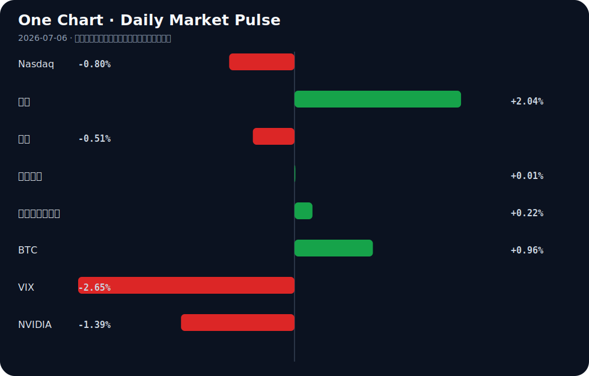

# Daily Intelligence
> 2026-07-06｜Monday

## Today’s Thesis｜今日一句话
AI 正从模型能力竞赛转向平台税与生态防御战，而宏观流动性正从美债向黄金与边缘资产溢出，两者共同重塑风险资本的重定价逻辑。

## ① Executive Summary｜30 秒
- **AI**：大厂开始通过生态锁定征收“AI 税”（如 Microsoft 365 提价 42% [A8]），引发初创公司对 IP 盗窃和平台战争的恐慌 [A7][A21]。
- **商业**：AI 初创公司正通过构建专有模型 [A14] 和互操作性协议 [A20] 寻求防御性，而传统制造则转向出口系统级方案 [B1]。
- **宏观**：央行抛售美债换取黄金 [B4]，叠加美联储注入流动性 [B23]，驱动资本从核心固定收益资产向避险资产与风险资产同时溢出。

## ② AI Daily

### 1. SaaS 的“AI 税”降临
**What Happened**
Microsoft 365 因整合 Copilot 等连续创新，部分产品价格涨幅高达 42% [A8]。

**Why It Matters**
这标志着 AI 功能从“免费获客补贴”正式转变为“租金抽取”阶段。AI 的商业闭环不再仅依赖算力或 API 调用，而是直接嵌入现有 SaaS 订阅作为强制增值项。

**Second-order Effect**
SaaS 提价 → 用户寻求开源/替代方案 → 初创公司获得切入点但面临被大厂智能体平替的锁定风险。

### 2. 平台战争与 IP 信任赤字
**What Happened**
开发者警告勿将 AI 研究 IP 交予大厂智能体，认为大厂本质上是会利用一切数据赢得竞争的“纸夹优化器” [A7]；行业呼吁与大型 AI 展开平台战争 [A21]；Vibe-coding 平台 Base44 推出自有模型以寻求防御性 [A14]。

**Why It Matters**
大厂智能体不仅执行任务，还“阅读”用户数据。当大厂既是裁判又是运动员时，初创公司的核心护城河（专有代码与业务逻辑）将直接暴露给竞争对手的下一代训练数据集。

**Second-order Effect**
数据隔离 → 大模型退化（缺乏专有长尾数据）→ 催生垂直/私有智能体与本地化小模型生态繁荣。

### 3. 智能体互操作与硬件锚点
**What Happened**
工具允许将 AI 智能体转化为 MCP Server 供 ChatGPT、Claude 等调用 [A20]；同时，OpenAI 正在加速 2027 年推出“AI Agent Phone”以挑战 iPhone [A11]。

**Why It Matters**
智能体间的通信标准化（MCP）是构建多智能体协作网络的基建；而专属硬件则是智能体在物理世界获取多模态数据与交互权限的终极锚点。

**Second-order Effect**
智能体互操作性 → 智能体经济网络形成 → 专属硬件成为继智能手机后的新终端战场。

## ③ Business Daily

### 科技
AI 投资超级周期在 2026 年呈现市场两极分化 [B2]，资金向基础设施层与具防御性的应用层集中。印度初创生态在 6 月下旬至 7 月初展现韧性，25 家跨领域初创公司筹集超 1.25 亿美元 [B16]，显示非头部市场的长尾资本依然活跃。

### 制造
中国工业机器人出海正从单一硬件出口转向“卖方案”的系统级交付 [B1]。这是制造升级的典型路径：当单机毛利被压缩，集成与软硬一体化成为维持溢价的关键。

### 金融
央行持续抛售美债增持黄金 [B4]，摩根大通也因此调整金价目标 [B14]。日本央行虽加强限制性立场，日经指数仍创历史新高 [B17]，显示国内资金循环与外部套息逻辑对冲了紧缩政策的压制。

## ④ Macro Observation｜机制分析

**世界正在发生什么？**
全球货币体系正在经历结构性微调：区域货币使用扩大，但美元仍主导贸易 [B18]；同时，央行作为主权实体在抛美债买黄金 [B4]，而美联储作为流动性提供者在购买国库券 [B23]。

**为什么发生？**
这是地缘对冲与国内流动性管理的冲突。央行需要资产主权去美元化（买金），而美联储需要压低短端利率防范流动性枯竭（买债）。两者背道而驰。

**资本如何流动？**
事实：黄金创月度首涨，美元走软提振需求 [B11]；加密市场因联储流动性注入而乐观 [B23]。推断：资本正沿着“避险+流动性双溢出”的奇异路径流动，既买入黄金对冲主权风险，又买入 BTC/科技股承接短期流动性。

**接下来关注什么？**
关注联储购债与央行售债的收益率争夺。若联储 100 亿购债无法压住长端收益率，黄金将加速向上突破，反身性循环将启动：央行买金 → 美元走软 → 以美元计价的黄金上涨 → 央行资产负债表改善 → 继续买金。

## ⑤ Signal Dashboard
| 指标 | 最新值 | 今日 | 信号 |
|---|---:|:---:|---|
| [Nasdaq](https://finance.yahoo.com/quote/%5EIXIC) | 25,832.67 | ↓ -0.80% | 风险偏好降温 |
| [黄金](https://finance.yahoo.com/quote/GC%3DF) | 4,196.50 | ↑ +2.04% | 避险/通胀对冲增强 |
| [原油](https://finance.yahoo.com/quote/CL%3DF) | 68.34 | ↓ -0.51% | 通胀压力缓解 |
| [美元指数](https://finance.yahoo.com/quote/DX-Y.NYB) | 100.87 | → +0.01% | 中性 |
| [十年美债收益率](https://finance.yahoo.com/quote/%5ETNX) | 4.49 | ↑ +0.22% | 中性 |
| [BTC](https://finance.yahoo.com/quote/BTC-USD) | 63,691.14 | ↑ +0.96% | 风险偏好改善 |
| [VIX](https://finance.yahoo.com/quote/%5EVIX) | 16.15 | ↓ -2.65% | 风险偏好改善 |
| [NVIDIA](https://finance.yahoo.com/quote/NVDA) | 194.83 | ↓ -1.39% | 风险偏好降温 |

## ⑥ Deep Insight

**“AI 税”与 IP 信任赤字：SaaS 生态的解体危机**

Microsoft 365 因整合 AI 提价最高达 42% [A8]，这不仅是通胀对冲，更是科技巨头对“AI 税”的强行征收。然而，结合当前开发者与初创公司对大厂 IP 盗窃的极度恐慌 [A7] 及公开宣战的平台战争 [A21]，这一提价策略将触发致命的反身性循环。

事实层面，微软试图将 Copilot 的算力成本转化为用户侧的经常性收入；推断层面，用户为 AI 支付溢价的同时，必然要求更高的数据安全承诺，但这与巨头“利用一切数据赢得竞争”的纸夹优化器本质相冲突 [A7]。当企业发现其输入到 Claude 或 ChatGPT 中的核心 IP 可能被用于训练替代品时，数据隔离将成为唯一理性选择。Tripadvisor AI 摘要对危险酒店给出好评 [A15] 的事件，从侧面印证了黑盒 AI 系统在事实核查 [A22] 与安全性上的不可靠，进一步削弱了用户将核心数据交托给大厂云端的意愿。

这催生了一个非共识视角：高昂的“AI 税”非但不能巩固云 SaaS 巨头的护城河，反而将加速数据本地化与私有智能体架构的采用，最终导致中心化 SaaS 生态的解体。逻辑链条如下：巨头 SaaS 提价 → 用户寻求开源/初创替代 → 巨头智能体抓取初创数据与 IP 以平替 → 初创死亡或退回私有化部署 → 巨头 SaaS 生态因缺乏长尾创新数据而空洞化。Vibe-coding 平台 Base44 推出自有模型以寻求防御性 [A14]，正是这一逃逸趋势的早期信号。AI 智能体必须证明其工作 [A23] 的呼声，也是对大厂黑盒信任崩塌的技术性反扑。

反方观点认为，SaaS 巨头的转换成本极高，Copilot 带来的生产力提升不可替代，企业用户将无奈接受 42% 的提价，并通过内部 DLP（数据防泄漏）工具而非放弃平台来缓解 IP 焦虑。

证伪条件：若未来两季度 Microsoft 365 企业版流失率未显著上升，且开源与本地化 LLM 在企业 IT 预算中的占比未出现加速增长，则说明“AI 税”与 IP 担忧尚未越过生态解体的临界点，巨头的捆绑销售逻辑依然坚不可摧。

## ⑦ Tomorrow Watch
1. 验证 Microsoft 365 提价 [A8] 在官方渠道的落实细节及企业用户续费率初测数据。
2. 追踪美联储 100 亿美元国库券购买 [B23] 对短期流动性指标和美债收益率的影响。
3. 关注日本央行 [B17] 后续政策声明对日经指数及亚太资本流动的作用。
4. 验证 OpenAI AI Agent Phone [A11] 是否有官方公告或供应链谍照流出。
5. 追踪 Tripadvisor AI 摘要安全漏洞 [A15] 是否引发消费者保护机构的正式调查。

## ⑧ One Chart

图表呈现了跨资产的风险偏好分化：黄金与 BTC 同步上涨，而纳斯达克与 NVIDIA 回调。这表明资本正从集中的科技风险向避险与去中心化资产轮动，但 VIX 回落暗示这并非系统性恐慌，而是结构性的资金再平衡。

## ⑨ Quote of the Day
> “Risk means more things can happen than will happen.”
> — Elroy Dimson

## ⑩ Action Items｜今天值得思考什么
1. **关注**企业级 SaaS 订阅在 AI 提价后的流失率数据，寻找生态松动的先行指标。
2. **验证**内部研发数据与大模型交互的隔离与审计机制，评估 IP 暴露风险。
3. **比较**黄金 ETF 资金流入与央行购金节奏的同步性，判断主权资本与市场资本的共振程度。
4. **追踪** AI 智能体互操作协议（如 MCP）在开源社区的采用率，确认智能体经济的基建成熟度。
5. **思考**“AI 税”对中小型企业 IT 预算的长期挤压效应，是否会催生新一代无 AI 附加费的极简 SaaS 套利者。

## 信息边界
本报告事实均来源于提供的新闻聚合源（Hacker News, Google News 等），可能存在二手转述偏差，重要判断请回溯原文验证。宏观与市场数据反映的是最近交易日的切面，不代表实时走势。推断部分已明确标注，受限于信息源，无法覆盖未公开的企业内部决策与地缘政治闭门博弈。

## Sources

### AI

- [A1：AI 2027](https://ai-2027.com/?agi=true) — Hacker News · AI
- [A2：人工智能安全要从娃娃抓起 - 新浪财经](https://news.google.com/rss/articles/CBMiiwFBVV95cUxNQ2w4QW9lNEh0ODJHQWNWYU1JU0NBQlZGWC1RdzEwMVJhbFVWTnBFRkFodlVzNFJ5X0MwdXYyTnMwaU1nTWMySm84YlRERl9UNVloRHZHTkJZLVo0NkszUlhJTGVaMlY5ODJFNk82Mnl1R0EtSFZ2Sk12N1NKSmZUWDkyU3NJS1NYRWxR?oc=5) — Google News · AI 中文
- [A4：The AI Compass Quiz](https://bambamramfan.github.io/ai-compass/) — Hacker News · AI
- [A5：人工智能发展“名场面”不断涌现 北京：领跑AI赛道 托举青年逐梦 - 中国青年网](https://news.google.com/rss/articles/CBMiZEFVX3lxTE9fT1ZBRkJ5bXV2Q2lKaHNXRkxWaGtKUkVSdy1McGxpYy13am9vNGtUcUI0SHdsNnNtUHJXUE1xV2xzM0E1SEN4OFRMNnJfc2hFNk1mazdLVDZtZWowYmhZa0Qtb08?oc=5) — Google News · AI 中文
- [A6：Context graphs: how AI agents can store and use past decisions](https://nanonets.com/blog/what-is-a-context-graph/) — Hacker News · AI
- [A7：Tell HN: don't trust Bigco AI agents with AI research IP](https://news.ycombinator.com/item?id=48798385) — Hacker News · AI
- [A8：New Microsoft 365 pricing live, some products up by 42% due to AI](https://www.windowslatest.com/2026/07/05/microsoft-365-just-got-a-price-hike-over-continuous-innovation-but-copilot-is-the-ai-tax-on-businesses/) — Hacker News · AI
- [A9：The First Half of 2026 Is Over. These 2 Spectacular Artificial Intelligence (AI) Stocks Can Soar in the Second Half. - Yahoo Finance](https://news.google.com/rss/articles/CBMikAFBVV95cUxQLTVpYlZ3dTczTXpQQmJBWGo0SEZwSVc5c1h0Qk5zRVI4VmlGVTktd3BtdWd2TWVXY1JQNnJERXNhcWkxMGg1a1VCTDF2Vnp2SkRfYU5CZ2hHY2prb1RUOU9RdVhISHVCWlZJbk5uYkNNMHBwcTVoaXFQb0RVWEFIakkwZ3k4Tmg2d0NVb3kzQVo?oc=5) — Google News · AI
- [A11：OpenAI is fast-tracking its own "AI Agent Phone" for 2027 to challenge iPhone](https://old.reddit.com/r/OpenAI/comments/1unbqyd/openai_is_fasttracking_its_own_ai_agent_phone_for/) — Hacker News · AI
- [A12：ASX to fall amid AI jitters, oil steadies - SMH.com.au](https://news.google.com/rss/articles/CBMipAFBVV95cUxQWTVIZWpPOUV1NzZtQlQtV3lyQ3NOUDdXMV94clpKbU93NGJnMVMyVnpHckk2YktZbHlYUk9KMjlPdEdwMWE2VnNtUHF3M2ZDYVVPQm5Fdzk3VnpVelB4bE45XzRYdTJaNHJvQmtSVUk2MTkyQlFtRWpjbzJidzJTOVl0RVdpNjFrLU92bjFUYzBzVXZ4R0Nsbm1EYlQzNDZCYjNURA?oc=5) — Google News · AI
- [A14：Vibe-coding platform Base44 launches own model as AI startups seek defensibility](https://techcrunch.com/2026/06/29/vibe-coding-platform-base44-launches-own-model-as-ai-startups-seek-defensibility/) — Hacker News · AI
- [A15：Tripadvisor AI summaries give glowing reviews to dangerous hotels](https://www.euronews.com/travel/2026/07/03/tripadvisor-ai-summaries-give-glowing-reviews-to-dangerous-hotels-consumer-watchdog-finds) — Hacker News · AI
- [A20：Turn Your AI Agent into an MCP Server for ChatGPT, Claude and Cursor](https://quickchat.ai/post/expose-ai-agent-as-mcp-server) — Hacker News · AI
- [A21：We'll fight the platform war against big AI](https://www.anildash.com/2026/06/23/fight-ai-platform-war/) — Hacker News · AI
- [A22：Can AI do fact-checking?](https://www.wired.com/story/fact-checking-ai/) — Hacker News · AI
- [A23：Show HN: Make No Mistakes – AI coding agents must prove their work](https://github.com/momomuchu/make-no-mistakes) — Hacker News · AI

### Business & Macro

- [B1：工业机器人出海“卖方案” - 中国经济网](https://news.google.com/rss/articles/CBMib0FVX3lxTE5uaDVpeF9uVXliSDYtQUNQMlRTYzBxeGktY3lOZFJDMzBnTU01QXk0clM0SFQySXN1cjhraDV0YkdUbmc4Vy1oWWRCeWFydjFPWTFQd0YyT3pobnFHc1k4dHFDLW0tdFRDRnlmQU5Udw?oc=5) — Google News · 行业
- [B2：AI Investment Supercycle 2026: Market Polarization & Opportunities - Intellectia AI](https://news.google.com/rss/articles/CBMigwFBVV95cUxNdlJrSERYdFJRRXVTdDBsZlU3a21FYmxLVjJqRERrN2l2UnU2MTFQNnI5bFFYWDIzRm02MVJ0Y0huUmJMUmJkUjBCNHFidFhMVVlNcWd0SU1TdHBPOWRpc1ZCQ2ViU25OU2NzdW9CSzZIVTV1eWpJa1dZdkVrdFhYeHNrWQ?oc=5) — Google News · Technology Business
- [B4：Central Banks Are Dumping Treasuries for Gold. Should Gold ETF Investors Follow, or Get Played? - AOL.com](https://news.google.com/rss/articles/CBMiiAFBVV95cUxQd0RDbU9reEdwSmZRMjl5UGRTNE9wQkNhSzV2YUR2aXRuWERSX09YS1RtekV0OUpDbzlqaElpWDFfdjFKU09vSlYtUUpKRS1VS19sMWpocEktQjh5VFlOalViNXFuU3N6a3hqWVI1QjQzcHJSYlFBRFpJdDVYbTBtUEZhMkxkN3Mw?oc=5) — Google News · Markets Policy
- [B6：Explore AI Infrastructure Stocks Driving the Next Tech Wave - Kalkine Media](https://news.google.com/rss/articles/CBMiugFBVV95cUxQcXoxenVXT0lXU2E4NlpRTVgzWlItLS1XRU9FbUhXdEFZRDFGUUhCWGp3THFoYzNVMkJabEtmeEFuZlRieTdKYWwtNzNvdzhjeE1xWVNXZEd0N2pZWkkwUEtoeGU0cmNyZGdwQWI3MmZUREhUX3NfMmQ1T1RWT0ljTzA3QVhoOTM4ZHo4bjRRX0FEamh4YmNGZ2lGZnI0R1BnclQ5dWRPYUxxNkxzVnlQSEpNTm5KTk1hWWc?oc=5) — Google News · Technology Business
- [B11：Gold posts first weekly gain in month; weaker dollar boosts demand - Kuwait Times](https://news.google.com/rss/articles/CBMivwFBVV95cUxORTF5WlVDbTBXLUoyOEZEY3ppSUt6ZGg3UklQR21oWXVrWHZiSGJ6LUFtNDRkYmU4bEE0U0FHZDdraTlxS2s2NGdKMllpZHR4OWlxc0VKaFFlX1RDWW9FWGZFSnNOYmlhdlB0Zi01MWQzbGktS2VvcEp4UXJKcTVMQ0xJU19fODdqYXJUcjB1Rm03dnNIN1JUNVFET0RTZ0UycWZNMlNmUTBQeEdQbjZ1VnpXbVRVUk1telY1SnQ0a9IBwwFBVV95cUxOZFRUblhncHhMa0JqOTl6ODBaSEdQRVE5UUxrd0ZWWmxPcWctc1ZEQ3k5SDZQdklFY2ZxNnFMM1NsQzRueFBZZkxTcnpsNFEwN0VmWTM4dXdFUVJiZW5XVVUwQWl2OEtCU3NPZHo2TEx4c1FJYlI3S2pnMVJjVTJubk9RclRpdHpTM1FuaHYwYjBMM3hOUUlTazhjdzg5U1VWM3Z6MzRIME0tRnFWT3F1LTNvRVpYUFRjRXRhc1dBdU1IcXc?oc=5) — Google News · Markets Policy
- [B14：JPMorgan tweaks gold price target as Fed risks return - Yahoo Finance Australia](https://news.google.com/rss/articles/CBMiigFBVV95cUxNTjgwbWF1NkJmLTJHT25iRkpwckExajhETEtMLWhhMWpTeHIxazFvQVJtSHdQMTREQW5CNG01ODFoODd1YW5SSUhiVVVUbTdlZlVtbGhuVFRNNW1OM2JLTHM4cENNZ3BPWXdNN0M4VDlkeTRBZWJXaFVMMjR5V0NIUTZXYXhlVFpSd1E?oc=5) — Google News · Markets Policy
- [B16：Between June 22 and July 04, 2026, as many as 25 Indian startups from diverse sectors raised over $125 million in funding from investors. These sectors include Proptech, Cleantech, AI, Sportstech, Wellness, Edtech, Deeptech, Healthtech, Kitchenware, Finte - instagram.com](https://news.google.com/rss/articles/CBMiUkFVX3lxTE5ZOUdmVl9NM1JjNlBYb1hxZmREc0p6SDBkNXA5Q09BQ3Q4T1pLZVZVTk5mZlBySEZ2TElubWZpQmthYkFkMXk2b1F6RWpmS0ppX1E?oc=5) — Google News · Technology Business
- [B17：Nikkei reaches new record as BoJ intensifies its restrictive stance - equiti.com](https://news.google.com/rss/articles/CBMiuAFBVV95cUxPck0tTVczWUItdFRBNjJHOWFVMUFmUzBOc3J1czlQMnpRa3pMQWdWRWZ6MGhHLVhGWGJzU3dEc3R4UUpVM0RkYmxOVHJTcmIyajBodWU5ZjRzQUsyNlVUZXNWTUplczdQQzR5NkM5T1hPNXc4b2I4ekhvM3FrSENUMDJuZ282NTczelZFV01idnhIVDgwaGF5cUZWZTlyVlpRX3EzNTNMdVdXVnloeHJsallhZWgxaWQ5?oc=5) — Google News · Markets Policy
- [B18：Regional Currency Use Is Expanding, but the US Dollar Remains Dominant in Global Trade, Finds ADBI - The Policy Edge](https://news.google.com/rss/articles/CBMiwwFBVV95cUxQRWVSR3ZEMXh6MGlrWWN4VF9sNnBZNm1xUXRXOUViRUU1Y01aVS1qNlRxQWw5YzN2WDlrcUY5cHdjc2MxaFFzS0NrWm5pTFBVRTJVdHBBS2dtREVDa1RLZ0lXeElDdnVJTGtNNG92eUVCYW5lYjNmUm0wYTVaRjBlcmtLcllVYjNqLWdEenRQXzNPTkxFalpXdFBmZWh0cFkwNlJNOGEtbldFOVJzOXlwWlJsUk05eUNYdmxjUVEySlAxLVE?oc=5) — Google News · Markets Policy
- [B23：Fed Schedules $10B Treasury Bill Purchases as Liquidity Move Fuels Crypto Market Optimism - Bitget](https://news.google.com/rss/articles/CBMiY0FVX3lxTE1lZVNZbU9JV0dNZFd1bEFBZS1ReUZSVGR1NWVabzZVbkhJWDhZSkRWYTZ4R2ZNRjl6UXhPbVlMVlpiZERrQnlQVVdZZFZ2dWdSZk1CM1pNalZTNUhaNDhYdGF0Y9IBY0FVX3lxTE1lZVNZbU9JV0dNZFd1bEFBZS1ReUZSVGR1NWVabzZVbkhJWDhZSkRWYTZ4R2ZNRjl6UXhPbVlMVlpiZERrQnlQVVdZZFZ2dWdSZk1CM1pNalZTNUhaNDhYdGF0Yw?oc=5) — Google News · Markets Policy
