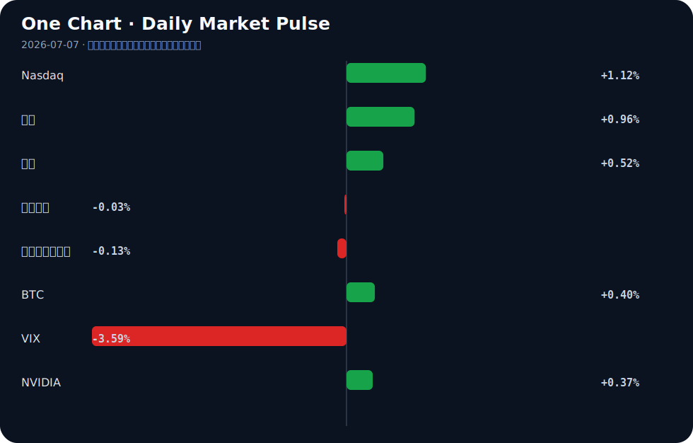

# Daily Intelligence
> 2026-07-07｜Tuesday

## Today’s Thesis｜今日一句话
AI 产业正从“叙事驱动”转向“规则与成本约束驱动”，资本在宏观“胀而不滞”的夹缝中加速向能重构实体成本结构的确定性标的集中。

## ① Executive Summary｜30 秒
1. **AI**：国家标准立项与财政部泡沫警告同步出现，AI 进入“立规矩与挤泡沫”并行期 [A1][A16]。
2. **商业**：企业为投资 AI 裁员，同时资本筹集巨资重构传统服务业，AI 替代从降本走向重塑 [A12][A22]。
3. **宏观**：美国服务业降温提振降息押注，但“胀而不滞”底色未消；中国仓储指数回暖，政策强调“耐心” [B3][B9][B24]。

## ② AI Daily

### 国家标准立项与司法分层：AI 的合规成本显性化
**What Happened**：中国立项6项AI国家标准，覆盖大模型、具身智能、AI安全等 [A1]；专家建议对利用AI实施犯罪采取“行政前置刑法兜底”的分层治理模式 [A8]。
**Why It Matters**：规则正从原则性倡议进入可执行的标准与司法实操阶段。这意味着AI企业的合规成本将从隐性转为显性，且直接关联到商业模式的法律可行性。
**Second-order Effect**：合规门槛将出清缺乏法务与安全冗余的尾部玩家，AI安全与合规工具赛道迎来确定性需求。
标准立项 → 合规成本显性化 → 尾部出清与合规赛道爆发

### 泡沫预警与收益证伪：通用叙事的退潮
**What Happened**：美国财政部报告草案表达对AI泡沫的隐忧 [A16]；DB证券下调Kakao目标价，理由是AI收益模式不存在 [A23]。
**Why It Matters**：宏观监管层开始警惕过度资本开支与商业回报的不匹配，二级市场正在严厉惩罚无法兑现收益的AI概念股。通用大模型的“烧钱换增长”逻辑面临硬约束。
**Second-order Effect**：资本将从通用基础设施向能直接切入业务流、缩短变现路径的垂直应用与小模型转移。
泡沫担忧 → 通用模型融资收缩 → 垂直应用与小模型获溢价

### 资本重构服务业：从“工具替代”到“资产收编”
**What Happened**：企业因投资转向AI而裁员 [A12]；Thrive Holdings筹集20亿美元，专门用于收购并用AI重构服务公司 [A22]。
**Why It Matters**：AI不再仅是提升效率的外包工具，而是成为资本重组传统资产的核心杠杆。就业结构正发生不可逆改变，服务业首当其冲。
**Second-order Effect**：服务业出现“AI收编潮”，被重构公司的剩余劳动力要么向新技能转移，要么被永久挤出系统。
AI投资增加 → 传统岗位裁撤 → 资本收购重构服务业

## ③ Business Daily

### 能源与制造
江苏南通以钢铁行业为重点狠抓节能降碳，打造近零碳园区 [B1]；阿布扎比正建设世界首个综合能源-AI经济 [B14]。**机制**：降碳约束与算力高耗能的特性，迫使能源与AI在底层基础设施上深度绑定。未来的制造优势不在于劳动力成本，而在于“绿电+算力”的复合成本。

### 医疗与消费
史上最严监管致使医美行业高增长泡沫碎裂 [B15]；银发经济下饮料乳品迎健康营养新机遇 [B8]。**机制**：政策强监管正在挤出合规差、营销驱动的消费泡沫；同时，人口结构的不可逆变迁（老龄化）正在重塑消费底座，需求从“外貌溢价”转向“生存质量溢价”。

### 金融
村镇银行进入减量提质观察期，整合存量重塑格局 [B12]。**机制**：防风险导向下的供给侧出清，中小金融机构的牌照溢价消失，合并重组以降低系统脆弱性。

## ④ Macro Observation｜机制分析

**世界正在发生什么？**
美国ISM服务业新订单6月降温，提振了降息押注 [B24]，但整体经济呈现“胀而不滞”的特征 [B3]；中国6月仓储指数重回扩张区间 [B9]，政策层呼吁构建“耐心政策”体系 [B5]。

**为什么发生？**
美国服务业的降温是高利率压制需求的滞后反应，但劳动力市场的结构性缺口使通胀具有粘性，形成“滞而不衰”的僵局。中国处于新旧动能转换期，旧动能（地产、城投）退坡需政策托底消化存量风险，新动能（AI、新能源）尚未形成完全替代，因此需要“耐心”。

**资本如何流动？**
资本正从缺乏收益证明的AI概念 [A23] 和强监管泡沫行业 [B15] 溢出，流向能重构成本结构的服务业并购 [A22]、近零碳制造 [B1] 及能源-AI基础设施 [B14]。这是典型的“从叙事走向资产”的避险与套利并存流动。

**接下来关注什么？**
关注降息预期与通胀粘性的反身性博弈：降息预期推升风险资产，若通胀反复将打断此循环；关注中国“耐心政策”对存量资产整合（如村镇银行 [B12]）的实际落地效率。

*(事实：ISM降温、仓储扩张、财政部草案隐忧；推断：资本流向重构、降息博弈反身性)*

## ⑤ Signal Dashboard

| 指标 | 最新值 | 今日 | 信号 |
|---|---:|:---:|---|
| [Nasdaq](https://finance.yahoo.com/quote/%5EIXIC) | 26,121.16 | ↑ +1.12% | 风险偏好改善 |
| [黄金](https://finance.yahoo.com/quote/GC%3DF) | 4,152.20 | ↑ +0.96% | 避险/通胀对冲增强 |
| [原油](https://finance.yahoo.com/quote/CL%3DF) | 69.05 | ↑ +0.52% | 通胀压力上升 |
| [美元指数](https://finance.yahoo.com/quote/DX-Y.NYB) | 100.82 | → -0.03% | 中性 |
| [十年美债收益率](https://finance.yahoo.com/quote/%5ETNX) | 4.48 | ↓ -0.13% | 中性 |
| [BTC](https://finance.yahoo.com/quote/BTC-USD) | 63,802.93 | ↑ +0.40% | 风险偏好改善 |
| [VIX](https://finance.yahoo.com/quote/%5EVIX) | 15.57 | ↓ -3.59% | 风险偏好改善 |
| [NVIDIA](https://finance.yahoo.com/quote/NVDA) | 195.55 | ↑ +0.37% | 风险偏好改善 |

## ⑥ Deep Insight

**AI 的下一道护城河不是智能，而是“合规税”的支付能力**

当市场仍在争论大模型的智能水平是否触及天花板、参数规模是否还有边际效益时，一个更隐蔽但具决定性的趋势正在浮现：AI 产业的竞争核心正从“算力与参数的军备竞赛”转向“合规税的支付能力”。这构成了当前极易被忽略的非共识视角——未来的 AI 垄断将不是技术垄断，而是“基础设施级合规寡头”垄断。

今天释放的信号极具标志性：中国立项 6 项 AI 国家标准 [A1]，专家提出针对 AI 犯罪的“行政前置刑法兜底”分层治理 [A8]，同时美国财政部在草案中担忧 AI 泡沫 [A16]，Kakao 因 AI 收益模式不存在被下调评级 [A23]。将这些孤立事件拼合，一条清晰的逻辑链浮现：技术狂飙突进的红利期结束，制度与资本的约束期开启。

合规不再是法务部门的防守动作，而是商业模式的核心变量。当大模型、具身智能和 AI 安全需要满足国家级标准，当 AI 生成内容的鉴真成为工信部典型案例 [A21]，当选民依赖 AI 投票引发干预担忧 [A6]，合规成本将呈指数级上升。这种成本不仅是财务性的，更是架构性的——企业必须在模型设计之初就嵌入监管要求的可解释性与可追溯性，这直接牺牲了部分性能与效率。

这催生了一个关键推断：只有拥有庞大现金流与冗余法务资源的巨头，才能承担这笔“合规税”，从而合法地收割市场；而缺乏融资能力的中小玩家将被出清，不是因为技术不行，而是因为“不合规”。Thrive Holdings 筹集 20 亿美元用 AI 收购并重构服务公司 [A22]，正是资本看准了这一趋势——在合规门槛高耸的领域，用 AI 重构存量资产比从零开始做 C 端应用更具确定性。同时，小模型在不可靠网络地区获得关注 [A20]，部分原因也是它们在物理上规避了中心化云端的监管与数据摩擦。

**反方观点**：开源生态与去中心化部署将大幅降低合规门槛，使得中小玩家能以社区共享的方式分摊合规成本，从而打破巨头的合规垄断。

**证伪条件**：若未来 12 个月内，监管层出台针对中小 AI 企业的实质性合规豁免条款，或者开源模型能以极低成本实现自动化合规自证并获得监管认可，则上述“合规寡头”推断即被证伪。

## ⑦ Tomorrow Watch
1. 美联储官员针对最新 ISM 服务业降温及“胀而不滞”宏观表现的公开表态。
2. 中国 6 项 AI 国家标准立项后的牵头起草单位与时间表披露。
3. Thrive Holdings 20 亿美元并购基金的首笔标的官宣及重构逻辑。
4. Kakao 因 AI 收益模式被下调评级后，韩国同类互联网公司的估值修正连锁反应。
5. 中国 6 月 CPI/PPI 数据发布，验证仓储指数回暖是否传导至广义价格端。

## ⑧ One Chart

图表反映了风险资产（纳斯达克、BTC）与避险资产（黄金）同向微幅上涨的罕见组合。这并非典型的单边避险或逐险逻辑，更可能是降息预期发酵与通胀粘性并存下的对冲性配置，建议关注后续两者分化时的方向选择，而非将当前同涨视为趋势性因果。

## ⑨ Quote of the Day

> “The biggest risk is not taking any risk.”  
> — Mark Zuckerberg

**中文理解**：在快速变化的系统里，完全不承担风险本身也可能是最大的风险。

**Why it matters today**：这句话不是装饰，而是今天观察 AI、商业和宏观变化时的一个思考框架：先看机制，再看价格；先看约束，再看叙事。
## ⑩ Action Items｜今天值得思考什么
1. 追踪：6 项 AI 国家标准的具体覆盖范围，评估对现有大模型及具身智能产品合规成本的影响 [A1]。
2. 验证：Thrive Holdings 的并购逻辑中，“用 AI 重构”与“传统裁员降本”的实际财务贡献占比 [A12][A22]。
3. 比较：美国财政部 AI 泡沫隐忧与阿布扎比重金押注能源-AI 经济之间的核心假设差异 [A16][B14]。
4. 关注：中国“耐心政策”在村镇银行整合与近零碳园区建设中的资源倾斜路径 [B5][B9][B12]。
5. 思考：当 AI 犯罪需要“行政前置刑法兜底”时，模型提供者与使用者的责任边界究竟在哪 [A8]。

## 信息边界
本报告信息覆盖 AI 技术政策、资本市场及宏观经济动态。时效截至 2026 年 7 月 7 日晨。市场数据为最近交易日收盘值，存在时差。新闻来源多为二手聚合，重要判断请回溯原文验证。未包含未提供材料外的任何事实补充。

## Sources

### AI

- [A1：大模型、具身智能、AI安全……6项国家标准立项，要给AI“立规矩”了 - 新浪财经](https://news.google.com/rss/articles/CBMieEFVX3lxTE9udGlyTmhHUG1jb0pNZzBfbmFUcWRKQUpic0RORmRhclNQN01zTzNSOW9zS3lVNlNReXpTOGg2WF9OMDVQeXBWZVcwckRZdFhIVjFnd3BlYjN5MC1nWUVQczViWTZ6S2Q4YzJxVTBlV2NRd3hMTEtQcw?oc=5) — Google News · AI 中文
- [A6：‘Who Should I Vote for?’ Voters Turn to A.I. Before Casting Their Ballots - The New York Times](https://news.google.com/rss/articles/CBMihwFBVV95cUxQdU5sN0JqMFdYMXJHNUtVSWw3TXF5dDhOT1h3SWpiVWVlS1VBTktxZ2U3MzRjQlFuUVhJMFk1TlZleEwyUmJKWnJqZGFlZWZyTDltbUFTU2tjTnlKV2lPV3JuMzlYdHJ3QzVldHZoNEl3ajJseXpzai15eUxwTVdzaXdtVDIwNTg?oc=5) — Google News · AI
- [A8：利用人工智能实施刑事犯罪案件时有发生 专家建议构建“行政前置刑法兜底”分层治理模式 - 光明网](https://news.google.com/rss/articles/CBMiYkFVX3lxTE1hSmZkVmJrOUl0MFFHaE94TUswbDRDM05fSWZUSEJyeFdqWlZvcVNYVmRNR2JtdW1UMHhVNURGazg2UGVFeVpfLWozZGZGd1VsUnQ4N01ZRVRQMmdaNy1wR2tR?oc=5) — Google News · AI 中文
- [A12：Companies cutting jobs as investments shift toward AI - Reuters](https://news.google.com/rss/articles/CBMirgFBVV95cUxPMXJBRjJvS3ZTelBiejB5LThOTTVKblgzUzBxY2pPYkd6Q2dETWdQYXdKcXV0WjNYTkhaM3o1MXJXSXRlVjhKY0RUMXJvQllVMlhmYmRFTmFWcHRVSU1LSUdORHBZbVpPVlR1QXF4MzlWNFdnUm5YajlKZ3QxN0JGQlVZck1wLW5hMy12NFpFdVJ4RFlQOTE3UFFKTXUtNnRQWks2WjVVU21WTFA1T1E?oc=5) — Google News · AI
- [A16：连美国政府都在担忧AI泡沫？财政部一份报告草案揭秘“隐忧”…… - 财联社](https://news.google.com/rss/articles/CBMiSEFVX3lxTFBvbGRmMGx4V1gyRm9VNDY3ZjI3bDlOVlJHWkJsLU15T1hJTDd2OXMtMzB4OHR6S1NoZFM0RXZLSjNfd0dKUWNlbw?oc=5) — Google News · AI 中文
- [A20：Small AI Models Gain Traction In places with unreliable networks](https://spectrum.ieee.org/small-language-models-ai-pharmaceuticals) — Hacker News · AI
- [A21：工信部AI典型案例揭晓：“人工智能内容安全鉴真解决方案”入选！ - 新浪网](https://news.google.com/rss/articles/CBMif0FVX3lxTE9oQjlrNklsMGpOeC0wTFJlX0JCQmRIdXlRNHhaOUhqaG5IV0tSMDBIdENOUUdxTnJFS21iUFNYeDNFTWRNMTVFaWt1ODJYdDhHa1JOZFEtOGFCeTBjeDg5N1ZwTHZHNVBuNVRTZWUtWnJqaHJ3QWlwR3BtYmUwdFU?oc=5) — Google News · AI 中文
- [A22：Thrive Holdings Raises $2 Billion to Buy and Rewire Services Firms With AI - PYMNTS.com](https://news.google.com/rss/articles/CBMiywFBVV95cUxQcEJybXU1UjVPSF9vRmFYT1NtQnZSWC1QcU1rdC16RFE1MHoyR3p2dU4yMFZNc3NVeGhLX1VtZ0pwMWpjcFo4anJSRGR0cjF6cmtxTnFJdHg4T0k1TnY1bUlHRlhIV2pqNmp5cnN1d1pOakJ0S3A3WUkzQi1XQ1ZiNUxmdnFLSkxaMEVzakdPa1VaNWg2Qi1zbnI1aUY4X2J1NUc0SXhrRWhLSFNXYk9VMVI1RERySGJZTlMyaHprNzB4X2RzcXJDdjRYaw?oc=5) — Google News · AI
- [A23：DB证券7日对Kakao表示,今后人工智能(AI)收益模式不存在,将目标股价从现有的6.9万韩元下调至5.7万韩元。 - 매일경제](https://news.google.com/rss/articles/CBMiT0FVX3lxTE44cjFkUFNmTUtqTzdfcDVocFBIRUdWZklGN1BTczZObDFzVG9IWU01aXdQcndMcmRmREczemNsV0pPWnVzc2Y2SXNWajZiZjg?oc=5) — Google News · AI 中文

### Business & Macro

- [B1：江苏南通：以钢铁行业为重点狠抓节能降碳，打造近零碳园区 - gdshe.org](https://news.google.com/rss/articles/CBMiUkFVX3lxTE5vNWhmWkJXalNGMTV2eWk1UnZINy01VF9GcVEya0RkRllqRlFwYUVDTzFFRUNXRm9IU2N6RHZYS3dIOWdnaUQ5eFp1TF9VaEpPdUE?oc=5) — Google News · 行业
- [B3：美国经济“胀而不滞” 黄金价格或震荡整固 - 新浪财经](https://news.google.com/rss/articles/CBMimAFBVV95cUxNZkd0SGNBRVQtakpGYkxmTGtZbzVsQk1nQ3BubzhDRElTQUtSNjF4WVFoODVlalZVRWhEZ29WV1VKX1M3b1FFWjFZczVERGkwamJhbmxpRE9ENG5GeG5penhEWExMcGFLVzBqTWRLdTZidUVHSWJ1Q25vTE53RW9OR2lQb1RRZm1QRlAzNkVpbmNKRkZhbENkWg?oc=5) — Google News · 行业
- [B5：罗志恒：构建“耐心政策”体系——当前中国经济的特征、展望及建议 - 新浪财经](https://news.google.com/rss/articles/CBMifEFVX3lxTFBYMGwwZmd2SUxNUGtFeklLRWRUVkpvX1FaT05rZUhLaG1pbXp2OE8xX09iUlVpY3hBYmZsVFRlYTBiTG9OanBGYkllblppaGJuSDJvMlpfcjluWEF2SG9iUEt4WF9PRmdYT01UNElyMzRCTVJ6eWd6SkliSGo?oc=5) — Google News · 行业
- [B8：2026饮料乳品行业研究报告：银发经济下的健康营养新机遇 - AgeClub](https://news.google.com/rss/articles/CBMiVkFVX3lxTFAtdS1vNnlPNTU3bEs3ZWNyMXZMSUlScGg1QUk5Q18xWUh5TUtKcGl5bmJnZHhwSGJPZUFqci1qVDIxWWZYd0lUZnhrNVRLang1eWdZR3VR?oc=5) — Google News · 行业
- [B9：6月中国仓储指数重回扩张区间 行业运行恢复向好 - 21财经](https://news.google.com/rss/articles/CBMijAFBVV95cUxPNEpiclV3cjMtV1NKZXotckVDT200clVCUGxYRFBGaE1pTVdYOC1mdWNYc2RwVEV1SUtzTk5TRXhKLTV0RERJRmh4bmtGUXpWaFVNalh6MnNSb1F4S2cxQTFhT2N1Sl92ZUJORk5iR0UzSFl1R0tHZlBUaTJGMFpSaGxmdHNBdDAtV0lTTQ?oc=5) — Google News · 行业
- [B12：【读财报】中小金融机构减量提质观察——村镇银行篇：整合存量重塑格局 固本强基提质赋能 - 中国金融信息网](https://news.google.com/rss/articles/CBMiZ0FVX3lxTFBZMkQxaXBiRUE0QzlSdFhia2d0TEJqb3JtN1laandkbS1QeFJPUzlmLWlUZHBjTTR5clQza1RWNjI5VGpMb0lxUHZ1Vk83di1KNjJyX3dpRlAzbkxlQU1tODQtb3hsWHM?oc=5) — Google News · 行业
- [B14：Why Abu Dhabi Is Building the World's First Integrated Energy-AI Economy - Crude Oil Prices Today | OilPrice.com](https://news.google.com/rss/articles/CBMiwwFBVV95cUxNZFdaQnFUWC1pUjFuajFUMGh6c2NOX012ck9KV3pXV1VlcmdoR1E1MnVhaVNRMFFWcmhQT3paT1VVR0pfSFpZazIwNFVNTDZPY0tFczJ0SERGRC1SUW9JUUx6ZjItZ2dpXzdfTlpYY1VoU01haFV6QS1sNFN3V2RzTDhycHNEM3RKbWhSTEE5R2x6SkkyMnhoUHZqaEN6SXEzaC1KcHp1Z1VQTms0cExQclctamlwQTFpT3Ztd3BpWFRtVTjSAcMBQVVfeXFMTWRXWkJxVFgtaVIxbmoxVDBoenNjTl9NdnJPSld6V1dVZXJnaEdRNTJ1YWlTUTBRVnJoUE96Wk9VVUdKX0haWWsyMDRVTUw2T2NLRXMydEhERkQtUlFvSVFMemYyLWdnaV83X05aWGNVaFNNYWhVekEtbDRTd1dkc0w4cnBzRDN0Sm1oUkxBOUdsekpJMjJ4aFB2amhDeklxM2gtSnB6dWdVUE5rNHBMUHJXLWppcEExaU92bXdwaVhUbVU4?oc=5) — Google News · Global Economy
- [B15：史上最严监管，医美行业的高增长泡沫，碎了 - 36 Kr](https://news.google.com/rss/articles/CBMiTkFVX3lxTFAwaHBhQWN4NzhLdE83RmxOSVh1SGZEMUdTWVdQdGZWanoyN0hqd3U0WWNpOGs5VmxvdkdRclBHT3dTQkhaeWl5OWtkLUg4dw?oc=5) — Google News · 行业
- [B24：美国ISM服务业新订单6月降温，提振降息押注与波动率对冲策略 - VT Markets](https://news.google.com/rss/articles/CBMi3gJBVV95cUxOZm1SQ3VlNGFWTG1jR0t3R1F5czByRzlsT3kzZ2F5Sno2d19GRGlCYnlnN0NhQVZ5ZjBWTWtXdWFkaURWdzI0UnhwbENPWmlnX0g1cVYzMC1ibV91YlpfLVlWWGdtN05oOFJub1lyb3RhZHR4VEF2TDRfemU1Y0RFMkdQSE1HTDVpWU40SjJBTWZ1QTExVTJ6RGpFR3A0VWd6TmkxaUN2Q08yLWRCTFVrajUyT1A5SndSZGhCa0xZdmlkdE45NlA3Si1jbVBKM1ZrLUMyZjFDWGUyNDBSdGlsa09ubXVNR2xOMG9tMGE4S0g1Tk9SR2RaV3VoMzdac2lHV1NWV2w1aDlVaFY0OUVBQlhVQWM0MnhnVFR0MnZMTWVfczlrN3RkVzFZUWljVGtPVl9BaEJiSXgySS1PMTN5Z2JpMGtwMkdoOHE2SmhHNHFPUFo2d1ppaHBYcVNUdw?oc=5) — Google News · 行业
