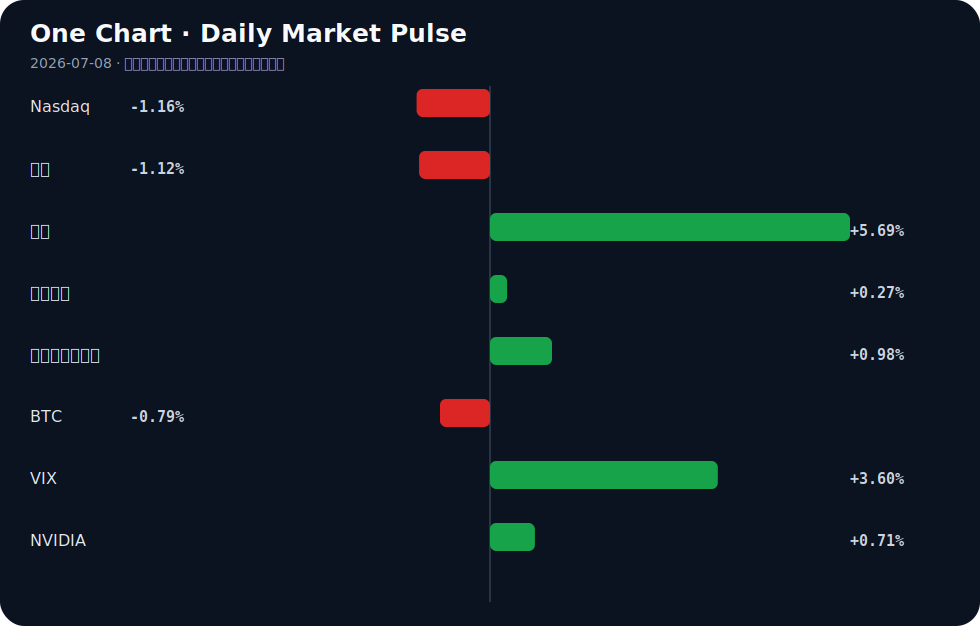

# Daily Intelligence
> 2026-07-08｜Wednesday

## Today’s Thesis｜今日一句话
AI 的扩张正从纯粹的算力争夺转向生态锁定与基础设施互操作性竞争；然而，这种扩张的物理约束（能源成本转移至传统制造业）正在引发反身性反弹，可能重塑 AI 增长的边界。

## ① Executive Summary｜30 秒
- **AI**：Agent 基础设施（身份、通信总线、执行环境）正在标准化，而中国 AI 模型凭借成本优势逆向渗透美国市场，并寻求底层硬件自主权 [A11][A12]。
- **商业**：大型科技的 AI 数据中心能源需求正直接推高美国铁锈地带制造商的电力成本，实体经济与数字经济的资源争夺战白热化 [A16][B6]。
- **宏观**：美联储鹰派信号与未决的地缘风险提振美元并压制黄金，而新兴市场（非洲/加纳）正借机吸纳寻求结构性溢出的全球资本 [B16][B24][B1]。

## ② AI Daily

### Agent 互操作性协议涌现
**What Happened**
开源社区集中发布 Agent 基础设施项目：Agent Name Service（通用身份系统）[A15]、Agent Bus（IRC 风格的 MCP 消息总线）[A18]，以及解决 Agent 执行断点的本地浏览器工具 Mkrrm [A17] 和任务上下文管理器 Backlog [A14]。

**Why It Matters**
AI 开发正从构建单体智能转向构建多智能体通信网络。缺乏统一的身份与消息协议是当前 Agent 碎片化的核心瓶颈，这些项目试图成为 Agent 时代的 DNS 和 TCP/IP。

**Second-order Effect**
协议标准化 → Agent 间通信摩擦力骤降 → 基于工作流编排的 SaaS 颠覆加速 → 现有 API 集成模式被淘汰。

### 中国 AI 的成本优势与硬件突围
**What Happened**
因成本激增，美国公司开始采用中国 AI 模型 [A11]；同时，路透社独家披露中国 DeepSeek 正在开发自研 AI 芯片 [A12]。

**Why It Matters**
这打破了“美国模型+美国硬件”的绝对双头垄断。模型层的成本优势正在重塑买方决策，而自研芯片是对算力禁运的底层反制，两者结合形成“廉价模型+自主硬件”的替代路径。

**Second-order Effect**
中国模型低价渗透 → 美有巨头定价权受损 → 巨头发放免费算力以抢占份额 [A5] → 云厂商亏损容忍度成核心竞争力。

### AI 扩张的物理负外部性
**What Happened**
美国制造商能源成本因 AI 数据中心需求飙升 [A16][B6]；同时，AI 编码时代代码可维护性暴跌 [A22]。

**Why It Matters**
AI 的扩张不再是零成本的虚拟游戏。数据中心对电网的挤占正在推高实体经济的运营成本，而 AI 生成的低质代码正在推高软件系统的维护成本。两者皆是熵增的体现。

**Second-order Effect**
数据中心能耗挤占 → 工业电价上升 → 制造业利润受压 → 政策反噬（限制数据中心用电审批）。

## ③ Business Daily

### 科技
AI 巨头正通过发放大量免费算力抢夺初创公司份额 [A5]，这本质上是云基础设施的倾销，旨在将初创公司锁死在其生态内。同时，高通收购 Nexa AI 并开源 Hexagon NPU 的 GenAI 运行时 [A1]，显示边缘侧 AI 部署正成为芯片巨头避开云端算力税的新战场。

### 制造
制造业面临双重挤压：一方面，数字产品护照技术正帮助制造商追踪高价值产品售后生命周期 [B2]；另一方面，AI 数据中心推高的电费正在侵蚀铁锈地带工厂的利润基线 [B6]。重卡电动化也被指出已无退路，真正考验即将到来 [B19]，制造业的能源转型与 AI 的能源吞噬形成直接冲突。

### 能源
为应对 AI 带来的巨大电力缺口，核能公司正在加速布局，The Nuclear Company 引入资深上市公司高管进入董事会 [B15]。然而，绿色能源发展与工业基础的存续之间尚未找到平衡点 [B8]，新能源的并网速度可能无法匹配数据中心的指数级功耗增长。

## ④ Macro Observation｜机制分析

**世界正在发生什么？**
数字经济的算力扩张正在物理层面挤压实体经济的生存空间。AI 数据中心对电力的无限需求推高了工业电价 [A16][B6]，同时美联储鹰派表态与地缘政治未决风险推高了美元与借贷成本 [B24][B3]。

**为什么发生？**
算力基础设施（数据中心）与传统工业共享同一电网，但前者的资本密度和支付意愿远超后者，导致电网资源被价高者得。宏观上，通胀压力（如原油上涨）限制了央行降息空间，资金持续流向无物理约束的资产或高息货币。

**资本如何流动？**
资本正沿三条路径流动：1) 向下寻找成本洼地，如采用中国 AI 模型 [A11] 或投资非洲等新兴市场 [B1][B20]；2) 向内寻找硬件替代，如 DeepSeek 自研芯片 [A12] 与边缘侧 NPU [A1]；3) 向前锁定能源解法，如核电 [B15]。

**接下来关注什么？**
关注制造业对电价上涨的政治反弹（事实：电价已上涨 [B6]；推断：工业游说团体将要求限制数据中心并网）。若制造业开始外迁或倒闭，将削弱 AI 的宏观税基支撑，形成反身性收缩。

## ⑤ Signal Dashboard
| 指标 | 最新值 | 今日 | 信号 |
|---|---:|:---:|---|
| [Nasdaq](https://finance.yahoo.com/quote/%5EIXIC) | 25,818.69 | ↓ -1.16% | 风险偏好降温 |
| [黄金](https://finance.yahoo.com/quote/GC%3DF) | 4,108.50 | ↓ -1.12% | 避险需求回落 |
| [原油](https://finance.yahoo.com/quote/CL%3DF) | 72.45 | ↑ +5.69% | 通胀压力上升 |
| [美元指数](https://finance.yahoo.com/quote/DX-Y.NYB) | 101.12 | ↑ +0.27% | 金融条件偏紧 |
| [十年美债收益率](https://finance.yahoo.com/quote/%5ETNX) | 4.53 | ↑ +0.98% | 成长估值承压 |
| [BTC](https://finance.yahoo.com/quote/BTC-USD) | 63,486.35 | ↓ -0.79% | 风险偏好降温 |
| [VIX](https://finance.yahoo.com/quote/%5EVIX) | 16.13 | ↑ +3.60% | 避险升温 |
| [NVIDIA](https://finance.yahoo.com/quote/NVDA) | 196.93 | ↑ +0.71% | 风险偏好改善 |

## ⑥ Deep Insight

### AI 扩张的物理约束与反身性反弹

AI 长期被视作一种脱离物理约束的纯数字现象，但当前信号揭示，AI 正在遭遇严苛的物理与熵增边界，并引发反身性反弹。美国铁锈地带工厂能源成本因大型科技数据中心需求而飙升 [A16][B6]，这不仅是定价问题，更是反身性反馈循环的起点。核心机制：AI 算力需求激增 → 数据中心抢夺电网容量 → 工业电价基准上升 → 制造业利润受挤压甚至外迁 → 实体经济税基受损 → 反噬 AI 赖以生存的宏观基本面。AI 正在无意中吞噬其宿主的基础设施。

与此同时，在软件层，AI 编码导致代码可维护性暴跌 [A22]，形成平行的内部熵增循环：AI 加速代码生成 → 技术债累积 → 系统脆弱性上升 → 需要更多算力修补 → 能源消耗再次攀升。这两个循环相互咬合，提出一个非共识视角：AI 当前最大的系统性风险并非超级智能，而是其物理与代码层面的负外部性正在侵蚀工业与工程基石。

面对此约束，资本与地缘政治开始寻找出路。美国 AI 巨头通过发放免费算力锁定初创公司 [A5]，试图在成本高企前完成生态垄断；而中国 AI 模型则凭借成本优势逆向渗透美国公司 [A11]，DeepSeek 甚至开始自研芯片 [A12]，试图从底层打破算力与能源的受制于人。这表明，算力成本的不可持续已不仅是商业问题，更是地缘战略问题。

反方观点认为，科技巨头将直接通过资本开支解决能源瓶颈，例如签订核能购电协议 [B15] 或加速绿能研究 [B4]，从而在不损害工业的前提下扩大电网总盘子。证伪条件是：未来 12 个月内，大型科技主导的新增核电/绿能项目成功并网，且区域工业电价未出现与数据中心扩张正相关的溢价上升。若此条件不成立，AI 的扩张边界将由电网物理极限和代码的熵增共同锁死，资本将被迫从追求模型规模转向追求能效比与系统精简。

## ⑦ Tomorrow Watch
1. 验证 EU AI Act 工程检查清单 [A2] 在 8 月 2 日生效前的开发者采用率与合规工具市场动态。
2. 追踪 DeepSeek 自研 AI 芯片 [A12] 的供应链流片进展及美国可能的出口管制升级反应。
3. 关注美国铁锈地带制造业工会或游说团体针对电价上涨 [B6] 提出的政策干预或税收抗议。
4. 监测中国低成本 AI 模型 [A11] 在北美企业 IT 采购中的渗透率，验证其是否引发现有巨头的价格战。
5. 观察 Agent Name Service [A15] 与 Agent Bus [A18] 等互操作性协议在主流云厂商或框架中的集成意向。

## ⑧ One Chart

图表显示了原油价格激增与十年期美债收益率上升的同步性，同时 Nasdaq 承压下行。这反映了典型的宏观约束：能源成本与无风险利率双升，正在挤压依赖远期折现的科技成长股估值，但二者存在相关性而非明确的因果关系。

## ⑨ Quote of the Day

> “The essence of strategy is choosing what not to do.”  
> — Michael Porter

**中文理解**：战略的本质不是做更多事，而是清楚地决定哪些事不做。

**Why it matters today**：这句话不是装饰，而是今天观察 AI、商业和宏观变化时的一个思考框架：先看机制，再看价格；先看约束，再看叙事。
## ⑩ Action Items｜今天值得思考什么
1. **追踪** AI 数据中心选址与当地工业电价基准的交叉数据，量化数字经济的物理负外部性。
2. **验证** 中国 AI 模型在海外落地的实际合规成本与数据隐私风险，评估其替代可持续性。
3. **比较** 边缘侧 NPU 运行时 [A1] 与云端免费算力倾销 [A5] 对初创公司的长期锁定效应差异。
4. **关注** Agent 互操作性协议（MCP、ANS）的收敛方向，判断是否会形成事实标准。
5. **思考** 在代码可维护性下降 [A22] 的趋势下，软件工程的 QA 与重构预算应如何重新分配。

## 信息边界
本报告事实来源限于提供的 Hacker News、Google News 等二手聚合渠道，重要判断需读者回到原文验证。市场数据反映最近交易日收盘或实时报价，存在时差。宏观与行业推断基于有限信号，未覆盖非英语/中文源及未公开政策博弈。

## Sources

### AI

- [A1：Qualcomm acquires Nexa AI, open-sources GenAI runtime for Hexagon NPUs](https://github.com/qualcomm/GenieX) — Hacker News · AI
- [A2：EU AI Act becomes applicable Aug 2: an engineering checklist](https://conformityengineering.com/playbook/) — Hacker News · AI
- [A5：AI Giants Are Handing Out Tons of Free Computing Power to Grab Startup Share](https://www.wsj.com/tech/ai/ai-giants-are-handing-out-tons-of-free-computing-power-to-grab-startup-share-c00a5c5c) — Hacker News · AI
- [A11：Chinese AI models are gaining ground with U.S. companies as costs surge](https://www.cnbc.com/2026/07/07/chinese-ai-models-costs-us-openai-anthropic.html) — Hacker News · AI
- [A12：EXCLUSIVE: China's DeepSeek developing its own AI chip, sources say - Reuters](https://news.google.com/rss/articles/CBMipAFBVV95cUxNSGRQQzRJX0VFTThJbC1JZnM2NUpNVHZQeEhxODdQejNBODNSLXpYMGdvSWxJMVhRSFBEOWplZy1NMU5qSnFxc3dpOEczN01EcVRQSk1mSXo3ejlMaUoxcks3LURaeGZ0Q3EyZ2dBQVN0QkRXNWg0YWpyOXJ2TjUtLVF4elZRU1VqdUVCdEhGNnFfYV9uYTdaT3V4MVFEZ2swRmlfRw?oc=5) — Google News · AI
- [A14：Show HN: Backlog – tasks and contexts manager for AI coding agents](https://github.com/mazen160/backlog) — Hacker News · AI
- [A15：Agent Name Service: The universal AI Agents identity system](https://opensourcewatch.beehiiv.com/p/agent-name-service-the-universal-ai-agents-identity-system) — Hacker News · AI
- [A16：US manufacturers' energy costs soar because of AI data center demand](https://arstechnica.com/tech-policy/2026/07/us-manufacturers-energy-costs-soar-because-of-ai-data-center-demand/) — Hacker News · AI
- [A17：Show HN: Mkrrm – a waitlist only AI can use](https://mkrrm.com/) — Hacker News · AI
- [A18：Show HN: Agent Bus – IRC-style message bus for AI agents (MCP)](https://github.com/roriau0422/AgentBus) — Hacker News · AI
- [A22：Code maintainability plummets in the AI coding era](https://leaddev.com/ai/code-maintainability-plummets-in-the-ai-coding-era) — Hacker News · AI

### Business & Macro

- [B1：Africa’s $70 Billion Investment Inflow Signals New Opportunities, but Gains Remain Uneven - slguardian.org](https://news.google.com/rss/articles/CBMirwFBVV95cUxNdmZtSTVNTE16d1kybmZlRHE0Wk9uMVlwWVk4cUFGMkZLQ3dFUE1ILWgwakZQdGdCZnVRLU9KRmp6bE5VelZweHhmT0U0NVlVRVRGc1RQYXJaUnlkUjBzcHVJMEFJUzBLbXY0cHkycVFvY1EyUmoxemRqUWpQNldfODIwd3o1VDhjaVBBVU9sdmZHR3BoUjlLc2xORXB5MUtRTTBzdmpqWjhCUzlOTVVV?oc=5) — Google News · Global Economy
- [B2：Q&A: How digital product passports help manufacturers track high-value products post-sale - Digital Journal](https://news.google.com/rss/articles/CBMixgFBVV95cUxNaEJuRlpLNEZnbllZcGdwZDk0eEc0UTByT25MbS1FNzVUU2kzY2preTRXZ2xLdXNkdko4S0l2aUpyUERRYkkwWFh0QUJKWUhHNDJQOGJXQ1VqbG00V0NIdnlkWFZMbEItQW9QS3llZElvZE0xdF9TLW44Wnp4RElwT1lNYmJfZU41Z3Y3aExPZ3JnU3l2aTM0OHlPT1NRMnBzTGU5VzN6WGJMdzR6Rjg2OUR0N2xnTEVoY1M5THc1czQ0UmZWUUE?oc=5) — Google News · Technology Business
- [B3：Geopolitical risk has not been resolved - The Globe and Mail](https://news.google.com/rss/articles/CBMiwwFBVV95cUxPTTdmdUNJQzQwLTlUYWZDdE9XLUxBRTVhVzZDb0p0bEt4c2hkeXhBbnNrVHdTa3YzU2RaRjE2d040WndRLTFRRWIteWR3ZWNzYzdWRDJ2MjllNms0TXVtRzhCdnY0SHFfWGpHUURESzJFZDNKZ0Z3RFpiNTdja2F4eW9ueDhPMGQ1dzJSUHR4cjlqOUp6dEI5ZG8yZE92Zk5NRUg1bEt4Q0k2ZVlGY0pHRmd6elo3V2l4QmpPc3JjRGd0dGc?oc=5) — Google News · Markets Policy
- [B4：Nelson Mandela Bay industrial hub earmarked for global study on green energy development - Daily Maverick](https://news.google.com/rss/articles/CBMi1wFBVV95cUxQOHQ5NGFJNUhES3pDZndJUDlGNEstSHktcU1DWUN2bi1KQ0VYZm8zOWxUUkJUbUxsRDdtQ1lNSXVybkR0WmpCT2N2aFYyN0dGYnQzUDlOaklka3pid21oRk4wRW1iSXl5Q3ZlQWsyQ2VHLVFCcTNfVmtLbURnWkVTVERLcGU1aFlOWU91djhicXZ3MlE4c3N1djU1RXc4S25yLWxGZHhyZzhwcWplMUt3dGlNa2ozRklEbDZobi14VGVhSU9vMml0T2VuQmxHdFUwbktROW0yVQ?oc=5) — Google News · Global Economy
- [B6：Big Tech data centers are driving up power bills at America's Rust Belt factories - Reuters](https://news.google.com/rss/articles/CBMiyAFBVV95cUxNSGJ2UXRHVGctUTJ6VTJfbGV6djVUaUZFZjVONlZPZ0EyY01XZFh6dFdRRGxDQnRzSnF6UG1mOXBNR2k5eTBXeEtyV1VIdzdlUjk4N1lrTFVqdFRFRjNBMHNsMmFRWmpxX2I5dzdQMlZnZmsteUU0bGZXMFNRM29Vb2JGeFRScWw5S3ZPZlV3ZTA0dkdxTTI4a05waTR1ZU9aZVVCcWV5bVVfOUFtMUxQRzJ4aVQyQWV5MEFaODlrUjFSWXpDVGE5dQ?oc=5) — Google News · Technology Business
- [B8：Opinion: We Can’t Sacrifice Industry for the Sake of the Climate - logos-pres.md](https://news.google.com/rss/articles/CBMimAFBVV95cUxPbEZ6OFMtbllZeTd1aXRUb3RkUmNLWDhQN1FSclNKeC0xV053ZmlYeW9jVF9hUjRWMmVXUjhsb0JzSllyRGV0YVNDMnRVV2hVMWZzTFhEaGNaVFk5QWwtMU5RQ21xSi1GaXljOVNkcC1TX3lHdlB6NlU3ZDQ2UDd3RzVqby0yYVZZWC0tT2c2cHh4V1JIMGNEeQ?oc=5) — Google News · Global Economy
- [B15：The Nuclear Company Adds Veteran Public Company Executive Brad Buss to Board - citybiz](https://news.google.com/rss/articles/CBMitgFBVV95cUxQeno4TXNCUzBrX0NBS0haUnhNT1pzbkE0NlFBVExMR0twbzlocFRUQmZWVk9Ia20xdlhGM1RJZFdZZjJyazg1UENtZEF4V08ycHZWUTdscVRMc1pobHgtS2FTLWVlbVlhQWhPbHhBOXIyOEp5Z3BuMmw0d0JNUV81ODlJUGJDQ0w4bFBTbndrRUNaYUNNNnhLNGYyWE1LYmNvcmRUcndTWnZNRWgyckhrdUVQRFc3QQ?oc=5) — Google News · Technology Business
- [B16：Gold Recovery Stalls as Fed Policy Uncertainty Keeps Buyers on the Sidelines - CryptoRank](https://news.google.com/rss/articles/CBMiiAFBVV95cUxOUndzX2kwV0pZeUJpVmVHS0dzUzk0YmlSQThaS1hySVJobEpCRkFBQWE1UzJMbDAybHgzaDJZcXVPZ1dWR1VCckJYd2hpRUJuTUp5MTlsZG5NOFY2dlhqbElZeUdtZ25YeV80SXBfU1JMTTBSc0hnWFBEQkgtMElOU0ZGYWV5M2Fy?oc=5) — Google News · Markets Policy
- [B19：重卡电动化已没有退路 真正的考验要来了 - 新浪网](https://news.google.com/rss/articles/CBMickFVX3lxTFBaTFVNVVYteWR1SVhjSnJZU19KT2UyR2xqNk5uV0RsRnlBeE5QcTdFZlRzNGVGWnRtNlJuYlQ5b1hITWFsQ2JNNmR3NV9mZWRjN205WmU4UHEyUHRtZ3VzZk9zdlJRT01mdXhJYlZ2LXk4UQ?oc=5) — Google News · 行业
- [B20：Global investors converge on Accra as Ghana pushes 24-hour economy agenda at Ghana Investment & Trade Week - MyJoyOnline](https://news.google.com/rss/articles/CBMizgFBVV95cUxNdDlUWlRpUGVzTXZVQTZDbjBFdzNOeHc5QjNGNVZqY2pBUk9wVjlxcXZTLVdnelAwdy1oVXVKVzN4WFhZekV6aEdVcFNpcnNOV01CMVhRbko3TGRmdFBTdjgyYi0tWUMxS1BMSC1maXg3YTNjNVJOYmlubUxZX2RKa0Fmd2tlQzJOb0ZOaTk3aHRhb2M4RDFLM25CY2R4dDdDNWYwUEE2VXl5Yjk4Z1NLdGl1cUFiaHU2YzJDWS1QRjNQbUM0cHdaVm5MdDhGUQ?oc=5) — Google News · Global Economy
- [B24：Dollar Firms on Stock Weakness and Hawkish Williams - TradingView](https://news.google.com/rss/articles/CBMirwFBVV95cUxOcnFvR1laNDMyZkwyZ0c4eTdSSU9pUVF4bkZNYkZpeXFacGRHQTRlRWdNSVZzWnlkd2Q0Tk1hUV9ERGtlZ2UyY3Q3U3FITWZIM0Y5T1hHWEFnZUR1a2c5bjktWU5PSXo2QU5tQWxNb0ZZSG9MNF9sNVZCWm5aTzlxRk1PUURlbGJEazhNYkNack4ybDdjTTA5UXRBTGlySHVMTGc4bURaNV8zYzdiSGhr?oc=5) — Google News · Markets Policy
