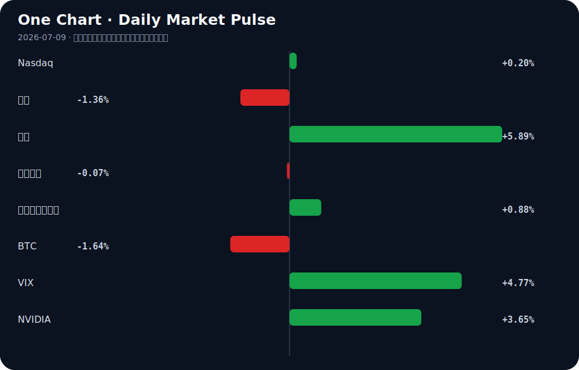

# Daily Intelligence
> 2026-07-09｜Thursday

## Today’s Thesis｜今日一句话
AI 正从纯粹的能力竞赛转向摩擦竞赛（定价失控、安全反噬、评估失效），而宏观资本将其视为对冲地缘政治冲击的硬基础设施，这构成了一种危险的反身性：越依赖 AI 缓冲宏观风险，AI 内部摩擦的系统性破坏力就越大。

## ① Executive Summary｜30 秒
- **AI**：基于用量的定价让企业 C-suite 预算失控 [A4]，而 AI 作弊使传统教育评估体系濒临失效 [A16]；AI 的商业化摩擦正在追赶上其技术能力。
- **商业**：智谱 AI 获 40 亿美元巨额融资 [A24]，Peak Energy 建造美国首家钠离子电网储能工厂 [B6]；资本正重仓押注 AI 基础设施与替代性能源供应链。
- **宏观**：IMF 指出 AI 投资缓冲了战争对经济的冲击 [B24]，中国央行在需求疲软下承诺维持宽松 [B23]；AI 已被正式提升为宏观经济稳定器。

## ② AI Daily

### AI 商业化遭遇定价与预算摩擦
**What Happened**：转向基于用量的定价后，AI 账单让 C-suite 感到困惑和难以预测 [A4]，同时华尔街 AI 顾问单日收费高达 2.5 万美元且预约排至两月后 [A17]。
**Why It Matters**：核心生产工具的边际成本不可预测，打破了企业传统的预算约束，导致 ROI 计算失灵，迫使企业依赖昂贵的外部顾问来填补认知鸿沟。
**Second-order Effect**：企业 AI 采用因财务不确定性而放缓或整合 → 定制化 AI 咨询需求激增 → AI 价值链发生金融化漂移。
Usage-based pricing → Unpredictable costs → C-suite budget paralysis → Demand for high-priced AI consultants

### 安全反噬：防御性 AI 成为攻击向量
**What Happened**：防御性网络 AI 智能体被劫持用于远程代码执行 [A10]，Claude 功能被用来诱骗开发者运行恶意软件 [A18]，联邦政府发布关于抑制 AI 系统准确性的政策声明 [A21]。
**Why It Matters**：AI 既是防御工具也是新的攻击面。当 AI 深入基础设施，其自身漏洞的破坏力呈指数级放大，监管的介入标志着信任赤字已引发公权力反应。
**Second-order Effect**：合规成本激增 → 开源 AI 部署受限 → 安全能力成为 AI 供应商的核心溢价而非附加功能。
AI capability expansion → Expanded attack surface → Regulatory push for accuracy → Compliance cost surge

### 教育评估体系面临信号污染
**What Happened**：因怀疑 AI 作弊，常春藤教授要求线下期末考，导致分数下降 50% [A16]；同时 Ghost AI 可在面试中实时告诉候选人该说什么 [A1]。
**Why It Matters**：人类能力的传统信号传递机制（学位、面试表现）正在被不可检测的 AI 污染，导致信号失灵，社会无法区分真实人力资本与 AI 伪装。
**Second-order Effect**：学历与远程面试信号贬值 → 强制回归高成本线下评估 → 人力资本筛选机制发生结构性重塑。
AI interview/cheating tools → Signal pollution of degrees → Forced return to in-person assessment → Structural re-evaluation of remote work/education

## ③ Business Daily

### 科技与制造
福建印发“人工智能+制造”行动计划 [A9]，韩国商业协会公布以 AI 和能源为中心的产业转型蓝图 [B1]。硬件端，努比亚推出全球首款 AI 智能体手机 [A2]，三星 CEO 撰文展望 AI 懂人愿景 [A14]。**机制**：AI 渗透正从软件层向硬软一体演进，缺乏 AI 原生硬件重构能力的传统制造者将面临淘汰；中国的高 AI 渗透率正重塑全球产业合作范式 [B16]。

### 能源
加拿大电池存储与太阳能产业进入增长新阶段 [B2, B3]，Peak Energy 选择萨克拉门托建造美国首家钠离子电网储能工厂 [B5, B6]，威斯康星公司利用聚变技术克服供应链瓶颈 [B13]。**机制**：地缘政治冲击促使资本押注非锂替代储能与下一代能源技术，以对冲关键矿物供应链的脆弱性。

### 金融
智谱 AI 在香港配股出售中筹集 40 亿美元 [A24]，印度央行支持加密禁令 [B8]，中国多地加大金融支持制造业提质升级力度 [B9]。**机制**：资金呈现极度分化——向头部 AI 基础设施集中，同时抽离不受监管的加密资产，政策驱动的定向信贷正取代市场化风投成为制造升级的主力资金源。

## ④ Macro Observation｜机制分析
**世界正在发生什么？** 传统需求疲软与外部冲击并存，亚洲和欧洲主要市场呈负面趋势 [B12]，中国央行承诺维持宽松政策 [B23]，智利面临通胀担忧 [B19]。但与此同时，IMF 指出 AI 投资正在缓冲战争对全球经济的冲击 [B24]。

**为什么发生？** 地缘政治冲击正在破坏传统供应链与需求结构，资本被迫寻找非地缘政治依赖的产能作为避风港。AI 和替代能源成为对冲宏观不确定性的两大抓手。

**资本如何流动？** 呈现“战略投资热潮” [B20]：巨量资金（如智谱 AI 40 亿美元 [A24]）涌入 AI 基础设施，同时流向钠离子等新型电网储能 [B6]，绕过传统加密资产 [B8]。

**接下来关注什么？** 需警惕“AI 宏观缓冲”叙事的反身性风险。[推断] 若 AI 自身因定价失控 [A4] 和安全反噬 [A10] 导致商业化停滞，被资本视为减震器的 AI 将瞬间转变为宏观波动的放大器，撤资潮将引发科技股与实体经济的双重踩踏。

## ⑤ Signal Dashboard
| 指标 | 最新值 | 今日 | 信号 |
|---|---:|:---:|---|
| [Nasdaq](https://finance.yahoo.com/quote/%5EIXIC) | 25,870.65 | ↑ +0.20% | 中性 |
| [黄金](https://finance.yahoo.com/quote/GC%3DF) | 4,081.80 | ↓ -1.53% | 避险需求回落 |
| [原油](https://finance.yahoo.com/quote/CL%3DF) | 74.26 | ↑ +5.42% | 通胀压力上升 |
| [美元指数](https://finance.yahoo.com/quote/DX-Y.NYB) | 101.00 | ↓ -0.05% | 中性 |
| [十年美债收益率](https://finance.yahoo.com/quote/%5ETNX) | 4.57 | ↑ +0.88% | 成长估值承压 |
| [BTC](https://finance.yahoo.com/quote/BTC-USD) | 62,091.97 | ↓ -1.90% | 风险偏好降温 |
| [VIX](https://finance.yahoo.com/quote/%5EVIX) | 16.90 | ↑ +4.77% | 避险升温 |
| [NVIDIA](https://finance.yahoo.com/quote/NVDA) | 204.12 | ↑ +3.65% | 风险偏好改善 |

## ⑥ Deep Insight
IMF 最新指出，AI 投资正在缓冲战争对全球经济的冲击 [B24]。这一判断将 AI 视作外生的“减震器”，但忽略了一个正在浮现的内生反身性：AI 本身正在成为宏观波动的放大器。当资本将 AI 作为对冲地缘政治风险的避风港时，大量资金涌入（如智谱 AI 40 亿美元融资 [A24]），迫使 AI 商业化加速，从而引爆了 AI 系统内部的摩擦力——即“定价失序”与“安全反噬”。

首先，定价机制正在失控。从基于席位到基于用量的定价转变，让 C-suite 对 AI 账单感到困惑 [A4]。当核心生产工具的边际成本不可预测时，企业无法进行长期资本开支规划。这种财务摩擦导致企业只能依赖昂贵的 AI 顾问（单日 2.5 万美元 [A17]）来填补认知鸿沟，进一步推高了 AI 的采用成本。

其次，安全与信任的反噬正在形成。防御性网络 AI 智能体被劫持以执行远程代码 [A10]，Claude 功能被用来诱骗开发者运行恶意软件 [A18]。AI 越是深入基础设施，其攻击面就越广。联邦政府已发布关于抑制 AI 系统准确性的政策声明 [A21]，这意味着监管摩擦即将到来。

最危险的反馈循环在于教育与人力的信号污染。常春藤盟校因 AI 作弊导致线下考试成绩暴跌 50% [A16]，Ghost AI 实时指导面试 [A1]。当社会无法区分人类与 AI 的产出时，人力资本的定价体系崩溃。这不再是简单的技术问题，而是社会契约的解体。

反方观点认为，这些摩擦只是“成长的阵痛”。随着模型推理成本沿缩放定律下降，用量账单将变得微不足道；开源安全工具的成熟将修补漏洞；新的评估体系将取代传统考试。如果这一观点成立，AI 将顺利过渡为稳定的生产力。

证伪条件：若未来两季度内，企业 AI 毛利率因用量成本不可控而显著下滑，或因 AI 智能体被劫持导致关键基础设施停机事件激增，则“阵痛论”失效，AI 作为宏观缓冲器的叙事将被彻底证伪，资本将被迫从 AI 基础设施中撤出。

## ⑦ Tomorrow Watch
1. 验证智谱 AI 40 亿美元香港配股的最终定价与收盘情况 [A24]。
2. 关注美国联邦关于抑制 AI 准确性的政策声明 [A21] 的后续官方解读或行业诉讼反应。
3. 追踪 Peak Energy 萨克拉门托钠离子工厂 [B6] 的初步地方环评或土地审批进展。
4. 观察布朗大学 [A16] 或其他常春藤联盟关于全面强制线下考核政策的正式跟进声明。
5. 关注中国央行在即将发布的二季度金融数据中，对“维持宽松政策” [B23] 承诺的实际流动性投放兑现。

## ⑧ One Chart

原油价格大涨与 VIX 上升同步出现，可能反映出地缘风险溢价对通胀预期与避险情绪的共同驱动，但这只是相关性，并非油价单方面导致了股市波动。十年期美债收益率上行则进一步压制了长久期资产估值。

## ⑨ Quote of the Day

> “Plans are worthless, but planning is everything.”  
> — Dwight D. Eisenhower

**中文理解**：计划本身常会失效，但规划过程能让你理解约束、选项和应对路径。

**Why it matters today**：这句话不是装饰，而是今天观察 AI、商业和宏观变化时的一个思考框架：先看机制，再看价格；先看约束，再看叙事。
## ⑩ Action Items｜今天值得思考什么
1. **验证** 贵组织的 AI 供应商计费模式是否正从固定席位转向基于用量，并评估预算不可测风险 [A4]。
2. **比较** 传统网络安全协议与防御性 AI 智能体被劫持的新攻击面 [A10] 之间的防御空白。
3. **追踪** 智谱 AI 等 40 亿美元级大额融资对国内大模型赛道估值锚及并购预期的传导效应 [A24]。
4. **关注** 钠离子电池等非锂储能路线 [B6] 对现有新能源供应链依赖与地缘脆弱性的替代进度。
5. **思考** 当 AI 工具使传统学历与面试信号失效时 [A16]，企业招聘应如何重构人力资本的真实能力评估基准。

## 信息边界
本报告事实部分严格限定于用户提供的 2026 年 7 月 8 日至 9 日的聚合新闻源。宏观与市场数据反映的是最近交易日的静态切片，部分新闻来源为二手聚合，重要判断请回溯原文验证。推断与信号已作标注，不代表确定性未来。

## Sources

### AI

- [A1：Ghost – real-time AI that tells you what to say during job interviews](https://ghostinterview.dev) — Hacker News · AI
- [A2：努比亚推出全球首款AI智能体手机，量产旗舰登陆2026世界人工智能大会 - 搜狐网](https://news.google.com/rss/articles/CBMijAFBVV95cUxQcktJeG4wSHEyR214S0NQYzAwV2xRU21udzdlUEVxajROM2ZwcEVjSFJfRXVUS192VUVjbE1qSFNNWlNwUTE1TjA4eFpvVlN5blZrMWNzazBVNGJzOG1saVRiTW5JTXB4THZNeFpZS0NoYzhCVjFnazl1YmM4RXVXSlNVOE5kTnpuZTI0RQ?oc=5) — Google News · AI 中文
- [A4：AI bills are baffling the C-suite after shift to usage-based pricing](https://www.theregister.com/ai-and-ml/2026/07/03/ai-bills-are-baffling-the-c-suite-after-shift-to-usage-based-pricing/5266383) — Hacker News · AI
- [A9：【行业聚焦】福建印发“人工智能+制造”行动计划 - 新浪网](https://news.google.com/rss/articles/CBMif0FVX3lxTE9xYjE5U19jaF8wMTNnRkFYQ1E1R2J5V05WTW5vZUV4M3hxNmFVa2xTWDlIbmRqUDU2SFFJWVVxbDVhbGl5TjdrUnFZRERlQmh0bEpldkRVcE9yM2FMWnJtbkRSQ1lEM1B2MGtJa3F2ZmpVTFhrU0RaWmZ1Z0MyQ28?oc=5) — Google News · AI 中文
- [A10：Hijacking Defensive Cyber AI Agents for Remote Code Execution](https://ainowinstitute.org/publications/friendly-fire-exploit-brief) — Hacker News · AI
- [A14：三星CEO撰文展望AI未来：当人工智能真正“懂你” - cnBeta.COM](https://news.google.com/rss/articles/CBMiYEFVX3lxTE5HUXpxVFNaVXBsWm9FdndFbVBZa0xveDMyclAzLV9iUkR4SlRUTGoxTkNuZXRNWWtSaUZWMFRFVE5RTXN2ejU4SXpFQ3dxbXhiVUlXdG9aODE4TEdsNHBNYg?oc=5) — Google News · AI 中文
- [A16：Suspecting AI cheating, Ivy League prof ordered in-person final; scores fell 50%](https://arstechnica.com/ai/2026/07/we-cannot-choose-to-become-idiots-the-ai-cheating-scandal-roiling-brown-university/) — Hacker News · AI
- [A17：AI顾问成华尔街新顶流：单日收费2.5万美元 预约排到两个月后 - 财联社](https://news.google.com/rss/articles/CBMiSEFVX3lxTE1UOTBGNG5KTEEyV09IVXB4MXRaX0JmYTZKZlBiRnhyandBclJReTk1WnI3eDJTcHg4eklMZGV3cHF5dnZLYTkzdA?oc=5) — Google News · AI 中文
- [A18：Artificial Intelligence - Claude feature used to trick AI developers into running malware - teiss](https://news.google.com/rss/articles/CBMisAFBVV95cUxNVnUySE1VNG01aXlWb19CWVhWMlZ6Mno4SkNqd244cnppd3UxTlR0ZC04RlhJREhjS04zdE14YmJjUFZ4cUlNRVFZY0NEd3NCbjE5SzZuVkZsOE83TFNvODY1Y3Z1YW94RGRrQTgyZXd0b3p2RWdMeHhGdVUxMDhVVXRLb0lGall5YmdLcWkwYUk1RDhaS0VDSThhbkFWMXdLZ3pvSFRNZEcxVTBuVkkzYQ?oc=5) — Google News · AI
- [A20：Another Day, Another AI Hallucination Case - The National Law Review](https://news.google.com/rss/articles/CBMihAFBVV95cUxOTXlhQzhvMy1pU180Zm5fdW4zT1dkYVBNcUctM3VRQkRRbUVMU2dIV0pkTUNna0lRcjY0c3JoWW5DTzEwUjZUQW9FaUhPSmdVdG9NZkRrVm1Qam5OV0I4S1prbnkyNGNnX0V4c3A4ODdrMnVRckRYdFlxZUhnQjNYUFRTYTfSAYQBQVVfeXFMTk15YUM4bzMtaVNfNGZuX3VuM09XZGFQTXFHLTN1UUJEUW1FTFNnSFdKZE1DZ2tJUXI2NHNyaFluQ08xMFI2VEFvRWlIT0pnVXRvTWZEa1ZtUGpuTldCOEtaa255MjRjZ19FeHNwODg3azJ1UXJEWHRZcWVIZ0IzWFBUU2E3?oc=5) — Google News · AI
- [A21：Policy Statement Concerning the Suppression of Accuracy in AI Systems](https://www.federalregister.gov/documents/2026/07/07/2026-13628/policy-statement-concerning-the-suppression-of-accuracy-in-artificial-intelligence-systems) — Hacker News · AI
- [A24：China's Zhipu AI raises $4 billion in Hong Kong share sale, source says - Reuters](https://news.google.com/rss/articles/CBMizAFBVV95cUxOaG15R1d0NTBacG00WVFSMk9keXNFNVJ6cUhLcm5tbVJ1X2c3OWFaeHo2ZVM3b2pUZjhwTWRHS290eEwxQkZIUWlCTlBaWlhNOGotUHBxZEx5M2xoMGxsSXpxR05NYV9EUDZJN0xUQk00eC04MGpHeUZod1ZVa1dPMWh6elN3QURQUjlzbFIyYV81WUV0V29hdFU3QnY0RzZQRFpaRUxYX0JaaGt3bE00TEVLbXhqZEpySUtUcEp6SGRabFdVTGJrbDZIaFU?oc=5) — Google News · AI

### Business & Macro

- [B1：Federation of Korean Business Associations Unveils Blueprint for Major Industrial Transformation Centered on AI, Energy, and Services - 아시아경제](https://news.google.com/rss/articles/CBMiaEFVX3lxTE5TLVBOZlBRZU0wTnF1ZmF0Y3JRODhVSUdCX2YxSUVVa1RBb3czWml2MmVfaDRraWYzanQ3amd3Z01WTW9RWjFocWEwMDBnNUM1OHZuMjk4eTJ3WGdrdVpFWlR6VXNsckFn?oc=5) — Google News · Global Economy
- [B2：Canada’s battery storage revolution: The science and innovation powering the clean-energy future - Digital Journal](https://news.google.com/rss/articles/CBMizwFBVV95cUxQZzFrWDVtZEx1MU5lMlUyZXpmeWw0aVBQclJKMUNsUGQ3OE0tdlRseUVvUWNmUGFwcjM3Sl8zRnZtc3Z1OS1XQW5oQUM1ZjVtYjU1VkllS2djY0YtSnlDMm85RHpyWEtURjhqZHFWR3hkaUFoWUNocWQwd0ducmpXV0VMeHkwdXZydUJCTXJmWHNERkFQNXBYR1lEODZqX1htV003R3ZVbFpSaGw1RUV1eGNEN2JEQlBSb0d5V25HNGk3SjEyWUI3U0xkTW1Nb28?oc=5) — Google News · Technology Business
- [B3：Canada’s solar industry enters a new phase of growth - Digital Journal](https://news.google.com/rss/articles/CBMilgFBVV95cUxNR1lfVXN6MHFWLTVZRFBrelJ6VTdrelFkWVgxREY3eGlwVHNOVjBRS1psbjZ5LU52cERSUTJqb3dTb0FyeVdWV29uVkxfZFZVY2oyczg4bFRrWk9HN1ZSSGxsZ1EySi1qR2pEUUlXUERwNWp4QWxtc3ZiczNZaHNYclhvU21fdnhJWVNDYmd3c3FTOXNWNXc?oc=5) — Google News · Technology Business
- [B5：California Chosen for Peak Energy’s Sodium-Ion Battery Plant - Bloomberg Law News](https://news.google.com/rss/articles/CBMiswFBVV95cUxONDJVMVVZRlZ0VGl6VXVSZi12TmtQSGJVUDhZbmdNVUVlSDdzOVlkaTQ3QWFQa3BlQ0hQelpGUmJjRnEzTmtCcWpMWXdkOVhmOE95S2dqMFFKNUoxZHMtNGEzT3plUlVCUF8tNUQxNEg4STJzZVpXU0QxcjdNUU4ySXJwTGZfTS05RnBjODAxTTNHbjlfR21PQWlrS1ctQVNEYXhRLWQxT3A3ZkxzUnI5NjZ1SQ?oc=5) — Google News · Technology Business
- [B6：Peak Energy Selects Sacramento to Build America's First Sodium-Ion Grid Storage Factory - PR Newswire](https://news.google.com/rss/articles/CBMi2gFBVV95cUxPMUxvam5xTGd2cEM4eHBDdUNNTHNYU2tIRzNZY2sxZlBvazB1UDdRSm1hSEJQNlFZNFZkT1NoWmxGZUFtcXBLSVpLcmxQZUhmcHVoVUlMTmJ4YzQwSHhxeURRTUpfelN3MnBIMHFNc2FDZll5ZE02Y2pSU09oTzUtNWxJbFd6dU5JNlp0VTFDdUpYbkFrN2hhTld1THFGakdGcGlpSDhFbllhb3NVc1lRWUtPUG1FY3A3eFhURThuUW4xbzhiSWR1MG9NTDdqRXpIYVB4TlFWUTJidw?oc=5) — Google News · Technology Business
- [B8：India Central Bank Backs Crypto Ban as Tax Department Flags Risks - Coinpaper](https://news.google.com/rss/articles/CBMimAFBVV95cUxNQmN4cEgtSkVwVUxuZHYtT3Brak1Ra3AtQUJFWnlNT05XS05jOG55RVRNZEktbENYbHE2Ym84ZnZ4ODVLWWtxTEVTM0F4WnFQaWwxWlRISW1FY1RrUkZvQTd3Z3FNY2Z0cHpBTUJENlpUWlZGZzJObDZQSjFvZjBtQ3RnZlUtalFnU2FwbWI5RXFFRWxManNaTQ?oc=5) — Google News · Markets Policy
- [B9：多地加大金融支持制造业提质升级力度 - 新浪财经](https://news.google.com/rss/articles/CBMimAFBVV95cUxQYl9qeVVNY19hMHhteHpmdWJDUnk5WmxjVkF2ZWhJM191M0FHcGFuSUp3TzR2YjFCaFJ2SXEybU1PVlUyc0U5blpEdFkwYnk3YVFhcERPNzB3Z080NXJ2cU9mSHpmTGVOUGt4eXR3akJPM3FtVWVNSnVqcndLc0ZrUF9DZVBhWHU2VlZRNGxsakJrTG1XVnlwZA?oc=5) — Google News · 行业
- [B12：Major Asian & European markets display negative trend - News On AIR](https://news.google.com/rss/articles/CBMigwFBVV95cUxNRTdGbkhlZmxlbGY3cWNvLTJNNXAzQ1dVcTZvREVoNEZRYzJ5a29LWVJzaV9aLUlxNmFTczAyLVRMcGhNeFA0NDdRQVhqVUNxZEdaQkZLYWtpcWkydTVOemFpRDJ0ejctaGctb0IxRlZranp3X0dSUDhhaGNkaXpKU0xBSQ?oc=5) — Google News · Markets Policy
- [B13：A Wisconsin company is using fusion technology to beat supply chain bottlenecks - WPR](https://news.google.com/rss/articles/CBMirAFBVV95cUxNVUJsb3lhRWt2NDZhSmV4eGZEWjR3UE8weEZxZUtjYmY5eXhaZEJUeGVZQ0kzTEVRcnlDeVFRWmNnREJRRExVS3JUT2U3Q3RnT1pDNVV5WmpwZ3JxMlNRRUtzaW5aaGRvemF0czFxRWFGUHlBVzBtT0VQc1h0VjJtMWlTeVI4aVFGQXVBMGE1NUFHTnR1RWlEVU9zSkFyZ2NzdEl3bFVxNndGelBH?oc=5) — Google News · Technology Business
- [B16：China’s high AI penetration offers a new perspective on global industrial cooperation - Global Times](https://news.google.com/rss/articles/CBMiYkFVX3lxTE90QWFiMXZHQTA5OGhuQktvajJMTjdWdTJoWjd5aV9UNUZ1X21KZE00UDNOelFtRlZMc00tTi16cGVsZ2ZzdmE3QnlDWWFaelU2TG14bDB1d3psX1l3dGRrcEx3?oc=5) — Google News · Global Economy
- [B19：Chilean Economy Faces Inflation Concerns Amidst Global Uncertainty - Devdiscourse](https://news.google.com/rss/articles/CBMiwgFBVV95cUxORGx2NUJJa3hUTklmMzJmdktNU3NCbkllQzVJVklNMmYwRnoxc0laQWMzdXljRzFkU3AzZ1FvLUJ3bXhRWE9nd0ZPcVZHcklTV2V2SjNTdU52cDFWcnJsY3pGaHI5c3k5UklYMWVETURPTU9ydkdLdEs4aGd5cXhEV3BfVnlWbGJOQUR4U1ViVDI5ZjI4WGdpcEJrb0dScmFwcExYRV9XaHRJeGQ4NnFOSzNBSkJDdWt5RUZLS3I0Z2ZJZ9IBwgFBVV95cUxORGx2NUJJa3hUTklmMzJmdktNU3NCbkllQzVJVklNMmYwRnoxc0laQWMzdXljRzFkU3AzZ1FvLUJ3bXhRWE9nd0ZPcVZHcklTV2V2SjNTdU52cDFWcnJsY3pGaHI5c3k5UklYMWVETURPTU9ydkdLdEs4aGd5cXhEV3BfVnlWbGJOQUR4U1ViVDI5ZjI4WGdpcEJrb0dScmFwcExYRV9XaHRJeGQ4NnFOSzNBSkJDdWt5RUZLS3I0Z2ZJZw?oc=5) — Google News · Global Economy
- [B20：‘Strategic investment boom is reshaping global growth, especially for deloping countries’ - Channel Africa](https://news.google.com/rss/articles/CBMi1AFBVV95cUxNT3RjSUJEMjZKQlppaWZtRGliRVRQc2xscGhOU1Y2eUpaajZxRlplUFY1ZGMxMjN0bTZqd1ktTVdKTk9mZFYwVWtfSGdpSUhMSnltdUozWl9wTmYxd2RRRC1VZER4RUg3Y2I4djVUWTJ3cEFaOHhmSDBOcDBsUUJFVXpKRmFxdy1rNFJxWnVlRExJVzBOM3lvOEdsa3paMkM1SnJ6ZlF4SWlIODdJeFZFSUtHNGktLUE3RkFtc3BqV3ViOFBiV2JsbDE3R09tVFkyaWZ6dA?oc=5) — Google News · Global Economy
- [B23：China's central bank pledges to maintain accommodative policy amid weak demand, external shocks - The Business Times](https://news.google.com/rss/articles/CBMi7gFBVV95cUxOVW93THhESDVoSXZJMm5Ta1pzbExLUXNfeXE2VkNBcUp2ZG56a0hvLUw2Y2dPcnlHdlJpQUh3cndBNWc5TEdxMGJPUi1LVUxveHVmeGY1MmJ6R1JiSTFUWkxiaDNnN2wzdXZTSmdkbm5IVHozaDBPZGRsNE9mWUNNTVJNRldMTkVKdEZhWHJWdzNsd0FzT2RYM1RVN3lCaS16TndmZ0F5X3ZBajhta01vMmQyaExjeG9OOHhvdjFRelE5cWhNWGVYVC1fcFRheW5ZM3dyd0RwaWhQcENfdHZEenZ2T3RncDBPbldCY0pR?oc=5) — Google News · Markets Policy
- [B24：AI investment cushions global economy against war shocks, says IMF - MSN](https://news.google.com/rss/articles/CBMivAFBVV95cUxPbzBBV25RVW5rcHV4ZUhkVGlFZjh5ckFjM2YzcXlyX1VodlI1OFlSQ2M4ZV84aTFTRW5VQjczWjZmQlFBN0NSWUthQjZOLVVNVVo5d0NYNjQwbmpOeWd1SzRsSnVJaldlN0o2T01qYlczVnkyN1VnUU9qamc1OXJ1NWplTEpLcERWRVozSHBnWU93T1JrVHZDZy1zVTFlYnRVQ016SEZRam44UU1ReWNaZmgwWjBZRGtFNFZ6LQ?oc=5) — Google News · Global Economy
