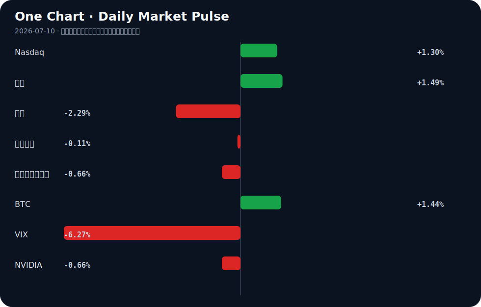

# Daily Intelligence
> 2026-07-10｜Friday

## Today’s Thesis｜今日一句话
AI 产业正通过技术栈跃迁逃离模型同质化陷阱，但这加剧了算力与数据墙的硬约束；同时，宏观不确定性正将资本驱离通用软件叙事，转向支撑 AI 运行的物理基础设施（能源与储能）。

## ① Executive Summary｜30 秒
- **AI**：竞争焦点从底层模型向应用栈与端侧转移，端侧模型压缩[A17]与企业工作流整合[A15]加速，但数据墙与算力成本正在重塑行业结构[A7]。
- **商业**：硬件与能源成为新锚点，西门子重金投入 AI 数据中心与能源转型[B15]，钠离子电池产能落地[B11]标志着储能对算力瓶颈的物理响应。
- **宏观**：全球经济增长预期放缓至 3%[B19]，不确定性抑制欧洲复苏[B17]，而亚洲（印度汽车[B3]、中国物价中枢[B5]）出现结构性偏移，资本在避险与风险中重新平衡。

## ② AI Daily

### AI 逃离大宗商品陷阱与锁定风险
**What Happened**：AI 行业正试图逃离基础模型的大宗商品化陷阱，通过向上跃迁技术栈来建立护城河，但这引发了企业级供应商锁定风险[A2]。
**Why It Matters**：当基础模型能力趋同，价值将向编排层与工作流层转移。然而，深度整合意味着企业客户将失去议价能力与迁移灵活性。
**Second-order Effect**：为对抗锁定，开源模型与开放架构的需求激增，推动 AI 产业重构[A7]。
因果链：基础模型同质化 → 价值向应用栈转移 → 企业面临供应商锁定风险

### 数据墙显现与版权反击
**What Happened**：Patreon 与 Cloudflare 合作，屏蔽 AI 爬虫窃取创作者作品用于训练[A10]。
**Why It Matters**：高质量人类数据不再是免费的公地，版权保护正在成为实质性的数据墙，阻断传统 Scaling Law 路径。
**Second-order Effect**：AI 公司必须为数据付费或转向合成数据，推高了顶级模型的训练成本，使拥有专有数据资产的企业 AI 应用[A15]获得结构性优势。
因果链：高质量数据枯竭 → 平台封锁爬虫 → 训练成本上升与专有数据壁垒形成

### 端侧突围与消费级硬件重估
**What Happened**：初创公司 PrismML 成功将大型 AI 模型压缩至苹果 iPhone 上使用[A17]；两个 AI 模型在单张消费级 GPU 上通过原始激活值完成思想交换[A24]。
**Why It Matters**：云端推理成本高昂且存在延迟，端侧计算与异构通信是绕过云端垄断的关键路径。
**Second-order Effect**：消费级硬件算力被重新评估，但消费级 AI 应用仍受制于用户对免费应用的预期与 LLM 推理成本之间的矛盾[A13]。
因果链：云端推理成本高企 → 端侧模型压缩与异构通信 → 消费级硬件重估但受制于付费意愿

## ③ Business Daily

### 科技与能源：算力的物理回声
AI 的扩张正在召唤庞大的物理基础设施。西门子宣布投资 3 亿欧元用于 AI 数据中心与能源转型[B15]，这表明工业巨头已将 AI 视为与能源转型并列的顶级资本开支方向。同时，Peak Energy 选择北加州建设钠离子电池工厂[B11]，钠离子电池在储能市场的份额正由数据中心的备用电源与电网平衡需求驱动[B12]。算力狂飙的背面是电力饥渴，资本正在从纯软件流向支撑软件运行的铜与铁。

### 制造与汽车：亚洲的结构性崛起
在宏观不确定性中，亚洲制造展现出韧性。印度汽车产业正式跃居世界第三[B3]，这不仅是产能转移，更是全球供应链重构的缩影。在成熟市场，日本大成建设与发那科合作开发 AI 仓库，使空间效率翻倍[A18]；在中国，中兴通讯选择押注字节跳动的豆包大模型以寻求设备端 AI 突围[A8]。AI 与制造的融合正在亚洲走通从实验室到流水线的商业化闭环。

## ④ Macro Observation｜机制分析

**世界正在发生什么？**
IMF 预计今年世界经济增长仅为 sluggish 3%[B19]，全球不确定性正在直接损害德国等传统引擎的经济复苏[B17]。与此同时，中国物价中枢稳步抬升，经济循环出现结构性改善[B5]，印度 GCC 产业在全球波动中被视为“双赢”避风港[B23]。

**为什么发生？**
旧全球化体系断裂导致要素流动受阻。地缘政治与政策驱动型资金流（如新台币对美元的韧性[B9]）正在取代纯市场逻辑。原油价格波动使美联储降息前景蒙尘[B13]，抑制了全球同步宽松的预期。

**资本如何流动？**
推断：资本正呈现“脱虚向实”的避险偏好。一方面流入黄金与久期资产对冲通胀与不确定性，另一方面流入能源转型、储能及先进工业区[B8]等有形资产。加密资产与边缘市场（如俄罗斯最大私有银行测试比特币交易[B24]）则作为制裁或传统金融不畅的替代系统吸收溢出资本。

**接下来关注什么？**
关注 ECB 重新定价与收益率对欧元的支撑机制[B7]，以及美联储 Logan 提出的中央清算对公开市场操作的影响[B2]。核心反馈循环：宏观不确定性 → 资本寻求有形资产与替代系统避险 → 传统金融流动性重构 → 资产定价逻辑重估。

## ⑤ Signal Dashboard

| 指标 | 最新值 | 今日 | 信号 |
|---|---:|:---:|---|
| [Nasdaq](https://finance.yahoo.com/quote/%5EIXIC) | 26,206.89 | ↑ +1.30% | 风险偏好改善 |
| [黄金](https://finance.yahoo.com/quote/GC%3DF) | 4,131.50 | ↑ +1.49% | 避险/通胀对冲增强 |
| [原油](https://finance.yahoo.com/quote/CL%3DF) | 71.84 | ↓ -2.29% | 通胀压力缓解 |
| [美元指数](https://finance.yahoo.com/quote/DX-Y.NYB) | 100.94 | ↓ -0.11% | 中性 |
| [十年美债收益率](https://finance.yahoo.com/quote/%5ETNX) | 4.54 | ↓ -0.66% | 利好久期资产 |
| [BTC](https://finance.yahoo.com/quote/BTC-USD) | 63,151.31 | ↑ +1.44% | 风险偏好改善 |
| [VIX](https://finance.yahoo.com/quote/%5EVIX) | 15.84 | ↓ -6.27% | 风险偏好改善 |
| [NVIDIA](https://finance.yahoo.com/quote/NVDA) | 202.78 | ↓ -0.66% | 风险偏好降温 |

## ⑥ Deep Insight

### AI 的物理约束：软件吞噬世界的尽头是能源与材料的反噬

当前市场对 AI 的叙事高度集中在算法智能的涌现，却系统性地忽略了支撑这种涌现的物理约束。AI 并非纯粹的无重量比特流，它是一种极高熵的过程——每一次推理都在消耗真实的电力、占用物理空间并产生废热。西门子宣布投资 3 亿欧元用于 AI 数据中心与能源转型[B15]，Peak Energy 落地钠离子电池工厂[B11]，这并非巧合，而是对 AI 算力饥渴的物理响应。算力需求激增 → 电力与土地需求激增 → 电网瓶颈与储能需求爆发 → 资本被迫流向能源与材料基础设施，这一因果链正在形成闭环。

同时，内存稀缺[A7]与数据墙[A10]构成了 AI 扩展的双重硬约束。Patreon 封锁爬虫[A10]标志着高质量人类数据不再是免费的公地，版权壁垒将训练数据的获取成本推向实体经济的博弈层面。当软件试图吞噬世界时，它首先必须吞噬海量的能源与材料。如果算力基础设施的建设速度（受制于电网扩容、变压器交货周期等物理定律）慢于模型算力需求的增长，AI 的 Scaling Law 将在物理层面而非算法层面率先撞墙。这种反身性体现在：AI 越强大，其对能源的消耗越大，导致基础设施瓶颈越严重，进而反过来限制 AI 的进一步扩展。

**反方观点**：算法效率的指数级提升将打破物理约束。支持者认为，模型压缩技术（如 PrismML 为 iPhone 缩减大模型[A17]）和异构计算通信（如单卡消费级 GPU 完成双模型思想交换[A24]）将大幅降低单 token 推理的能耗与算力需求，使算力增长脱钩于能源增长，端侧 AI 的普及将绕过集中式数据中心的电力瓶颈。

**证伪条件**：如果未来 12 个月内，全球 AI 数据中心的绝对电力消耗增速出现停滞或下降，且端侧 AI 推理占比超过 80% 导致云端训练需求萎缩，则物理约束论点被证伪；若电力与土地资本支出继续占 AI 行业总资本支出的主导比例且持续上升，则算法效率论点被证伪。

## ⑦ Tomorrow Watch
1. 验证 PrismML 端侧模型在 iOS 上的实际推理延迟与功耗表现[A17]。
2. 追踪 Patreon 与 Cloudflare 反爬虫机制对后续 AI 训练数据集更新的实际影响[A10]。
3. 关注美联储官员对原油价格波动与通胀前景的进一步表态[B13]。
4. 验证西门子 3 亿欧元投资在 AI 数据中心电力基础设施领域的具体落地项目[B15]。
5. 比较印度汽车产业第三大地位的实际销量数据与产能利用率[B3]。

## ⑧ One Chart

图表显示风险资产（纳斯达克、BTC）与避险资产（黄金）同步上涨，而债券收益率和 VIX 下降。这表明市场正在对通胀压力缓解（原油下跌）进行定价，但也存在潜在的增长担忧，导致资本同时流向久期资产和硬资产，风险偏好与避险逻辑在当前宏观不确定下并存，而非单纯的线性因果关系。

## ⑨ Quote of the Day

> “Prediction is very difficult, especially if it’s about the future.”  
> — Attributed to Niels Bohr

**中文理解**：预测未来很难，所以更重要的是识别关键变量和更新机制。

**Why it matters today**：这句话不是装饰，而是今天观察 AI、商业和宏观变化时的一个思考框架：先看机制，再看价格；先看约束，再看叙事。
## ⑩ Action Items｜今天值得思考什么
1. 追踪 AI 应用栈跃迁中具备专有数据护城河的企业，评估其规避同质化与锁定风险的能力[A2]。
2. 验证端侧模型压缩技术在消费级硬件上的商业化转化率，特别是用户付费意愿对冲推理成本的能力[A13][A17]。
3. 比较钠离子电池与锂电在 AI 数据中心储能备用电源中的成本与寿命曲线[B11][B12]。
4. 关注 IMF 下调全球增长预期后，新兴市场（如印度 GCC 产业、中国结构性改善）对冲下行风险的实际数据[B19][B23]。
5. 思考数据墙（版权封锁）与算力墙（内存稀缺）双重约束下，开源模型重构 AI 产业格局的路径与时间表[A7][A10]。

## 信息边界
本报告事实部分严格限于用户提供的 2026 年 7 月 9 日晚间至 7 月 10 日的新闻聚合源。宏观与市场数据以最近交易日收盘为准。部分新闻来源为二手聚合（如 Google News、Hacker News），重要判断需读者回到原文验证。推断部分已明确标注，不构成投资建议。

## Sources

### AI

- [A2：Up the Stack: How AI's Escape from the Commodity Trap Risks Enterprise Lock-In](https://www.normaltech.ai/p/up-the-stack-how-ais-escape-from) — Hacker News · AI
- [A7：Memory Scarcity, Open Models, and the Restructuring of the AI Industry](https://arxiv.org/abs/2607.07207) — Hacker News · AI
- [A8：中兴把未来押给豆包？ - 新浪财经](https://news.google.com/rss/articles/CBMisgFBVV95cUxPOWtfUUFlRk1RbUR0RExVOEtoZDRSWFhmOWpOTzg0WElxOVB5aW9HZ1NhQjhTU0Z2eFBKaUVVSTBSOGZickhZX2FRNmFwNWFsRXV1bzRCdWNveWotVVM5a0JqTzNMZFJ6ZFhNcEthNlpCYXgySnFtUVRWdnBIYlpLNG9qZ3B6ZGFjRjU2SUZ5bnNMd2JWTWEzbFR0VUJJV2tVYVlSS055a1ptc25lUU55ZEtB?oc=5) — Google News · AI 中文
- [A10：Patreon Blocks Crawlers from Stealing Creators' Work for AI Training](https://www.404media.co/patreon-cloudflare-partnership-ai-crawlers/) — Hacker News · AI
- [A13：Ask HN: Why so few consumer AI companies?](https://news.ycombinator.com/item?id=48853063) — Hacker News · AI
- [A15：AI models that learn your codebase and org workflows](https://sigilix.ai/news/company-announcements) — Hacker News · AI
- [A17：Startup PrismML shrinks a large AI model for use in Apple's iPhone: report](https://seekingalpha.com/news/4612644-startup-prismml-shrinks-a-large-ai-model-for-use-in-apples-iphone) — Hacker News · AI
- [A18：Japan's Taisei, Fanuc develop AI warehouse that doubles space efficiency - Nikkei Asia](https://news.google.com/rss/articles/CBMi1gFBVV95cUxQQzVDYXhXV3QteFU3YWkxa0dxRzc1V0JCTnU0WC1EeU45SmlGa0VnVGJOXzVHdHlHaVdqQi1xZkYtX3I1d3NsMm9SSW1EUGlVOG1lcGp3M2pvaExKODktMHJmdWdGbU9xUjBHUF9SUE1ZM09INDFjSTVLNFJFOE43c0owUGhpNFpNT29MdTByVl9IZVNEdWdYd3pKQXhLWmpRT1Z5UjlFeUJpdmhBcDVqQ0NqeHZzYVJjTTd0ZEt3cFhMbElETmU5LVcyRmhXUDI3NzIxZEJB?oc=5) — Google News · AI
- [A24：Two AI models exchanged a thought through raw activations on one consumer GPU](https://github.com/VitaAI-SCG/one-gpu-lab) — Hacker News · AI

### Business & Macro

- [B2：Fed's Logan says Fed open market operations would benefit from voluntary central clearing - Reuters](https://news.google.com/rss/articles/CBMixgFBVV95cUxPd0ozdjFDRDVxUkxTZDRHUTRxdHJkMFhOVndRM002Z2ZpSDAzTW5yLWNCUXFiaHBfNTA3bmR4dWRPT0JfUFZIcE4yb3VfZUxxNlVjMUIzR3lnaGFub0hmZWUwcUlzVHhUMV9DUnRBZVVCVHdjQWNnd1pQWHM0cEdYWjBWRXZuU2FtbzA0WWJ0NFNWNzVtd2Y1djJWUWpOcXBRTVNSTkZhek9FTjBHcFRheUFQTm9WWmF0c1JBcTlvTmN4UDN6OFE?oc=5) — Google News · Markets Policy
- [B3：India's automobile industry rises to world's third largest, says Nitin Gadkari - thehawk.in](https://news.google.com/rss/articles/CBMiwgFBVV95cUxQU3hCczRxVW1kcUhnRXhQUEpWV1hBNHN0NnlWbTg2NHhjbVdrLVRKanh3UkVYMXFhZDhOY0wzbHVNNWJDXzJfTUVqdGFJQUhtNU9vN0JnN2hRVU54QnV1QVZDWTBsUDExSmFSNmVSZGZZSVgyS1lvM0RZS2JncGRmR0d0RVh2dGt1aW9faXM1OFZBMHRUNWVlZXpyd3p5d0EydFd2XzcxejZfUWtqOUFtdVZlckdZdEF4dFZFTFVmUFhWUQ?oc=5) — Google News · Global Economy
- [B5：物价中枢稳步抬升 经济循环现结构性改善 - 新浪财经](https://news.google.com/rss/articles/CBMirwFBVV95cUxQTm1EamsySXV6RThSUkZkd0hURVFSZ3VkRW51amI5TVZRMU1DREt6N1J0ODdfX3hvczZQc2g2RG9Ub1A0RjZnZFhjM0FNMU5nMzc0MUROV01EUy1nM0hQd0xxLU1VNGNpQVJYZ2VWV19MZ3JQNGZWSFFZZWMwSWhpeTVhLVhSZnBxa1R3Nl9ad0hSanpUWDVjdHljZS1rdmdYZ1QxN1FtVjFESkRTdDdF?oc=5) — Google News · 行业
- [B7：Euro: Support from ECB repricing and yields – Scotiabank - TMGM](https://news.google.com/rss/articles/CBMiuwFBVV95cUxON2NpSjN3Z1dDaWthLW1ScWd3NElPSE5jODFYcE8wRDl3MTVHblA1UHJQcFBiVkM5YnFacl9TR3l5ZnZFMUdDeHZLNmhEQjlSeDlWbG1TdDA1MDJteEMtUjhjT29TMFppaTVKdnM1OGVxLWVBV3RhaEVUelV5aWgzRWFwRVNLVW5aZnUzMWpUeEdUNHBTNU1qSDFrT0c4Vm5zZDFIbV9sbVRmNEZ2V1VkZngwMExHbDNuTHhz?oc=5) — Google News · Markets Policy
- [B8：How Advanced Industrial Zones can help states thrive in the electro-industrial economy - Brookings](https://news.google.com/rss/articles/CBMikgFBVV95cUxPV3lCby1jdHNTYTgzSHpoa1pJdzUxZUVqYWdhcVdlUjVvd3JNS1lxdnItTTExdzRQUW1aRGc3bGFJb21UUnAyWFI3WEEzU2l3TVEwX3J3LUlNWFpNWkgzQmYtaEJBWFU5U2FhSWZsakFPUW9KYU50ZVJDazd0cUJrSHdlUDhlcTVOQ2lXaGxJUmh2Zw?oc=5) — Google News · Global Economy
- [B9：Taiwan Dollar: Policy-Driven Flows Temper Losses Against US Dollar, OCBC Says - Bitcoin World](https://news.google.com/rss/articles/CBMinwFBVV95cUxPV2VsQVU0bWtPS1RZREdCUXJIWWVuTTF6aG94QTlRaENFcWd1aU14bGUwRzBMaHdINHhublBCT3dKS1JvaFhvbV9rcXJVTkt0OF9wMElSVG4ydG9kZm9ocjRRZHZWbnFaTDJkR3VaeHJ5LVBOM2xIWnQxMkFLMU0yYjFlMlZOQ3VYX1lEQjJBZDdKN1dUT1FmUEExcjNwS2c?oc=5) — Google News · Markets Policy
- [B11：Northern California chosen for Peak Energy’s sodium-ion battery plant - The Mercury News](https://news.google.com/rss/articles/CBMipgFBVV95cUxQdWpPdDU2djI0V3hNMGRwZjJMMXo1Y0JMU3JhQUVXNVY0U1ZOUjNNVnpqcTNKSHlEU3JjeXBrVjNzQ2ZseFBHenVfYktVMkN4R0tGOGlMXzBsSE1Kd0VrOHVQTnZ4ZHdwalFUMWhKUndlOVRrdHpCZEV0ZzBFSzhaMnNSbjVia2I1ZUZNRnUwOVlTbDU3TkZpZXhJMWJCWDFGWDFIZEZB0gGmAUFVX3lxTFB1ak90NTZ2MjRXeE0wZHBmMkwxejVjQkxTcmFBRVc1VjRTVk5SM01WempxM0pIeURTcmN5cGtWM3NDZmx4UEd6dV9iS1UyQ3hHS0Y4aUxfMGxITUp3RWs4dVBOdnhkd3BqUVQxaEpSd2U5VGt0ekJkRXRnMEVLOFoyc1JuNWJrYjVlRk1GdTA5WVNsNTdORmlleEkxYkJYMUZYMUhkRkE?oc=5) — Google News · Technology Business
- [B12：Sodium-ion Battery Market Share Driven by Energy Storage - openPR.com](https://news.google.com/rss/articles/CBMilwFBVV95cUxQaDltekdpRTRhYWM3UDRDMVRpb0dXUjA0czUtVjZvbEZTZC1NcUZvU29NamxKcHZYN1R0V08xMGNtbUdNUFJRenlhQWJyWkR3WHJSWEIweXNHak9FcHVhcHc1emp1cndKTlJVZ0RQZGE0N2NTb1VyMDBMTjNLbTJxRkVCbHpuRnhuaDhsVjJCakFDOXY0Y1FJ?oc=5) — Google News · Technology Business
- [B13：GBP/USD forecast: Dollar regains the upper hand as oil surge clouds the Fed outlook - FOREX.com](https://news.google.com/rss/articles/CBMi1AFBVV95cUxQWXhLekVSWUxGb0Z3NHpBdTNHcDE1UTFYbmZXT1lOVk13aEpfS1ppb1kzandqc3BRZ2MxN1c4b1VrSU1HZkpUeGVMcDY4M29lRGtFMzVrXzBEWjQzUVhscUZGbXpLZXVaeko1RE5wQkozVGF4NjBIakFEYkpSSEp0MVdPLWZoREZ1WkFETzdwcUh6YXZIVnNSZ1A0WFplTEpnelRvU05aWGZ1LWlPSExpNGJoQlFLWjdTdzZ2aUhyZnlKYkZhQzFYRUxqZlY4TnF6cW1yX9IB1AFBVV95cUxQWXhLekVSWUxGb0Z3NHpBdTNHcDE1UTFYbmZXT1lOVk13aEpfS1ppb1kzandqc3BRZ2MxN1c4b1VrSU1HZkpUeGVMcDY4M29lRGtFMzVrXzBEWjQzUVhscUZGbXpLZXVaeko1RE5wQkozVGF4NjBIakFEYkpSSEp0MVdPLWZoREZ1WkFETzdwcUh6YXZIVnNSZ1A0WFplTEpnelRvU05aWGZ1LWlPSExpNGJoQlFLWjdTdzZ2aUhyZnlKYkZhQzFYRUxqZlY4TnF6cW1yXw?oc=5) — Google News · Markets Policy
- [B15：Siemens: €300 Million for AI Data Centers, Energy Transition - Mexico Business News](https://news.google.com/rss/articles/CBMimwFBVV95cUxQa3I5MjBERUJfUENKYldieEVBSUV4aFdYbFdiV3g3MmhKVm1pamRZSXNxZERjSkZUZWJtcVBrMGhWd253V2ZvcHFZRFZjMktUTlF3c1FhdER5YXZxa3R4QkFNMmhfMGxVN2tRdFEzWnZkYW9DSmg0UTNXQzlzUWllWEtwcXcwcXdnMS1qbmszNXdXRGV0RzAtOFI2UQ?oc=5) — Google News · Technology Business
- [B17：IMF Warns Global Uncertainty Is Hurting Germany’s Economic Recovery - Tekedia](https://news.google.com/rss/articles/CBMilgFBVV95cUxOQk1oLWc1Q2wyaXJFVEkwS3ZHMVlDYzlRR19fT0JvNzdrUm9hYnBPSVowQ1VQZ2paSXFhVGhXM0VMMWJVZDBOaHQ2US01MVdFNi1ZR3Zhb0ZYeXZpRkhDNGszNjJfSnhfT05KTE13UXhWWDZ1LTJtQW1iby1GQi1aZXI0SnUwZWtSZ3I0RUFpQzdDUHBiN3c?oc=5) — Google News · Global Economy
- [B19：IMF Expects World Economy to Grow a Sluggish 3% This Year - Industrial Distribution](https://news.google.com/rss/articles/CBMipAFBVV95cUxNLXdta1hXWUkxdVRYaDlwbFhJTUxOVjhUUWQxcVJKelJVMmZoRlhtd2VDR1VXQ25YZkV0ZHYxMWs0eVdTYUNybWY3UF9YMFkyOGVON3g1WWIwZnBtU1htX2p2WGdydU9raUtyMVg2bmdZZXJCVmFDWTZxVDBPLVhOWUloNTBUMjAwUVdjYmkzdTVRd21FVV81cG93N3NIWTZieEkyMg?oc=5) — Google News · Global Economy
- [B23：India's GCC industry a 'win-win' amid global volatility: Expert - Asianet Newsable](https://news.google.com/rss/articles/CBMiwgFBVV95cUxPVllGcmpSenRBOGFTM3hYUC1BX0dDdHZiVUd6c0ZCYzJFX2lyY0hWNHp4Q3VvcVIwYlhEQ0NjR3BMa0VHMW9OcnozRTNyYmZlcHc5Z01adzIzRTM0UkZJc1VoMkJpNlA2d0d2THg3QVg4QkNBYzlmMXR0QklKVTdBVVFwdm5nNDZXekpvYUNVNl9NM0JPaHhNU1FyOWhFWkJMYWVKT1ZLUUkzTWhBZTBjaXZRNnZTbmZNM05rY0RwdG1zQdIBwgFBVV95cUxPVllGcmpSenRBOGFTM3hYUC1BX0dDdHZiVUd6c0ZCYzJFX2lyY0hWNHp4Q3VvcVIwYlhEQ0NjR3BMa0VHMW9OcnozRTNyYmZlcHc5Z01adzIzRTM0UkZJc1VoMkJpNlA2d0d2THg3QVg4QkNBYzlmMXR0QklKVTdBVVFwdm5nNDZXekpvYUNVNl9NM0JPaHhNU1FyOWhFWkJMYWVKT1ZLUUkzTWhBZTBjaXZRNnZTbmZNM05rY0RwdG1zQQ?oc=5) — Google News · Global Economy
- [B24：Russia’s Largest Private Bank Alfa-Bank To Test Bitcoin and Crypto Trading - CryptoRank](https://news.google.com/rss/articles/CBMiggFBVV95cUxQbER4WElUcGJ4bWsySGFZY01jVGhPSE9pMFg3QVFzNHVKZjlsbW95amJvaFRfU2lmOXc4aXJuRzJsNGRCSzJ3YUtORjhzVlVBZW5HT2NvNjFHeVg5VHBHRk1QeURzTzJ0cUhrOFhkaG50ZWxIN0UtR3pMbjIxSk5FMG1n?oc=5) — Google News · Markets Policy
