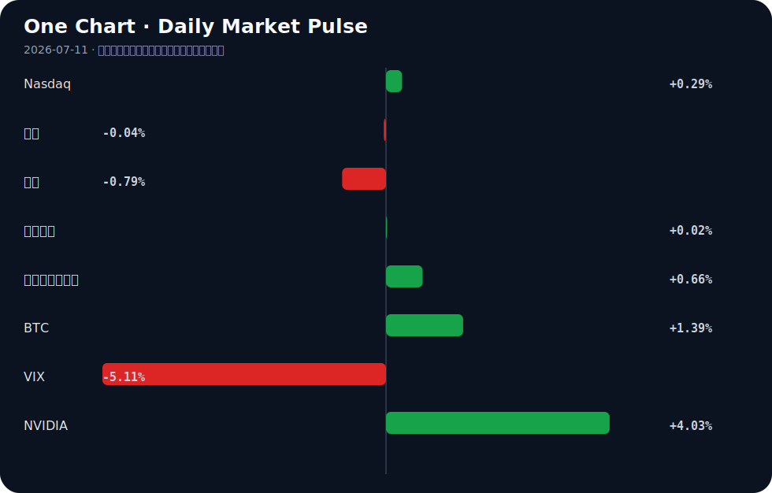

# Daily Intelligence
> 2026-07-11｜Saturday

## Today’s Thesis｜今日一句话
AI 正从部署狂热步入治理与成本摩擦期，而宏观受制于关税驱动的粘性通胀，两者的交汇将重塑资本的风险偏好边界。

## ① Executive Summary｜30 秒
- **AI**：采用疲劳显现，超 40% 用户限制使用 [A13]；AI 运营成本甚至超过被替代人工 [A11]，智能体从概念走向保险等传统行业基础设施 [A9]。
- **商业**：Apple 起诉 OpenAI 窃取商业机密 [A3]，科技巨头从竞合走向法律战；音乐与社交平台加速推进 AI 内容标签与合规边界 [A19][A22]。
- **宏观**：美联储报告指出关税是顽固高通胀的关键驱动 [B10]，9 月加息预期升温压制黄金 [B17]，美元可能继续走强 [B5]。

## ② AI Daily

### 1. 巨头反目：Apple 起诉 OpenAI 窃取商业机密
**What Happened**：Apple 指控 OpenAI 使用被盗商业机密创建其 AI 设备 [A3][A15]。
**Why It Matters**：这标志着顶级 AI 模型开发商与硬件/平台巨头之间的蜜月期结束。当模型能力趋同，数据与专有系统整合的护城河成为核心，知识产权诉讼是保护护城河的最后手段。
**Second-order Effect**：诉讼将拖慢 AI 在 iOS 生态的原生整合 → 促使开发者转向中立或开源模型（如中国开源模型推进软实力 [A12]）→ 硬件端 AI 竞争重回自研赛道。

### 2. 采用疲劳与成本反转
**What Happened**：超 40% 的人正在限制 AI 使用 [A13]；同时研究指出 AI 变得比它所替代的工人更昂贵 [A11]。
**Why It Matters**：颠覆性技术的普及不仅受限于能力上限，更受限于 ROI 下限。当推理成本居高不下且幻觉风险未消除（AI 虚构内容易被检测因其“愚蠢且糟糕” [A23]），企业级采用将面临财务审计的严酷拷问。
**Second-order Effect**：企业 AI 支出从“探索性预算”转向“运营成本预算” → 算力需求增速放缓 → 逼迫模型端降价或裁减算力冗余。

### 3. 智能体渗透长尾传统行业
**What Happened**：OpenAI 发布 GPT-5.6 聚焦智能体 [A20]；传统保险行业出现基于 MCP 服务器的 AI 智能体报价基础设施 [A9]。
**Why It Matters**：AI 的价值捕获正在从前端的聊天界面，转移至后端的 API 调用与业务流接管。非科技背景的中小企业主通过 Vibe-coding 也能部署智能体 [A9]，降低了软件架构的准入门槛。
**Second-order Effect**：智能体能力提升 (GPT-5.6) → 触碰数据与商业机密边界 → 诉讼与治理摩擦爆发 (如 Apple 诉 OpenAI)。

## ③ Business Daily

### 科技
知识产权与数据合规成为主战场。Apple 对 OpenAI 的诉讼 [A3] 与 Meta 因使用用户照片生成 AI 图像引发的抗议 [A19] 本质相同：都在界定 AI 训练与推理的数据权属。同时，音乐行业推出 AI 生成内容标签 [A22]，表明内容平台正在建立 AI 排毒机制。开发者则在德国大量收购旧书以填补数据空缺 [A24]，合规高质量数据成为硬通货。

### 金融
监管框架与货币政策进入重构期。SEC 可能在参议院投票前提前制定加密规则 [B23]，显示行政机构对新兴资产定价权的争夺。加拿大因就业数据强劲且失业率下降，央行选择按兵不动 [B19][B24]，而美国因关税驱动通胀，9 月加息预期重燃 [B17]。全球利率路径分化，套利资本流向更明确。

### 能源
AI 正在从数字域向物理域渗透。AWS 联合 Galeo Tech 推进工业物理 AI [B2]，北卡罗来纳州使用机器狗评估植物健康 [A6]。这要求能源基础设施的同步升级，西门子呼吁重构电网 [B16]，油气行业也寄望于技术提升本地产能 [B6]。算力尽头是电力，电网承载力成为 AI 扩张的物理瓶颈。

## ④ Macro Observation｜机制分析

**世界正在发生什么？** 
通胀表现出异常的粘性，美联储报告明确将此归咎于关税 [B10]（事实）。市场对 9 月加息的定价正在上升，压制了黄金表现 [B17]（推断）。同时，中国一线城市房价出现结构性回暖 [B15]，而部分新兴市场（如孟加拉国）旅游业遭遇大幅下滑 [B4]。

**为什么发生？** 
全球化正从效率优先转向安全优先。关税是政策人为制造的摩擦成本，这种成本直接传导至消费者价格指数，打破了“科技带来通缩”的传统抵消机制。AI 本应带来生产力通缩，但由于算力与能源的巨量消耗，其短期内反而构成了资本支出通胀压力。

**资本如何流动？** 
资本正在向确定性高地回流。美元因高息预期走强 [B5]，吸引全球套利资本；夏洛特等具备产业落地能力的地区获得实体投资 [B7]；加密资产在 SEC 监管明朗化前夕蓄势 [B23]；而风险偏好改善（VIX 下降，BTC 上升）与成长估值承压（十年期美债收益率上升）并存，资本在“短期避险”与“长期成长”间撕裂。

**接下来关注什么？** 
关注关税政策与通胀数据的反馈循环。若关税进一步升级，将迫使非美经济体采取贬值或资本管制应对，可能触发局部新兴市场的债务危机。

## ⑤ Signal Dashboard
| 指标 | 最新值 | 今日 | 信号 |
|---|---:|:---:|---|
| [Nasdaq](https://finance.yahoo.com/quote/%5EIXIC) | 26,281.61 | ↑ +0.29% | 中性 |
| [黄金](https://finance.yahoo.com/quote/GC%3DF) | 4,128.90 | → -0.04% | 中性 |
| [原油](https://finance.yahoo.com/quote/CL%3DF) | 71.51 | ↓ -0.79% | 通胀压力缓解 |
| [美元指数](https://finance.yahoo.com/quote/DX-Y.NYB) | 100.97 | → +0.02% | 中性 |
| [十年美债收益率](https://finance.yahoo.com/quote/%5ETNX) | 4.57 | ↑ +0.66% | 成长估值承压 |
| [BTC](https://finance.yahoo.com/quote/BTC-USD) | 64,073.79 | ↑ +1.39% | 风险偏好改善 |
| [VIX](https://finance.yahoo.com/quote/%5EVIX) | 15.03 | ↓ -5.11% | 风险偏好改善 |
| [NVIDIA](https://finance.yahoo.com/quote/NVDA) | 210.96 | ↑ +4.03% | 风险偏好改善 |

## ⑥ Deep Insight

### AI 的“成本反转”与采用疲劳：生产力悖论的回归

当我们审视当下的 AI 变革时，默认的叙事是 AI 将作为一股强大的通缩力量，以近乎零的边际成本替代昂贵的人力。然而，今天的信号群揭示了一个容易被忽略的非共识机制：AI 在短期内不仅不是通缩剂，反而是一种通胀力量，且正遭遇严重的生产力悖论。

首先，事实表明“AI 比它所替代的工人更昂贵”[A11]。与传统软件在开发完成后边际复制成本趋近于零不同，大模型的推理成本极其高昂。每一次智能体调用，都在消耗真实的算力与电力。当 AI 从聊天机器人走向执行复杂任务的智能体（如 GPT-5.6 [A20] 或保险报价 MCP 服务器 [A9]）时，计算消耗呈指数级增长。即便有 AI 智能体运营的公司跑出了 8.5M 美元的 ARR [A2]，其背后的 GPU 折旧与能源账单依然是悬而未决的硬约束。

其次，制度与治理摩擦正在推高 AI 的隐性成本。芝加哥大学禁止法学生使用 AI [A1]，Meta 因滥用用户肖像生成 AI 图像引发抗议 [A19]，Apple 起诉 OpenAI 窃取商业机密 [A3]。这些事实指向一个推断：数据获取与合规的成本正在飙升。为了在诉讼与隐私红线内构建“本地优先智能体治理”[A16] 需要昂贵的工程开销。超过 40% 的人正在限制 AI 使用 [A13] 进一步印证了采用疲劳，这意味着企业必须花费更多成本去教育或强迫市场使用，从而破坏了单位经济效益。

第三，AI 与物理世界的交汇是资本密集型的。工业物理 AI [B2] 与电网重构 [B16] 需要数年时间及巨额资本支出。在宏观利率因关税通胀 [B10] 而居高不下的环境中，这类长周期基础设施投资的资本成本是令人望而却步的。AI 算力的尽头是电力，电力基础设施的滞后构成了 AI 扩张的物理天花板。

**反方观点**：算法效率的快速提升（如 GPT-5.6 的架构优化 [A18]）将大幅降低推理成本，使得 AI 智能体的 ROI 最终转正，且 AI 原生收入将轻松覆盖算力支出。

**证伪条件**：如果未来两个季度内，主流大模型的 API 调用价格下降速度持续快于算力成本上升速度，且 AI 原生企业的毛利率出现显著扩张而非收缩，则上述“AI 通胀论”被证伪。

## ⑦ Tomorrow Watch
1. 美国 CPI 数据发布，验证关税传导至核心通胀的幅度 [B9]。
2. Warsh 在国会山的首次亮相，观察其货币政策立场表态 [B9]。
3. 参议院对 CLARITY 加密法案的投票进展及 SEC 提前制定规则的动作 [B23]。
4. Apple 诉 OpenAI 商业机密案的初步法庭文件披露与双方回应 [A3]。
5. GPT-5.6 在生产环境中的智能体迁移稳定性与成本报告 [A18]。

## ⑧ One Chart

十年期美债收益率上行而 VIX 指数下行，呈现出罕见的背离。这种相关性暗示市场对系统性风险的担忧极低，但同时承认无风险利率将长期高位运行；这并非因果推演，而是宏观环境“软着陆预期与高息持久战”并存的价格投影。

## ⑨ Quote of the Day

> “The greatest danger in times of turbulence is not the turbulence; it is to act with yesterday’s logic.”  
> — Peter Drucker

**中文理解**：动荡时期最大的危险不是动荡本身，而是继续用昨天的逻辑行动。

**Why it matters today**：这句话不是装饰，而是今天观察 AI、商业和宏观变化时的一个思考框架：先看机制，再看价格；先看约束，再看叙事。
## ⑩ Action Items｜今天值得思考什么
1. **验证** AI 在你所在行业的实际推理成本是否已低于人工边际成本 [A11]。
2. **追踪** Apple 与 OpenAI 诉讼案中关于“模型训练数据来源”的法律界定 [A3]。
3. **关注** 关税政策对供应链重组及终端物价的传导时滞 [B10]。
4. **比较** 限制 AI 使用的消费者比例 [A13] 与部署 AI 智能体的企业增速 [A9] 之间的错位。
5. **思考** 若 AI 算力需求成为基础设施级刚需，电网承载力与能源通胀将如何反噬科技估值 [B16]。

## 信息边界
本报告信息来源为 Google News 与 Hacker News 的 RSS 聚合，时效截至 2026 年 7 月 10 日晚间。市场数据反映最近交易日收盘或实时报价。新闻源多为二手聚合，重要事实判断（如诉讼指控、通胀归因）需提醒读者回到原文验证。宏观推断基于既有事实的机制推演，非确定性预测。

## Sources

### AI

- [A1：University of Chicago cutting use of AI by banning technology in classrooms for first-year law students - CBS News](https://news.google.com/rss/articles/CBMiaEFVX3lxTE5IeFh0cjhSM2NST0YzUjBLSHhfOXlPZkNpZTUzTXlOTDdMVXBoc2dlYnZHY01IbEl3ZzRtR2pwQk43VkNoVlJVc01jUFFrT3Y3dHFhSjZ3OVVYWVhGUnRiLVlqWTFwWHFi?oc=5) — Google News · AI
- [A2：Show HN: I scrape an $8.5M-ARR company run by AI agents and chart it live](https://maertspolsia.mzpx.ai) — Hacker News · AI
- [A3：Apple sues OpenAI, alleging artificial intelligence company stole trade secrets - The Guardian](https://news.google.com/rss/articles/CBMiigFBVV95cUxPeWtGRVlvQTA3OXBzNEI1YUZSN3duYzN1OXZQNGNDUmg1T1Z6eGNwbXNhQl81a3liMjAxQlB0QzlGZlBnZ3FWZ19waDZDZm9lczl4THlPTzAzdF9ja2haZkdGS1NKbmxrQ3FLZmlWdTRJVEVxczJKVnFEeG9OaUk5ekFGNEEwUjlwN0E?oc=5) — Google News · AI
- [A6：North Carolina A&T researchers use robot dog to assess plant health - wfmynews2.com](https://news.google.com/rss/articles/CBMixgJBVV95cUxNVW52UEJCUGw5SXZUdTF4Z2RTTkRmUEhyRFBLZEp5MGRWel9PUVh5X3dIUC1iV0hYdDZmVkVaSXZOUDdLQUFacUFKNjU5Y05jZ3hNOTIwUER4Y2x3UEVMYlFNcHJoMmk5SVdEUGI2S1AzMU0zT2RyV1piZlVCbVpkWEppWFMzVlFiTEZZb3dlazN4NXVQV0J4cWMwQl9tTkRCSW43X05EX3hGcURSRjB3S3RJN0luQ21kenVyd1gyNlNXcG5lZ1J4NFNGQnh6ZEdoTUNLajZFd2NJTkNCX3IxUEo2VUZPa2tPUFVCdjlNcWMwV3ZZbmJEaTloTGIxb1E4UjJQZFN2SDZwYmlhb1RYOEZPOG5hSHdKbVZPZElCQmRsY2RncG11Vm5EbzVUcno3eHktOEdtZ3lCaEdERTN6UVRaY01rQQ?oc=5) — Google News · AI
- [A9：Show HN: An MCP server that lets AI agents request disability insurance quotes](https://github.com/seaworthy-io/seaworthy-mcp) — Hacker News · AI
- [A11：How AI Became More Expensive Than the Workers It Replaced [video]](https://www.youtube.com/watch?v=cfaZZPjA3g0) — Hacker News · AI
- [A12：China's Open AI Models Are Advancing Its Global Soft Power](https://www.noemamag.com/chinas-open-ai-models-are-advancing-its-global-soft-power/) — Hacker News · AI
- [A13：Over 40% Of People Are Limiting AI Use, As Popularity Starts To Wane - Eurasia Review](https://news.google.com/rss/articles/CBMiqgFBVV95cUxOUFhmQzg5Qzlqd19uVXlEVlNpQ1JTcVJRRzI3akdMR2x3R1pOSlZmczVHM2d0QS1xTy1QOU9YbEtrX0FxcXQ4NHVKSXFuZHRsejlRR1lPb0lOLXlaU25BRnQxMG92NVhWLVJKWWFPUmxYNGg3cHBEM18xNzRRZ2dyZmhRck5RVnVOX1J0djl2YW44RmVGdFpETHpQcmxQdFRvd2tQY2prV25zUQ?oc=5) — Google News · AI
- [A15：Apple accuses OpenAI of using stolen trade secrets to create its AI gadgets](https://www.cnn.com/2026/07/10/tech/apple-openai-devices-lawsuit) — Hacker News · AI
- [A16：Local-first agent governance: keeping an AI agent contained](https://vektorgeist.com/blog/local-first-agent-governance) — Hacker News · AI
- [A18：Migrating a production AI agent to GPT 5.6](https://ploy.ai/blog/migrating-a-production-ai-agent-to-gpt-5-6) — Hacker News · AI
- [A19：Outcry as Meta lets users make AI images from public Instagram profile pics](https://www.bbc.com/news/articles/cp9lee19y1yo) — Hacker News · AI
- [A20：OpenAI Launches GPT-5.6 as Agentic AI Shifts ETF Outlook - ETF Database](https://news.google.com/rss/articles/CBMirAFBVV95cUxNZmRGMTJ2N1gxOWN2WDkwOURKUGNUUF93ZEVPelZSdUNQNzk4UER4VHBwcUNGZWxLS3FPUExpZUcxN054ZGxBRXdSQmtmYTZwdUVFZG1qYzk1eEN5ci1ob1FTcHhVdWZKWVdPTFJXRkstZjRCWlV3aGZtX3d3UFB2ak4wMkZTVW1YWThPNWtJbWE4SVVoRUkwQjFISGdkd1piZW1taUwzT0d1Q0Rn?oc=5) — Google News · AI
- [A22：Music industry launches AI-generated content labels - France 24](https://news.google.com/rss/articles/CBMinwFBVV95cUxPVkRTV1M2VWRJSVFMZFNCNUlKbDVTbXA2Yk1TWTk3d1ZPWl8zMVlyeUE3ZTZJN3owLVF0c2s5YTB0RVVJcVkwS1ktbnJRZUQtYjJOMlBaNndYNUZ4RUQwNWNqOXdLcGUtSUlIdmFNX0pHcDQxM2U4WEVCUmpvUHlOTWJmdE1PbEo2WlQzZDRyeFh4S0s2dHVVNXQ0eG9fSmc?oc=5) — Google News · AI
- [A23：AI Fiction Is Easy to Detect Because It's Stupid and Bad, Research Finds](https://www.404media.co/ai-fiction-is-easy-to-detect-because-its-stupid-and-bad-research-finds/) — Hacker News · AI
- [A24：AI developers are buying up old books in Germany in large numbers](https://logos-pres.md/en/news/ai-developers-are-buying-up-old-books-in-germany-in-large-numbers/) — Hacker News · AI

### Business & Macro

- [B2：Industrial Physical AI on AWS with Galeo Tech and Multiverse Computing - Amazon Web Services (AWS)](https://news.google.com/rss/articles/CBMisgFBVV95cUxOSHQ4SG1GSnhLUDdveXczejBWNEhGcGh4cWVPTjBSclNmZEs5ZnU3MU10UTNYZ3Q0MjJZOU1YV1FxeS1BWUZfVm13Y1VCUXBldzZqd0g1bF9hY1FlZWVZX05YZHFJZUxOYzRYSEY3WHZ0ako4R2JxeDZUV1ltX1lGWEVqMVlyYlgzQnpQMlFnbGNOdVJwTHV1dTl3dGpyeVJ4M0pSNHV4dTF0dllSTGZ2Z3ln?oc=5) — Google News · Technology Business
- [B4：Bangladesh Suffers Massive Downtrend in Tourism Industry - dailyasianage.com](https://news.google.com/rss/articles/CBMimgFBVV95cUxPLVhQQlNmLWtyRzJXVFR0bWhCNllFYVNEYWt4ZWkyQmktaGZ3c09QTHNBSE9rMmVXT1lxX1JVeG10SHlsY2EzVFN2R0dwMjdEd0x2RHQtOURsbXFfdWpMZTl6ZG4wYWFaQUtDU0E1XzB2VFdRSFR4RjR0cElIdE12blJCTk5xc09wRFZoTTNOaGN1bmJwTFItVXVB?oc=5) — Google News · Global Economy
- [B5：Why the US Dollar Could Continue to Strengthen - Goldman Sachs](https://news.google.com/rss/articles/CBMinAFBVV95cUxPMUtmSW9FZnJJQ3VOSEZPdmh3c0xlaHgtWlA4NEVTR3pXMlQ2NXU4eEtva2tiUGpIX0hGaTg5QkJNOEVpUnhUaVBEbEkwSHRhOXJJYUVGTTdBMFc0eDR3NExWckY5My1Oek1TLXowMzdsd040R3JTUGthZ3ltdS1JU1kyR0g2ZFFkVVFxUGtqandKVnFaSkt4MHJBOGc?oc=5) — Google News · Markets Policy
- [B6：Technology, Stronger Local Capacity Seen Boosting Oil, Gas Industry, Economy - Head Topics](https://news.google.com/rss/articles/CBMinAFBVV95cUxQcDZYVUZoR3VlT0dPLXUxejRSZDYtcWM4UnozU0JtZHpWTi1IUUpsczUxaDRsNFpoVzAyaGRSQVVCTi1kYllGNTY0U1Z6TlR2emRiWTUwaHdkd3Y3c2NrTk1hMWc3YkFuM0wyV09aTkV1NWNVWEtwTDIwQTNoejVmMVEzWDhfN05UUGoyYU9zT21tT0lnRE8xMnJqLU4?oc=5) — Google News · Global Economy
- [B7：Why the world is investing in the Charlotte region - The Business Journals](https://news.google.com/rss/articles/CBMimwFBVV95cUxPWVFpZU9peGhrVjdGM2FpMzVrTHRWSXRQYUs1ODgzNzZSNXJGU1QtODlpWHV2TkdRZ1dDUkZXS0Q4QTBYcmVpMzV0bDdISEg3Q19DZUl3RnhmcGtHWk9ESFIxSmRDcTc0OUtRUDVFZ0IwUlJiTTh2MTJLa1c0Y3dzMTl0Q05hRVlpeHc0TG9Namxoa21DZVdGQWFkRQ?oc=5) — Google News · Global Economy
- [B9：Gold struggles around $4,100 as markets await CPI and Warsh's Capitol Hill debut - KITCO](https://news.google.com/rss/articles/CBMivAFBVV95cUxOR1RtTnlvamhXajhQRWhfNXY4VWJ5Y3ZUdlZQQmZyYV9jX3dzTVBsanI0cWZ0cHQzOFB3QUdobXNUTWh4TmI2NXVCb1BmNUkxQ3RvcEZjQ0RVWkczenY5dHBfaWliSnpib2Nza3ZYQ3lmTGU5TnI5MVB0TzR1QUs2SWItZ2hDamZoLTVuUnVqSS1xTXNMY0ZJbkpYZjk2cmRBaG9oaEQzQUdmbnNBSl93UFJiZ0NFMVc4WjNTdQ?oc=5) — Google News · Markets Policy
- [B10：Fed Report Flags Tariffs As Key Driver Of Stubbornly High Inflation - Bitcoin World](https://news.google.com/rss/articles/CBMibkFVX3lxTE81NEQ4V1ZMbkFOVjBzU0EzSXplUEQ2V1RzQmZvYTMyeDRpQUlHcG14cG5DZ3NkZTJib3dPSjZtbzNxVXFRSVJSbVBvZVlhZGNUUFViV2tTSmVZblpfaTNNem5IUWtBLVB3LXhjcXlR?oc=5) — Google News · Markets Policy
- [B15：知名经济学家杜帅经济评论：一线房价三连涨！楼市结构性回暖确 - 网易](https://news.google.com/rss/articles/CBMiYkFVX3lxTFBTRFFYaVBza0NKaHpJS0dzYmdxbVJzd20tVThqdklLTUQ4MWxPdm9wb2Y2MFB3R01zU1NmUWRDa04wT0ZVM0dBMTZ5SEl4TnFFeU5UdzdDb01fcVU0ZWFyYXBB?oc=5) — Google News · 行业
- [B16：Getting the Grid Right: Siemens - Mexico Business News](https://news.google.com/rss/articles/CBMidEFVX3lxTE5hS0RRS1pFMkszdG9YRVJmRGh2MDl1VlEzMlB2b3RlWE5HbnZIelM4OFliYVZWUUxSQVlvVWxoOXlTRXlXSGpLUmN5eGtEVnI4dXV1dldwVHdRWV9RYi02bHo5YXBjTm1yUER3Y05hS2MzdDNW?oc=5) — Google News · Technology Business
- [B17：September Fed Hike Odds Weigh on Gold Near $4,100 in 2026 - Discovery Alert](https://news.google.com/rss/articles/CBMiggFBVV95cUxPM1VvaDJlaFIxTFJZTlMxOERITzA0cjdPaXZYWUdfM1ZaWEhFTjBPU2U5UHZaNy1teWs1NFFjUWxoeW1xSlJ2WlQ1X3FqRnhvd0ZJNFNIb2dHS0VFaHVaQk9LNW9MaTMzQk9ONENScXoycWhqREdKZFd0bHdCbHZDYnJ3?oc=5) — Google News · Markets Policy
- [B19：Bank of Canada to hold rates steady in 2026 as inflation risks appear contained: Reuters Poll - The Mighty 790 KFGO](https://news.google.com/rss/articles/CBMivgFBVV95cUxOU2Jnd3BxTTNDRmZscjVvRWFjSzBEblViTjZpUEtLUlBzbzJFdWpNendwdWlmbEo4ZDBPNUpiZVFyN2JnZHBaaFFma3BoQnpkQ29VZm1qS1FmVWVOalRLanF5Ymc3SzhpbFRib09qXzR5b2REcmljNFI3QVRnLVh6Vnd4aFRpWDZYbHFHVVkwRjZ3SGQ5VXFrRzZiUHJuLW9BZDg5Y0tXTGVLYkdpOTZDTG1jcUF0b201QWJmcHRB?oc=5) — Google News · Markets Policy
- [B23：SEC could start writing crypto rules before the Senate votes on CLARITY - CryptoRank](https://news.google.com/rss/articles/CBMirgFBVV95cUxOeGZxMTNEZ1NTT0NEZU1waFA5azJneFlOb3FjQy1rUnlHd25qV0ZNX3YtQUFyc2R4aE5GTkpmT1BfNjVOWHBOSld6VGNhUzBsTkR0VlM5NGVnN2hiUVVFZWVEUG9jc3dZT0pNMU1rZllvVDRDXy13b1ZhY0w4Q2FfUUJpY2diNEtnV2VKdWhQQmdQVnU3SGZBUnBuQ2JPbV9CenVrNW11UlctUWhfTWc?oc=5) — Google News · Markets Policy
- [B24：Canada adds 18,200 jobs in June as unemployment rate dips, setting stage for Bank of Canada rate decision - Crypto Briefing](https://news.google.com/rss/articles/CBMieEFVX3lxTFBvQVAtSEhyUi1jdjNwMWFmQ0Y2akQxUElIdGJYbVhjN0RQMlhTZzdXN2JDY3p2ZDVqajR5YlROSW82S3N2QzZ6UG5fcXVRMjYwRTdiS3RKME52YVpaLTd5aUxmcGpTNW5Vd3piUWVPYnhmNGtNU1BlcA?oc=5) — Google News · Markets Policy
