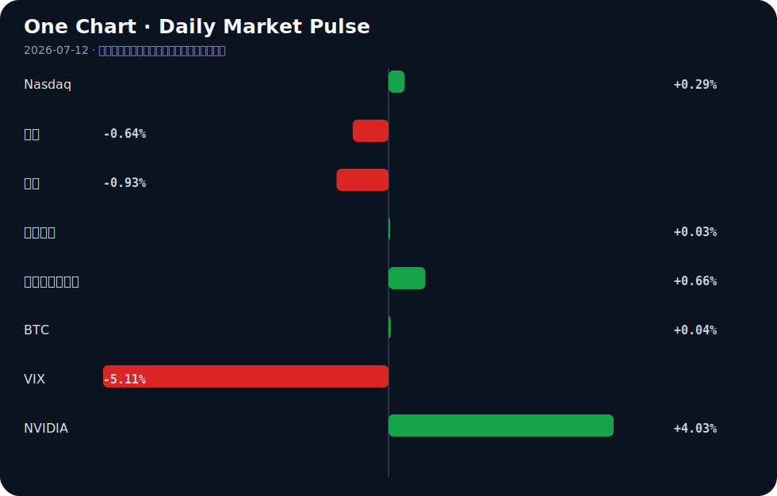

# Daily Intelligence
> 2026-07-12｜Sunday

## Today’s Thesis｜今日一句话
当AI从技术叙事转化为结构性生产力与安全约束时，全球资本与劳动力市场的制度性摩擦将先于技术红利显现。

## ① Executive Summary｜30 秒
1. **AI**：AI正从技术叙事跨入制度重塑期，企业用高薪重塑劳动力结构[A7]，而治理与安全摩擦加剧[A8, A13]。
2. **商业**：AI商业化催生极端定价权（日薪2.5万美元顾问）[A22]，同时AI代理开始直接接入金融交易系统[B17]。
3. **宏观**：全球汇率干预预期升温（日本）[B24]，而中国试图用高科技韧性对冲“中国冲击2.0”叙事[B8, B11]。

## ② AI Daily

### 1. 劳动力重构：AI溢价的制度性对冲
**What Happened**：日本企业（如本田）通过加薪驱使员工主导AI使用[A7]；华尔街AI顾问单日收费达2.5万美元且排期至两月后[A22]。
**Why It Matters**：AI的扩散不再仅靠“替代”，而是通过劳动力价格重估来“诱导”转型。高溢价说明AI已从IT部门走向CEO决策层。
**Second-order Effect**：组织内部将出现“AI特权阶层”，加剧人才极化。AI劳动力溢价 → 传统岗位预算转移 → 企业内部结构性失业与薪资双轨制。

### 2. 治理与安全：产权与国安的双重防线
**What Happened**：Apple起诉OpenAI窃取商业机密[A13]；美国国会与政府对前沿AI国安风险高度警惕[A8]；Anthropic引入前美联储主席伯南克加入信托[A20]。
**Why It Matters**：知识产权与国家安全正成为AI竞赛的新战线。Anthropic引入宏观经济学家，暗示AI安全已被视为系统性金融风险级别的问题。
**Second-order Effect**：前沿模型开源受限 → 创业公司依赖闭源API → 行业集中度加速提升。

### 3. 代理革命：金融市场微观结构的改变
**What Happened**：Robinhood计划允许AI代理为美国客户交易加密货币[B17]。
**Why It Matters**：这是AI从“分析工具”向“执行主体”跨越的关键标志，金融市场的微观结构将因AI代理的介入而改变。
**Second-order Effect**：AI代理获得交易权限 → 市场微观流动性与波动率特征改变 → 监管机构紧急干预预测市场[B16]。

## ③ Business Daily

**医疗**：多模态AI在早期乳腺癌（HR+/HER2−）中验证了预后模型[A2]，AI正从技术趋势转向临床决策的主动驱动者[A5]，医疗AI的商业化路径从辅助诊断向核心预后干预跃迁。

**金融**：华尔街银行收紧预测市场交易规则[B16]，高盛股票反映投资者对利率前景的权衡[B19]；同时AI代理被引入加密货币交易[B17]，传统金融与去中心化金融在AI代理介入下面临规则重写。

**自动驾驶/航空**：美国联邦首次电动航空飞行 cleared path to Air Taxi certification[B15]；日本车企（本田）通过薪酬改革推动AI应用[A7]，低空经济与地面智能出行均在寻找政策与成本的拐点。

## ④ Macro Observation｜机制分析

**世界正在发生什么？** 全球宏观处于汇率干预临界点与产业冲击叙事重构期。日元看跌情绪达四年极端[B1]，日本誓言随时干预[B24]；中国反驳“中国冲击2.0”[B8]，世行指出中国高科技强劲抵消消费低迷[B11]。

**为什么发生？** 日元贬值源于日本政策不确定性[B1]；中国冲击叙事重构源于其产业升级速度超出外部预期，引发欧美保护主义反弹[B22]。德国2045气候目标因竞争力担忧承压[B7]，本质也是绿色转型与产业生存的冲突。

**资本如何流动？** 资本正从受政策扰动大的市场（日本汇率风险[B24]，特朗普政策冲击[B4]）流向具有韧性或资源壁垒的市场（新兴市场[B20]，摩洛哥[B5]，尼日利亚锂矿[B21]）。

**接下来关注什么？** 汇率干预的实盘介入是否引发流动性逆转；“中国冲击2.0”叙事是否转化为实质性的关税壁垒；德国气候目标是否实质性倒退。

*事实与推断区分*：日元看跌情绪达四年极端[B1]与日本政府表态干预[B24]为事实；资本流向新兴市场寻求避风港为推断；德国气候目标倒退为待验证信号[B7]。

## ⑤ Signal Dashboard

| 指标 | 最新值 | 今日 | 信号 |
|---|---:|:---:|---|
| [Nasdaq](https://finance.yahoo.com/quote/%5EIXIC) | 26,281.61 | ↑ +0.29% | 中性 |
| [黄金](https://finance.yahoo.com/quote/GC%3DF) | 4,104.10 | ↓ -0.64% | 避险需求回落 |
| [原油](https://finance.yahoo.com/quote/CL%3DF) | 71.41 | ↓ -0.93% | 通胀压力缓解 |
| [美元指数](https://finance.yahoo.com/quote/DX-Y.NYB) | 100.97 | → +0.03% | 中性 |
| [十年美债收益率](https://finance.yahoo.com/quote/%5ETNX) | 4.57 | ↑ +0.66% | 成长估值承压 |
| [BTC](https://finance.yahoo.com/quote/BTC-USD) | 64,153.22 | → +0.04% | 中性 |
| [VIX](https://finance.yahoo.com/quote/%5EVIX) | 15.03 | ↓ -5.11% | 風险偏好改善 |
| [NVIDIA](https://finance.yahoo.com/quote/NVDA) | 210.96 | ↑ +4.03% | 風险偏好改善 |

## ⑥ Deep Insight

**AI人才溢价是组织通缩的先行指标**

当华尔街为AI顾问支付单日2.5万美元的极端溢价时[A22]，市场往往将其解读为AI产业繁荣与价值创造的证明。然而，容易被忽略的非共识视角是：这种局部的人才通胀，实质上是整体组织通缩的先行指标。当企业必须用远超市场均值的成本来“购买”内部AI转型能力时，说明传统的组织学习和知识流转机制已经失效。本田等企业通过加薪让员工主导AI使用[A7]，同样是在用财务补贴对冲组织的惯性阻力。在这种机制下，AI转型并非自然生长的效率提升，而是高成本的外科手术。其因果链为：局部高薪吸引AI人才 → 传统部门预算被削减以平衡成本 → 企业内部协同断裂，整体效率在转型阵痛期反而下降。这就是组织通缩：名义上的业务扩张或技术升级，伴随着内部连接的坏死和传统职能的萎缩。AI的溢价越高，说明旧有组织架构的阻力越大，转型的摩擦成本越高，企业越依赖少数“AI特权阶层”来维持运转。这种结构性脆弱在宏观下行期将被放大，因为高昂的AI固定人力成本无法被萎缩的传统业务摊薄。同时，这种通缩具有反身性：传统部门萎缩导致企业更依赖AI部门的局部优化，进一步削减传统投入，最终使企业丧失系统级创新能力，沦为AI工具的附庸。在宏观层面，若各行业普遍陷入此通缩循环，将引发结构性失业潮，迫使政府干预，正如美国对前沿AI国安风险的警惕[A8]可能从安全审查延伸至劳动力保护。

反方观点认为，AI高薪只是短期的供需错配，随着AI工具的普及和易用性提升（例如Anthropic推出Claude反思仪表盘降低模型调优门槛[A17]），溢价会迅速消退，组织效率将因AI平权而全面上升，无需担忧通缩。证伪条件：若未来两个季度内，企业整体人均利润增速持续且显著高于AI相关岗位的薪酬增速，说明AI红利已有效外溢至全组织，组织通缩论失效；反之，若企业总营收增长停滞而AI薪酬成本占比飙升，且非AI核心部门离职率上升，则组织通缩确立。

## ⑦ Tomorrow Watch
1. 验证日本央行是否在日元触及特定阈值时实施实质性汇率干预[B24]。
2. 追踪Apple诉OpenAI商业机密窃取案的首轮法庭文件或回应[A13]。
3. 关注Robinhood上线AI代理交易加密货币功能的具体监管反馈与时间表[B17]。
4. 观察德国政府是否因竞争力担忧正式调整2045气候目标的时间表或路径[B7]。
5. 验证美国前沿AI模型国安风险警告是否转化为具体的出口管制或审查法案[A8]。

## ⑧ One Chart

图表展示了主要资产类别的近期脉冲变化，其中NVIDIA与VIX呈现出明显的反向运动。这种同期的风险偏好改善与成长股拉升，反映了市场在降息预期下的重新定价，但相关性并不代表VIX下降直接导致了NVIDIA的上涨。

## ⑨ Quote of the Day

> “If something cannot go on forever, it will stop.”  
> — Herbert Stein

**中文理解**：不能永远持续的东西，最终一定会停止；问题只在时间和路径。

**Why it matters today**：这句话不是装饰，而是今天观察 AI、商业和宏观变化时的一个思考框架：先看机制，再看价格；先看约束，再看叙事。
## ⑩ Action Items｜今天值得思考什么
1. 思考：你的组织中，AI人才溢价是否正在挤压非AI部门的预算空间？
2. 验证：Robinhood的AI代理交易权限是否会被美国SEC迅速叫停或限制[B17]。
3. 比较：日本企业的“加薪驱动AI使用”模式[A7]与美国“高薪聘请外部AI顾问”模式[A22]的ROI差异。
4. 追踪：伯南克加入Anthropic信托后，AI安全框架是否会引入宏观审慎监管的逻辑[A20]。
5. 关注：中国高科技出口韧性[B11]与欧美“中国冲击2.0”叙事[B8]之间的张力是否正在酝酿新的贸易壁垒。

## 信息边界
本简报来源覆盖Google News聚合的AI、科技、金融与全球宏观经济英文及中文源。时效截至2026年7月11日GMT晚间。市场数据（如Nasdaq、黄金、VIX等）反映最近一个交易日的收盘或实时快照，非实时更新。重要判断基于二手聚合信息，请读者回到原文验证。

## Sources

### AI

- [A1：Artificial intelligence reveals the identity of the 50-year-old woman whose violent death police are investigating in Lleida - APD Noticies](https://news.google.com/rss/articles/CBMiiAJBVV95cUxOQVRpbDAwVWFqX0c3WGVhQ0hQNVZJZGdtbHNFQmZPNTJwMV9HX3Z2cl82cm00S3l3SUZaOGN1ZThsQkxaWUtOT1BzQ1hQVU5CMjhaRDlVd1FKUml4cVNrTXJLTVQ1azl4dnpBTVFldy1fTV9SNWFfT0h3ZUZJTHVtR3NmajFwZ1lkeUt6allrTWlPODR0TFRVTkc1MXJUOXdzQ1pFTURsNDY4UUNncGtnMDlCcjZFZ3UwUzNpcmkxSnFLLWdtUjdzZkg0dWR0czFTeTVMRDBpZlBtTzNEb3pEWENPai04QUJ6anBfMG5rNmNCVDBQbDBnZGNnTUttN1V1MjNudFZHcHo?oc=5) — Google News · AI
- [A2：TIP12 Validation of a Multimodal Artificial Intelligence Prognostic Model in Early-Stage HR+/HER2− Breast Cancer - CancerNetwork](https://news.google.com/rss/articles/CBMi8gFBVV95cUxPSkdQcnhUMHZra1pvZUJtNXVzY0RWcmVTQ3hWTEF1OU9wS095d3V6aC1QckFCQklWU25tZEZTX1A2bHl4ejJaSmYzRnpkel9STzRkTFRmZXM4N0xsM05FMG4zaVBLSWFqSVV4Y1g0UGtMV3BPUDQyV3hkenYycm9QdlpnR2lMMXJWRS1OSUFib2stMFJOM1hNYW5BRjdSelVLN1JXTmo3NnVHUE1pcFlRVU14NGhBX3FpUXJjQXYzWUY1REFuN09EWWtaQTdKN2VHMkdaR29KTmlldE5XZnRrNE00Z2JVMXdpRnpZSTJrWnlSZw?oc=5) — Google News · AI
- [A5：How Can Artificial Intelligence Move from a Technological Trend to an Active Driver of Clinical Decisions? - SPCC - Oncodaily](https://news.google.com/rss/articles/CBMiUkFVX3lxTE1GNzVNZWdhbUtaZGZVOHdBZ2diZWhQaDhWWDNwOXlCTTFELUdQMkNpTWs3WmVjSDNnQ0tCUmJhNFJyUnhQX0xmcE42T3hCTHduUkE?oc=5) — Google News · AI
- [A7：Honda, other Japan companies in pay workers to spearhead AI use - Nikkei Asia](https://news.google.com/rss/articles/CBMiygFBVV95cUxNeFRDc3NaMGpMeER2U2Q4VnMyVGhXeTNxQ2FRaXoyR09MM0d6YzBHUzBZem9BTllMVkIxMmhpZWYzT0VIdzRudzA2SkZ1U2lVMUNkM0NPSnhKUmZ5Y29ETEhzWTM5WU1KV1J5UC1OYzIyVnNjZXJiMFhSM2swaEtCU1hKeDY4dDJfdHIzN3EtX2h6MGdIZk9Ed0NYdHFEVTR4OTJ1RGxZYzcxMzJUTTRISVVuY04zSXdyTERVbjk0ZTNHX3J0Z04yOXNn?oc=5) — Google News · AI
- [A8：前沿AI模型存國安風險 美政府和國會警惕 - 大纪元](https://news.google.com/rss/articles/CBMiYEFVX3lxTE9aa01oX3RVOWx1VFR4SlIwX0lWdGdheURtb1IyTUxCa0JIcmZyLUtySnhrZmg2YXZYNExiVmZwdnBpNmZoV29HNUtNVzN4QThYcS1iZGJNMjlwSTZKMjFWT9IBZkFVX3lxTFBsR3FXbjVZUjFuU291a3ZJQldyQ0lrQkh1RlJFWlpqY3JuajV1QkpvUHFlWjNTbGt5ZkxrRTFMb2Q2cDNFbGJZOUVZVGdtc0k5YUVLLUxjQUVEY2hyQURQZ052T3MwUQ?oc=5) — Google News · AI 中文
- [A13：Apple Sues OpenAI for Trade Secret Theft, Iran Rejects US Talks - StartupHub.ai](https://news.google.com/rss/articles/CBMiwwFBVV95cUxPS0thUVRKLVktV0dwbHNDdVRSOGVTZ2pGbDQ2T3RVZ2toTG96aU5WOE5TT2JEZUdtLTNaaFRINXNNUjhVV0ZSZEJkRnVfaUl5VkZRcmN6aUwxSTYxNzJEZEduUHZkdVhrbDJwSVQ2a1NzMTJZRDYwTlJKcXRGRy12QXpNTTRxTFhNd1ZDaFBYMmdPUGNFZW9Yb3FtUnJJbVhhcTE2SERoVEg2N01oNUZqVGxmOHFNcTA1ZnR6M3FKT2h2NVU?oc=5) — Google News · AI
- [A17：Anthropic Debuts Claude Reflection Dashboard - StartupHub.ai](https://news.google.com/rss/articles/CBMiqwFBVV95cUxOdFExUXBucFhUNE9uaWNnemMtRzBwMDBGWlNlaDR4ZEFaaHVEbnZveHNZaE5zSFVrREh6ZjdodGNGdEdsS29RWHJnMURFNUR6a2FFTzBZUjZocDJvdG9tVHFBTkg4SWVCUnQyb3dTMURBRjYwSlZ5UjdsU3gtcUVVRzM0UWNIZDdoeXFFdF9ETlloM1Q1YkRLX0pDZkUwcXF5RkVLVllMVk5Obk0?oc=5) — Google News · AI
- [A20：Bernanke Joins Anthropic AI Trust - StartupHub.ai](https://news.google.com/rss/articles/CBMinAFBVV95cUxPMDVrSWNxMGtDWFZYNnEyOW56Z1d5TU5yYVBzbWNDdHJ0Q3JzRFYzaEl2NHhGT3hURU5YQ2hoWmhlQk9pdEZfNzJneWRyNHZSeDBlclpkRXV4ckJPMzRKeXMzc1ZERkNCSkNpYXRTeTdZLVpJemVUZl9jWG5pTWs3R29qa3o5bnh5Q0N3dFo4RHNXVEQ4TU5LLW16N3U?oc=5) — Google News · AI
- [A21：Anthropic Seeks Public Input on AI Future - StartupHub.ai](https://news.google.com/rss/articles/CBMipwFBVV95cUxNd1E4MERDWGpIbUQ0R1FJdzRmZ1hWTENtbVNpcml4Q0JMWmpoekJDMURfNWwwdTFMN1hneU5jYkRaaE5jU3Fxdy1NNWotbllmVW1TejV2bUJ2RzhzQlY2TDM0bERvR0Q0dHJ5MWp1TFlYb1otTVlDbDFqRFhuX2NHNmxpNDhIUUpuLXNXUUtoQjltbFg1Njc4bS1hVWpCTk9ScWtsM25uYw?oc=5) — Google News · AI
- [A22：AI顾问成华尔街新顶流：单日收费2.5万美元 预约排到两个月后 - 财联社](https://news.google.com/rss/articles/CBMiSEFVX3lxTE1UOTBGNG5KTEEyV09IVXB4MXRaX0JmYTZKZlBiRnhyandBclJReTk1WnI3eDJTcHg4eklMZGV3cHF5dnZLYTkzdA?oc=5) — Google News · AI 中文

### Business & Macro

- [B1：Yen Bearish Sentiment Hits Four-Year Extreme as BofA Flags Policy Uncertainty in Japan - CryptoRank](https://news.google.com/rss/articles/CBMiigFBVV95cUxQRUJUbWp5bnY1SDJSQlU0VzFjbUxvNVVUQmR6cVF6ODBLLVhaWDhLU3lBd0Q5Q2FIQ3JRUHpiOXZWc090WWtvdFFMbGcybVc5NWtoNzZJb3dzWmVUMlFvQlNnQWpORDMtRDh2Z0kxM2ZEQXQ2dTlDTldkQ29Ra3N1eHBuZnAxeTNGVmc?oc=5) — Google News · Markets Policy
- [B4：3 Trump Moves That Shook Markets This Week - CryptoRank](https://news.google.com/rss/articles/CBMidEFVX3lxTE1jWlVBaVltQjZrR3pnRl9EQ3JyajdlWTFDSjVwdXB4c3AyRHpleDN5am9hVjFMNlBqN1RKRGhza2hVb2Z3S2dmek9RVVRSV3ViZnBqeXdlTWpjM0EyQ3NSV3dWZ0REcjEtS25iM3RtMUN4T2Nj?oc=5) — Google News · Markets Policy
- [B5：UNCTAD: Morocco Boosts Its Investment Appeal Despite Global Challenges - Atalayar](https://news.google.com/rss/articles/CBMi6AFBVV95cUxQeDluckJSSWhEaXFEcXdXaEJQcE9mal8zM2pQMUdlWmlzRTAxWGFPVjJkREtkWkxyV0w0MDFFM3cwMWZPbldUSXotNjdoMi1iS1Fvc2RfUXYxRHZCNFNrWERON0NQLUhwUVR0S3UtcFNFRDI2MDE2NFpBVG50OHBKSHVJWDNRREc5OHpLMkNvMjZKTWszQk1UcnBPUnlXTFNVT2JPc2lRenNzdDhXY3RZV2xMdXlZR3ExM3lqZ01aSm84SnlZWWV0ZmtwY0lZUG9fTEc4QkNzb21IOG5SX2RCUWNZbWJGdnpU0gHuAUFVX3lxTE9mUDh3RFl2LVRBalhqNzlsQklJY1FXdUJFLTJ2bGx5X1Z3T1N2Tmx3SGhUOVpYcmlvMU5OdlhvNkdYMllNckRPU1NSenM0aVRRZ3IteXlKNjNjakE2SjBhdkd1eE04WWRlVEJuUDFXZ0pBbGtGTHVGeEpwSlp0WWg2RUZuNG40bnZxQ3B6Q0FxVXV4TkZpMmlrRVJWeWRaa0lqNUVpZFB3aXFqOTFOMFZQY2dtdFRVQTY0V1VQaXFzXzhFUzFvMkFvc1VWQzJLeWduczlkVkxTd0ljWnpQRV8zOUNtU2NxUm1Wb1ZnQmc?oc=5) — Google News · Global Economy
- [B7：Germany's 2045 climate target under pressure amid competitiveness concerns - AzerNews](https://news.google.com/rss/articles/CBMiVEFVX3lxTE1CVnlZSmUyamZZTHJONlIzalg0czh3TVlfOV9PMnlhOXJ2VGxrWGlURnZBbnRWLW5uV0g5X1p6VFZWRnZNWWZfRUlPWXduc3NZN2xJMg?oc=5) — Google News · Global Economy
- [B8：China Dismisses 'China Shock 2.0' Concerns, Says Industrial Growth Benefits Global Markets - Menafn](https://news.google.com/rss/articles/CBMitwFBVV95cUxNWXVzcTdaWUkzMjF1T3hsc1h6ak1mNHVUT0Y2N0FjdW9qSEtORVM1emZUZHZvbkNiTDEtR2VyelZ6UmRHV3FNdWdSTmh6NHdxWDdVQU5XMzYzcTcxOTJZYUFEdktfT21RcE01X05qTFdMNElvcFBNVmJNbFRjWjRROXdRbzllSFVhZDlrMEdpR2x5QlV4NmZKU1VPa1pIRngyT1ptbjZnU21MOGJqdW9BbXpiSnFJckE?oc=5) — Google News · Global Economy
- [B11：世界银行论中国经济：高科技强劲抵消了消费低迷 - 网易](https://news.google.com/rss/articles/CBMiYkFVX3lxTFBXV0RzX1hYdFA4NXNwMFJlUGhNVVVSam1YdjMtbWRrdzBWdmpGRjBwSzl0NEcwWlJFeTVzYWUzN1dzTnliLTZ5enNMb2djV21tN25yUFhVcktRVTQ3c3RDRXV3?oc=5) — Google News · 行业
- [B15：First Federal Electric Aviation Flights Clear Path to U.S. Air Taxi Certification - Tech Times](https://news.google.com/rss/articles/CBMiywFBVV95cUxQN1hlRWVwMVd4XzZaSWVObFFiN2M0eno0WEdVY2xCdmF6THotUnBoOVVYNDQ5Z2JRQU12Qml3UWVUUkxHOFhscEo1YXkwWk9Kc1ZYNFN4Z1VCbTlSTEs3S2xmN011bFVua0NPbkJCRnphdmlEN1BvMWRpWHdNc0ZTSVczZXJ4MmZvQ29oZ0NsVVo3a3pnbHJWUDRkdllDVXotUlFwbUx1UVhxNjZWU2I5Vm0zUE9SWG9jbUZaQ3FncmM0RDJFNmpoWWFGWQ?oc=5) — Google News · Technology Business
- [B16：Wall Street Banks Tighten Rules on Prediction Market Trading - CryptoRank](https://news.google.com/rss/articles/CBMinwFBVV95cUxOSjRwVVNnSzcxQl9pbUI5UjlIZURBSVFxWjVpdHlQMzVyckF2elNWakx3ZXNsWUJZMlh1SG0xd3VaSVk1UG9iU19WYXRLN1lMWnlvMGpzQWFIblpoVWZfQ2lVMmhEQl9LbXdIa0VzdUVWTmVCSWs1emhqZTQ4RFROOFZhaHl5bXJoVk92VWh6Y2F5SWNPSkJ0SlNzVGFKems?oc=5) — Google News · Markets Policy
- [B17：Robinhood Plans to Let AI Agents Trade Crypto for US Customers - CryptoRank](https://news.google.com/rss/articles/CBMihAFBVV95cUxNR3JZazM0SkhtM3pLMFpCWElXZ2YyeGUzZmszSDZPeWJFWXRrUzkwbEVydXZCWnNSZFZrVHJhOEFxTGRNR0RLV2VQakpvOUtSS1RwZnN4MWpZcGZCbmUzX1U1ZGpqN3VQUGRzVTU1bUV2cGNwRDdGZVpiUE9HdDRQZHpKcmI?oc=5) — Google News · Markets Policy
- [B19：Goldman Sachs stock reflects steady banking demand as investors weigh rate outlook - ad-hoc-news.de](https://news.google.com/rss/articles/CBMizgFBVV95cUxQNGhzY0pnNjhXOFVLNU00VWNQVExjbm8wOG9ya0lRSDh2OG5CRVpnUFM0R0VGaC1Yc2VKOUEtbW9KRkFNZWpzRnhoREg0dmQwUlZEbm9STkV2ZFJ3MWIxWWxxdlIzSWdrYXozTmEtTnZNUTNpbzEyOXJRQlo2YU5mb3d3ZVV6UXRLUjh5dU9WMHhkSzdxZEpoVlNnRk9tREJXc0ZBdHdPT1I0QWpFTHZXMjcwZmF5OHBEOERiazMwM3QyTjYwY3BPOTN0eTJzQQ?oc=5) — Google News · Markets Policy
- [B20：Is Now the Time to Buy Emerging Markets - Kavout | AI](https://news.google.com/rss/articles/CBMif0FVX3lxTE91ZFBXcE5IVms5cUdmUENrVk5WZ1ZEV0lOV0ZFNUlDT2twNTlWaVJEdjBFNFowd0N1NzluRUZXWnROakZLUzVPZkhvV3Nva0hNOXFiemF5QVhJWWd2OG9XczVKTHdVNC1OX25LdlpuT1BabkYtV0VwVkdaNEZaWGM?oc=5) — Google News · Markets Policy
- [B21：Dele Alake and the dawn of Nigeria’s lithium revolution - The Guardian Nigeria News](https://news.google.com/rss/articles/CBMiiwFBVV95cUxPT3R2bWZVejMwRVBMMzVfUEVhOFNDWnllbFV0M2JTWi1KTzN4ZnlkbFJmc2hVazJmNTdLOEhTN1JwUkw5RGc2Z2lOZlJLN3FJMTdBNVdmdzRiOWVQdFRabU1GRFNhSnNxVjZfamNKNmFCM1RIcHVfWU94bWZrZU5rQnF5LW5EUkYyeEJ3?oc=5) — Google News · Global Economy
- [B22：全球媒体聚焦 | 英媒：欧盟不必恐慌所谓“中国冲击” - 新浪网](https://news.google.com/rss/articles/CBMickFVX3lxTFBWY0JQNDNIV2ZDZnlmc1NGQ05rTFlNVU1fLV8zNklhS0o1OW8yVFRKUUJYLTE3RDFuSVZvU0RqMGp6V1hOSnFxcFVfUXRtY3B0NllxNndqd1ZVWlNfYzNEM0lsNzFaV2tpZm1uVnpEQmRTdw?oc=5) — Google News · 行业
- [B24：Japan vows to act 'any time' on yen as markets brace for intervention - AOL.com](https://news.google.com/rss/articles/CBMidkFVX3lxTFBSaFRuS013SzMtWVQxcW9CcFlmVC1FWFlTMm0xZWlsaGZBRDBVV0gzZUdlRV82X0FaeEpMRVQ4cHYxOUcxNWVfVWE4VnlSc0lHRVM5dUk5ZEUwZmR3Q3QtVzhKLWFoRlp0Q0tHSWVlN1VCWnJla1E?oc=5) — Google News · Markets Policy
