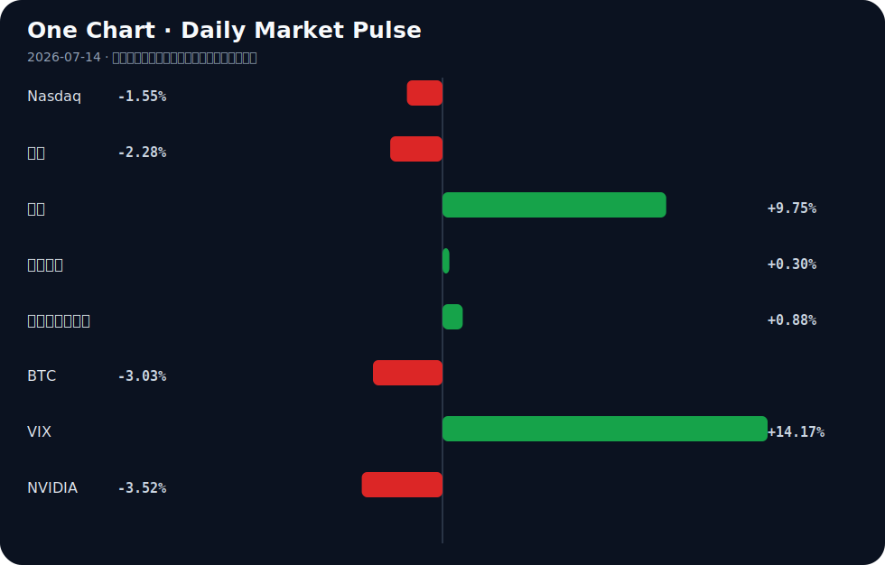

# Daily Intelligence
> 2026-07-14｜Tuesday

## Today’s Thesis｜今日一句话
AI 商业化盈利拐点与地缘通胀风险正在形成对冲，监管与司法的系统性滞后将放大科技巨头与主权国家之间的规则摩擦。

## ① Executive Summary｜30 秒
1. **AI**：大模型军备竞赛进入商业化验证期（Anthropic 盈利在望、字节超 2000 亿支出 [A12][A21]），但苹果诉 OpenAI 与欧盟法案受挫暴露出治理与产权的严重脱节 [B16][A2]。
2. **商业**：霍尔木兹地缘冲击推高油价并打压芯片股，资本正从广泛科技风险资产向能源安全与上游战略金属转移 [B2][B21][B11]。
3. **宏观**：通胀风险持续令美联储政策按兵不动，强美元与高收益率并存，正在系统性地压制远期成长估值 [B17][B21]。

## ② AI Daily

### 大模型商业化迎来盈利拐点
**What Happened**: Anthropic 销售额暴增，有望迎来首个季度盈利 [A12]；字节跳动被爆今年 AI 支出将超 2000 亿人民币 [A21]。
**Why It Matters**: 这标志着大模型产业可能正在打破“只烧钱不赚钱”的魔咒。巨额资本支出与收入拐点同时出现，意味着基础设施投资开始转化为真实的商业现金流。
**Second-order Effect**: 巨头资本开支集中 → 算力与能源需求指数级上升 → 铜等战略金属供应紧缺加剧 [B11]。

### 知识产权与监管的双重失灵
**What Happened**: 苹果起诉 OpenAI 盗窃商业机密 [B16]；欧盟 AI 法案遭遇“规则追不上技术”的现实挑战 [A2]；司法系统面对 AI 偷脸与大模型虚假输出难以追赶 [A8]。
**Why It Matters**: 技术的迭代速度已超越现有法律与监管框架的响应极限。当规则缺位时，数据产权与模型安全成为商业化的阿喀琉斯之踵，企业只能通过私法（诉讼）来界定边界。
**Second-order Effect**: 诉讼与监管真空 → 开源与闭源阵营割裂加剧（智谱发布开源 AI 并推进 40 亿美元股价出售 [A14]） → 主权国家被迫下场干预（如 AI 主权财富基金提议 [A11]）。

### 白领就业的结构性替代
**What Happened**: 聊天机器人已能完成投行员工的工作 [A16]；诺贝尔经济学家与科技领袖警告 AI 威胁就业且超越政府响应能力 [A1][B4]。
**Why It Matters**: AI 冲击正从蓝领体力劳动正式切入高薪认知劳动（金融、医疗 [A4][A6]），且政府缺乏缓冲机制，这将重塑劳动力市场的溢价结构。
**Second-order Effect**: 高薪岗位缩减 → 中产阶级收入预期崩塌 → 消费降级与民粹主义升温的反身性循环。

## ③ Business Daily

**科技**：苹果诉 OpenAI 揭示模型层与应用层的利益分配博弈白热化 [B16]。智谱 40 亿美元股价出售提振估值，开源模型正成为闭源巨头外的资本避风港 [A14]。本田向员工发放 AI 奖金，标志着企业开始将 AI 视为可直接分配价值的生产要素 [A24]。

**能源**：霍尔木兹海峡地缘紧张推高油价，能源安全焦虑驱动电池制造并购（Stryten 收购 C&D Trojan [B23]）与核能资本轻模式探索 [B20]。传统能源供给冲击与 AI 算力用电需求形成叠加共振。

**制造**：AI 与清洁能源驱动铜供应紧缺预期 [B11]；高精尖制造本土化加速（NASENI 建设本土产能 [B24]，Cyber Enviro-Tech 设立加州制造中心 [B10]），产业链重构从成本驱动转向安全驱动。

## ④ Macro Observation｜机制分析

**世界正在发生什么？** 霍尔木兹地缘冲击引发石油价格飙升 [B2][B21]，同时 AI 基础设施（铜、算力）需求处于结构性上升期 [B11]。

**为什么发生？** 地缘政治正在破坏全球大宗商品供给的弹性，而 AI 军备竞赛正在创造一个与宏观周期脱钩的不可逆需求底部。两者相遇，导致通胀中枢上移。

**资本如何流动？** 从广泛的科技风险资产（纳斯达克下跌，英伟达下跌）流出，转入能源安全、战略金属和美元流动性避险（美元指数上升，美债收益率上升，VIX 飙升）[B2][B21][B17]。但在科技内部，资本正高度集中于能证明盈利的 AI 基础设施与模型龙头 [A12][A14]。

**接下来关注什么？** 美联储对“通胀性 AI 增长”的容忍度。如果 AI 推高能源与金属价格，美联储可能无法降息，从而在宏观层面扼杀传统科技估值，形成“AI 越成功，利率越高，软件估值越低”的反身性压制。

*注：地缘推高油价与通胀预期为事实；AI需求底部脱钩宏观及反身性压制为基于当前数据的推断。*

## ⑤ Signal Dashboard
| 指标 | 最新值 | 今日 | 信号 |
|---|---:|:---:|---|
| [Nasdaq](https://finance.yahoo.com/quote/%5EIXIC) | 25,873.18 | ↓ -1.55% | 风险偏好降温 |
| [黄金](https://finance.yahoo.com/quote/GC%3DF) | 4,010.40 | ↓ -2.28% | 避险需求回落 |
| [原油](https://finance.yahoo.com/quote/CL%3DF) | 78.37 | ↑ +9.75% | 通胀压力上升 |
| [美元指数](https://finance.yahoo.com/quote/DX-Y.NYB) | 101.28 | ↑ +0.30% | 金融条件偏紧 |
| [十年美债收益率](https://finance.yahoo.com/quote/%5ETNX) | 4.61 | ↑ +0.88% | 成长估值承压 |
| [BTC](https://finance.yahoo.com/quote/BTC-USD) | 61,827.02 | ↓ -3.03% | 风险偏好降温 |
| [VIX](https://finance.yahoo.com/quote/%5EVIX) | 17.16 | ↑ +14.17% | 避险升温 |
| [NVIDIA](https://finance.yahoo.com/quote/NVDA) | 203.53 | ↓ -3.52% | 风险偏好降温 |

## ⑥ Deep Insight

**AI 商业化与地缘通胀的碰撞：结构性分化的反身性悖论**

当前市场存在一个极易被忽略的宏观-产业反身性悖论：AI 的商业化成功，正在成为压制 AI 软件估值的宏观力量。传统认知将 AI 视为独立的科技赛道，但事实上，AI 已深度嵌入宏观通胀的生成机制。

机制如下：大模型军备竞赛进入变现验证期（Anthropic 盈利在望、字节超 2000 亿支出 [A12][A21]），这要求算力基础设施的几何级扩张。算力扩张的直接物理约束是能源与战略金属（如铜 [B11]）。因此，AI 的资本开支转化为对大宗商品的非线性需求脉冲。

与此同时，地缘政治冲击（霍尔木兹海峡紧张局势推高油价 [B2][B21]）正在切断传统能源供给的弹性。当 AI 需求脉冲与地缘供应收缩相遇，大宗商品价格中枢将永久性上移。此时，美联储面对的将是结构性通胀而非周期性通胀，政策只能选择长时间按兵不动（TD Securities 指出政策持稳 [B17]）。

反身性闭环由此形成：AI 资本开支 ↑ → 能源/金属需求 ↑ → 通胀黏性 ↑ → 美联储利率高位 ↑ → 成长股（尤其是依赖远期盈利的 AI 应用与软件）估值承压 ↓。这意味着，AI 的产业成功正在转化为自身的金融约束。

在此机制下，市场将发生结构性分化而非同涨同跌。纯粹依赖远期故事的无收入 AI 应用公司将面临估值双杀（盈利未至，折现率先升）；而具备即期现金流且能将 AI 转化为降本工具的传统企业（如能用 AI 替代投行员工的金融机构 [A16]），以及提供能源底座的核能、电网与战略金属资产，将成为真正的受益者。本田向员工发放 AI 奖金 [A24]，本质上是在将 AI 效率增益内部化，而非追逐虚无的模型估值。

**反方观点与证伪条件**：反方认为，AI 自身的效率提升将产生强大的通缩效应（如替代高薪白领 [A1][A16]），足以抵消其带来的能源通胀。证伪条件：若未来两季核心 PCE 持续下行且美联储开启降息周期，同时 AI 算力能耗比出现数量级突破（如量子计算实用化 [A21]），则上述通胀反身性逻辑失效，AI 软件估值将重获扩张空间。

## ⑦ Tomorrow Watch
1. 验证苹果诉 OpenAI 盗窃商业机密案的法庭初步听证动向及对开源模型授权协议的溢出效应 [B16]。
2. 追踪霍尔木兹海峡航运通行数据，确认地缘溢价是否已完全计入原油价格 [B2][B21]。
3. 关注 Anthropic 首个季度财报的毛利率结构，验证大模型规模效应是否成立 [A12]。
4. 比较美联储官员本周讲话中对“AI 引致通胀”与“AI 替代就业”的权重评估 [B17][B4]。
5. 追踪智谱 40 亿美元开源模型股价出售后的机构配售情况，测试资本对开源路线的长期信心 [A14]。

## ⑧ One Chart

图表清晰地展示了风险资产（纳斯达克、英伟达、BTC）与避险/通胀资产（VIX、原油、美债收益率）之间的显著背离。原油飙升与纳斯达克下跌的同步发生，凸显了宏观约束对科技估值的即时压制，这并非简单的风险偏好随机摇摆，而是通胀机制正在重定价成长股。

## ⑨ Quote of the Day

> “Skate to where the puck is going, not where it has been.”  
> — Wayne Gretzky

**中文理解**：判断趋势时，要看系统下一步可能去哪里，而不是只看它过去在哪里。

**Why it matters today**：这句话不是装饰，而是今天观察 AI、商业和宏观变化时的一个思考框架：先看机制，再看价格；先看约束，再看叙事。
## ⑩ Action Items｜今天值得思考什么
1. 思考：在苹果与 OpenAI 的知识产权纠纷中，数据与模型权属的边界究竟在哪，这会如何重塑 AI 产业链的利润分配 [B16]？
2. 验证：Anthropic 的盈利是否来源于端到端解决方案而非单纯 API 调用，以判断大模型变现的真实路径 [A12]。
3. 比较：在地缘通胀与 AI 需求双重夹击下，铜等战略金属的供给弹性与价格传导时滞 [B11]。
4. 关注：欧盟 AI 法案受挫后，各主权国家是否会转向“先发展后治理”的实用主义路线 [A2]。
5. 追踪：高利率环境下，那些尚未盈利且依赖外部融资的 AI 初创公司的现金流消耗速度。

## 信息边界
本报告事实部分仅依赖提供的 2026 年 7 月 13 日 Google News RSS 聚合源。宏观与市场机制分析包含基于已知事实的逻辑推断，已做标注。市场数据为最近交易日收盘值，存在时差延迟。重要判断请务必回溯原文验证。

## Sources

### AI

- [A1：Nobel economists, tech leaders warn how AI could threaten jobs - The Washington Post](https://news.google.com/rss/articles/CBMitgFBVV95cUxQUlVGVF9nYnhzWkgxZ01GRlJZbENRYXQzNzU4ZlNiV01LNzFmUTlOWUdfTjIxbk9DMjRtLW56SWtxb0xENHE2NmloZ0JkM1VpLXNidVhBWEd0RG5INWJiNjFMNXRMRmszNUNXdFhkc1pudjVCS2toVXVUdGUtc3E5MFQ3WFl6U2o5VVJVV0U4NDFxaGprclNibGx1RTEweVlIUXAyLWUxMk1BSTczRHBNZ2o5S09DUQ?oc=5) — Google News · AI
- [A2：规则追不上技术 欧盟AI法案遭遇现实挑战 - 新蓝网](https://news.google.com/rss/articles/CBMiT0FVX3lxTE5aRzBrcmtzNmRwMHdZZTZDMm1KbWc4c2ZZcHgyRklYVUlBZWlLZkNHNjVnTUVyNmNDVG8yZEl6SkZCc2J5Z18tVk1XcFhDMDQ?oc=5) — Google News · AI 中文
- [A4：09 Radiologists’ and Ultrasound Artificial Intelligence Decision-Support Assessment of Benign and Malignant Cystic Breast Lesions - CancerNetwork](https://news.google.com/rss/articles/CBMi2gFBVV95cUxQMGxRcExncl8xRlVJRHBvdTJDVmVyMkl5RTN4TTcycHdMM2RkZ2pVdTlGbjRoWDd0RFB1anVscGx2dnRSZHY0NkE5MlRaQVpLemVkWFFqV1NQS0J3TjNuSUdIY0pGd0NadmQzY3lLVnF0OWVzLVpRNmR6T0tKbTVxRExkMXl3bE1Qb0FSNjBWeGN6d1o0ZGdROXJGRm9yVEowR3NaYzZxb2ZiN1c3bFFtaW1WMWMzMDdFbDA5ZDVqV2ZIZWVXNHA1SThGS1hMS0Y2QmtUV0RWNUJmdw?oc=5) — Google News · AI
- [A6：From Patient Selection to Surveillance: Artificial Intelligence Applications in Radioiodine Therapy – A Systematic Review - springermedicine.com](https://news.google.com/rss/articles/CBMi3gFBVV95cUxPaTZjOU91ZEhLRFhRRldOOU5aR1BpOEd3X1NxcUp2WmZ1cmduZ2pnaklGSktjSkI5enotSEs0dlZDS0NQdXV1eFhXclc4a2ZUQjlRZU56MlhJTHBfclQwMW1NR3d0eVZtSFF6a1dUd2xOV3lZQ0U4Z0Z0UzREbHhBV05kVkV0QmdYSkU1TWZnLVR0Sy1nc0xXdGxrd3JBcmNUVlF4THhoNlhqb000ZzZ5T0xBdENlSlh6Q0ZNZHNaLXRiMnY1UnBVdWx5QWtLR2pZYk1lWGdxT2NVQ0hSVmc?oc=5) — Google News · AI
- [A8：从AI偷脸到大模型虚假输出，司法如何追赶技术 - 新浪新闻_手机新浪网](https://news.google.com/rss/articles/CBMidEFVX3lxTE9Scm9wQ2pFQVNjVVcyenlUblRzZmhkQTZScHZKM0tDTnNlRUYyMFBSa2JBZXEyWllmM05SeUJHZEFKTjdkRndUdHY2ZG1RaU16S0dkYXNTeWlMSVRMUk1HUzNXOFpHWUFCbmhpTklMblBObTJV?oc=5) — Google News · AI 中文
- [A11：The Sanders-Trump Plan For An AI Sovereign Wealth Fund: Don’t Buy It – OpEd - Eurasia Review](https://news.google.com/rss/articles/CBMisAFBVV95cUxNSE9ESFlLVHJKR0JNOFFxeUdKekRCWDJvYUJLeHBFR2RYclpvVWRSYjlZUW1FWWlqOGt5TmpxMTQydmo5clNfOVlERDBvZDFmRE1FUGUyOWZIVUE5VzZoanR4d1JnaU1lQWlsZUdvLW9IUU5PLU04Ty1OZDFsbmZhUGNHeE5JeWpFN3dBU1VqSjZobVQtOTBlOXRmTjQxOTl1VkJseGJMYm5kTkhrdkZtbw?oc=5) — Google News · AI
- [A12：打破AI烧钱魔咒！Anthropic销售额暴增 有望迎来首个季度盈利 - 财联社](https://news.google.com/rss/articles/CBMiSEFVX3lxTE9FZ3J5WWVWb3ZmU1gtTnNjVVRWdWM1ZnpsUUhxZG9XU2k5UnBVekZsaURCaUViSTRuaHBZZWdURXI1MnczZ3QtLQ?oc=5) — Google News · AI 中文
- [A14：Zhipu Unveils Open-Source AI as $4 Billion Share Sale Lifts Stock - TradingView](https://news.google.com/rss/articles/CBMiwgFBVV95cUxQdGM0ZUtvQTRfbFhjUGVWdW1peHE5aTF4NFozdzI4R1IxSEowV0dpVU5MSUY2LWdtbEFUNE5DRnREcnZLanZEY1dzMVdOZVEtNFpqbVYxNUpkQk5iZnU5RTU3UXVUbldKekxnZVYxNVJEQXBuZTA4T0NzcFVLN0w5ZVhueG92cUppR2JibFZvQ2E2dTlZQVBILU40UnJkZnhNZGl3T3lsV0dsMWs0WUZDUlZEdmVOazFnc29fLURENDNyQQ?oc=5) — Google News · AI
- [A16：A Chatbot Just Did an Investment Banker’s Job - PYMNTS.com](https://news.google.com/rss/articles/CBMipAFBVV95cUxNT2J2cnZZRDE5UzdfY1FwQ2RhUGNFU2o4OEh2cVZyU2laeGZQUlh2akYxRzdTbWxfeWo2WUNzS2NSVlFpSDhuTHlmOGRjcVVaMndGdGpZMUdEb051WEFyV19MSmFPZE5DU19JN3QtcTRTVTY0bHk0WkcyZXhKd1VWVEl3S0xUWFNmejFZZ01YWVdtUFBSbEY1ZHROWldWbW16SnpJWA?oc=5) — Google News · AI
- [A21：【早报】字节被爆今年AI支出将超2000亿；我国第四代自主超导量子计算机上线 - 财联社](https://news.google.com/rss/articles/CBMiSEFVX3lxTFBuQ1FlSGRZV1RDNkRFcGs1ZDlNQWJqcEVXaGZObEUyUVl1VGRfZm05RGtQQ0picm1VTlpTakVtYkZDRnVqUVFRWA?oc=5) — Google News · AI 中文
- [A24：Honda gives AI bonuses to employees - AzerNews](https://news.google.com/rss/articles/CBMiVEFVX3lxTE4wSFQ2M3EyNkZ1NXZZMDE0QngzWENyenJYV2E0SXhQaVl4YUdKNWZLejhXYkdHeGZtVmFrc1Q1VEllLWsxVUhyeDZEc1JybzBoWGNRcw?oc=5) — Google News · AI

### Business & Macro

- [B2：Dow falls 138 points as Iran tensions hit chip stocks, lift oil prices - Invezz](https://news.google.com/rss/articles/CBMirAFBVV95cUxNdWh2MElzc0xZZkppTW85WW5FMnY5a2M1T2ZHbXc5a0tNM0xDMkhnV1NrNHQ3N2JKZTlXaU1qQ3h0OGptekNyRk90NGFsZEhYQlBaUXpqd0ZYbnJTOXpobVJTZVhWdHBlSnAwblIzYTNVeU9leUUwcVl0QzhZb3VwT1g4NGtQdE1ZSVAyMjc2VkNRQkxPYnRqY0o2amc2X1hyZzFZdk9rZl9OcXNt?oc=5) — Google News · Markets Policy
- [B4：Nobel Laureates Warn AI Could Outpace Governments Response - Mexico Business News](https://news.google.com/rss/articles/CBMipwFBVV95cUxOUF9TcG5xOXg5MVdWNWxKMXI3ZFRrbFlKcEQ4Um1CSzdOOTBCcnZSOWllcEZLbUMyTzZtSzItR25Ia2hUM0Y1emFFMmhxeG5GcFlpdC0zaTU3QjNEWmtQaFdrSjlLZnU3OU5fWmpKMnN2dHZ0X282Q1FPSnF0M0lPMEVadWtGQjZNMENBUl94ZkQyZHA1TUZ1b05UbW01TXl1S3VOZm04TQ?oc=5) — Google News · Global Economy
- [B10：Cyber Enviro-Tech establishes California manufacturing center - Investing.com UK](https://news.google.com/rss/articles/CBMizgFBVV95cUxOMmVSc3RoTHFJb0JGeHp0QkludVdtRXZjR1dhbko3R3BnM3FZMUtISER6Qllld1ZuNkpGSU84bDR2XzhCblM5RGxwZ01SeTloMk9mMkZ5Q2FNMHBOVnFsSU82YXpQdURIWnVvQ1NyU3BGSVdvM19tYUp4cEFGcXBTRWpKQUR5Q2w4a3lzUk5BTTBNLVFEbTZDZmI1QU1sNWhwZFV6WVN3U1RwUDM1Zm1FbEQxVUpJZ3RYRUZLTWVvN3d0b1hOTXJzLTVTZW9xdw?oc=5) — Google News · Technology Business
- [B11：Copper Price Forecast 2026: AI & Clean Energy Drive Supply Crunch - Intellectia AI](https://news.google.com/rss/articles/CBMickFVX3lxTFBkT2hwa1Z2Z2JHbXJtZnFSVGE5eFJrZVNjTUhzX2NJcDZWSm1ERmFhSlJDNTZPWjBzWmFxRmNVSmFueHM5bEV6YUJSWEczNWZILUFvdzZRcC1EbzVSRS1LNjZ0Q1FlQ2NnemRtUkRtczVPQQ?oc=5) — Google News · Global Economy
- [B16：Apple sues OpenAI for trade secret theft, impacting tech market dynamics - Crypto Briefing](https://news.google.com/rss/articles/CBMioAFBVV95cUxPR0d2MC1lTFFMSC1SQ3RsamN0dHd3c1VrLTlNazNnOEJoUmJVeWZQQktOLUN2cW43T3BhWVRfaVc0VHZHdFJZWnNHWWg5WmJTNHZJTUs3WXk2alZHRWN6MFRDejd6SFUxWVlzV2xWbnUzc25mZEtNNWFKQVdGMVI4a0dpWHI3UnhLbmFfeExadU5qUVlHamhnZHJVZHpGMXZz?oc=5) — Google News · Markets Policy
- [B17：Fed Sees Persistent Inflation Risks, Policy Hold Likely: TD Securities - CryptoRank](https://news.google.com/rss/articles/CBMiiwFBVV95cUxNd2R4NF9BQjNpRVgzdXVVWHJCUW9zSGRob1BlNkE5M3B5UDZaY1dSQTlNLXB2ODg4b05CSVZJWG5XSTJiekhfeXRHWEtfM3RiTHF0YjVKdy1ob0RTeUM0bUFpVzNodloxalpLaTVUeENBWkVKSE1OR2plZHlsZEtwNGVNVTM2elZXU3g0?oc=5) — Google News · Markets Policy
- [B20：Can X-Energy's Capital-Light Model Drive Long-Term Growth? - TradingView](https://news.google.com/rss/articles/CBMiswFBVV95cUxQVVFkdkk1dEE2Rm05Rlp0YU9GVnY2dm5kZUlfYWpUZE4xQVFRdFdtTlBHMjU1QV95X1hibEtUUEFkV0lsV2NwSVJKUzZXR3MxbGVrckNmU2pHMk1NaWV0bk1qaG5qVU1mcFlxVUNsalU2enFfSXNsdFNsWm1zMlk0YkFNb29yeTRfZVBUdnJqNFBDVXNxMEJPUFN5eWFsSk96OWlsLU5RakI1bVJQTlY2a3B1NA?oc=5) — Google News · Technology Business
- [B21：EUR/USD fell to 1.1390 at one-year lows as the Hormuz oil shock lifted the dollar index 0.2% to 101.15. - TradingNEWS](https://news.google.com/rss/articles/CBMiigFBVV95cUxQU050TGtyVkY5NHZER0hHTVlDUm1EbW90aXFESnN1R2t6b2hWOW1WNmdKbC1uMjBLclNvbUVEZk9fYndwcy0wblg0c1VJY1I1UGxPa1JyajJRUEttTmZPdjBzYTN0dnUtU0lZUFY3YVJUdjdKSlRCYjdzZ2Ywb3ZXMzFDNTRUMjZUaXc?oc=5) — Google News · Markets Policy
- [B23：Stryten Energy Announces Acquisition of C&D Trojan to Expand Global Battery Manufacturing and Strengthen U.S. Energy Security - Rutland Herald](https://news.google.com/rss/articles/CBMipAJBVV95cUxNX0paM1RLV2gyUzdqMTR1ZFNQcm5NWDhsQ2w5YzFQNUFVUmZMRUQ3eGd4VW5JeVJDVHVYWmtnYmg3dTFCZ1AxYkdMM3N1TVZOLTdUNEFKZV9HZ011dnNBN054MkVYb2tNQ2NqamFiWlNNRzlzSXZ3YUhFcWVsZU5vWU1qYTA4RUJNS3R1RWpCUXlhdzZRVFRaTVhMdHY5YlRYZ2xRZjE0czF6ZmY3dXFuYmhubDlZdGYzQWtfeTd2bmtjQXhnLURydFNZZmVWTFRvektzb0QxR0gyTmVfX290a3JzaGJRWXBnZEJoNmxINDNNVjVPSFVzVjZYdEk2Zk5EaWxKVDFQeHg5WHNFNGNNY1NieEF3WVJEbGtLWGZ5S013SnRB?oc=5) — Google News · Technology Business
- [B24：NASENI’s Centre of Excellence: Building Local Capacity for High-Precision Manufacturing - Daily Trust](https://news.google.com/rss/articles/CBMirgFBVV95cUxOazlKY2dHRnhkWW5ZRnpRbzE2SWFEYm5mVWxkd3JERW9HZzVpWXFOMVZTallyUjh2ZFluZU1wTzNKOFdKRGR3WmtGcmE4bjIwN2VFbW14T2ZQQmxiY3NMc0ZwUThtVTllbnNydV9KMzFiVzNvQXdDU3pVSDQwZmFKeHc5QnFSU2pvZHRjN05qT1JYT0FscVRKS2MybU1JXzFuQVA4VkdxSVBtTk9wcGc?oc=5) — Google News · Global Economy
