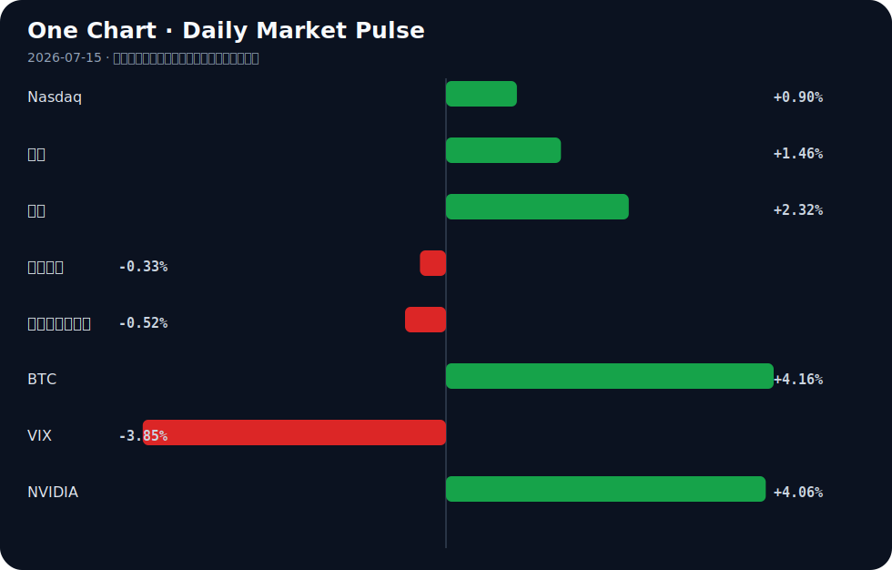

# Daily Intelligence
> 2026-07-15｜Wednesday

## Today’s Thesis｜今日一句话
全球AI监管正走向不可逆的碎片化，而AI硬件与出口成为新增长锚点，迫使资本从纯软件叙事转向基础设施与实体融合。

## ① Executive Summary｜30 秒
- **AI**：全球AI监管框架走向分裂（美、澳、伊州各自推进[A2][A7][A5]），而开源联盟与硬件设备[A20][A3]正试图从底层突破监管与交互的封锁。
- **商业**：AI投资扩张开始改变公司结构[A11]，中国AI出口激增[B3]表明AI正从消费端工具转向实体经济的基础设施与赋能引擎。
- **宏观**：通胀降温与银行创纪录利润[B1][B10]提振短期风险偏好，但老龄化与自动化的碰撞[B7]及AI融资的债务化[A14]暗藏结构性波动。

## ② AI Daily

### 监管碎片化与地缘博弈
**What Happened**：DeepMind CEO建议由美国牵头构建全球AI监管框架[A2]；同时，澳大利亚建立AI办公室并引入国家框架[A7][A10]，伊利诺伊州签署AI安全措施法案[A5]，旧金山出现旨在扼杀美国AI的游说活动[A4]。
**Why It Matters**：监管不再是统一的技术安全规则，而演变为地缘政治与本土产业保护的工具。碎片化合规要求将大幅推高跨国运营成本。
**Second-order Effect**：合规成本飙升 → 开源与小型玩家寻求跨司法管辖区的通用底层协议 → 全球AI技术栈分裂为互不兼容的“监管孤岛”。

### 硬件入口与数据私有化
**What Happened**：OpenAI首款AI硬件设备细节曝光，定位移动式智能音箱[A3]；开发者转向Buildkite等工具以适应AI时代的CI/CD需求[A1]。
**Why It Matters**：纯云端大模型触达用户的边际成本高且数据合规风险大，硬件是抢占交互入口与实现数据私有化的物理锚点。
**Second-order Effect**：云端模型竞争白热化 → 寻找新硬件载体控制数据入口 → 边缘计算与硬件供应链重估。

### 就业重构与技能定价
**What Happened**：AI投资扩张改变公司结构[A11]；捷克等国研究AI对劳动力影响[A15]，中国探讨AI与实体经济融合对就业的冲击[A21]；韩国引入反映员工AI使用能力的津贴系统[A18]。
**Why It Matters**：AI对就业的冲击并非简单的总量替代，而是重构薪酬与技能定价体系，掌握AI工具的员工将获得内部补贴溢价。
**Second-order Effect**：AI工具普及 → 员工AI能力成为显性考核指标 → 企业组织架构从按职能划分转向按“人机协同度”划分。

## ③ Business Daily

### 科技与制造
中国AI出口激增，但汇率影响依然微弱[B3]，矿业与建筑设备出口激增31.5%[B16]，材料工业发展被强调为制造基础[B19]。AI与实体经济的深度融合正在重塑出口结构，从低附加值消费品转向AI赋能的设备与底层材料。超越“中国制造”的创新革命正在发生[B12]。

### 金融
摩根大通在动荡市场中创纪录利润[B10]，戴蒙批评新资本规则呼吁公平计算[B17]，BIS指出AI繁荣融资正从现金流转向债务[A14]。银行的高额交易利润掩盖了底层资产质量的结构性变化，AI融资的债务化可能在未来放大宏观周期波动。

### 能源与资源
AI与国防开支正推动矿物开采热潮[B14]，油气运营开启电气化升级[B11]。算力需求的指数级增长正向上游传导，能源与关键矿物约束正在取代软件算法，成为AI扩张的物理瓶颈。

## ④ Macro Observation｜机制分析

**世界正在发生什么？** 
通胀降温与银行利润攀升共存[B1][B10]，风险资产全面反弹；同时劳动力老龄化与自动化剧烈碰撞[B7]，贸易碎片化加剧汇率风险[B20]。

**为什么发生？** 
（事实）通胀降温和银行盈利是短期流动性改善与交易波动的结果；（推断）底层是AI资本开支的债务化[A14]与实体经济自动化的刚性替代[B7]在互相强化，导致资本品价格坚挺而传统劳动力边际产出下降。

**资本如何流动？** 
（事实）流向风险资产（科技股、BTC反弹），流向AI基础设施与上游矿物[B14]；（推断）从受贸易碎片化与汇率风险影响的跨国传统制造，转向具有本地化、自动化免疫力的部门。

**接下来关注什么？** 
AI债务融资的偿债能力测试[A14]，以及老龄化+自动化是否引发资本品通胀与消费品通缩的“剪刀差”危机[B7]。

**机制与反身性**：AI债务融资扩张 → 推升算力与能源需求 → 挤占传统产业信贷与资源 → 触发通胀与利率反弹 → 债务偿付成本上升 → 需要更多债务维持算力规模。这是一个典型的反身性正反馈螺旋，直到信用链条断裂。

## ⑤ Signal Dashboard

| 指标 | 最新值 | 今日 | 信号 |
|---|---:|:---:|---|
| [Nasdaq](https://finance.yahoo.com/quote/%5EIXIC) | 26,107.01 | ↑ +0.90% | 风险偏好改善 |
| [黄金](https://finance.yahoo.com/quote/GC%3DF) | 4,055.30 | ↑ +1.46% | 避险/通胀对冲增强 |
| [原油](https://finance.yahoo.com/quote/CL%3DF) | 79.95 | ↑ +2.32% | 通胀压力上升 |
| [美元指数](https://finance.yahoo.com/quote/DX-Y.NYB) | 100.94 | ↓ -0.33% | 外部压力缓解 |
| [十年美债收益率](https://finance.yahoo.com/quote/%5ETNX) | 4.58 | ↓ -0.52% | 利好久期资产 |
| [BTC](https://finance.yahoo.com/quote/BTC-USD) | 64,826.87 | ↑ +4.16% | 风险偏好改善 |
| [VIX](https://finance.yahoo.com/quote/%5EVIX) | 16.50 | ↓ -3.85% | 风险偏好改善 |
| [NVIDIA](https://finance.yahoo.com/quote/NVDA) | 211.80 | ↑ +4.06% | 风险偏好改善 |

## ⑥ Deep Insight

### AI债务化融资的反身性陷阱

市场普遍将人工智能视为下一代通缩力量：自动化替代人力，边际成本趋零，效率无限提升。然而，这种叙事忽略了一个致命的机制转换——AI繁荣的融资基础正在从现金流转向债务[A14]。当技术扩张由债务驱动时，它将不可避免地转化为通胀力量，并引发强烈的宏观反身性。

国际清算银行（BIS）的论文明确指出，为AI繁荣融资的路径正从现金流转向债务[A14]。这意味着什么？科技巨头和初创企业不再仅用经营性现金流覆盖算力军备竞赛，而是大规模发债。债务融资在短期内制造了算力、能源和矿物[B14]的虚假繁荣需求，推高大宗商品价格；在长期，这些债务的本息偿还需要从未来的利润中扣除。如果AI应用层的商业化速度（即生产率提升带来的现金流）落后于债务利息的增长，技术本身就成了资本吞噬机器。

此时，反身性开始显现：AI债务扩张 → 推升算力与能源需求 → 挤占传统产业信贷与资源 → 触发通胀与利率反弹 → 债务偿付成本进一步上升 → 需要更多债务维持算力规模。这是一个典型的正反馈螺旋。摩根大通创纪录的利润[B10]和戴蒙对资本规则的批评[B17]正是这一背景的缩影：金融系统在享受波动性带来的交易利润，同时警惕底层资产被新资本规则锁死，因为一旦AI债务端的现金流断裂，缺乏足够资本缓冲的金融体系将再次面临系统性风险。

此外，老龄化与自动化的碰撞[B7]加剧了这一困境。自动化本应解决劳动力短缺，但在债务驱动的模式下，它推高了资本品价格，而老龄化社会的消费倾向下降，导致需求端无法吸收AI提升的供给。资本在贸易碎片化中寻找避风港[B20]，却可能只是将泡沫从房地产转移到了AI算力中心。

**反方观点**：AI带来的真实生产率提升将足够快，以至于在债务到期前产生巨量现金流，覆盖本息并压低通胀。技术进步的内生通缩效应最终将战胜债务的通胀效应。

**证伪条件**：未来1-2年内，若AI相关企业的经营性现金流（而非融资现金流）增速持续高于其债务增速，且核心通胀率在AI资本密集期出现实质性回落，则上述“债务驱动通胀反身性”逻辑被证伪。反之，若AI巨头出现债务评级下调或被迫削减资本开支以偿债，则反身性陷阱成立。

## ⑦ Tomorrow Watch
1. 验证澳大利亚国家AI框架[A10]的立法细则是否包含对开源模型[A20]的豁免或限制条款。
2. 追踪OpenAI移动智能音箱[A3]的供应链信息，验证其是否采用自研端侧芯片。
3. 关注美国核心通胀数据中，信息处理与设备租赁分项是否因AI算力债务扩张[A14]出现价格粘性。
4. 比较中国AI出口[B3]与传统机电产品出口的增速差，验证AI是否已成为出口的结构性支撑。
5. 验证摩根大通等大行[B10]在下季度财报中是否增加对AI基础设施贷款的拨备计提。

## ⑧ One Chart

图表显示了各类资产风险偏好的同步回升。需要注意的是，科技股（NVIDIA）与避险资产（黄金）同涨，以及利率下行与原油上涨并存，这表明市场同时在定价流动性宽松与通胀粘性，这种相关结构在历史上通常不可持续。

## ⑨ Quote of the Day

> “You can’t predict, but you can prepare.”  
> — Howard Marks

**中文理解**：你无法精确预测未来，但可以为多种未来提前准备。

**Why it matters today**：这句话不是装饰，而是今天观察 AI、商业和宏观变化时的一个思考框架：先看机制，再看价格；先看约束，再看叙事。
## ⑩ Action Items｜今天值得思考什么
1. **思考**：你的企业或投资组合中，AI支出是由内生现金流支撑，还是隐性依赖低息债务展期？
2. **验证**：所在司法管辖区的AI专项立法（如伊利诺伊州法案[A5]或澳大利亚框架[A7]）是否对跨区域数据流动设限，评估合规成本。
3. **比较**：员工AI工具津贴系统[A18]与传统的IT设备采购预算，哪一种更能真实反映并激励人机协同效率？
4. **追踪**：上游矿物开采[B14]与能源电气化[B11]的资本开支增速，是否已显著超越AI应用层的收入增速。
5. **关注**：在贸易碎片化[B20]背景下，非美市场（如东盟[B8]或中国[B3]）的AI替代方案是否正在形成独立的生态闭环。

## 信息边界
本报告事实来源限于提供的 Hacker News、Google News 等聚合源，部分新闻为二手信息，重要判断请回溯原文验证。宏观与市场数据反映最近交易日收盘或实时快照，具有时效滞后性。推断部分已明确标注，不构成投资建议。

## Sources

### AI

- [A1：Why devs turn to Buildkite in the AI era](https://www.thestack.technology/buildkite-ai-developer-cicd/) — Hacker News · AI
- [A2：DeepMind CEO建议由美国牵头构建全球AI监管框架- AI 人工智能 - cnBeta.COM](https://news.google.com/rss/articles/CBMiYEFVX3lxTE1QVlY3dDNKeHE3NUR5aXFoN0t5QVlBVTVCUjloR2hVNUlXNFVfTUh5bzgwUHl6Z2pEUld5Ykw4RlV3ODhjUzVRbkxGajllUHNZRV8wZVo3VG4zQnM1ellHeQ?oc=5) — Google News · AI 中文
- [A3：OpenAI首款AI硬件设备细节曝光：移动式智能音箱- AI 人工智能 - cnBeta.COM](https://news.google.com/rss/articles/CBMiYEFVX3lxTFBxNHlJVGNHX2tCT09rLVRFZ1RYdUxFM28zZDdBMUV5aGR4U3RuMUh5OFlSTWl2NWo5Q0ZJTmowc2ZvaWZoZTkyZW51VkFMWmVfZG0ycTNaZWlQVzRlM2NISw?oc=5) — Google News · AI 中文
- [A4：The Campaign to Kill American AI Runs Through San Francisco](https://garryslist.org/posts/the-campaign-to-kill-american-ai-runs-through-san-francisco) — Hacker News · AI
- [A5：Illinois Gov. JB Pritzker signed the Artificial Intelligence Safety Measures Act - Beinsure](https://news.google.com/rss/articles/CBMiZkFVX3lxTFBNZmxYUkZWZWVFa3kyY0pjNzNvN2pLQUhjUzR6SWlYb3E4blhEbHhOZmVKRGJ1VV9ORktDbHlfY19MbDNMaWdTZGJVRkJyaDltMHREaVdiSUMtV29INXVRd212S0U2Zw?oc=5) — Google News · AI
- [A7：Australian Government Establishes Office of AI](https://www.abc.net.au/news/2026-07-14/albanese-maps-out-ai-future-introducing-national-framework/106915094) — Hacker News · AI
- [A10：Australia to become the first country to introduce landmark AI framework](https://www.sbs.com.au/news/article/australia-set-to-become-first-country-to-introduce-national-ai-framework/0w2q0yakr) — Hacker News · AI
- [A11：Expansion of artificial intelligence (AI) investment has begun to change the structure of companies'.. - 매일경제](https://news.google.com/rss/articles/CBMiS0FVX3lxTE9mUFdhdzB3MHdjeFZwZXpzTmsybW1ZQ1lzbFVmdEctalR3eWRVeEk1Q2lkcXNrM2R0QUVSRUJUQ0h0Zkh2MTMtWGZfVQ?oc=5) — Google News · AI
- [A14：Financing the AI boom: from cash flows to debt [pdf]](https://www.bis.org/publ/bisbull120.pdf) — Hacker News · AI
- [A15：Artificial Intelligence and Labour in Czechia: Who Is Affected? - Česká národní banka](https://news.google.com/rss/articles/CBMi2AFBVV95cUxOV3BuOUhCSVF4RGtXMXVTWThrZUdOWXVHWjRsdEtRNFdlbjBQdGVsWjZydkJiVzlYSnZZLWxHTHJjdUlXdkZYMUtXZDYxcDF4M1NlMW1WQjVPVjl2TnFKaUtndVcwRmlFc21kVXlnZVphZHY1VnRtTklwMWl1S0Z6Qmhub2ZtTVZocHpkRW1jLTZTTnJoVzl1RzFwajdVNnA4VVB5dVdYNlNYWE5XSlVqNUlKMnVBT01WUzVHa0lyZHl6QkZyQng4dURXYUZLaWhnRTEzTGtRNFo?oc=5) — Google News · AI
- [A18：The allowance system, which reflects employees' ability to use artificial intelligence (AI) in salar.. - 매일경제](https://news.google.com/rss/articles/CBMiT0FVX3lxTE1GZ0RJNGRVYzFHUXJxMDVfLXFrdlpnOEpIbjVwb3owd280Y0lVS3VqdllnSzAwZ2VSbktJNjYtYlJEdzBZbmJxOE44UjdIekk?oc=5) — Google News · AI
- [A20：Open Source AI Rebel Alliance](https://time.com/article/2026/07/13/open-source-ai-mozilla-rebel-alliance/) — Hacker News · AI
- [A21：人工智能与实体经济深度融合对普通人就业有何影响？ - 新浪网](https://news.google.com/rss/articles/CBMif0FVX3lxTE1JOWUyZDRRcjVmZkJsNUd3OF9DQWRmZ3UtZkZHc3hjLURJZmExSW5MOVZfaG5VV2xUSTFyNFpRWHd5M1NYWXdnLW84VUNtSnhsTEp1VHJ6OWkweHVIenFXcFFiczRRV2tIS3VnWDJSV3Y5OUViUU1ndnRhRllXcVE?oc=5) — Google News · AI 中文

### Business & Macro

- [B1：Market Optimism Surges as Inflation Cools and Bank Profits Climb - Devdiscourse](https://news.google.com/rss/articles/CBMivwFBVV95cUxQZGdBTFNRVlF2Mm5LRlhMaFVySTVvcUhoRDVUeTNBaHFaTVNIT2QzY3RucG5DekdVUnM0b3Job0FwcHVCb0xyWFRFakdrUFQzZ1RQY09PaXJhNGFqTTNGU0lPWFE3M0ZKUmtFWTRNdUJ0a01jallNM2VQbndxMTFNSXV6d3FRZFI0eG5Pb2JxVHotQVZ2ak5EeG84S09qZi1DYzBZS2U2TUZrN1FvcEZOa2N2Wk1tZHdmYlFQWmo3MNIBvwFBVV95cUxQZGdBTFNRVlF2Mm5LRlhMaFVySTVvcUhoRDVUeTNBaHFaTVNIT2QzY3RucG5DekdVUnM0b3Job0FwcHVCb0xyWFRFakdrUFQzZ1RQY09PaXJhNGFqTTNGU0lPWFE3M0ZKUmtFWTRNdUJ0a01jallNM2VQbndxMTFNSXV6d3FRZFI0eG5Pb2JxVHotQVZ2ak5EeG84S09qZi1DYzBZS2U2TUZrN1FvcEZOa2N2Wk1tZHdmYlFQWmo3MA?oc=5) — Google News · Markets Policy
- [B3：China’s AI Exports Surge While FX Impact Remains Muted, Societe Generale Reports - Bitcoin World](https://news.google.com/rss/articles/CBMibkFVX3lxTE1kdHFETUwyaFk4YWpXYjRIMDAtRmJTdzRwNkhnQTJBdkZIeE1kWkpDaW5Cc3Y4dU1zaU1VR1F6bGpSaUphRU01bWRWeFVlczFNRGE2SEZUZV8td1BaUHVMSmxHRFoweDZlZjJhUHh3?oc=5) — Google News · Markets Policy
- [B7：US Economy Faces Volatility as Aging Workforce Collides With Automation - Mjengo Hub](https://news.google.com/rss/articles/CBMirwFBVV95cUxPaVA4OWp0UTlyTzRLSTB4QjFlM1JHLUVndXc3UlBBaHVRUUZWcXJWLVZXYmpSUFRPLTVLRXRVazJvVURKLVUzbzVQdTFwWnVUMWhaZjlDeGhNeTV0UmxmX2wtYi1qa3JWejNMSHB3NTRVSTRwN19NZjBYY1doMWdDZjZrSGFHU3JTa3Uwc3Z0SzNFWllOc083bE1HZ24wNGtxQy1Qb012RzUzTzZET3Q0?oc=5) — Google News · Global Economy
- [B8：The rise of ASEAN: What It means for global business - RSM Global](https://news.google.com/rss/articles/CBMifEFVX3lxTE9Sc1BjYkpwa1dqSmhmbk5zaDlVdHFRemZZekwweEtHYjRDaFBNRnNkSnhVb1dEYy1hc2lBUnJBcTNaQ0RpbjYtMmlkSVRJTEFKU2tFTGY3VjhraDNIQmNpdWluU0poZEdCdGIyOUZuSXJ3U2VqQ0U5SFExWE0?oc=5) — Google News · Technology Business
- [B10：JPMorgan Chase Shatters Records with Unprecedented Profit in Volatile Market - Devdiscourse](https://news.google.com/rss/articles/CBMizwFBVV95cUxQWF9IelhwMjRjVHF0Q1ZENGhLVG9EWHU0R1IxSi1NSTlidmw4aXFFTG1VYXUya0dhV2pVNEtXTGZGVlJkTk9iaFlrREZ3X2JwUXk1TUtEY2t4UW5Ca1k4LWY3dU1hTlowMm91YlpWYTZkZDFoUEFYLUdWUDE2QzVrZmJnbEhPcXdaSzEyVzBsdUp6M2J1OWh5WlRDc01HZHVZbU15cVdPZVBfWVczWGppeHVSSEQySHUzZ2g0Q3REZ1lZeUJZWngxX1V5N3JpZ0HSAc8BQVVfeXFMUFhfSHpYcDI0Y1RxdENWRDRoS1RvRFh1NEdSMUotTUk5YnZsOGlxRUxtVWF1MmtHYVdqVTRLV0xmRlZSZE5PYmhZa0RGd19icFF5NU1LRGNreFFuQmtZOC1mN3VNYU5aMDJvdWJaVmE2ZGQxaFBBWC1HVlAxNkM1a2ZiZ2xIT3F3WksxMlcwbHVKejNidTloeVpUQ3NNR2R1WW1NeXFXT2VQX1lXM1hqaXh1UkhEMkh1M2doNEN0RGdZWXlCWVp4MV9VeTdyaWdB?oc=5) — Google News · Markets Policy
- [B11：Electrifying Oil and Gas Operations: Capstone Upgrading Microturbines at Chilean Refinery - energytech.com](https://news.google.com/rss/articles/CBMi5gFBVV95cUxPYWZhRUlBNEhOcmlRRmM3U1lTOHF0MWNmcEpmVE96a29CTkgxYlUxNDlhdEZiYlFvX2NmZC16UVd1ZFo3eWZBYWxiYXFGVjF6dk43b2NrZVczeGpIdVpBVDNJNUJXRHFuMjg5LTVBRVlheDVZVjAxd3Y3Mm9hOUxoLUp3S1Fnem1SRVdjQWdqMWF1OGRrdWZ0N2FaWkk0c3F1ZThNZVNkckZoSVdNcXpaZXg0NmhkWUJ6TTIyNVZBV0p2dUFhYXd2bWZzRVExLU5qZy1hYXJBUjBiZE9qUExWNXU1NWRoZw?oc=5) — Google News · Technology Business
- [B12：Beyond ‘Made in China’: Inside the innovation revolution transforming China’s economy - Malawi24](https://news.google.com/rss/articles/CBMibEFVX3lxTE5NREdBYWE1YnFheFBaVDRBMk5NWGFLZmVfU0ZwallKWW5fRUM5UG90TFZYZy1TdGlUaVJXR1VFbjVpUlNpVjh5S3hOOWFSVEsydk5ETThrUEdPcE5Kek0yX0s5aG41UVdYNlV5aw?oc=5) — Google News · Global Economy
- [B14：AI, Defense Spending Fuel the Rush to Mine Minerals, Report Says - Inside Climate News](https://news.google.com/rss/articles/CBMimwFBVV95cUxPZlU2UkJTTjdyVGlJWGZUM29wV3lDT2JRSE9IOE1YZ01tU1hVUWFlRHpxdDNMVUNmQ1N0SVhvYTNadUlCOFprdVpKZHBIVWxfV29NanRwOEIwMHhieWZYcTN3dHo0VmlEM1BkZ216RmYxRXplWjM1WDNjMy01cnVrOVlKbWJnZWtXallRbWI3VlY3LVdUQ2tFYmhidw?oc=5) — Google News · Global Economy
- [B16：Mining, construction equipment industry posts 3% rise in domestic sales; exports surge 31.5% - MSN](https://news.google.com/rss/articles/CBMi2wFBVV95cUxPeTU2cG1paUUtU05wRlJxeHVaZTFNV0g5STVRZXBCdDlkeTJWUEZRempFZ09uTENDT1VLaTlvXy1lV01vQUppRTIzOEhmNUJqOHlmSzVSVmYwc2NFQktlMlhhRHFpVFN4X2lwTHBRbU9MdjJfcEVmRy1NX3laRG9Ndk1FdU9QYjkyU2pKckl6ZDJuNmFIQ3E0SkFlNzNiZU9MWi1scHl4VzhJbGxydGFleDhvdmVwc0tTVUYwMWxaSElHOWtrbzJiS0FBaU9HRkF4SG1ZeVNtMUh4eTA?oc=5) — Google News · Global Economy
- [B17：Dimon Criticizes New Capital Rules: A Call for Fair Calculations - Devdiscourse](https://news.google.com/rss/articles/CBMivgFBVV95cUxQbGtpMEFyajFHRER5cmVrUl9FVmgxYVJrWFFJYVVMRDNHbzBjdnZMdGEzblpYMkg3MTlER29kUW5jeFlMYXpzYVlIanFENHc1LVJHVGRnNk1XWkVGUGJDZDlQejZpSlo4dXlIeXUzOWsySW1mWTZ4N2VJTFloUEVtLXRxeXZXdTU5LWJHWlpwMXcyVlVQYl9YVHVrQVZEREZ0Z2JVNklkNE5DaXJYdUJRSEUwWWJDU25VMnYzR0Z30gG-AUFVX3lxTFBsa2kwQXJqMUdERHlyZWtSX0VWaDFhUmtYUUlhVUxEM0dvMGN2dkx0YTNuWlgySDcxOURHb2RRbmN4WUxhenNhWUhqcUQ0dzUtUkdUZGc2TVdaRUZQYkNkOVB6NmlKWjh1eUh5dTM5azJJbWZZNng3ZUlMWWhQRW0tdHF5dld1NTktYkdaWnAxdzJWVVBiX1hUdWtBVkRERnRnYlU2SWQ0TkNpclh1QlFIRTBZYkNTblUydjNHRnc?oc=5) — Google News · Markets Policy
- [B19：Developing materials industry to build strong manufacturing foundation - Báo Đồng Nai](https://news.google.com/rss/articles/CBMiyAFBVV95cUxPNzlJVGlsNWU5MndGcUpHeUpVZmg1TWhtRmtxMTlOS2tiZEFpbVR2bGZhWXdoLWE5VFNDWV9Rb285RHNDdUtaVlhiYlZpWHBldWNnem5jQVZVVXZjb1N6ZEtjSnBCZlNmZTVOYkpURkgzcnA1aHJLdk1KRFR4ZGcyc0MyeXJ3VHNGdzN5dDJjQWRJUlU0WTA3dGVoSmhfM1dLak96RGJTZGxXSWlzRFRSWEppcVp4aTJyRGRxRzRaWDFlLVVNaDdNdg?oc=5) — Google News · Technology Business
- [B20：The new corporate treasury playbook: managing FX risk amid trade fragmentation - Financier Worldwide](https://news.google.com/rss/articles/CBMisgFBVV95cUxOT2ZhMzRJY3NPY0RFSFFDWEdJMWR4ellKYXhaLVVyMEZlZV9zOUxJeENSOUhuUEFfTE95Z1RNRTBtSVBFeVdIWnNkOFF1MXhqVDh5Yy1hY1FUNVJlYUhja2JteUloaUhCclhLdmxNOWpPUkRWYjcyMEh6N2NxWEpoZWEyME1KbmM4NVNFTGhROVpwbFZIU2p0cGhyUE84aE5OakpwSVFHTEhaWkFyYUVYQ0lR?oc=5) — Google News · Markets Policy
