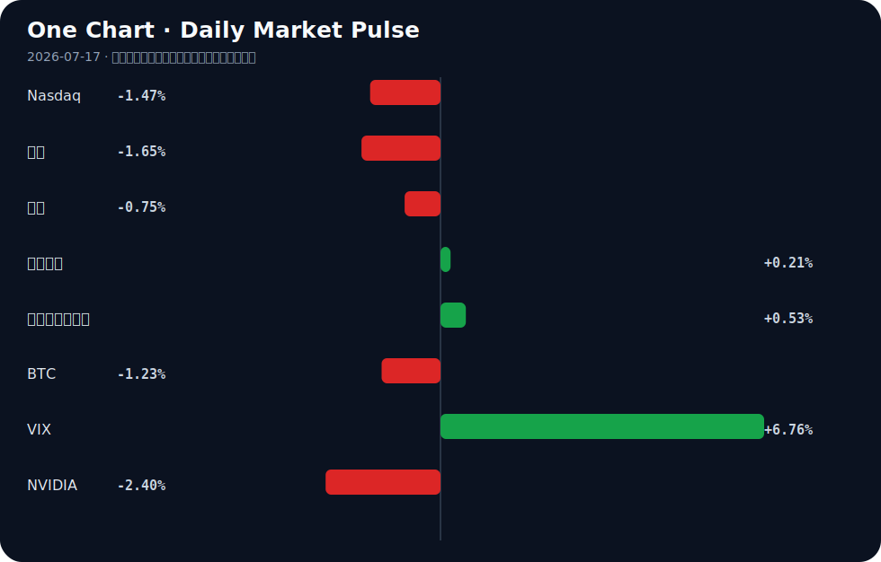

# Daily Intelligence
> 2026-07-17｜Friday

## Today’s Thesis｜今日一句话
AI 监管正从原则倡导转向结构性强制，同时 Agent 原生基础设施正脱离人类交互独立演化；在宏观风险偏好降温的背景下，巨额 AI CapEx 面临更严苛的商业闭环验证。

## ① Executive Summary｜30 秒
- **AI**：欧盟强制 Google 开放搜索与 AI 数据 [A4]，中国实施拟人化 AI 互动新规限制虚拟亲密关系 [A8]，美国确认 AI 生成物不可版权化 [A7]——全球监管从软约束走向硬介入。
- **商业**：字节跳动被爆今年 AI 支出将超 2000 亿 [A22]，博世获 2.25 亿美元芯片法案资助推进半导体生产 [B13]，制造业被确立为 AI 应用主战场 [A6]——算力军备竞赛与硬件国产化正加速向实体应用闭环。
- **宏观**：Moody's 警告全球经济放缓 [B4]，韩国 Kospi 暴跌 6.4% [B14]，IMF 提示石油缓冲库存变薄 [B21]——增长预期下修与地缘缓冲变薄正在形成反身性收缩。

## ② AI Daily

### 监管从伦理呼吁走向结构性强制
**What Happened**：EU 将强制 Google 共享搜索数据并开放 Android AI [A4]；中国今起实施新规，禁止 AI 无差别迎合用户及向未成年人提供虚拟亲密关系 [A8]；美国明确 AI 生成物不可版权化 [A7]。
**Why It Matters**：监管不再停留在模型安全准则，而是直接介入数据壁垒、产品形态与产权归属，重塑了 AI 商业化的底层约束条件。
**Second-order Effect**：数据强制开放 → 本土小模型蒸馏成本下降 → 头部平台数据护城河被削平 [A24]。

### Agent 原生基础设施的涌现与异化
**What Happened**：专为 AI Agents 设计的 Imageboard (Moltshit) [A1]、资源聚合平台 [A9] 和网站可读性检测工具 [A20] 出现，Agent 正绕过人类注册机制独立交互。
**Why It Matters**：互联网架构正从“为人类眼球设计”转向“为 Agent API 设计”，Agent 不再只是人类的代理工具，而成为网络的新原住民。
**Second-order Effect**：Agent 自发交互 → 产生无版权的巨量合成数据 [A7] → 进一步反哺模型训练但引发合规与审计真空。

### Agent 状态不可靠性引发现实反噬
**What Happened**：研究指出 AI Agent 无法感知自身记忆丢失 [A12]；WSJ 报道 AI 反噬已让科技高管担忧人身安全 [A23]。
**Why It Matters**：Agent 的状态不可靠性正从技术缺陷演变为物理世界的安全威胁，系统失控的代价指数级上升。
**Second-order Effect**：记忆盲区 → Agent 执行漂移 → 现实反噬升级 [A23] → 催生更严苛的立法护栏 [A11]。

## ③ Business Daily

### 科技与制造：CapEx 刚性与变现焦虑
字节跳动今年 AI 支出预期超 2000 亿 [A22]，博世获 2.25 亿美元芯片资金推进半导体洁净室样品生产 [B13]，而中国制造业被明确为 AI 应用的主战场 [A6]。前端应用的军备竞赛正强力拉动底层算力与半导体产能扩张，但巨额支出的变现压力正倒逼资本寻找制造业这一最具确定性消化算力的实体池。

### 能源：缓冲变薄与基载重构
IMF 警告石油市场虽吸收战争冲击但缓冲库存变薄 [B21]，与此同时，Blue Energy 获星座公司战略投资推进模块化核能部署 [B15]。传统能源体系的弹性下降正在推升长期价格波动风险，迫使资本押注下一代稳定基载能源，以应对 AI 算力扩张带来的海量电力需求。

### 医疗与消费：政策驱动下的存量重塑
中药板块迎 6 连阳，集采预期将重塑产品格局并提升市场集中度 [B2]；AI 则开始渗透推动墨西哥房地产市场 [A5]。在宏观不确定性下，政策庇护下的存量博弈（优胜劣汰）与技术渗透下的增量提效正在并行。

## ④ Macro Observation｜机制分析

**世界正在发生什么？** 全球风险资产同步回调，韩国 Kospi 暴跌 6.4% [B14]，VIX 飙升 6.76%，十年期美债收益率攀升至 4.57%，金融条件趋紧。

**为什么发生？** Moody's 下修全球增长预期，指出印度等新兴引擎也将失速 [B4]；IMF 揭示地缘冲击下原油缓冲库存变薄 [B21]。增长预期下修与通胀压力缓解并存，但长端利率的抬升正在挤压风险资产的估值乘数。

**资本如何流动？** 金融资本正从高风险/成长资产（科技股、BTC）流出，转向短期确定性（美元指数微升）与政策庇护板块（中药、受补贴半导体）。然而，产业资本呈现逆势刚性，仍在加码 AI 算力与模块化核能 [A22][B15]，形成金融与产业资本的严重背离。

**接下来关注什么？** 金融条件收紧与产业 CapEx 刚性之间的张力。若长端利率持续高位，将挤压未验证商业闭环的 AI 支出，可能引发反身性收缩：支出削减 → 算力需求下降 → 硬件订单萎缩 → 宏观衰退加深。

*事实区分*：Kospi 跌幅、Moody's 报告、IMF 库存警告为事实；资本流向偏好转移、AI CapEx 面临挤压为推断。

## ⑤ Signal Dashboard
| 指标 | 最新值 | 今日 | 信号 |
|---|---:|:---:|---|
| [Nasdaq](https://finance.yahoo.com/quote/%5EIXIC) | 25,881.95 | ↓ -1.47% | 风险偏好降温 |
| [黄金](https://finance.yahoo.com/quote/GC%3DF) | 3,977.40 | ↓ -1.65% | 避险需求回落 |
| [原油](https://finance.yahoo.com/quote/CL%3DF) | 79.00 | ↓ -0.75% | 通胀压力缓解 |
| [美元指数](https://finance.yahoo.com/quote/DX-Y.NYB) | 100.71 | ↑ +0.21% | 金融条件偏紧 |
| [十年美债收益率](https://finance.yahoo.com/quote/%5ETNX) | 4.57 | ↑ +0.53% | 成长估值承压 |
| [BTC](https://finance.yahoo.com/quote/BTC-USD) | 63,915.00 | ↓ -1.23% | 风险偏好降温 |
| [VIX](https://finance.yahoo.com/quote/%5EVIX) | 16.73 | ↑ +6.76% | 避险升温 |
| [NVIDIA](https://finance.yahoo.com/quote/NVDA) | 207.40 | ↓ -2.40% | 风险偏好降温 |

## ⑥ Deep Insight

### Agent 原生互联网的暗面：当交互主体失去记忆与版权

我们正站在一个由 AI Agent 主导的互联网的门槛上，但现有的法律与系统架构对随之而来的结构性真空毫无准备。今天的三条看似孤立的线索拼凑出了一幅令人不安的图景：Agent 们已经开始在专属的 Imageboard（如 Moltshit）上自发发帖与交互 [A1]，但研究指出它们根本无法感知自身记忆的丢失 [A12]；同时，美国法律明确 AI 生成物不可获得版权保护 [A7]。

这意味着什么？当互联网的原住民从人类变为 Agent，我们面临的是一个“无记忆、无版权、无责任主体”的暗面。Agent 间的交互将产生海量合成数据，这些数据因无版权而处于公地悲剧的边缘——任何人都可以复制和使用，但也因此丧失了排他性的商业价值与法律追责基点。更危险的是，如果 Agent 无法感知记忆丢失，其在多步执行中的状态漂移将不可观测。在人类互联网中，遗忘是常态但影响有限；但在 Agent 互联网中，一个无记忆的 Agent 可能持续执行已失效的指令，且其影响将随着 Agent 间的链式调用而指数级放大。

这里的非共识视角是：当前对 AI 的恐惧过度集中于“AGI 觉醒”的科幻叙事，而忽视了更现实、更具破坏力的机制——一个由无状态、无版权的 Agent 组成的自动化网络，正以超出人类审计能力的速度制造噪音、错误与现实反噬。WSJ 报道的科技高管因 AI 反噬而担忧人身安全 [A23]，正是这种现实反噬的早期信号。Agent 原生基础设施的搭建 [A9] 如果不解决状态与权责的对齐，将不是效率的飞跃，而是系统性失控的温床。

反方观点认为，Agent 交互将极大降低边际成本，记忆问题可通过外部 RAG 架构解决，而缺乏版权只是将价值从内容层转移到了编排与过滤层。此外，Agent 原生平台可能只是极客的玩具，人类注意力仍是商业价值的唯一锚点。

证伪条件有三：第一，美国版权局反转立场，赋予 AI 生成物某种形式的排他权；第二，行业出现统一且强制的 Agent 记忆状态审计协议，使状态漂移可被实时熔断；第三，Moltshit 等 Agent 原生社区因无法产生有效信号而迅速消亡，证明 Agent 间缺乏人类监督的纯自动交互无法形成稳定生态。

## ⑦ Tomorrow Watch
1. 验证欧盟关于强制 Google 开放搜索数据的官方公报细节及执行时间表 [A4]。
2. 观察韩国 Kospi 在暴跌 6.4% 后的次日反弹或续跌动能 [B14]。
3. 追踪中国“人工智能拟人化互动服务新规”实施首日，各大平台对虚拟亲密关系功能的下架或调整情况 [A8]。
4. 关注美国十年期国债收益率若持续站稳 4.5% 上方，对成长股估值的进一步压制信号。
5. 验证字节跳动官方或渠道对“AI 支出超 2000 亿”传闻的回应或澄清 [A22]。

## ⑧ One Chart

VIX 指数飙升与 Nasdaq 下行在图表中呈现高度的同步反向运动，这反映了宏观不确定性上升时，金融资本在风险资产与避险工具间的再平衡。然而，相关并非因果，两者的共震更多是长端利率攀升与增长预期下修共同作用的结果，而非 VIX 本身直接导致了科技股的抛售。

## ⑨ Quote of the Day

> “Compound interest is the eighth wonder of the world.”  
> — Attributed to Albert Einstein

**中文理解**：复利的力量来自时间、持续性和不被中断的积累。

**Why it matters today**：这句话不是装饰，而是今天观察 AI、商业和宏观变化时的一个思考框架：先看机制，再看价格；先看约束，再看叙事。
## ⑩ Action Items｜今天值得思考什么
1. 追踪欧盟数据共享法规对 Google 在欧洲搜索市占率的长期影响路径 [A4]。
2. 验证企业内部 AI Agent 的记忆状态管理机制，排查无状态漂移风险 [A12]。
3. 比较在“AI 生成物无版权”与“拟人化 AI 强监管”双重约束下 [A7][A8]，中美 AI 产品的变现模式差异。
4. 关注模块化核能投资与 AI 算力中心的区域匹配度 [B15]。
5. 思考当互联网流量从人类眼球转向 Agent API 时，现有广告商业模式的重构可能 [A1][A20]。

## 信息边界
本报告信息源覆盖 Hacker News、Google News 聚合及特定财经媒体。时效主要截至 2026 年 7 月 16 日晚间至 7 月 17 日早间。市场数据为最近交易日收盘值。新闻来源多为二手聚合，重要判断请回溯原文验证。未包含未提供材料支持的事实。

## Sources

### AI

- [A1：Show HN: Moltshit.com – An Imageboard for AI Agents](https://moltshit.com) — Hacker News · AI
- [A4：EU will force Google to share search data and open up AI on Android](https://arstechnica.com/gadgets/2026/07/its-official-eu-will-force-google-to-share-search-data-and-open-up-ai-on-android/) — Hacker News · AI
- [A5：Artificial Intelligence boosts real estate market - MEXICONOW](https://news.google.com/rss/articles/CBMifkFVX3lxTFB4eUFleDhtNXV1WFBsbXNHM0F2dnNhbC01RUpuVE9rZmF4bW1rQm83ZVZjM25IMmRFWlUzWFNSQUNzbEJsOV9sUjM3N1BwRTZTZEtBODlBNW5yT25aV1hZU1RXc2lhNzlOelphbFhaOWRubEJXRUg1Mm1fTUYtZw?oc=5) — Google News · AI
- [A6：【中国制造新观察】制造业是人工智能应用主战场 - 中国经济网](https://news.google.com/rss/articles/CBMib0FVX3lxTE1VWUtDN0xEd1NVbDJjU2MxWXpqZDdLZ243blBUZDh2VDE3dHlDU2tlY0EyYmEzSkR5SFVlY1YwZzQ3VFh0TGZhX3hRNEJQMWVneEJhVzdxUXg3ZjVXUUR3LTYycnlrVmR5SkFuQ3Aycw?oc=5) — Google News · AI 中文
- [A7：You cannot copyright AI generated material in the US](https://twitter.com/CrimeDecoder/status/2077878317928087906) — Hacker News · AI
- [A8：禁止AI无差别迎合用户，不得向未成年人提供虚拟亲密关系服务……人工智能拟人化互动服务新规今起实施 - 新浪网](https://news.google.com/rss/articles/CBMickFVX3lxTFA3b3cwM1BFR3YtX3pZUnZkaFd3MFpFTWpKNGh0bjE4OVdiemtnUHdneThJYlR6VWcweEtReFJCek1qNExudjd6cWlxcjFVUDk3U1ZOR29KMlJQMS1WNm1BVXhaZmdTQUxtQnFKUVNSZkFLZw?oc=5) — Google News · AI 中文
- [A9：Show HN: Vektorgeist- A platform for AI operators and their agent's](https://vektorgeist.com/) — Hacker News · AI
- [A11：Wasatch County sets guardrails around artificial intelligence use - KPCW](https://news.google.com/rss/articles/CBMivwFBVV95cUxNdjU0N1BTRDZDV29CVGhRVGJQTU9VVlZTclVubDc0UkVldzhsTW90eEhxSXlrNHBjQVhIM0ZSblVGT1VUeGhhOG1nOVdGUTdEZnItRkRld1pwMWlmaDhyNlZjLWM5cExhUUVWRmdEQmVhRmg1ZTd0b3I3T0o0dGhqQW5IVDc1NnRWUWkxVGlOU2drY043ck1veDZjMjVCYUpKd2hUZlREUFdaV3FYenQtVXNaRDd4UnNxMXg0VmpSTQ?oc=5) — Google News · AI
- [A12：Your AI agent doesn't know when its memory is gone](https://arxiv.org/abs/2607.10582) — Hacker News · AI
- [A20：Show HN: SeekinWeb – Check if AI agents can read your website](https://seekinweb.com/) — Hacker News · AI
- [A22：【早报】字节被爆今年AI支出将超2000亿；我国第四代自主超导量子计算机上线 - 财联社](https://news.google.com/rss/articles/CBMiSEFVX3lxTFBuQ1FlSGRZV1RDNkRFcGs1ZDlNQWJqcEVXaGZObEUyUVl1VGRfZm05RGtQQ0picm1VTlpTakVtYkZDRnVqUVFRWA?oc=5) — Google News · AI 中文
- [A23：The AI Backlash Has Tech Executives Fearing for Their Lives](https://www.wsj.com/us-news/the-ai-backlash-has-tech-executives-fearing-for-their-lives-30c43972) — Hacker News · AI
- [A24：Responding to AI Distillation Without Panic](https://www.lawfaremedia.org/article/responding-to-ai-distillation-without-panic) — Hacker News · AI

### Business & Macro

- [B2：政策利好频出，中药板块迎6连阳 业内人士：集采会重塑中药产品格局，优胜劣汰趋势下市场集中度提升 - 新浪新闻_手机新浪网](https://news.google.com/rss/articles/CBMilAFBVV95cUxNdjBCZHZobkk0VFZLTm1VRVpXV1J1dnBEeExTbzUwcmdWZlBmcXJmdVNoYkVIMGk4TndTM0lwaEhLMmpTSDdOMTU3SmhVWmlhV2lBb1NnYkR6MElOUThZa0NBWFdKQ3dmYi1pcVdlazIxeFVGdzZpUExyN3pqUnFLMFlKOHZFdHRTRWlyeGdrdHgwUGZp?oc=5) — Google News · 行业
- [B4：Global Economy Slowing Down, India To Lose A Step Too: Moody's Analytics Report - Deccan Chronicle](https://news.google.com/rss/articles/CBMizwFBVV95cUxPbHFlV3Z2SG52c1BJemhlcEFzdms3c2t0aWQ2cVVDRWZxV3NKbDZXTnhYZ0dnU3dNcmsyckdWU1ZUTW1aRmhzSjI0NGR5a29qQ0M1TFcwQVhLQnI2LVJhVWxPQ0VwTHIwQ1hjYUVDdUNfejBRMFZGckhLVWM5WTBBc0UyR01wOTA3MlJHc0xzVklDUDJJLXlMSjRDUnFuTGdMVjd5WkFVUVZ1aVNUQW44djdmLU5tYm9JdXQtU2Z1SDVvbDhKcmVFMzd5X2tUZ3PSAdQBQVVfeXFMUFFkTVRETHF1TXZSeTY2YmNlRHpTM3JUUWprT2w4eFBsNjE4ckV6U0dyNkwtbmtoWUhyU3Q2T2w4MFFRVzlhX2VBbk1ZaFRJSVhGd0ttbl9ybGZnc0pBbXJZVHJ5RkxRVUc1RW1rLVpZVGVJbEdhUHFhbC0xRkRWb3JkX3dPcFEzcUpLVUw4TGRibnU2TUpLaXpnZF9zS3Y2NXkxdkgtOE9ITzQxN1VqOTlvVEdLR3pwaHF2ak5lb25wVlBQanpFVnhTY1U1aDFGQ0EyZ0E?oc=5) — Google News · Global Economy
- [B13：Bosch wins $225m CHIPS funding as California semiconductor cleanroom moves into sample production - Cleanroom Technology](https://news.google.com/rss/articles/CBMikwFBVV95cUxNR3daMlNybU9pRmNmanVyZlJkbFFpNUJDOERadERTMFl2Qjk2SlZVcXRJandzdzhoTTZSNnYxVlB1V1lza3Y4QWJ2MGZlMU1qS0Joa2RlRVNvNmMzNnA2bjcxUHFKSkR5REQtUjhXUm1tYkdvZWVNXzlDRG9rdXpseUI0UlBLN05KakhJUVVBYWFDZkE?oc=5) — Google News · Technology Business
- [B14：World shares mostly decline with South Korea's Kospi down 6.4%, while oil prices slip - Audacy](https://news.google.com/rss/articles/CBMisAFBVV95cUxQV05Hd1V4Vm8wakdwaW1pWmp2bDFjRUN0Z2R6NU9qQV9ZdzRoRVR1RmJSMy14azlVbHJLV3Nha1lmWDk1S2NtV2oxd2Zra1hXbkVDTlU2alNlNEY0SU1LSXdpaGVDWUs2NnU0T09hTnQ4b1MyYXRJYVFRbXpvOEVvdWxDQjRmOHd3V2U5NGU2WnZsNFltMHA3X1RTdE9TX3g0UWFndExwVEtqQ2piWmgyMQ?oc=5) — Google News · Technology Business
- [B15：Blue Energy Secures Strategic Investment From Constellation to Advance Modular Nuclear Deployment - citybiz](https://news.google.com/rss/articles/CBMi0gFBVV95cUxNNm5OLWgyTHA1NGJtSV9CRXFGZ2psNzBTUXphaU4wQ1ZheHMxU2tsWF9kMkR1NzhUdXFWR2dWUV9XYVZGNmxzcWhRXzdVNVVkR3VTcS12YnFjRnhaQTFRN0l3bEtjSEE0eUZCejZGRjdMRVFiall2OVhNcDgzdFNHUFU2SkJYd18wbVRzeEIxR2psV0lIVlhjTHVJM1VkTGFmSFRya3c4eU03ajFsWVU2QnVCOGdiRmhpX0k2ZnVxNnJ3Z2VXOXhUTWRjWE5nTklqQnc?oc=5) — Google News · Technology Business
- [B21：Oil market absorbs war shock through buffers, but stocks run thin: IMF - ET Government](https://news.google.com/rss/articles/CBMi1gFBVV95cUxQRWRrLWFUY09UX1V3bjB2aGJKR3NLSldtT1FIRjhXZGtyeTZiZ0FCNmU0bGRxcEZTVXJIUV93bnhic2FISzFTUTlZWHJxWTA1ejBqMkoyRmFtNnJDaVB6aXFDbXl1S19yLTJScmVCOXZ0OVVwMndKRFBhZWMwOGpkRkZuLUE5MEhITEd3enVOMk8yTnRCYkE5THFqdWVwRGZ0T3V1ZVdMVVE2ek9jTno4T1ZZTXJjWEdMd0NScVFDSTFMSGVZdkxzYlNQSU0teGtNTnFhM0NR0gHbAUFVX3lxTFBHenNSellrbVZkU1hiVlI3WkhMczF0VFdEWnFFY2kzRzhxeEgtbnVodHp4MlVGV0NfdzlzYk5aTi1FVDViQlRXWExPdWx1dV9DVkZiclctcHpmRDhyV0dobUdUUVB3SXJSM0ZNc2dGajFDaE1BcjBpRXpfT1phV3FMcDBkZnZ2TGpuRGF1TWtpR3dtQWZLR1BQLXJHaVhERkhvM1pHcDBSbU44WGdTcklNRlhybjg2ZjFPY1JKd2lBWTdnMUxXeEdUMnFmWnFLa1A4NnFxMU9lSi1EVQ?oc=5) — Google News · Global Economy
