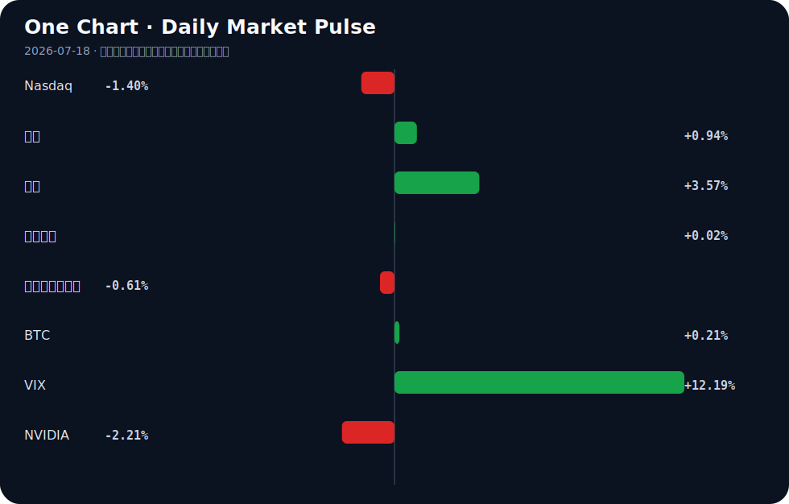

# Daily Intelligence
> 2026-07-18｜Saturday

## Today’s Thesis｜今日一句话
AI 产业正经历从“算力基础设施炒作”向“数据确权与应用落地”的痛苦切换，资本在硬件端的撤退与在内容/企业端的深耕将形成剧烈反差。

## ① Executive Summary｜30 秒
- **AI**：硬件与芯片端遭遇抛售与估值重击 [A17][A14]，但数据端（Patreon 封禁爬虫 [A1]）与应用端（浦发企业智能体 [A2]）的护城河正在加速构筑。
- **商业**：流媒体巨头以重金垂直整合 AI 制作管线（Netflix 5.87 亿美元收购 [A5]），内容生产成本结构与版权范式被根本性重写。
- **宏观**：全球央行路径显著分化 [B2]，避险资产（黄金在 4000 美元获支撑 [B4]）与低估值市场（全球资金战略性配置中国资产 [B5]）同时受到青睐。

## ② AI Daily

### 内容平台的数据确权反击战
**What Happened**
Patreon 宣布封禁 AI 爬虫复制其平台内容，明确表态“创作者理应获得补偿” [A1]。

**Why It Matters**
这标志着高质量人类数据从“无主采掘”向“主权资产”的范式转移。当公开互联网数据枯竭，闭源且受版权保护的平台数据成为大模型进化的唯一高质量养料，数据确权成为生存问题。

**Second-order Effect**
高质量人类数据稀缺 → 通用大模型面临“数据墙”性能停滞 → 合成数据或授权数据价值急剧上升。

### 从“能对话”到“能办事”的智能体跃迁
**What Happened**
在 WAIC 2026 上，浦发银行展示企业级 AI 能力，强调让 AI 从“能对话”走向“能办事” [A2]；同时，行业探讨智能体进入物理世界，指出个体能力将被十倍放大，但面临三道必答题 [A9]。

**Why It Matters**
大模型竞争正从“通用闲聊智商”转向“垂直场景执行力”。金融等强监管领域的智能体化，意味着 AI 必须从概率生成器转变为确定性工作流引擎。

**Second-order Effect**
软件智能体接管业务流 → 替代传统 BPO 与人工操作 → 智能体在金融/物理世界犯错时的责任归属与监管冲击将激增。

### 硬件退潮与内容整合的剪刀差
**What Happened**
AI 芯片股遭遇抛售 [A17]，国内 AI ETF 及重仓股显著下跌 [A14]；同日，Netflix 被披露支付 5.87 亿美元收购 Ben Affleck 的 AI 公司 [A5]。

**Why It Matters**
资本市场正在对“卖铲子”生意重定价，而产业资本正在向“用铲子挖金”的应用层加速集中。流媒体与 AI 动画的结合（如 Disney Jr. 与 Animaj 合作 [A16]）显示 AI 已深度嵌入生产管线。

**Second-order Effect**
算力硬件估值回调 → 产业资本转向应用层并购 → 科技巨头通过收购垄断 AI 原生内容管道与分发权。

## ③ Business Daily

**消费/媒体**
Netflix 斥资 5.87 亿美元收购 Ben Affleck 的 AI 公司 [A5]，Disney Jr. 联合 AI 动画公司发布新作 [A16]。好莱坞与硅谷的边界彻底消融，AI 不再是后期工具，而是前置的创意与生产基础设施。巨头通过并购将 AI 制作管线内化，旨在将内容边际成本压至极低，但这也将引发创作者群体的强烈反弹与议价博弈。

**金融**
浦发银行在 WAIC 2026 推出企业级 AI 智能体，实现从对话到办事的跨越 [A2]。金融业的 AI 落地痛点不在于模型参数量，而在于对齐内部复杂规章与系统 API 的能力。谁能率先跑通“意图-调用-确认-执行”的闭环，谁就能在零售与对公业务中实现人力结构的根本性优化。

**制造**
MAIRE 在 Microsoft AI 和 Autodesk 中落地 100 多个用例，重新定义全球工程 [B3]；3D 传感制造商 Orbbec 在越南设立制造中心以强化供应链 [B7]。制造端的 AI 正沿两条路径演进：一是虚拟端的数字孪生与生成式设计，二是物理端的供应链地缘分散与自动化产线加固。

## ④ Macro Observation｜机制分析

**世界正在发生什么？**
全球央行路径进入深水区分化期 [B2]；AI 芯片等高风险资产遭遇显著抛售 [A17][A22]；与此同时，全球资金出现战略性配置中国资产的迹象 [B5]，中国高层在 WAIC 强调 AI 普惠与全球合作开放 [A7][B9]。

**为什么发生？**
核心机制是“增长稀缺下的政策分化”。美国因通胀黏性与加息担忧 [B4] 无法轻易宽松，而其他经济体面临下行需降息，导致汇率与利差剧烈重估。在科技侧，前期基于“算力永续增长”的硬件估值严重依赖宽松流动性，利率预期一旦动摇，叠加盈利兑现期滞后，反身性抛售即刻发生。

**资本如何流动？**
（推断）资本正呈“杠铃式”流动：一端涌入避险资产与久期资产（黄金突破 4000 美元支撑 [B4]，美债收益率下行 [Signal Dashboard]），另一端寻找低估值与政策确定性洼地（中国资产 [B5]）。中间地带的高估值科技股被抽水。

**接下来关注什么？**
需严密监控央行分化是否演变为流动性冲击；验证中国 AI 开放叙事 [A24] 能否转化为实际的外资流入数据；观察 AI 硬件抛售是否引发信贷紧缩与科技行业裁员螺旋。

## ⑤ Signal Dashboard
| 指标 | 最新值 | 今日 | 信号 |
|---|---:|:---:|---|
| [Nasdaq](https://finance.yahoo.com/quote/%5EIXIC) | 25,520.24 | ↓ -1.40% | 风险偏好降温 |
| [黄金](https://finance.yahoo.com/quote/GC%3DF) | 4,023.00 | ↑ +0.94% | 避险/通胀对冲增强 |
| [原油](https://finance.yahoo.com/quote/CL%3DF) | 81.77 | ↑ +3.57% | 通胀压力上升 |
| [美元指数](https://finance.yahoo.com/quote/DX-Y.NYB) | 100.75 | → +0.02% | 中性 |
| [十年美债收益率](https://finance.yahoo.com/quote/%5ETNX) | 4.54 | ↓ -0.61% | 利好久期资产 |
| [BTC](https://finance.yahoo.com/quote/BTC-USD) | 63,923.65 | ↑ +0.21% | 中性 |
| [VIX](https://finance.yahoo.com/quote/%5EVIX) | 18.77 | ↑ +12.19% | 避险升温 |
| [NVIDIA](https://finance.yahoo.com/quote/NVDA) | 202.81 | ↓ -2.21% | 风险偏好降温 |

## ⑥ Deep Insight

市场正在将AI芯片股的抛售[A17]与AI ETF的下跌[A14]解读为AI产业泡沫破裂的先兆，但这可能是一个严重的机制误判。非共识的视角是：我们正在从“算力霸权”时代迈入“数据确权与执行智能体”时代，硬件端资本的退潮恰恰是AI价值链重构的必然结果，而非终结。

当Patreon封禁AI爬虫以保护创作者权益[A1]，当Netflix花费5.87亿美元收购Ben Affleck的AI内容公司[A5]，当浦发银行强调AI从“能对话”走向“能办事”[A2]，当WAIC讨论智能体进入物理世界[A9]，这些看似孤立的事件在底层共享同一个机制：稀缺性转移与反馈循环的建立。大模型的能力已越过“可用”门槛，通用算力堆叠带来的边际收益正在急剧递减，而高质量、未受污染且具有版权保护的人类原生数据成为了新的约束边界。Patreon的防守与Netflix的进攻，本质上都是在圈占这层新护城河。

这里存在一个关键的反身性反馈循环：平台封锁数据 → 通用大模型面临“数据墙”导致性能停滞 → 专属领域的精调数据与授权数据价值暴涨 → 更多的平台有动力封锁数据以索取高额授权费。这种反身性将使得数据从“采掘资源”变为“主权资产”。

同时，AI从对话走向办事[A2]并进入物理世界[A9]，意味着容错率从“文本幻觉”降级为“物理损失与金融风险”，这要求模型必须基于高度受控的私有数据（如银行风控数据、工业运行数据）进行对齐。如果高质量数据被平台方系统性封锁，通用模型将无法跨越从“聊天”到“办事”的鸿沟，这反而会赋予拥有独家数据资产与场景的企业绝对的定价权。硬件抛售[A17]与内容/应用端重金投入的反差，正是资本对这一约束转移的定价。

反方观点认为，算力永远是最硬的通货，合成数据技术的突破将绕过人类数据墙，而芯片股的下跌仅仅是宏观利率预期和高估值下的技术性调整，并非产业逻辑的根本切换。只要算力足够廉价，模型就能通过自我对弈无限进化。

证伪条件：如果在未来6-12个月内，主流大模型在未获授权的人类数据上仍能仅靠合成数据实现代际跃升，且版权保护在法律和实操层面被彻底击穿（即爬虫封锁完全失效），那么“数据确权与护城河”的逻辑将被证伪，算力霸权叙事将重新主导市场。

## ⑦ Tomorrow Watch
1. 验证浦发银行企业级 AI 智能体在 WAIC 闭门会后是否有实际业务 API 接入量数据公布 [A2]。
2. 追踪 Netflix 收购案后好莱坞工会（如 SAG-AFTRA）对 AI 制作管线替代人工的官方回应或抗议动态 [A5]。
3. 观察富国银行上调全球增长预期后，下周主要经济体 PMI 初值是否印证其“央行路径分化”的判断 [B2]。
4. 监控 AI 芯片股在大幅抛售后，是否有龙头公司下调资本开支指引，确认“螺旋式调整”是否深化 [A6][A17]。
5. 检查 Patreon 封禁爬虫后，其平台创作者新增订阅或收入是否有短期异常波动，以测试“数据护城河”的商业强度 [A1]。

## ⑧ One Chart

VIX 指数单日飙升超 12% 与 Nasdaq 指数下跌及 NVIDIA 走弱在时间上高度重合。这反映了风险偏好收缩时，前期集中度极高的科技头寸被优先平仓的流动性机制，但相关性的同步崩塌并不直接等同于 AI 产业基本面的瓦解。

## ⑨ Quote of the Day

> “In the short run, the market is a voting machine but in the long run, it is a weighing machine.”  
> — Benjamin Graham

**中文理解**：短期市场反映情绪和投票，长期市场会回到基本面和真实重量。

**Why it matters today**：这句话不是装饰，而是今天观察 AI、商业和宏观变化时的一个思考框架：先看机制，再看价格；先看约束，再看叙事。
## ⑩ Action Items｜今天值得思考什么
1. **追踪**数据封锁趋势：除了 Patreon [A1]，评估哪些拥有高质量专有数据的平台（如垂直社区、金融机构）可能成为下一批封禁爬虫或出售数据授权的标的。
2. **验证**智能体执行力：剥离通用大模型的参数内卷，重点检验金融 [A2] 与制造 [B3] 领域 AI 智能体的工作流闭环成功率与错误恢复机制。
3. **比较**估值与并购倍数：对比 AI 芯片硬件公司的下行估值与 AI 应用/内容公司的并购倍数 [A5][A17]，寻找价值链重构期的定价错位。
4. **关注**央行分化外溢效应：监控欧美与亚太央行政策差 [B2] 对跨境资本流动及新兴市场资产（如中国资产 [B5]）的持续影响。
5. **思考**物理世界智能体的责任边界：当智能体从数字走向物理 [A9]，现有法律框架下“机器办事出错”的赔偿责任主体应如何界定，这将是限制其渗透率的上限阀门。

## 信息边界
本报告事实部分严格限定于用户提供的 2026 年 7 月 17 日至 18 日的聚合新闻源。宏观与市场数据（如 Nasdaq、黄金、VIX 等）的最新值与日变动均基于给定表格，最近交易日推断为 2026 年 7 月 17 日。报告中关于因果机制、反身性循环及资本流动方向的推论属于基于事实的推断，并非已确认事实，需后续数据验证。部分新闻源为二手聚合，重要判断请读者回到原链接验证。

## Sources

### AI

- [A1：Patreon Blocks AI Crawlers from Copying Content: 'Creators Deserve Compenstion'](https://petapixel.com/2026/07/13/patreon-blocks-ai-crawlers-from-copying-content-creators-deserve-compenstion/) — Hacker News · AI
- [A2：WAIC 2026丨浦发银行打造企业级AI能力 让AI从“能对话”走向“能办事” - 新浪网](https://news.google.com/rss/articles/CBMickFVX3lxTE5GRGVJeWhiWXpaMndCajQ0S2lQMmpqTkVLWjVvcHpuVnB5T1hVcHluS0FiR0pUcF9UUFNzQ0o3Y1FYa3FjVHFhUUk2VkI5bWhWUDRjSkJEY3Z4NDFkU3NuREg5NnVrUWRGSWt1WEFpeklZZw?oc=5) — Google News · AI 中文
- [A5：Netflix Paid $587M for Ben Affleck's AI Company](https://www.hollywoodreporter.com/business/business-news/netflix-price-ben-affleck-ai-company-revealed-1236651217/) — Hacker News · AI
- [A6：华泰期货：科技股呈“螺旋式”调整，关注AI大会 - 新浪网](https://news.google.com/rss/articles/CBMickFVX3lxTFBSWmxrUVlxb0RaeXZfR1JjV3N2U3RYU09xNFk5X3NaNU1pUG1vbGlWbnZLbUdaQ1BEc2FmVGZVNnY5dkRIa2ttaWRhUHg0NGRJSTNQNU11Zk5lMkZqNF90YUFPZkt6NUM3MVhLVVpzZ2w3UQ?oc=5) — Google News · AI 中文
- [A7：人工智能是普惠的，中国拿出大国格局，打造全球科技合作策源地︱未来・♾️ - 第一财经](https://news.google.com/rss/articles/CBMiVEFVX3lxTE1VTTNHRXF4a0ppX0FWT3loWm4xWjFKeVB4N0QtZk80ZVpNWl8zcXF0QUJ5NThmWkd4MzZVaHdRcXVRYUpNVUF5Nk1POXVsSnJ2V3Jmcw?oc=5) — Google News · AI 中文
- [A9：直击WAIC | 当智能体进入物理世界 印奇：每个人的可能都将被十倍放大，但行业仍有三道必答题 - 新浪财经](https://news.google.com/rss/articles/CBMisgFBVV95cUxQNFN2SmJSZExpSjBlcXNNcmtpTkZtZ0UwazVyZ0VXV0lEU1llbklKZEp6UnVKN0FPUlVnQ3dJZnowUlA0dnRIYm5LaTlkR2xrOFlUM3pXLTh0Mzkxb2tDdG9kLWdBS2RyU0ZOaDl1TXBsNTFycThhSzdtOWRneHAxME1iY1VERWdVaWVfYWFTM3hFU2ktaEpudVluajlDQmQ5RmdCcGdzSmlmempnVUVMcFV3?oc=5) — Google News · AI 中文
- [A14：AI人工智能ETF平安（512930）开盘跌0.85%，重仓股新易盛跌4.53%，中际旭创跌5.00% - 新浪网](https://news.google.com/rss/articles/CBMickFVX3lxTE1GanNNbEYzeFM5bDM0ZEp3ZWxEV0hrOGJjN0lRV3paTTN1V0htVjEzNTVkMi1KbUFkR1NfTDQwTWhvY1NzRVloSXhiYWN5NDhKRjE2ZER4dXMyclZWZXVnYmlSZWJBVld0N05va1NmQUphZw?oc=5) — Google News · AI 中文
- [A16：Disney Jr. & AI Animation Outfit Animaj Release 'Ozzy Fox' on YouTube](https://www.cartoonbrew.com/series/disney-jr-animaj-ozzy-youtube-264646.html) — Hacker News · AI
- [A17：What to know about the AI chip stock selloff - ABC News - Breaking News, Latest News and Videos](https://news.google.com/rss/articles/CBMieEFVX3lxTE5GcUlkUFAwT18wNHdSZ0NyOEdqcXVwODNVZ1JFWDNKa1Jpd2dSNkdDcW90R1VNMHJXS3ZyRGsxRVFHWjk5TklrZ2M0ZDREckpXY09hckFZbEhfb1lKek1zWlhCQjhXRThyN0cwcE1ZNmZBc0RudXktN9IBfkFVX3lxTE44MWExZWpUamhhZlplNDVkdFlBSUJlNUZqVDE0Y3BPNUtta19CTUprVGZQYUlQMk16YTdsRGRFQWZRQ2JxYnltZjhOQUJ1MVhPbVFwbnpZeG5rWk9aOUIyZE8yY0l1REFwcUtvT1d6Nl81SjVZMVlwc1I2N0kzZw?oc=5) — Google News · AI
- [A22：S&P 500 Posts Weekly Decline Amid Worries Over Artificial Intelligence, Middle East - Moomoo](https://news.google.com/rss/articles/CBMioAFBVV95cUxQbHo0bHU3SDZBMk5Qd1dpcUlVZEViOE5NQnRYUzFKQ1gtSWRVUFBLVW1xSEx6Snc4Y0RvTFgydWxBT3BHaFdXN0RJWG1UR0lWOGlYT1VucnRyUENZeFpNbVduZ0s3UFJyNHM0WGVNUzE0eEVTanl3bkJsWFpYTkt0MmxkYjd0d2g4YkVBbkRmczNDSUVzSFdXZFdqMUVIVmRa?oc=5) — Google News · AI
- [A24：Xi Jinping of China Pitches ‘Openness’ in Push to Shape the Path of A.I. - The New York Times](https://news.google.com/rss/articles/CBMid0FVX3lxTE5EamIzaWIydk9pVTBlZmx5VTdoYUd1dUVSSGJPRzIxdzhEQjBUclRfejFpZDFKSWU1cFk5NzVTR0dwXzg0MWMzbEhzdEt3N0p3RnJMenR2XzVfMzNTRXI1bm5rRFF1YzlhQUl4U20tR0QxaW04blhr?oc=5) — Google News · AI

### Business & Macro

- [B2：Wells Fargo lifts 2026 global growth view, trims inflation as central bank paths diverge - VT Markets](https://news.google.com/rss/articles/CBMizgFBVV95cUxOLVdwczFXM2t4ZFFLQVpxeXg3azZ2dWVFYWh4SFpyRmdHRWROdm1fSExNaXRIQWxmUmtrXzg3di10VzFMWmVRVVdlLVR2bDV1cWZRVlotZU1VWXpwMmdGVnFBazBKYnBZekVDUUxvTHA5X3dvZ3ppZUd3Sld0cDd2SGpXemJpMWRGX1h3TWIwVXVFLU5XRFN6YlRjRzk4VjFVNWZaQTBud2pQb2RGR0JfUmFyN09zWjM4OEJkYXZ6TDF0Zm1vR2JTZ0c3YUY0UQ?oc=5) — Google News · Markets Policy
- [B3：MAIRE redefines global engineering with 100+ use cases in Microsoft AI and Autodesk - Microsoft](https://news.google.com/rss/articles/CBMif0FVX3lxTE92aEZBTWtLaDZSZDhqOC1nVEstbEx0TnJhQU9OZGxMMHRreWpvV2VxZ1hremxRZUZkWUxEVHVnbjYyRWlCWXZ0cFJxemIzaXFIRWYwamRvVC0wMFRPT2ZFdWlYTFZWOUFaUVBYem9DU0FlSlF0MzczSWRyZUg0U3c?oc=5) — Google News · Technology Business
- [B4：Gold Price Support at $4,000 Amid Fed Rate Hike Fears 2026 - Discovery Alert](https://news.google.com/rss/articles/CBMihgFBVV95cUxObjZpOUFCTGYzNThoUlJtS3RQRzBDbml0bzZuVlhJalB3RGRfT1RyVXl0dmpfS2JLVC1jdzVZaEtrUGZENTFIVjBBUTdnSlI2TVhnZzVNSDJtdnR1MkVOUzJMVEdrZVBnZUN3ZVMtQ1BwQ053cjBJZGV0d1ZwcFpDdWVWMEIzdw?oc=5) — Google News · Markets Policy
- [B5：中信建投 | 全球资金战略性配置中国资产 - 新浪网](https://news.google.com/rss/articles/CBMickFVX3lxTFBIQU9nNlNsekUwcWtsMUhibl9JZWY4TVhyaGMtMGtIVmpKc2ZpMXJzTFlDY2dNdXVtYXNSZzRFZEJhcnllcXh5emM4OU41UTRNV2UybnRnTGhqWnZoRU5hMnJaZHhXdjJjWG9qbEFNbVd6Zw?oc=5) — Google News · 行业
- [B7：Orbbec sets up Vietnam manufacturing hub to strengthen global supply chain - Indiatimes](https://news.google.com/rss/articles/CBMi7AFBVV95cUxOUlExUWZuUUJMRFBXM3BKcmM4clRIbkp2U0c3MWtsemROMjZ4Nm1RWlQxNFFKUlY3VXhONTJCR1lhQmFxbFN6MmREVHRHa2c3NWx4NUdlOGhpTHczOGNaTENlN19rZnd0eXA3NnNlczBHNFczV211N01yTjhXQ0NjajJUTFpoYnllMEFFUEhGWVhrVVo4V1l5R0liVld3T3psWGd3cWkxdmkyOWhYcnJLdlVxUGhTVVlrVU9yLWRaaHVEczdMNS1jRW9sNnY4QS1GNDNpa0dfQ1hPUl9KejlWWVg1c3FVbXZuSDBpUg?oc=5) — Google News · Technology Business
- [B9：China’s Xi calls for global AI order rooted in equity, cooperation - The Express Tribune](https://news.google.com/rss/articles/CBMirAFBVV95cUxQMktHUlUzWHZXeEp4Y3RCTURISXpuV1NqaEg3dGhhTFFubzFYVTktQ0lIQVlmdzZyN2RHSTBNT0tpU1B6bDhrc1ZpaEdYUW1PLXBFclcwM0lsSGh0aF8yMUhnNW9ESEtoSDZpcXJZcjR4NUhwYlZHQzBmS2ZaX1ZUTFE5QUp1Sl9Rdnpaaml4ZzV1TmFoZm1TRHdiWEVGVERTZXlNVnAtLWI1MkFa0gG0AUFVX3lxTE1vQkJOeHBOeUJralNtYVpfbmljQV9SRFE4X28wckFiRFh1ODBpbE0zZllGek9UV0Z0QXhJZElrVXVxbTI1OGo1YWJ6MU8yWDh4aE01S3VoY1M4TDVob3BBTjlreFVxMno4RHp3bmFFaFEwSVQ3b1BOYzh2QTNDQmxZTDROZzkyQkJQRUhpTDVYaHRFc19PUTdPM1BsN1NNTVpwcmhwamd2bC1zM3lNWXhIWHBDeg?oc=5) — Google News · Global Economy
