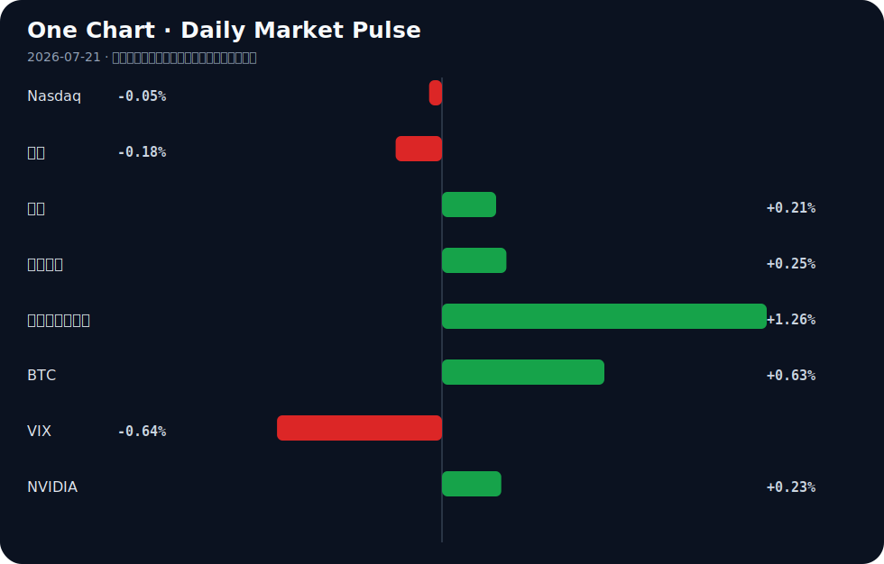

# Daily Intelligence
> 2026-07-21｜Tuesday

## Today’s Thesis｜今日一句话
AI 正从“通用能力演示”转向“受约束场景的渗透”，其经济价值的释放高度依赖基础设施（算力/能源）与治理规则的同步，而非模型本身的单点突破。

## ① Executive Summary｜30 秒
- **AI**：模型免费化趋势确立 [A22]，但生产力释放卡在工人技能与基础设施（如数据中心立法）[A2][A12]，具身智能开始进厂替代体力劳动 [A8]。
- **商业**：中国制造业以 AI 为新引擎对冲宏观放缓 [A18][B21]，但汽车等行业面临“海外热、国内冷”的结构性分化 [B3]。
- **宏观**：全球经济逼近急剧放缓 [B7]，套息交易在鹰派日银与干预风险下博弈 [B5]，产业政策从追求完美转向需要塑性 [B19]。

## ② AI Daily

### AI 模型免费化与生产力瓶颈
**What Happened**：强大的 AI 模型正被免费提供 [A22]，但研究指出 AI 生产力取决于工人而非仅靠技术 [A12]。
**Why It Matters**：模型本身不再是护城河，人机协同能力与工作流重构才是价值捕获点。
**Second-order Effect**：模型免费 → 企业 IT 支出重估 → 垂直场景集成商获利。

### 具身智能与 AI 的体力革命
**What Happened**：WAIC 展示具身智能抢进工厂，AI 从“能动”变“有用” [A8][A20]。
**Why It Matters**：AI 脑力革命后，体力革命开启，直接替代蓝领劳动力并重构工业资产可靠性 [B17]。
**Second-order Effect**：具身智能进厂 → 制造业劳动力结构重塑 → 机器人运维与保险需求激增。

### AI 治理与基础设施的约束
**What Happened**：全球南方寻求 AI 治理新选项 [A3]，佛罗里达立法限制数据中心对公用事业成本的影响 [A2]，联邦政府计划建大型数据中心 [A13]。
**Why It Matters**：AI 发展受制于能源成本与规则制定，治理不再是滞后补丁而是前置条件。
**Second-order Effect**：算力能耗激增 → 政策/电网约束收紧 → 核能/碳捕集等替代能源获增量需求 [B4][B15]。

## ③ Business Daily

### 制造
上海人工智能制造业增长 21.8% [A18]，AI 成为中国经济防硬着陆的新引擎 [B21]。海尔智家全面 AI 化或带来估值重构 [A11]，标志着传统制造龙头正通过 AI 渗透率重获定价权。

### 能源
算力需求推动能源基础设施演变。联邦政府拟建大型数据中心 [A13]，佛罗里达通过立法控制数据中心电费 [A2]。同时，德州推进核能 [B15]，重工业碳捕集技术加速 [B4]，储能系统甚至被用于导弹防御 [B23]，能源与算力的绑定日益加深。

### 自动驾驶
中国汽车工业在海外高歌猛进，但国内销量暴跌 [B3]，呈现典型的产能输出依赖。UKM 整合 BlackBerry QNX 课程培养自动驾驶底层系统人才 [B6]，暗示车载 OS 等软基建正成为下一轮竞争焦点。

## ④ Macro Observation｜机制分析

**世界正在发生什么？**
全球经济正走向急剧放缓 [B7]，但 AI 制造业和套息交易呈现局部高温 [A18][B5]。

**为什么发生？**
宏观信用周期见顶，但 AI 资本开支与套息交易（USD/JPY 达 40 年高位）制造了结构性分化 [B5][B21]。资本在总量收缩中寻找技术增量与利差套利。

**资本如何流动？**
资本正从传统内需（如中国汽车国内销量暴跌 [B3]）流出，流向 AI 算力基建（数据中心 [A13]）、边缘智能 [B24] 及对冲资产。产业政策从追求完美转向需要塑性 [B19]，以适应这种非均衡流动。

**接下来关注什么？**
套息交易逆转的脆弱性 [B5]。若日银干预引发套息平仓，风险资产将承压；同时需验证 AI 投资能否在宏观放缓中维持反身性正循环。

*(事实：穆迪预警全球放缓 [B7]，USD/JPY 在 162.40 附近 [B5]；推断：AI 投资可能对冲部分宏观下行，但若套息逆转，风险资产将承压)*

## ⑤ Signal Dashboard
| 指标 | 最新值 | 今日 | 信号 |
|---|---:|:---:|---|
| [Nasdaq](https://finance.yahoo.com/quote/%5EIXIC) | 25,508.07 | → -0.05% | 中性 |
| [黄金](https://finance.yahoo.com/quote/GC%3DF) | 4,005.60 | ↓ -0.18% | 中性 |
| [原油](https://finance.yahoo.com/quote/CL%3DF) | 82.66 | ↑ +0.21% | 供需平衡 |
| [美元指数](https://finance.yahoo.com/quote/DX-Y.NYB) | 101.00 | ↑ +0.25% | 金融条件偏紧 |
| [十年美债收益率](https://finance.yahoo.com/quote/%5ETNX) | 4.60 | ↑ +1.26% | 成长估值承压 |
| [BTC](https://finance.yahoo.com/quote/BTC-USD) | 65,100.01 | ↑ +0.63% | 风险偏好改善 |
| [VIX](https://finance.yahoo.com/quote/%5EVIX) | 18.65 | ↓ -0.64% | 市场稳定 |
| [NVIDIA](https://finance.yahoo.com/quote/NVDA) | 203.28 | ↑ +0.23% | 中性 |

## ⑥ Deep Insight
AI 的叙事长期被算法突破主导，但 2026 年的转折点在于：AI 的扩张速度已触及物理世界的硬约束——能源与治理。当强大的 AI 模型被免费开放 [A22]，软件的边际成本趋近于零，但运行这些模型的物理基础设施（数据中心）的边际成本却在急剧上升。佛罗里达州议员提出立法以确保 AI 数据中心不会推高居民公用事业成本 [A2]，这揭示了一个被忽略的机制：算力正在与民生争夺电力配额。联邦政府计划在萨凡纳河遗址建设大规模数据中心 [A13]，并非单纯的技术布局，而是能源禀赋与算力需求的妥协。

这形成了一个强烈的反身性循环：AI 繁荣 → 算力/能耗需求激增 → 电网与政策约束收紧（如佛罗里达立法）→ 数据中心选址与核能/碳捕集技术获增量 [B4][B15] → AI 发展路径被迫向低能耗边缘计算或受监管行业妥协 [A21][B24]。资本正在对这一循环进行定价：边缘 AI 软件市场因能缓解云端算力与能耗压力而加速增长 [B24]，而传统能源体系为了承接算力溢出，不得不向核能和新型碳捕集寻求解法 [B4][B15]。

同时，全球南方寻求 AI 治理新选项 [A3]，以及针对未成年人 AI 玩具的立法 [A10]，表明治理不再是滞后补丁，而是与技术平行的前置变量。当 AI 试图从“能动”转向“有用” [A20]，它必须嵌入受监管的专业工作流 [A21] 和物理制造环节 [A8]。这意味着 AI 的未来不取决于模型能有多聪明，而取决于社会允许它消耗多少度电、干预多少现实流程。产业政策若缺乏应对这种技术突变的“塑性” [B19]，将导致基础设施与前沿模型之间的错配，进而引发算力通胀或算力闲置。

反方观点认为，算法效率的提升（如模型免费化 [A22]）将大幅降低单位算力能耗，使能源约束被技术进步自然消解。此外，全球经济的急剧放缓 [B7] 可能自发抑制算力总需求的扩张，从而缓解电力紧张。

证伪条件：若未来 1-2 年内，单位 token 推理能耗下降速度持续快于算力总需求增速，且电网扩容无需政策博弈即可自发吸收数据中心增量，则物理约束论失效；反之，若数据中心电价成为核心成本变量并反映在科技巨头财报中，则该机制成立。

## ⑦ Tomorrow Watch
1. 验证 USD/JPY 在 162.40 附近是否触发日本央行实质性干预 [B5]。
2. 追踪佛罗里达州 AI 数据中心公用事业立法的后续审议进展 [A2]。
3. 关注萨凡纳河遗址大规模数据中心的环评与立项动态 [A13]。
4. 观察中国汽车国内销量持续暴跌是否引发新一轮内需刺激政策 [B3]。
5. 验证边缘 AI 软件市场在 5G 与工业自动化驱动下的季度增速是否兑现 [B24]。

## ⑧ One Chart

图表反映了各类资产在宏观放缓预期与局部 AI/套息热度交织下的定价分歧。十年美债收益率上行与 VIX 下行并存，显示市场在流动性收紧预期中仍维持短期乐观，但这并非因果，而是不同交易主逻辑的短暂均衡。

## ⑨ Quote of the Day

> “Plans are worthless, but planning is everything.”  
> — Dwight D. Eisenhower

**中文理解**：计划本身常会失效，但规划过程能让你理解约束、选项和应对路径。

**Why it matters today**：这句话不是装饰，而是今天观察 AI、商业和宏观变化时的一个思考框架：先看机制，再看价格；先看约束，再看叙事。
## ⑩ Action Items｜今天值得思考什么
1. 追踪 AI 模型免费化后，垂直行业集成商（如海尔智家 [A11]）的利润率变化。
2. 验证具身智能进厂对制造业劳动力成本的实质性替代率 [A8]。
3. 比较中美在 AI 基础设施上的政策约束差异（佛罗里达立法 vs 上海制造业增长）[A2][A18]。
4. 关注套息交易在鹰派日银下的脆弱性，评估其对成长估值的潜在冲击 [B5]。
5. 思考产业政策的“塑性”如何适应 AI 技术突变的非连续性 [B19]。

## 信息边界
本报告新闻来源覆盖中美英及全球南方主流聚合源，时效截至 2026 年 7 月 20 日晚间。市场数据为最近交易日收盘值。由于新闻多为二手聚合，重要立法与政策判断需读者回到原文验证进展。

## Sources

### AI

- [A2：Florida GOP lawmaker and governor candidate says AI data center legislation keeps utility costs down - The Washington Post](https://news.google.com/rss/articles/CBMi7gFBVV95cUxNNjBkQVEtOHRETXJURFh1aVEyeXJCUTR2NnpfcFVWSlRMWkV0V2VOUkV2TGZiWDItZDFfUmxoZnJqVVRIdXNpeWU4VGJlbTRnSnJhQl9xcVlKTlZwdmlCTnE0eVhiSlJaT2ZDaklXVjdzdHBGbnNmcXAweVY4YXdfT3BWN0ZwTEcwc3NRd0Nobm1KaWl1c0NCSHo0MDMySi1aRE03UnRRUm1fbmpleGRlQVpERjhBMEhOOUR5c2YxQ2Fad1J1Umg2NTRJLWJuaUk1dy1sUFhDdGRmM1VicDJQVnh4dEJGNWZpUnRhSWRB?oc=5) — Google News · AI
- [A3：全球南方迎来AI治理新选项 - 中国经济网](https://news.google.com/rss/articles/CBMib0FVX3lxTE9hSHdQTnlYaktGczJ3QWNmQm5KcXg1OWZJZFFzS2p1Qk9FNkwtak1UYnZlYmhPbm9Qd0dqcFQ5Sk5jNnlXZFNlc1ZMQ0hpTTI1aXNMck9vT2dheFNZZHp3ckQtUGl1cFRxT2hjU2Z2TQ?oc=5) — Google News · AI 中文
- [A8：直击WAIC｜具身智能抢进工厂，营销智能体重构工作流⋯⋯AI的“体力”与“脑力”革命走到哪一步了？ - 每日经济新闻](https://news.google.com/rss/articles/CBMiZkFVX3lxTE9ZaHFfbFg5cEVyTGZ3SGdVcWJielM2MTlYOVdIWTh5QzFwdW0xRHc5SGc3cGVua0dHcDZJOUFZbXVxQUhMbzhRSEZTYVJPY0NueTQxN2tsbm9xZjdVdFNNVjJ6SGhrQQ?oc=5) — Google News · AI 中文
- [A10：Rep. Blake Moore proposes legislation to regulate toys with artificial intelligence for minors - Cache Valley Daily](https://news.google.com/rss/articles/CBMijgJBVV95cUxNdUdJX1RLMWJ2cWRQVnVwc3lCNTR6SGxzbEJfSWlLX1NZQUpIc1YzN214eFF0Qkg2STA4NjhrMGtjc0FjcnRzbnpvS2FSVlFoNGdHbmhiLXo2ZUVkOUZpdVpZMXRnbXcwVWQ4dU9uUG9uQnpHMkZfYTZSVUczSXdzZUw0OUtjWWNBZF9NNTN3OWNhQ1pwTlRBVk9FWmdCOW9RLU93ZjktZHNBbzN0RTBTUWUzQ2hISGc3bGx3RU1sdktRUXFNdG5xMF9Ea1dLRHFCaENQRlQtUVJOZGNKUUVOaHY4NzNPdmRucUhqd1A4YUNIaFdaUGpvbHlmenFTM0xjV29UWnpybkpucFR4R0E?oc=5) — Google News · AI
- [A11：海尔智家全面AI化或带来估值重构 - 新浪财经](https://news.google.com/rss/articles/CBMisgFBVV95cUxNOUZtSGFwR3pIb2tqX1ZtVlVCeENYNUQ4Q0dmbnBpRUxYTmFwYTY2ZzJoZUFCRXhoTl84NEF2enIwMnFzb01PV0pvNktlZ1E1c05iSGJ1ZXdacWpqWFBON1hGUmNTZ1U1X2pNX3dfTW9LeU9LZ3d2YTdKZmdpZGQ1NTZjXzZPdDNHSjdKUVk3ZTU1TVFyaEZjb190QnZCenBVY2ZBZmhxc000cl8xRGx0MV9R?oc=5) — Google News · AI 中文
- [A12：AI Productivity Depends on Workers, Not Just Technology - ColombiaOne.com](https://news.google.com/rss/articles/CBMieEFVX3lxTE1lOWNSZ3J1MUdpR3R3dnRSTVQ0M2lCNTEtZHN5cWNKbWZ1QmhXblZ4akhDM2REM2xUQUtyYUxTbkstV3NuMEUzTnVJbFV1OWlNVXBqZHV3MGxXOWs5X09qSE44VXVfWEpIV3dlSDlna2JPSEE5ci1weA?oc=5) — Google News · AI
- [A13：Feds look to build massive data center at Savannah River Site - WRDW](https://news.google.com/rss/articles/CBMimgFBVV95cUxQdDNUcGg5dzBfV3o5NWNpTXRGVi1VQTBwcmVOd3Fmd2NlRE5GWDNKSzFpVmRrcVZfRTJtS2JVdTFGMUxqUXFpZ3JvRHVBN1plb2ZYX2o1S0RxM01aVGt5a0RrNjRRSENHV3Ftd294RW9jSUZBRUNyX01BSGR3QjNVY2lFOVZYRV92d1AyaTNCaVdaTS1MWVRya2ZR?oc=5) — Google News · AI
- [A18：上海人工智能制造业增长21.8%，在WAIC现场找到原因 - 第一财经](https://news.google.com/rss/articles/CBMiU0FVX3lxTE81LVdndnpycndOcUxLdFBINmgtRjI1ZXB3cHNYNEtDSzdGZFJTLU1uRGlIaTY1Si02UXp5TWtDNV9Bam1ZYW5ya2lGdVE5bHFFOWNZ?oc=5) — Google News · AI 中文
- [A20：看见未来！人工智能要从“能动”变“有用” - 新浪网](https://news.google.com/rss/articles/CBMif0FVX3lxTFA3NmJWSGpSUW1XMXBtUm1YZmtxWnQweDJRUjB4N09fZ1M4RG9oZWZhcUplZURwa3F3LW9abzhoTTlnakJoSm4tNlNqX1pEOE9vaHVScWdIRDFpTTcxem91dUNJbkJfaE4tLTY2eVUzZ0c2dk9MY0NJTnV2NGZpM2c?oc=5) — Google News · AI 中文
- [A21：How AI Is Reshaping Regulated Professional Workflows - Emerj Artificial Intelligence Research](https://news.google.com/rss/articles/CBMie0FVX3lxTE5WcmZUSGQ5OEo0cDdCLTc0YmR0RWVmeDNrd3IzbXFiUVU1SnpfVGVFdm1aeGswaVRXakVPd1lYU1lKbFRvM0ZLX1Mxc3ZUMl9FN1doX19ZNTh6VVBMX25ZcUxKVGJTU3V6R3o1b3g4TlQ2MVU4bV94YlhlZw?oc=5) — Google News · AI
- [A22：Opinion | Powerful AI models are being given away for free. It was inevitable. - The Washington Post](https://news.google.com/rss/articles/CBMipAFBVV95cUxPNHlUS1laU3VseHk2MnRaREdWLXgzRWo1alVmTWdZZlRWWkNtUTVLcDZpaEt5RU9VUWJPVzNVSUJaeENLbEtBX3dpMHFyOGlRb0xVbHdxd1o1cmJjUlU4bXl6MVZnaVotcjNpN2stcllxVXktVm5wT0JWaXVTQVNKbllDbFFNcW44ckFpc2RLR09QSDZTMzEzVjhMUU1VazlLc0dRbQ?oc=5) — Google News · AI

### Business & Macro

- [B3：China’s car industry is on a tear overseas. So why are sales at home plunging? - South China Morning Post](https://news.google.com/rss/articles/CBMiygFBVV95cUxONGU5YkJyc09jRHlDTXlhQ0lzNC1jQjB3N0pIUzhNSEFoQjZ6dzFSMmNuTWhNLTVJc3ZsQ1JkdlhwaEhmMmRjbURUVkx0Z3BjcG5NdExPcUp4STlWb0p5ZXdNUEVBTEd6WjI4Xy1YRm9kdEJVUklJWUV0MFg4VkM0cjhaVng2R1dqNDJidjRnVHdFSXhKbmhTNTlwNmJhUWNLdDFFWlR4V1M2TzRKa2ktVG5FNzQ3anBIZzJPTmRJdzlONGF6YVFidUJB0gHKAUFVX3lxTE40ZTliQnJzT2NEeUNNeWFDSXM0LWNCMHc3SkhTOE1IQWhCNnp3MVIyY25NaE0tNUlzdmxDUmR2WHBoSGYyZGNtRFRWTHRncGNwbk10TE9xSnhJOVZvSnlld01QRUFMR3paMjhfLVhGb2R0QlVSSUlZRXQwWDhWQzRyOFpWeDZHV2o0MmJ2NGdUd0VJeEpuaFM1OXA2YmFRY0t0MUVaVHhXUzZPNEpraS1UbkU3NDdqcEhnMk9OZEl3OU40YXphUWJ1QkE?oc=5) — Google News · Global Economy
- [B4：The new carbon capture method stepping up to tackle heavy industry - The World Economic Forum](https://news.google.com/rss/articles/CBMitwFBVV95cUxPaWMwZUtRRDJwM3RFaEdzcVhLUTg1bmsxa1FURlJocXpuUy1kSW12akRQRUk1WFRBXzR4S0JneFVneUY5RGp2Z1NTS1FaT1NOTWpzUUY2dTVoV0tVdmxzQjFOZXRYOGYtcHRyYWhVWms0bkNpSEh6V2VNTkh3a1NjNHFrWThTdy1mM1lCRHlUam9SNVRKSzNQdWJrSmhzYm41WGJPRzV0Umg5M2k1WjBya21Ka21ZRGc?oc=5) — Google News · Global Economy
- [B5：USD/JPY Grinds Near 162.40 at a 4-Decade High — the Carry Trade Battles a Hawkish BoJ and Intervention Risk - TradingNEWS](https://news.google.com/rss/articles/CBMifkFVX3lxTE5vVXMxeHpuZUZzNDVSbjEzUzhIMGtkY05PZV9XeHh4Y2wybTd4ZlJYbV9jMng4SU9iS1FUem1ObkI0aUZVYVQ5dHhFWUswOVZWbVJVRVoyWGk1MU82MmxmTFdNY19NVXNyblhfclA4TnNiYmdvbk1LTGctaW12Zw?oc=5) — Google News · Markets Policy
- [B6：UKM first in ASEAN to integrate BlackBerry QNX curriculum, targeting future-ready tech talent - Indiatimes](https://news.google.com/rss/articles/CBMigwJBVV95cUxPYm9rNnRDM0dudkdOTXZvQnc2RURyRDA5X0RLRTBHa1RYMHIyTEwtdy1GVGp1alRNelZYYTY2V3U2ZGFFR3dFVE9MeHdVQWdEb1piVEdzMF9CZFROblFjMG1ZM29PaVhOb1RxS0FHSklzQXBVdWsycHAtOUt0T3BlWVNuRGZUVHUwMTd2WDZ3QmswX1oxaW9jNVhfd3AxOXByNDlVZXBEVDFRTS1IYWQ2TVVWaF8yVXVtN19NcDdjeEg4a2gzOGlSLXFIZW5QOEJEYjk0cVBtQTRsYkJPVGRwOGhzdXJpWHR5NDhka19qNV9QU0wxR3p6SmV1NDVHcFItSjhJ?oc=5) — Google News · Global Economy
- [B7：Global economy tipping towards a sharp slowdown, India 'may lose a step' too: Moody's Analytics - MSN](https://news.google.com/rss/articles/CBMi2wFBVV95cUxQOGdwdzBnTGxwUzFjMFppN3Y2empVTllIUkUyam1iOEdtWkR5SU9MWnVqM0dZUnRWbEViSS1GTFNYTFF4ODY4YWRhRFFBQjY3WkFUS1Q1amlidGJjMkpKRjJtdUp5YlNuZkpMQU5kRV91VU41MXNwU1R2RnBKUHM5dXBQWkt6dUQ0QkRObFVLdTFyRUd0RHpkQnVQZFFnXzZ1Qk9qeVYwcklwMldjZHVmUHI3dFJ3ZjN3V3lVZmdWQTk0STJpRUk0T0U5VGhxYS1MQzdheUdGd2tZX0U?oc=5) — Google News · Global Economy
- [B15：University of Houston Joins Texas Nuclear Alliance to Advance the Future of Nuclear Energy - University of Houston](https://news.google.com/rss/articles/CBMiiAFBVV95cUxOX216Y1JOSEhNQjlpZGxuSWpwanJsYXpsR1ZLTjRvc0JIQV9XUGtVMkNZMGZoaFAwelYxbEZOUTJaalhLUWNhN3JXN3lEVEZsdVR4WngwZ3hsQ0tucERLdzgxWWJJbHpKMS1XV3NIQzNZVVpoVTBQVnpTcTNEY3N5SUxxamZKZE1v?oc=5) — Google News · Technology Business
- [B17：Plant.Digital Selects Quest Global as a Strategic Partner to Accelerate AI Driven Asset Reliability and Integrity Across the GCC Region - PR Newswire](https://news.google.com/rss/articles/CBMingJBVV95cUxQVWp4bnQtWURmbndoSV9BWWY1YTFRZnRVRVhRTEtjV2EzRmQ1VUpWX2MzVTVHU0gwZVAxYmxlM0FRQVN4UlM2MFduYW1aZEdfREF0UnpPXy1SMlR3aU5xMUI2aEE5a0d3Mk1BZXkxNldvNFFKT2RibUtJMVQxUEktOWk5N29Sd1RYZDJFZGhLUTBqU18wZTh2dkV2eTN2TnlvSi05OTl5SzdkaHN1eHFVTTMySTVxbXc5YUZiY0stRElqQnI5YV9GTzRnUUtjXy1LSXYxSnlXUURZWV8zWE5jd3VxVjBIMlBFNzRwV1FJUVFEd0NtMW1SY2NOUlJzOTNSVUV6YnVwVFFaeC1ZMmpKeEhjeHAzVG5lOXJoRDlR?oc=5) — Google News · Technology Business
- [B19：Industrial Policy Needs Plasticity, Not Perfection – OpEd - Eurasia Review](https://news.google.com/rss/articles/CBMimgFBVV95cUxQdTlVMUJVSE5xaWFmNXZyWHNQN2xnTWFwbGt0bFptNjhxZE9QT2Vtd05TbEd1LU9QNTF1Tlo1U01ROGR2T09ONXpsaFBBZXVHM0d4U04wbl9ZOGtycUZiWkRjd1B1NjRKdkhFR1lTRDhWeXJVeG9fY2ZadE5sODdSenQ0eW5pV0tqZ1VOU3dsVGwzaVg2NDlWaUZB?oc=5) — Google News · Global Economy
- [B21：AI is ‘new engine’ keeping Chinese economy from harder landing - Taipei Times](https://news.google.com/rss/articles/CBMidkFVX3lxTE1zbXVmRGtSWkZIN0VvejBCeEFLTHFleHJWZW1jMWh5ZjkyUUZObE50UDR4WU84Y0U3X1Nfa0haeWoxU0JNN3RneUFsaksyN3dob2lXVzlja0xheEhyZi1mQVlraEZiSHlqYkpmNFhvTWljSTB5ZUE?oc=5) — Google News · Global Economy
- [B23：US-Based Innovator in Energy Storage Selected to Power Missile Defense System - The Well News](https://news.google.com/rss/articles/CBMitgFBVV95cUxQYkFMclRON05GbHhTZjlIN3paYzRON2tCTDM3dFcxS2lhRXdNcExUeUF5b0hyTEZhZXlFdDVBU0dLOTdaMXB6WGxqcHNRZTR2TGRtY0M4aWRpRmg5dWl0bG5kRkJzZzlXNGUzT3p0d01vU3Bwd0RPNWQxS1Vuc1VNclNNS3pGVktLS0pvLTdtUERFNndfZFRjZC1DaWhSN0xlaF90a1RpNTdhNmdudHh6TDRrOHZKdw?oc=5) — Google News · Technology Business
- [B24：Edge AI Software Market Growth Accelerates as 5G, IoT and Industrial Automation Enable Real-Time Intelligence - GlobeNewswire](https://news.google.com/rss/articles/CBMikgJBVV95cUxQUFgxTXZvTmV6aFZnbmhvelowYUR2Smo2TEcxMUlVRXUtMWMwNkg0RU5xMUhTVFhFSnkyeUIzbmZ2STVGeEhubWNHbTdEVkU0bGFfdVdjN1dRVV9WU1FNTkIyYjZpcW13V253bUVNajZROWx6a3NjTnJaUUdYOURCSnp1dXZ6VzB6T3ZMUDZsSGlSQzZkMUVVMUxKU0JWaFltek5TcjIybzdta2Q2d3duVWpidkNOYXdBdVdlY1B0alhESUo0c1k3Si16Znk1SUtqSmlqS2YwOFlyby1fNm82MWxTQUhPY05WTzNmZFRqVTVnbnJNQU5zekwzd1pWNlhtbUVhNmZhMWJ6T0ZUc1lGTG1n?oc=5) — Google News · Technology Business
