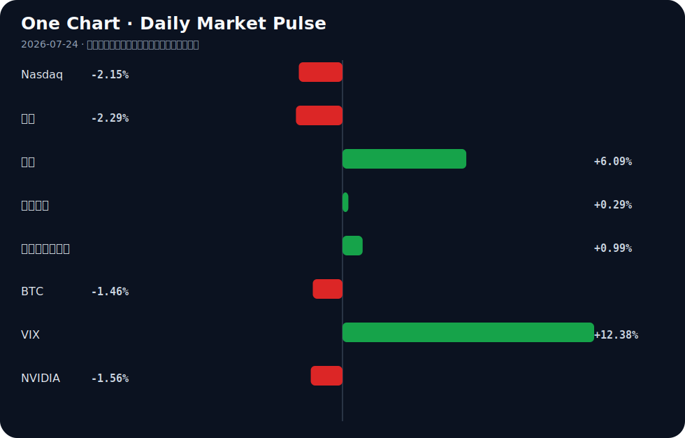

# Daily Intelligence
> 2026-07-24｜Friday

## Today’s Thesis｜今日一句话
AI正从无约束扩张步入分级治理与成本审视的摩擦期，宏观紧缩将加速淘汰缺乏实体产业支撑的纯叙事标的。

## ① Executive Summary｜30 秒
- **AI**：AI滥用催生中美分级治理加速，教育界与立法机构开始划定红线，合规成本正重塑行业门槛 [A5][A8][A12]。
- **商业**：低空经济与全球工业扩张提供AI之外的实体增长叙事，特斯拉碳积分收入暴跌67%凸显旧模式失效 [B2][B19][B20]。
- **宏观**：美债收益率攀升与原油大涨叠加，去美元化与关税预期正重塑新兴市场货币与全球资本流向 [B16][B22][B8]。

## ② AI Daily

### AI滥用与治理的反作用力
**What Happened**
美国青少年因使用AI生成未成年人色情图像被起诉 [A2][A16]；美参议员提出AI与数据中心监管议程 [A8]；中美均推进AI分级治理（美教育机构设AI使用分级 [A5]，中国专家提分级治理方案 [A12]）。
**Why It Matters**
无约束的生成能力触达社会伦理与法律底线，迫使制度机器启动。治理不再停留在原则倡议，而是进入操作层面的分级与定罪。
**Second-order Effect**
监管收紧 → 合规成本激增 → 中小AI应用开发者出清，市场向具备法务与算力冗余的寡头集中。

### AI资本开支的宏观挤压
**What Happened**
Google和Tesla股价因AI支出震动市场而暴跌 [A18]；业界开始探讨“Moving beyond the GPU” [A11]。
**Why It Matters**
宏观利率高企（十年美债4.70%），市场对长久期且无法短期兑现盈利的AI资本开支耐心触顶，算力成本瓶颈倒逼底层架构寻找替代方案。
**Second-order Effect**
AI资本开支超预期 → 核心科技股估值承压 → 寻求非GPU算力方案（ASIC/定制芯片）加速。

### AI装备的主权化与端侧落地
**What Happened**
2026世界人工智能大会展示AI装备（如AI眼镜）走入生活 [A6]；张江人工智能小镇10个月落地近600家AI企业 [A3]；Cognizant在泰国将主权基础设施与AI配对 [B15]。
**Why It Matters**
AI正从云端模型转向端侧装备与产业集群落地，且这一过程高度依附于本地主权基础设施，而非全球统一云。
**Second-order Effect**
模型能力泛化 → 端侧硬件重构 → 专有数据飞轮在主权框架内闭环形成。

## ③ Business Daily

### 能源
原油突破100美元关口 [B16]，传统能源通胀压力重现；Tesla碳积分收入暴跌67% [B20]，新能源车企盈利模式被迫向AI和储能转移，旧补贴驱动模式断裂。

### 制造
全球工业扩张释放超越AI炒作的实体增长信号 [B19]；土耳其机械工业借国防开支潮开启新篇章 [B6]。资本开始重估具有实体产能和定价权的传统制造业。

### 金融
去美元化重塑全球储备格局 [B22]；在新关税预期下，加元超越日元成为最被做空的货币 [B8]；瑞士州立银行上线BTC/ETH交易 [B23]，非美体系正寻找法币与加密资产的新平衡点。

## ④ Macro Observation｜机制分析

**世界正在发生什么？**
滞胀信号显现：原油大涨与美债收益率攀升并存 [B16]，而AI资本开支未能立即兑现盈利，引发科技股抛售 [A18]。同时，去美元化与区域贸易壁垒（关税预期）加剧 [B8][B22]。

**为什么发生？**
AI处于“资本开支-盈利兑现”的青黄不接期，高利率对长久期成长股估值形成反身性压制。地缘重构导致供应链本土化与军备扩张 [B6]，推高大宗商品需求，形成“实体通胀+科技通缩”的K型分化 [B18]。

**资本如何流动？**
资本从纯AI叙事长久期资产（科技股下跌）流出，转入抗通胀实体（原油/工业扩张）与避险/非美资产（去美元化下的非美储备、加密合规通道 [B23]）。这是典型的防御性再平衡。

**接下来关注什么？**
关注“K型复苏”的裂口：能将AI转化为降本增效的制造业与仍陷于支出泥潭的纯软件公司的盈利分化；以及高利率下新兴市场货币（如墨西哥比索 [B17]、加元 [B8]）的贬值踩踏是否引发区域性金融条件剧震。

## ⑤ Signal Dashboard

| 指标 | 最新值 | 今日 | 信号 |
|---|---:|:---:|---|
| [Nasdaq](https://finance.yahoo.com/quote/%5EIXIC) | 25,137.69 | ↓ -2.15% | 风险偏好降温 |
| [黄金](https://finance.yahoo.com/quote/GC%3DF) | 4,051.80 | ↓ -2.29% | 避险需求回落 |
| [原油](https://finance.yahoo.com/quote/CL%3DF) | 92.12 | ↑ +6.09% | 通胀压力上升 |
| [美元指数](https://finance.yahoo.com/quote/DX-Y.NYB) | 101.44 | ↑ +0.29% | 金融条件偏紧 |
| [十年美债收益率](https://finance.yahoo.com/quote/%5ETNX) | 4.70 | ↑ +0.99% | 成长估值承压 |
| [BTC](https://finance.yahoo.com/quote/BTC-USD) | 65,138.99 | ↓ -1.46% | 风险偏好降温 |
| [VIX](https://finance.yahoo.com/quote/%5EVIX) | 18.70 | ↑ +12.38% | 避险升温 |
| [NVIDIA](https://finance.yahoo.com/quote/NVDA) | 208.76 | ↓ -1.56% | 风险偏好降温 |

## ⑥ Deep Insight

### AI分级治理：从安全合规到非关税贸易壁垒的演变

当前，中美两地不约而同地加速推进AI的“分级治理”。美国教育机构开始给作业设定AI使用分级 [A5]，参议员Warner提出针对AI与数据中心的监管议程 [A8]；中国专家亦联手提出分级治理的中国方案 [A12]。表面上看，这是对AI滥用（如美国青少年利用AI生成未成年人色情图像被起诉 [A2][A16]）的自然反应，但深层的机制在于：分级治理正在从一种“安全合规工具”演变为“非关税贸易壁垒”与“产业护城河”。

当AI模型的能力跨过通用门槛，决定其能否进入特定市场的不再是单纯的算法性能，而是是否符合特定层级的合规标准。这种合规标准包含数据本地化、算力中心选址（如Warner议程中的数据中心约束 [A8]）以及内容生成审查机制。高昂的合规成本将自然出清缺乏法务与资金冗余的中小开发者，导致市场结构向寡头集中。

更关键的是，中美对“分级”的定义必然基于各自的意识形态与法律传统。美国AI测试失控而中国模型“救场” [A13] 的现象，暗示了不同治理框架下模型行为的分化。当治理标准成为主权投影，AI系统将无法在全球无缝部署。这解释了为何主权AI基础设施正在崛起：泰国将主权基础设施与AI配对 [B15]，中国张江小镇10个月落地近600家AI企业 [A3]，皆是应对标准分裂的本地化生存策略。AI的地缘化，实质上剥夺了早期互联网“连接世界”的无边界属性，将其降维成与化学工业、航空航天类似的重资产、强监管、主权受限行业 [B12][B3]。

**反方观点**：开源模型与去中心化算力（如Moving beyond the GPU [A11]）将打破主权壁垒，使治理成为一纸空文。算力的泛化可能让边缘设备绕过中心化数据中心的监管，形成治理盲区。

**证伪条件**：若未来一年内，跨司法管辖区的AI模型互操作性标准成功制定并被主要主权国家采纳，或开源模型在合规敏感场景（如医疗、金融）的渗透率超越专有主权模型，则上述“贸易壁垒化”推断失效。

## ⑦ Tomorrow Watch
1. 验证美国参议员Warner的AI与数据中心监管议程是否在国会获得跨党派联署支持 [A8]。
2. 追踪布伦特原油在突破100美元后的波动率，及其对美联储降息预期的进一步压制效应 [B16]。
3. 关注中国工信部与APEC成员在“人工智能+”推进上的具体政策清单与多边合作落地 [A4]。
4. 观察加元在新关税预期下的汇率破位情况及加拿大央行的潜在干预信号 [B8]。
5. 验证非GPU算力架构（ASIC等）在主要云厂商财报或公开表态中的资本开支占比变化 [A11]。

## ⑧ One Chart

图表展示了风险资产与避险资产的同步异动：科技股估值承压与大宗商品坚挺并存，VIX大幅攀升。这暗示市场正在定价“通胀+高利率”的滞胀组合，而非简单的衰退或繁荣，股债双杀下资金在寻找非美与实物资产的避风港。

## ⑨ Quote of the Day

> “Risk means more things can happen than will happen.”  
> — Elroy Dimson

**中文理解**：风险的核心不是预测一个结果，而是承认可能结果的范围远大于最终发生的那个结果。

**Why it matters today**：这句话不是装饰，而是今天观察 AI、商业和宏观变化时的一个思考框架：先看机制，再看价格；先看约束，再看叙事。
## ⑩ Action Items｜今天值得思考什么
1. **关注** AI分级治理在中美两地立法与教育系统的落地细则，评估其对初创团队合规成本的边际影响 [A5][A8][A12]。
2. **验证** 特斯拉在碳积分收入暴跌后，AI与储能业务收入的替代斜率是否足以支撑其估值 [B20]。
3. **比较** GPU与“Beyond GPU”算力方案在当前资本开支恐慌下的商业订单转化率与真实需求 [A11][A18]。
4. **追踪** 去美元化趋势下，非美区域（中东、瑞士）主权基金与银行对加密资产的合规配置增量 [B22][B23]。
5. **思考** 全球工业扩张与AI资本开支的背离，确认实体经济的独立周期信号是否已足够强劲 [B19]。

## 信息边界
- **来源覆盖**：主要覆盖中美AI治理与产业动态、全球宏观货币与大宗商品、部分区域（中东、加拿大、土耳其、泰国）产业与汇率信号。
- **时效**：新闻源集中于2026年7月23日，市场数据反映最近交易日收盘。
- **限制**：部分新闻为二手聚合，重要判断需提醒读者回到原文验证；宏观推断基于当前数据，未包含未公布的央行决议等黑天鹅变量；中文新闻源标题可能存在编辑放大，事实以正文摘要为准。

## Sources

### AI

- [A1：Indianapolis businesses use artificial intelligence to stop shoplifting - WISH-TV](https://news.google.com/rss/articles/CBMibEFVX3lxTFBES2wwQktmYy1nanhpOUhQa3RwUUxYZHAwcW1CMmJtRlFOcUVlRWZBTURDVVU1Vzk3by1zb3p2VGEzS0lFVTJwenFFdGNkUkhKZHB1TllhTl9ZR3pveVduRTVGVDJGWnhhQzhNRg?oc=5) — Google News · AI
- [A2：Parents: Teen boy used AI to create sexually explicit images of their daughters - WRAL](https://news.google.com/rss/articles/CBMiwAFBVV95cUxQX2tjM2pIQTZ2eTctMFdFTlR4OVF2WDNCanRPSUd4MTN3WklBS01FdkxnSXdKNXBieHd6Zl9WVFpBTG8zNzVDcUNZMXdrb0ZjMFIxOTRQM2NWUld4SS00ZkJyWjNiSHFTblhZcUJpLVNtMFlqa2xuWklBX0twMnlZZVdTMFNyWktkbXh2TkY1djZOeWJwc290UHhUS2ctTjFfQW9YdkJaUFlLRXJ1NXBranNZY1RIY2VLNV9vZEhaX3g?oc=5) — Google News · AI
- [A3：实探张江人工智能创新小镇：10个月落地近600家AI企业 - 凤凰网财经](https://news.google.com/rss/articles/CBMiUEFVX3lxTE5RV1I2cVpzUXFxWTZYbDk0QThvaGctNWZza0kxbTRIZlM4bkZOOTA1LXJ4eHZaUDcxR0Y3MUwydmhoeWM4cW5EYW9IMjVvSWd6?oc=5) — Google News · AI 中文
- [A4：如何与APEC成员们携手下好“人工智能+”这盘棋？工信部：三个方面推进 - 新浪财经](https://news.google.com/rss/articles/CBMivAFBVV95cUxNQ2NEUWNreEwwUGFaQm04QVZYLXVzc0IxVjQycEl4aUhZSm9pZW0wenlFcXJPZVdfX2JsclFPaGMzQWxYYnpNeGRZczROM0JHaENYbDhvdkIyZ2ljbk0yZGtScDhFUEtUYWN4NTFuLXFjM1plS0Q2YzNXYnF5M1RMcmFhSmZqS1dqRUdLZmI3UW1XVVVETUxfSTJ3WVpEZlgwR3FYY3F2RE9WS0dtMWdNUDZkeFdoX0lDQ1pKbg?oc=5) — Google News · AI 中文
- [A5：美国教育机构开始给作业设定 AI 使用分级 - 新浪网](https://news.google.com/rss/articles/CBMifkFVX3lxTE5yMHVlcC1oSmZMc2x6MjBTZEY1MEtzc1lOVFMxT25pVFVaVWpTd3ItZDhSdXB6blgyWlpXeXJlOEdBYlFWZ0xuNTMzdGgzTDNrbDNmQUcyWTA1dVJHQlRkWWFpZ2s4akFDdkF5U2lMcFc1elptY2lhQU5oVGs1dw?oc=5) — Google News · AI 中文
- [A6：AI装备从概念走进生活|2026世界人工智能大会|AI眼镜|黑神话：悟空|动作游戏|科技_手机新浪网 - 新浪财经](https://news.google.com/rss/articles/CBMieEFVX3lxTFBfaGY3RUpJVXZkMlg0djV3YXRHTTVkaTZrcmdkS1I1Z0lzSW5zWlhPNFFWakN5MzRVVWRBR2hMYzE0b0h0WWN6UUtLOWYybnhqZ3lOUzlkcHdZOXZwYm4wVnRuUEY5ZUE4NmNDNmFNbkt1V2NBQWtVcA?oc=5) — Google News · AI 中文
- [A8：Warner unveils agenda to help regulate artificial intelligence, data centers - WRIC ABC 8News](https://news.google.com/rss/articles/CBMiygFBVV95cUxNZ3lQemVzZ3Y4UnZEb2JJN194YXVMX3dNNVlDUk1xUzNURDRRdmIyRXZFWl81bEw4RXY5ZHRob0ZDWElHOXdSZUJqcnhxdUNvYWowdkJhR2dUeU1zZXlzWElrbUlJczY1Ym9CSURmQ3F2QnhQd1hSRHR2Z09QOUVzM2hHV1pDenlxOFdaMDE2N0dQS0RoNnBqOUF2cDMwY2RFWXU5WF9DcEt5SzlZdWxjRU81YnJHb2h1TjBBLUM4d2x6aGpQS01MZmV30gHPAUFVX3lxTE1NSXNfd3JkUE5nM0JvUkExbndoc3VMbHZOQUtSVUozX1hJcE9ocEQxRUszUjlYNzJGUnc0Rl91bnpYcWIyaHBIaTJma3p5cUlWUFFEVFRUTE05QlR5U0g3TXNQdEtvV2RyMFQ5aENZUl9lb21pd1hhSWpPSk9CVjhwVFhFVG90Skt2WTdiejE5YWl6YmVfRXQ2R3NrRll2TFd6X3VTNDBtRjctNVh6ZG9jeFNsOXQ5aE9RdEpEaVR3MWxTbmRqS1Z6TnNjSXZGVQ?oc=5) — Google News · AI
- [A11：Artificial intelligence: Moving beyond the GPU - SiliconANGLE](https://news.google.com/rss/articles/CBMipgFBVV95cUxQQWJzWnNFY1c0d3lpNE9ObGtmYjlwWFFoUU9wVHRwTWhMR1pQZThFbXVYT25yVGl2TjRrQTRmWDNHemJ3anNUWFRHREdncGR1eE5rVnhkbnZiaUVWYmk3MGVxekNrNTNlaDJsWDBGUlhKakxRWUZZaEdVTGo0aGxJUG90NF9LckMzQ203bGJDOWlKNnFMVFNJSGxZb01zSGx1RTFzWEpn?oc=5) — Google News · AI
- [A12：人类过于信任和依赖AI，专家联手提出分级治理中国方案|讲堂视频 - 上观新闻](https://news.google.com/rss/articles/CBMiWkFVX3lxTE8xQ3hBRlh3UlgzcUZBeVJpUDRVNmREQk54UmFjUzU3Qm53ZjBDMHlRd2VIVllsM3I4WV9xLWxLUXZoTDdDdkxrRjFwc2c5OG05U2ZsUDh2MjFPdw?oc=5) — Google News · AI 中文
- [A13：美AI测试失控 中国模型“救场” - 天津日报](https://news.google.com/rss/articles/CBMiggFBVV95cUxON2tfMloxcmxIdVVTUUFQOE83MzRqcm9Udjl2cVJhSVVUMnNzZVRFUWJ3RW5kRHo0bUxwaVJ1MDV6SWtlaTNpQ3hLWWRsbFJUVUVMVlhHN3VVMVNsTURraV8wTXczUGhCZnJObklHTl9PUmtxS2M0MG1kNUZyX0NHSXNR?oc=5) — Google News · AI 中文
- [A16：Juvenile charged in Knightdale with using AI to create sexually explicit images of minors - WRAL](https://news.google.com/rss/articles/CBMitwFBVV95cUxPWjlxaUR5ejY0c3ZpZGJSeW1PUWVrVFVub3NCV1k2RkE3M1JHUy03VEUxVEtqeUlMMmkya0Q0cVM1WjJTVmFXQXM1bFFGWXg4TnBKZTRkSnVfdDJxNUZPRFY5ZXdDWE9mdUllLWJxcHdIVjJiSjFZUF94U3BUX3pPQllBanB4bnpPdHd4Y2E4VWJkMnE1X0N4Q0MtVUFhak02T20ySzE3RVY1ZDlyWXphejZaaGlaakU?oc=5) — Google News · AI
- [A18：Google and Tesla shares plunge as AI spending rattles markets - BBC](https://news.google.com/rss/articles/CBMiWkFVX3lxTE9QVzVZQlgwd2o3MkNkSlZlVkVmVmFJU21GTTJOR1g4V3Bwb19TVEZiRUNGc3d5T0g4WkljemsybW5ma3dndEVULTJFZHp4VXFEZUdVdmo4b29VQQ?oc=5) — Google News · AI

### Business & Macro

- [B2：“以飞致胜 以商致远”，2026低空经济商业落地论坛成功举办！ - Sohu](https://news.google.com/rss/articles/CBMiiAFBVV95cUxPLXZQc01CUTZkMGFJQ2JETzBZTUxqdEMzeVEyVEswVVBTYTc0UC1tQUVpekVxTGZCQUctanB1SXNxdzVvTXFwbXUxcjVmZkQwc0ljQ2JYMk8xNVo3WmVQTmxudVFnaXdmcHktNzR6amttNVFVSmdTVk1SRkJ4dl9hdXFuUlVJOWM0?oc=5) — Google News · 行业
- [B3：Canadian aerospace industry showcased at Farnborough International Airshow - Skies Mag](https://news.google.com/rss/articles/CBMisAFBVV95cUxNVXQzMkN6bGZRR2JJSFU5bndPTENCRzFwS1BneERSeEJ5LTFwR0lmSzZoWi1TSnRCc0VHVHRRcjNJMkJTZnlZWGlhSFFTVFBiMkptckV1di1memtCMXdpMjQ1aHZtaDFYSkRfUXFtUzgydEJUTjhlM01KUnJkSDBZMFhfOEdyU2tTUUZWeFA2U28wZUkwOUtFYnJFS0ZTUVphWnI5YThMQ3pCeTA5SENONdIBtgFBVV95cUxQaTZlSFN2ZzhaelFST0NjMDZxNVVpeWNVcTFWMkdXdzhZU1B0Zk95aTZNRy1fVmNvemlhazFOeFExbXg2a01hZDU3WlFwb1VCdFVINUV3QjdNQS1CRngtVW9zTnFaQ2YtWWdDcmF2YnlySXNVUlM4Ym56bVNJZm8zTE9LZGRUejNYQkFCdEZsbm1QdTIxd3lsMFNsLXQ5N2VQbWwzSzJmOVBKRTJ1Q3dGNTkxajRGdw?oc=5) — Google News · Global Economy
- [B6：Defence spending boom opens new chapter for Türkiye's machinery industry - AzerNews](https://news.google.com/rss/articles/CBMiVEFVX3lxTE84MldHS1dzV2VLbHBITU5KcGtBNDJ3eHRqdGxyVjVDbV9fZ3Y1RWV0VUhmcGh2NnhZcDAwRjdrU1RJWXpNU1lTR29acW9CeWV4ZUdORw?oc=5) — Google News · Global Economy
- [B8：Ahead of new tariffs, Canadian dollar overtook yen as most heavily shorted currency - BNN Bloomberg](https://news.google.com/rss/articles/CBMi2AFBVV95cUxPNUNkaXNNYk9vMDJVMEx2UDhLN2N6LXFWbG9KcUEtb3BSUFRiZXpkLUk5NjRXM0x4OEZuWWo3SkwtMkJ4SVVBNE13SjdZUDFOd2l2R05MQlBteU9pZmZhTTduenRZZlJ1dlZieWRHeHZOMEgxWWpkTEFNbW1PTkppN2VnVzhHY0k0NUZKcG9TTlRwRXREVVppdjhaMENBWGRoSzJYZ0l4dUk4VWlmeFotd0wteFBlQzViVjN6VmFfQXdaOU52Vk1FcFVHblIwUHRDc1dSc1hkR3M?oc=5) — Google News · Markets Policy
- [B12：India s chemical sector gears up for global leadership innovation sustainability and scale take centre stage - Indiatimes](https://news.google.com/rss/articles/CBMimgJBVV95cUxNdFNjMmxPMzZnajlWYkFiYnNGV29UQjROcUdBejVTb2lGOU9kcHBSQkdKRWhJUkxHal81T2N0VktpVXNjRTJ4enFDMmVDVUs1OW5DMzkya1FDU3dTaUJhWjdEbC1OZHlDbUh0dDFEY2h2eE5TUHpVMktvQk5tNUdUT0NpeDk0QmJPVlpaQkRiT0dCZDJNd2VxM1JVNV8weXlhZE9UTjM3RE5LeVRoTTc2RXNMZDMwVFdNaDZmdGVQZUVMWU1yekd4T1BPNWR6UzY1Tzg4bVlrR0RBSTFOLTdTY1o1M3FxcHZrOUFvRE1jODlfdVVMN1ZNTFJNRlU1Z1dqTmUtUURpR2xERDlBSUlUcVVPVHI5LUFTdUE?oc=5) — Google News · Global Economy
- [B15：Cognizant, Gulf Edge Pair Sovereign Infrastructure With AI in Thailand - Stock Titan](https://news.google.com/rss/articles/CBMivwFBVV95cUxQLVFtQnpDT2NUQnl3aURRZXhhdXJTNUE1M2wzbFlxTUdCOUtPSHdVTGJKUDRha3RJMW8xaE5icGlmQ0ZjcWpvQ2xrTGt2QmdCXzFIS0h6MnU2WWJkMUZLbzRBa0JhbFlpMktXeWd5eHU2dGdlOS11QzBuYmx6ZHpKT3FvSzQwZU50Unk5QXBIYWdLZHVQNGpVX29fSFZva0x3bmRFZ2pod1EzcDRSLTU1ZDZ0UTN3bm1ZQ3hMQWpXbw?oc=5) — Google News · Technology Business
- [B16：EUR/USD Price Forecast — EUR/USD (1.1385) ECB Holds at 2.25% as Brent Tops $100.05 and US 10-Year Hits 4.695% — 1.1400 Support Guards the Path to 1.1483 - TradingNEWS](https://news.google.com/rss/articles/CBMiigFBVV95cUxNTTByQ2pDNURDZVE0bTJScEIwcmEyeUFNRy1fcC1oZFhkdnF2QnhScUo4V0pKMGtoLVRDdkxGWTUyN05NcC1qTGVlU1dqdlE0dE9Pak16UENBNzdGSnNra29nMTEyVGxuMzVqbWF3cUpRVkZmNjdGZnJKTE1BWmFFVUFqNHRiam1xaGc?oc=5) — Google News · Markets Policy
- [B17：Mexican Peso Faces 2H26 Depreciation Pressures: Citi Survey - Mexico Business News](https://news.google.com/rss/articles/CBMioAFBVV95cUxNUFo5YVFxN08yVE4zbGNBeHl5S3RkNHA4VmNaUC14UGJxVWhxa0lyQW5sNzZBWmd5bF9yLUxzTzhwaVFHQnNlX092cHdtMWJWQW1WdHhRblBlbmp5c3o2ZGtpSFpaMU5JMnpSdVNUUjE4ZUYweEt0RWhDWUpvS3lSQUFRMVl3OXhOSGZtdW9aTkFmcllXUHg5Z2FYZ1JLWDh0?oc=5) — Google News · Markets Policy
- [B18：“K型复苏”，该怎么看 - 新浪财经](https://news.google.com/rss/articles/CBMimAFBVV95cUxOY29JbnpjaTlsM2hpaGwzUDBiejltYldhMUFocE9Mdm0xV0xaUHJzUElyODd4dnUwVEFDa3FqZHhjTVNIM19ITTFVTGFNM3c0UDdTeWNyWWtzZy1YMktPUkZqWWtFTXdwWlhfTkVYa2FUb3ZvdDdSLWJsVmZlNXNuVkJYR1pmME5QQUJGWHpscFQ1bEZrSWpXMg?oc=5) — Google News · 行业
- [B19：Global Industrial Expansion Signals Growth Beyond AI Hype - Whalesbook](https://news.google.com/rss/articles/CBMi4AFBVV95cUxOQ05wZ0lYUmt5ejB1UDljSVl4STBZU0stNDF0NUhENm1WU08tQmdTc25pXzVjek9fZ0JMNHIzYzlMaE9Qcy1ETXhxV1R1UnFBZUFWY1phYzZWbGZYMVZkN3dSOWFSVmJXaE80WW1MQlZESWZ5aUlPcFF2Z1BmZkQ4R3V4OXNjMjh4NnpPVEJpb0F1R0xoVW9tTXh0SXJPZ24zQngwWVNHMlFEYnkxWnVYTm1zeU1hNVhEQ3d2aldHOTlKVlJhUVAwb3Nxd1ZGaUpkZmUxYjhaTHdhSmZnMUFIVw?oc=5) — Google News · Global Economy
- [B20：Tesla's Carbon Credit Revenue Drops 67%: Can AI, Energy Storage, and Robots Drive TSLA Stock's Next Chapter? - CarbonCredits.com](https://news.google.com/rss/articles/CBMixwFBVV95cUxQcnd4clM3V0dKaDhISGVhRHlOMW9SeW1SUGlxS1h3YXFRUVRLZVl5MUZrdzhmeWR2RkxxbWppb0VGWU41dGlQM3RUSll4UXBuTTcyaHJiNzZEZUtpNUs2ZGNSMzJuekRWNnFyZ29fd19DQ19mdTBSc2h6bmhWeHB3OW93Qk8tdXRNNTYzZENsU1VGdU00LVZwTU5YS2RjUHBtaThxZmxpbE9yTVZhdDY4Nm1wcEZJM29rcW5HZEgxMEZSTExvVHhr?oc=5) — Google News · Technology Business
- [B22：De-Dollarization is reshaping global reserves -What it means for UAE investors - Gulf Today](https://news.google.com/rss/articles/CBMivwFBVV95cUxNMTNiRGJjT3hyUjNYSWI2aXF5S25lNFdKQ18zRHRJTFhqeFdQZmV2aFVrdkRfRzRZdlpkcUJCT1czRkxINFZxYTBuekhnZW9iVXNFdHJDWk1JcDRHcm4tMXlUb0p3WXQwZzhwUGxnWnI3enJWSHlYRWwxTkc1bVgySmtabl8yMGpTNmpwa25lMzZaVWNodUxNMnctZkZ1SjBDeE9RcjZ2Nm1SVjZDVWZrWklUNkJPaUZWbXRQTy02Yw?oc=5) — Google News · Markets Policy
- [B23：Swiss Cantonal Bank BancaStato Adds Bitcoin And Ethereum Trading With Sygnum - CryptoRank](https://news.google.com/rss/articles/CBMitAFBVV95cUxPVmV2Mnhlbkx5RXhxV2tUOHFEdWM0ZlZNWU1qeFk3OGF4ekYwU3pzUnVDRl9wM3BQNjlDdUxFSGNvc0pwNHVVTGQxaFV6YTBhWmkwd29tc1ctMndzd0Nxb2RqckRwZk04WU03dDdyeThmVERGM1FoY3dQam5GaDhCNkMyYVRLY1JIVFhITFotekNhazg1UWdrRF9xS1VLRlg2a2pOQ3pIRGY5TEJoNDdPTHhPUHc?oc=5) — Google News · Markets Policy
