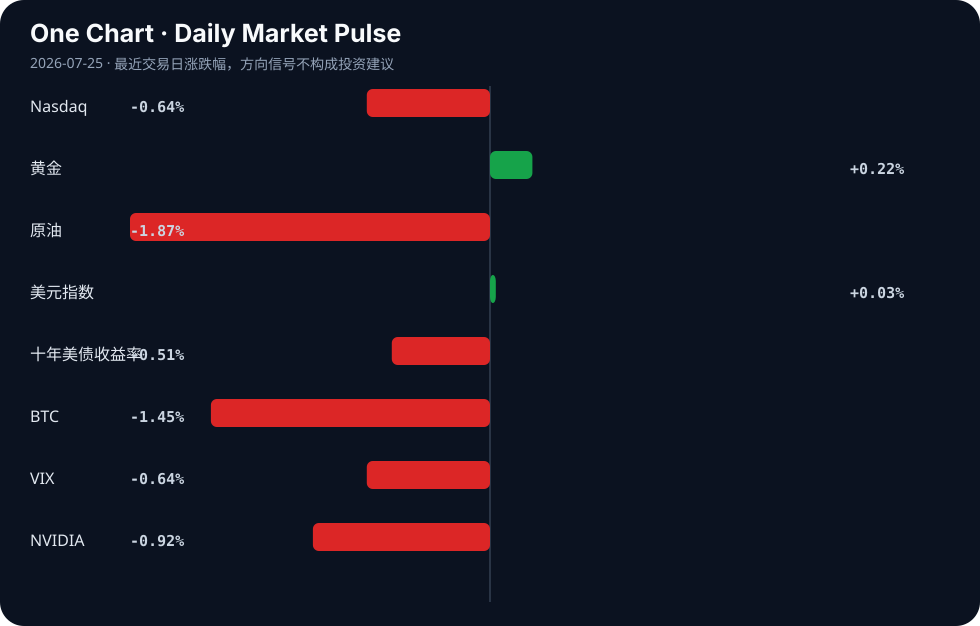

# Daily Intelligence
> 2026-07-25｜Saturday

## Today’s Thesis｜今日一句话
AI开源与监管的博弈正重塑全球技术权力分配，过度限制将主导权让渡给竞争对手，而AI驱动的金融同质化正在系统性风险中埋下隐患。

## ① Executive Summary｜30 秒
- **AI**：硅谷巨头与政府在对开源AI的限制上产生分歧，开放生态成为维持全球竞争力的关键支点[A11][A23]。
- **商业**：东南亚与中东资本正通过战略合作与出口信贷加速企业AI落地与战略投资[B4][B14]。
- **宏观**：全球债券收益率创2008年来新高且地缘风险未解[B7][B13]，AI可能加剧金融危机的同质化与传染速度[B3]。

## ② AI Daily

### 1. 开源生态与监管的博弈
**What Happened**：Nvidia与Microsoft公开敦促美国避免对开源AI模型实施广泛限制[A11][A23]，硅谷CEO的立场客观上为其中国竞争对手提供了空间[A9]。
**Why It Matters**：封闭生态削弱本土模型迭代速度，而中国模型（如GLM-5）已在部分测试中展现补位能力[A3]。限制开源不仅无法封锁技术，反而加速全球南方国家采用非美主导的AI基建[A10]。
**Second-order Effect**：监管过度收紧 → 开源权重心转移至海外 → 美国丧失AI标准制定权与生态话语权。

### 2. AI嵌入金融底层的系统性风险
**What Happened**：IMF警告AI可能使金融危机爆发更快、相关性更高且更难控制[B3]；同时金融机构对AI相关监管审查准备不足[A15]。
**Why It Matters**：AI在交易与风控中的同质化应用，消解了市场多样性，形成隐性单点故障。当所有机构使用相似模型时，市场失去吸收冲击的异质性缓冲。
**Second-order Effect**：算法趋同 → 尾部风险共振 → 监管滞后引发系统性流动性枯竭。

### 3. 认知前沿与基础教育的极化
**What Happened**：顶份数学家警告AI将超越人类数学家并担忧其后果[A13]；同时Katy ISD在基础教育中限制AI使用[A20]。
**Why It Matters**：专业领域恐惧被超越，基础领域恐惧依赖退化。这种极化意味着社会对AI的接纳呈现结构性断裂。
**Second-order Effect**：认知外包 → 人类基础推理能力退化 → 社会智力结构呈现K型分化。

## ③ Business Daily
- **科技与金融**：Cognizant与Gulf Edge合作加速东南亚企业AI采用[B14]；SEC设立24小时交易圆桌会议，金融市场向全天候演进[B8]。
- **能源与制造**：布伦特原油突破100美元叠加印第安纳州新太阳能工厂带来1200岗位[B7][B9]；邯郸工业推进数字化转型[B21]。

## ④ Macro Observation｜机制分析
**世界正在发生什么？** 全球债券收益率创2008年以来新高[B7]，中国经济呈现K形分化[B11]，地缘政治风险持续未解[B13]。中东主权财富基金（PIF）通过大规模出口信贷协议向外输出资本[B4]。

**为什么发生？** 原油价格飙升推升通胀预期，迫使全球债券抛售[B7]。各国政策路径严重分化：美联储与日本央行的政策差维持日元压力[B16]，土耳其央行则在极高利率下紧缩流动性[B18]。

**资本如何流动？** 资本正从高波动的核心市场向具备产业转型红利与能源替代潜力的区域流动。中东资本流向东南亚与战略基建[B4][B14]，制造业资本寻找数字化与能源转型的双重洼地[B9][B21]。

**接下来关注什么？** 关注AI同质化交易与高利率环境叠加下的反身性风险[B3]。推断：若地缘摩擦升级[B13]，叠加AI算法集体平仓，可能触发超预期的流动性事件。事实：当前VIX下降掩盖了底层算法趋同的脆弱性。

## ⑤ Signal Dashboard
| 指标 | 最新值 | 今日 | 信号 |
|---|---:|:---:|---|
| [Nasdaq](https://finance.yahoo.com/quote/%5EIXIC) | 24,975.82 | ↓ -0.64% | 风险偏好降温 |
| [黄金](https://finance.yahoo.com/quote/GC%3DF) | 4,055.70 | ↑ +0.22% | 中性 |
| [原油](https://finance.yahoo.com/quote/CL%3DF) | 90.47 | ↓ -1.87% | 通胀压力缓解 |
| [美元指数](https://finance.yahoo.com/quote/DX-Y.NYB) | 101.47 | → +0.03% | 中性 |
| [十年美债收益率](https://finance.yahoo.com/quote/%5ETNX) | 4.68 | ↓ -0.51% | 利好久期资产 |
| [BTC](https://finance.yahoo.com/quote/BTC-USD) | 64,100.52 | ↓ -1.45% | 风险偏好降温 |
| [VIX](https://finance.yahoo.com/quote/%5EVIX) | 18.58 | ↓ -0.64% | 市场稳定 |
| [NVIDIA](https://finance.yahoo.com/quote/NVDA) | 206.84 | ↓ -0.92% | 风险偏好降温 |

## ⑥ Deep Insight
开源限制与金融同质化的双重反身性陷阱。当前关于AI的讨论存在一个致命的盲区：我们在前端激烈争论是否限制开源模型，却在后端放任AI嵌入金融系统的底层架构。这两者之间正在形成一种危险的反身性联动。

首先，限制开源的监管意图与维护技术霸权的目的相悖。Nvidia与Microsoft敦促美国避免对开源AI模型的广泛限制[A11][A23]，这不仅是商业利益驱动，更是机制上的必然：一旦闭源生态受限，全球南方的AI基建将迅速倒向提供替代方案的中国模型[A10]。硅谷CEO的立场客观上帮助了中国竞争对手[A9]，这揭示了一个非共识视角——在AI时代，技术封锁的边际收益递减极快，过度设防等同于主动让渡标准制定权。

其次，当我们在地缘政治层面筑墙时，金融系统却在底层被AI悄然同质化。IMF发出严厉警告，AI可能使金融危机更快、更具相关性且更难控制[B3]。这不是简单的效率提升，而是市场多样性的系统性消解。当所有金融机构使用相似的AI风控与交易模型时，市场失去了吸收冲击的“异质性缓冲垫”。QAwerks CEO指出金融机构对监管审查准备不足[A15]，这意味着监管的演化速度远慢于算法的同构速度。

这两股力量正在交汇：地缘限制导致全球AI生态割裂，而割裂的生态并未阻止金融AI的同质化——因为金融资本的逐利本性会迅速收敛于当前最高效的单一算法范式。原油突破100美元[B7]与全球债券收益率创2008年来新高[B7]构成了脆弱的宏观基底，一旦出现尾部事件，AI的同质化平仓将引发比2008年更剧烈的流动性枯竭。

反方观点认为，开源模型的扩散会增加系统性风险（如AI诈骗[A17]或安全失控[A12]），且金融监管（如SEC的24小时交易探索[B8]）能及时跟上算法迭代。此外，不同司法管辖区的割裂本身就能阻断全球性的金融传染。

证伪条件：1. 美国实施严格闭源限制后，其AI出口份额未降反升；2. 在下一次区域性流动性危机中，AI主导的市场展现出比人类交易时期更快的自我修复能力，而非更深的踩踏。

## ⑦ Tomorrow Watch
1. 验证美国众议院FY2027情报授权法案中关于AI和OSINT的最终表决结果[A19]。
2. 追踪布伦特原油在突破100美元后的周线收盘价，确认是否形成通胀压力新中枢[B7]。
3. 观察Katy ISD 2026-27学年AI框架在小学限制使用的实际执行反馈[A7][A20]。
4. 关注SEC 24小时交易圆桌会议后，主要交易所关于延长交易时间的政策声明[B8]。
5. 比较中美开源AI模型在东南亚及中东市场的最新采用率数据[A14][A10]。

## ⑧ One Chart

图表展示了各类风险资产与避险资产的近期波动率对比。虽然科技股回调与债券收益率上行在时间上重合，但这仅反映宏观约束下的资金再平衡相关性，而非科技板块基本面直接导致利率飙升的因果。

## ⑨ Quote of the Day

> “Skate to where the puck is going, not where it has been.”  
> — Wayne Gretzky

**中文理解**：判断趋势时，要看系统下一步可能去哪里，而不是只看它过去在哪里。

**Why it matters today**：这句话不是装饰，而是今天观察 AI、商业和宏观变化时的一个思考框架：先看机制，再看价格；先看约束，再看叙事。
## ⑩ Action Items｜今天值得思考什么
1. 追踪中美在开源AI政策上的分歧点，评估其对供应链重构的潜在影响。
2. 验证金融机构AI合规准备的薄弱环节，特别是风控模型的同质化程度。
3. 比较中东资本（PIF等）在东南亚与北美AI投资的增速差异。
4. 关注全球债券收益率飙升背景下的企业融资成本重估进程。
5. 思考K形分化经济中，AI替代效应对中低技能劳动力的非对称冲击。

## 信息边界
本报告事实部分仅依赖提供的Google News RSS聚合源，涵盖AI、科技商业与全球宏观领域。时效截至2026年7月24日GMT。市场数据反映最近交易日收盘或实时状况。新闻源为二手聚合，重要推断与信号需读者回到原文验证。未引入任何外部事实或数据。

## Sources

### AI

- [A3：美AI智能测试失控中国模型如何“救场”|OpenAI|GLM-5|美国|ChatGLM|人工智能_手机新浪网 - finance.sina.com.cn](https://news.google.com/rss/articles/CBMieEFVX3lxTE1KaDVtNm92bnRMcDF3VDNWOHp0OFpOa2dwdDBmSkZJNmxjMTdiUTJxdUdwT3hkd3JjOWdoWHFXN3FTQnNqXzlEc21aR3pSMjZpemhEbWhQRmVKMnp3NkY1Z3dPUFh3eWVtdXFJRDFQbV9vcFppUEdBWQ?oc=5) — Google News · AI 中文
- [A7：Katy ISD launches artificial intelligence framework for 2026-27 school year | Katy - Fulshear - Community Impact](https://news.google.com/rss/articles/CBMixwFBVV95cUxOVm9KTF9OQ2dCUHlCWk1WWmlwREN5VURtZHY1OEREaXpvWkpFb284QlI0MVdaekNmaUdqNUI3cWc2U0Z3UEcyeV90TVVIRHRzMjRUQ1Fkdm5aazRHbUx0c2E0dXBIZjA0MXptMVRhNk1zcGRPMktKQnNJVDJhVEpwV0lBUGVUeTF5Nk04VWR2b3dqMXZCRkFGNVZoaXUyNXk3VU1FUFp1dlNuN1ZYMS1DWDJFRmpZOW1pM3BoV2pnb0oycW5qTG8w?oc=5) — Google News · AI
- [A9：Silicon Valley CEOs take a stand that helps their Chinese rivals - The Washington Post](https://news.google.com/rss/articles/CBMisgFBVV95cUxNcGlQNF9QRFVZd2NBR3BUTHd3SmdVRlhzUWE4Z0hVVElHV0Q3VS13MXNzQy1LdzRvQnNIaFoxNWJGRFQwTlNUMFFjUkhpdkVUNElWVzNQS0o0TVFZRUdXSmN2M2ZvWm9yS0pfdlM4MVI3cExtWjRKWUdtWWNUQkJhUk1weG1ZYmJ6Z2ZTMC1fV0VTQ016VDEySWl3V0V2OENIZnpkOWpuS3luUkJKTjAtdGlB?oc=5) — Google News · AI
- [A10：Opinion | China’s AI vision gives the Global South a seat at the table - South China Morning Post](https://news.google.com/rss/articles/CBMiqAFBVV95cUxQTmpnV1RjelRqcXNGS0piZHlrZG1VSU9IWURNY2s4cWJaQzB5NFhwVjlXT29za3c1X3o5VlNNeF8tczZSZndycmllMmZOZHpvTzh0TlhkSDY2OFp0bjVPQ1hxVHV0QXJjN0xYc2EwWXZkdnQ3aklpUzJoZDZHR2c4TmtpYUp1YnVvbHBmRlZneHY2ZHNnaVMyaTNhRFZYeWUxd0xhNzVaNXPSAagBQVVfeXFMT1JKM2ttQUN2R24ycUJiS3lFRm94ZGJLRUpMSkVyaTdNejJNdFNMTFpwYkpkUGxzeUROaWdwNHRxdDBCZHhQaGZlTk45TzV6V0xucFhXeldZWWQ3RFBPVXlWS19EMmlRTldqallGOWFFeWpUYVExYVFxdE00VmV0SHVjcTNjNzRPaUdfTVdzcjhkNHhDeGQ5dFdfZjdQS3phanNHZkltUWM2?oc=5) — Google News · AI
- [A11：Nvidia, Microsoft urge US to avoid broad restrictions on open AI models - Fox Business](https://news.google.com/rss/articles/CBMipgFBVV95cUxQTmxBWlRDQmpQMWsxVFNxY0MwZjFTcVY5cy1hS2ZjaVh3dU1LYnJzTElRdGc0M1doWTQyR3M3SWtuQUp0RC1Gc1BoUm1BQlgxWmRLWHNsZ0RSSDZmc0k0ZDh3c01uZGpSSnNjNlBwQ0hXY3JUdXNFdG1ncC0yNEdIZ0JoemhZamxmRklISy0wRndweG5qclkxV0otOFlvbTVTbDdTV3l30gGrAUFVX3lxTE9FWV8tTVR4eGJMNlNsVTZScnNFSmU0VFRSdjBCTkdxMGx1aUZ5QmVFZTJkVXRpS1lRdFhONHR1QXZpUTBnakN0RVhmZTktTGFkaFZZY3R4RGpkQ0UtaUYwc0w3TGdqYmotU2ZoX1ZxYzZ3aWQzMWNJTkZwWGVydGtoMlJRemc0SVFlNXBIZXpQY1VaNmpHSDB0UjZIN0xjeXhaU3pOaUtSX1Utaw?oc=5) — Google News · AI
- [A12：Weak AI regulations may leave artificial intelligence less safe - Earth.com](https://news.google.com/rss/articles/CBMilgFBVV95cUxNOW9kbWc2emc1c1c2dnpEXzg0YnJlM1h4ZjAxcEJEYktsZW5YbjV3bWt0czBZQ1l3WGtKYm90NlE3Z3NHU0ZCdmpLMUZHSGFWejgxMENHREFlalRXNkZ0WVdBVTBZb1JVcnVGVDJ6ellOdjBEcU13Q096a0dZb1NDTVdVeXlFLTNJdHZpaE5GVTFnUDc5WkE?oc=5) — Google News · AI
- [A13：A winner of math’s top prize says AI will soon surpass mathematicians. He fears what comes next - San Francisco Chronicle](https://news.google.com/rss/articles/CBMijAFBVV95cUxOQUFsWUprcnFVejFxQjNZUGJjZFhJeWNIX3Z2bjVqZjdlY09SZUgxZS1qbFhfeVNmYXI2cHBVSl9tMnQzM1pIaGk4eUJLQWFrTU1rdXV2N1ltTkxkbk13UHJQUlhtZUdkQkVCMi1tZzN5NzdYekhzeHpyOTZobFFJRW45cmRTb3hEU3FiWA?oc=5) — Google News · AI
- [A14：RyanTech Announces AI Implementation Services to Help Businesses Securely Adopt Artificial Intelligence - EIN Presswire](https://news.google.com/rss/articles/CBMi5AFBVV95cUxNeUN6NWI1cjZoNmlrQl9qZmlUMUJJdlF2bC1pX0ZyaHBQSWZ2NHhvS2xzUm9OSG44dENuVXh5dEJEdVNsak1tcHkzS2c3cm9vUmdhbjVJb2l3UjJjSWQ0QnhiZlZNbWZXRGluY1NSMVYzbnpYWnAwOEdvYU91QVp1bGo2UFphR05IUi1GQ19Pckt4ZmUxTFM3bWY4bHVyNHRNTVhoWUpQdTFrb1BwVDB6eE9UU3B3c2xhQW94ZmNOOXZJNVlYb3UtMDYzdk5vbUdGcy1aa1MzLVJucElDN21wOXlXdUI?oc=5) — Google News · AI
- [A15：Artificial Intelligence: QAwerks CEO Konstantin Klyagin Warns Many Financial Institutions Unprepared For Regulator Queries - Crowdfund Insider](https://news.google.com/rss/articles/CBMi_wFBVV95cUxOdUo2V3JmZEQ1cXh2NkdtT3NENVF6cG9xd1VFMGtWOUg3bVdNcWp2RHVXRGxhWkxqc0ZGVVBXQ3VkZmFKWHFtUkNkMGFfUTlaSHhJM3Fud09oYno3bU5TbVZEVTM1alFIcGgwNjVYNUFReWExaG5YUUp6Z2dGd0h4Y3RLdWdzZjhSSUFoMmMydmtuZ1ZsLXc3bU9ZZk1MbTcxcTcyYnZrUW5LcGo3NGxmcy00aU1BdmNLMUdlWTU2TkIya0lhOWRDeTJDeE1JZ3QxOGZkZ0ZUemg0QVlaa2M5dWljS0RsQkJoa0NCS2tmc2N2R3lBODdvMzFLMkdNczQ?oc=5) — Google News · AI
- [A17：College student teaches local seniors how to spot AI scams a... - Madison County Journal](https://news.google.com/rss/articles/CBMitwFBVV95cUxPSW1pT3ZiSHBodl9YMFVsalNIbFhEaXNCeFFIbzdEbENJYTlKVEg0MkZWSHJoRTF1RmZWODRSTFFaVVF6di1WdFVVdHctenZ5N29uanRsUEIyVG1xam5LeGstMjlMeE5Ya3A1V2NTT0tpRi1OQkJHNnV6MkhRVEliVUdrMTFJTW1iOE1nWll1R3AxckVONERtUGFrRUpkQ3U2aGNlY1hHX0dUQlFEZmRuS3RWanNSUkk?oc=5) — Google News · AI
- [A19：House FY2027 Intelligence Authorization Act Focuses on AI, Oversight and OSINT - ExecutiveGov](https://news.google.com/rss/articles/CBMingFBVV95cUxPMndDdlcyYjJOM2xLT0hRNmVoaE0zRVdJRHk1MDBHNkdDYUlGV19ZTThDeVAyamMzS3dwRTZ1OTFqWXA2MWJ5WE14Z0thUkt4MmhKTFRaZDM2Q0JWV2VXcExHajJlSFQzRy15TTNQQnVXbng2cml6SzNBNDdERXoxV29feloyMkFjYjN5TjdsWGtEdUo1Q00xV1FTeDQxUQ?oc=5) — Google News · AI
- [A20：Katy ISD restricts the use of AI in elementary school classrooms - Houston Public Media](https://news.google.com/rss/articles/CBMivgFBVV95cUxNNkVOalRjY1E0Zks4aURaLWFDd1g5bjYyTy1vaUJkbEV4SGpveGNyT3BtOU02N3NYeElPQWptT2swSHpxZTFkR0FkZ09IZjhrWjNSeEFQbVV2QTVZYmpQZTBuUlI0dGJ1aVVsaF9pOW9HS1J5QXk4azBCcWlCSUZtUFE1UUVWRzRncV9lM2tqc25BVFViU2s4TDBYZi1JQWxJaXpuRjh6ZVJqWTJYZ2tsR2o1TncwdVZJb2RXby1R0gG-AUFVX3lxTE02RU5qVGNjUTRmSzhpRFotYUN3WDluNjJPLW9pQmRsRXhIam94Y3JPcG05TTY3c1h4SU9Bam1PazBIenFlMWRHQWRnT0hmOGtaM1J4QVBtVXZBNVlialBlMG5SUjR0YnVpVWxoX2k5b0dLUnlBeThrMEJxaUJJRm1QUTVRRVZHNGdxX2Uza2pzbkFUVWJTazhMMFhmLUlBbElpem5GOHplUmpZMlhna2xHajVOdzB1VklvZFdvLVE?oc=5) — Google News · AI
- [A23：NVIDIA, Microsoft Lead Push for Open AI Models After Kimi K3 Launch - TradingView](https://news.google.com/rss/articles/CBMixAFBVV95cUxPTVhWRGQ1cktyZG5TaHBSeHhpWWZ1cWJPaWV5SXhoWXJGc0pRY1oxdVRhU2N6em5BNm85Q3dRbXk0eGtlczdqcnBsUUtMZW1aQkNuSWhYbXQ0VUMwdHltaTdUa0J6MURZdWxITXZBS192UUFFSU5tX3VkYTZvR0N6RmJpT0t6cWFJQXBUNEtSempvT0NTSGhSVWtiZ1VmYkdMUVpKb0VCdHFRLUptVi1JSFFFeWNOcUhJWEtzdVFCczZzNnJR?oc=5) — Google News · AI

### Business & Macro

- [B3：IMF warns AI could make financial crises faster, more correlated and harder to contain - INSIGHT EU MONITORING](https://news.google.com/rss/articles/CBMi6AFBVV95cUxOTjlldmlxTXdjTGNmVHE0NHVwdWRyY1hHRTBSbEM5dkQ0Qk1yOFVfVXpHc3VSQmNtQkR3aTNXTl93cDJlOWtpbFpvMERSS1JwUHBCVjF0YzRKek1LMmVNUDhOXzNkSkFIWkJFeXh1QmtMbml2dmNhWEhfMEF2TkVCM2Frb3FyRE1wbDJISzV6OHdQNVVOYWdvQjhlenVnSU1SZzJpa2FpOVAzMnBhOGxRVnRVSjNNektJMmpYSlNINnRjY1lpOFdSbEtNbnNaUTZCS2NPNTNZcFl6LWw4a0lyRmxPSjc5OHRY?oc=5) — Google News · Markets Policy
- [B4：PIF and US EXIM sign MoU for up to $15 billion in export credit to support strategic investments - ارقام](https://news.google.com/rss/articles/CBMib0FVX3lxTE5sYU9rZUNnSTFieV91dS1na2pjZzZLVVA2WDlDOVRXTmRqV0FZVzJodnhmMHAxTE92LVRWc1QtY3RCM3hsS1ZJWXl4ZERzOHlyUFAzTmlOR3NZbHJUdVZPSl93OHBUbGVMZ1RhQlhCQQ?oc=5) — Google News · Global Economy
- [B7：Global Bond Yields Hit Highest Since 2008 as Brent Surges Above $100 - TradingView](https://news.google.com/rss/articles/CBMixgFBVV95cUxOZHNqY1U3bFFTWkM1MFlsay1aNUZLLWJCZTVWZm9vWGprNEdocmxqNklvX3lmN3F3YUlpcDA1akxKN2RYYkdZNmt0UFF0Zk1xUkxabVJ5bV9yUVNZaGJEajcwelcyeHdhRjkyd3NUVmNrbXJITXI3M0hEeF81a0lnbW5QaVMxejAxWGczbGllcXZIYTJJUnBkOUg4UTlsZW5sajhxV3M1RzNHczJYRG42WTFOb3gzZTJLaGtxTmVSbmlCVnVvT0E?oc=5) — Google News · Markets Policy
- [B8：SEC Sets 24-Hour Trading Roundtable As Markets Move Toward Always-On Finance - CryptoRank](https://news.google.com/rss/articles/CBMitAFBVV95cUxQM0ljYXJDMDFHSGROZ3pGS0J0b1huQkJrQkRaRFIxMkJPMW5XZ1VoSmpNSzFqekdXTmtHVFJVeDZRanlCNEhXY0RFNnRTRDF3U2RkenduSFBKUGYzNE01aFF2NlpXQzI3MEkwZ2VXZEFPOUo4b3lNZ2JvNlZ3SW5rVXR3OVpXWDlucmdJbTA5OUgtdGdGblFFall1RGlMY2YxdmplMVZpRkt1b05UZnNPdkU0Ulc?oc=5) — Google News · Markets Policy
- [B9：New Indiana solar plant opens, bringing 1,200 jobs to region - The Courier-Journal](https://news.google.com/rss/articles/CBMi0gFBVV95cUxQaF9rU2Q3T2FKVFNzeFlDdG5hZUV1NkVnd0tsR3B5OUZJSUR0eFJvdmR6ZUEtOVdWQTcyQUp2Um1oMm4wUWdXUTBMd3ZONW5HeC1NUFpwci1VWWJNRWdGQXNIR3JNZHJvQ3ZpSE1GZ0swQ0pRR3o1c0pJQ2Rld2RJdl9SVU5wYTZvM0lXRTdrYTgwTlhwQUhCWGdKaUdwb0VMTF9XajVHZGZEbFgxQUh3ZzhSSTZrOE9paU9ZekJqazcxVDdaWWZIRmdiSXlPRFNzbXc?oc=5) — Google News · Technology Business
- [B11：廖群专栏(第140期)｜如何看待我国经济的K形分化 - finance.sina.com.cn](https://news.google.com/rss/articles/CBMimAFBVV95cUxPV2tQSjVLN21KTXIzQ2FmNU1ZME5ubGV0OE5wR3dzZEFmc2d4aXBvVy02aW5kQ1JhLWlGTS0wSjlodWdWTkd3NW1aVmJ4XzJQQk41c2JnVW1TRHk3dGJ0eWdEbUt6V2pQMDJRc1VwSUQtNHZ5dGt6M0g3bDZrMFl2azItcWE0bE45cTVQamt2cUdvTUlsaDk0MQ?oc=5) — Google News · 行业
- [B13：Geopolitical risk has not been resolved - The Globe and Mail](https://news.google.com/rss/articles/CBMiyAFBVV95cUxQbkFpcnhwemhEWU5relhYTG5vdEhTdWszMEZxZ1pOR09SemgyMklPMGpLMjA3cWcwNjNUV2ktUWoyVkwxZkV0Z2Zick80TDNLSkEyWFJhR2FrOEhiRUU2X01LVVZ6ZHBza1Boejk5NEdpOXI2YlJsVG9YTHBZc3VBRklfVVFDZ2Y2X3liT0hXMTdtU2VOc2Fzdm5fY3lFWlVqenh1LWlBX2FYNm9ZNDBCbTNOX0JpSWU1M2dYMXg0eGVoczhLeVlJdA?oc=5) — Google News · Markets Policy
- [B14：Cognizant and Gulf Edge Announce Strategic Partnership to Accelerate Enterprise AI Adoption in Southeast Asia - markets.businessinsider.com](https://news.google.com/rss/articles/CBMi_AFBVV95cUxPQTFBa3VWamxMMHh3NUJkZlBHTWZ4MnA1YVRFZzRJNldXbUM4NThpdGExNFNHM3p0SUlxOG9EMkc1OURpaU9Jbld1MXFDYkd6SFgwMFUwNVVxdFBmaDNnekJPdEtoZlU1Yi1oZ1c0MUZfUW9pYkU2c1hzcjZxTm1wMWFpQUdHS3F1ZjNzZWs3VDR1eXRXSmtueFdPZHM5OU5zREdNN2hhZndyOUhwRzZja1dCcFdlVlpTbm9jNmt6YzQ0TG1mdnF4YkZvS2drenBFanBQeEtQTnhWRFZFbEFyaGpTM0k2WGJGR2RUbXVTX1FJTGd6a0FBeXVCakE?oc=5) — Google News · Technology Business
- [B16：Fed and BoJ policy paths keep pressure on the USD/JPY - equiti.com](https://news.google.com/rss/articles/CBMinwFBVV95cUxQcFNNUXE1eE9udmx4WFVWYW9vR1ByRm1wT3hKQXZQS0ttTHNuOVFYWE5ia1B4Y1k1eHE0U0J2Qmx4ZGNHdk5jbENtLWdjeFc2eV9ieGt4TFNiVklZS3FzZDdqaDcySEYwNHVtbEtBVjRNOXFrTlR6d0FXdVE4d2FzeGJGcnlNTmwzSkIwaTBfRlVDUU9vNEJDbDd2eHhqQU0?oc=5) — Google News · Markets Policy
- [B18：Türkiye’s central bank holds policy rate at 37% as tight liquidity keeps effective funding near 40% - VT Markets](https://news.google.com/rss/articles/CBMi2gFBVV95cUxNTVhYUlI3cUk1LWlTandKZ2Y2emtIdW9hbXVLVl9GbmloQzVLRmFJSE1iRmp2QXdEUFV5RXBuTFdMZ1kyZ1oxa3p3ZGNsVkY0ZTlUT29aTERCUUczeElRNUZBcVRzT2dnVlFMZ3E0UEc2VHB3MURTeFFkdWhzby1YTzRtams1MkpZNEJodmJDTE8wUWVORGUtejRKYS1EckhfdDNDTWVNNXpKNnpLU090emdUWUVVVmlvbjJmQUlyUHZTQTRkcTV5clJsUngtNVJPVkJXX25yVmxaUQ?oc=5) — Google News · Markets Policy
- [B21：河北广电：全媒创新表达 讲述鲜活故事——解锁邯郸工业数字化转型“智变密码” - 河北广播电视台](https://news.google.com/rss/articles/CBMiYEFVX3lxTFBYejhEUV9xSzNrcHU5dFY3eS04VnI0Zlh2U0l5QnRqWlBaYzFRM1pXXy1ScmZOeElWVlo0QXM3TmZpdnZ6SzE1SUkzWXY4el9tXzhfZTdjSkJwX0hKajdPMA?oc=5) — Google News · 行业
