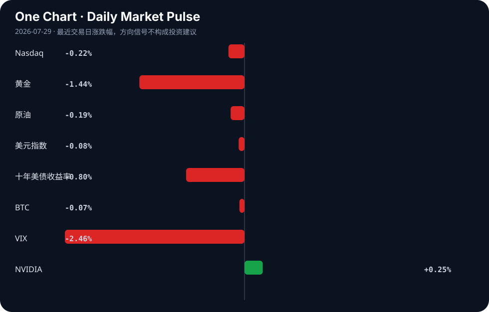

# Daily Intelligence
> 2026-07-29｜Wednesday

## Today’s Thesis｜今日一句话
AI的权力集中与治理真空正在同时发生：当科技巨头呼吁去中心化、员工呼吁全球监管时，AI对宏观经济信号的扭曲已让央行陷入盲区，治理速度远落后于技术对经济系统的渗透速度。

## ① Executive Summary｜30 秒
- **AI**：AI权力博弈加剧，Zuckerberg抨击AI权力集中[A1]，科技员工呼吁全球监管[A2]，而AI军事化与教育普及正双轨并行[A9][A24]。
- **商业**：AI外贸正取代新能源成为中国新增长极[A15]，工业企业利润上半年增长18.7%[B9]，半导体与特种气体驱动投资主线[B11][B23]。
- **宏观**：BIS警告AI繁荣模糊央行通胀信号[B6][B10]，俄罗斯设立320万美元门槛规范加密货币交易[B14][B15]，印尼谋求摆脱原材料依赖引发供应链重组[B1]。

## ② AI Daily

### 1. AI权力博弈：去中心化呼吁与军事化集权
**What Happened**
Mark Zuckerberg抨击AI权力集中[A1]；科技员工呼吁美国主导的全球AI风险管理[A2]；与此同时，美国与阿联酋建立首个双边军事AI特遣队[A9]。
**Why It Matters**
商业利益与安全诉求撕裂了AI发展共识。巨头口头呼吁开源与去中心化，实质是为自身生态扩张解绑；而国家机器则在核心安全领域加速AI集权化与军事化，民用与军用的边界正在模糊。
**Second-order Effect**
监管套利加剧 → 军事AI应用常态化 → 全球军控体系面临AI降维打击的真空。

### 2. AI的制度化与劳动力技能溢价反转
**What Happened**
中国教育部发文加强中小学AI教育[A24]；多所大学与学区强制或提供AI工具与证书[A3][A4][A7][A17]；IRS发布税务AI使用指南[A16]。
**Why It Matters**
AI正从“可选技能”变为“底层基础设施”，教育体系与专业规范被迫重构。当AI使用成为合规基线，不掌握AI的传统岗位将面临议价权崩塌。
**Second-order Effect**
教育强制普及 → 劳动力市场技能溢价反转（传统文职贬值，借AI提效的合同律师议价权上升[A14]） → 机构重组加速（如视听行业重组[A10]）。

### 3. AI外贸引擎与宏观信号失真
**What Happened**
中国商务部将AI外贸盖章为新名片，取代新能源成新增长极[A6][A15][A18]；BIS警告AI扭曲央行通胀信号[B6][B10]。
**Why It Matters**
AI硬件与软件出口改变了贸易结构，但AI对价格和就业的冲击使传统宏观指标失真。出口端的繁荣与内需端的通缩并存，央行依据失真信号制定政策的风险剧增。
**Second-order Effect**
贸易结构升级 → 央行依据失真信号维持高利率 → 宏观调控过紧反噬AI资本开支。

## ③ Business Daily

### 科技
半导体成为当前最大投资主题的核心驱动力[B11]，高纯度特种气体市场随之扩张[B23]。然而，算力基础设施正面临地方资源约束，德州已出现反对数据中心宣传的声浪[A20]，科技扩张与地方承载力的冲突显性化。

### 制造
中国上半年工业企业利润增长18.7%[B9]，官方叙事反驳“产能过剩”论[B19]。金属粉末增材制造市场持续增长[B7]。新兴市场正试图复制这一路径，尼日利亚押注锂矿驱动工业复兴[B20]，沙特扩建PX技术制造设施[B24]，全球制造产能分布处于重构期。

### 能源
UN SDGs 2026报告显示能源与气候压力加剧[B22]。在此背景下，Suzlon Energy寻求向欧洲、澳洲及东南亚出口风能[B21]，印尼谋求摆脱原材料依赖向工业升级[B1]，传统能源出口国正被迫向绿色产业链上游攀爬。

### 金融
Brookfield扩张全球另类资产平台[B8]，显示资本在不确定性中向实物资产聚拢。俄罗斯央行发布加密交易草案，设立320万美元资本门槛[B14][B15]，试图在制裁体系下建立合规的加密资本流动通道。

## ④ Macro Observation｜机制分析

**世界正在发生什么？**
经济信号正在被AI繁荣和供应链重组双重扭曲。一边是AI外贸与工业利润的账面繁荣[A15][B9]，另一边是BIS警告的通胀信号失真[B6]；同时，新兴资源国（印尼、尼日利亚）试图从出口原材料转向工业升级[B1][B20]。

**为什么发生？**
AI带来的生产力跃升和成本下降掩盖了潜在的通缩压力与内需不足；而全球地缘摩擦迫使资源国寻求价值链上移，打破了原有的“资源国-制造国”稳态分工。

**资本如何流动？**
资本正从传统长周期大宗原材料加工环节撤出，流向算力基础设施（半导体[B11]、特种气体[B23]）与替代性避险/投机资产（合规化加密货币[B14]、全球另类资产[B8]）。

**接下来关注什么？**
关注央行在失真信号下的误判风险（维持高利率过久导致AI资本开支断崖式下跌），以及新兴市场资源民族主义对全球供应链的反噬。

## ⑤ Signal Dashboard

| 指标 | 最新值 | 今日 | 信号 |
|---|---:|:---:|---|
| [Nasdaq](https://finance.yahoo.com/quote/%5EIXIC) | 24,876.91 | ↓ -0.22% | 中性 |
| [黄金](https://finance.yahoo.com/quote/GC%3DF) | 4,015.90 | ↓ -1.44% | 避险需求回落 |
| [原油](https://finance.yahoo.com/quote/CL%3DF) | 82.45 | ↓ -0.19% | 供需平衡 |
| [美元指数](https://finance.yahoo.com/quote/DX-Y.NYB) | 101.39 | ↓ -0.08% | 中性 |
| [十年美债收益率](https://finance.yahoo.com/quote/%5ETNX) | 4.60 | ↓ -0.80% | 利好久期资产 |
| [BTC](https://finance.yahoo.com/quote/BTC-USD) | 63,682.68 | ↓ -0.07% | 中性 |
| [VIX](https://finance.yahoo.com/quote/%5EVIX) | 18.21 | ↓ -2.46% | 風险偏好改善 |
| [NVIDIA](https://finance.yahoo.com/quote/NVDA) | 197.01 | ↑ +0.25% | 中性 |

## ⑥ Deep Insight

当前市场叙事存在一个危险的盲区：一边是AI外贸取代新能源成为新增长极[A15]、中国工业企业利润录得18.7%增长[B9]的繁荣图景；另一边是国际清算银行（BIS）严厉警告AI繁荣正在模糊央行通胀信号[B6][B10]。这并非简单的统计噪音，而是经济反馈回路正在被技术结构性扭曲。

非共识视角在于：AI驱动的出口繁荣和利润增长，实质上是在向全球输出通缩压力，而非单纯的竞争力提升。AI提升生产效率（如合同律师借AI提升议价权[A14]），必然压低单位服务与产品价格。当AI产品作为外贸新引擎大量出口[A18]，接收国将面临输入型通缩，而出口国则因AI替代劳动导致内需萎缩，只能依赖外部市场消化产能。这种“效率-通缩”螺旋，使得传统基于价格指数的通胀信号彻底失真。

更深层的机制是，央行依据失真的低通胀信号，可能误判经济潜在增速，从而维持紧缩政策过久（如十年美债收益率仍居4.60%高位）。这将对依赖廉价资本的数据中心和AI基建形成反身性扼杀。德州已出现反对数据中心宣传的声音[A20]，正是资本成本上升与地方资源约束冲突的早期信号。因此，AI外贸的账面繁荣，掩盖了宏观治理失灵与内部需求空心化的脆弱性。一旦外围需求因通缩收缩，AI产能将面临无处消化的危机，官方叙事对“产能过剩”论的反驳[B19]将面临真正的压力测试。

反方观点认为：AI外贸是真实比较优势的跃迁，利润高增证明需求旺盛而非通缩；BIS的担忧是旧宏观框架无法适应新生产力，AI创造的新岗位和新需求将最终对冲价格下降，带来无通胀的繁荣。

证伪条件：若未来两个季度，全球核心CPI持续超预期下行且失业率结构性上升，同时AI资本开支增速因高利率显著下滑，则证明AI通缩效应占据主导，宏观信号确已失真且引发反身性收缩。

## ⑦ Tomorrow Watch
1. 俄罗斯央行加密货币交易规则（320万美元资本门槛）9月生效的后续细则发布[B15]。
2. 中国教育部中小学AI教育通知的地方执行细则落地情况[A24]。
3. 美阿军事AI特遣队的首次联合演习或指挥架构公布[A9]。
4. BIS关于AI模糊通胀信号的完整季度报告数据发布[B6]。
5. 印尼针对原材料出口禁令及对中国关系影响的官方政策表态[B1]。

## ⑧ One Chart

图表显示风险偏好（VIX下降）与避险资产（黄金下降）同步回落，而长端利率（十年美债收益率下降）对久期资产形成利好。这种组合反映了市场在软着陆预期下的资产再平衡，而非单一避险或进攻逻辑的主导。

## ⑨ Quote of the Day

> “What gets measured gets managed.”  
> — Peter Drucker

**中文理解**：被持续衡量的东西，才会真正进入管理和资源配置。

**Why it matters today**：这句话不是装饰，而是今天观察 AI、商业和宏观变化时的一个思考框架：先看机制，再看价格；先看约束，再看叙事。
## ⑩ Action Items｜今天值得思考什么
1. 验证BIS警告的AI对通胀信号的扭曲在CPI细分数据中的具体体现[B6]。
2. 追踪AI外贸替代新能源出口的数据结构变化，区分硬件与软件贡献[A15]。
3. 比较Zuckerberg的去中心化呼吁与美阿军事AI特遣队集中化控制的逻辑冲突[A1][A9]。
4. 关注俄罗斯320万美元加密货币门槛对资本流动的实际拦截率[B15]。
5. 思考工业企业利润高增[B9]与“产能过剩”反驳[B19]之间的产能利用率真实水位。

## 信息边界
本报告事实来源仅限今日提供的AI及商业/宏观新闻聚合源。市场数据反映最近交易日收盘或实时状况。新闻来源多为二手聚合，重要推断（如AI通缩螺旋、央行误判风险）基于材料事实推演，尚未经官方数据证实，需回到原文验证。

## Sources

### AI

- [A1：Mark Zuckerberg Blasts Centralization of A.I. Power - The New York Times](https://news.google.com/rss/articles/CBMif0FVX3lxTE5rd0Z0Y2F0eFhzbWZ5Y19YOXY2aTBaRW1LQjlIU0gwWkNabktwdEhZZWJYM09KUGh1NEl6QWhXQUZHSnhycm9CY0ljQjVpWFByQUtIdnd2akxGRjhGWFE2Z0FMNVVpN0ROTWFzdE4wbF90XzlCbWFiU2xpT3VXblU?oc=5) — Google News · AI
- [A2：Tech employees call for US-backed global effort to manage risks of advanced AI - Reuters](https://news.google.com/rss/articles/CBMivgFBVV95cUxNZUdKZ0lPNURncWhtWjRjSDFGa2Q5U1V1NzdKcEVRcEJCZEo4Y1daZVF0RTd4OGdhekdaVkZBYW10YTlXaUtmZGNEZGNGUG9ZVTBwRTFhUXUzRjhnTjdZRFFHR0YtdjFheHFrMkVrLTF4THNZQUl4QkQ4cno2OExITkkya214MWlGRzh0VDlLNFBSNGw0bTVheFFKaWkyNlpsdk05bC1ILXJ6aUZnVDlQSzU1RFBkSUpYUzNVZWRn?oc=5) — Google News · AI
- [A3：Eastern Enrolling Students for New Artificial Intelligence Certificate Program Beginning This Fall - Parsons Advocate](https://news.google.com/rss/articles/CBMi0wFBVV95cUxOYUl0TjBBcnJCWDMzeDhwWlRGNDFPa09hZGFRcDMtU0FvMEdRUjFGVXdiNHVoUTJfMVg5aG91bnB2MGlBUGZfeUNPRmc2Y01YMkU5S2R2ZUNHdnpEMlFQNlMwX1p4MXRWRGplYVRLcjlMY0liLXBzSV9ERmpkRVh2Z2JFa3R0TnJUY0pmbk9VMWdNaEtqWVcxQnBQLUMtY1FqQmRHMk9Ea3IzRnFCWkYzSldTZUMzd29GZ3haZ1NSMWxTdnBrY29fU1hDcVlxdHFrQ0hr?oc=5) — Google News · AI
- [A4：'AI isn't the flavor of the day:' Why Adrian College is requiring students to learn it - WTOL](https://news.google.com/rss/articles/CBMi6gFBVV95cUxOcy1EWElhU1IxMmdtZnVsNExndnJvbVh4VURGb1p2ZmNKMV9xMGtDT0xZaV9La0IyWEpBYW1LVkRiT2JqZDhOQ2g2VEtRZTJlQURDVlVnTFc2R3NHblpfWDhBZ01RYjh0UFVvdVMyTzA2QlZrbTJRR0dhbzI0czVUWjFLRjVrXzNyV2w3Q2tEdkJUNnBvSjZob0wyOHB5c00xX21pNFYwZ0NPa3NmMEdsYmxxQVFfVGhTOGdQdUxkRE1CcWMwTDlNNWhzeU9LcnZZN2pXMHFpWlhPVFBrZktJcnE3MU1CUUYzR2c?oc=5) — Google News · AI
- [A6：商务部盖章！人工智能外贸新名片背后有何玄机？ - 新浪网](https://news.google.com/rss/articles/CBMif0FVX3lxTE41bjhaLTU1UHVCYVZtblEySjRVX3VhUmdURUZHU1FPc2cxM3dacGFxY0dvMVJVZERUS1VDM2syX3JwOUR6ZUhmOGhyY0ItcWFWOEhYdHpaZnRULTBhMUFuWGNGNGM1cFduclRjd1VZVVMtRDlxdExEVHM0dUFOZmc?oc=5) — Google News · AI 中文
- [A7：Parental choice provided for artificial intelligence tools in schools - AOL.com](https://news.google.com/rss/articles/CBMilwFBVV95cUxOSzdWYU9ybncxYW1ZcGJMd3F4aFdsSmdBSE1nQUZ2cGpZdVdRWHZRd2cwRUdDR18zQ1Q0SkFiNS1TYXk4ZTFrcWVkdHZ2SGVYanVJZjZDdVhaNUxsVmxvZ3BES01vSnJUYW5pVFRvVHd2UndkQkdEM29PbC03NV9iblhtNktQUnhnSEVpdlpmS3h0TDc2bjNn?oc=5) — Google News · AI
- [A9：United States , UAE Establish First Bilateral Military Artificial Intelligence Task Force in the Middle East - Yemen Online](https://news.google.com/rss/articles/CBMiV0FVX3lxTE9OTmYxSlc3SGlXM0pFRW80eXBKVmY5dnNGbjA4VlRJNXhvZFNxYlp3bzl4MzNmZWZhTE1jc21NbXNPQmdmMkpmTXl1RUxKS04yRFFweWMwZw?oc=5) — Google News · AI
- [A10：The Future of Audiovisual Is Reorganization - Roastbrief US](https://news.google.com/rss/articles/CBMidEFVX3lxTE9GTkRnd3g3cnA0c05DbTlXWkltOTg5UXp3QlBaLURweFVxQ2xFTjBjUXFNM3EzM1RPbThKenEwb2NYakxYdnBYRi1TclBUYS1EZTcxblh5WEVkeFdLelI1UWJ3MElZVkc5Y2ZUVjVWb2JIVkJH?oc=5) — Google News · AI
- [A14：AI may be a boon for contract attorneys, new study shows - ABA Journal](https://news.google.com/rss/articles/CBMipAFBVV95cUxPUlhyVlBoMG40ZVVBaTNHZ0U0WVBoMlpRWmFBZDlRVUdtVkZJX3pXYnJrOFN4MTNTb3VYUXhUaUtMaXNKMzZBMGF3d09UVGJZVk1TamtSSFAyYnNUTnFFdlVLQUdMTlRzM2FtMWdmNGxET0d5Q1NzMi1id3RpS29oQk9pTXdyamdrVDUtRXRXQkRVNzZPOG93ZGJlaFpRTXBlN09odg?oc=5) — Google News · AI
- [A15：人工智能外贸为何能取代新能源成新增长极？ - 新浪网](https://news.google.com/rss/articles/CBMif0FVX3lxTFBjYTd5WF96R2oxalA1a0R5Ti1hLTIxaDYzc0czaXdTRTZSSkNncjg0V1RuSmNCRmZ1YjBHemp6U05INHpNQTU0eEZXTGhNS1RTTG9FYV9WUGVjcXRCa1RudWRVZmRpLURzbnltX2xheGFWdXQwRE0tcDVzaF90MDA?oc=5) — Google News · AI 中文
- [A16：IRS Office of Professional Responsibility Issues Introductory Guidelines on Artificial Intelligence Use in Federal Tax Practice - Buchanan Ingersoll & Rooney PC](https://news.google.com/rss/articles/CBMi4gFBVV95cUxNeV9hVzgxNVFvaFNWVEtzYUZkTllUVDNJOXc1cE5XM255dFNVS0RsNkRIQnJESEdsdGZrNURtdXR5ZXI3OVdEVVgzWXJMQW53Z1FpWE9ZQ0ZpNmVqLXd6bVh1ZlEwLXNQS1c5XzNHUzlOY1YxVEFSU3hVS0k3eFZGaEkteWR6Q3NOcWVRNTVTN2hIM0doOVBOS2VwWm9nUFYzbTQ3V3BVeG1vZkF6dV8zWTdPcFFKRVlsV0Q0enphdkowQ1dmSVZRX2ZqYjA4UVRHWXBiekpHRTZBUU5QMHpqRHdR?oc=5) — Google News · AI
- [A17：District #348 Preparing Local AI Guidelines Following State Guidance - WSJD 100.5](https://news.google.com/rss/articles/CBMipwFBVV95cUxQb0FjeVZLS2lFa3h1bU8zN25KLXFWUmpneXlXSkFFVlNPR0g1RnZjTUVPS0NUVGJ6MXI2TTRPU1laR3JEV0FTRWN0eXVfVGVuVUExWWNKS2xqTHV4bTZZeWxEWnNiUG9VRkZBZV9oRHVwNEZfTVY4SlZXaVFPbHlmbThjTnYtd0tSTUxDUG95NUdZeWJLMmlJQmxXVUIzcTg4ai1xMjQwNA?oc=5) — Google News · AI
- [A18：人工智能相关产品为何能成为外贸新引擎？ - 新浪网](https://news.google.com/rss/articles/CBMif0FVX3lxTE1WSlVnb3E0cElhd1pvVEYxTXdHcmoxREYzcGZsemlPanIzRGdXTTF2SUx4NV9jcGNENGtYVThUVUJhYTdXaFZWTTRyTXc3WFNtRVNHSlMxZVZwSkpZeUhsZEFwdF9HVWpIRE54bC1ESE1pdVdad2pwQTdibjZQak0?oc=5) — Google News · AI 中文
- [A20：Lucci: Texans Cannot Fall Victim to Data Center Propaganda - Texas Scorecard](https://news.google.com/rss/articles/CBMimAFBVV95cUxQWFo1WnpjNHI5ZEtHNUU2Y3pMcmFrdnhZZTNvbk9fcFJ6YzRYWWdjQ2IyU2JfVTAxeHVKeWF1UUt5czllSjU5R3VhV19UZXlkV2hxSHUwZkJkcHNYaHRjZGd5THlfdTB6TTlhLUNRWWZqdUFmMU1remlSZnE4LWxwS1JxYlZqQmhYb3FOT0ROa0NmSTdLcHMxbQ?oc=5) — Google News · AI
- [A24：Notice of the Office of the Ministry of Education on Strengthening Artificial Intelligence Education in Primary and Secondary Schools - CSET | Center for Security and Emerging Technology](https://news.google.com/rss/articles/CBMijAFBVV95cUxPN0tZZFNSR2pWd3B2aUZ1VENiV21lRDhhVlR3aUFlY05kcnlUZDBJaWkxN3VFSERlMnJTMWNZSGZiODY1VXYyUUoySGpFZmFMZFRtSjlKS3hHbDRWZHpvZU5RYVRlUzY0eDZJWEZYakRKclphM3ctYWlZb2NxR0twaEprWFQyUFBYeS1GWg?oc=5) — Google News · AI

### Business & Macro

- [B1：Indonesia wants to move beyond raw materials. Will its China ties suffer? - South China Morning Post](https://news.google.com/rss/articles/CBMi0wFBVV95cUxPSC05UThKN2hpWEd4RjJ3bzF0N3hlYWs2Skg5bVhqSjdtVUphZVhHZU9UXzN2VXZVb0xjQlFIOXhLRkRueWgxSFB1OEllbE5YSmRrbXhodXRyakVEU3RqT3pzamZtOEt1SWxPMWljb0ZuTDlPNHVkT1RZb05OaFIzTEt6d2I4X1owc1ljbHZJR1VOcXA2djZFRTJpZzlnTzhmZWY4RXl3a25DXzhoZGhINTItb01qYkxQMTkwc01UNHlNbFdBVE5hYTh1M2wtZkRfV0FV0gHTAUFVX3lxTE9MUFdXakpWaldUUkRiQjl1THRzczFtcktpTDhJSzlaMHQwMi1tMmcwTWZDbjRhVVEyMEQwbDFKaGJQVGlEWldjRnhwdGtGbVVBaUhBeDFpMlJ1WkFoYTlDRDRyTWstdi1GeDVXTnRZX2FYWWdqS0FudVM4S3VkR3AySjREU2tFV0s5MWI1SXdzbGVlaEZETWVKQTdRVlFDdFNxQ1dITGR1a0ZZWU5hQXdDMV9xR3lNM3NRRUF2YkdFa0xpQ1RJTFFPRzhtX1M4OWg5OEk?oc=5) — Google News · Global Economy
- [B6：AI Blurs Economic Signals for Central Banks: BIS Bulletin Highlights Policy Challenges - News and Statistics - IndexBox](https://news.google.com/rss/articles/CBMipAFBVV95cUxOUjRwN2xZZ0JHa2daeW81QXV4ajlLcjhiQ0s0WG9Pck5tamVGckZaT1FOc3NadG8xTVZzeG5XdUhZRTJTUWlycE52SnJNRVJpSi1sdlMzYmFpdG12S25GOFV1bXI2dzd0SjRSZGJPanZCWjRwNEQwendCTmNORjBKdmNMcmRIUWNjeDc0cDEzb0kwMC1xd2FNdW9HWHFMbEpNdzhXeA?oc=5) — Google News · Markets Policy
- [B7：Metal Powders for Additive Manufacturing Market to Reach USD 3.9 - openPR.com](https://news.google.com/rss/articles/CBMiogFBVV95cUxPekhMV2V1ekYyNUh6TXhkMVJ0QlJYVzFPclBOXzJYWG1WTGhSeGl2SVNweG8yVy1vM1N0QnFldUphLXNpNjNkLXMzcnV3cnJDMkw4VlNvZGJ5MTZ5RTNTakk1bGFPUjY1WW1rekxFcnkyd0RrSjlKWlFIVFc5UU1aRTdFZkxCWm4teS1JWDRvTjVPM0RKS2ZjZXBTNG1SWFc3Z2c?oc=5) — Google News · Technology Business
- [B8：Brookfield Asset Management (TSX:BAM) Expands Global Alternative Asset Platform - Kalkine Media](https://news.google.com/rss/articles/CBMivgFBVV95cUxNcktuV3B3a3dFajlNcmVWbmN6eFNnOUxYamUzNUpXZmVQV2J3blNZd0MtQVRIQUtBamxsMk1nUGI1SnF1eTRGaTZCWVFBRHFNRkZqcU5CQ0R4NnZYTGdYQU1icW91VHZna3VYUFAwU0ZyZk13LXZOeXJjQzIwTWJmWEZib2l3YmJkSE9LMEMwU3pXMWMxeEVkRm9kbjJ1T2h6emFqMEN6RUxvdzl1blJ6TXZVc3ItREwzd3lGNkR3?oc=5) — Google News · Global Economy
- [B9：上半年工业企业利润增长18.7% - 新浪财经](https://news.google.com/rss/articles/CBMimAFBVV95cUxNMVEteEVhTHhpdFpWeWg2cWkySGNNTldMV1R0cXRYR0lUUWlMM1dES0djZUE3RGJnZXQ1aTYwS1N5WVNvQlQ0OTFVNG1CMWpocjFieTBNVmdscVdGbU1YOFI0V3pELXRMSDU4M1FrV3NpQS0zcUVMbW5vTlVUVzdJZEstbmNPcVo2RTYyZzJNS2tqdFJiVVV5VQ?oc=5) — Google News · 行业
- [B10：BIS Warns AI Boom May Obscure Central Banks' Inflation Signals - Global Banking & Finance Review](https://news.google.com/rss/articles/CBMioAFBVV95cUxPZkIzS243OTV2dzUxdHpLUVpmcmJzUnBaTHV0Sm1EdldvOGo3MjdsZ01fUWJIV1hkV05nTmFMblVWY2pSbDlFLXBHNXUxQXdWS3YwMkNnUlhKa044WGZhcG0yaElUMVhjX0ZJNEpyLW85VWtRZkZoelZwSm5fNXF0ZUR2RlBQU0JkVGc2dGJ0ekV5TjNkRHM2SS1DVWxwNXRv?oc=5) — Google News · Markets Policy
- [B11：Why semiconductors are powering today’s biggest investment themes - inkl](https://news.google.com/rss/articles/CBMilAFBVV95cUxPanVoQ1NrUmVEQmtCeHNpMFBfQ05jZmZaRmdwbDF5WUlLdWtCb2ZJTkVxdHNETHlPM3hMWXhtYWwyazJyb0xKdG9BbFlDSHRKQWV4SENvcWluYUhBZEpJNW5XeUFPcFhqLTJSbnh6SF9PSHBnRENzVURNUHJ6TjJZU2RadDhlT0tfRmpGVFhXOTJHZ2NP?oc=5) — Google News · Global Economy
- [B14：Russia Central Bank Publishes Draft Rules for Crypto Trading and Custody - MoneyCheck](https://news.google.com/rss/articles/CBMinAFBVV95cUxORHpIYUJnY25UTlEwM1Q2UzRwZlZlMDFiYVBuMTVreEg2MDFCSlFZeGliQjgyWG40V0MxQ0xZdGFkSjJ1LUVxOUJvX1pxMGUwbXNLdWZueXNndERzUTZHWm9iRFh1WC02YnNEWmw3S3pKOWNHNkIyZENCNFJoeUZyRWJKaW1oVWlYMDdnN0hpVzhCbUsxRXQ2VVlPTEc?oc=5) — Google News · Markets Policy
- [B15：Russia Crypto Rules: $3.2M Capital Floor, Sept Launch - FinanceFeeds](https://news.google.com/rss/articles/CBMimwFBVV95cUxNQWFlamQwajFZUnhBOG15a2NKYUN5YzRmWjhMVVVKZnRDRnlhRlMwSGdxWUFiTkxfWWZQWkRjVFQ4Vi1uQm1QbGdqdjJwZHQ2Y0xndW9wcnBiSlNOa3ZqcWc5SDNQNUthNnhOT3FDQ05Pd2hGenF5NnlmUjdNVTRLc1RfYzBHcVgydGM0cU5OX0pQUHVhb1J0N3RSRQ?oc=5) — Google News · Markets Policy
- [B19：'Excess capacity' claims rejected - China Daily](https://news.google.com/rss/articles/CBMifkFVX3lxTE53QVVLRVFDZE95eEFSZDVnZ044VldGc2RIb2lPNnU0a0FHdUFYcUxKTEwyVkl2ZmljZ2lZNFNSMldtcUpBaTVMWml2NHFIRE9QM2c3Rmp2SW11TXdNSmt2bzZYUV9XUXJvSVl0czB1YnhoSnVLaUZvUXZCb2ZjZw?oc=5) — Google News · Global Economy
- [B20：Nasarawa bets on lithium to drive an industrial revival - Business News Nigeria](https://news.google.com/rss/articles/CBMilgFBVV95cUxPM1lNNDFNRUlyTFl0NWlIVWpBWVJ4T2JHbDFseUVtR2g4QlZ5T0ZEeVotd2x0RUtaNG8xdkZLSzZNUWpIeFl5eGRqSHo2X1BkdlQyUnFjQ3JqdTN4YlNuTEY2bGg2dktTWUN6WlliS2xWT01ES0tBX19nVWpXcGthRHNhcm9GVjlwQWo4Y044R0oyVkwxZEE?oc=5) — Google News · Global Economy
- [B21：Suzlon Energy eyes Europe, Australia and Southeast Asia for exports - Business Standard](https://news.google.com/rss/articles/CBMi1gFBVV95cUxQTVNQQVozOXVBRXFmekNGRG5pRFRUeXYwYU9sQnBEWDhMem84eEhtNHpvYjhtZUotMjN1M1ZtbGRQVTZkclV2bElGV09TRU0wdzE4TGZiNFcyX3M3c1pEaUs0THl6NW1DRWZFRWVhY0ZoWkhtQjY3MFpMOGx2MDFEc1NiaHd0TGYwUFdMZ3ZJa2JFb2ZtVUw2WlY0cGd3LVJqdnBkV3Y3cDk4endyLU4xaVJiakEycENCbEpEY3BkZHBtZVZkUGVqakswSWw5S0NpSTl0WEVn0gHWAUFVX3lxTFBNU1BBWjM5dUFFcWZ6Q0ZEbmlEVFR5djBhT2xCcERYOEx6bzh4SG00em9iOG1lSi0yM3UzVm1sZFBVNmRyVXZsSUZXT1NFTTB3MThMZmI0VzJfczdzWkRpSzRMeXo1bUNFZkVFZWFjRmhaSG1CNjcwWkw4bHYwMURzU2Jod3RMZjBQV0xndklrYkVvZm1VTDZaVjRwZ3ctUmp2cGRXdjdwOTh6d3ItTjFpUmJqQTJwQ0JsSkRjcGRkcG1lVmRQZWpqSzBJbDlLQ2lJOXRYRWc?oc=5) — Google News · Technology Business
- [B22：The UN SDGs Report 2026: Energy and Climate Pressure Mount - Energy Digital](https://news.google.com/rss/articles/CBMilAFBVV95cUxPWnFXY2FRclRkRXhRWVFxcVdnVnlMeDhFejlRcE9vZjYwbXpWTzE4Q3RXNnZTVmhoMnhmSnFSaXBLeVo4bmFhOTFqYzhfT0YtMXJMTjgxUlFXLWxvQ1REbmhCQkVLUFZoWWM1ckliRFEwNk9CcDB6ZG5kSWg5TDZDcjd3WkJCaEJ3TlJzeU12eHpLeVRa?oc=5) — Google News · Technology Business
- [B23：High-Purity Specialty Gases Market Size, Share & Forecast, 2035 - Global Market Insights Inc.](https://news.google.com/rss/articles/CBMihgFBVV95cUxNbTBUbENTa201dVdFUUpWOWUyeEcxRVVPMFZTLTBwWG13NG56MFhOZmZGNVVKR21ObnlsOUxxRWJ5NjAxM1J0SkdYdFZsenBBUFlYOXEzYWJrZ1pOaWthWUs4THpPVlZxeVR6bVlXVGtZeTMtekI1UnlvdGFYcms4ZFRQWV9Mdw?oc=5) — Google News · Technology Business
- [B24：Energy Recovery Leases Saudi Manufacturing Facility to Expand PX Technology Production - citybiz](https://news.google.com/rss/articles/CBMiwwFBVV95cUxNNnV3aWZ0a1J1SW1lZ0dOT2lpMTNlZEhLRTg1YVljdjZrMWhwSkg2cXBGZDhYU0VyMUFBaGRVNUdIT2dtMmlYbG5tNHVkM0g3aWdPUGVkOUpWbmJ1a3FpcXlqMU12UXdEYTRqcFhxOUNtTVpiRXZkZEp5QjVMRXVMNHIyVUdqUWdSaDZfb1JfS3NEUjhHUXJMQnd3bF9mbUdTOE9tWUNFeW5OMS1jSldVNGZULWRPcDUwd3NxM1J2NnNuRWc?oc=5) — Google News · Technology Business
