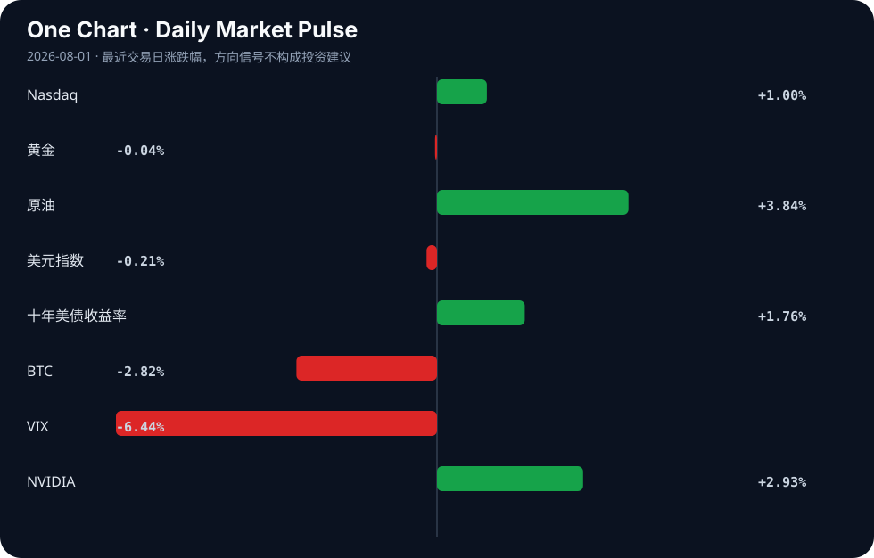

# Daily Intelligence
> 2026-08-01｜Saturday

## Today’s Thesis｜今日一句话
AI产业正从叙事驱动转向盈利与合规的双重约束，而全球宏观工业周期下行迫使政策干预加码，两者交汇将重塑资本的风险偏好与估值锚。

## ① Executive Summary｜30 秒
- **AI**：Anthropic有望迎来首季盈利[A14]与AI对冲基金崩溃[A16]并存，AI估值逻辑从“烧钱换增长”转向现金流验证。
- **商业**：一人公司借AI规模破百万[A21]与Snapchat拒推AI生成内容[A19]同现，AI的商业边界与价值分配被重新划定。
- **宏观**：7月PMI放缓呼唤增量政策[B13]，日本央行干预捍卫日元[B19]，工业现实走弱与金融防御交织。

## ② AI Daily

### 盈利分水岭：Anthropic的曙光与对冲基金的暗礁
**What Happened**
Anthropic销售额暴增，有望迎来首个季度盈利[A14]；与此同时，一家被誉为神童创立的AI对冲基金发生内爆与崩溃[A16]。

**Why It Matters**
市场正在对AI进行残酷的现金流测试。能够产生正向经营杠杆的模型提供商将获得持续性融资，而缺乏风控护城河、仅凭AI叙事杠杆的金融应用正在被出清。

**Second-order Effect**
资本退潮 → 现金流验证成为唯一估值锚 → 泡沫叙事破裂[A20] → 纯应用层AI公司面临并购或倒闭。

### 硬件与算法的底层突围
**What Happened**
AMD举办Advancing AI 2026，试图打破CUDA护城河[A13]；开源社区出现纯整数AI完成XOR且达99.7%准确率的从零实现[A2]。

**Why It Matters**
算力成本与软件生态锁定是当前AI最大的物理与经济约束。硬件替代（AMD）与极简算法（整数计算）正在从两端挤压英伟达与浮点运算的垄断溢价。

**Second-order Effect**
算力成本下降 → 边缘设备AI可用性提升 → Linux等开源系统借AI势能争夺桌面端[A1]。

### 合规高墙与地缘切割
**What Happened**
法官驳回X.AI对明尼苏达州AI裸体化禁令的阻止请求[A5]；美众院要求DoorDash说明使用中国AI模型的风险[A24]；耶鲁AI作弊争议升级为13项联邦诉讼[A7]。

**Why It Matters**
AI的法律与地缘边界正在迅速硬化。从内容伦理、数据安全到学术诚信，缺乏规则的红利期结束，合规成本正式进入损益表。

**Second-order Effect**
合规成本激增 → 模型本地化与碎片化 → 全球AI供应链加速脱钩。

## ③ Business Daily

### 科技：平台划定人机边界
Snapchat宣布不再聚焦AI生成内容[A21]，转而奖励“真实创造力”；而汤森路透自建跻身世界最佳行列的AI模型[A15]。平台正在向AI生成内容关上流量大门，而拥有专有数据的巨头选择将AI内化为核心资产，拒绝依赖通用大模型，中间层SaaS面临挤压。

### 医疗/消费：监管刺破增长泡沫
史上最严监管落地，医美行业高增长泡沫碎裂[B8]。依赖信息不对称和营销驱动的消费医疗，在监管透明度要求下，其粗放增长模式失效，行业进入合规成本驱动的集中度提升期。

### 制造：新旧动能分化
工业产出出现6年来首次萎缩[B2]，7月PMI阶段性回落[B13]。但部分行业生产经营活动预期升至60%以上高位景气区间[B22]，亚太地区工业竞争力正快速重构[B6]。传统制造去产能与新动能（高端制造/自动化）的韧性并存，政策发力点将精准倾斜于后者[B20]。

## ④ Macro Observation｜机制分析

**世界正在发生什么？**
全球工业周期步入实质性收缩（6年首萎[B2]，PMI放缓[B13]），同时地缘摩擦加剧（西亚战争风险，中美AI模型脱钩[A24]）。然而，全球贸易与风险资产尚未崩盘，形成了一个反常的“脱节”。

**为什么发生？**
AI繁荣正在充当宏观风险的减震器。AI投资对冲了传统经济的衰退预期，技术叙事吸收了原本应流向实体衰退的悲观资本[B17]。此外，日本央行在160关口干预日元[B19]，通过汇率防御暂缓了全球流动性危机的传导。

**资本如何流动？**
资本正从广泛的工业与新兴市场风险暴露中撤出，流入AI算力基础设施（硬约束）、高股息防御资产及政策确定性板块。日元干预与美债收益率攀升[B16]正在抽离套利流动性，BTC与黄金的分化表明资本在“通胀对冲”与“流动性退潮”间摇摆。

**接下来关注什么？**
关注中国增量政策的规模与传导效率[B13][B20]，以及日本央行干预的可持续性[B19]。若政策不及预期或日元防线失守，AI叙事对宏观衰退的对冲将失效，反身性抛售将启动。

## ⑤ Signal Dashboard
| 指标 | 最新值 | 今日 | 信号 |
|---|---:|:---:|---|
| [Nasdaq](https://finance.yahoo.com/quote/%5EIXIC) | 25,373.85 | ↑ +1.00% | 风险偏好改善 |
| [黄金](https://finance.yahoo.com/quote/GC%3DF) | 4,098.60 | → -0.04% | 中性 |
| [原油](https://finance.yahoo.com/quote/CL%3DF) | 86.80 | ↑ +3.84% | 通胀压力上升 |
| [美元指数](https://finance.yahoo.com/quote/DX-Y.NYB) | 99.80 | ↓ -0.21% | 外部压力缓解 |
| [十年美债收益率](https://finance.yahoo.com/quote/%5ETNX) | 4.75 | ↑ +1.76% | 成长估值承压 |
| [BTC](https://finance.yahoo.com/quote/BTC-USD) | 62,896.95 | ↓ -2.82% | 风险偏好降温 |
| [VIX](https://finance.yahoo.com/quote/%5EVIX) | 15.99 | ↓ -6.44% | 风险偏好改善 |
| [NVIDIA](https://finance.yahoo.com/quote/NVDA) | 200.75 | ↑ +2.93% | 风险偏好改善 |

## ⑥ Deep Insight

### 一人公司的繁荣与企业AI泡沫的破裂

当前市场对AI商业化的关注集中在巨头能否跨越盈利门槛，如Anthropic销售额暴增有望迎来首个季度盈利[A14]。然而，真正具有破坏性的结构性变化发生在微观层面：AI正帮助一人公司规模达到百万美元以上[A21]。这看似是AI赋能的胜利，实则是传统企业AI估值逻辑的掘墓人。当个体借助开源或廉价API就能完成过去需要一个团队和庞大SaaS基础设施才能实现的工作时，企业为“定制AI解决方案”支付溢价的意愿将急剧萎缩。

与此同时，合规与法律的高墙正在迅速竖起。明尼苏达州法官驳回X.AI的请求，维持AI裸体化禁令[A5]；耶鲁AI作弊争议演变为13项联邦诉讼[A7]；美国众议院要求DoorDash说明使用中国AI模型的风险[A24]。这些事件并非孤立，而是构成了一个严密的约束网络：地缘政治切割模型供应链，国内法划定数据与生成边界，机构规则重塑人机协作信任。

在此背景下，苹果“坐视一切燃烧”的旁观策略[A20]显得尤为理性。巨头在基础设施上的巨额资本支出面临回报率悬崖，而合规成本将迫使AI开发向少数能承担法律风险的巨型企业集中，或者向不依赖生成内容的边缘侧应用转移。Snapchat决定不再聚焦AI生成内容[A19]，正是平台对合规与信任风险的本能规避。

一人公司的繁荣[A21]与汤森路透自建顶级模型[A15]并不矛盾，它们分别代表了AI价值链的两极：极度的轻量化与极度的重资产。中间地带——那些依赖微调模型和行业通用解决方案的中间商——将被彻底挤压。AI泡沫的破裂不是技术的失败，而是商业模式的均值回归。

**反方观点**：一人公司只是长尾市场的边缘现象，无法替代大型企业对高可用、高安全、定制化AI基础设施的刚性需求；合规摩擦是阶段性的，随着监管框架成熟，开发成本将再次下降。

**证伪条件**：若未来6-12个月内，大型企业AI资本支出持续加速且中间层SaaS公司营收未出现明显下滑；或AI相关诉讼与监管处罚被高比例驳回、和解，则上述“中间地带挤压”与“合规成本永久化”的推断不成立。

## ⑦ Tomorrow Watch
1. 中国央行及部委针对7月PMI放缓出台的增量政策细则及市场反应[B13]。
2. 日本央行在160关口干预日元后的汇率波动及后续货币政策声明[B19]。
3. Anthropic季度财报的正式发布，验证其首个季度盈利的成色及收入构成[A14]。
4. AMD “Advancing AI 2026”大会上软件生态（ROCm）对CUDA替代路径的具体进展[A13]。
5. 美国众议院对DoorDash使用中国AI模型风险的听证会或调查报告推进[A24]。

## ⑧ One Chart

原油与美债收益率同步上行，而美元指数微跌，这种组合通常暗示滞胀预期而非健康增长。NVIDIA上涨与BTC下跌的分化，说明当前流动性在向AI算力核心资产集中，而非广泛扩散至高风险投机资产，相关性并非因果，但资金分流暗示宏观约束正在收紧。

## ⑨ Quote of the Day

> “Prediction is very difficult, especially if it’s about the future.”  
> — Attributed to Niels Bohr

**中文理解**：预测未来很难，所以更重要的是识别关键变量和更新机制。

**Why it matters today**：这句话不是装饰，而是今天观察 AI、商业和宏观变化时的一个思考框架：先看机制，再看价格；先看约束，再看叙事。
## ⑩ Action Items｜今天值得思考什么
1. **验证** Anthropic的盈利路径是否依赖不可持续的云厂商补贴或短期合同集中[A14]。
2. **追踪** 一人公司规模扩张对传统B2B SaaS定价权与客户留存率的实际侵蚀效应[A21]。
3. **比较** 明尼苏达州AI禁令[A5]与DoorDash中国AI模型质询[A24]的合规成本，评估跨国企业的地缘合规套利空间。
4. **关注** 日本央行160防线[B19]与中国PMI放缓[B13]的交汇点，警惕套利交易逆转引发的流动性冲击。
5. **思考** 苹果在AI泡沫破裂时的旁观策略[A20]，是否是当前硬件巨头面对算力过剩风险的最优资本配置方式。

## 信息边界
本报告事实来源限于提供的 Hacker News、Google News 等聚合源，可能存在二次转述偏差，重要判断请回溯原文验证。宏观与商业数据时效截至 2026年7月31日，市场数据（Signal Dashboard）反映最近一个交易日的收盘或近似值，不代表实时报价。未经验证的推断已在文中明确标注。

## Sources

### AI

- [A1：Ask HN: Which Linux distribution is capitalizing on AI momentum?](https://news.ycombinator.com/item?id=49129429) — Hacker News · AI
- [A2：Show HN: Integer-only AI complete XOR with 99.7% accuracy all from scratch](https://github.com/Mojo0869/ABSL) — Hacker News · AI
- [A5：Judge denies X.AI's attempt to stop Minnesota's AI nudification ban](https://www.ag.state.mn.us/Office/Communications/2026/07/31_xAI.asp) — Hacker News · AI
- [A7：How A Yale AI-cheating dispute became a 13-count federal lawsuit](https://arstechnica.com/tech-policy/2026/07/how-a-yale-ai-cheating-dispute-became-a-13-count-federal-lawsuit/) — Hacker News · AI
- [A13：Can AMD Break the CUDA Moat? AMD Advancing AI 2026](https://newsletter.semianalysis.com/p/can-amd-break-the-cuda-moat-amd-advancing) — Hacker News · AI
- [A14：打破AI烧钱魔咒！Anthropic销售额暴增 有望迎来首个季度盈利 - cls.cn](https://news.google.com/rss/articles/CBMiSEFVX3lxTE9FZ3J5WWVWb3ZmU1gtTnNjVVRWdWM1ZnpsUUhxZG9XU2k5UnBVekZsaURCaUViSTRuaHBZZWdURXI1MnczZ3QtLQ?oc=5) — Google News · AI 中文
- [A15：Thomson Reuters built its own AI model that now ranks among the best](https://www.thomsonreuters.com/en-us/posts/innovation/thomson-reuters-built-its-own-ai-model-that-now-ranks-among-the-worlds-best/) — Hacker News · AI
- [A16：Inside the Meltdown of a Wunderkind’s A.I. Hedge Fund - The New York Times](https://news.google.com/rss/articles/CBMilwFBVV95cUxNRWtVZk5sTGhfeHk1Vk9BVkxyT0NJRG9RNGNkYjItaUtteHlUX1lJT2M2YXcxQWdBb1VsQW5kRHVVMjNlSGpBRDVRcThadloyejNjNnlyLXZqektLVmZGZHJMeEhJNl9YdVZGM0RWci1FcUtBUnZjaFAyTnJWaU4xWHUzdTNUdWswQU5BaGVmdEp3Q2lCVmV3?oc=5) — Google News · AI
- [A19：Snapchat to no longer spotlight AI generated content](https://newsroom.snap.com/rewarding-authentic-creativity-on-spotlight) — Hacker News · AI
- [A20：Apple Will 'Watch Everything Burn' When AI Bubble Bursts](https://asymco.com/2026/07/31/apple-will-watch-everything-burn-when-ai-bubble-bursts/) — Hacker News · AI
- [A21：How AI Is Helping One-Person Companies Scale to $1M–and Beyond](https://www.wsj.com/world/how-ai-is-helping-one-person-companies-scale-to-1-millionand-beyond-5cfe84d5) — Hacker News · AI
- [A24：美众院两委员会致函外卖平台DoorDash，要求说明使用中国AI模型风险 - voachinese.com](https://news.google.com/rss/articles/CBMivAFBVV95cUxPREZlRW5UU0ZwU050YkptYmtKX2x5WXBRbzk5NFN5eUlTLWpUQnJNRXlTb3Q2X1k0T2hqZDRfYUJ3ZXNIT2VnZ0ZnLWtualkwWEltRGpnOEo3dVFSMU11UEpka29BRUhUMHRlYWU3MldiSTlUVDRhM3RsZU1iQVBtV0JsT0dXUFVTZjhod0c1Z2p2SllrSEtEOWRpTndKa1h6Ql9SZk9UOEt5ZjVGMzhnY1BxVXRJTzlMTExDS9IBvwFBVV95cUxOaGRzcXo0ZU9tYUNwRV9WLTJpdlBlUk5qYS00NzBSYVo3RlZGX0JjaHhfNlVoVmNQSGFnYVk1dGxnbHZjakhsR3JEMC1iVUR0dFgyb0pFSnp1XzlXanJ4LVlDNUFJTzc3VHZGNUd0aVVHUjExczN4MTNCVjloN0NDbHh4bWlVczAwMFJqODh0NXlHRmVMRnhfcVpXUVNsNjlwbmlpeFlCM0RkZ2FJZUlqQjVFcHN4Z3Y2dFc1SDdOSQ?oc=5) — Google News · AI 中文

### Business & Macro

- [B2：Industrial output shrinks for first time in 6 years - The Daily Star](https://news.google.com/rss/articles/CBMimwFBVV95cUxOVXNwT3IzVVlBVTFscGd6ZnB5enlBVF9ZNHJSWkhGU3hyQnhoWUpCYzY3N3BhOU9TdmcyTUtuZXpuM2d6OUdRZzZVLXVNNk1qbEkzR2JrX2dvMy1tWkNWcWx3TWkyQkFHS2hZNUU5WWFWTnVnaVBYc3hCMWgyQ2NCMHpFbFdxOUVOUUpyV2l4by1nR0lpSVQyZHJaOA?oc=5) — Google News · Global Economy
- [B6：Asia-Pacific's industrial competitiveness is changing fast - The World Economic Forum](https://news.google.com/rss/articles/CBMiyAFBVV95cUxOVEs4Ni1lVFROaGRZcU5TTzJoQXVuWkxCY1dDcDZoUG52cnd0VEJoVjNrUGFoNm1rU0QtU1YxZDZyUXNJWkg5NDl3cms3d2JKVGFhTUVCVkg3OXNXUjFRME15ZTdRZEd4MmFXOW9yYXZsUnl4V3E0eXV4N3JFck5DWVU2U2xyVEVOVTRHdE5QRFhqX2c5SkJGVngzT1NyWFg0SHJobHM1VmJ0VWkxT1pnUkw5bGVZb3NkUUc0dmFXTUZ3bkRtUXlNMw?oc=5) — Google News · Global Economy
- [B8：史上最严监管，医美行业的高增长泡沫，碎了 - 36 Kr](https://news.google.com/rss/articles/CBMiTkFVX3lxTFAwaHBhQWN4NzhLdE83RmxOSVh1SGZEMUdTWVdQdGZWanoyN0hqd3U0WWNpOGs5VmxvdkdRclBHT3dTQkhaeWl5OWtkLUg4dw?oc=5) — Google News · 行业
- [B13：7月PMI放缓，出台增量政策 - 新浪财经](https://news.google.com/rss/articles/CBMidkFVX3lxTE1xUUl0Q292QU1YU09iM0dKc2hOVVE0cDg3Qjl1UlFXM1NXenNVbHNGMTNYME1Wd3RSWW13aEdMRXg3aDlXM0diWVhoLWtuS2hyM1R3NFA3dXJHMDRDckxlemR3Y28xNEQ0T2dYQk9PeHNlZWFUdHc?oc=5) — Google News · 行业
- [B16：Japanese Yen: BoJ Patience Keeps USD/JPY in a Wide Trading Range – TD Securities - CryptoRank](https://news.google.com/rss/articles/CBMinAFBVV95cUxPWWpOQzZfTUIyY2JDcmREZ0h1cXhMelgzWk5RbG1yaXpMb3lFbzMtTVBmOVJCXzZ0S3AxYWhaVExxeExnVWpsVE9jZGhPTkVSOTdkVTdjVHNJS0hUMFJTMEZ4a0F0QXJ5UzhWX3cySk9BcW8teU4tVG50ZHREVUltemE5QXV5TXo5Q0daRTg0VGRsdGk5R0lDN2d0YnM?oc=5) — Google News · Markets Policy
- [B17：AI boom shields global trade from West Asia war - financialexpress.com](https://news.google.com/rss/articles/CBMipgFBVV95cUxQM1I1VU5lXzlkSEZDN1VFZm1ER0QxTnY5clZvNGZxeGtGNVJrZGI5S18yN0lNWUUzR2RFeV94dVdiRnYxZENCWFptY2hYVlFOMWFDREQ2enNKUEE2ejJnamI3bE1jUi12TC1OWHhwYnd0LWRTQVp6NnVjMEZLVGZMUE5XQXFyX1I2Z1BlemttcjVKY3YyTXpwOTV3cEFsQnJaeUNxMjNn0gGsAUFVX3lxTE0yTmZRV1YzX0NUSzdBcUpWYVFMN3h4RjlGZXZ1MkdUWHJsa3h3TGZaUWhLN0xpMk5ETkduZGNrUjhXTUFZcFVRdVFOZUJGV1dTZHg4Mk5IQ21MQnpFQ1h2VzV6dGpSdXJsMnJxLWJNM3J1al9NXzdTelo2ZXhiTXhORWV2dFFyVUVhSWp1WUpLclpiMUVzRkd2U2hjYnhHSURyaU9aWFd5ODljM0E?oc=5) — Google News · Global Economy
- [B19：BOJ intervenes to defend yen near 160, holds rates steady - TradingView](https://news.google.com/rss/articles/CBMivAFBVV95cUxQTV9yZnZNa25KOGQxOEY5V3VlSW1oaTNrRmh2OFpaRlpfTF9tTGplT19lUFFFaGIyUDA2bGZobmFaS0xCNTJ2Z0FDSXBjOFlfZTBRY0pJVzlqQXVoR0FvakpZbWdxUUdCR0ZHNHVNbFVqNFFlcDNNLWlFb3R1LXNabHpRTVpldnpUdTBXQmppcHhuMENZT1ZlNUxxczBWR1ZVbFpfbDgyUEJIanZ5MlJKWmJEZDhTOC1hX1I0MA?oc=5) — Google News · Markets Policy
- [B20：政策发力提效 推动经济持续向新向优向好发展 - Sohu](https://news.google.com/rss/articles/CBMiiAFBVV95cUxNOHQwcFpkazEydnhiWnVYSEcwTTFQVVlYc1FJMVNWV24zSkhCZ2E1X2J0THBpQXE5YUc5QURHRmFzUWxqVzBCb1NIdVhsaHNLU0Qxajh3dW1BNzJvZWk3T3J4a011Zm1UbVhHRzhoN2JPNzktZ3k4WUQ4XzEtaTJnSHlRUnczRHhB?oc=5) — Google News · 行业
- [B22：超60%！这两个行业生产经营活动预期为何升至高位景气区间 - Sohu](https://news.google.com/rss/articles/CBMiiAFBVV95cUxQemN1T2ZnMTNaTFN0UFlkSDQtSllpb2EzWlAtYTdyQVNKXzB2Wkx0NzJIbEJ5bi1JN2Zvc1BqWEdYa1NyTmxmbGYwSU9OZWpfSGlpaFp6dU1qcUhiMTJvMnZWQlJWVDZSRktfNFdVSExmaDdZc2h1YjNfWTlhVkJBMnZMZU41eWQx?oc=5) — Google News · 行业
