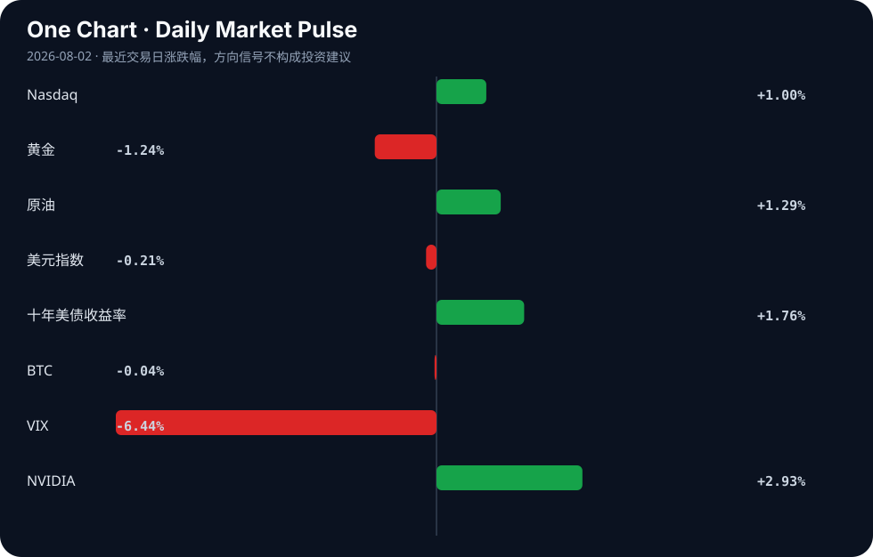

# Daily Intelligence
> 2026-08-02｜Sunday

## Today’s Thesis｜今日一句话
AI 的叙事正从“劳动力替代”转向“资源与基建重构”，资本加速涌入算力基建与边缘数据，而劳动力市场的真实压力不是失业而是薪资重估。

## ① Executive Summary｜30 秒
- **AI**：AI 对就业的真正威胁被证实是薪资下降而非失业 [A14]，同时 AI 数据需求导致珍稀书籍被毁以喂养模型 [A11]，引发数据供应链伦理危机。
- **商业**：全球供应链重构加速，越南进出口额望破万亿美元 [B10]，孟加拉国与加拿大争夺芯片与关键矿产的技术经济底座 [B9][B4]。
- **宏观**：美日联合干预汇市支撑日元 [B7]，同时多国政府采用冻结燃料价格等行政手段缓冲能源冲击 [B17][B24]，逆周期调节与汇率干预并行。

## ② AI Daily

### 1. 劳动力价值重估：降薪先于失业
**What Happened**: 新研究指出，AI 对工作的真正威胁是降低薪水而非直接导致失业 [A14]。
**Why It Matters**: 颠覆了“AI 替代工作”的显性恐慌叙事，将焦点转移到劳动力购买力收缩这一更隐蔽、更长期的系统性风险上。
**Second-order Effect**: 薪资下降 → 个体更依赖 AI 工具提效保岗 → 岗位技能溢价被稀释 → 薪资进一步承压。

### 2. 数据供应链的物理掠夺
**What Happened**: 澳大利亚书商发出警告，珍稀书籍正被大量销毁以供给 AI 训练数据 [A11]。
**Why It Matters**: 揭示了合成数据瓶颈下，AI 对长尾、高质量人类数据的掠夺已触及文化遗产底线，物理孤本的消亡意味着知识定价权的永久转移。
**Second-order Effect**: 稀缺物理数据被毁 → 数据垄断加剧 → 闭源模型掌握唯一知识源 → 开源与闭源的知识代差固化。

### 3. 算力基建的地缘转移
**What Happened**: 墨西哥成为美国 AI 繁荣的意外基石 [A2]，同时中国国资基金抢滩 AI 基建 [A13]。
**Why It Matters**: 算力需求正重塑北美与亚洲的产业地理，近岸外包与国资主导成为算力基建的两大分流路径。
**Second-order Effect**: 地缘算力依赖形成 → 能源与电网协议重写 → 数据中心选址成为国家博弈筹码。

## ③ Business Daily

**科技/制造**：全球供应链正向上游基础材料与芯片代工延伸。越南 2026 年进出口总额预计突破 1 万亿美元 [B10]，孟加拉国正评估进入万亿芯片市场的可行性 [B9][B13]，加拿大则将关键矿产确立为其技术经济的基石 [B4]。在亚洲，日立等日本企业因高利率环境下的 AI 基础设施需求而受到资本追捧 [B15]。

**能源**：AI 算力推高电力需求 [A18]，而现实能源冲击正迫使政府出手。约旦政府冻结燃料价格以保护国民经济 [B24]，经济学家认为此举有助于工业部门维持活动 [B17]。行政限价与 AI 数据中心的刚性用电需求叠加，正在扭曲全球能源定价机制。

## ④ Macro Observation｜机制分析

**世界正在发生什么？** 汇率干预与行政限价并行。美国财政部在日本干预后介入支撑日元 [B7]；约旦等新兴经济体通过冻结燃料价格切断全球能源冲击的传导 [B24]。

**为什么发生？** 全球资本流动失衡导致日元极度承压，触及金融系统稳定底线；而地缘冲突与 AI 算力激增推高了底层能源价格，直接威胁新兴工业国的生产成本与基本面。

**资本如何流动？** （推断）资本正从需行政干预保稳定的脆弱市场，流入具有基建确定性的市场（日本 AI 基建 [B15]、中国国资 AI 基金 [A13]）及近岸外包地（墨西哥 [A2]、越南 [B10]）。

**接下来关注什么？** 日元干预的持续性及美债收益率联动；行政限价解除后的通胀补跌风险；AI 数据中心对当地电网的实际负荷冲击。

## ⑤ Signal Dashboard

| 指标 | 最新值 | 今日 | 信号 |
|---|---:|:---:|---|
| [Nasdaq](https://finance.yahoo.com/quote/%5EIXIC) | 25,373.85 | ↑ +1.00% | 风险偏好改善 |
| [黄金](https://finance.yahoo.com/quote/GC%3DF) | 4,049.10 | ↓ -1.24% | 避险需求回落 |
| [原油](https://finance.yahoo.com/quote/CL%3DF) | 84.67 | ↑ +1.29% | 通胀压力上升 |
| [美元指数](https://finance.yahoo.com/quote/DX-Y.NYB) | 99.80 | ↓ -0.21% | 外部压力缓解 |
| [十年美债收益率](https://finance.yahoo.com/quote/%5ETNX) | 4.75 | ↑ +1.76% | 成长估值承压 |
| [BTC](https://finance.yahoo.com/quote/BTC-USD) | 62,788.02 | → -0.04% | 中性 |
| [VIX](https://finance.yahoo.com/quote/%5EVIX) | 15.99 | ↓ -6.44% | 风险偏好改善 |
| [NVIDIA](https://finance.yahoo.com/quote/NVDA) | 200.75 | ↑ +2.93% | 风险偏好改善 |

## ⑥ Deep Insight

**AI 的隐性剥削：薪资重估与数据掠夺的双螺旋**

当前关于 AI 冲击的公共叙事，大多停留在“机器替代人类工作”的显性恐慌中。然而，今日的两条底层信号揭示了更隐蔽、更具破坏性的机制：AI 对劳动力的剥削不在于剥夺工作机会，而在于剥夺工作的定价权；AI 对知识的剥削不在于复制，而在于对物理知识载体的销毁与垄断。

新研究明确指出，AI 对工作的真正威胁是降低薪水而非直接导致失业 [A14]。这是一个典型的“竞底机制”：AI 并未让岗位消失，而是将岗位拆解为被 AI 增强的微任务，从而打破了原有职业的技能护城河。当员工被迫使用 AI 提效以保住工作时，其超额产出被雇主和工具提供商捕获，而劳动力本身的议价能力被稀释。这形成了一个自我强化的闭环：薪资下降 → 依赖 AI 提效保岗 → 岗位价值被进一步拆解与稀释 → 薪资继续下降。

与此同时，在数据供应链的源头，一场更不可逆的掠夺正在发生。澳大利亚书商警告，珍稀书籍正被大规模销毁以喂给 AI 模型 [A11]。在合成数据触及性能天花板之际，大模型对高质量、非数字化、长尾人类知识的渴求达到了饥渴状态。销毁物理书籍以提取数据，不仅是文化遗产的损失，更是知识定价权的永久转移。一旦物理孤本被毁，其承载的独有知识便只存在于闭源模型的权重中，人类将永远失去对这些知识的公开验证与修正能力。稀缺物理数据被毁 → 数据垄断加剧 → 开源与闭源模型的知识代差固化。

这两个看似独立的趋势——劳动力的薪资重估与物理知识的数据化掠夺——正在形成双螺旋。劳动者用被压低的薪水，去消费那些用他们自己被销毁的公共知识训练出来的 AI 服务，而 AI 厂商则同时收割了劳动者的廉价劳动和免费的数据资产。

反方观点认为，AI 将创造大量高薪新岗位（如 AI 伦理官、提示词工程师）以抵消降薪效应，且数字复用不会真正耗尽物理书籍，反而会提升其稀缺性溢价。证伪条件：未来 6 个月内，非 AI 核心岗位的薪资中位数若止跌回升，则降薪竞底机制不成立；若珍稀书籍交易价格因 AI 数据需求暴涨而非被销毁，则数据掠夺逻辑不成立。在证伪之前，这一双螺旋机制值得所有依赖专业知识生存的个体与组织高度警惕。

## ⑦ Tomorrow Watch
1. 验证日元兑美元汇率是否在美日联合干预后稳定在干预线以上 [B7]。
2. 追踪约旦及类似采用行政限价国家的燃料储备与财政补贴消耗速度 [B24]。
3. 关注越南官方发布 2026 年上半年进出口总额数据，验证是否逼近万亿美元门槛 [B10]。
4. 观察澳大利亚及全球书商针对珍稀书籍被毁的集体诉讼或立法动议 [A11]。
5. 验证 MIT 研究中提及的 AI 理财建议效果，在主流券商 App 中是否引发新功能上线潮 [A6]。

## ⑧ One Chart

图表显示风险资产（纳指、英伟达）与避险资产（黄金、VIX）呈现明显的反向运动。这反映了市场在利率高位（十年美债收益率 4.75%）下，资金在科技成长与避险逻辑间的短期再平衡，但相关性的持续性需视下周宏观数据而定，不可将此短期相关性视为长期稳态因果。

## ⑨ Quote of the Day

> “The greatest danger in times of turbulence is not the turbulence; it is to act with yesterday’s logic.”  
> — Peter Drucker

**中文理解**：动荡时期最大的危险不是动荡本身，而是继续用昨天的逻辑行动。

**Why it matters today**：这句话不是装饰，而是今天观察 AI、商业和宏观变化时的一个思考框架：先看机制，再看价格；先看约束，再看叙事。
## ⑩ Action Items｜今天值得思考什么
1. 思考：你所在行业的薪资结构是否正被 AI 工具的普及暗中压低，而非岗位被直接裁撤 [A14]。
2. 验证：企业内部的知识库或物理档案，是否正被低价收购用于 AI 训练，评估其长期知识资产损失 [A11]。
3. 比较：越南、孟加拉国等新兴制造国在芯片与基础代工上的承接能力差异 [B9][B10]。
4. 追踪：美日汇率干预后的资本流动数据，判断是短期投机平仓还是长期头寸转移 [B7]。
5. 关注：各国针对 AI 数据中心高能耗的电网政策与补贴，寻找基建合规套利空间 [A18]。

## 信息边界
本报告来源覆盖 Hacker News、Google News 等英文与中文聚合端，时效截至 2026 年 8 月 1 日晚。市场数据为最近交易日快照。新闻来源多为二手聚合，重要推断与信号需读者回溯原文验证。未引入任何外部事实或未提供材料支持的数据。

## Sources

### AI

- [A2：Mexico became a surprise cornerstone of America's AI boom](https://www.ft.com/content/ac3274ac-86ca-46ac-bc7b-029fb9dcd173) — Hacker News · AI
- [A6：From MIT: AI financial advice is surprisingly good](https://mitsloan.mit.edu/ideas-made-to-matter/ai-financial-advice-surprisingly-good-especially-if-you-ask-right-questions) — Hacker News · AI
- [A11：Book sellers raise alarm over 'horrific' destruction of rare titles to feed AI](https://www.theguardian.com/technology/2026/aug/02/australian-book-sellers-alarm-destruction-rare-titles-ai-supply-chain) — Hacker News · AI
- [A13：上半年AI热钱涌动，国资基金抢滩人工智能｜2026张江AI小镇生态日现场侧记 - 财联社](https://news.google.com/rss/articles/CBMiSEFVX3lxTE5rTE5hdFRhVEI1V3RPSkVHQ2MwTl91WUNWQV9RMUJ5YmE2S0R3bEFJc3g2c18wakVuU1ZHWjNFSUczaVFiMWo2dQ?oc=5) — Google News · AI 中文
- [A14：AI's real threat to jobs isn't job loss, it's lower paychecks, new research says](https://www.businessinsider.com/ai-could-lower-workers-pay-job-market-impact-2026-7) — Hacker News · AI
- [A18：Why Artificial Intelligence Data Centers Are Powering the Future of Digital Infrastructure Through High Performance Computing, Sustainable Innovation, and Intelligent Cloud Ecosystems - Spherical Insights](https://news.google.com/rss/articles/CBMiwwJBVV95cUxQLWIwU3R3SW1KV3IzdzZkNk0zZ0ZjVG13YW1tUzlJcXJIcl9wM2tnUFFpWUVRUlpBQ0dXWmIxZVZLeFNUcG1OdHdHQVR5aEZhWVRmVTdkQklzd1hFVGpORWNaV1A5WWNHalE0V1VfMTEyZlJpQzZSdGl2NFF0c3VYWnprZHJhTTRMNzhJYmVkVExZOFI2T0tQem9sR0UxbU9fMXFuZUU3OVh3Q2F1R08zaDdMN3M2d2NURjhSMHJNOXhhbF9pamlRMzBXSEp3MmVQdkZ4QkpCS1JqRkpVXzR5QVdKWEtUUVJUSWx6TlhWdURjOW9vOThBTEJjd2J1OWtjdE5qNHd4Y0pvSlJ3UkhxbHNER1hCUFYzSlJ5bzM1b3VySU8wLU9mMUJRaThrUENGU2VaLURlWHRWdXJOalBUTUdqRQ?oc=5) — Google News · AI

### Business & Macro

- [B4：Canada’s minerals are becoming the foundation of its technology economy - Digital Journal](https://news.google.com/rss/articles/CBMirwFBVV95cUxOOWNBWmF4VXR3VU5YTmE3cTZTMlpqVjVKSGlvbm9fS2VOR2YzY0MtSy1kZ05ZQW1ZR2U0VkFHdXA4MWRVUGlwc3JvaklMUnRNTDlYRlFwZTNkX0hSM191NXRGS1dydjh5RDZ3dkNHdXNlck41RWxwUkVrUXlRUXFMQzlUUlBMQjlqdG9oSGNma1NjVVNWdl9ibkZQUkZYbzQyWHVGMmJQeGRzN2hfdDdj?oc=5) — Google News · Technology Business
- [B7：US Treasury intervenes to support yen after Japan steps in, FT reports - Reuters](https://news.google.com/rss/articles/CBMisgFBVV95cUxQU0lVZ3FOWEp0MkVGaWc4UkprSmVwZlZMSzBQRlBuQ3UzOEVuN09za080MDFQTHFfOVFGU1hsOUF3THBnbGc0Tk4zdi1sR0xBdHhJV3FiOTNmaEZkbWNWQ0VMRjROZXJUQ1VwX1BrS3NvdWRDYThPSWVhdnhZUmxHWHNsVEFRYTZFXy1CeTJVdW13SVpqcl9wdTBoRjdINnV6R0tEcTI3Qnpjc3RpLWxQOVVB?oc=5) — Google News · Markets Policy
- [B9：Is Bangladesh ready to build semiconductor chips? - The Daily Star](https://news.google.com/rss/articles/CBMisAFBVV95cUxOUUxBeEN6SUJFek8tYUZtaW9ZQ3ZtMUJWRFdrUnBlX3JMdzVRTEJ5MUdXUGRUUDlEOVBHTzlSMTJRbjNST3N3cC1mdEFBNEZjaVNaT0RWNGloTkE5VVl3WnNoTUxLczBHblB2TWtqNW9aRmhyOFNTQUJOX0dpLTVkSVExd05abDAybzdNaWJ4TGRnbDJYRW9SWjlCSVhjb2JHRmp5dlhqM0JScDFHSkFEMA?oc=5) — Google News · Global Economy
- [B10：Vietnam's total import and export turnover in 2026 could exceed US$1 trillion. - Vietnam.vn](https://news.google.com/rss/articles/CBMisgFBVV95cUxNYXNHY3VqRDA0a2xrVFBUbVBOYkFDcktIbWZZTkUzMmhmaVJ0N1dKUndYX3hvbTE4Y09RbmlzNnNGRjV5WDBrQjZhVUlHLVBXazZ2ckxUbGF1VDY2RzlZRERjZENwQnl2V0pvLWZRTU15RHJjTDhmTW1raGwza2E1UzduNmE4SndUazVzMnpGMndFelFfcmNjc0VLelFsUGVaUkZTVzZvVkhpa24tVmtNVFZB?oc=5) — Google News · Global Economy
- [B13：Bangladesh Eyes a Share of Trillion-Dollar Chip Market - Daily Observer](https://news.google.com/rss/articles/CBMiSkFVX3lxTE1CTEF4ZnFHLUZmRE55dTMtbU9GNVVLcjJoakc1Y1IwWF9vZm1pVExpd19MSmtvQXk5cGZRSlcwY05lRXhoSGNPOGNn?oc=5) — Google News · Global Economy
- [B15：Hitachi Stock Leads 3 Japanese Picks Built For Higher Rates And AI Infrastructure - simplywall.st](https://news.google.com/rss/articles/CBMizwFBVV95cUxNcjFRck4zS2hxRzZ2bkc0OWR5TWpOVnVGMjJuS2dDc1NtVTBtMGRwNnF4dEZPQzQtWm9MQllIOUd3UDZfczljSTFvWVQ1MmZOMU5tU1VmZWdJTEQydmNKYmN6cGtmdUJWV1llcElDczd3VDFUUDhnR21Gc0piZ2xGWk4wV3BSOGtlOWpILTBUbXdvOUtDWm9jZjlnM2YzeHhqYUZjVXVmSkJRR2htcnVoekRqRlBRSWdQNFZkdHQ0QlpuZjZIT1RLZXBJQVgybFXSAdQBQVVfeXFMUHVWTDVyZWc0R1hQWkF5OC1hZFZfTkJiY3VPNm5CTkw3eUFpcVhuXzFEZXJ1Tk5yYUZKaU1STElEUUE5d05fY1pMV0l4QkNVSHotZlc0SGhkVjgwbnNwcEl0V3JtUGxlN3dVdlVfZTVHYVRjTmtkcXFGel9YcnBURlk0ZVdaaUtTNjhpVmVIX0RLSElQN1E1S1V5NUUyb194d21zM3F6N2o1Uy0tQ01kcDBTSjU0ODM4bmdCU3plS0NwM29XanNHQXFVanlMWHlXak8xdGc?oc=5) — Google News · Technology Business
- [B17：Economists: Freezing Fuel Prices Empowers Industrial Sectors to Sustaining Activity - jordannews.jo](https://news.google.com/rss/articles/CBMizwFBVV95cUxNWnZfdGROU0hnalU5cDN4d2hnWTFFdURPcnJ1VjdldHo5VEI3cmNNX0puc0tCY1NDaDNoNTItZ25YUkdVd21kQ3RCYWZjUVZ4RzltTXJGNGRyOU50Q2h0ajhGOGV2cVBaVVB2elpzTUtzOEJRT1U1dm8tS29mM0lFTi1iSFdZVkVaOW5FS0NmOWpxVXNKY0ZUQk94TDhzd1FwWUZ0NGM2UVNUNmZndDc2MWlGQTVuUW5OcUstVVUxaW9mWW5xM1p2bEFZSnRhSWs?oc=5) — Google News · Global Economy
- [B24：Government Freezes Fuel Prices to Cushion Global Energy Shocks and Protect National Economy - وكالة الانباء الاردنية](https://news.google.com/rss/articles/CBMivAFBVV95cUxQTVlSYzlmVHVDSVZONjdYTXItdXBtV0w3SVEwcW5RUWdqYXBfLWNpdkhJbndxNlpsZ2hzdk9ldXdoYWNKdkJWT1lxMEpyODlZR3YxMHg2bU5KLTdnRENKLTJXUWtxeFhPcDlINFVSd21abnRxQ0FubHBYNHlRZzV5eFVPbkVDZUl2ZDd0T1MwVUl0S0NjWnk4NmRjZ0FDOXhKWTRoS3dHTEVMMkF4WDcxcW1xMGJ5RU1pcEwxNg?oc=5) — Google News · Global Economy
