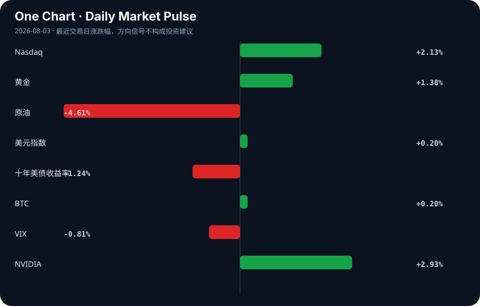

# Daily Intelligence
> 2026-08-03｜Monday

## Today’s Thesis｜今日一句话
AI竞争的决胜点正从模型规模转向基础设施的生产级可用性，而全球监管的分化（欧盟强制透明、美国自愿测试、中国开源生态）正在重塑资本与技术流动的路径。

## ① Executive Summary｜30 秒
- **AI**：AI基础设施从原型走向生产，开源运维的隐性成本成为核心瓶颈，资本加速涌入“词元工厂”与上下文层 [A2][B15][A21]。
- **商业**：高端算力价格持续上行，驱动企业向具有明确软件边缘的AI标的集中；医疗与新能源领域出现显著并购与垂直整合 [B15][A11][B6][B16]。
- **宏观**：全球政策与实体信号背离——ISM制造业景气度创4年新高，但央行政策不透明性加剧，高利率对农业等脆弱部门的打击正在显现 [B22][B19][B9]。

## ② AI Daily

### 欧盟AI法案透明度新规生效
**What Happened**：欧盟人工智能法案透明度条款正式生效，所有AI生成内容与深伪技术必须进行明确标识 [A8]。
**Why It Matters**：这为AI原生公司设定了硬性合规边界，迫使应用层和“上下文层”在架构设计上默认内置可追溯性 [A21]。
**Second-order Effect**：合规成本上升 → 欧盟市场对无溯源能力的美/中闭源API摩擦力增加 → 加速欧洲本土化或开源权重模型的替代进程 [A10]。

### AI基础设施的“生产级”现实检验
**What Happened**：开源AI基础设施（推理、编排、可观测性）在向生产环境迁移时，暴露出运维成本与复杂度远超原型的痛点 [A2]。
**Why It Matters**：概念验证阶段结束，自建与托管服务的总成本权衡决定了企业AI的真实采用率。
**Second-order Effect**：运维摩擦力增加 → 企业放弃自建转投托管AI网关（如9router等） [A7] → 缺乏企业级支持的开源栈被边缘化。

### 地缘政治下的模型路线分化
**What Happened**：Hugging Face CEO指出中国正凭借开源生态赢得AI竞赛，而美国闭门造车恐将落后；中国AI实验室正下注四个截然不同的方向 [A5][A13]。
**Why It Matters**：围绕开放权重的“AI宣言之战” [A10] 本质是对全球开发者心智份额与下游应用数据流的争夺。
**Second-order Effect**：美国管制/闭源模型收紧 → 中国加速开源权重生态与“AI共产主义”产业政策 [B10] → 全球AI技术栈走向双轨制。

## ③ Business Daily

**科技/算力**：高端算力价格持续上行，多家上市公司开始布局“词元工厂” [B15]。同时，AI人工智能ETF平安（512930）份额单日增加4400万份，最新规模达29.54亿元 [A3]，显示在基础设施运维痛点显现的当下 [A2]，资本依然在裸做多AI算力底层。

**医疗/制造**：BWXT以最高8亿美元将医疗业务出售给Nordic Capital [B6]；Tandem PV收购nexTC将太阳能涂层技术内部化 [B16]。这反映了在高利率与产业调整期 [B2]，企业通过剥离非核心资产与垂直整合来锁定利润率与供应链安全。

**宏观/工业**：“铜博士”发出繁荣信号，ISM PMI触及4年高位 [B22]；印度6月工业产出达到7.3%的23个月新高 [B23]。物理世界的工业韧性仍在，与金融条件的紧缩预期形成对冲。

## ④ Macro Observation｜机制分析

**世界正在发生什么？** 实体经济（采矿业景气度、亚洲工业产出）展现出强劲扩张 [B22][B23]，而金融条件因央行政策的不透明而持续紧绷 [B19]。

**为什么发生？** 供应链重构与能源转型带来的实物需求，正在与利率敏感部门（如农业 [B9]）脱钩。资本对“政策不透明”的定价不足，导致风险溢价被压抑在低VIX表象之下 [B19]。

**资本如何流动？** 资本正流向政策庇护所与硬资产：白宫明确支持稳定币并寻求破冰 [B11]；算力作为新型硬资产持续吸引资金 [B15]；黄金因避险与通胀对冲需求走强。

**接下来关注什么？** 联储政策模糊度与市场抛售之间的反身性反馈循环。若高利率对实体部门的打击（如农业、能源出海 [B2][B9]）传导至信贷端，可能触发“政策不透明 → 信任流失 → 抛售 → 流动性危机”的负向循环 [B19]。

*(事实：ISM PMI创4年新高、印度工业产出7.3%、RBI维持利率5.25% [B5]；推断：实体与金融经济脱钩、政策不透明将引发抛售)*

## ⑤ Signal Dashboard

| 指标 | 最新值 | 今日 | 信号 |
|---|---:|:---:|---|
| [Nasdaq](https://finance.yahoo.com/quote/%5EIXIC) | 25,913.90 | ↑ +2.13% | 风险偏好改善 |
| [黄金](https://finance.yahoo.com/quote/GC%3DF) | 4,105.10 | ↑ +1.38% | 避险/通胀对冲增强 |
| [原油](https://finance.yahoo.com/quote/CL%3DF) | 80.77 | ↓ -4.61% | 通胀压力缓解 |
| [美元指数](https://finance.yahoo.com/quote/DX-Y.NYB) | 100.00 | ↑ +0.20% | 金融条件偏紧 |
| [十年美债收益率](https://finance.yahoo.com/quote/%5ETNX) | 4.69 | ↓ -1.24% | 利好久期资产 |
| [BTC](https://finance.yahoo.com/quote/BTC-USD) | 63,611.01 | ↑ +0.20% | 中性 |
| [VIX](https://finance.yahoo.com/quote/%5EVIX) | 15.86 | ↓ -0.81% | 市场稳定 |
| [NVIDIA](https://finance.yahoo.com/quote/NVDA) | 206.64 | ↑ +2.93% | 风险偏好改善 |

## ⑥ Deep Insight

### AI 生产级落地的“隐性税”：从词元工厂到合规与运维的代价转移

当前市场正被一种乐观叙事主导：高端算力价格持续上行，企业竞相布局“词元工厂”，AI ETF份额激增 [B15][A3]。表面上看，这是需求远超供给的典型繁荣信号。然而，将视线从算力基建移向应用终端，会发现一个极易被忽略的机制——AI正在从“实验室原型”向“生产级系统”跨越，这一跨越产生的隐性税，可能正在侵蚀词元工厂的边际收益。

首先是运维的隐性税。开源AI工具在测试阶段极易跑通，但进入生产环境后，推理、编排与可观测性的复杂度呈指数级上升 [A2]。企业必须面对一个残酷的权衡：是耗费巨资自建运维团队，还是向托管服务商妥协并让渡数据控制权？这种摩擦力直接挑战了Hugging Face CEO所倡导的开源胜利论 [A5]。如果开源栈的运维成本无法下降，闭源API的“黑盒但省心”优势将在生产阶段重新放大，所谓的开源生态胜利可能仅停留在权重分发层，而非真正的企业计费层。

其次是合规的隐性税。欧盟AI法案透明度新规的生效 [A8]，不仅仅是法律条文的落地，更是对系统架构的强制干预。要在生成内容中实现全链路溯源与显式标识，意味着词元工厂的输出不能是黑盒流，必须嵌入合规元数据。这要求AI原生公司在上下文层进行额外投资 [A21]，而这部分投资不产生直接算力收入，属于纯粹的合规成本。

由此形成了一条关键的因果链：算力规模扩张（词元工厂） → 生成数据激增且无序 → 生产运维与合规溯源要求骤升 → 托管与合规架构成本吞噬算力红利 → 行业利润向少数提供全栈托管与合规解决方案的巨头集中。

**非共识视角**：当前的算力涨价并非永久性护城河，而是供需错配的临时摩擦。真正的瓶颈不是算力不足，而是“缺乏低成本将算力转化为可靠且合规的生产力”的通道。谁掌握了从裸算力到合规生产力的转化接口，谁才拥有下一阶段的定价权。

**反方观点与证伪条件**：反方认为，算力就是新时代的石油，只要规模足够大，运维与合规的边际成本将趋近于零，词元工厂本身即是终局。**证伪条件**：若未来12个月内，开源编排与可观测性工具（如Hedgehog等工作流 [A12]）能够实现一键式生产级部署与合规自证，使得中小企业运维成本断崖式下降，则“运维与合规隐性税”逻辑被证伪，词元工厂的纯算力护城河成立。

## ⑦ Tomorrow Watch
1. 美国政府针对高级AI黑客能力的自愿性安全测试规范具体文本发布 [A6]。
2. 日本央行会议纪要发布，观测日元干预高点后的货币政策预期变化 [B17]。
3. 高端算力价格走势，验证“词元工厂”扩产是否能缓解供给瓶颈 [B15]。
4. 联储主席政策表态，监测Mark Zandi警告的“政策不透明引发抛售”是否开始定价 [B19]。
5. 欧盟市场首批因AI透明度新规 [A8] 而下架或整改的AI应用案例。

## ⑧ One Chart

图表显示了近期科技股反弹与黄金走强的同步并存。这种风险资产与避险资产同向上涨的现象，暗示市场在定价通胀压力缓解（原油大跌）的同时，仍在购买黄金对冲政策不透明性与地缘摩擦的尾部风险，两者共存而非互斥。

## ⑨ Quote of the Day

> “Compound interest is the eighth wonder of the world.”  
> — Attributed to Albert Einstein

**中文理解**：复利的力量来自时间、持续性和不被中断的积累。

**Why it matters today**：这句话不是装饰，而是今天观察 AI、商业和宏观变化时的一个思考框架：先看机制，再看价格；先看约束，再看叙事。
## ⑩ Action Items｜今天值得思考什么
1. **追踪**开源AI基础设施项目在向生产环境迁移时的运维成本拐点与弃用率 [A2]。
2. **验证**欧盟AI法案透明度新规对API调用模式及上下文层架构的实际冲击 [A8][A21]。
3. **比较**中美AI路径分化：闭源安全测试（美）与开源生态驱动（中）在企业级账单端的真实转化率 [A5][A6][A13]。
4. **关注**“词元工厂”算力涨价与AI ETF份额激增之间的资本传导效率及潜在泡沫 [A3][B15]。
5. **思考**在ISM PMI高景气与联储政策不透明并存的宏观环境下，实物资产与久期资产的配置平衡点 [B19][B22]。

## 信息边界
本报告基于2026年8月3日至4日聚合的新闻源与Hacker News讨论生成。市场数据为最近交易日收盘值，存在时差延迟。部分新闻源为二手聚合，重要推断（如运维成本拐点、合规隐性税、政策引发抛售）需回溯原文验证。未包含非材料提供范围内的公司财报或未公开宏观数据。

## Sources

### AI

- [A2：How are you operating AI infrastructure in production?](https://news.ycombinator.com/item?id=49163280) — Hacker News · AI
- [A3：8月3日AI人工智能ETF平安（512930）份额增加4400.00万份，最新份额48.33亿份，最新规模29.54亿元 - 手机新浪网](https://news.google.com/rss/articles/CBMigwFBVV95cUxQMmtkdmVtdkJ2bUx1SjVqXzZvS0VOUzF1UVZIVzdjeVdrMVEzNkIwczh6c252ZjgyaE5nZmN3UEhsSkJfSGR6TldONDJORWhKbWQzYVRoakpwc1FzYzVXby1JQVYwVVFDVE9jUVdydWdzc0VxV19WaVdYbUx6RFcyaFZUZw?oc=5) — Google News · AI 中文
- [A5：Hugging Face CEO发声：中国正赢得AI竞赛美企闭门造车恐将落后- AI 人工智能 - cnBeta.COM](https://news.google.com/rss/articles/CBMiYEFVX3lxTE5PMWdzUkVRaEo1bG91RUg1bWdFLXM3YzhtQmRzck9VRUpXV2otdzVmeVhpd3ZfZ3ZnRlpoX1JRVFhDbXFUMkhWTTBMZWhEdG52Z09CUXBzMGozS1BWN01YMw?oc=5) — Google News · AI 中文
- [A6：针对高级AI黑客能力监管加码美国政府即将公布自愿性安全测试规范- AI 人工智能 - cnBeta.COM](https://news.google.com/rss/articles/CBMiYEFVX3lxTE5qSS10blNYV1RjWC1oZy02RFhhaXNtWGZkeFh6QW5FQjY1MUk5RVpSOTVoc3NheXFQVU5RN0E4R3VUeE9aaGN6ZnNmRElsVFNEZ3Vld2liLUZoWTc3eVNzQg?oc=5) — Google News · AI 中文
- [A7：9router-Python – Python SDK for the 9Router AI gateway (35 models)](https://github.com/ChristopherDond/9router-python) — Hacker News · AI
- [A8：欧盟人工智能法案透明度新规正式生效AI内容与深伪技术需进行明确标识- Europe 欧洲 - cnBeta.COM](https://news.google.com/rss/articles/CBMiYEFVX3lxTE8zSE4td0VvX3NGcFhPSlFNQlF1S3luNU9abjRNUHlIekhscEFHRlV4Zy1hTThIUGJOZUkzdlhoNHpTSEJ5WEtQclVRbDB4aHV5cjF5X0lPSEhMUGYwU1hOaw?oc=5) — Google News · AI 中文
- [A10：AI's Manifesto War](https://www.axios.com/2026/08/02/ai-manifesto-open-weight-models) — Hacker News · AI
- [A11：AI Stocks with a Clear Enterprise Software Edge in 2026](https://simplywall.st/stocks/ca/software/tsx-dcbo/docebo-shares/news/ai-stocks-with-a-clear-enterprise-software-edge-in-2026) — Hacker News · AI
- [A12：Show HN: "Hedgehog" - An Opinionated workflow for building with AI](https://github.com/skyf0xx/hedgehog) — Hacker News · AI
- [A13：The Chinese AI labs are making four pretty different bets. I work at one of them](https://reddit.com/comments/1veipya/) — Hacker News · AI
- [A21：This Week in AI Native Companies #2: The context layer gets funded](https://www.insideainative.com/p/this-week-in-ai-native-companies-555) — Hacker News · AI

### Business & Macro

- [B2：能源行业出海如何应对调整期？ - finance.people.com.cn](https://news.google.com/rss/articles/CBMibkFVX3lxTE5tMUdjRTVoZTNocGhhdnplOElfaHh5el8xTlk3dUFZZm42cXZXWXVuMEpkNEN4emlYdjhtcDFPY2RYRld0T01WS1ZjQS1kdWpoajJpYVlLWUVYVTdYeWx0RUF1eVVOY2tBR2E5cWNn?oc=5) — Google News · 行业
- [B5：RBI MPC June 2026 LIVE: Repo Rate Held at 5.25%, FY27 Growth Cut to 6.6%,Inflation Raised to 5.1% - Goodreturns](https://news.google.com/rss/articles/CBMi2gFBVV95cUxQVjJEMTQ5VWtBY3NKcE5HSVpheTZtR05lVDVmN05hTnBydnAxaDRqYXBRRGdvbmlZNk45bUZsNHVGNkVFbHE5bTlZZFQ4MjRIcllvRnRtYzNRZ2hid2RoaTRINkY1S1pUVDBObkhFYUMzMHlVT3lWeER4OGRLaUNidnQxZzJRakRuc25yOF9wTjFHbHh4ZU15a3lqOXVBVEtaUnQyZUlpZ211MjhuWjRobTh2WGVHWlBfOTFsOGY2ZzBHc0I4V1ktcy1lQ0FPTTJWSjh3RV9fMjZodw?oc=5) — Google News · Markets Policy
- [B6：BWXT Selling Medical Business to Nordic Capital in Transaction Valued at up to $800 Million - Business Wire](https://news.google.com/rss/articles/CBMi5AFBVV95cUxNWWRVV3lYeHJ5UEh4N3R0Q2trd3NBTlk4cnlWUFRFN0NxOF80dy00NlpVNzQwMHA5Zk0xd09TUGtWNzdZdk83YVJOc3VFUVdTeFBqMjVmbldLWWlwOW9QWThhb0Z5NlVmbV9PYnp3SllTSFJhMzVna2JIU1FMa2tlQlh4UlVKY2NUeXR5cjR2WGlnSmhwUFhmbWhoQTZ0RlN6UTJucDVRQ0VqYndCSTh3dFNwcEZFV1I4VEVJR3VNYjU4bHRVbktFcDdabWFvYUVRZ1diZ3BCT0hiUTdqYTZYQWNsM0k?oc=5) — Google News · Technology Business
- [B9：Higher Interest Rates Could Hit Farmers Hard as Fed Faces Mounting Inflation Pressure - Agrolatam](https://news.google.com/rss/articles/CBMikwFBVV95cUxOTDZ2QnJ4OTZSS3lHQjJmSTRWN1FSeXdDY01PV3FxdU55Z2pDWno5MXFfdS03eUN2VC02aHA5TGlkRklrbEo5djhUVU5RdW1uOFJLZTR1M2JEWHRkZ2t2TEh3RThiVmwwSnVwLUNBZ3RSSUVXT2JfbU9keVdndWM5c0FQV0pCd0J6RmE5aUtRd1BDRjg?oc=5) — Google News · Markets Policy
- [B10：China Turns to ‘AI Communism’ to Drive Its Next Industrial Revolution - visiontimes.com](https://news.google.com/rss/articles/CBMisAFBVV95cUxOeVI3MTFwQkF3ajZqVF80RjFfaXVPdzA1WGRkdFZMb2RGdWt0SkZZZXZLSUNNQWhtWnc0a3NLOFhLNmJ2QkNWNnZZdlhzVEE2aW4zNEhQMzNLU2JQZDJDZjhZeDFLUlFzN080Z3QyWUppdFQ3aHEyUlZmcHA1OUt0TmppMG5pV1lSdENTclJ5cmVKMnNyTFctbXdnVnlmTEg1Y0xINkt3cHl3NGw4YldjNg?oc=5) — Google News · Global Economy
- [B11：白宫“力挺”稳定币：奖励并非银行“杀手”，《清晰法案》僵局有望破冰 - 新浪财经](https://news.google.com/rss/articles/CBMiygJBVV95cUxQaGpnYWJHeklTUFRfQTBZeHJ4TGd4Y0JFSDBUdldYay1wSERoT1BicDVEbjJXTDR4eVlCbHFyY2h6TlpjZEJqMHRKaVhwbEx2ckJReXlya0ZZWWl4dFVaVVJTa3g0b0hpQURYQnpIbjVjVWdPd2ticEtaWm1ST0xfZm5sdi16TE5NZWdtaXZzOGw5clFCQkE4MS1zd1pGaE9ING91MklFZV9JclZGbDVDaW1RbldNbHQ3dlRyeE84SHJIRkxiQ0hLaTV5RFlXRlJoT0VxTnRkMUh2dC05eVhyQWFSMHpoM3VjNUcxMTNqLXJZanBuRF9sZzRnYlZrd3ZBUXpTdDEtc1VvVXNrLXdLNjFwMVRZQ19KclpYaXlwVnZCQW9FQ1hDd21WWXhTU1UxZTVobVlTUjJoLWdjQzVFSmJXSnBqV0I5SGc?oc=5) — Google News · 行业
- [B15：高端算力价格持续上行 多家上市公司布局“词元工厂” - 新浪财经](https://news.google.com/rss/articles/CBMigwFBVV95cUxOSnZoYzhONUl0N250akNFRWtiUUx4R3dxX203Wmg2RHdxSG5HWG1KM1dPR2haOUZ3bFFQV01VdjBPQ1NhTktxT0lCUHpFWHZsb0NkTWl1VmF0eElOVGlaVkFfQVNDQ09LWjVZWkl2UkRPOHRSZXIwQW1XcTNUWnNkV0dmMA?oc=5) — Google News · 行业
- [B16：Tandem PV buys nexTC to bring solar coating technology in-house - The Business Journals](https://news.google.com/rss/articles/CBMijwFBVV95cUxNS2xVZms2YUtuS2lmVG9NRmY1c1dqR0VKQ2U3dVlLN2xxMkpycHRjVEktRHJRdE12a0FfY1lqanhYVmRhQngzcU53NXpPSjNkckpFQURsMk1QVFZHQVVGbFozYzhzTmNGWUJkcGN3U2s3V1NMNHRwbi13SGZVY3dqbHNZaHFfX1N5QmNKdWp1Zw?oc=5) — Google News · Technology Business
- [B17：Yen Steadies Near Post-Intervention Highs As Markets Await BoJ Minutes - Bitcoin World](https://news.google.com/rss/articles/CBMiggFBVV95cUxOcnJweFpuOEFtTHMtTjRiZFpCZjdBRWdOUnRtT2lkZ1J2TVVYRlFsR1JCaEpNTkoyT1RnTzlnVzR3c1IyUzVDTjhVQXdJMFBNT2JNam1taDhFTFlvWWVpbTdPYVpHV2tmc1p2ZGNFd3VEYkVjUlc3QlNxd3lDUjNLMl9n?oc=5) — Google News · Markets Policy
- [B19：Economist Mark Zandi warns Fed Chair’s ‘opaque’ policy could trigger ‘serious market sell-off’ - financialexpress.com](https://news.google.com/rss/articles/CBMi5AFBVV95cUxQWkR2UEFVWFJrS2ZlVF9Ua25pUkVWVENmZzlJQVlwd1FxX09UM0oySXl5bDRuczh3UnVJMUJDcDk5MzJmc2JjcHJ4d2Nva3hPY3VJWkpXRHpQU0F2Q29YdVNoZmhoRGhMbnlMV0Vhemhzc0VjRE5SMVppcENHV1g4d3ZxdUo2TEtReGphQmZqal9MZ0ZIQTA0WGpkNEtTVjVWd3JCTG1YaWVwRkZjTDFWUExjN1JrRW9MS1h4TWFueW1wWFRFM2RSOXJRWF9IYkk0YW83VUZCU2pVWms1ajkxQlY1dWvSAesBQVVfeXFMTXBKQ3R4LWV5N2hzVlRXemNJYVV2aGlSY0lJNG9JSlowcl9KUTNUcDJaZ1gxQWYxMV94aVpvZkdwUWhzbFl3TVNZcmVpUG10eHN2b25BeTNUS2QwWXZrUVBIZlJnZmkxS1h3YTFOb3VSbXFvRklMLXlfNXBtWG43ZGpLMU1YSWZubGxGOTdlTVpwQndLYWpHWnFnRTQ2ZFR4LWp6ekVsamljUXdwNVBzMjZfMTZ5M2xtWmNDQ3BmWm1wMEN1bVdTdlExODh0N1lUcWtFaWMzMnZsR0pmbjhsV1E2Nm5mWU1YR3lDYw?oc=5) — Google News · Markets Policy
- [B22：Dr. Copper Signals Boom As ISM PMI Hits 4-Year High - Global X Copper Miners ETF (ARCA:COPX) - Benzinga](https://news.google.com/rss/articles/CBMixgFBVV95cUxOZ241RzFDWDRYVG96QVhkT0xESWlhWVZxN3dVcVZBWDJEQmMxY1hVSnkxWWN6M1ZESVh2UkFabHQ5OHRFYlVZRUtYa3hWWFdIbl9hVFQ5d3ZXMlprd1NhM3dpc25lS2xmMXVremctQVkxdGpZbUZYZ2FPVW14cG5pX09jMWhNLUFYczlBR0JqdEhxM3F3SjVoS2FwVXJRSU9pb0VGelFRUjlQaEMtMVpkX0FXaGRLbVN4OEpqQTA0YWpiR1F1SFE?oc=5) — Google News · Global Economy
- [B23：India Industrial Output Hits 23-Month High of 7.3% in June - Whalesbook](https://news.google.com/rss/articles/CBMi0gFBVV95cUxQWjdTbDdFbHFVMmRmVGRkNHBLaVROclhfUE9CZWItY2VQTEVsUkpGdzNvdngwZUtUSzhTN2ota3I2cHMzcDZoWWZLXzlZQUdlLWhpb0MzSEJvRUU2UktMbVhybTRTMjEyT3dtQVJOUGhoSWFndkpLNHB4STlWYWRUbkxJNGlkTTdGa0wtRk8zb0JMbHVDZWdPN0JrbTZPMm5tT05sVjdwYV80ZXF2VU1oczZLSlNweVV5MkIzNm5Cd2QzVlNLR0FTUlVHbzhpSjFfeWc?oc=5) — Google News · Global Economy
