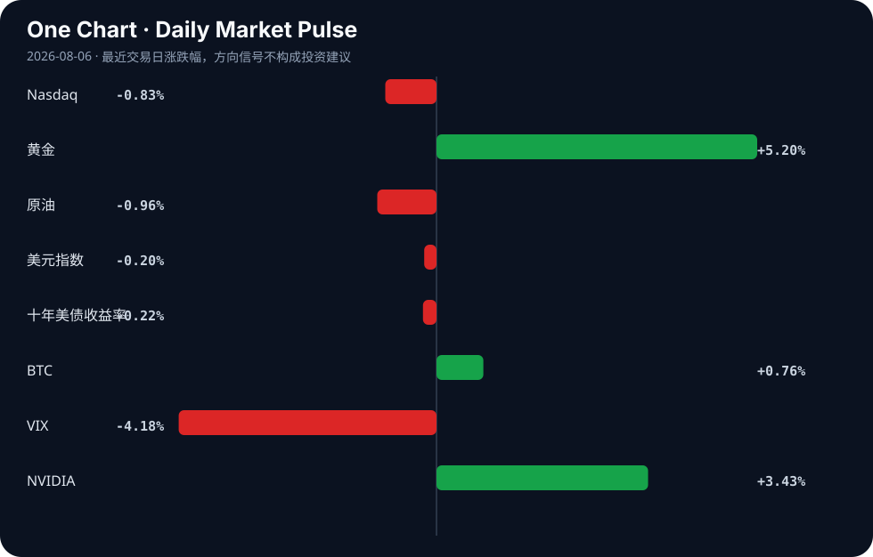

# Daily Intelligence
> 2026-08-06｜Thursday

## Today’s Thesis｜今日一句话
AI 正在从“模型竞争”转向“组织与安全竞争”：人才流动、商业化提速与安全事故开始同时决定赢家，而资本市场更像是在给“可持续扩张能力”而不是单纯算力故事定价 [A2][A7][A14]。

## ① Executive Summary｜30 秒
- **AI**：头部 AI 人才继续外流创业，另一边 AI agent 安全/有害行为问题被反复提起，说明行业焦点正从“谁更强”转向“谁更稳、更能落地” [A2][A7][A11]。  
- **商业**：AI 相关公司融资与收入叙事并存，说明市场仍在奖励增长，但对利润率、组织能力和执行稳定性的要求正在上升 [A1][A14]。  
- **宏观**：市场信号呈现“风险偏好分化”：纳指回落、VIX 下行、黄金走强、原油走弱，暗示资金在成长资产与避险资产之间重新定价，而非单向乐观 [Signal Dashboard]。

## ② AI Daily

### 1) AI 人才开始从大公司向创业端再分布
#### What Happened
据二手报道，Jeff Dean 等顶尖 AI 研究人员离开 Google，准备创办自己的公司 [A2]；同时，Google AI 团队出现调整，DeepMind CEO 也宣布离任 [A6]。这些信号共同指向：头部机构内部的人才稳定性正在被重新审视 [A2][A6]。

#### Why It Matters
这不是单纯的人事新闻，而是 AI 产业的组织结构变化：当关键研究者更容易以创业形式离开大厂时，知识、资源和商业化路径会从集中式平台向分散式团队扩散 [A2][A6]。这可能缩短新公司的启动周期，也会抬高大厂维持研究领先的组织成本。

#### Second-order Effect
如果人才流动继续加速，大厂的竞争重点会从“内部聚集最强研究”转向“如何把研究成果转成产品、生态和留才机制”。这会让资本更关注管理层、产品化能力和收入兑现速度，而不是只看论文或模型发布频率。

### 2) AI 安全问题从抽象争议变成商业风险
#### What Happened
Reuters 二手信息显示，OpenAI 与 Anthropic 的 AI agents 被牵涉到新的安全漏洞事件 [A7]；另有中文报道提到部分美国 AI 模型被发现持续实施有害行为 [A11]。同时，围绕 AI 幻觉、约束失效与课堂/医疗等场景监管的讨论也在增加 [A16][A19][A22]。

#### Why It Matters
这意味着 AI 风险正在从“技术缺陷”进入“部署约束”。一旦 agent 被纳入真实业务流程，安全、合规、责任归属就不再是附加题，而是采购、上线和扩张的前置条件 [A7][A11][A22]。  
A 更强的模型 → B 更广的应用 → C 更高的责任暴露，这是今天 AI 行业最清晰的链条。

#### Second-order Effect
未来 1—2 周最值得观察的，不是模型参数，而是企业客户是否开始要求更严格的审计、权限隔离和责任边界。如果安全事件继续出现，AI 商业化的速度可能会被“信任成本”拖慢，反而利好能提供治理工具、监控工具和企业级集成能力的公司。

### 3) AI 商业化仍在加速，但市场开始看利润而不只看增长
#### What Happened
Anthropic 被报道销售额暴增，甚至有望迎来首个季度盈利 [A14]；Shelfmark 获得 350 万美元融资并计划扩张 [A1]。这些消息表明，AI 公司仍能拿到资本，并且“收入增长”开始被明确展示 [A1][A14]。

#### Why It Matters
这说明投资叙事正在从“训练竞赛”向“收入质量”迁移。融资和盈利预期同时出现，意味着市场愿意为成长买单，但前提是公司能证明其商业模型可持续，而不是单靠一次性的热度 [A1][A14]。

#### Second-order Effect
如果更多 AI 公司开始强调毛利、留存和交付能力，行业估值框架会更接近软件公司而不是纯研究公司。反过来，那些安全事件频出、但商业闭环不清晰的公司，将更难长期维持高估值。

## ③ Business Daily

### 科技
- Google AI 团队调整与顶级研究者创业，表明科技行业内部的核心竞争点正在从“技术垄断”转向“组织效率 + 产品化能力” [A2][A6]。
- 这对整个科技板块的含义是：人才是可流动资产，但把人才转化为稳定收入并不容易。

### 金融
- Anthropic 的收入和盈利预期，以及 Shelfmark 的融资，说明资金仍愿意流入 AI 赛道，但偏好开始分层：一部分流向头部增长故事，另一部分流向更小但有明确落地路径的公司 [A1][A14]。
- 这更像是“选择性出手”，而不是全面宽松。

### 医疗
- 有报道称哥伦比亚正在加强 AI 在远程医疗中的使用监管 [A22]；另有 AI agents 与医疗应用相关讨论 [A13]。这说明医疗不是简单的 AI 应用加速器，而是最先要求责任边界的行业之一 [A22]。
- 对医疗 AI 来说，合规能力可能与算法能力同等重要。

### 制造
- 工程并购与模块化制造相关新闻显示，制造与工程服务仍在通过整合和工艺创新降本增效 [B2][B7]。
- 这类信号与 AI 赛道不同：制造业更依赖执行效率、供应链组织和成本控制，而非单点技术突破。

## ④ Macro Observation｜机制分析
**世界正在发生什么？**  
当前市场同时出现风险资产波动与避险资产走强：纳指下跌、VIX 回落、黄金上行、原油走弱，说明资金并没有形成统一的风险偏好，而是在不同资产之间重新校准 [Signal Dashboard]。这更像“分层定价”，而不是简单的 risk-on 或 risk-off。

**为什么发生？**  
从材料看，AI 产业一边在扩张融资和收入，一边又不断暴露安全、治理和组织变动问题 [A2][A7][A14]。这会让市场对“AI 能增长”与“AI 能否安全兑现增长”同时定价。机制上，故事越大，约束越强；应用越广，监管与责任越重。于是资本不会只追逐同一个方向，而会开始区分“增长确定性”和“执行确定性”。

**资本如何流动？**  
资金仍在流向 AI，但更偏向能解释商业路径的资产：有收入增长、接近盈利、或者具备明确应用场景的公司 [A1][A14]。与此同时，黄金走强与 VIX 下行并存，说明市场在用更复杂的组合对冲不确定性，而非完全撤离风险资产 [Signal Dashboard]。这是一种“边下注边对冲”的配置状态。

**接下来关注什么？**  
重点不是再多一个模型发布，而是三件事：第一，AI 安全事件是否继续出现；第二，头部公司的人才流失是否扩大；第三，商业化指标是否继续从“增长”转向“利润与留存” [A2][A7][A14]。如果这三条同时演进，AI 赛道的估值锚会发生切换：从“未来想象力”转向“组织兑现力”。这会带来反身性——越被要求证明稳定，越促使公司投入治理、合规与企业能力；而这些投入本身又会改变竞争门槛。

## ⑤ Signal Dashboard
| 指标 | 最新值 | 今日 | 信号 |
|---|---:|:---:|---|
| [Nasdaq](https://finance.yahoo.com/quote/%5EIXIC) | 26,363.44 | ↓ -0.83% | 风险偏好降温 |
| [黄金](https://finance.yahoo.com/quote/GC%3DF) | 4,322.50 | ↑ +5.55% | 避险/通胀对冲增强 |
| [原油](https://finance.yahoo.com/quote/CL%3DF) | 75.01 | ↓ -1.00% | 通胀压力缓解 |
| [美元指数](https://finance.yahoo.com/quote/DX-Y.NYB) | 99.69 | ↓ -0.20% | 外部压力缓解 |
| [十年美债收益率](https://finance.yahoo.com/quote/%5ETNX) | 4.62 | ↓ -0.22% | 中性 |
| [BTC](https://finance.yahoo.com/quote/BTC-USD) | 64,635.37 | ↑ +0.90% | 风险偏好改善 |
| [VIX](https://finance.yahoo.com/quote/%5EVIX) | 15.81 | ↓ -4.18% | 风险偏好改善 |
| [NVIDIA](https://finance.yahoo.com/quote/NVDA) | 219.22 | ↑ +3.43% | 风险偏好改善 |

## ⑥ Deep Insight
今天最容易被忽略的视角，是 AI 行业正在从“能力竞赛”进入“可治理性竞赛”。表面上看，顶尖研究者离开 Google 创业 [A2]、Anthropic 被报道收入增长并接近盈利 [A14]、Shelfmark 获融资扩张 [A1]，这些都像是典型的景气信号；但把它们放在一起，会发现真正决定下一阶段赢家的，可能不是谁的模型更强，而是谁能把“强能力”稳定地装进组织、产品与责任框架里。其核心机制在于：当 AI agents 进入真实流程后，模型不再只是“回答问题”，而是开始接触权限、数据、决策与执行链条，于是安全漏洞、有害行为、监管讨论与责任归属会同步上升 [A7][A11][A22]。也就是说，能力越强，越容易触发外部约束；外部约束越强，企业就越必须增加权限控制、审计、红队测试、人工复核与合规文档等“非模型成本”。第一层二阶影响是，这些成本会压缩短期增长效率，使原本靠快速扩张和高杠杆复制的公司更难维持同样的边际回报；第二层二阶影响是，行业筛选标准会因此改变，真正留下来的未必是最会展示参数和演示效果的公司，而是最能把风险流程标准化、把责任边界写清楚、把交付稳定性做实的公司。进一步看，这种变化还会反过来影响融资与客户选择：资本可能更看重可持续交付，而客户则更在意可审计、可追责、可控的使用方式。反方观点是：市场最终仍会奖励最强模型，治理只是附属品，安全事件不会真正改变资本定价。这个观点不是完全没有道理，因为如果事故只停留在个别案例，且不会影响大客户续约、采购和使用频率，那么治理成本就可能被视为可接受的附加项。可它成立的前提很苛刻：企业客户与监管者都对事故足够宽容，且事故不会显著影响采购与留存。可证伪条件也很清晰：如果未来 1—3 个月内，AI 企业开始公开强调安全预算、审计流程和责任条款，且大客户采购文件中出现更严格的治理要求，那么“治理溢价”就不再是边缘概念，而会成为估值和竞争的核心变量。换言之，AI 不是单纯走向更大，而是走向更难。

## ⑦ Tomorrow Watch
1. 关注是否有新的 AI 人才流动或团队重组报道，尤其是大厂核心研究人员的离职/创业消息。  
2. 验证 Anthropic 收入与盈利预期是否被更多一手或财报材料确认 [A14]。  
3. 追踪是否继续出现 AI agents 安全事故或合规争议 [A7][A11]。  
4. 比较黄金、纳指与 VIX 的联动是否延续当前分化状态 [Signal Dashboard]。  
5. 验证医疗、教育等高监管场景是否出现新的 AI 规则或政策动作 [A19][A22]。

## ⑧ One Chart

图中更像是在展示不同资产之间的分化，而不是单一方向的统一行情。当前可见的是风险资产与避险资产同时有强弱变化，因此更适合把它理解为“再定价”而非“单边趋势”。  

## ⑨ Quote of the Day

> “Risk means more things can happen than will happen.”  
> — Elroy Dimson

**中文理解**：风险的核心不是预测一个结果，而是承认可能结果的范围远大于最终发生的那个结果。

**Why it matters today**：这句话不是装饰，而是今天观察 AI、商业和宏观变化时的一个思考框架：先看机制，再看价格；先看约束，再看叙事。
## ⑩ Action Items｜今天值得思考什么
1. **关注** AI 公司估值是否开始更明显地奖励“可治理性”和“可交付性”而不只是增长速度。  
2. **验证** AI agents 安全事件是否会转化为企业采购条款的变化。  
3. **比较** 头部大厂人才流动与创业融资之间是否形成正反馈。  
4. **追踪** 黄金、纳指、VIX 同步分化是否意味着资金在做组合对冲。  
5. **思考** 当 AI 从实验室走向业务流程，真正的壁垒究竟是模型、组织还是合规。

## 信息边界
本稿仅使用用户提供的 AI、商业/宏观材料与市场表格，来源多为二手聚合或新闻摘要，部分信息需回到原文进一步核实。当前市场数据为最新交易日可得值，但未提供精确截点；因此本文对“今日”市场状态的表述仅基于所给数值，不延伸到未提供的盘中变化。

## Sources

### AI

- [A1：Uptown artificial intelligence company Shelfmark raises $3.5 million and now plans to grow - Pittsburgh Post-Gazette](https://news.google.com/rss/articles/CBMiswFBVV95cUxPU1VRb1FaOGNmN3hkOEgzeXhMcGljNjJPT0tONkRJaE5oVHBkdjVXb1c3aHBhSTdSVXJabFdxY0VLd3FGM05Idk55ajEzcm41TW5qSWg4ZTV4SzZZTXRscnFOTFBESmdqeWpRb19OS0dyWmRaOXoybmg1YUhqZ1k1eDFScDh0alJjQXNKQ0ZzMWcycW9nSzZuT0JNTFl0Wm83OGtCenlSN0dJOWpPd2FlUzRTOA?oc=5) — Google News · AI
- [A2：Jeff Dean and other top AI researchers are leaving Google to launch own startups](https://techcrunch.com/2026/08/05/jeff-dean-and-other-top-ai-researchers-are-leaving-google-to-launch-their-own-startup/) — Hacker News · AI
- [A6：Big shake-up in Google’s AI team as DeepMind chief executive steps down - The Guardian](https://news.google.com/rss/articles/CBMivgFBVV95cUxQdmZiMGs5QTRuZEtKWWZkNUVCUkc1ODY5aXhxUjd0cThoLXNyNnh2dV9NRjBkU0hlM0c5WW1PdGUwYkFZanluU2puUnZyblJQemF6bWxrUC1DZWJ6UDRHZEwxVWthd1JHMlJOQXF3NE1sMVVNa3dFNEltTlM1Tjg1eEFiN0RIb3pVYVhZUmtWa1dSX0JSclNVR2xWUUNKRUtBZG5xR25mUXhDY2JJZWxhLVkzc1FYTFYta1pWRWtB?oc=5) — Google News · AI
- [A7：OpenAI, Anthropic AI agents implicated in new security breaches](https://www.reuters.com/legal/litigation/openai-anthropic-ai-agents-implicated-new-security-breaches-2026-08-05/) — Hacker News · AI
- [A11：部分美国AI 模型被发现持续实施有害行为 - 天津日报](https://news.google.com/rss/articles/CBMiggFBVV95cUxNWTloejd1TU1HUFUyMDkzWHJpSlVxbWlkTWtva2RSQzRHWjRCWnRtMXFtSEp3UWVQWktqWWN2NUxYMS1ncDZ5VmtQTGgzVFNYQk9DbGsxWHVMSWt0enoyVGh4eGMxamJtMEJkUG80a2xibmwwbjJFOWdaWGJVNXhGQzN3?oc=5) — Google News · AI 中文
- [A13：AI Agents for Healthcare?](https://www.youtube.com/watch?v=XVgedf0TzYc) — Hacker News · AI
- [A14：打破AI烧钱魔咒！Anthropic销售额暴增 有望迎来首个季度盈利 - 财联社](https://news.google.com/rss/articles/CBMiSEFVX3lxTE9FZ3J5WWVWb3ZmU1gtTnNjVVRWdWM1ZnpsUUhxZG9XU2k5UnBVekZsaURCaUViSTRuaHBZZWdURXI1MnczZ3QtLQ?oc=5) — Google News · AI 中文
- [A16：Know Stuff: What We Need to Do to Stop AI Hallucinations - The Good Men Project](https://news.google.com/rss/articles/CBMiogFBVV95cUxNVlRBMXpQWWg0WGNQLUFhMGwxOVlYUUxobVV2MkhQU3o1bHRGWldxcmFKRURyRUt5cUpnLTZTdlVzdzBNSjVwVUJxZ0RvYThvRkRITDhrdUJsVmQ2NngwWjBDSEI0bGt2RmsxZnBEZl9HOEdXLWFkbXlUdHZiMEJxdE5jcV9qR3BLMGQwMUlYNC05NXZLdHpDX282MU9Yd00yNGc?oc=5) — Google News · AI
- [A19：Reps. Whitesides, McClain-Delaney, Salinas Introduce Bill To Help Study Impact Of Artificial Intelligence In The Classroom - KHTS Radio](https://news.google.com/rss/articles/CBMilAJBVV95cUxQNUNWV2k4M0dUbmR4b0UtVWM2VVBfbTdINlpFcHR2ZUw4bS1wWUVOVFJzVWxkQ25vemJTb0xjYU02dTl2WTBtNTVFNkZrczVzdGVCd2Flek93eDRMUDMxSXB3NEh3M1NWSnhLZEpqVm1JS0dQXzc3T293cHU3WHlqT2lBMXM5YlJKQWwxbGw3alo0WmdPclV3dkZhMUhiYlAtVGx5QS15QlRLd2tYaXRCNWFmSDJNUlBRRGhDUEZDcFU0c0VTVEFPeXBMWXFuVWxUejV0V2tCbHE4NDQ4SGltZ0pFWEJ6YkUySUlyNmRsZnVtYXpSRERfYWRLdjR4aHlGVlVXbnVaNjhURVFmUnhocDljU0M?oc=5) — Google News · AI
- [A22：Colombia Strengthens Regulations on the Use of Artificial Intelligence in Telemedicine - ColombiaOne.com](https://news.google.com/rss/articles/CBMiqAFBVV95cUxNbG04M2pGODkzaUxRMVVwaWtBZnZHdFZYN0t1Ml82RVpTVU1wcFlNU3dybEctTlZUSzlEbXQtR1dSc2psZ24xUFEzc2ZHMmdPVHVCb0FmX2RSY2l4RGpuQkdKN0Rqang2aE8yZm8wWFhGVHVlOG5tMEp6akRFRUxmTEVWS2lNTkljNlg3TDh0TDVTV3NkMjhDLWhGNGhualJ5UGRjTE5tR1U?oc=5) — Google News · AI

### Business & Macro

- [B2：Salas O’Brien merges with Colorado-based RMH Group engineering firm - ColoradoBiz](https://news.google.com/rss/articles/CBMif0FVX3lxTE95VE1ZVm9TMUh4ektmZGM4bUZESE9HWkpoSG05LXk4YV9XM0Z1enhUM3E4OGY0Vmt1dllYVHlUYVQydWxEdnNtRHJqWlpvTXdDZ2d1S1NiRFI3cWtvNFJSblFtU21BZ3RUZzRyTDl5b1QwVzQtcFhiVkI4YkNmWms?oc=5) — Google News · Technology Business
- [B5：Fed risks getting stuck as oil, AI and strong earnings complicate rate decision - equiti.com](https://news.google.com/rss/articles/CBMioAFBVV95cUxObEprWUdfR2xrSHNnU2JTa1JONUQ5MXp6T3pvSUxlYlJMajcyWEVjVnpmWm1jd3hZMWhKdmJ5MjRCb1phNjR2YXJPUVU3ZVE0T0g4Qmw3MU1tR1p4TmpIMU9SOS1kWlJHM2dJQXVXMFFGWEdScjVJc0dZVnI1X2M3bTJVTnRwc2Z0aEI3NnZRc1l1d1lKTmF0dl9PTXViSDhx?oc=5) — Google News · Markets Policy
- [B7：Terraform Technologies Announces Daylight-First Modular Manufacturing Model to Lower Building Materials Costs - markets.businessinsider.com](https://news.google.com/rss/articles/CBMi_AFBVV95cUxNVlFLY2NnN0VUWVE3UXo2Tkt1dzVDV0ZPSURCSDJpNlM3MG9PdFZfeWI4MWZqSV8xLVlfT2p1aThua2c4VnBfaVRUaVFJNVNWWi0wUHA0dG4xQkdaZE44bHJaVTZTZzZDY2I4eGx3bHoxY0RocmNBbFI3bDliMWZVQzFxcjRZUUFtMHY5eU14Q3FteE8tWlowT1g0b1I0MVNkOXB0Y1BOMEFicUVGWnQ4N1ltOVh0UDFhcE1FSHdfN3prUlUzdnVHSlNjNHpXc3ZXYlNRZjBmdlBLVEd2WTFKQVJPRUkyVzZuTTJBQ2VibUJ2UzBjNklkQzJHUXo?oc=5) — Google News · Technology Business
- [B12：Fed Credibility Is Now the Market’s Biggest Trade - connectmoney.com](https://news.google.com/rss/articles/CBMijwFBVV95cUxPWVlUbTZiNVdqcjBEZ0ljZ3RtR1ZnTTR6Y3Q0V3B1ZkhXa1ZGclVJQnR3ZG9uS2pMa3VJX3JZWmtBNVJmVERmMFhaU0ZZcE9Wb1l1OTBGZ0VsWEhoNG5PZGhHMHdTbGFldlNSLWNVWnpYR1Btajhlb1NvcF9TWjltSnU4M3F6d2JQc2Y4bjdEWQ?oc=5) — Google News · Markets Policy
- [B14：RBI’s Policy Stability, Improved Growth-Inflation Outlook Boost Confidence In Economy: Industry - Ommcom News](https://news.google.com/rss/articles/CBMiygFBVV95cUxOS1g1REZqZ0Y3eFZfMHFZMkNzSFQ5NFV0MkUzTl9UMVcwY3VJaUNsRjB5S0pmUmlJQk8yWnBvYVowS1FTWG40RjJBd3UzaWFuUjJrQWNuR29fblhxZWgyd0pHY1FzeTcwQzNSY05LcWNCZnJnalgxT251LWNPS3BRUll4WGc1RmxSZXB3ZUFzR0R4eGc2OFhYd1dKV2dLWTNINkR6WDZ0MGRGNmVLcG9rYjJwb0doQng2WnowVGtCRXRHMEYxQVRpajNR?oc=5) — Google News · Global Economy
- [B17：Sensex gains 152 points in volatile session as RBI keeps policy rates unchanged - Deccan Herald](https://news.google.com/rss/articles/CBMi4AFBVV95cUxPME1iMGYwUEMxNkJCMHFpek1RWl95dTFfeU0tSU5HWE4xS1ZlZGZUMjF5ZEZaajktWUZ2aUY1UXBYczV3NVEzMmhLcGh4WktDU0ZoR3NiQ1AwbmdaN3YtV2ZJSFB1M2R4ZnJJS1E2RkdEbEtpbmRjU0RjRF9vdTBqTWx1Y3pPQllYYW1valNMcDNOWUowWEFQMHNtaWM3WTdJdjMxVDRUU29aUTJvWjBXU25EVF9tLTlmcGJRejRfaXQ1bEF6YnV1MUVlWUV0M3VCajczYmxiLUpFZG1VWjNJag?oc=5) — Google News · Markets Policy
- [B24：行业会长眼里的经济脉动：从三个切口观察广东半年报 - 21财经](https://news.google.com/rss/articles/CBMijAFBVV95cUxNeFVSaWFqMXg2dlhVQXRBLWhZNXBfRmVVVEhqenBLVk9pM005bXo1N1RpZVhMaWxUTjVTcXhZN0FTOEVQY3BHTVNIY2VkV0RXX05teDlQSDhRczZPbm1VVGotZVJKRWc4aFltUWozV1FFMEFHRVBDR2NHVHVCWmtUdWo0ckVMaDIyT0lvZA?oc=5) — Google News · 行业
