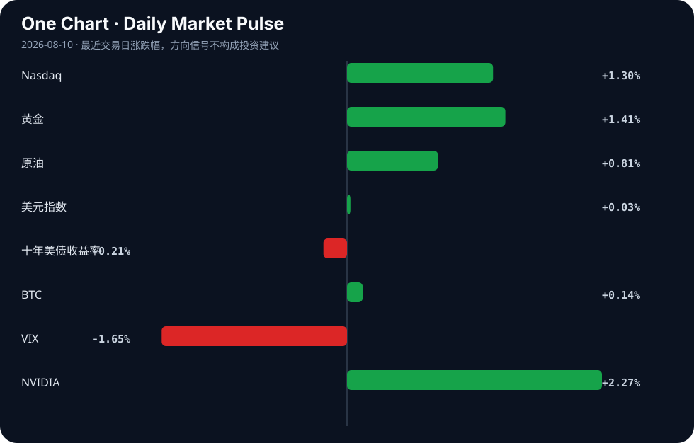

# Daily Intelligence
> 2026-08-10｜Monday

## Today’s Thesis｜今日一句话
AI 正在从“能做任务”转向“能嵌入流程并承担后果”，但真正的分水岭不是模型能力本身，而是围绕错误责任、合规边界、算力与行业工作流的再定价；短期市场会继续奖励“能把 AI 变成可收费服务”的公司，而不是只讲演示效果的项目。[A3][A10][A23]

## ① Executive Summary｜30 秒
- **AI**：今天最值得注意的不是新模型，而是 AI 正在被塞进更具体的责任场景：医疗问诊、代码审查、法务引用、网络安全与自动化代理都在暴露“可用”与“可托付”之间的差距。[A3][A4][A8][A10][A13][A23]
- **商业**：围绕 AI 的商业化正在分化：一端是低成本、可直接替代人力的工具化产品；另一端是需要合规、审核、责任链的高门槛场景。前者更容易迅速扩散，后者更可能形成更稳固的收费能力。[A2][A4][A10][A12][A15]
- **宏观**：市场表面上呈现“风险偏好改善”，但黄金、原油与美元/美债的组合显示，资金并未简单转向单一增长叙事，而是在通胀、避险与增长资产之间做再平衡。[Signal Dashboard][B1][B9][B19]

## ② AI Daily

### 1) AI 正从“演示型工具”进入“责任型场景”
#### What Happened
今天的材料里，医疗、法律、网络安全都出现了同一个主题：当用户带着 AI 自我诊断来就医时，医生如何应对；当律师使用 AI 生成引用时，可能面临制裁；当 AI 助手被用于入侵网站时，问题已经不只是“模型会不会做”，而是“谁为结果负责”。[A3][A10][A8]

#### Why It Matters
这意味着 AI 的价值评估标准正在变化：过去更看重“效率提升”，现在开始看“责任可分配性”。如果一个任务的错误代价高、审查链条长、证据要求强，那么 AI 即便能提高速度，也必须被嵌入更严格的流程里。换句话说，AI 的商业化不只取决于能力，还取决于制度是否允许它承担后果。[A3][A10][A23]

#### Second-order Effect
一旦责任边界变清晰，行业会出现分层：  
低风险任务更容易被快速自动化，高风险任务则会催生“AI + 审核 + 保险/合规”的组合产品。  
这会把“卖模型”推向“卖流程”，并让监管、法务、审计成为 AI 产业链的一部分。

### 2) AI 应用正在从单点功能走向“代理化工作流”
#### What Happened
Hacker News 聚合里出现了多个面向具体工作流的产品：面向创始人的 AI chief of staff、AI Outlook 邮件助手、自托管多代理助手、代码差异审查工具，以及声称可提升 30% 编码结果的方案。[A2][A12][A15][A4][A5]

#### Why It Matters
这些项目的共同点不是“更聪明”，而是“更靠近角色”。它们不是给用户一个问答框，而是把 AI 放进会议、邮件、代码评审、运营协调等具体环节。A → B → C 的链条是：工作流碎片化 → 人工协调成本上升 → 代理式工具更容易被购买。真正的竞争焦点因此从模型参数，转向集成深度与切换成本。[A2][A12][A15]

#### Second-order Effect
如果这一趋势持续，创业公司会越来越依赖“把 AI 变成岗位替身”的叙事，但也会更快碰到三个瓶颈：权限管理、错误归责、以及用户对“替我做决定”的心理接受度。也就是说，AI 代理化不是只靠功能扩张，而是靠组织授权扩张。

### 3) AI 价值开始向“结果可衡量”的垂直场景集中
#### What Happened
材料中还出现了两个较强的垂直信号：一是用卫星与 AI 在数分钟内识别火灾；二是围绕 AI 自助诊断、代码审查等具体效率提升的案例。[A1][A4][A3]

#### Why It Matters
这类场景的共同点是结果容易验证：火灾识别快不快、审查是否减少错误、诊断建议是否需要纠偏。相比之下，泛化型 AI 应用往往很难证明价值。垂直场景的优势在于，它们能把“好用”转化为“可量化”，从而更容易进入采购与预算流程。[A1][A4]

#### Second-order Effect
如果市场继续奖励可量化结果，那么 AI 产业的叙事重心会从“通用智能”转向“行业指标改进”，例如响应时间、误报率、审查成本、工时节省。长期看，这会削弱纯概念型项目的融资效率。

## ③ Business Daily

### 科技
科技行业今天最清晰的信号是：AI 相关产品正在从“附加功能”变成“主营入口”。从 chief of staff、邮件助手到代码审查工具，产品形态都在向高频办公环节靠拢。[A2][A4][A15]  
这对商业模式的含义是：如果 AI 能嵌进既有工作流程，收费就不再只依赖单次调用，而会依赖席位、权限与流程覆盖率。

### 医疗
医疗行业的重点不是“AI 能不能诊断”，而是“医生如何处理患者带来的 AI 结论”。[A3]  
这类变化提示一个更大的机制：AI 会先改变患者和医生之间的信息不对称，再反过来改变问诊流程。它未必立刻替代医生，但会迫使医疗机构增加核验环节、解释环节与责任说明。

### 金融
金融与市场侧今天更像是“再定价”而非单边押注。VIX 下降、纳指上涨、黄金与原油同步走强，说明资金一边在买风险资产，一边也在保留通胀和不确定性对冲。[Signal Dashboard][B19]  
这不是整齐划一的风险偏好，而是更细碎的资产轮动：增长叙事未退，避险需求也未消失。

### 能源
能源信号主要来自油价上行与“通胀压力上升”的市场解读。[Signal Dashboard]  
与此同时，材料中还出现新能源长期成长、塑料工厂因能源危机产能受限等不同侧面，说明能源问题仍然是成本、供给和产业利润之间的传导变量，而不是单纯的价格新闻。[B13][B15]

## ④ Macro Observation｜机制分析
**世界正在发生什么？**  
世界并不是简单地进入“AI 牛市”或“风险偏好回升”，而是在进入一个更复杂的结构：AI 扩散到更多行业后，收益和风险都开始被重新分配。市场数据上，纳指和 NVIDIA 走强、VIX 回落，表面上是风险偏好改善；但黄金和原油同步上行，又提示通胀与避险需求并未退场。[Signal Dashboard]

**为什么发生？**  
机制上，AI 正从“可演示”走向“可集成、可审计、可收费”。当它进入医疗、法律、代码审查、代理工作流时，最先被放大的不是能力本身，而是责任、监管和流程改造成本。[A3][A10][A23]  
这会形成一种反馈循环：  
更高的可见效率 → 更多试点与采购 → 更多错误暴露 → 更强的合规要求 → 更高的集成门槛。  
因此，越接近关键业务，越需要把 AI 变慢、变窄、变可追责。

**资本如何流动？**  
资本正在在两类叙事之间切换：一类是“AI 提升生产率”的增长资产叙事，另一类是“通胀与不确定性仍在”的对冲叙事。[Signal Dashboard][B19]  
这就解释了为什么同一天里可以同时看到风险资产和黄金都受欢迎：资金并没有押注单一结果，而是在分散押注不同宏观路径。对 AI 资产而言，资本更愿意为“结果明确、收入路径清晰”的垂直产品付费，而不是只为“远期想象空间”买单。[A1][A4][A12]

**接下来关注什么？**  
未来一周最关键的不是更多 AI 演示，而是三个验证点：第一，责任场景里的 AI 是否开始出现明确的监管、制裁或流程化要求；第二，代理式工具能否从个人效率玩具升级为组织采购项；第三，宏观资金是否继续维持“增长与对冲并存”的配置结构。若这三点同时成立，AI 产业的估值逻辑就会从“讲能力”转向“讲嵌入度与约束处理”。[A3][A10][A12][B1][B9]

## ⑤ Signal Dashboard
| 指标 | 最新值 | 今日 | 信号 |
|---|---:|:---:|---|
| [Nasdaq](https://finance.yahoo.com/quote/%5EIXIC) | 26,690.62 | ↑ +1.30% | 风险偏好改善 |
| [黄金](https://finance.yahoo.com/quote/GC%3DF) | 4,405.30 | ↑ +1.49% | 避险/通胀对冲增强 |
| [原油](https://finance.yahoo.com/quote/CL%3DF) | 78.69 | ↑ +0.65% | 通胀压力上升 |
| [美元指数](https://finance.yahoo.com/quote/DX-Y.NYB) | 99.62 | → +0.02% | 中性 |
| [十年美债收益率](https://finance.yahoo.com/quote/%5ETNX) | 4.66 | ↓ -0.21% | 中性 |
| [BTC](https://finance.yahoo.com/quote/BTC-USD) | 65,002.17 | ↑ +0.15% | 中性 |
| [VIX](https://finance.yahoo.com/quote/%5EVIX) | 14.90 | ↓ -1.65% | 风险偏好改善 |
| [NVIDIA](https://finance.yahoo.com/quote/NVDA) | 223.96 | ↑ +2.27% | 风险偏好改善 |

## ⑥ Deep Insight
今天最容易被忽略的主题，是“AI 不是先在最聪明的地方胜出，而是在最需要被追责的地方重新定义价值”。很多讨论仍然停留在模型是否更强、回答是否更准，但从材料看，真正开始改变产业结构的，是责任链条的重写。[A3][A10][A23] 当患者拿着 AI 自诊结果来医院，医生并不是简单接受或拒绝，而是必须把 AI 作为新的信息输入重新校验；当律师使用 AI 生成引用，问题也不再是效率，而是法庭对证据链的容忍度；当 AI 助手被用于入侵网站，模型本身的“能力”就转化成了组织安全的“风险”。这意味着 AI 进入高价值行业后，竞争优势不只来自准确率，更来自谁能把审查、日志、权限、责任和保险打包进产品。  
更进一步看，市场可能正在奖励一种新的 AI 资产：不是最会讲通用智能故事的公司，而是最擅长把 AI 变成可结算流程的公司。[A2][A4][A12][A15] 这类公司往往更朴素——邮件助手、代码审查、创始人秘书、卫星火灾识别——但它们靠的是“嵌入度”而不是“震撼度”。非共识之处在于，真正的护城河也许不在模型能力，而在流程位置：谁能卡住审批、协同、核验与责任归属，谁就更接近稳定收费。反方观点是：这仍然只是早期应用热潮，很多产品缺乏长期粘性，最终会被更强的基础模型吞没；而且在高风险场景，监管和组织文化可能让 AI 的渗透远慢于预期。这个反方是成立的，因为若未来 1—7 天内看不到明确的采购、合规或责任制度变化，那么今天这些案例更像是试验而非趋势。证伪条件也很清楚：如果后续材料显示 AI 仍主要停留在低门槛效率工具、而无法进入关键流程并形成持续收费，那“责任型场景驱动商业化”的判断就需要下调。相反，如果我们持续观察到法律、医疗、网络安全和企业协同领域出现更系统的制度化采用，那么今天的信号就不是零散新闻，而是产业定价逻辑切换的早期证据。

## ⑦ Tomorrow Watch
1. 关注是否出现更多关于医疗 AI 自诊、医生处置或机构指南更新的后续报道。[A3]  
2. 验证 AI 代码审查、邮件助手、chief of staff 等工具是否出现真实付费或团队部署信号。[A2][A4][A15]  
3. 追踪是否有更多关于 AI 代理安全、权限控制或自动化攻击的案例更新。[A8][A13][A23]  
4. 比较黄金、原油与纳指是否继续同向偏强，以判断“增长+对冲”配置是否延续。[Signal Dashboard]  
5. 观察 NVIDIA 与 VIX 的联动是否继续支持风险偏好改善，还是仅为短期波动。[Signal Dashboard]

## ⑧ One Chart

图表呈现的是当下市场情绪与风险资产表现的同步变化，但这不等于单一因果关系。更稳妥的解读是：资金正在不同资产之间重新分配，同时保留增长与对冲两种暴露。

## ⑨ Quote of the Day

> “Skate to where the puck is going, not where it has been.”  
> — Wayne Gretzky

**中文理解**：判断趋势时，要看系统下一步可能去哪里，而不是只看它过去在哪里。

**Why it matters today**：这句话不是装饰，而是今天观察 AI、商业和宏观变化时的一个思考框架：先看机制，再看价格；先看约束，再看叙事。
## ⑩ Action Items｜今天值得思考什么
1. 关注哪些 AI 场景已经从“好看”转向“可追责、可收费、可审计”。  
2. 验证市场上被热议的 AI 工具，究竟是在替代岗位，还是在增加流程层。  
3. 比较高风险行业与低风险行业对 AI 的采纳速度差异。  
4. 追踪宏观资产是否继续呈现“风险偏好与避险并存”的组合。  
5. 思考：当 AI 进入关键业务后，真正稀缺的是模型能力，还是制度许可？

## 信息边界
本期仅使用用户提供的二手聚合材料与市场表格，未回到原始报道全文核验；因此，所有结论都应视为“基于摘要的趋势判断”，而非对单一新闻事件的完整事实认定。市场数据与行情信号以用户给定表格为准，代表最近交易日/最近可得时点，不代表实时盘中变化。对新闻中涉及的法律、医疗、安全与市场判断，均存在来源层级与转述误差，重要信息需回到原文继续验证。

## Sources

### AI

- [A1：A startup is able to detect fires within minutes using satellites and AI](https://netbajura.blogspot.com/2026/08/ororatech-startup-that-detects.html) — Hacker News · AI
- [A2：Show HN: An AI chief of staff for founders who can't afford one](https://useairo.co) — Hacker News · AI
- [A3：What to do when your patient arrives with an AI self-diagnosis. - InSight+](https://news.google.com/rss/articles/CBMilAFBVV95cUxOdFJadGNwa1UySzdlX1RhamdEdEU4Z2traGRDcUtnQnhabmZQZFE3OUE2THQ3X3E1d3FLWlhMMms1OHA5V1hUQms5dzY2cEw3cllQQUV2SGRqQXlFcmYyZTM2WVM1STNJcy11YU5jZHVaZ010a3VrQmNTUFlqOU5uWkNPNHBrT292SVBmWUhnOElXX3Y1?oc=5) — Google News · AI
- [A4：Quoted $1M for AI code review. Built it for free](https://sagivo.com/blog/i-was-quoted-1m-to-get-ai-diff-review-tool) — Hacker News · AI
- [A5：I got 30% better AI coding results](https://github.com/akasula09/CodeSlimmer) — Hacker News · AI
- [A8：AI assistant hacks gym website in first known Australian autonomous cyber attack](https://www.abc.net.au/news/2026-08-10/ai-assistant-hacks-gym-website-aus-cyber-attack/107007986) — Hacker News · AI
- [A10：Lawyers using "AI" could face sanctions including costs for fake citations](https://www.irishtimes.com/crime-law/2026/08/05/lawyers-could-face-sanctions-including-costs-if-ai-leads-to-fake-citations-in-court-cases/) — Hacker News · AI
- [A12：Show HN: Pacific Slate: a self-hosted, model-agnostic multi-agent AI assistant](https://pacslate.com/) — Hacker News · AI
- [A13：Show HN: Wardline, a Go proxy that auto-blocks compromised AI agents](https://github.com/kabirnarang39/wardline) — Hacker News · AI
- [A15：Codreo AI Mail – AI Outlook Email Assistant](https://codreo.az/products/codreo-ai-mail/) — Hacker News · AI
- [A23：The AI safety test is becoming a safety risk](https://techcrunch.com/2026/08/09/the-ai-safety-test-is-becoming-a-safety-risk/) — Hacker News · AI

### Business & Macro

- [B1：Dollar-Yen Hovers Around 157 After Post-Jobs-Data Yen Surge Rebounds; Markets on Edge Ahead of BOJ Opinions and Intervention Speculation - finance.biggo.com](https://news.google.com/rss/articles/CBMidkFVX3lxTE1kSWNlVTRfVmljTlNMMU1qNHBCUk5mUmpTN3kwb2FsNE9sTWl3QlF5VGVBdHlmaWxXNlE5bWxMUjBadEc5Y25xYXIxZU82ZlM4aWFpeEdUWV8tTHVUdjBZRmw2N3BTXy1FLWZ5VGc4Mjk2WC1uZHc?oc=5) — Google News · Markets Policy
- [B9：Forex Today: Market Focus Shifts from Middle East to US Nonfarm Payrolls - CryptoRank](https://news.google.com/rss/articles/CBMirgFBVV95cUxOV09PaDNEdzJOd0xHbHBOSEpYV2psSzRPdk9xc2dsbVF2THdXcWh3TURnblVrUXRNMGw1eVN6REpCVFQxbE1mS252ZnQtR0tRUFNBc0gyNWZTVWpaNmZtcEhycnVlNUxqUC10T2tUajhGTHNYTzRjYW5Gc2E3Z0ZsWXhNdjlXajdEZllmU2FnLU5rRjlSdVhZaGdZODU3S0lKTFNfM21jbVdrMGQtRHc?oc=5) — Google News · Markets Policy
- [B13：把握“十五五”能源转型机遇，华润新能源持续兑现新能源长期成长逻辑 - 新浪财经](https://news.google.com/rss/articles/CBMieEFVX3lxTFBQNWNNbUhnTmdrcTJXUGZlWUtlR2M1YzB4YnY4ZTREUjc3cVhoOTBvWEhpek1DUzdoODdGckZzQ1B4MTJrdzRvNTJKbHhsTE42Y1QtSHFoaEs0VGNERTJVTTVLYmJXOFptNE5oOWhIN0RfMGdQS1BkQQ?oc=5) — Google News · 行业
- [B15：Plastic factories run at 30% capacity amid energy crisis - The Daily Star](https://news.google.com/rss/articles/CBMiugFBVV95cUxNU2pEaVNDZFF5RDJxYnRPeHd5SUVWN3pZWERUTGhTb2JqcUVaT3lZeVpiUFR5ckNGNlJScnRGQ2ctdGM0VlNlZlhWRHhjZEVCdUd6akpOa3BRRHQyTFhiYzZCb21ncThhRkxiZ00yazJmNEcwem1ZVXdRV0xHQVV1WWI3MkwxUlhPektHTkpyWGVSX1k2RUU0NU9xOW9xcTE3RWlWLTgyNDYwTXZHYWExT3lHOWRJRDNfUUE?oc=5) — Google News · Global Economy
- [B19：Warsh wants a Fed that plays a smaller role in markets - Investing.com](https://news.google.com/rss/articles/CBMitAFBVV95cUxQRGFId3ZObHlqLTZGSTIyNlBYTEtYY0NVaklScDhLNVlIbUNHT0tpOEIzWDk2YnB3dEx6blVodHdqNE5tSUUtekFrWE5sVWRlWEExdm9YMjE3UWl6MEdGTE9xRG0wNzcxOG5oVm54R3lCUU5UdE5aTEFOc3NoMFBZM3duX1hBZ25FZ2dhYXoyUl92b1VFYWV6UzR5VVVDdGVPbEpvLWwwNVZvdkVpZlQ0N2xUdWo?oc=5) — Google News · Markets Policy
