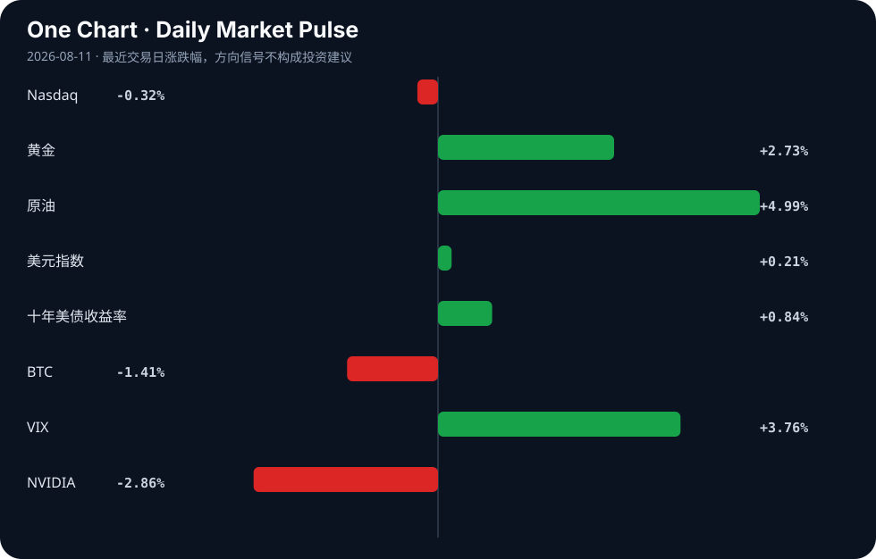

# Daily Intelligence
> 2026-08-11｜Tuesday

## Today’s Thesis｜今日一句话
今天的核心变化不是“AI 继续变热”，而是 AI 正从技术叙事转向安全、合规与融资三条约束线并行收紧；这会把行业竞争从“谁能做出模型”推向“谁能把模型安全地部署、分发和融资”。[A5][A6][A11][A16]

## ① Executive Summary｜30 秒
1. **AI**：当天最值得关注的信号是“AI 风险治理”明显升温：加州机构被要求更好准备 AI 攻击，议员对“rogue models”施压，说明监管关注点正在从能力扩张转向失控与滥用的外部性。[A5][A6]  
2. **商业**：围绕 NVIDIA 的大规模 AI 融资安排成为重要行业线索，市场关注点不只是算力需求本身，而是算力采购、资本开支与金融中介开始形成更紧的闭环。[A11][A16]  
3. **宏观**：市场表格显示风险偏好降温、避险升温、通胀对冲增强：黄金、原油、VIX、美元与美债收益率同向抬升，而纳指、BTC、NVIDIA 回落，暗示当前定价在重新权衡“增长”与“通胀/利率”约束。[B16]

## ② AI Daily

### 1) AI 治理从“内容标识”转向“攻击防御”和“模型约束”
#### What Happened
关于 AI 水印的讨论指向一个现实：文本 AI 水印“总是很容易被移除”[A1]；与此同时，加州州长新闻称要求州机构更好准备 AI 攻击，[A5]而媒体标题显示立法者正加大对“rogue models”的压力。[A6]

#### Why It Matters
这组材料共同说明，AI 监管与防护的重心，正在从“内容可识别”转向“系统可控”。如果水印难以稳定约束内容伪造，那么政策与企业防线就会更多转向攻击面管理、权限控制、审计与责任归属。[A1][A5][A6]

#### Second-order Effect
A1 式“标识难题” → 迫使治理工具转向 A5/A6 式“行为约束” → 企业部署门槛上升，低门槛应用可能更快合规化分层。  
这意味着未来竞争不只在模型效果，也在“可被信任地调用”。

### 2) AI 资本开支开始金融化
#### What Happened
有两条高度相关信号：一是“Nvidia AI Factory Compute Is Becoming an Investable Asset Class”[A10]；二是“Wall Street giants partner with Nvidia on $500B AI financing deal”及其转述版本。[A11][A16] 另有中文聚合称“字节被爆今年 AI 支出将超2000亿”。[A23]

#### Why It Matters
这不是单纯的公司新闻，而是 AI 扩张方式的变化：当算力与基础设施被包装成可融资、可资产化的对象，资本市场就不再只是为增长定价，而是开始为“持续供电的算力管道”定价。[A10][A11][A16]  
这里的关键不是某一笔交易真假已定，而是“融资—采购—扩张”的闭环已成为行业讨论中心，值得回到原文核验交易结构。

#### Second-order Effect
融资能力会变成新的竞争壁垒：能拿到便宜资金的厂商更容易锁定供给；锁定供给又会反过来强化平台集中度。  
NVIDIA 相关讨论的本质，是算力需求 → 融资创新 → 供给锁定 → 行业集中。

### 3) AI 的使用场景继续下沉到产品与教育，但更像“渗透”而非爆发
#### What Happened
材料里既有北卡中央大学建立 HBCU 首个 AI 研究中心的报道[ A3 / A14]，也有课堂中 AI 应该如何呈现的讨论[ A20]，以及多个偏产品化的 HN 项目，如“AI-powered App Store replies that sound like you”“AI Pulse”等。[A4][A12]

#### Why It Matters
这组信号表明，AI 不仅在大机构和大模型层面推进，也在教育、应用和工作流层面不断嵌入。但这些材料更多反映“采用意愿”和“试验密度”，还不足以证明生产率已经全面兑现。[A3][A4][A12][A20]

#### Second-order Effect
若治理和安全成本上升，教育与企业场景里最先胜出的可能不是最强模型，而是最容易被审计、被解释、被管理的产品形态。

## ③ Business Daily

### 科技
NVIDIA 相关的融资与“可投资资产”讨论，是今天科技板块最重要的机制信号。[A10][A11][A16] 这意味着科技行业的估值逻辑，正从“模型进步”进一步转向“算力供给链的金融可扩张性”。  
同时，AI 安全、内容标识和攻击防御的新闻密度上升，说明工具链与安全链条可能成为下一阶段商业化的重要分支。[A1][A5][A6][A15]

### 金融
如果“AI 融资包”之类结构持续出现，金融机构将不只是 AI 的资金提供者，也可能成为行业扩张的放大器。[A11][A16]  
这会带来一个典型反身性：融资越顺畅，资本开支越快；资本开支越快，市场越容易把需求增长当成确定性，再进一步推高融资意愿。

### 能源
宏观材料里原油明显走强，信号表上原油上涨、十年美债收益率上行、美元指数走强，提示市场正在重新计入通胀压力和更紧金融条件。[B16]  
对 AI 和制造业来说，能源价格抬升不是背景噪音，而是会直接影响数据中心、制造与运输成本的约束项。[B1][B16]

### 制造
制造业相关材料并不指向单一公司事件，而是更广泛的“自动化、智能工厂、局部供应链重组”趋势：如智能工厂生态、局部矿物加工、本土品牌与需求下滑等标题，显示产业讨论正在围绕韧性、重构与本地化展开。[B12][B15][B19]  
这类变化通常慢于金融市场，但一旦能源与融资条件变化，会更快传导到订单与库存周期。[B1][B12][B15]

## ④ Macro Observation｜机制分析
**世界正在发生什么？**  
从当天市场组合看，风险资产并非普遍下跌，而是出现“增长回撤、避险抬头、通胀对冲增强”的同时发生：纳指、BTC、NVIDIA 下行，黄金、原油、美元、美债收益率和 VIX 上行。[B16] 这说明市场并没有退出风险，而是在重新排序风险的类型。

**为什么发生？**  
一方面，AI 相关融资和资本开支扩张继续吸引关注，提升了对增长想象的热度；另一方面，治理、攻击、防滥用等新闻提醒市场，AI 的外部性正在上升。[A5][A6][A11][A16] 当外部性上升时，政策和合规成本会被重新计价；当油价与收益率上行时，成长估值还会叠加折现压力。[B16]  
这就形成一个反馈循环：技术扩张越快 → 风险事件和监管关注越多 → 合规与资本成本越高 → 只有更大体量、更强融资能力的玩家更容易继续扩张。

**资本如何流动？**  
当前材料暗示资本在向两端流动：一端是高确定性的基础设施与算力链条，另一端是避险与通胀对冲资产。[A10][A11][A16][B16]  
前者依赖长期合同、融资安排和资产化叙事；后者则反映市场对利率与地缘/通胀不确定性的再定价。两端并不矛盾，反而可能同时出现：越是押注 AI 长周期，越需要稳定现金流与融资工具支撑。

**接下来关注什么？**  
重点不只是看 AI 模型发布，而是看三件事：  
1. 是否出现更明确的 AI 攻击、防御或责任归属政策；[A5][A6]  
2. 是否有更多算力融资、基础设施证券化或大额资本合作的具体结构披露；[A10][A11][A16]  
3. 通胀、油价与利率是否继续把成长估值压在更严格的折现框架里。[B16]

## ⑤ Signal Dashboard
| 指标 | 最新值 | 今日 | 信号 |
|---|---:|:---:|---|
| [Nasdaq](https://finance.yahoo.com/quote/%5EIXIC) | 26,605.36 | ↓ -0.32% | 风险偏好降温 |
| [黄金](https://finance.yahoo.com/quote/GC%3DF) | 4,456.00 | ↑ +2.66% | 避险/通胀对冲增强 |
| [原油](https://finance.yahoo.com/quote/CL%3DF) | 82.07 | ↑ +4.98% | 通胀压力上升 |
| [美元指数](https://finance.yahoo.com/quote/DX-Y.NYB) | 99.81 | ↑ +0.21% | 金融条件偏紧 |
| [十年美债收益率](https://finance.yahoo.com/quote/%5ETNX) | 4.70 | ↑ +0.84% | 成长估值承压 |
| [BTC](https://finance.yahoo.com/quote/BTC-USD) | 63,906.28 | ↓ -1.45% | 风险偏好降温 |
| [VIX](https://finance.yahoo.com/quote/%5EVIX) | 15.46 | ↑ +3.76% | 避险升温 |
| [NVIDIA](https://finance.yahoo.com/quote/NVDA) | 217.55 | ↓ -2.86% | 风险偏好降温 |

## ⑥ Deep Insight
今天最容易被忽略的主题，是“AI 不是简单进入更大规模扩张期，而是进入了更强约束下的扩张期”。这听起来像老生常谈，但材料里的细节其实在提示一个更具体的转折：市场谈论的重心，正在从“模型性能提升”滑向“如何让模型在现实世界里被部署、被融资、被监管、被追责”。[A1][A5][A6][A10][A11]

为什么这是一个重要转折？因为过去一轮 AI 叙事的核心是稀缺算力和能力跃迁，资本因此愿意把不确定性当成长线期权。但当文本水印被认为轻易可移除[ A1 ]、当州政府开始要求准备 AI 攻击[ A5 ]、当立法者集中火力追问 rogue models[ A6 ]，说明 AI 的“可治理性”开始进入定价体系。对企业来说，真正的门槛不再是有没有模型，而是有没有一整套审计、权限、输出约束与责任隔离的能力。换言之，行业价值链可能发生分裂：上游是算力与模型，中游是安全与合规工具，下游才是业务应用。谁掌握中游，谁就更可能在“能用”与“可用”之间建立标准。

更容易被忽略的是融资机制的变化。[A10][A11][A16] 如果 AI 基础设施开始被包装为可投资资产，资本就会主动改变风险结构：它不再只押注需求增长，而是通过金融工具把未来现金流前置。这里存在一个自我强化回路：融资越容易，建设越快；建设越快，市场越相信需求真实；需求越被相信，融资越顺畅。这个循环会抬升行业集中度，因为只有规模足够大、信用足够好、议价足够强的玩家，才能持续滚动这类结构。于是，竞争不一定表现为“谁的模型更聪明”，而可能变成“谁的资产负债表更能承接 AI 扩张”。

反方观点也很强：有人会说，监管收紧并不改变 AI 的长期渗透，只会让优质玩家受益；融资资产化也只是资本市场常见的结构创新，不代表行业本质变化。这个观点的证据在于，教育、应用与产品层面的尝试仍在扩散，AI 正在不断下沉。[A3][A4][A12][A20] 但这一反方观点的证伪条件同样清楚：如果接下来一段时间里，关于 AI 攻击、模型失控和合规责任的新闻持续增加，同时融资结构越来越依赖大机构背书，那么“扩张中的约束上升”就不是边缘现象，而是主导机制。那时，市场不会只给 AI 更高的增长估值，还会给更高的安全、能源和资本成本折价。

所以，今天最值得建立的不是“看多/看空”结论，而是一个观察框架：AI 产业正从单点技术竞赛，转向基础设施、监管和金融三线并行的系统竞争。未来谁能把三条线同时跑通，谁就更可能定义下一阶段的赢家。[A5][A6][A10][A11][A16]

## ⑦ Tomorrow Watch
1. 关注是否有更多关于 AI 攻击、防御或模型治理的正式政策/机构表态。[A5][A6]  
2. 验证 NVIDIA 相关“大额 AI 融资”是否出现更完整的交易结构披露。[A11][A16]  
3. 追踪是否有原油、黄金和美债收益率继续同向波动，确认通胀/折现压力是否延续。[B16]  
4. 比较市场对科技股与 BTC 的风险偏好是否同步修复或继续分化。[B16]  
5. 思考教育、应用类 AI 试点是否开始从“展示案例”转向“可规模化部署”。[A3][A4][A20]

## ⑧ One Chart

图表更像是在展示今天不同资产的同步偏移：风险资产与避险资产的方向不一致，说明市场在重新分配不确定性。需要注意的是，这只能说明同一时段内的价格变化相互并存，不能直接把某一项变化写成另一项变化的原因。

## ⑨ Quote of the Day

> “You can’t predict, but you can prepare.”  
> — Howard Marks

**中文理解**：你无法精确预测未来，但可以为多种未来提前准备。

**Why it matters today**：这句话不是装饰，而是今天观察 AI、商业和宏观变化时的一个思考框架：先看机制，再看价格；先看约束，再看叙事。
## ⑩ Action Items｜今天值得思考什么
1. **关注** AI 治理讨论是停留在内容标识，还是转向攻击防御、权限控制与责任归属。[A1][A5][A6]  
2. **验证** NVIDIA 相关融资叙事究竟是一次性标题，还是可复制的资本结构变化。[A11][A16]  
3. **比较** AI 应用试点与教育场景中的“展示效果”和“可规模化效果”是否一致。[A3][A4][A20]  
4. **追踪** 黄金、原油、美元和美债收益率是否继续共同指向更紧的宏观环境。[B16]  
5. **思考** 当 AI 扩张遇到监管、能源和融资三重约束时，行业护城河会从模型能力转向什么。[A5][A6][A10][A11]

## 信息边界
本期仅使用用户提供的 AI 与商业/宏观材料，来源包括 Hacker News、Google News 聚合与若干二手媒体标题/摘要，部分重要判断必须回到原文核验。市场表格为用户提供的最新值与当日变动，未在正文中擅自改写。由于材料以标题和摘要为主，正文中对机制的表述区分了事实、推断与待验证信号；凡无法从材料直接支持的具体事实，均未补充。

## Sources

### AI

- [A1：Text AI watermarks will always be trivial to remove](https://www.seangoedecke.com/text-ai-watermarks/) — Hacker News · AI
- [A3：North Carolina Central University made history as the first HBCU in the nation to launch a dedicated AI research center - ABC11 News](https://news.google.com/rss/articles/CBMizgFBVV95cUxPam5DaDBkWFVPai1MMUtKQjFvMkk2YWlYUWlMMG56VW5udmp3bHpuRWNvdndydnlRc2RBNFNUUThtTmdLN3k4bWhpaXdhc3R4dWVGUHN5SmgxWFlYRUt1NjE4NEZScU5iODVZY0VXOE9tSHZaRDA4emtKVHhVUjQwVU9wTTB6QmpmUEtDbUM0ZW50NDV1ZjhyRThTOUhpaDZjNm5rc0tYRTQ4bHl6VFVQOE9IaXd2WVNCQ19vR1FVNVFxN2ZaQzV0bnhnNm55QdIB0wFBVV95cUxPUE1KTlEyM2lfY3ZUcEVtWFAyd3JLVDNVc3ZId2wwYVc2d3VDYUEycVZsbUJOS0pLRVprNEVObDFuQ09ldFZMOVV3NUxBWW5WS043YzJMX2ZuanlkN0steVpQUVlzUEllSE01aDZKWmlRdjd2cjhWSDJCYmQxemtiMW1oQWs4WW5QNkMxOTNYTHhiVWdnYUVRQXhfWVhSeGFxd3JtemJHa0VhSjR2R2NhbmVENnZFTE1qYU44M2tMTzB4bERGX0k0azNObHhVSFVteEtz?oc=5) — Google News · AI
- [A4：Show HN: AI-powered App Store replies that sound like you](https://www.replyargus.com) — Hacker News · AI
- [A5：Newsom to California agencies: Better prepare for artificial intelligence attacks - Sacramento Bee](https://news.google.com/rss/articles/CBMiiwFBVV95cUxOSnV4VWlveFg0SzE1d1RQU2VnM2JCcVQ2a25yMXBKTEZKaDdTZUR6bU80d1dONVRrdHU0SlhZT2sxUW9RUDFTNFdXRlQxa19WWTJvMjdWQ1paSVlabjcwU1dMSGtTY3ZIR01IdlYxSWk4eDBfRjE3UFlROUQ2Unh0ekl4cElNNWdEZ2930gGLAUFVX3lxTE45VTIzZGF6MGtfLWtPOHJoV1VPdWpTblFlUF80QUJyMC02Q1pMNUpQUkNqR3VrUkdWcTlWZVlJMmhwVC0wU016UWJ3R1g0VU9vUzNrT054QzlHakJNMENmLVpERFBQNl9MZ2ExU0ZSSFVDMmU5WU82TlVPRjZVMDVhX1h3QjVGRWI2RU0?oc=5) — Google News · AI
- [A6：Lawmakers ramp up pressure on AI companies over rogue models - The Washington Post](https://news.google.com/rss/articles/CBMisAFBVV95cUxNYTNTYmdySXZORXJRTE41UUNuZXR3VkVWTjk4SHVfMVkyR05BUmZNWEFibzk1UkxSSkhRR3Z1YjhXTWZfQ0pxNHR2QXVRNjJEcXEtWl9Yakxfa3d5NlRGVjcyekI5RUgtRHNaOTlCZUkxQ1JLemJaTlpxbTJrUkp4NUd1cjBUSlc2Z0RXdkxFdk5LRHRNd29xXzBKVGRocXFoR3pIYXZfS3p3TXZ0V1BNTg?oc=5) — Google News · AI
- [A10：Nvidia AI Factory Compute Is Becoming an Investable Asset Class](https://twitter.com/JensenHuang/status/2086934705207959965) — Hacker News · AI
- [A11：Wall Street giants partner with Nvidia on $500B AI financing deal](https://www.ft.com/content/98a8fd17-15b6-4f67-9cb4-825722b11348) — Hacker News · AI
- [A12：Show HN: AI Pulse a fake LED strip beside the macOS Dock that shows agent status](https://github.com/leog/ai-pulse) — Hacker News · AI
- [A14：NCCU opens nation’s first HBCU artificial intelligence insti... - QCity Metro](https://news.google.com/rss/articles/CBMiugFBVV95cUxQMWhWeU5aLWZEbWdDbWRweklsRktlM2w5TU1OWS1NZjFlWmhnemhBUkVjakdwS1NwejJYTWdQTVRzUVlXR0hSYUNUczdabWExMVBKa25KSGJqb3B2UG45ZTdoOUpjTmp5U1F1WWVrM2VzVXlEc1ZWQlhCWU1wWnVDWnV2YUpxZzFUZDBMYTlhdlJyUUFMZ2RObVpJaE5HcU51djlMWWRmOWoxTDFyMUZXUE9qYkEyU0w4amc?oc=5) — Google News · AI
- [A15：AI is giving hackers an edge. Here’s how to protect yourself from online scams - Scripps News](https://news.google.com/rss/articles/CBMi3gFBVV95cUxQcWh1emtsN1BSejNxbEVyT1hWeURTUmJzUy1yTmd2SmZFTHpuTUwxcGpuZFdPYThtZG5jU2lSYXFmN010Z3I5RS1GM2M5YXpRZVQwSDBLcGpCS0xTX1IxSzdhY09SMkxEUTcwN2JfbnZUcUM1UG5VUklGb3JBMU5IMHVMZGhJc19NTVpndDlROWxGU1VMRV82aThXaXE0bTRLQUVRMzlKcnpDc2Y4VGJaV1hQbWp6Y1ZhTzZnYzVRaWNCOGs5TUxhc3NIUTYxR3laUHRtYjB3Z3NfR3F6VGc?oc=5) — Google News · AI
- [A16：Nvidia to Team With Wall Street on $500 Billion Package, FT Says - Bloomberg.com](https://news.google.com/rss/articles/CBMiswFBVV95cUxOSFh3ZUFwdFIxQVNrc3M5RzBZcUxuUE8wM0g1T3hUdklWeThMZmgtZVdWdlNSRGp5SkxvUEVreHRSbmZCcXV1ajN0dTV6cm1oWmhFV29DMkZ3RHI4a3BFWUFKeVE5Vkw2YV9JVnl2NHRvdEZBc01QdV8yRVpYeFdQcGdGazRVaFhMeC1MN0NoZ3cwRUVlY0tjV1psd1ZTYnktcDlCTVpiMDVha2EwMHZubFhpYw?oc=5) — Google News · AI
- [A20：Artificial intelligence in the classroom: what could it look like? - WSLS](https://news.google.com/rss/articles/CBMidkFVX3lxTE5mSUxPQ0hXTHh5T0R6NzhxVXpmWTZpZFlPZWxMM3k1cU5RSWtmUEFJOFNycU9DSzUzcVBzOVBVdk90U3BTNklra1lySVFSSWhlLVhlc0xSRUpQUzFsa0xkQWMtVlh4eHJZdW1wTlZQZVdLM1NSSVE?oc=5) — Google News · AI
- [A23：【早报】字节被爆今年AI支出将超2000亿；我国第四代自主超导量子计算机上线 - 财联社](https://news.google.com/rss/articles/CBMiSEFVX3lxTFBuQ1FlSGRZV1RDNkRFcGs1ZDlNQWJqcEVXaGZObEUyUVl1VGRfZm05RGtQQ0picm1VTlpTakVtYkZDRnVqUVFRWA?oc=5) — Google News · AI 中文

### Business & Macro

- [B1：Building a low-carbon economy - Bangkok Post](https://news.google.com/rss/articles/CBMihwFBVV95cUxQYXJCVms4ZWF2elBrWUVyZURSLUFYVmx0UG44RHNzMUUyNzY1dUxoZjNKZ251UW1RVlRaOXVheDA1R1lJak83VGQzOGJacmMwVk9BMm9kVUpreThURDgwMXZSTEJHQ1Uxc05aRjVZOTh2U2oyY2FMT1hHLUhIeFZDZEJMRmdaLW8?oc=5) — Google News · Global Economy
- [B12：Smart Factory Ecosystem: A digital boost for the chemicals industry in an era of turbulence - The World Economic Forum](https://news.google.com/rss/articles/CBMiogFBVV95cUxNVXVFeUFianptb2JjQVlQcER3Nkc5Q0k4aE9jaXRySkxXNUZFelZkYWNENzhucDVPUjNJWVNzSHhhN2ZaSlp2YnpDaTEwTE1DMUVMWG03c1c2VTlIeG0weUpjZ05fcFVXN2NQNTV0UTMxc1dZZ3FOMTVHbjdIQUlqSG5pelhTZ0o3eG16T2FqZ18xTEY0TXNrUmFIM2FhSS1uZXc?oc=5) — Google News · Global Economy
- [B15：Local prefabricated steel industry hits demand slump - The Daily Star](https://news.google.com/rss/articles/CBMisAFBVV95cUxOb1lxTzZzdnVxdS1mYmlaSnBRa3NENERzakdSQ19wR25zNmxVZlNEaFZEUUZ0VVZwR2pDd1dZbEpqQUZ1NTFwZlVvTnFEMVdRX293SnZVeHoxWW45TXVTQXZ0SWRiclQxUDdwQXdMZEVZVjZlZ1M5S1o3QXV5dWtYS2xiMFFoSW05N3pubDIwd1VLUlhWbk5ydGtVdzN1cFlDYXMwdkdVb0ZsbW85TFJUUQ?oc=5) — Google News · Global Economy
- [B16：Gold's Technical Breakout Faces Its First Real Test as Wednesday's Inflation Print Looms - AD HOC NEWS](https://news.google.com/rss/articles/CBMi1AFBVV95cUxQQnpwcUV2WnJZNkJ6cXhoVVR2RDhjLWFBaHZucDd4MGNTMXk0LU8wM1otaFFzQ0o0TjAzVFYxRUxDMkR6MkhQY3k3cXZmNUtYZWhFeE5LazN6UENVSU8xd3podU9qR191ZloyMjdjVHpoalhpSThoZnluSldNYkVCZFFudXBiRDJwZVNNd2pBNy0yQV9yWnNmaGxpenRUa21wQTJGVFdiT3pYQ3MwbzhlWEN3dzBIdUd5eGw1TnZaZnlsMXJEYmY0LUdJLWxUSXMwT2hacA?oc=5) — Google News · Markets Policy
- [B19：SADC Eyes Local Mineral Processing to Drive Industrial Growth - Devdiscourse](https://news.google.com/rss/articles/CBMiuwFBVV95cUxNakRTUWF0OTg2YnV0WmVTUEZTRmNyX0dsNE5md0tXOGYydGd1NlBLeVY1anZpNnEtci10bnM2ZVo3ajRlZHdkMzNsUWtCLW1JZnlnaXlrQmxHaUlTTXphR2FBMGJKMk50N1A0NnlaNmlFZHpvUUV2ME5ZOEFiU0N2Y2FHNUlEOV9ManRjSmVoYUdmOUFUcDFySDIxZDhHRjFSVVdjblRuM3o3emI4ZkJNRGpyRmdSLUl2eXEw0gG7AUFVX3lxTE1qRFNRYXQ5ODZidXRaZVNQRlNGY3JfR2w0TmZ3S1c4ZjJ0Z3U2UEt5VjVqdmk2cS1yLXRuczZlWjdqNGVkd2QzM2xRa0ItbUlmeWdpeWtCbEdpSVNNemFHYUEwYkoyTnQ3UDQ2eVo2aUVkem9RRXYwTlk4QWJTQ3ZjYUc1SUQ5X0xqdGNKZWhhR2Y5QVRwMXJIMjFkOEdGMVJVV2NuVG4zejd6YjhmQk1EanJGZ1ItSXZ5cTA?oc=5) — Google News · Global Economy
- [B20：China takes 97% of H1 global humanoid robot shipments; supply chains, vast market drive rapid scale-up, intl reach: expert - Global Times](https://news.google.com/rss/articles/CBMiYkFVX3lxTFBoVmNoVjNYa2d2TXFaaTJqT3JTdGZoVHZOeDhZbmRZZnNUdDlDT0RLNXFDX3doSEw5by1iZjlqWC10cXZkZ2F4NWJEYkx1ZHpxWVdLeDRlS2JXWEdjNmJLdDFR?oc=5) — Google News · Global Economy
- [B23：Brazil central bank eyes expansion for Pix payment system as US trade scrutiny intensifies - Reuters](https://news.google.com/rss/articles/CBMivwFBVV95cUxNQ25VNzFtRUxRVVB1c2VqT0JkQzVTdU1nWWFReFdoNnBjQTdBTkRpN29TNHZkRGlaS09Bcm1VcEhwdGNTeklyUGVQdnBHcTlpUVE1ZHNUN3hZT3Bla2lGQ01DbEc3TzBRcUtiU1RTdm1VSV9CcEUxSm0ybVNCaW1vVW1zQnlodnVDRUQxWWhzYmxkOTcxeFAybm1aaUgtMTM3NDZWYWRncVl6eFpyUW1ScWkzeFBOUTBXcmpmTHZlWQ?oc=5) — Google News · Markets Policy
