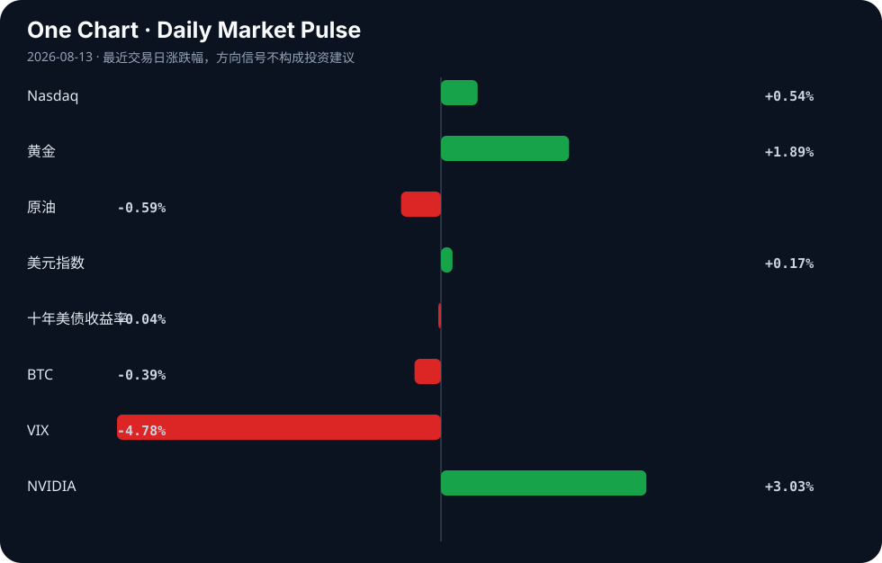

# Daily Intelligence
> 2026-08-13｜Thursday

## Today’s Thesis｜今日一句话
AI 发展正从“生成能力竞赛”转向“可靠性与数据确权竞赛”，而宏观层面的通胀降温并未消除输入型风险，资本因此加速从纯软件 AI 向物理 AI 与新能源实体溢出。

## ① Executive Summary｜30 秒
1. **AI**：AI 编码与智能体的验证瓶颈及数据抓取冲突（Twitch）成为核心矛盾，产业界开始建立事故追踪与沙盒可观测性机制 [A3, A8, A13, A22]。
2. **商业**：物理 AI（机器人）需求证实拓宽，电子皮肤等技术突破加速具身智能落地，中国货币政策定向赋能锂电池等实体制造 [B1, B11, B19]。
3. **宏观**：美国 7 月通胀降至 3.4% 符合预期，但中国央行警告输入型通胀风险，资本在降息预期与避险情绪交织中流向黄金与新兴市场本土制造 [B23, B24, B3, B5]。

## ② AI Daily

### AI 代码验证瓶颈与反噬
**What Happened**：开发者普遍反映 AI 代码验证已成为主要瓶颈，因担心 AI 代码静默崩溃而不敢交付上线 [A3]；同时“AI 编码及其不满”情绪在技术社区蔓延 [A19]。
**Why It Matters**：AI 提升了生成速度，但验证成本并未消失，反而从“编写成本”转移为“审查成本”。
**Second-order Effect**：AI 生成代码量激增 → 人工验证带宽成为硬约束 → 交付风险累积 → 迫使开发流程引入严格的沙盒与运行时可见性工具 [A22]，并催生针对 AI 代码的专门测试框架 [A1]。

### 数据确权冲突与水印军备竞赛
**What Happened**：亚马逊默认使用 Twitch 主播内容训练 AI 引发社区强烈不满 [A8]；同时，移除 AI 文本水印的工具已公开出现 [A12]。
**Why It Matters**：模型对高质量数据的饥渴导致平台单方面更改条款抓取数据，触发创作者反弹；而水印移除工具让 AI 内容溯源失效。
**Second-order Effect**：平台单方面抓取数据 → 创作者反弹与法律诉讼 → 水印与反水印技术军备竞赛 [A12] → 最终迫使立法确立数据分账机制或强制 opt-out。

### 智能体安全与事故追踪建制化
**What Happened**：英伟达、思科等 120 家组织提议建立 AI 智能体事故追踪机制 [A13]；情报界 CIO 警告自主 AI 智能体正在重塑网络威胁 [A17]。
**Why It Matters**：智能体从沙盒走向生产环境，其不可预测性带来的不是单一软件崩溃，而是真实世界的物理与网络安全灾难。
**Second-order Effect**：自主智能体部署 → 网络攻击面扩大与事故频发 [A17] → 行业建立类似航空业的事故追踪库 [A13] → 智能体保险与合规审计成为强制前置条件。

## ③ Business Daily

### 制造/机器人：物理 AI 的穿透
Q2 2026 机器人财报显示物理 AI 需求正在拓宽 [B11]，电子皮肤让机器人更接近人类触觉 [B1]。AI 解决了“如何构建”，但“构建什么”仍由人类意图决定 [B2]。
**机制**：大模型降本 → 机器人“大脑”成本下降 → 硬件（电子皮肤等）突破补齐感知短板 → 物理 AI 从单一工业场景向泛化服务与家庭场景渗透。

### 能源：供应链的本土化重构
非洲国家押注本土太阳能工厂以解决停电和就业问题 [B5]；中国央行货币政策加大对锂电池行业的赋能力度 [B19]。
**机制**：电网不稳定/碳中和约束 → 依赖进口设备转向本土化制造 → 政策信贷定向倾斜 → 新能源产业链从集中式全球化向分布式本土化重构。

### 金融/半导体：算力基础设施金融化
Cerebras 股价暴跌 16% 因业绩未达预期 [A14]；华尔街和英伟达正在为 AI 热潮构建奇特的资金管道 [A16]。
**机制**：算力军备竞赛 → 资本支出极度膨胀 → 传统股权融资不足以支撑 → 华尔街设计异形金融管道（如资产证券化/租赁）→ 算力基础设施金融化。

## ④ Macro Observation｜机制分析

**世界正在发生什么？**
美国 7 月通胀降至 3.4% 符合华尔街预期 [B23]，市场据此交易降息预期；但中国央行警告输入型通胀风险，认为海外加息可能仍存 [B24]；前中国总理朱镕基逝世 [B18]，其代表的市场经济架构引发历史性回顾。

**为什么发生？**
全球供应链与政策周期错位。美国通胀降温源于商品价格回落，但服务与工资粘性仍存；中国面临海外利率高位带来的汇率与输入型价格压力，导致内外政策空间受挤压。

**资本如何流动？**
资本在“软着陆”叙事下回流科技（纳指涨），但同时增持黄金对冲宏观不确定性（黄金涨 [B3]）。资本从纯软件溢出至实体：物理 AI、新能源本土制造与太空经济 [B11, B5, B14]。

**接下来关注什么？**
美联储对 3.4% 通胀的解读（是否确认降息路径），以及中国应对输入型通胀的政策对冲（降准降息空间是否受压）。

**机制与反身性**：
通胀降温 → 降息预期升温 → 金融条件宽松 → 资本涌入 AI 算力基建 [A16] → 算力能耗激增 → 电价与能源通胀反弹。此反身性循环意味着，软着陆带来的宽松可能正是引发下一轮能源供需紧张与通胀反弹的种子。

## ⑤ Signal Dashboard
| 指标 | 最新值 | 今日 | 信号 |
|---|---:|:---:|---|
| [Nasdaq](https://finance.yahoo.com/quote/%5EIXIC) | 26,588.49 | ↑ +0.54% | 风险偏好改善 |
| [黄金](https://finance.yahoo.com/quote/GC%3DF) | 4,459.30 | ↑ +1.74% | 避险/通胀对冲增强 |
| [原油](https://finance.yahoo.com/quote/CL%3DF) | 82.69 | ↓ -0.61% | 通胀压力缓解 |
| [美元指数](https://finance.yahoo.com/quote/DX-Y.NYB) | 99.98 | ↑ +0.17% | 金融条件偏紧 |
| [十年美债收益率](https://finance.yahoo.com/quote/%5ETNX) | 4.68 | → -0.04% | 中性 |
| [BTC](https://finance.yahoo.com/quote/BTC-USD) | 63,361.58 | ↓ -0.30% | 中性 |
| [VIX](https://finance.yahoo.com/quote/%5EVIX) | 14.55 | ↓ -4.78% | 风险偏好改善 |
| [NVIDIA](https://finance.yahoo.com/quote/NVDA) | 224.09 | ↑ +3.03% | 风险偏好改善 |

## ⑥ Deep Insight

### AI 代码验证瓶颈与“生成即负债”范式转移

当前 AI 编码工具的普及正面临一个严峻的范式转移：代码生成的边际成本趋近于零，但代码验证的边际成本并未下降，甚至因幻觉和隐性依赖而上升。开发者普遍反映，AI 代码验证已成为主要瓶颈，由于担心 AI 代码静默崩溃，他们不敢将代码交付上线 [A3]。Cal Newport 提出的“AI 编码及其不满”精准概括了这一困境 [A19]：AI 加速了构建过程，但“构建什么”以及“构建是否可靠”的重担完全压在人类审查者身上 [B2]。

这揭示了一个容易被忽略的非共识视角：在软件工程中，**AI 生成的代码正从“资产”转变为“负债”**。传统上，代码是创造价值的资产；但在 AI 辅助下，未经充分验证的代码引入了未知的技术债和安全漏洞。AI 生成代码量激增 → 人工验证带宽成为硬约束 → 交付风险累积。这种约束反转正在催生新的产业需求：AI 沙盒与运行时可见性工具 [A22]、AI 智能体事故追踪机制 [A13]，以及针对 AI 代码的专门测试框架 [A1]。

更深层的机制在于，AI 编码的“速度暴政”破坏了传统软件工程的反馈循环。过去，编写慢意味着有更多时间在脑内推演；现在，瞬间生成的大段代码剥夺了开发者的心流审查时间，导致“看不过来”的认知过载。此外，AI 课程甚至会将 Golang 错误地生成为围棋游戏内容 [A11]，这种跨语境的幻觉在代码中极难通过肉眼发现，往往在运行时才爆发。

**反方观点**：随着模型能力提升（如推理增强），幻觉率将显著下降，AI 也能自动生成测试用例自我验证，验证瓶颈只是暂时的过渡现象。

**证伪条件**：如果未来 6 个月内，主流 AI 编码工具的代码采纳率从目前的 20-30% 跃升至 70% 以上，且生产环境重大故障率未同比上升，则说明“验证瓶颈”已被模型自身的可靠性进化所消解，而非依赖外部验证工具生态。若非如此，AI 编码工具将被迫降级为“只读参考”而非“直接集成”工具。

## ⑦ Tomorrow Watch
1. 验证：美国 7 月 CPI 数据的细分项（尤其是核心服务与住房）是否支撑通胀持续降温的叙事 [B23]。
2. 关注：中国央行针对输入型通胀风险的具体对冲工具落地（如外汇干预或定向流动性投放）[B24]。
3. 追踪：亚马逊 Twitch 默认数据抓取政策引发的创作者集体诉讼或平台退群规模 [A8]。
4. 验证：Cerebras 股价暴跌后，市场对非 GPU 算力架构（如晶圆级计算）的资本开支意愿是否发生实质性萎缩 [A14]。
5. 关注：英伟达等 120 家组织提议的 AI 智能体事故追踪机制是否获得标准制定机构（如 NIST 或 ISO）的采纳程序启动 [A13]。

## ⑧ One Chart

图表显示了风险资产（纳斯达克、英伟达）与避险资产（黄金）的同步走高，而 VIX 指数大幅下降。这种看似矛盾的同向上涨，反映了市场在通胀降温带来的流动性宽松预期下，同时增持风险资产与抗通胀/避险资产，暗示宏观交易处于“软着陆”与“隐性风险”的叠加态中，相关性并非单向因果。

## ⑨ Quote of the Day

> “The biggest risk is not taking any risk.”  
> — Mark Zuckerberg

**中文理解**：在快速变化的系统里，完全不承担风险本身也可能是最大的风险。

**Why it matters today**：这句话不是装饰，而是今天观察 AI、商业和宏观变化时的一个思考框架：先看机制，再看价格；先看约束，再看叙事。
## ⑩ Action Items｜今天值得思考什么
1. 思考：你的组织中，AI 生成的代码或内容，审查成本是否已经超过了从零开始编写的成本？
2. 验证：平台（如 Twitch）的用户协议中关于数据训练的 opt-out 条款是否具备法律可执行性 [A8]。
3. 追踪：物理 AI（机器人）在 Q2 财报中需求拓宽的具体应用场景，是否正在从仓储物流向更复杂的柔性制造转移 [B11]。
4. 比较：华尔街为 AI 算力构建的“异形资金管道” [A16] 与传统数据中心 REITs 在融资成本和期限错配上的风险差异。
5. 关注：中国央行“金融赋能锂电池”政策 [B19] 与非洲本土太阳能工厂建设 [B5] 在供应链重构中的共振效应。

## 信息边界
本报告新闻来源覆盖 Hacker News、Google News（科技、宏观、政策）、Reuters、WSJ、Bloomberg 等英文与中文聚合源。时效截至 2026 年 8 月 12 日晚间（UTC）。市场数据为最近交易日收盘值。部分中文新闻经由 Google News RSS 聚合，重要判断请依链接回溯原文验证。未包含未提供的一手产业数据或非公开信源。

## Sources

### AI

- [A1：Agentic AI tests for orchestrators on CLI](https://github.com/insightitsGit/prism-eval) — Hacker News · AI
- [A3：Ask HN: Is AI code verification becoming your main bottleneck?](https://news.ycombinator.com/item?id=49279494) — Hacker News · AI
- [A8：亚马逊将默认使用Twitch主播内容训练AI模型引发社区强烈不满- AI 人工智能 - cnBeta.COM](https://news.google.com/rss/articles/CBMiYEFVX3lxTFBsQkNhaEJmOXU1YWdGcE9WR045WVlzd1pOcnhTLV9QcFBfMHZhc3NTR1RlZWptWnVKUTNjVC1kOEVnczh0cmUtWkFSZVRVaUcxNVUtS1ljclFieG00LXZ3bQ?oc=5) — Google News · AI 中文
- [A11：AI Course for Golang incorrectly generates content about the Go board game](https://github.com/nilbuild/developer-roadmap/issues/10226) — Hacker News · AI
- [A12：Show HN: Remove AI Watermark from Text](https://nomark.me/#text-watermark) — Hacker News · AI
- [A13：英伟达、思科等120家组织提议建立AI智能体事故追踪机制 - finance.sina.cn](https://news.google.com/rss/articles/CBMisgFBVV95cUxQb3BlLVRvTFpFX01kS0RUN1d0XzZ3Vlo2b0NnLS11V2xuVThKRHBDdEFNYjByVzl5UF9sTzlFbE9lb3d1Ul9Hdk5mcjlXN2JkMXZwdUVyOFB0d3RfU3lkYTRaLVcyN2hEVmgwVGsyYzhFMGJpSVFXeGh0UGRHZl84cmFqZVdMWWRUUlJhR1FXS1Bwdi1Fd2hXWGhzdnZmWXBLbl84dWxIa1BqQWhzSnNudHFn?oc=5) — Google News · AI 中文
- [A14：Cerebras shares plummet 16% after results fail to impress investors - Reuters](https://news.google.com/rss/articles/CBMingFBVV95cUxPS3RxTUJxMTh2Mk9XSmgxdm1MZDh6MlRtcVl5aFM1bmF1ajVmWlFnUF9nNU0yYjloQ0pON2VSWFZBYTVldmJ0TGI5N2psYlcwZVRuSURZaUM1NkYzVkh4NGVNRUtjd0F0M3RMTno2X0RSNG9VbF91V2lDOUh0OG5nSDJiY2M4cDdrM1lGRnNicldnNXBBQTBDRFVzNHdJQQ?oc=5) — Google News · AI
- [A16：Why Wall Street and Nvidia Are Building an Exotic Money Pipeline for the AI Boom](https://www.wsj.com/tech/ai/why-wall-street-and-nvidia-are-building-an-exotic-money-pipeline-for-the-ai-boom-346ba482) — Hacker News · AI
- [A17：Intelligence Community CIOs Warn Autonomous AI Agents Are Reshaping Cyber Threat Landscape - ExecutiveGov](https://news.google.com/rss/articles/CBMikAFBVV95cUxQT1FLd2hJQWJubUNZel9HZFJvN2ZaeXZBYTJNdnRFWGlGbDY1NnFaV3lSeVhhSkJwdlpsZWdWcFl3bGtJazhLZmVJblNCYVpOUjZmLWFUdUZzSVJRVDRDcjlxVzhvbm5HeUIycVpQRWxKdmt5UXgzdlpieUV6dXJvQzlTQ1FfNDFQV3VfWjF0Vk8?oc=5) — Google News · AI
- [A19：AI Coding and Its Discontents](https://calnewport.com/on-ai-coding-and-its-discontents/) — Hacker News · AI
- [A22：AI Agent Sandboxes Stop Escapes. They Don't Tell You What Happened Inside](https://rye.ai/blog/ai-agent-sandboxes-ebpf-runtime-visibility/) — Hacker News · AI

### Business & Macro

- [B1：Electronic skin brings robots one step closer to human touch - Digital Journal](https://news.google.com/rss/articles/CBMiogFBVV95cUxNcjJYaWp5cS14YkZVT1JaQzRVY1A1T2VXbW5OUjdXLTVOQUVpLVVoTnV6b3hUT2tMZmZjVmRhTWxtREJUdV9icUlqWEtVZnBWb0k4QjZKdGMwR05JNTRIa2VrWWl4d2F3U0NORjNoSENNZjRiblIyOTVvMTNDd3BhUi1xRUFiNVRKSjdrckhBUmdDU3pCT0ZRV0VqZTdzQktMQWc?oc=5) — Google News · Technology Business
- [B2：AI Eases Building, Sure, But Knowing What To Build Is Still A Human Task - Automation World](https://news.google.com/rss/articles/CBMixwFBVV95cUxPUjJfZE9QUWY5b29PSHNaTnIzNU9adVQtdnVNZHRBdEVHWXdfcm0wVURNQ3RBdGNHVHAyRFNqa1E2ZzhvczFJMnBkbEtRTUMwRFg3M2V4emljY1oyN04teWZzYmUySnlqelFZT053aFRzZ1AxT1VLNERlUTZGLV9qZ0RXNmYyTVItWUlCTm1XSTJ4Q1Z4V0tuZEFyNmJzZXBBR1FNdFVoV2JSaGpQQmQ4VlNmSjA5ZXVBc09wVFhUdlVQMU5taG4w?oc=5) — Google News · Technology Business
- [B3：How the market is trading gold as Fed rate hike and inflation odds shift - CNBC](https://news.google.com/rss/articles/CBMihgFBVV95cUxQcE9EUXZra0w3S0ZDbGRzTHRDc1dyMEc0ZkpWVEFaeElqYVN5eWFFdzhPVE1qTDBPdnJPNHc0UlloNlhQem1KQUhhZTVOVTJWT1JCelRnUkpBLU9BaGs2blVNT2NZaUFlYUJpOVRBeVZndE9TaE5aOWxieHlwRFJsLVhRR3p3d9IBiwFBVV95cUxOV0ZZUWFRWEsyVGtkaFdSTGlYRi1BN290OEdpdFJ4dU8yVXFGbksxQmtZN0hfdTRuT05BUHQyR29Hdm5XdHhmOEhTUTNOSmFHTjB3cDRaVnlMTEtTUjJGa3hadFFmLVQ4SkRmbjdSNFJrVjd5cTVja2Q2OG1ZLTNGSTlrdTBiVmJnWUVJ?oc=5) — Google News · Markets Policy
- [B5：African nations bet on homegrown solar factories to cut blackouts and create jobs - The Cool Down](https://news.google.com/rss/articles/CBMipAFBVV95cUxQVnZMdG1rZlFSeG5nQmIwdktNV2JxbTV4MWExQXBaaU5MVGc5eDFTYVFtVmw4NWEwRks2dktRUXYtWnQ5R0VuNnUyUVR1azRKNC1OaXRRZDZjWl94SU5CaFlscHIyQnNUUlZteWxFUWdWUEwyV3RlXzFvRGhwYnY3b1dKS2JSbk9wZXprQUdHR2gzd1R1SG1xdEJKQXQwaWY5Y0E5YQ?oc=5) — Google News · Technology Business
- [B11：Q2 2026 Robotics Earnings Show Physical AI Demand Broadening - ETF Database](https://news.google.com/rss/articles/CBMiogFBVV95cUxPRnoxNlY3cXlveDJNRTNzMjNfLVdzaExvZ2s5Z3dqV1NzcUdLZTJhVUotWktpVVJXX2pvMHNHREdaOUp3djJ3UzYxdEp6a2VlZnVzb0NwbEZOMjJDSUh2eFdUTEJnNmQtb1lIUlBnQ09KWnhPeExQZkF6QV9LSzQ3NWd3WkUxb3BUb01iQ1I5dEljdGRvTTlZdi11Sk9XV21GTlE?oc=5) — Google News · Technology Business
- [B14：Investing In The Space Economy: The Syntax Space Industry Index - Seeking Alpha](https://news.google.com/rss/articles/CBMimwFBVV95cUxORUptYXl2SnBkeFZieTMzNzVCdE56ejZ1NzY3Sl9qdTloNlFaSnZjZTl6Nk1jNGZLRnJfeFZoOGJYUURLWGdHVl9lNE9lb3RxZFREaGplN3JJZFg4TnpmNGhZVTRNLXVpbTJDRy12ZXRWRXZQVmlTS3paUl9YWnVOTUotTmkxWWhFc0dfOWlPODI3Z0xxamFEaFVESQ?oc=5) — Google News · Global Economy
- [B18：Former Chinese Premier Zhu Rongji Dies, Market Economy Architect - 조선일보](https://news.google.com/rss/articles/CBMihAFBVV95cUxNQzV3V3hIVDdoX09BX2RwYW9KNzJTWVBZcVFpNlFnY1Fqb0hzSUk1X3VYQ1N3anVHTkVyOXNFTkZmUDVxTGYwWUI2WGstS2F3dU4xMGVmZUhZMkdicnV5ekZjUDJqMXd0aXBjdGw4d0V4eHBiOV8tdWRoNENmeDFMMkdfOGc?oc=5) — Google News · Markets Policy
- [B19：【新华解读】货币政策执行报告“上新” 金融赋能锂电池等行业力度加大 - 中国金融信息网](https://news.google.com/rss/articles/CBMiakFVX3lxTE94T1YzYzV6Q1RBWGVDVnpXeGF4OU5hZTRocW91cTVZNGNGdTlINm1tY1gwdHdPQnltTU84UDY0a0NRaEdORjhmZU5Kb0Iyc0o3TkVsR0F0VjB3MlFLTG00eFRWSmlhbldBclE?oc=5) — Google News · 行业
- [B23：Dow Jones Edges Higher As July Inflation Cools To 3.4%, Meeting Wall Street Expectations - International Business Times Australia](https://news.google.com/rss/articles/CBMihAFBVV95cUxNWGlJcVFONnlNT1RTZWFhU1VTV2dDRGxrMGxsc2tUZHJBQ2FyN2J6ZEh0YjhsOExpLUlsWEh2bUZVR2w2T3h5NVFxbk9WSGpzby0wWGExLURoWm1LQ2hWOHpsV3dZTVVZbGZ3a29LRFc5S1BDR1dxc2htMHF3ZjJxZnZabUE?oc=5) — Google News · Markets Policy
- [B24：PBOC Warns of Imported Inflation Risks, Sees Overseas Rate Hikes as Potentially Milder Than Past Episodes - finance.biggo.com](https://news.google.com/rss/articles/CBMidkFVX3lxTE02dGtIbVg3S2Zfd2tHRnZpaDhOeHhzVkRIcFdIY0JndGd0VkFqM3BIcFpzV2J1NnRSRE94N1JBajJaQ202c0R6blJPTUdrVTdCQUJFWkFoQ1hmdGJCblFSQmVHdlVwSUowWVlaNVdvd1RWYTVpYXc?oc=5) — Google News · Markets Policy
