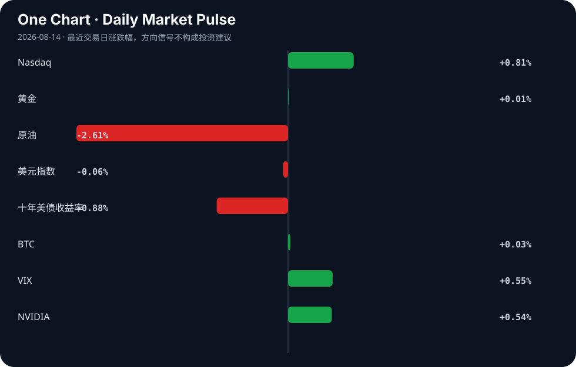

# Daily Intelligence
> 2026-08-14｜Friday

## Today’s Thesis｜今日一句话
AI 竞争的主战场正从算力集中度转向产业渗透度：开源与本地化算力瓦解中心化垄断，而 AI 对能源的真正重塑不在数据中心的电力消耗，而在对传统油气行业的效率革命。

## ① Executive Summary｜30 秒
- **AI**：开源模型与本地化算力（Mistral 的 1GW 欧洲算力计划 [A20]）正在改写竞争规则 [A1]，打破对中心化云巨头的依赖。
- **商业**：AI 正在重构传统行业价值链——将药物发现时间缩短至数月 [B22]，并优化油气行业的能源消耗 [A10]，而传统软件公司则面临 PE 退出压力 [A8]。
- **宏观**：全球制造业正在分化，印度瞄准特定关键领域以追赶中国 32% 的份额 [B18]，而传统行业（浮法玻璃 [B11]）则在需求疲软和产能过剩中挣扎。

## ② AI Daily

### 开源与本地化算力对抗中心化云
**What Happened**：开源正在改写 AI 竞争规则 [A1]；Mistral AI 计划到 2030 年建设 1GW 的欧洲本地算力以锁定客户 [A20]。
**Why It Matters**：控制基础设施的范式正从“集中式全球云”向“区域主权算力”转移，数据合规与地缘政治正在重塑算力版图。
**Second-order Effect**：本地化算力建设 → 区域数据主权得到物理保障 → 美国中心化云巨头在欧洲等市场的定价权与市场份额被削弱。

### AI 能源叙事的反转
**What Happened**：分析指出 AI 对能源的最大影响可能不在数据中心，而在油气行业的效率优化 [A10]；同时，减少 AI 聊天机器人自身能耗的方法正在被探讨 [A6]。
**Why It Matters**：市场对“AI 耗尽电网”的线性担忧被证伪，AI 作为优化工具正在延长传统化石能源的经济寿命。
**Second-order Effect**：AI 优化油气开采 → 化石燃料短期边际成本下降 → 绿色能源相对价格优势减弱 → 绿色转型资本支出可能放缓 [B6]。

### 代理式 AI 与决策权让渡
**What Happened**：美国国防情报局（DIA）设想支持军事行动的“代理对代理”AI 交互 [A7]；情报机构对采用代理式 AI 持审慎态度 [A19]；同时有警告称 AI 狂热正在抹杀全球决策能力 [A24]。
**Why It Matters**：代理式 AI 正在进入高风险地缘政治领域，机器速度的交互可能导致人类监督的真空。
**Second-order Effect**：代理对代理交互常态化 → 机器速度冲突风险上升 → 强制要求 AI 安全与对齐的监管资本支出激增 [A11]。

## ③ Business Daily

### 科技
AI 正在挤压传统软件公司的估值，涌入该领域的私募股权投资者面临退出困境 [A8]。同时，平台开始反思 AI 泛滥，LinkedIn 呼吁用户减少对 AI 的依赖 [A18]，预示着“AI 生成内容贬值”的商业反噬开始显现。

### 能源
AI 对能源的影响焦点发生转移。一方面是数据中心能耗优化的需求 [A6]；另一方面，AI 作为“透镜”深入油气行业优化开采 [A10]，这与“谁应该建设低碳经济”的全球辩论 [B6] 形成张力：AI 既在节省能源，又在提高化石能源的竞争力。

### 医疗
Forbes 报道 AI 已将药物发现时间从数年缩短至数月 [B22]。这不仅是时间成本的降低，更是研发资本周转率的指数级提升，将彻底改变生物科技行业的融资逻辑和管线估值模型。

### 制造
全球制造份额重构加速。印度 NITI Aayog 划定 12 个关键部门，试图挑战中国 32% 的全球制造份额 [B18][B21]。与此同时，传统制造业如浮法玻璃行业正因需求疲软和产能过剩而破裂 [B11]，显示出新旧产能的冰火两重天。

## ④ Macro Observation｜机制分析

**世界正在发生什么？** 
全球供应链与算力网络正在同步经历“区域化重组”。制造业上，印度试图以政策划定关键部门来承接产能转移 [B18]；算力上，Mistral 建设欧洲本地算力 [A20]，香港推进 AI 落地 [B13]，都在追求区域自主权。

**为什么发生？** 
地缘政治导致对供应链韧性与数据主权的诉求超越了对纯粹效率的追求。此外，[A24] 指出的“AI 狂热抹杀全球决策能力”使得系统变得脆弱，各国倾向于将关键基础设施（制造与算力）掌握在自己手中以对冲不确定性。

**资本如何流动？** 
- **事实**：资本正流向 AI 基础设施（如 Nebius 股价飙升 [A23]）、AI 安全（匹兹堡安全公司扩招 [A11]）及区域创新中心（哈特福德获 2000 万美元 funding [B2]）。
- **推断**：资本正从缺乏 AI 防御护城河的传统软件 PE 交易中撤出 [A8]，并可能因为化石能源边际成本下降而暂时放缓对长周期绿色基建的投入。

**接下来关注什么？** 
本地化算力设施的实际落地进度，以及 AI 优化传统产业（如油气 [A10]）带来的利润增长是否会引发绿色转型资本的实质性回流。

## ⑤ Signal Dashboard

| 指标 | 最新值 | 今日 | 信号 |
|---|---:|:---:|---|
| [Nasdaq](https://finance.yahoo.com/quote/%5EIXIC) | 26,803.03 | ↑ +0.81% | 风险偏好改善 |
| [黄金](https://finance.yahoo.com/quote/GC%3DF) | 4,409.40 | → +0.01% | 中性 |
| [原油](https://finance.yahoo.com/quote/CL%3DF) | 81.10 | ↓ -2.61% | 通胀压力缓解 |
| [美元指数](https://finance.yahoo.com/quote/DX-Y.NYB) | 99.95 | ↓ -0.06% | 中性 |
| [十年美债收益率](https://finance.yahoo.com/quote/%5ETNX) | 4.64 | ↓ -0.88% | 利好久期资产 |
| [BTC](https://finance.yahoo.com/quote/BTC-USD) | 63,421.10 | → +0.03% | 中性 |
| [VIX](https://finance.yahoo.com/quote/%5EVIX) | 14.63 | ↑ +0.55% | 市场稳定 |
| [NVIDIA](https://finance.yahoo.com/quote/NVDA) | 225.30 | ↑ +0.54% | 风险偏好改善 |

## ⑥ Deep Insight

### AI 的“透镜效应”与能源叙事的反转：从电力黑洞到化石燃料延寿剂

当前市场对 AI 能源影响的叙事高度集中于“数据中心将耗尽电网”，这是一种基于静态模型的线性外推。然而，[A10] 提出了一个极易被忽略的非共识机制：AI 对能源的最大影响不在数据中心的电力消耗，而在对传统油气行业的效率革命。结合 [A5] 将 AI 视为“透镜”而非主体的隐喻，AI 的本质不是创造新的能源需求，而是以过去不可能的方式优化稀缺资源（如油气储量的勘探与开采效率）的配置。

这一转变构建了一个强烈的宏观反身性循环。事实层面，AI 算法正在进入油气等传统高耗能产业优化勘探与开采流程；推断层面，这种优化将显著降低化石燃料的边际开采成本。当化石燃料的边际成本因 AI 优化而下降时，绿色能源的相对价格优势将被削弱，这会导致 [B6] 所探讨的“绿色转型”资本支出在经济性考量下放缓。换言之，AI 在短期内不是绿色转型的加速器，而是化石燃料的“延寿剂”。资本流动将验证这一推断：在短期回报的驱使下，流向油气 AI 优化的资本回报率可能显著高于长周期、受政策波动影响的绿色基建。

同时，算力基础设施的地理分布正在重塑这一机制。[A20] 中 Mistral 计划建设 1GW 欧洲本地化算力，不仅是算力主权的宣示，更意味着能源消耗的地理重塑。欧洲相对高比例的绿色能源配比可能支撑本地化算力的 ESG 叙事，但这反而将化石燃料的优化压力与碳排放转移给其他缺乏绿电但拥有化石能源优势的地区，形成全球范围内的“碳泄漏”新路径。

此外，这种效率革命正在加剧传统产业的分化。能利用 AI 优化开采的油气企业将获得更长的存活期，而无法利用 AI 优化产能的传统制造业（如浮法玻璃 [B11]）则在需求疲软中加速出清。AI 不是一个中性的加速器，它是一面透镜，放大了既有资源的控制力，让化石燃料在终局到来前拥有了最强劲的反扑能力。

**反方观点**：AI 同样能加速材料科学与电池技术的发现（如 [B22] 中 AI 缩短药物发现时间，类似逻辑可应用于新能源材料），长期看将降低绿色转型成本，从而抵消对化石燃料的延寿效应。

**证伪条件**：若未来 12 个月内，全球油气行业的 AI 优化资本支出增速未能超过数据中心电力基建增速，或绿色能源的度电成本在 AI 辅助下出现断崖式下降，此“化石燃料延寿剂”论点即被证伪。

## ⑦ Tomorrow Watch
1. Mistral AI 欧洲 1GW 算力计划的监管审批与初期选址进展 [A20]。
2. 印度 NITI Aayog 划定的 12 个制造业部门的具体政策补贴细则 [B18]。
3. 匹兹堡 AI 安全公司扩租后的实际招聘进度与客户结构 [A11]。
4. 浮法玻璃行业在产能过剩下的头部企业债务违约或重组信号 [B11]。
5. OpenAI ChatGPT 计算机历史功能上线后的用户端隐私数据合规审查反馈 [A22]。

## ⑧ One Chart

十年美债收益率下行与原油价格下跌同步发生，暗示市场正在定价通胀压力的缓解与经济需求的放缓。纳指与英伟达的微幅上涨与债券收益率下行呈现相关性，但并非因果，利率下行提供的流动性估值支撑可能掩盖了宏观需求端潜在的疲软。

## ⑨ Quote of the Day

> “The nature of technology is that it creates previously impossible ways to economize on scarce resources.”  
> — Marc Andreessen

**中文理解**：技术的本质，是让人类用过去不可能的方式节约稀缺资源。

**Why it matters today**：这句话不是装饰，而是今天观察 AI、商业和宏观变化时的一个思考框架：先看机制，再看价格；先看约束，再看叙事。
## ⑩ Action Items｜今天值得思考什么
1. 验证 Mistral 1GW 欧洲算力的具体时间表、资金来源与绿电匹配度 [A20]。
2. 比较 AI 在油气优化 [A10] 与在绿色转型 [B6] 中的资本支出增速与实际回报率差异。
3. 追踪印度 NITI Aayog 划定的 12 个制造业部门的落地政策，评估其替代中国产能的真实潜力 [B18]。
4. 关注传统软件公司在 AI 压力下的估值重估与 PE 退出受阻的连锁反应 [A8]。
5. 思考“Agent-to-Agent”在军事情报 [A7] 中的采用，是否会引发新一轮 AI 安全军备竞赛及相应的监管反弹 [A24]。

## 信息边界
本报告事实部分仅基于 2026 年 8 月 13 日 15:00 至 22:53 (GMT) 间的 RSS 聚合源与新闻链接。宏观推断基于既有事实的逻辑推演，未引入外部数据。市场数据反映最近交易日收盘或特定时点快照，存在滞后性。部分新闻来源为二手聚合，重要判断需读者回到原文验证。

## Sources

### AI

- [A1：开源改写人工智能竞争规则 - rss.jingjiribao.cn](https://news.google.com/rss/articles/CBMiY0FVX3lxTE0ydzAyZWRXejc4U0M3azVtOFUyVHAxS1RDVTFGME5xZXhfZkVRZzAwVGhScHdnckt2NlpqV1pyeFlrS0J3cjNWTDhqa0lZaTFwSTN4NmhUbFUwellEdmtUVk5LMA?oc=5) — Google News · AI 中文
- [A5：Think of AI as a lens, not a person](https://aethermug.com/posts/gen-ai-is-a-lens-into-humanity) — Hacker News · AI
- [A6：Using AI chatbots? Here are four ways to reduce the energy drain](https://knowablemagazine.org/content/article/food-environment/2026/four-ways-to-reduce-energy-use-with-ai-chatbots) — Hacker News · AI
- [A7：DIA’s artificial intelligence chief envisions ‘agent-to-agents’ interactions that support military operations - DefenseScoop](https://news.google.com/rss/articles/CBMihwFBVV95cUxOb1NwNTkyOXlqeGZLNEV1M2hmLUxJSEt5NzlnT1M2dEpHVGlJMlNuOFNmVmNFeWk5blFpMFNDTmN3SUE0RHdsWmhzU1pFSU1OWXFRejdmUGxwb1R1TWNrRm85cVktaTFVVGZmSzZ5bXVETzJoeHVqY2ZHMjNqRmd5dndOclItbXc?oc=5) — Google News · AI
- [A8：AI Looms over Software Companies – and the Investors Who Piled into Them](https://www.bloomberg.com/graphics/2026-ai-private-equity-software/) — Hacker News · AI
- [A10：AI对能源最大影响或不在数据中心，而在油气行业 - 新浪财经](https://news.google.com/rss/articles/CBMijwJBVV95cUxPeUhDdUhBUUJVWTNMaTJCUk02VGFlSGhkSE9EZXpnMmw4b29CNS1ZLUExVVhBNEExZWxjaTdHY0o1bGdRc0JkRFFGQXVfLU5HWTZicHdGVV9vOEZyWlNXY3dyZVVzSHlLOEJuN256YUprcVhlUHdpTy03LVM2U1ktWnJ6MzJkWkZuaFNrVm5XdHhBY2dmdEEtRDZDYWFCOEhjcFdMZnRlNzNZcG1EMzhNQmtLYndpbF9HdzRTdGk4b1F3cHhRdUFpMTdFN1poei1qR0JxMDg3LUVvMU5ocUhIWFI1TUpIQU5mT1hMMVp1XzVrU3FIUGUwWkIzOTdIXzlNUDkwbXRjb3JiUWhsRFhJ?oc=5) — Google News · AI 中文
- [A11：Pittsburgh artificial intelligence security firm quadruples footprint and promises to double workforce - Pittsburgh Post-Gazette](https://news.google.com/rss/articles/CBMi1gFBVV95cUxNQWZpQXhNWWZqQnZ0NzRGaDdneDQ3UFo1bFlYSl8zQWVwMEczQUhMMTNCek5CZnl0d3lvaHhGNS11R2I0Z0xDc082aVVpOElTcC1OcUhmbmp0OHZmTllqRFpvZFk1bzRIWVZTdDFzMDI4b0ZPSW5UdG5uZkxFbFhPSjJkclF3dks1Yl9wR2duWUU1VWRNQ0pGV2ZSeUE1WFAyR3QxZFdxTkVZeWY4U1Zoa291bTU3ODMtSXhFYTg2LVdrTHBsdzBUT3k0Q0ptRUZId2pBbmJn?oc=5) — Google News · AI
- [A18：LinkedIn Wants Users to Lean Less on AI. Maybe Less](https://www.wsj.com/cmo-today/linkedin-wants-users-to-lean-less-on-ai-maybe-a-lot-less-8e03b2aa) — Hacker News · AI
- [A19：Intel agencies take deliberate approach to agentic AI adoption - Federal News Network](https://news.google.com/rss/articles/CBMixAFBVV95cUxNaGFqejNNaERVdkYwZW1ZVmxNaS1qV1BwQnlPX1dZMl9rM0RObVpIUDVoTjF5amV3WERaSVdnR0pHTHJjaHdIUEdNN1ZueVVQb2twMXhqaG1XWUptMGVuZnJsOFVHVW5hZUc3SzB5WGRjWGNVOTFVc3dNZUlUSFFfV3FMSEdabHNCUVk3Vk9SRDJuVmFnd2VNMU5FdHVyZDZ6RW1Rd295dHJIWjBFb2dRU216aC1LOGhSX2dYZUlfZGpuXzJD?oc=5) — Google News · AI
- [A20：Mistral AI Strategy](https://venturebeat.com/infrastructure/mistral-ai-wants-to-build-1-gigawatt-of-european-compute-by-2030-and-lock-in-customers-now) — Hacker News · AI
- [A22：OpenAI's ChatGPT Gains Context with Computer History Feature - StartupHub.ai](https://news.google.com/rss/articles/CBMiwAFBVV95cUxPSWZiWExNYVRhSmk0V2I2cUlaUGZUQmFRXzI1ZUlxV0FqcUt1aDV4TGJ0NHZlZXNsR2h6ZUpCT0hoRTNicFBXeHRWOE5VdkJhMkxlUDdwYWtvUXE2Ym9qRVBjZlg3QmVZSUpqV2J5cWZONTVraEliX1REOWU4aWpNS1F0T1IyN3VyeFR3TWdBWE91RjBYV1Uyb0ZBcFVOaG91elRZdGxyNTN2XzlBNWxHTDNzV3oyQklFRHVQVmFRUDc?oc=5) — Google News · AI
- [A23：AI Infrastructure Firm Nebius Spikes: Get Exposure in THNQ - ETF Database](https://news.google.com/rss/articles/CBMimAFBVV95cUxQRHNxcG00ZGRVUVVwWWdMT0lWSXFjQ0RlUGpwZWFfb0Nyak9ZNTRXX3JRX2VDeVo2S2l3NUdraHA1NkRSQ1BBZ1FucDBTLWF4M0NJM3JPYTJfbUpxNEtDZm42ZXU3YjN1c3AwWnBTY1hkUXpGTERHZGVWdldqNmYwRlkwbDFXOEtJdW5TdjkzSHR6U0o1N3IyNQ?oc=5) — Google News · AI
- [A24：AI Mania Is Eviscerating Global Decision-Making](https://ludic.mataroa.blog/blog/ai-mania-is-eviscerating-global-decision-making/#fnref:7) — Hacker News · AI

### Business & Macro

- [B2：$20M Funding To Build Hartford Innovation Center - Business Facilities Magazine](https://news.google.com/rss/articles/CBMihgFBVV95cUxPTFNYeVYwY2tJdjlsTkdBSDVwV2pqNDZyRVpxSGg1ampkd2ZSQzJPcFgzSXVTZ0tkejBrS0QxY1F5UlR6VDFTbVctWFJqczU3WGRCZTFMVFpyZEdBalNUZFJyNGRVdndLX3VGSU4yeWMyUTRzMTRCSDNuUHR2bWQ5TTF4SXFQdw?oc=5) — Google News · Technology Business
- [B6：Democratizing the green transition: Who should build the low-carbon economy? - weeklyblitz.net](https://news.google.com/rss/articles/CBMirwFBVV95cUxNYXY5ZDJERDhYRlo1UmlFV2l4N1k3aS1VbkVIT21Ka05ZVTF4ZVRIWXMxOWtXa0pacTI4bE9FSjlOWWtSR29kVEpxcXRpaDRSUU9aamVCaElET3pYRzY4SXloRVRXbUxjOEdkQVBzd1RHay1mN3VHWnN4amFQNmR2M0ozczJ6YzF6cE1UM0ZzbWVlMHNEcTZzbDFEX3YyWU9SdUlqT3VmUFRsLVBGbTBn?oc=5) — Google News · Global Economy
- [B11：Float glass industry cracks under weak demand, excess capacity - The Daily Star](https://news.google.com/rss/articles/CBMivAFBVV95cUxNTDZUdjVlQ0lfWERtTS1vVk1DYUlGTDBSUzFZN2NjWGU5QUJpR0haeEN5Zmo0Tks3ZGxfLU9ZeFVSMzg0b2lEdHJXNm1mZ1FkZ2ZnUUNCdGljZHM4cEpDZ1RVRGpNeWp6QUhLUEVKSHh6d3JXVGw1OTdoUnl4MEpSYm81cThWb2F5MUF3WktoU2htbEMyRFBMNGtyX2llQjlVaEIzaFJCQVdwWEJQX3p4WFYwRmRKXzRSMVpycQ?oc=5) — Google News · Global Economy
- [B13：Hong Kong is turning its AI ambitions into reality - chinadailyasia.com](https://news.google.com/rss/articles/CBMiWEFVX3lxTE1vNUFwMkNodlBzZUZRa1BCTzk2M05WUnFaUFVabm5nSHZSeklud2FVSm9TX2otZ3N2WHd1cmRmMlRMTGd1OU0tWElVX255WjBDa1JyTUQwOEE?oc=5) — Google News · Global Economy
- [B18：China’s 32% vs India’s 3.2%: NITI Aayog earmarks 12 sectors to shore up share in global manufacturing - ThePrint](https://news.google.com/rss/articles/CBMizgFBVV95cUxQWGNZbF9sWi1jWFZoTzFrWnBDeVhzUEl1TWlpQTBaU0tPTllobWtZYm5YbGFBUTBqRFB2c3hqa0hfZC1XX3o3V1dudVFZZTJwMVVSbjZqVTR5cVpqYXZlNktsRF90ZzM1V2RPSVVWdjNUN1FXRm5zU1RLckRGUmFoSnZtSU1VT0s3ZUozLTZ0WTRObnJRRTRZTHZHbHhlZVJ3Vndwdm44c2hjbHRiUDBoUW8wcXp6MFZLWUhFOXduWjlGY2x5SkhXWGdINkdFQdIB0wFBVV95cUxPMzhXQWROTWNuYlFIU1A2Y3Z2ZV85ck9fM3VndmhjUC1fTHNyWkxIb1lvNWJiMnZVMEM4NktPNFF2amc0X1U5VjRpdVI2Q2lUM3dnWjdBWldraS1UVlpCdE1GM2pENUFIY1Frc1dqX010TTQ2UEtmaHJzN1JDXzdFZEluQllzTHdXMnRTZXB6cVVXVkJWWlFHdkJzSkg2N0U1M1Q5OS1uRnVWcnhyNzBfSEdjYnNlZ3IyallvR1A4d0RtcW5rNkp1ZU5WZm5pLUpDYU1J?oc=5) — Google News · Global Economy
- [B21：NITI Aayog Picks Four Key Sectors That Can Make India A Global Manufacturing Hub - NDTV Profit](https://news.google.com/rss/articles/CBMiwgFBVV95cUxNcWFOcXVmX05tS0Z6NHd0aTF6Z2llMjZfYWpSd1JRT2V2aE9QVk9OUzVsMkRsV0NxTlY1S240QzJIYVo4d3dBV21lb2ppZEdDUGVBSVVRQkNEUTE4ekNtWGsta3UtR0Y0a1lwMm4xS2hfNWVab3FSZTZ3VGh5WVM4RFl0T25lVnVoRm1rSkRBeTlLUTlleEdkSmV5c2RMMTRJY1RaYWFZUG10NjlyM0RGZHNBQzlPdklSWVRLRUsyNXBwd9IBygFBVV95cUxQVF9HLWFfQ0k3aUp5bnoxMU1VSTVrQUNFTEhla1ZLNUxnN3lCWTJtYkExQzVXT2djNEtVYzRxSndhTkUzOXlkNDRNQnBuOFMtc0h0WlhzbDNqd1lMR2xYZUw2bi1ZbmYxYWJXS1VObG1MU2JORnhibDh5bDJocWRhRDdyWjNvTWJpcEhGV2syMzhvcG00UEx2WWdjOFRKcVJNQkRoRTJPczdzdmZteURhc0VBejhPcUl3R2R4VlJIaDc4bmRMcTF2blJn?oc=5) — Google News · Global Economy
- [B22：The Early Scale: Forbes reports AI slashes drug discovery timelines to months - MarketScale](https://news.google.com/rss/articles/CBMiiwFBVV95cUxQbC11aXVCQmU1d2lBUURQSkozVDNiMFBzZUJxeUZoZTdRbGEzUjVmQmJYWUdfRmhoT2tLM05kcDFUZHB0NzJiZDlibF91dURlQ3B1SjBRdFFvUkI2dmRzWlAtSW1jMEhJRXlmT0l1cjlqbVVKcVVxTTlrcG0tejhhaHVmQ1dvSVRjTmxR?oc=5) — Google News · Technology Business
