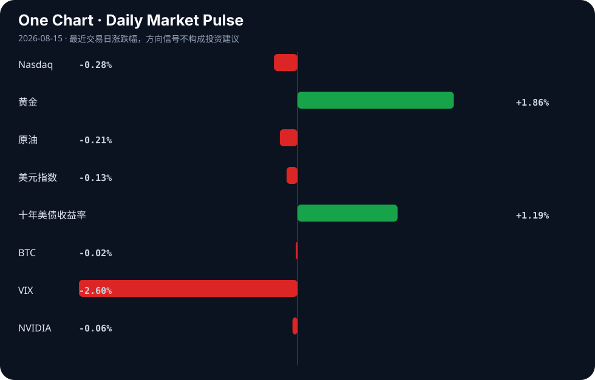

# Daily Intelligence

> 2026-08-15｜Saturday

## Today’s Thesis｜今日一句话

当前为基础版：信息已归档，但深度机制分析需要配置模型 API 后生成。

## ① Executive Summary｜30 秒

- AI：8月14日AI人工智能ETF平安（512930）份额减少1200.00万份，最新份额47.85亿份，最新规模31.28亿元 - video.sina.com.cn
- 商业：广发证券：怎么看近期黄金价格的上涨？ - 新浪网
- 宏观：先观察市场价格与后续数据是否支持当前叙事，避免从单日波动推导长期趋势。

## ② AI Daily

### 1. 8月14日AI人工智能ETF平安（512930）份额减少1200.00万份，最新份额47.85亿份，最新规模31.28亿元 - video.sina.com.cn [A1]

#### What Happened

8月14日AI人工智能ETF平安（512930）份额减少1200.00万份，最新份额47.85亿份，最新规模31.28亿元    video.sina.com.cn

#### Why It Matters

需要结合原始报道与后续产品、收入或采用数据验证其重要性。

#### Second-order Effect

事件 → 参与者调整资源配置 → 行业竞争与采用速度可能变化。

### 2. The Invisible Human-in-the-Loop: An Evolutionary Concept Analysis of Artificial Intelligence in Nursing Assistant Practice - Cureus [A2]

#### What Happened

The Invisible Human-in-the-Loop: An Evolutionary Concept Analysis of Artificial Intelligence in Nursing Assistant Practice    Cureus

#### Why It Matters

需要结合原始报道与后续产品、收入或采用数据验证其重要性。

#### Second-order Effect

事件 → 参与者调整资源配置 → 行业竞争与采用速度可能变化。

### 3. The CLI your AI agent drives to manage your knowledge graph [A3]

#### What Happened

Article URL: https://useokf.com/ Comments URL: https://news.ycombinator.com/item?id=49325279 Points: 1 # Comments: 0

#### Why It Matters

需要结合原始报道与后续产品、收入或采用数据验证其重要性。

#### Second-order Effect

事件 → 参与者调整资源配置 → 行业竞争与采用速度可能变化。

## ③ Business Daily

### 广发证券：怎么看近期黄金价格的上涨？ - 新浪网 [B1]

广发证券：怎么看近期黄金价格的上涨？    新浪网

### 荀玉根：牛市第三阶段的新叙事 - 新浪网 [B2]

荀玉根：牛市第三阶段的新叙事    新浪网

### 34.6亿人次出游大数据：银发族“重康养、追体验”，2026上半年文旅洞察 - AgeClub [B3]

34.6亿人次出游大数据：银发族“重康养、追体验”，2026上半年文旅洞察    AgeClub

### Thai Baht Rally May Fade on Dovish Central Bank, Analysts Say - livemint.com [B4]

Thai Baht Rally May Fade on Dovish Central Bank, Analysts Say    livemint.com

## ④ Macro Observation｜机制分析

基础版不对新闻之间建立未经验证的因果关系。建议依次检查：增长与需求 → 通胀与成本 → 利率与流动性 → 资本流向 → 企业投资。

## ⑤ Signal Dashboard

| 指标 | 最新值 | 今日 | 信号 |
|---|---:|:---:|---|
| [Nasdaq](https://finance.yahoo.com/quote/%5EIXIC) | 26,729.16 | ↓ -0.28% | 中性 |
| [黄金](https://finance.yahoo.com/quote/GC%3DF) | 4,461.80 | ↑ +1.86% | 避险/通胀对冲增强 |
| [原油](https://finance.yahoo.com/quote/CL%3DF) | 82.23 | ↓ -0.21% | 供需平衡 |
| [美元指数](https://finance.yahoo.com/quote/DX-Y.NYB) | 99.54 | ↓ -0.13% | 中性 |
| [十年美债收益率](https://finance.yahoo.com/quote/%5ETNX) | 4.70 | ↑ +1.19% | 成长估值承压 |
| [BTC](https://finance.yahoo.com/quote/BTC-USD) | 63,010.36 | → -0.02% | 中性 |
| [VIX](https://finance.yahoo.com/quote/%5EVIX) | 14.25 | ↓ -2.60% | 风险偏好改善 |
| [NVIDIA](https://finance.yahoo.com/quote/NVDA) | 225.16 | ↓ -0.06% | 中性 |

## ⑥ Deep Insight

深度分析待模型综合。核心原则是：新闻的长期价值不在事件本身，而在它是否改变了约束条件、激励机制和资源配置方向。

## ⑦ Tomorrow Watch

- 验证 AI 产品发布是否转化为真实采用。
- 关注主要央行与监管机构的新表态。
- 追踪芯片、数据中心和能源供应链信号。
- 比较市场价格变化与基本面信息是否一致。
- 观察今日核心叙事是否出现反证。

## ⑧ One Chart

图表展示最近交易日价格变化，仅用于发现值得进一步研究的异常，不代表因果关系。

## ⑨ Quote of the Day

> “The big money is not in the buying and selling, but in the waiting.”  
> — Charlie Munger

**中文理解**：真正的大钱往往不来自频繁买卖，而来自有判断后的耐心等待。

**Why it matters today**：这句话不是装饰，而是今天观察 AI、商业和宏观变化时的一个思考框架：先看机制，再看价格；先看约束，再看叙事。

## ⑩ Action Items｜今天值得思考什么

- 关注 AI 能力提升是否变成客户付费。
- 验证资本开支与收入增长是否匹配。
- 比较行业叙事与实际订单、库存和招聘。
- 追踪美元、利率与风险资产之间的联动。
- 思考什么事实会推翻今天的核心判断。

## 信息边界

本期为无模型基础版；聚合新闻可能存在延迟或二手转述，市场数据为最近可得交易日。

## Sources

### AI

- [A1：8月14日AI人工智能ETF平安（512930）份额减少1200.00万份，最新份额47.85亿份，最新规模31.28亿元 - video.sina.com.cn](https://news.google.com/rss/articles/CBMiggFBVV95cUxOY0k3b0hkdWxPRG9GT0hUX08xTnlKNFgwdkF5T3c2c2JCZVVRaWNYNHk5NEttd0hLemtRS2NvTTJyYlk3ZV85Y3BseFBONEpyckVmVVp2X2IxR2tlb0tObUhQX0ZMQTY3aFRNX081T2REUlIyN1Z5NGgtRzdXSFA5VzJR?oc=5)
- [A2：The Invisible Human-in-the-Loop: An Evolutionary Concept Analysis of Artificial Intelligence in Nursing Assistant Practice - Cureus](https://news.google.com/rss/articles/CBMi8gFBVV95cUxNakk5ZGUyaWRYWFlvWENjWmRoN0JFX1V4NTlZUjZXV1QySDFKaWs0SkRvYW8zem5BdGtaVmdVVE1GcVo5RGl3STFPdThLVXhaZ2FWNE5JcGFrMnFlWDRxR0p0dHl3aHJ1VFBPWU1HN3lIaldxRjJKQXc2SVhKYTVMUHNQSkhyZHJkby1md09IcFh6dGVPcnAwSjFQVGV4YVM3WXdkNEZVU0hMZEtEY1Nqek92bnRLdHZyclZSZ2ZjVGJZQVZaZnpRd1RiUHREOU9fbjdrRmNUVXR0RHVjTVR4a1J3VFZNbkZxZ19wajcwMWhDdw?oc=5)
- [A3：The CLI your AI agent drives to manage your knowledge graph](https://useokf.com/)
- [A4：什么信号？高盛辣评Q2财报：AI支出持续激增，但盈利仍遥遥无期！ - 搜狐网](https://news.google.com/rss/articles/CBMiiAFBVV95cUxQbHk1TmRBb0tSVGVseUtlcFhxSUZqZVJfSGRTSGlBTlhyTFhiWkhOYVhPNmNHOVJuNE9wVmdVSzFPdHB1ZTRHallKb1RCR1ZaazA3TTAxUTJ0VzkxZjR4Rk5QdDlfTm1BaUQ1ei1WOEVSeWt0MjZWeFdDUHhfU0VMblFfc3RhSEZp?oc=5)
- [A5：With OpenRouter, Is Stripe Becoming the Amazon of AI](https://github.com/getlago/lago/wiki/With-OpenRouter,-is-Stripe-becoming-the-Amazon-of-AI)
- [A6：A proposed artificial intelligence data center carrying an investment of up to EUR 500 million, requiring as much as 50 megawatts of continuous power and thousands of cubic meters of water for cooling, is now being pitched for Oton, Iloilo — but questions rem - facebook.com](https://news.google.com/rss/articles/CBMi3gFBVV95cUxOZWRlUFpBT19BeG5jVU0xVTVSeklzVHlabUdYR2RkM19faFRiSG9BWDZ4N0NCMHdJcFFUR1dXUTg2Zk1pN1RqRElDWkthWmY5TVBKWS01S0V0aDA2cGotNWlGOVNETmRrcnVNS003MnFGbXFuZGgwVWJCeU1BS1VBdnQtR1lZSEhDSGpCZU8zMzdQZzUySTl0TUVURS1NM214a25hdTFEUW51dHJoRkthZmFjRXFxSE83T2RqWXdqWW4ydDIzaFQtV0g2WEJrVnB2dGpaS1JENlJUT1pKSlE?oc=5)
- [A7：BanProof – AI that scans TikTok Shop videos for violation points before you post](https://banproof.io/)
- [A8：Stripe will reportedly acquire AI gateway startup OpenRouter for $7B+](https://techcrunch.com/2026/08/16/stripe-will-reportedly-acquire-ai-gateway-startup-openrouter-for-7b/)
- [A9：金融业深度运用AI智能体要闯过四关 - 新浪网](https://news.google.com/rss/articles/CBMieEFVX3lxTE1yZEJPcElFU3Z4dVo0OFYxU3FDV2NfVWltRXVvV2ZzeXM3aVN2aU42NjQ4U2tqaTBxRmRnTDhyYzg1VkhiVDlhRE9rOUJHODhreEVPY2l4WTdNamlDY0N4bGZVcHhsUlZ2U2dXcURlcE5kUW9HenV1eg?oc=5)
- [A10：AI Slop Is Real](https://aichatspot.online/what-is-ai-slop-and-does-it-really-ruin-youtube/)
- [A11：Anthropic CEO says the way for AI to win over the public is to cure cancer](https://www.businessinsider.com/anthropic-ceo-dario-amodei-ai-public-opinion-cure-cancer-2026-8)
- [A12：Ukraine Finds Nvidia AI Chip in New Russian Missile, HUR Says](https://www.kyivpost.com/post/82225)
- [A13：Smarter – open-source, declarative AI authoring platform (Django, K8s-inspired)](https://github.com/smarter-sh/smarter)
- [A14：AI, the Pope, and the philosophy of general practice - InSight+](https://news.google.com/rss/articles/CBMikwFBVV95cUxQTm1rN0lnUDhKRDZwQXN1UFhsS2JMSVNULUp3YURaelYyaFFzS2FDZmVKRlhjX2IwclFBQzFnMEoxcFdfcjNlWTRkbjJiekhKVEZPZ3h2TWpGYU5ERW1NQzZqdi1WcUdvNWo2ZnpzZ1UxRkJwaVFyTFljMmExa1NNbTRNNWJLNXgzYmhSOXJIWVlNd00?oc=5)
- [A15：Legbar – live AI agent sessions beside GitHub CI, in one terminal](https://github.com/gmhoward9289-ops/legbar)
- [A16：Artificial Intelligence - yellow.com](https://news.google.com/rss/articles/CBMihAFBVV95cUxNZzJPTFRGakhLNENHX0QzYno1eUdHYnlHU2wyT2lPOGxLcV8tdDB4aEkxUEVMWU9tMzlKN21RbWZJNDQ3WjlfQVpid0RLZnBwdi1zZUh2NDFYSHJUWUFXY1ZRamFIVktWcFdJMDBQa2hja1lwN1ExU212dUFHdzltR1c0TXI?oc=5)
- [A17：打破AI烧钱魔咒！Anthropic销售额暴增 有望迎来首个季度盈利 - 财联社](https://news.google.com/rss/articles/CBMiSEFVX3lxTE9FZ3J5WWVWb3ZmU1gtTnNjVVRWdWM1ZnpsUUhxZG9XU2k5UnBVekZsaURCaUViSTRuaHBZZWdURXI1MnczZ3QtLQ?oc=5)
- [A18：AI #176 Part 2: Plan B](https://thezvi.substack.com/p/ai-176-part-2-plan-b)
- [A19：Young People Hate AI CEOs So Passionately That It's Almost Hard to Believe](https://futurism.com/artificial-intelligence/young-people-ai-ceos-executives-poll)
- [A20：Show HN: VocalCode – push-to-talk dictation for AI coding agents, on-device](https://vocalcode.app/)
- [A21：Show HN: Remarc – provide more contextual and structured feedback to AI agents](https://github.com/metedata/Remarc)
- [A22：Inside The Pyro-magic: How Riverfest Fireworks Come To Life Artificial Intelligence (kAwPIGQjjb) - Mshale](https://news.google.com/rss/articles/CBMiW0FVX3lxTFBES01xSXN0VFgzRDROYjhlWjlJaWNZcXc0VlA3Y3VIdVJ4LXQwT242U3B4akhBVjVMY2l1RGozNXgtbkUtMDluTDFDaDJ1OFNJNVBYWlVXVW96a3M?oc=5)
- [A23：AI Debt Failure Will Prompt Another Wave of Fed Bailouts [pdf]](https://www.myrmikan.com/pub/Myrmikan_Research_2026_08_14.pdf)
- [A24：Show HN: Conw.ai – Independent local AI platform and developer API](https://conw.ai)

### 商业与宏观

- [B1：广发证券：怎么看近期黄金价格的上涨？ - 新浪网](https://news.google.com/rss/articles/CBMimAFBVV95cUxONVA4VDRqXzlXbmZNMVdpenpfX0dXUVRqWXd5Uk5OTy1IU05NdG1oZndsMHd1OG1nYWtqV1JReUotMVA5WTZRNnpYWlJFNnhsbG1QSEp3UGpnakYzZkcyajFEVWhSQVVoazI5dnh2M19TczV1bWR0VHlDWXEzQ0hSV09kcGtyUGhBWHhVWThvRVcyaVMwZnZHRA?oc=5)
- [B2：荀玉根：牛市第三阶段的新叙事 - 新浪网](https://news.google.com/rss/articles/CBMickFVX3lxTFBGbVdUc2VJRUc4VERGRmxVQWJzQlBBUUpGQ0pzd2dUbFl0T0o1TGE4c1hLb2xLaTc3WlFVb25rVVZ6eC15N1Q3SWFFNUtzZ1dBbHlZYWppUldzazRocGtpOFltTzVsOWotelhycU9tS2VIdw?oc=5)
- [B3：34.6亿人次出游大数据：银发族“重康养、追体验”，2026上半年文旅洞察 - AgeClub](https://news.google.com/rss/articles/CBMiVEFVX3lxTE81SFhBQ0ZIaW9XR2pKVTFaX0dURkdWak9DaXI2ZnJPYnJkb2c0eUhlbGkyYzg2RzJXSUN6R2ZVSkhPNGVpdFdBb0czOHBGX0lhZlJpYw?oc=5)
- [B4：Thai Baht Rally May Fade on Dovish Central Bank, Analysts Say - livemint.com](https://news.google.com/rss/articles/CBMisgFBVV95cUxPSmNGMmVTTnVaRHJoQ3NKLTZXLWhtc3VHeFdISDk5MnlEQ3N6VGdQejBndVNXSWdBS2lzbUg0UHlWaXIzSl9jR1lfQ0JYczFmcTlxU0Npa3ZoVU1zMlk1dzFMT1RieHRRV1dBbF8wUFlndkYwN1lEaVRHc3Ffb2RQNEZwQy1uSHZtZWVPMXc3YjNKSjJYVkJ0QWpWUzRzcUxJVEtCQ0pkVnJXRWV6NHZaRmln?oc=5)
- [B5：XRP (XRPUSD) Is down 1.01% on Aug 16: What Do On-Chain Data and Market Sentiment Show? - TradingKey](https://news.google.com/rss/articles/CBMijgFBVV95cUxQQkhOdGZJSjhieHVsNU1WRUk0Y0M5dTJ5bG16aWwtcTBidk41cmZzaDJVSHVFYS1ob0llOXQ5a2lpWVRSZjk4WXcxRFA1T3hfN1Ffd1hobk1QMUYzY2hyc1ppYUxCQmthcVFEUlpfT0R1UlF2S1hZdW1vMUZuNmtrQW5OOG9adEZqMG0wY1Zn?oc=5)
- [B6：CIO Weekly: Japan—Intervention Adds to Policy Pressure - Neuberger Berman](https://news.google.com/rss/articles/CBMilwFBVV95cUxONl9BYTRNR2tfUjVMMHh6ZV8wUTl5WDhxaU1JLUlsbjlwX1R5WGVhVS05Vlp2Z2t4NHdTcmJRbnFXSDd1T2E2Qkd6UmdpYmdRQmhnLUJMTWhuZHI2amNpRlRucnJiY2QzQnNmMWQ1MmJFZklQUm9sczRZaElLd1NvaDNONlM2WGRPM244MmlXR0ZweXdTb21J?oc=5)
- [B7：South Korea Trade Balance Edges Higher To $30.39B In July As Exports Hold Steady - Bitcoin World](https://news.google.com/rss/articles/CBMiakFVX3lxTE1ueDdac2hiWkl2X0F6S1BQck9xM3M1T3c1dGxUMm1ySEFFMTZYQ2kzUms4TjlxZmRsbzlaeWhMdUQwSkxsbnpPSUNjeEhOMEN6YVV5N1k2Vk01T3NnZC1jUFJvS1dWTGc5R3c?oc=5)
- [B8：PBOC is expected to set the USD/CNY reference rate at 6.7382 – Reuters estimate - investingLive](https://news.google.com/rss/articles/CBMiuAFBVV95cUxQNVlPbERPWllTRnhlUU56UV95M1d5VHgzV0VIaGlJUDVsMEMzV3ZxcVZnQlNWN1AwME82SXFzOU9nZVNSaEQtNWIzTk1mTXJwY25lXzNTRlBsb1g1aUxqSkdTeGliWExyUWVGckxILWt1S1BSNkVCVldMaUdURVdFTW8wZ0tiSk1DUFN1SzBOVXN1OVdkdlVNN0wzemhfNlVlUGxjWE8wUDM1NEZNZUhDYlh4NHNEcll1?oc=5)
- [B9：India Q1 GDP growth seen at 7.3% as consumption, capex cushion Iran war shock: ET poll - The Economic Times](https://news.google.com/rss/articles/CBMi-AFBVV95cUxNeXg2cXdEMFBZYTV2T1l0RW5sNDhXZkowSmFQdUxGdHk4cDc1MzhhX0hFZ1VVVFB2VjdjTUI4UzhTZ05kakJOckxDMjR5UWFkRl8weTZkTW1fbVhQTHdVNmItUTIxODU5REQ2VVlOeFp6R1lieHdQVFp4cEFHYUV1ZmpncVlwNHNFVGlzZVJONnRINXpaT2NFZl9LLTUzTWNoNkIzMzV3QzRLS3Q0ZjdhQ2M3amxQLWl0QWFranVrVWRhd3ZrMlJrVS12a1BLNy1KSDl5cGhxbnp4SWxLY3I4c00wM2tKV2p3dGUxR193eVprdUtybzB2btIB-AFBVV95cUxNeXg2cXdEMFBZYTV2T1l0RW5sNDhXZkowSmFQdUxGdHk4cDc1MzhhX0hFZ1VVVFB2VjdjTUI4UzhTZ05kakJOckxDMjR5UWFkRl8weTZkTW1fbVhQTHdVNmItUTIxODU5REQ2VVlOeFp6R1lieHdQVFp4cEFHYUV1ZmpncVlwNHNFVGlzZVJONnRINXpaT2NFZl9LLTUzTWNoNkIzMzV3QzRLS3Q0ZjdhQ2M3amxQLWl0QWFranVrVWRhd3ZrMlJrVS12a1BLNy1KSDl5cGhxbnp4SWxLY3I4c00wM2tKV2p3dGUxR193eVprdUtybzB2bg?oc=5)
- [B10：token算力贷正在批量入场 广东首推词元金融产品 - 中华网](https://news.google.com/rss/articles/CBMicEFVX3lxTE15SGFlSjNEN1ZnUDJZMVBZRzBsWWxRS1lCTjlfOE55N3BYQ2VpMmVRXzBUMm9YcGJSVVJQMW9yZmxjSFo3amJLR2ExZk4zZmtfV1o0QXZlbk1aR0lTOFdacmJJMFJCUjM0WXVGV0JvU1g?oc=5)
- [B11：A comparison of labour force participation trends in the euro area and the US - CEPR](https://news.google.com/rss/articles/CBMimAFBVV95cUxPeFhHYjZBeXNiY04tbVdhSzExMHctaktqaXdrMksyeDFIdWJQRUtDMUY3MHpwN0pqTUlfeTl1YkpmVS0wVGFrdl9GT0o1VWJ5ZFhsUEhod3Y5VTdEcnNzOEVkN3Z0S25qUkRxMWItbVJUeGlrS0VPOGh5M1h5SGFpcjNFR2dIZGZZNDVQSkExVkFVYXI4RjhoaQ?oc=5)
- [B12：【国泰海通消费】市场再平衡，消费再梳理 - 新浪网](https://news.google.com/rss/articles/CBMipAFBVV95cUxPTi1JYTNvekVlZ2Zob0ExYTYyTWprVnJSWmdpUzlEM1RzUW9yUjhWaTV2TVdoTHVBNzRnVnFDaVk1b0FyRmlaRFA3LTFoNFY1dTZ6eE1pSGxQQ2U4QzBpamZvbVBYdDk2RnBlYzVzT0xONnY5Ym52RlpCSFZ1QzdOdjNoWktzanl5Tm9zQ3Y1MEJKZFFzb3hiOUtCQ0liNEpNTEUydA?oc=5)
- [B13：Datavault AI To Acquire CyberCatch For $94.5 Million To Add AI-Powered Cybersecurity To Quantum-Secured Platform - Pulse 2.0](https://news.google.com/rss/articles/CBMiywFBVV95cUxOOTVpQUxCZlNPSGhIb1NBaU9yLU1lVkpiRTZ5UnktXy14OGdEY0c2WjFEeGRVLVlQdElldXZyQUdFUzZmaExfNXVkRFMyM3A4VjNWSHN6S2hXQm5tbVBQSlBBTFFlQ2ZyejVZQjZOdXFhdnZlTHRQZGQ1MW8za1R3bkpsTm1oY3YwZG9EbmxOd3lZWmkzSjc2OVBST1pwdEN3X25ycmtKZXVwQUJQcUwxTEZwNWlUdUdlQi0yT0VHaDFLTlA2NXY2dGhjRdIB0AFBVV95cUxNYXVUNGtqZ1hMdDIzWk5EWkVKR0ZRSC03U3I2cmFCWTd5WWd6RnJyR3YyY0hxQmM4a0hXMVZobFdMVVViWXRCSHR4YXZiZjNxcFVydGthZWJuZklPdHdCSGhYSVVOOGUzSXY5MlEzSjR0MGdfZ2pHLS1MTEhfak9JQ0FCY0dWLXVtM3pfNjJpLWpPQ28xTU8xSXVXbEFLUmEzWDg3aWgtSjNFQkVGWlF3VGswTDhSYjVEN3lDdHNXR2t4RjJrMHlYYUpBOU5wX3JY?oc=5)
- [B14：应对气候变化锚定“减碳即增效” - 中国经济网](https://news.google.com/rss/articles/CBMib0FVX3lxTFBSUHRYNTdJdHZuWWRhVXBtay1HTzc4MDlnSlBVcU5SdkRJSjhOankzNG9Iemk5bDV5M0JhTWlOSDg1QjY0dDg4ejVPZUpPc09ORTJBSERYWTBVXzNSelRiWHdIdWVad2pfSEhWRldPNA?oc=5)
- [B15：China delays July economic data release to late afternoon slot - investingLive](https://news.google.com/rss/articles/CBMimgFBVV95cUxOdVJjWXhybkRoTG1MX3FGRVNNNXQ1WWxFYjhVNi1EZ2wzaVNqN1lUXzhKUDczdjhhbUlkMEdtei0tWGs0LWttZ2tSSUJaZm1tWGYzNmVRRHhfOVdiZHJGSEY3NnlJaDdpdmlEaXExQ1B2a2w4TEZ6RXhwSmZMalNXQTJOTjh4QWFlSk85Uzd0Qk5hVDN4VXF0Z3hn?oc=5)
- [B16：Australia is spending billions to move beyond fossil fuels — is the energy transition worth the price? - The Times Australia](https://news.google.com/rss/articles/CBMi0AFBVV95cUxPLU43eW8tQm1RTWRFTjZfQlFLN3F3WTVIdWdHRmdfV2xoMnNLd2JKeVZ1Z3JHcFJvMjFyc3Qzak9OWW51dE9DaUo3dW5tbTZ0aGhIc3o0T3R0NHZnOU0yOXQtYXk1MHowZ0o1TVFNT3VBUFZOY1lfQjNwQllGbmlGR2Q3cG1JYTBuZUxtVDl0NHRUV0pHQVBBbjVOZGRjTGZkendhNWxva3BORGwycVJYcFM1SWJxTzZuaHUxUFIwNmliOS0xZU9sM1RKYlFzTDc3?oc=5)
- [B17：Holding the CBR: What Bank of Uganda is pitching to investors - Daily Monitor](https://news.google.com/rss/articles/CBMiugFBVV95cUxQVlZJSWtfU1hEaDhwSVhGZ3BNOGY3R2I5bFh4SzFBYldwYVEtUmhHTjBKOUVDalAtaFdaclBDcXlYMnIydnluVTJSVjRKYmtLYm0wRTBHdnc5QVZaOVRSbk1KZUFpcWtXMWNIM21yYXY3STNTRERWdExIM0FGNGNybFh1VlJlMDRjS0dabnJCdzRpTV83elp6MWZZQmRNYmFJc2owVld2MUoyNGZvcGluRkZWMk1XT2pRd2c?oc=5)
- [B18：China's corridor proposal - The Financial Express](https://news.google.com/rss/articles/CBMilAFBVV95cUxQWGdaZExnVzFnWExjTVA4dFdfYkRycWo4aUN5VUgzS1BKTkc4RlNic2Zadm5XMDFQSkIwODBZa2hvZW5HNU51ems3b1Y4TmUzY29xb3dXU2x3dGd2ZE4tT2tpV1pYTml3YU5QT2pUeGhjb1NsTzR6YUdpaG53amRMNzV6dUZaR3IxanRvSVhlZmZOTi1B0gGgAUFVX3lxTE81U0hCTnYyeW1oR1dLNHk2VWJJc3E5Q2QtdnlXdHJVQjdHNUJaSG9TUUkzVERSRHlWWkExbWlRRmk1N2R6SzFIM3B6V01LNEFHdFdZQkxDY0dvRC1yeWV5bkRPamw5Ykhzb193Q080YXBseEowU2dLYXRqNWd1cE5GaXNjMWdyT1BSWkRFOVBJWXppaS1EZnNDRURmZUZFX1M?oc=5)
- [B19：Zhipu AI Co-Founder Tang Jie: Tokens as the Engine of the Intelligent Economy - geopolitechs.org](https://news.google.com/rss/articles/CBMidEFVX3lxTE9PaVY3SmR5ZTdvVHlOdXdxUmltX0ZFS2lCdGZjeTZDWDZncm9oamxRQmRPamxyY3FUa2ZDTkN6aVpCUmJkMGttTEFUXzhVcV91SW83RmhzY0ExcnpoVlZCYmRHcmF5YUlSYlZwcDNUbkZpUl90?oc=5)
- [B20：Petroleum minister urges latest exploration tech to maximise gas production - Dailynewsegypt](https://news.google.com/rss/articles/CBMiugFBVV95cUxQZzBHWXRON0Q1OTR2QlRnSU0xSGlOM2oxZHAxUF8wanJySXd6djEzMndweHViS3c3S0MzX1ZjNXIzNnB6M3ExZW1oenh0V1k5aDYzeU43ODMtTkhTMF9PN1VxVXdYQ3M3MlF4MVBWU3gzcVB4T2NqZEkyRHRVVGZzMFdTRm1IYzJwYzUzNUQ2ZkNMNlExTmpTZDFFRjNRMmI0X0pLVktiMWh6RnpCZElmU1ZsLV9yZndDY1E?oc=5)
- [B21：CNN’s Richard Quest to speak at Sapoa’s 60th annual convention - Moneyweb](https://news.google.com/rss/articles/CBMipgFBVV95cUxQLVV4TWRqQmpWQmdUUURCWm9fZy1CY3pTcVhLSm9GY195T3BNdHF1Tm9NQ2lQcXBKWlBHTHBObEY2REN6R1ItWE5idk5HcUtkeDZoN0lNbnFkeUp3RUVXdWRXTm5rYWkzY3lWMVBpVFdTNlRmQ0IwMm41UnRxMFZMVHd1b0pjVlctQXhENndSaDlldk9hdjRiOWNDM05KNENsdlhXT2JB?oc=5)
- [B22：4 Key Sectors Can Make India A Global Manufacturing Hub By 2047: Niti Aayog - BW Businessworld](https://news.google.com/rss/articles/CBMiugFBVV95cUxNMlJOUlEyb2lIWmhqSGN5bUpLMHVTTkFtTC01NXdidVZ1Nmhnc29UOFlLMFA4NXdadTcwWl9abjNuT2tucm5YcXViNWRudl9fSVJ0RVEzNlAtclU4RGs4bTV1N0lsNlloZVowQmhucnpZUnlmQmNvaFhyc29wUlJyb1JrcXFYbkpiSnJtelNETklMRFF0UXlGTm9GZHpacXBIdHhUT3VwbVNkMkp1QWxJOGdwUlZlT3RudXc?oc=5)
- [B23：Ethereum Price Today, August 16, 2026: ETH Holds Near $1,880 as Weekend Trading Stays Muted – Check Latest Prices in USD, INR, GBP, Euro & JPY - The Sunday Guardian](https://news.google.com/rss/articles/CBMiigJBVV95cUxQWWw3SHBfM1NIWjdyVkt5bEJwdWtGbUhYeTJHc0pxcDI0X3hnbVJoLXV6Um1oTzF0U003T1lfLUVrODYyMXpTdm9mTHBGazhXYnVadDBtTVB0djhXUXlSRDNuZzZFVGJPX0xQVW1MY0p3ZUszTXVyeEhKUjVEamp5ZGdJbXFyZ1F6QXhpXzh0QWc2clRXRHF0eFRTeG9UNVBtTExZMjllcnhwMFBWNFZ4T2hpTXVrcTdSVDE2a21JcFZ4OUtoc3hieHZDZy1HaEJVc2g3YzBsVGhFemJhV0JLMk52ZFRsNzhpUFozckdhSlc5ZmZDMy00Q0FTbkJvSFk0NGZ5bENkamllZ9IBjwJBVV95cUxOUjNzdHNsbmZxbldtRm1Nd1ZiTVBIZUN0bzBGY3c1QmM2Q0lCZl9XLWJDRVZ4eXE2MTZIaEJOcmhLUjZKR04tRGZtVzZnUWFNRk1kUlc1N2VCT3ZzUWJWZ2FTTFFwYTNMOEl1Tk1TZE1CMXFmLV8zSDFmS0JsX0V5Q3N4TVVxU2szY3VWSmRRUGE1Y2lLQndZem5FMWZnNUJtaER3Q0VIRXB4dHJ1b3oxYnIwNEVFWmhPekhfd0N0TEpTYjNHX0hfZUItQjM2eUppZ1hLdFRtWVVXdGtXeGZtSEJSZHVQdVpfUkdVRWF2VVdGendqY0kzTDN1bEZFdlM3bGpjOXFSa19RT3lLd29z?oc=5)
- [B24：How the US-EU partnership is fracturingHow the US-EU partnership is fracturing - The Manila Times](https://news.google.com/rss/articles/CBMizgFBVV95cUxQMzFxZGV2VGlDdkxDUS1aRDBQMVA5UjJWUDJ1U2xuU3RDZXQyQ3ZROFI4X1FYeWhscTlORGlPSWwxaE5mNHdSOWVaUk9Ra2hkT1E5TWUxZUNVSWxLWTlueHhkNmVKUXFJWFlGMFpvUDVhNjBnTTdwaXgyVzQzXzJsUF9ZU3F1a0lUQjlfbUM0Y04wekFzQTVLeko3SjEtUElzMjFMa2F4Y2lJZG1LSlNZRGRrdjNUbkxkV0wtTXN1djB1MlJuZ0dkSzlXdzF4QdIB0wFBVV95cUxNUEJfNHYtazlkZmRQRGxlcGYxRFF5dHZxWjZVUGlnT1RGR0NlcTlzN1JkUjJXdWp6d1pId0ZlMHZsakVVaFJRTUJRUkdLRWVLZWtyN2dZSnpzeTNDbU81OXNvMFNyTWo4cnFZLXhYSkRyWDBXNC1qUENWOXRqU19UNzgydnp4UjBPdnczUFk3NGFHd3E5OE01c0cxbWhvMXhlMlhRREpBTG9kZVVmS2FuUkJoTXBLODZjZ3ZkeFl3WGc3akpMOVNFUzc5N2x0Z0N5ZVM0?oc=5)
