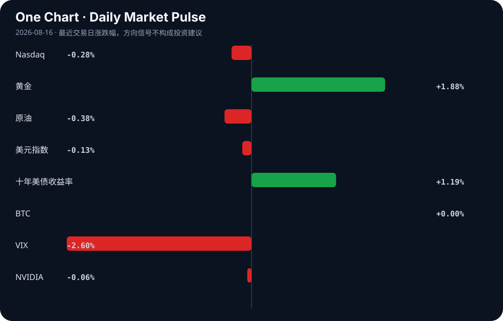

# Daily Intelligence
> 2026-08-16｜Sunday

## Today’s Thesis｜今日一句话
AI 产业正在形成新的“收费公路”：模型入口、支付、合规与工作流控制权可能比单一模型调用更能决定利润归属；但资本开支、能源约束和公众信任会持续检验这一商业逻辑。[A4][A5][A6][A8][A9]

## ① Executive Summary｜30 秒
1. AI：关于 Stripe 收购 OpenRouter 的报道若获证实，模型路由与支付平台可能加速合并，调用的计费、选择与分发将成为战略入口。[A5][A8]
2. 商业：AI 支出增长但盈利仍被质疑，同时 Anthropic 被报道接近季度盈利；行业正进入单位经济验证阶段。[A4][A17]
3. 宏观：黄金上涨、十年美债收益率上行，而纳指和 NVIDIA近乎持平；资本没有全面撤离风险资产，但对贴现率和尾部风险更敏感。

## ② AI Daily

### 1. 模型路由层可能成为商业入口 [A5][A8]
#### What Happened
两条材料讨论 Stripe 与 OpenRouter 的战略关系，并报道 Stripe 可能以逾 70 亿美元收购 OpenRouter；交易仍需以公司公告核验。[A5][A8]

#### Why It Matters
路由层决定请求发往哪个模型、如何计费、怎样观察质量与成本。若支付平台掌握该入口，它获得的不只是交易费，也是企业 AI 使用的需求数据与分发权。

#### Second-order Effect
支付网络连接模型路由 → 调用与结算统一 → 企业切换模型更容易 → 单一模型议价能力下降，入口平台网络效应增强。[A5][A8]

### 2. 金融代理的核心是控制而非演示 [A9]
#### What Happened
材料提出金融业深度运用 AI 智能体需要跨越多重关口，行业关注点已转向实际部署障碍。[A9]

#### Why It Matters
金融流程涉及权限、审计、数据隔离与损失责任。代理只有在每一步可追踪、可暂停、可复核时，效率提升才可能被正式采用。

#### Second-order Effect
代理进入金融流程 → 操作频率提高 → 小错误可能快速放大 → 机构增加监控与审批投入 → 治理成为产品竞争的一部分。[A9]

### 3. 社会许可成为经济变量 [A11][A19]
#### What Happened
材料一方面引述 Anthropic CEO 以治愈癌症说明 AI 赢得公众支持的路径，另一方面呈现年轻群体对 AI 企业领导者的负面态度。[A11][A19]

#### Why It Matters
公众信任会影响监管强度、人才选择、客户接受度与品牌成本。技术效果若不能转化为可验证公共价值，商业扩张可能遭遇比算力更难量化的约束。

#### Second-order Effect
能力提升未转化为公共价值 → 信任下降 → 监管与采用摩擦上升 → 企业投入更多透明度与结果验证。[A11][A19]

## ③ Business Daily

### 金融科技｜路由与支付合流
OpenRouter 相关报道把竞争从模型扩展到“选择、结算和观测”。[A5][A8] 若交易属实，Stripe 的优势可能来自商户关系与支付基础设施，而非训练模型本身。

### 算力与能源｜资本开支受物理约束
材料描述一个最高约 5 亿欧元、持续用电达 50 兆瓦并需要大量冷却用水的数据中心提案。[A6] 数字仍需核验，但方向明确：扩张越来越受电力、水和许可约束。

### 网络安全｜并购强化交叉销售
Datavault AI 被报道拟以 9450 万美元收购 CyberCatch，将 AI 网络安全加入量子安全平台。[B12] 协同效果仍要看客户与收入数据。

### 消费｜银发经济强调服务体验
34.6 亿人次出游材料强调银发群体的康养与体验偏好。[B3] 对企业而言，这意味着产品设计、线下服务与信任可能比单纯线上获客更重要。

## ④ Macro Observation｜机制分析
世界正在发生什么？AI 资本开支持续增加，但市场开始同时讨论盈利、融资、能源和监管约束。[A4][A6][A17] 行业已从单变量能力竞赛进入多约束系统。

为什么发生？模型能力扩散后，企业需要更多算力和基础设施；投入增加又提高收入与现金流门槛。若盈利兑现，融资成本下降并支持下一轮投入；若兑现延迟，利率上行会放大贴现压力。

资本如何流动？模型投资 → 调用量增长 → 路由、支付和治理层积累交易数据 → 入口平台扩大分发优势 → 更多企业接入。[A5][A8][A9] 这是潜在正反馈。但电力、用水、合规和社会信任会形成负反馈，限制扩张速度。[A6][A11][A19]

接下来关注什么？首先是 OpenRouter 交易是否获官方确认；其次是 AI 公司盈利口径能否覆盖完整算力与销售成本；再次是数据中心项目能否取得电力、水和社区许可。

## ⑤ Signal Dashboard
| 指标 | 最新值 | 今日 | 信号 |
|---|---:|:---:|---|
| [Nasdaq](https://finance.yahoo.com/quote/%5EIXIC) | 26,729.16 | ↓ -0.28% | 中性 |
| [黄金](https://finance.yahoo.com/quote/GC%3DF) | 4,462.60 | ↑ +1.88% | 避险/通胀对冲增强 |
| [原油](https://finance.yahoo.com/quote/CL%3DF) | 82.09 | ↓ -0.38% | 供需平衡 |
| [美元指数](https://finance.yahoo.com/quote/DX-Y.NYB) | 99.54 | ↓ -0.13% | 中性 |
| [十年美债收益率](https://finance.yahoo.com/quote/%5ETNX) | 4.70 | ↑ +1.19% | 成长估值承压 |
| [BTC](https://finance.yahoo.com/quote/BTC-USD) | 63,025.75 | → +0.00% | 中性 |
| [VIX](https://finance.yahoo.com/quote/%5EVIX) | 14.25 | ↓ -2.60% | 风险偏好改善 |
| [NVIDIA](https://finance.yahoo.com/quote/NVDA) | 225.16 | ↓ -0.06% | 中性 |

## ⑥ Deep Insight
容易被忽略的非共识视角是：AI 产业的长期赢家未必拥有最强单点模型，而可能控制“模型如何被选择、调用如何被计费、结果如何被审计”的入口。互联网时代，浏览器、应用商店和支付网络都曾通过降低交易摩擦获得超出单个内容生产者的价值；模型路由层也具备类似潜力。[A5][A8] 企业不希望把关键流程永久绑定在一个模型上，它们需要按质量、价格、延迟与合规动态选择。把选择与结算合并的平台，可能沉淀最有价值的需求信号。

第一层影响是模型供应商议价方式变化。若客户通过统一入口调用多个模型，品牌忠诚度下降，价格与性能比较更透明。供应商会更重视差异化能力、可靠性与专属数据，平台则通过流量分配影响获客。第二层影响是金融基础设施进入技术栈：支付公司掌握商户、风控和结算关系，把它们与模型调用结合后，可提供预算控制、异常检测和按任务收费。模型路由 → 统一结算 → 成本可视化 → 企业更敢扩大采用，这可能形成正循环。[A5][A8][A9]

但“收费公路”并非无摩擦垄断。数据中心的电力与用水约束说明每次调用都有物理成本，[A6] 高资本开支而盈利遥远的报道提醒平台不能只靠增长掩盖单位经济，[A4] 公众对 AI 企业的不信任则可能转化为监管与客户阻力。[A11][A19] 入口平台承担更多责任后，也会成为故障、隐私和市场集中风险的焦点。网络效应越强，监管审查可能越早到来。

反方观点是，模型厂商可以直接提供路由、支付与企业控制面，从而把中间层商品化；大型云平台也拥有更强的客户关系。这个反方成立的条件是客户愿意接受单一生态，且跨模型选择收益不大。我们的判断可被证伪：若跨模型调用占比停滞、企业仍以单一模型合同为主、独立路由平台无法形成稳定毛利，那么“入口层捕获主要价值”的推断应当下调。

## ⑦ Tomorrow Watch
1. 核实 Stripe 与 OpenRouter 交易是否获得公司或监管文件确认。[A8]
2. 验证 AI 盈利报道采用的是经营利润、自由现金流还是其他口径。[A17]
3. 关注数据中心提案的电力、水资源和社区审批进展。[A6]
4. 追踪金融机构是否公布代理部署的审计与风险指标。[A9]
5. 比较黄金、十年美债收益率与成长资产是否继续分化。

## ⑧ One Chart

黄金涨幅突出，而纳指、BTC 与 NVIDIA总体平稳，VIX回落。市场并未形成单一方向的风险交易，不能把黄金上涨直接归因于某一条新闻。

## ⑨ Quote of the Day
> “The most important thing is not to be smarter than others, but to be more disciplined than others.”  
> — Howard Marks

**中文理解**：重要的不是永远比别人聪明，而是在不确定性面前比别人更守纪律。

**Why it matters today**：面对未经官方确认的并购和盈利叙事，先定义证伪条件，比抢先相信更重要。

## ⑩ Action Items｜今天值得思考什么
1. 关注 AI 价值链中谁控制调用入口与客户关系。
2. 验证高资本开支是否对应可持续的单位经济。
3. 比较独立路由平台与云厂商控制面的优势。
4. 追踪能源、用水与许可对算力扩张的约束。
5. 思考哪些事实会推翻“入口层捕获价值”的判断。

## 信息边界
本期为手动补生成，使用已归档来源和市场数据；不少材料仅有聚合标题、摘要或未经官方确认的报道，正文将其作为待验证信号而非确定事实。市场数据为最近可得交易日数据，不构成投资建议。

## Sources

### AI

- [A4：什么信号？高盛辣评Q2财报：AI支出持续激增，但盈利仍遥遥无期！ - 搜狐网](https://news.google.com/rss/articles/CBMiiAFBVV95cUxQbHk1TmRBb0tSVGVseUtlcFhxSUZqZVJfSGRTSGlBTlhyTFhiWkhOYVhPNmNHOVJuNE9wVmdVSzFPdHB1ZTRHallKb1RCR1ZaazA3TTAxUTJ0VzkxZjR4Rk5QdDlfTm1BaUQ1ei1WOEVSeWt0MjZWeFdDUHhfU0VMblFfc3RhSEZp?oc=5) — Google News · AI 中文
- [A5：With OpenRouter, Is Stripe Becoming the Amazon of AI](https://github.com/getlago/lago/wiki/With-OpenRouter,-is-Stripe-becoming-the-Amazon-of-AI) — Hacker News · AI
- [A6：A proposed artificial intelligence data center carrying an investment of up to EUR 500 million, requiring as much as 50 megawatts of continuous power and thousands of cubic meters of water for cooling, is now being pitched for Oton, Iloilo — but questions rem - facebook.com](https://news.google.com/rss/articles/CBMi3gFBVV95cUxOZWRlUFpBT19BeG5jVU0xVTVSeklzVHlabUdYR2RkM19faFRiSG9BWDZ4N0NCMHdJcFFUR1dXUTg2Zk1pN1RqRElDWkthWmY5TVBKWS01S0V0aDA2cGotNWlGOVNETmRrcnVNS003MnFGbXFuZGgwVWJCeU1BS1VBdnQtR1lZSEhDSGpCZU8zMzdQZzUySTl0TUVURS1NM214a25hdTFEUW51dHJoRkthZmFjRXFxSE83T2RqWXdqWW4ydDIzaFQtV0g2WEJrVnB2dGpaS1JENlJUT1pKSlE?oc=5) — Google News · AI
- [A8：Stripe will reportedly acquire AI gateway startup OpenRouter for $7B+](https://techcrunch.com/2026/08/16/stripe-will-reportedly-acquire-ai-gateway-startup-openrouter-for-7b/) — Hacker News · AI
- [A9：金融业深度运用AI智能体要闯过四关 - 新浪财经](https://news.google.com/rss/articles/CBMieEFVX3lxTE1yZEJPcElFU3Z4dVo0OFYxU3FDV2NfVWltRXVvV2ZzeXM3aVN2aU42NjQ4U2tqaTBxRmRnTDhyYzg1VkhiVDlhRE9rOUJHODhreEVPY2l4WTdNamlDY0N4bGZVcHhsUlZ2U2dXcURlcE5kUW9HenV1eg?oc=5) — Google News · AI 中文
- [A11：Anthropic CEO says the way for AI to win over the public is to cure cancer](https://www.businessinsider.com/anthropic-ceo-dario-amodei-ai-public-opinion-cure-cancer-2026-8) — Hacker News · AI
- [A17：打破AI烧钱魔咒！Anthropic销售额暴增 有望迎来首个季度盈利 - 财联社](https://news.google.com/rss/articles/CBMiSEFVX3lxTE9FZ3J5WWVWb3ZmU1gtTnNjVVRWdWM1ZnpsUUhxZG9XU2k5UnBVekZsaURCaUViSTRuaHBZZWdURXI1MnczZ3QtLQ?oc=5) — Google News · AI 中文
- [A19：Young People Hate AI CEOs So Passionately That It's Almost Hard to Believe](https://futurism.com/artificial-intelligence/young-people-ai-ceos-executives-poll) — Hacker News · AI

### Business & Macro

- [B3：34.6亿人次出游大数据：银发族“重康养、追体验”，2026上半年文旅洞察 - AgeClub](https://news.google.com/rss/articles/CBMiVEFVX3lxTE81SFhBQ0ZIaW9XR2pKVTFaX0dURkdWak9DaXI2ZnJPYnJkb2c0eUhlbGkyYzg2RzJXSUN6R2ZVSkhPNGVpdFdBb0czOHBGX0lhZlJpYw?oc=5) — Google News · 行业
- [B12：Datavault AI To Acquire CyberCatch For $94.5 Million To Add AI-Powered Cybersecurity To Quantum-Secured Platform - Pulse 2.0](https://news.google.com/rss/articles/CBMiywFBVV95cUxOOTVpQUxCZlNPSGhIb1NBaU9yLU1lVkpiRTZ5UnktXy14OGdEY0c2WjFEeGRVLVlQdElldXZyQUdFUzZmaExfNXVkRFMyM3A4VjNWSHN6S2hXQm5tbVBQSlBBTFFlQ2ZyejVZQjZOdXFhdnZlTHRQZGQ1MW8za1R3bkpsTm1oY3YwZG9EbmxOd3lZWmkzSjc2OVBST1pwdEN3X25ycmtKZXVwQUJQcUwxTEZwNWlUdUdlQi0yT0VHaDFLTlA2NXY2dGhjRdIB0AFBVV95cUxNYXVUNGtqZ1hMdDIzWk5EWkVKR0ZRSC03U3I2cmFCWTd5WWd6RnJyR3YyY0hxQmM4a0hXMVZobFdMVVViWXRCSHR4YXZiZjNxcFVydGthZWJuZklPdHdCSGhYSVVOOGUzSXY5MlEzSjR0MGdfZ2pHLS1MTEhfak9JQ0FCY0dWLXVtM3pfNjJpLWpPQ28xTU8xSXVXbEFLUmEzWDg3aWgtSjNFQkVGWlF3VGswTDhSYjVEN3lDdHNXR2t4RjJrMHlYYUpBOU5wX3JY?oc=5) — Google News · Technology Business
