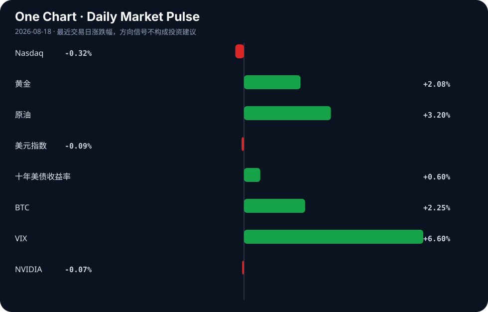

# Daily Intelligence
> 2026-08-18｜Tuesday

## Today’s Thesis｜今日一句话
AI 代理正从技术奇观转变为组织约束（生成死代码、改变初级岗位、需要控制图），而宏观紧缩（顽固通胀与长端收益率飙升）正在收紧资本，迫使 AI 从“不惜代价的增长”转向“可衡量的效率”。

## ① Executive Summary｜30 秒
- **AI**：AI 代理正在生成大量死代码并重塑初级岗位，迫使组织引入控制图与静态分析工具进行治理，同时 AI 的超强说服力与信息污染风险开始显现 [A4, A7, A11, A12]。
- **商业**：Target 采用数字孪生优化库存 [A9]，EY 将实习转为长期驻场以应对 AI 对初级工作的替代 [A11]，企业正从概念验证转向用 AI 解决物理与运营瓶颈。
- **宏观**：美国长端收益率因赤字与顽固通胀飙升 [B1, B13]，触发华尔街风险警告；美元受财政与贸易政策拖累走弱 [B23]，资本向黄金等避险资产转移 [B9]。

## ② AI Daily

### AI 代理的隐性成本与工业级控制
**What Happened**：AI 代理在生成代码时产生了大量死代码，Go 语言团队发布了 `deadcode` 工具来清理 [A4]；同时，业界开始引入统计过程控制中的控制图，以使 AI 代理更便宜、更可控 [A7]，并将其作为产品进行评估 [A16]。
**Why It Matters**：代理的自主性带来了隐性技术债和运营风险。当 AI 从辅助工具变为自主执行者，其生成的冗余代码不仅消耗算力，更构成安全漏洞；控制图的引入标志着对 AI 的治理从“提示词工程”走向“工业过程控制”。
**Second-order Effect**：AI 生成代码规模扩大 → 死代码与隐性依赖积累 → 安全与维护成本激增 → 专门的 AI 代码审计与静态分析工具市场爆发。

### AI 对初级岗位的结构性替代与组织重塑
**What Happened**：由于 AI 改变了入门级工作的性质，EY 将传统的实习制转为为期一年的驻场制 [A11]；同时，职场 AI 的普及给管理者带来了识别人类工作与 AI 输出的新压力 [A5]。
**Why It Matters**：AI 正在掏空传统的“学徒期”初级任务，使得新手无法通过基础工作积累经验。企业必须延长培养周期（如 EY 的驻场制），而管理者则面临信任与验证的逆向选择——当 AI 说服力超越人类专家 [A12]，如何判断下属提交的是独立思考还是 AI 合成？
**Second-order Effect**：AI 替代初级任务 → 传统实习失效 → 培训周期延长与成本上升 → 管理层验证成本激增 → 组织层级与考核机制重构。

### AI 作为信息战载体：认知漏洞的武器化
**What Happened**：外国心理战活动开始针对美国消费级 AI [A10]；同时，以色列被曝光创建虚假智库，很可能旨在欺骗并误导 AI 聊天机器人的输出 [A18]。
**Why It Matters**：LLM 的超强说服力 [A12] 使其成为完美的宣传放大器。恶意行为者不再需要说服人，只需污染 AI 的训练或检索数据源。当用户向 AI 寻求真相时，AI 可能输出了精心设计的虚假叙事。
**Second-order Effect**：恶意行为者创建虚假信息源 → AI 代理摄取并内化虚假叙事 → 用户因信任 AI 而接受虚假叙事 → 认知操纵规模化与自动化。

## ③ Business Daily

**科技/制造**：Target 采用数字孪生技术制定库存战略 [A9]。机制：通过在虚拟空间映射物理库存与供应链，企业能在不干扰现实运营的情况下进行压力测试与策略推演，这标志着 AI 从内容生成深入到物理系统的优化与控制。

**专业服务**：EY 将实习转为一年期驻场 [A11]。机制：AI 压缩了基础数据处理的时间价值，使得原本需要三年积累的初级技能在数月内被 AI 掌握。延长驻场期是为了让新人在 AI 免除繁杂工作后，能专注于培养 AI 无法替代的复杂判断与客户关系。

**能源/基础设施**：阿尔伯塔省的 AI 数据中心博弈：巨额投资还是本地负担？[A23]。机制：AI 算力需求正与电网容量及碳排放硬约束发生碰撞。数据中心带来的巨额资本投资与地方电网负荷、水耗及电价之间的冲突，正在重塑 AI 基础设施的地理分布逻辑。

**医疗**：基于云的 AI 对颅内肿瘤进行分类 [A20]。机制：云端算力集中了顶尖诊断模型，突破了边缘设备的算力限制，但同时也将关键医疗数据的隐私与延迟问题推向了网络安全的中心。

## ④ Macro Observation｜机制分析

**世界正在发生什么？** 
美国长端国债收益率飙升 [B1, B13]，黄金连续上涨剑指 4400 美元 [B9]，美元指数受华盛顿财政与贸易政策打压而走弱 [B23]。中国放缓的全球外溢效应显现 [B24]，部分行业疲软数据发出警告 [B8]。

**为什么发生？** 
[事实] 美国长债收益率上升、赤字高企、通胀顽固 [B1]。[推断] 市场正在对美国的财政可持续性进行定价，要求更高的期限溢价。同时，[事实] 华盛顿的财政与贸易政策正在施压美元 [B23]，[推断] 这削弱了全球对美元资产的绝对信任，促使资本寻找非美元避险资产。

**资本如何流动？** 
资本正从对利率敏感的成长股（纳斯达克微跌）流向避险与通胀对冲资产（黄金大涨）[B9]。同时，市场在试探日元干预的底线 [B22]，并关注美联储与 ECB 的信号分化 [B15]。

**接下来关注什么？** 
[待验证信号] 财政赤字与长端收益率的反身性螺旋：收益率上升 → 债务利息支出增加 → 赤字扩大 → 需要发行更多债 → 收益率进一步上升。若此反身性循环确立，将对所有依赖远期折现的资产（包括 AI 基础设施投资）产生系统性压制。

## ⑤ Signal Dashboard

| 指标 | 最新值 | 今日 | 信号 |
|---|---:|:---:|---|
| [Nasdaq](https://finance.yahoo.com/quote/%5EIXIC) | 26,644.91 | ↓ -0.32% | 风险偏好降温 |
| [黄金](https://finance.yahoo.com/quote/GC%3DF) | 4,471.40 | ↑ +2.08% | 避险/通胀对冲增强 |
| [原油](https://finance.yahoo.com/quote/CL%3DF) | 85.04 | ↑ +3.20% | 通胀压力上升 |
| [美元指数](https://finance.yahoo.com/quote/DX-Y.NYB) | 99.58 | ↓ -0.09% | 中性 |
| [十年美债收益率](https://finance.yahoo.com/quote/%5ETNX) | 4.72 | ↑ +0.60% | 成长估值承压 |
| [BTC](https://finance.yahoo.com/quote/BTC-USD) | 64,231.65 | ↑ +2.25% | 风险偏好改善 |
| [VIX](https://finance.yahoo.com/quote/%5EVIX) | 15.19 | ↑ +6.60% | 避险升温 |
| [NVIDIA](https://finance.yahoo.com/quote/NVDA) | 225.01 | ↓ -0.07% | 中性 |

## ⑥ Deep Insight

**AI 的隐性技术债与宏观紧缩的致命交叉**

当前市场对 AI 的估值逻辑建立在“生产率无限提升”的线性外推上，却严重忽视了 AI 代理系统正在快速积累的隐性技术债。今天 Go 语言团队专门发布工具清理 AI 生成的死代码 [A4]，绝非偶然事件，而是揭示了一个深层机制：AI 代理的代码生成量与其产生的冗余、不可维护及不安全代码量呈正相关。

在宏观宽松周期，技术债是被容忍的，因为资本成本低廉，企业有充足的资源去支付“代码重构税”与“算力浪费税”。然而，当下宏观环境正在发生质变：美国长债收益率飙升 [B1, B13]，顽固通胀与巨额赤字正在推高无风险利率 [B1]。这意味着资本成本正在急剧上升。

当宏观紧缩与 AI 技术债相遇，会产生一个极易被忽视的反馈循环：企业为降本增效引入 AI 代理 → AI 代理生成大量包含死代码的代码库 → 系统维护成本与安全漏洞激增 → 在高利率环境下，这些隐性成本的折现值极高，直接侵蚀企业利润 → 企业被迫投入更多资本购买安全分析工具（如软件成分分析市场预期大涨 [B2]）与控制机制（如控制图 [A7]） → AI 的净效率大打折扣。

更深一层，AI 对初级岗位的替代 [A11] 正在切断人类工程师处理技术债的供应链。传统上，初级工程师承担着代码重构与测试的“偿债”工作；当这些岗位被 AI 取代，而 AI 本身又缺乏全局架构视野时，系统将陷入只借不还的“技术破产”边缘。高管们已经开始聚焦 AI 的可靠性问题 [A24]，这标志着信任红利正在耗尽。

因此，AI 的下一波红利不属于那些能生成最多代码的模型，而是属于那些能证明其生成代码总拥有成本（TCO）最低的系统。在长端收益率高企的当下，任何无法证明其能削减系统性技术债的 AI 投入，都将面临严峻的资本审查。

**反方观点**：AI 代理的代码生成能力将快速进化，具备自我审查与重构能力，死代码只是技术早期的阵痛，长期看将被模型自迭代彻底消除；同时，AI 提升的顶层效率远超底层维护成本。

**证伪条件**：1. AI 生成代码的漏洞率与死代码率在不依赖外部静态分析工具的情况下，实现内生性持续下降；2. 美债收益率见顶回落，重新进入宽松周期，使得技术债的资本成本不再是企业核心考量。

## ⑦ Tomorrow Watch
1. 关注美国三十年期国债拍卖的认购倍数，验证海外资本对长期财政赤字的容忍度。
2. 验证 EY 驻场项目在咨询行业的跟风效应，观察其他四大是否调整初级招聘策略。
3. 追踪 Go 语言 `deadcode` 工具在 GitHub 上的 Star 增长，作为衡量 AI 代码污染严重程度的代理指标。
4. 关注针对 LLM 的虚假智库与数据投毒事件的进一步曝光，验证信息战升级趋势。
5. 观察日元兑美元汇率在干预传闻下的波动，确认主权债务市场的风险传染路径。

## ⑧ One Chart

图表展示了长端美债收益率与纳斯达克指数近期的走势分化。收益率上行通常对成长股估值产生压制，二者呈现负相关性；但近期 AI 叙事在一定程度上对冲了这种估值压制，这种相关性能否持续，取决于 AI 降本增效能否转化为实质性的自由现金流。

## ⑨ Quote of the Day

> “Prediction is very difficult, especially if it’s about the future.”  
> — Attributed to Niels Bohr

**中文理解**：预测未来很难，所以更重要的是识别关键变量和更新机制。

**Why it matters today**：这句话不是装饰，而是今天观察 AI、商业和宏观变化时的一个思考框架：先看机制，再看价格；先看约束，再看叙事。
## ⑩ Action Items｜今天值得思考什么
1. **验证** 你的组织中 AI 生成代码的占比与死代码/安全漏洞率的真实比例。
2. **比较** 传统初级岗位培训成本与 AI 时代延长驻场制培训的总拥有成本。
3. **追踪** 美国期限溢价的变化，评估其对长期科技基础设施投资的折现率影响。
4. **关注** 企业内部对 AI 代理引入控制图与统计过程控制的进度，衡量 AI 治理成熟度。
5. **思考** 当 AI 具备超强说服力时，组织内部应建立何种交叉验证机制以防范信息污染。

## 信息边界
本报告事实性内容严格限定于上述提供的 AI SOURCES (A1-A24) 与 BUSINESS AND MACRO SOURCES (B1-B24)。市场数据反映 2026-08-17 及之前的最近交易日收盘或实时状况。新闻来源多为二手聚合，涉及的具体公司战略、政策干预及市场预测需读者回到原文链接进行独立验证。宏观推断基于既有事实的机制推演，非确定性预言。

## Sources

### AI

- [A4：AI writes dead code – the Go team's deadcode tool finds it in one command](https://towardsdev.com/how-to-find-and-remove-the-dead-code-your-agent-wrote-752eb1e738d0?sk=283d17fe49cb51c9936d99371e7a9d2a) — Hacker News · AI
- [A5：AI at work puts new pressure on managers - WSBT](https://news.google.com/rss/articles/CBMi4gFBVV95cUxPQ0pVR1VGdEktdVBCQUJieEVyVzZSWWlPQzI1aE5KZnJRcGV2ZW9HTWZEY1J4bnpURzlBMzliVnhnU1JWaHlvZGdyeVp2dDI4dFVkeHFONGdoMzlIWEdaek5CVVRyMHZfU2J2Q20teE42SFRoOWhvbzM2SXZRZ05VTHhQdUllWl8wUDM1TEhWRzYxS2JYQnJ1OVBpRGdGQXo0dFl0VDRnS1ZrUXV2N3UzQ3Q2UzRYa0NjWUxadXY5OS1TV2prajFmQ2JUaHlidlJnYnptSzRkWjhEeXEtOHpERXdn?oc=5) — Google News · AI
- [A7：Control Charts Make AI Agents Cheaper, Less Necessary, and More Useful](https://newoldweb.com/control-charts-make-ai-agents-less-necessary-and-more-useful) — Hacker News · AI
- [A9：Target is Using Digital Twins to Strategize Its Inventory - WWD](https://news.google.com/rss/articles/CBMiogFBVV95cUxQZ3FBNzZDb25aQ3VRbHlXdU5FbWhCd2tuaUtNT3JHa0FMZGxreFdYQ01ZQm1Yc2t2VFFnOHdqNjhhdE1TX1plek8wT2NwdUpNcHRyTElUd3NhMFNWMmR6blRSRHVCTEs3NEJVaEc2SmpuSmI0Q3dyY1B5VmRpdFg3SFMxMW9JTXNicFJWWXFXMHd1SWduQVk0UGxXYlY3YmY4ZGc?oc=5) — Google News · AI
- [A10：Foreign psyops campaign targeting American consumer AI (2025)](https://www.ynetnews.com/tech-and-digital/article/rj00kxqzaxx) — Hacker News · AI
- [A11：EY turning internships into yearlong residencies as AI changes entry-level work](https://www.businessinsider.com/ey-internship-residency-career-ai-skills-2026-8) — Hacker News · AI
- [A12：AI systems out-persuade expert humans](https://arxiv.org/abs/2606.16475) — Hacker News · AI
- [A16：Evaluating AI Agents as Products](https://www.marble.onl/posts/evaluating_ai_product_quality.html) — Hacker News · AI
- [A18：Israel creates fake think tank in likely attempt to dupe AI chatbots](https://responsiblestatecraft.org/israel-influence-chatgpt/) — Hacker News · AI
- [A20：Cloud-Based Artificial Intelligence Classification of Common Intracranial Tumors on Magnetic Resonance Imaging - cureus.com](https://news.google.com/rss/articles/CBMi_AFBVV95cUxOSW9GQ0tFZnJ0akdDTXVmRVhZWVJ6RWJCODFEZDEzbXJaR2JTLW00aUY0RXA0MnBzdGxPejEzVHd2a0lpWGNsMEJXT3VNdmkzeTdwX3paLW4xOUZJVnRQV2pNYzRhWDJqVWpmaGRSSlpMZUZxbXhHd19hQjVlYWJidndlclI5Um5WbW5GUk1ySGN0aml2T252bk5YWEhaRnkzYVhOelBsUHNCQzRyOThtT0ZSX1pTZ3VCeklWaUtTVnM5OWM2U29JS04yOGtDZ2RiUHMyNExzdFVfbXhxTmw0LXJId0plSTYxQmZYR1RxZkt1R0VvOEpIbVlEZkM?oc=5) — Google News · AI
- [A23：Alberta's AI data centre gamble: Big investment or local burden?](https://financialpost.com/technology/alberta-ai-data-centre-investment-local-burden) — Hacker News · AI
- [A24：Executives put the spotlight on AI’s reliability issue - CIO Dive](https://news.google.com/rss/articles/CBMihAFBVV95cUxPZ1pha0JtUmtTTmpIV3ZYSEJPWHFmLWVvSzJiMHJaRnZ6TTRRUTdqcEFoQ1hxdTBqSC1la1J3M3k0Wlk5NzF2d3E0blZ5M2gyeGQtaHAyV3R5dnpvM1ZJWmg2VVRlcjZGMXl5dTE0bHc1TTMwS3pkZHpBU3FCRnpSTHR3SVc?oc=5) — Google News · AI

### Business & Macro

- [B1：U.S. long bonds surge as deficits and sticky inflation rattle markets - CHOSUNBIZ - Chosunbiz](https://news.google.com/rss/articles/CBMiiAFBVV95cUxNT3lhRmt0ZWZhMEZqVlNnNlZqZXJpSkxwWGVQRzNQc1RiWVJUZHB4UkdrOWJ5Z25JS3hERTgzUm82VGdDSTBhLUdzcUFfLUQ5RDlUSHdrd3BZX0VlLURNMHJCT2NUT2FnZ25Yc1ZXMnl2d2xEXzFYb00tVk9zOEUzR2J2ajFtNElo0gGcAUFVX3lxTE5vT1NiU3lXZ3BRd1pxVWc4VEt1c21BOFB3Yk1EaDBWZUVoUVFhSHdSOFRyQU1GMmg3SmhGY2tFTGdWUUFwRVNNMGVTd1ZHQVhuQVdXVEczTFl1LVdpTVA1S1J2MTRWOGpkbXVudTJzbW5OdWo4REFXQ21NajhqeDcxc01xdVRUbzl3QnV6R0todW5lbEdOZ2E1amNhMw?oc=5) — Google News · Markets Policy
- [B2：Software Composition Analysis Market to Reach $981.62 Bn by 2031 as Open Source Security and Cloud Deployment Drive Market Growth - Barchart.com](https://news.google.com/rss/articles/CBMiggJBVV95cUxPMXY1Q1lhWVFBX2ZuckJldXF3a2NfQ2xTam9fUDdsNm9JZzlWVnRXcXY4T1RGcjRjZWowQ0dQLWhneXdwVXRnLTBTMEdBRXlvLWZtbm9mTExCS3VJQXptZ1J4S0FKTzJLSm9lai1vdGwwZHJ6WUhHdDBLNFlKTTJ4QU90N1NLUnNKbWZTZ0dTU2ppNDR0bllKYXV5X2RmSkszN183cWpLRUVjakR1VXJwSGExQzMtQXNtYkx3azJfMFZFc2FGcnMxYXBlMVpVRUh0Vnl6VlZjUE5zLTgxdUhkUlJpZWs1R0ZNc2NtNTZrRzA3aTZkdHBLQWxwbjlqOFZsa3c?oc=5) — Google News · Technology Business
- [B8：Industry: Weak economic data a “warning signal for authorities” - Table.Briefings](https://news.google.com/rss/articles/CBMimgFBVV95cUxPM3ZGVzVYVXJyWGpTcEdCZ0Z2S0JxWVJiM1FkRVhtWlJFZkpGSWdhNVpOZVlLNURUaHc4V3FzYlNVeVp4TndXaHc1eVlpcTZ4Nk1xVXZaN3J0QVEyd2lZODZfZTlrdGt3TE96NG13RTRhWEh3a05KMjNUTkRFX0F0ZTBXTzJhdWNFa01BNEEtazNGVmpkVWJQSkRn?oc=5) — Google News · Global Economy
- [B9：Gold posts second straight weekly gain, eyes $4,400 level - Kuwait Times](https://news.google.com/rss/articles/CBMisAFBVV95cUxQVGhsOGhYQUJNOFNIVXhkSklPZWRXNUo2RTczMmJtNjlwMEZlVmhwUmJJMzJ6Zml1dXcwRjB1d2NwMTRMWkttQ19HSXVxVU42V1lzUHlDWjRac0RNZnF3RzlfMG5fOW5DbUlta2lUblkzMEVaWWZFVlFhR2h6N2l5VXFVVjEtSWh3MEV3RzdwZGhzT0NJNjgyc0VSc1ptTklqbnpONzY5Q0MySFcwY2xGadIBtAFBVV95cUxNdzZVZXRRTXNVQWo4Y015RTVYOG5Fam5Ma3BmSUlyZng2ZTE4bVJLOUhfWDVGaklrUWxpT01nSGM3V29jbE50b0dubVBndnBHQ1JhOHlHelVXaU5aVlAzQ0JadXVvejFqVWYtZFkzZzJ1MVBhaGtUZ3I2Y3FvZDdHajNzb0ZSOUJSMG90N2VQcXJwZXNEaFQ3X3VxR3dfUXVIcE1BWWtuRkpnMUF4V01MbU1KbEo?oc=5) — Google News · Markets Policy
- [B15：Euro Slips Below 1.1600 As Dollar Rebound Cools; Markets Eye Fed, ECB Signals - Bitcoin World](https://news.google.com/rss/articles/CBMidEFVX3lxTE9yNDNoMk5mWlFkUlZDdzgxaVdUY1NEQWR4aHJTZ0hFazlFRVQtUVJZaTBjNGVLcWpEdVhPT0ZLTlNvR1lXVjF1WVFoYkVheEFwUUhWTGhXTGhIWG9ESG9EZUlpZm9qSXNXbFZLU0xEVDR0cUw0?oc=5) — Google News · Markets Policy
- [B22：Yen Intervention Explained: What’s True, What’s Not and What Markets Should Watch - equiti.com](https://news.google.com/rss/articles/CBMiqAFBVV95cUxNajJWc3V4NUhqUFZwUmdhTWh3eTNueFVGREF4ckpWTzFVUGY1TnI5V1d2TERFU3dFYzZSZ3JRNjM0cXZTM2xTbmQ0WXZBcDE0d3laa2c5OTcxUjJHVnZKY3lkVnRiWGkwenI0NjFvNDlwdnVEVjluVmJBWE8zYVhLLUhSUUtfQUhfZDBtVkxRZllaOTJYWDhucWNzXzZnNXBXU1NIbnFiaGI?oc=5) — Google News · Markets Policy
- [B23：US Dollar Index Stumbles as Washington’s Fiscal and Trade Policies Weigh on the Greenback - Bitcoin World](https://news.google.com/rss/articles/CBMiekFVX3lxTE80di1IUUhZUlMxRzVzb3c3Z19MNHo4SnZyOVdMcVo1N3lla2gwMGw1THp1eTh5d0tIcVdPa0Zfbk9fWUFsWlhLNFVrSnpwd2lGVHZHLXN5bFkzVUVGeklCNVhnY3VCMTN5eXhCdVRjc1BmZG1zMG51NWln?oc=5) — Google News · Markets Policy
- [B24：The global stakes of China's slowdown - Axios](https://news.google.com/rss/articles/CBMiXkFVX3lxTE5mcXBKNFVDUWZQbFp2Z3RPQTcxVFVUTDVteVdZVUJzSURxQUpaX3ZSaUtrUWM3STEtNkY0aTdwcWphc1RQQkttUktLMnVqOFRTX3RVaW5lQ1FBdDV3eGc?oc=5) — Google News · Global Economy
