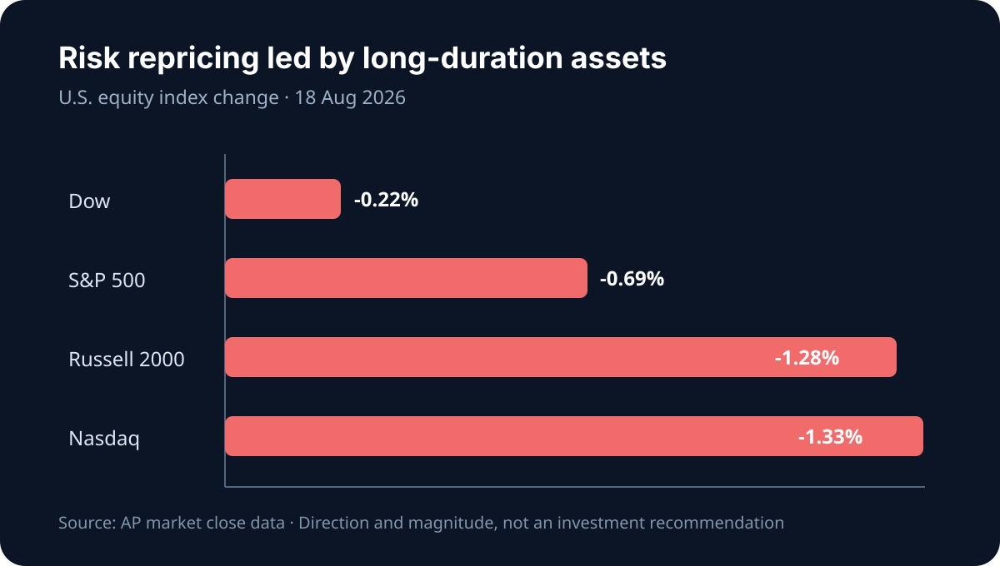

# Daily Intelligence
> 2026-08-19｜Wednesday

## Today’s Thesis｜今日一句话
市场正在把 AI 从“能力期权”重新定价为“现金流资产”：当长端利率和能源成本同时上升，模型更强已不够，只有能在可审计流程中持续节省时间、电力和资本的 AI 才能保住估值。

## ① Executive Summary｜30 秒
- **AI**：Google ATLAS 对 1,500 万次去标识交互的观察显示，人们更多是让 AI 协助任务而非整体接管；Meta 在国家实验室的案例则显示，开源模型的价值正从“可下载”转向“可在受控环境中部署” [A1][A2]。
- **商业**：onsemi 称 AI 数据中心是其增长最快业务、预计 2026 年收入翻倍；AMD 二季度公告继续把数据中心与 AI 基础设施列为核心增长引擎 [B1][B2]。产业价值正从 GPU 扩散到供电、散热、网络与运维。
- **宏观**：8 月 18 日纳指下跌 1.3%，半导体是主要拖累；长端收益率维持高位，市场等待今日公布的 7 月 FOMC 会议纪要 [M1][M2]。这不是 AI 需求消失，而是折现率开始审计需求的质量。

## ② AI Daily

### 从“代替工作”到“重组任务”
**What Happened**：Google ATLAS 覆盖 150 多个国家、140 种语言、800 个职业与 4,000 项任务，其首期结果指向“协助”多于“全自动” [A1]。

**Why It Matters**：职业是统计单位，任务才是 AI 实际改造的单位。企业若只计算裁员数，会错过更重要的指标：哪些步骤被压缩、哪些验证成本上升、哪些决策权仍需由人承担。

**Second-order Effect**：任务被解构 → 工作流数据成为新壁垒 → 通用模型价格下降 → 拥有流程、权限与验证数据的软件层捕获更多利润。

### 可部署性正在超越榜单分数
**What Happened**：Meta 披露 SAM 3 与 DINOv3 被用于美国国家实验室的科学成像流程；预发布数据和模型留在政府基础设施内 [A2]。

**Why It Matters**：在科研、政府、医疗和金融场景，决定采用的往往不是最高基准分，而是数据能否不出域、版本能否固定、结果能否复现。

**Second-order Effect**：安全与主权要求提高 → 私有化部署和开源权重上升 → 推理硬件、运维与模型治理成为新收费点。

### 信任是产品指标，不是公关附件
OpenAI 在 8 月的公开更新中同时强调模型改进、教育使用和第三方网络安全评估 [A3]。这些信号的共同点是：当 AI 进入真实工作流，可靠性、外部评测和使用边界必须成为可量化的产品能力。

## ③ Business Daily
**半导体/电力链**：onsemi 报告二季度收入 16.04 亿美元，并称 AI 数据中心业务是增长最快的部分，预计 2026 年相关收入翻倍 [B1]。机制：算力扩张不只增加芯片数量，也放大从电网到机柜的功率转换需求。

**计算平台**：AMD 在二季度业绩更新中继续将云和 AI 基础设施列为核心市场 [B2]。机制：客户对第二供应源的需求提升了软硬件兼容性的价值，但也把竞争从单芯片性能推向集群总拥有成本。

**零售/需求**：美股在企业利润仍强的背景下连续回落，说明估值对利率和油价的敏感度正高于对当期盈利的敏感度 [M1]。机制：即使分子端盈利增长，分母端折现率上升仍会压缩长久期资产估值。

## ④ Macro Observation｜机制分析
**世界正在发生什么？** 8 月 18 日 S&P 500 下跌 0.7%、纳指下跌 1.3%，NVIDIA、Micron 与 Broadcom 成为主要拖累 [M1]。美联储日历显示，7 月 28–29 日 FOMC 会议纪要将于 8 月 19 日公布 [M2]。

**为什么发生？** [事实] 半导体板块在估值质疑下领跌，长债收益率保持高位 [M1]。[推断] 市场并未否定 AI 支出，而是要求将“算力需求”拆成可验证的利用率、毛利率和自由现金流。

**资本如何流动？** 高估值、长久期的芯片股首先遭减仓；对应地，能直接支撑机柜功率密度的电力器件和能源资产获得更强议价逻辑 [B1]。

**接下来关注什么？** 会议纪要是否强调通胀上行风险与长期通胀预期；若实际利率继续上升，AI 基础设施将更像公用事业项目，而不是无限可选的增长试验。

## ⑤ Signal Dashboard
| 指标 | 最新值 | 今日 | 信号 |
|---|---:|:---:|---|
| [Nasdaq](https://finance.yahoo.com/quote/%5EIXIC) | 26,289.71 | ↓ -1.33% | AI/半导体估值承压 |
| [S&P 500](https://finance.yahoo.com/quote/%5EGSPC) | 7,691.76 | ↓ -0.69% | 风险偏好降温 |
| [Dow](https://finance.yahoo.com/quote/%5EDJI) | 53,343.40 | ↓ -0.22% | 低久期相对抗跌 |
| [10Y Treasury](https://home.treasury.gov/resource-center/data-chart-center/interest-rates) | 约 4.72% | 高位 | 成长估值折现率上升 |
| [30Y Treasury](https://home.treasury.gov/resource-center/data-chart-center/interest-rates) | 约 5.33% | ↑ | 期限溢价/财政风险升温 |
| [BTC](https://finance.yahoo.com/quote/BTC-USD) | 约 64,600 | → | 未同步跟随科技股下挫 |

## ⑥ Deep Insight
**利率正在迫使 AI 从“讲故事”转向“算账”**

AI 资本开支有两层收益：第一层是立即的算力销售，第二层是企业将算力转化为持续生产率。过去的估值更愿意把两者当作同一件事；8 月 18 日半导体领跌说明，市场正在要求中间的转化证据 [M1]。

Google ATLAS 提供了一个关键校正：真实采用主要发生在任务层，而不是职业整体层 [A1]。这意味着生产率不会自动等于人力成本的线性下降：某些环节更快，但验证、权限、审计和例外处理可能更贵。只有当整条流程的周期时间和错误成本下降，AI 投入才会变成稳定现金流。

Meta 的国家实验室案例补上了另一块拼图：当数据不能上云时，开源、本地部署和可复现性本身就是经济价值 [A2]。因此，下一阶段最有定价权的未必是参数最多的模型，而可能是能把模型嵌入受控工作流的软件、电力和运维层。

onsemi 的数据中心增长指引则揭示了硬约束：每一单位推理都要经过功率转换和散热 [B1]。当长端利率高企，算力资产必须同时提高利用率、降低单位能耗并缩短回收期。这将把 AI 竞争从模型榜单推向一张更严格的损益表。

**反方观点**：模型能力的快速提升可能使生产率改善大幅超过电力、验证和资本成本；短期估值回调只是拥挤交易的正常波动。

**证伪条件**：1. 企业 AI 项目在不增加审计与运维人力的前提下，普遍实现可验证的自由现金流改善；2. 长端实际利率明显回落，使远期收益再度获得更高现值。

## ⑦ Tomorrow Watch
1. FOMC 会议纪要对通胀上行风险、能源价格与降息条件的描述。
2. 半导体指数能否在纳指 1.3% 回调后出现放量承接。
3. 10 年与 30 年美债收益率是否继续背离，以区分货币政策和期限溢价。
4. AI 基础设施公司是否开始披露利用率、单位电力成本与客户回收期。
5. 企业软件公司是否将“任务完成率”而非 token 用量作为 AI 商业化指标。

## ⑧ One Chart

图表展示 8 月 18 日美股三大指数的下跌幅度：纳指和小盘股跌幅大于道指，表明久期和风险溢价而非单一盈利事件主导了当日定价。

## ⑨ Quote of the Day
> “Price is what you pay. Value is what you get.”  
> — Warren Buffett

**中文理解**：价格是你付出的，价值是你真正得到的。

**Why it matters today**：AI 估值的下一阶段不由演示效果决定，而由可重复的现金流和可验证的生产率决定。

## ⑩ Action Items｜今天值得思考什么
1. **盘点** AI 项目的任务级节省时间，不用职位数量代替效率证据。
2. **加入** 验证、审计、权限与例外处理成本，重算 AI 项目 TCO。
3. **压测** 10 年美债收益率再上升 50 个基点时，长期科技资产的估值敏感度。
4. **跟踪** 数据中心供电链而不只是 GPU，寻找算力扩张的非线性瓶颈。
5. **等待验证** FOMC 纪要原文，不在公布前把市场预期当成政策事实。

## 信息边界
本报告以 2026-08-19 Asia/Shanghai 可获得信息为截止点。FOMC 会议纪要在成稿时尚未公布，本文只将其列为待观察事件；市场数据为 8 月 18 日美国收盘或当日可得近似值。事实与推断已分开标注，不构成投资建议。

## Sources

### AI
- [A1：Google — Understanding the AI economy / ATLAS](https://blog.google/innovation-and-ai/technology/research/understanding-the-ai-economy/)
- [A2：Meta — AI models powering Genesis Mission projects](https://ai.meta.com/blog/genesis-mission-lawrence-berkeley-national-laboratory-segment-anything-dino/)
- [A3：OpenAI News](https://openai.com/news/)

### Business & Macro
- [B1：onsemi Reports Second Quarter 2026 Results](https://investor.onsemi.com/news-releases/news-release-details/onsemi-reports-second-quarter-2026-results)
- [B2：AMD Reports Second Quarter 2026 Earnings](https://newsroom.amd.com/news/amd-2q-2026-earnings/)
- [M1：AP — How major US stock indexes fared Tuesday 8/18/2026](https://apnews.com/article/63300d6f51d4d27ce881cc6c11719171)
- [M2：Federal Reserve — August 2026 calendar](https://www.federalreserve.gov/newsevents/2026-august.htm)
- [M3：U.S. Treasury — Daily Treasury rates](https://home.treasury.gov/resource-center/data-chart-center/interest-rates)

