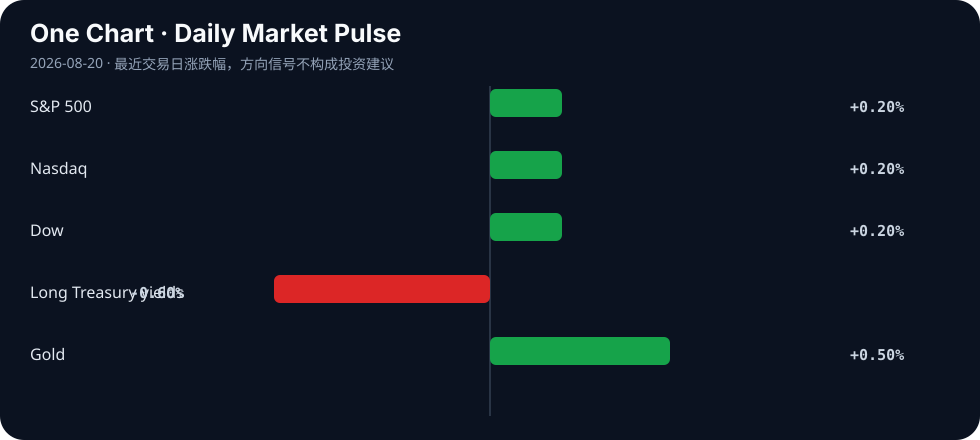

# Daily Intelligence
> 2026-08-20｜Thursday

## Today’s Thesis｜今日一句话
债券市场已经从宏观背景变成政策约束：当财政部需要主动回购来压低长端收益率、而美联储仍担心通胀，AI 的竞争也必须从“扩大算力”转向“证明每一单位资本、电力与验证成本都能产生回报”。

## ① Executive Summary｜30 秒
- **AI**：开放式 AI 研究代理已能完成部分高难任务，但科学产出增长快于人类验证能力，且多个代理可能收敛到相似方向 [A1][A2][A3]。能力提升的下一道门槛是验证吞吐量，而不是继续增加生成量。
- **商业**：xAI 提出到 2027 年把数据中心能力扩大至 10GW；Alphabet 二季度云业务继续受 AI 需求推动 [B1][B2]。资本开支仍在扩张，但能源、网络和融资成本正在决定哪些扩张可以兑现为现金流。
- **宏观**：美国财政部宣布将国债回购规模提高一倍以上，长端收益率随即回落，美股止住三日跌势；与此同时，7 月 FOMC 纪要显示，多位官员认为若通胀不降，未来可能需要加息 [M1][M2][M3]。

## ② AI Daily

### AI 研究代理的瓶颈正在从生成转向验证
**What Happened**：两项案例研究让前沿代理围绕未公开论文的问题连续工作六天，再由原作者评分，显示代理已经能参与开放式研究，但结果仍高度依赖任务设计、算力预算与专家复核 [A1]。

**Why It Matters**：当生成实验和论证的边际成本下降，稀缺资源会转移到“谁来确认它是真的”。企业若只衡量生成数量，会把错误、重复研究和不可复现实验误认成生产率。

**Second-order Effect**：研究生成加速 → 人工验证积压 → 高质量评测数据和专家时间升值 → 能自动记录证据链、复现实验和发现矛盾的工具获得定价权。

### 多代理不一定带来更多样的探索
研究显示，不同 AI 研究代理可能在共同文献起点下集中到相似的主题与方法，缩窄科学探索空间 [A2]。这意味着“同时启动更多代理”不等于获得更多独立观点；如果检索库、奖励函数和评审标准相同，规模化可能只是把同一种偏见复制得更快。

### 可信科学需要新的产出—验证比例
有关可信科学的新框架指出，自主代理能大规模生成假设和实验，但人类监督能力没有同步扩张 [A3]。可行的治理指标不是禁止代理，而是持续跟踪：每个结论有多少独立证据、多少实验可复现、多少关键假设仍未验证。

## ③ Business Daily
**算力/能源**：xAI 提出到 2027 年将数据中心能力扩大约七倍至 10GW [B1]。机制：如此规模把模型竞争直接转化为电网接入、发电、散热和融资问题；真正的护城河可能从 GPU 数量转向长期电力合同与机房利用率。

**云平台**：Alphabet 二季度收入与利润超预期，云业务受芯片、模型、数据、安全和代理平台需求推动 [B2]。机制：当模型价格下降，云厂商通过完整技术栈留住客户，利润池从单次调用扩展到数据、权限、部署与运维。

**零售/实体经济**：Target 与 Estée Lauder 的盈利报告帮助美股在债市压力缓解时反弹 [M1]。机制：市场并未只交易 AI；当折现率下降，能交付当期利润的传统企业同样获得估值支撑，这提醒投资者区分“盈利事实”和“远期叙事”。

## ④ Macro Observation｜机制分析
**世界正在发生什么？** 美国财政部表示将把国债回购规模提高一倍以上，长端收益率随后回落；S&P 500、道指和纳指均上涨约 0.2%，结束此前连续回调 [M1][M2]。

**为什么发生？** [事实] 夏季以来，通胀、油价与政府债务担忧把全球长端收益率推至多年高位 [M1][M2]。[事实] 7 月 FOMC 纪要显示，多位官员认为，如果通胀保持高位，未来数月可能需要提高短期利率 [M3]。[推断] 财政部门试图缓解期限溢价，而货币部门仍保留紧缩选项，政策组合出现“一边稳长债、一边防通胀”的张力。

**资本如何流动？** 回购消息首先改善国债流动性预期并压低长端收益率，随后支撑股票与黄金；美元承压。资本不是简单回到风险资产，而是在交易“官方愿意阻止债市失序”这一政策信号 [M1][M2][M4]。

**接下来关注什么？** 回购能否持续降低期限溢价，而不被市场理解为财政主导或变相收益率控制。若通胀重新上行，美联储加息预期可能抵消财政部回购带来的宽松效果。

## ⑤ Signal Dashboard
| 指标 | 最新观察 | 今日 | 信号 |
|---|---:|:---:|---|
| [S&P 500](https://apnews.com/article/9e355be634e4a21059fc1d1f20a1239e) | — | ↑ 约 +0.2% | 三日跌势暂止 |
| [Nasdaq](https://apnews.com/article/9e355be634e4a21059fc1d1f20a1239e) | — | ↑ 约 +0.2% | AI 股压力暂缓 |
| [Dow](https://apnews.com/article/9e355be634e4a21059fc1d1f20a1239e) | — | ↑ 约 +0.2% | 盈利支撑 |
| [长端美债收益率](https://apnews.com/article/bd0cead63ff1b7f2e99d4c8cce0a28d3) | 多年高位后回落 | ↓ | 回购缓解流动性压力 |
| [美元](https://www.gold.org/goldhub/gold-focus/2026/08/weekly-markets-monitor-one-battle-after-another) | 走弱 | ↓ | 政策与期限溢价重估 |
| [黄金](https://www.axios.com/2026/08/13/gold-inflation-rates-iran) | 高位 | ↑ | 财政/通胀对冲需求 |

## ⑥ Deep Insight
**债市正在给 AI 资本开支设置一条看不见的预算线**

AI 行业常把算力扩张描述成工程问题：更多 GPU、更多数据中心、更大模型。但 8 月 19 日的债市反应提醒我们，所有这些工程投入最终都要通过资本市场融资。长端收益率上升，会同时提高数据中心项目的折现率、企业债成本和投资者要求的回报率 [M1][M2]。

xAI 的 10GW 目标展示了这种约束的量级 [B1]。10GW 不只是服务器数量，而是持续的电力、土地、冷却、网络和备用容量承诺。项目能否成立，取决于未来利用率与单位推理收入是否足以覆盖巨额固定成本。模型能力可以快速迭代，但电网审批、发电建设与长期融资不会以同样速度变化。

与此同时，美联储纪要表明通胀风险仍可能迫使利率上升 [M3]。财政部回购可以改善债市流动性，却不能自动消除能源价格、赤字和通胀。如果市场把回购视为长期压制收益率的开始，短期估值可能改善；但若通胀预期因此升高，远期融资成本反而会重新上升。

AI 研究代理的验证问题与债市约束其实是同一件事：生成能力越来越便宜，可信结果越来越稀缺 [A1][A2][A3]。资本也会从“为生成量付费”转向“为可验证成果付费”。能证明任务完成率、错误成本、单位能耗和自由现金流改善的系统，将比只展示参数量和推理次数的系统更有韧性。

**反方观点**：模型能力跃迁可能带来远超资本成本的生产率增长；财政部回购也可能有效稳定长债，使 AI 基础设施继续获得低成本融资。

**证伪条件**：1. AI 数据中心在利用率、单位电耗和客户回收期上持续改善，并在高利率下产生正自由现金流；2. 回购扩大后，长端收益率和通胀预期同时稳定下行，而非一降一升。

## ⑦ Tomorrow Watch
1. 财政部扩大回购后的 10 年与 30 年美债收益率是否继续回落。
2. 市场是否把回购理解为流动性管理，还是收益率控制的前奏。
3. 油价与通胀预期是否强化 FOMC 纪要中的潜在加息路径。
4. AI 数据中心项目是否披露电力合同、利用率和融资成本。
5. AI 研究代理是否开始报告独立复现率，而不只是生成的论文或实验数量。

## ⑧ One Chart

图表以方向性方式展示 8 月 19 日的跨资产反应：财政部扩大回购后，长端收益率回落，美股温和反弹，黄金保持强势。关键不是单日涨跌，而是政策对期限溢价的影响能否持续。

## ⑨ Quote of the Day
> “Nothing is particularly hard if you divide it into small jobs.”
> — Henry Ford

**中文理解**：把复杂问题拆成足够小的任务后，困难往往会显著下降。

**Why it matters today**：AI 研究验证、数据中心回报和债市稳定都不是一个总分可以解释的问题；拆开证据、能耗、融资和利用率，才能找到真正的约束。

## ⑩ Action Items｜今天值得思考什么
1. **重算** AI 项目在长端利率上升 50 个基点时的回收期。
2. **加入** 电力、验证、审计和失败重试成本，比较真实任务成本而非 token 单价。
3. **跟踪** 财政部回购规模与长端收益率的同步性，区分流动性改善和通胀风险。
4. **要求** 研究代理输出可复现实验、失败记录和独立证据链。
5. **避免** 用更多代理数量替代观点多样性，主动加入不同数据源和反方评审。

## 信息边界
本报告以 2026-08-20 Asia/Shanghai 可获得信息为截止点；美国市场数据主要反映 8 月 19 日收盘。部分市场指标仅有方向性信息，因此未填入未经验证的精确价格。事实与推断已分开标注，不构成投资建议。

## Sources

### AI
- [A1：Can AI agents conduct open-ended AI research? Early evidence from two case studies](https://arxiv.org/abs/2607.27191)
- [A2：AI Research Agents Narrow Scientific Exploration](https://arxiv.org/abs/2605.27905)
- [A3：The Age of AI Agents Demands A New Scientific Paradigm To Sustain Trustworthy Science](https://arxiv.org/abs/2607.26064)

### Business & Macro
- [B1：xAI targets 10GW of data-center capacity by 2027](https://www.tomshardware.com/tech-industry/artificial-intelligence/elon-musk-says-xai-will-increase-data-center-capacity-7x-by-2027-targeting-10-gigawatts-of-compute-up-to-usd500-billion-in-revenue-by-the-end-of-next-year)
- [B2：AP — Google Q2 earnings beat expectations on AI boom](https://apnews.com/article/f914606d842d4c6848019083d667fc3a)
- [M1：AP — US stocks halt slide after Treasury moves to ease bond pressure](https://apnews.com/article/9e355be634e4a21059fc1d1f20a1239e)
- [M2：AP — An alarmed bond market gets the administration to act](https://apnews.com/article/bd0cead63ff1b7f2e99d4c8cce0a28d3)
- [M3：AP — Many Fed officials see higher rates if inflation stays high](https://apnews.com/article/0030d04832b89b564b743b34ab2cd8de)
- [M4：World Gold Council — Weekly Markets Monitor](https://www.gold.org/goldhub/gold-focus/2026/08/weekly-markets-monitor-one-battle-after-another)
