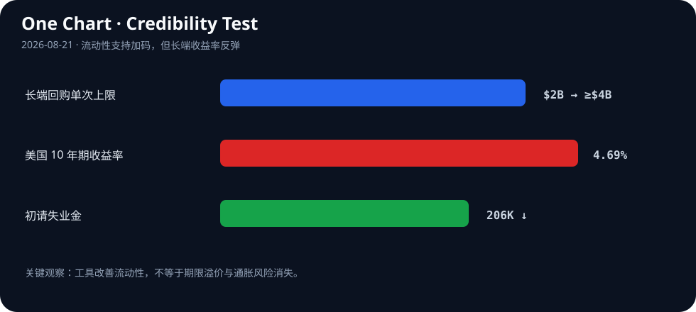

# Daily Intelligence
> 2026-08-21｜Friday

## Today’s Thesis｜今日一句话
美国财政部扩大长债回购只能短暂压低收益率、10 年期随后重返 4.69%，说明真正稀缺的不是政策信号或 AI 输出，而是能被市场、客户和专家持续验证的可信现金流。

## ① Executive Summary｜30 秒
- **AI**：Harvey 发布首个后训练开放权重法律模型 Tenet 研究预览，企业级 AI 的竞争从通用能力转向专业数据、工作流与可审计输出 [A1][A2]。
- **商业**：初请失业金降至 20.6 万，裁员仍少；这支持企业收入与需求韧性，但也削弱快速降息的理由 [B1]。
- **宏观**：财政部把长端回购单次上限从 20 亿美元提高至至少 40 亿美元后，10 年期收益率仅短暂回落，周四又升至 4.69% [M1][M2]。流动性工具可以改善交易，却不能消除债务供给、通胀与资本需求。

## ② AI Daily

### 专业模型把竞争焦点从参数转向制度知识
**What Happened**：Harvey 8 月 20 日发布 Tenet 研究预览，称其为首个后训练开放权重模型，目标是把法律领域的推理和工作流经验固化到可部署模型中 [A1]。两天前发布的 Harvey II 则强调代理能够继承案件、项目和个人工作方式的上下文 [A2]。

**Why It Matters**：通用模型能力逐渐商品化后，企业客户真正付费的对象是权限、上下文、行业术语、证据链与责任边界。专业模型的价值不只来自答得更好，还来自它能否进入受监管流程，并让输出被复核。

**Second-order Effect**：开放权重降低部署门槛 → 专业团队用私有语料后训练 → 模型差异转移到数据治理与评测 → 能证明合规、出处和失败边界的平台获得更高议价权。

### “记住上下文”同时增加价值与风险
代理继承项目记忆，能减少重复提示并提高长任务连续性 [A2]；但记忆也会放大错误传播、权限越界和旧信息污染。企业需要把记忆视为受控数据产品：标注来源、有效期、访问范围和删除机制，而不是默认永久保存。

### 开放权重不等于开放责任
模型可以在客户环境部署，却不会自动解决专业责任。法律、金融和医疗等场景仍需要明确：谁批准结论、哪些证据可追溯、何时必须人工升级。开放权重扩大了可控性，也把评测和运营责任推回部署方。

## ③ Business Daily
**劳动力市场**：美国上周初请失业金从修正后的 21.2 万降至 20.6 万，裁员仍然稀少 [B1]。机制：就业韧性支撑消费和企业收入，却意味着工资与服务通胀可能更黏，利率敏感行业难以等到迅速宽松。

**企业软件**：Harvey 把专业模型、项目记忆和工作流打包，而不是只售卖一次模型调用 [A1][A2]。机制：当 token 单价下降，利润池转向权限管理、知识库、审计、集成和持续评测。

**资本开支**：债市仍担心科技公司为 AI 基础设施进行的重资产融资 [M1]。机制：AI 需求可以抬高长期生产率，也会在建设期增加债券供给与电力投资；如果收入兑现慢于融资扩张，资本成本先于生产率收益上升。

## ④ Macro Observation｜机制分析
**世界正在发生什么？** 财政部宣布从 9 月 9 日起，把 10—20 年及 20—30 年期名义券流动性支持回购的单次上限从 20 亿美元提高到至少 40 亿美元 [M1][M3]。消息最初压低收益率，但周四 10 年期又回到 4.69% [M1]。

**为什么发生？** [事实] 投资者同时消化高政府债务、科技企业融资需求和美联储抗通胀立场 [M1]。[事实] 初请失业金降至 20.6 万，显示劳动力市场没有快速恶化 [B1]。[推断] 当增长仍有韧性、通胀风险未消失时，市场要求的期限溢价不会因一次流动性操作永久下降。

**资本如何流动？** 回购提高旧券需求并改善特定期限的交易流动性，但财政部仍需通过整体融资结构筹资。资金可能从长端供给压力转向短端，曲线风险被重新分配，而不是消失。收益率反弹说明长期资本仍要求更高补偿。

**接下来关注什么？** 观察 40 亿美元上限在实际操作中的成交量、覆盖倍数和券种分布；更重要的是 10 年与 30 年收益率能否在没有新政策口头干预时稳定，以及通胀预期是否同步下降。

## ⑤ Signal Dashboard
| 指标 | 最新观察 | 今日 | 信号 |
|---|---:|:---:|---|
| [美国 10 年期国债](https://apnews.com/article/c6e148f8235a98245adf04b2d4bdd8d1) | 4.69% | ↑ | 回购效果短暂 |
| [初请失业金](https://apnews.com/article/5d623586cbcf1eeeaa6ee6cc084ed566) | 206,000 | ↓ 6,000 | 裁员仍少 |
| [长端回购上限](https://home.treasury.gov/news/press-releases/sb0607) | ≥ $4B/次 | ↑ 约一倍 | 流动性支持加码 |
| [30 年期收益率](https://www.axios.com/2026/08/20/bonds-fed-treasury-policy) | 2007 年以来高位附近 | ↑ | 期限溢价仍高 |
| [外国官方持有](https://www.axios.com/2026/08/20/bonds-treasury-foreign-hedge-fund) | 约低于 $4T | → | 边际买家更价格敏感 |

## ⑥ Deep Insight
**流动性可以买到时间，但买不到可信度**

财政部回购首先解决的是市场微观结构：买入较旧、流动性较差的长期国债，改善交易并降低特定券种的供给压力 [M2][M3]。它不是凭空消除债务，也不直接改变未来赤字、通胀或真实资本需求。因此，收益率先降后升并非工具“完全无效”，而是市场区分了流动性问题和偿付能力定价。

这一差别也适用于企业 AI。专业模型可以提高单项任务表现，项目记忆可以减少重复劳动，但客户最终需要的是可持续的经济结果：错误率下降多少、审查时间缩短多少、责任边界是否清楚、节省能否覆盖部署和监督成本。演示改善的是产品流动性——让采用更容易；可信 ROI 才决定长期估值。

当前宏观环境放大了这个要求。初请失业金仍低意味着经济没有快速滑入衰退，企业收入基础相对稳定；但同样的数据也让高利率维持更久成为可能 [B1]。当 10 年期收益率在政策干预后仍回到 4.69%，任何依赖遥远现金流的 AI 投资都面对更严格的折现。

因此，下一阶段的赢家不一定是生成最多内容或融资最多算力的公司，而是最早把输出变成“可验证资产”的公司：每项结论有出处，每次代理行动有权限记录，每个工作流有人工升级点，每笔资本开支有利用率和回收期。可信度不是品牌口号，而是一套可以被审计的运营指标。

**反方观点**：回购规模继续扩大可能最终稳定长债；AI 能力跃迁也可能让生产率增长快于资本成本上升，使当前折现压力被未来现金流覆盖。

**证伪条件**：1. 后续回购操作后，10 年和 30 年收益率在通胀预期不升的情况下持续回落；2. 专业 AI 部署在包含人工复核、合规与失败成本后，仍连续两个季度显著提高自由现金流。

## ⑦ Tomorrow Watch
1. 10 年期收益率能否重新跌破回购宣布后的低点。
2. 财政部是否进一步扩大 40 亿美元单次上限。
3. 长端压力是否传导到抵押贷款、企业债和 AI 基础设施融资。
4. Harvey Tenet 是否披露权重许可、评测集与可复现实验细节。
5. 企业代理产品是否提供记忆来源、有效期和删除控制。

## ⑧ One Chart

图表展示政策宣布后的核心反差：长端回购能力提高约一倍，但 10 年期收益率重新回到 4.69%，同时初请失业金保持低位。流动性支持与经济韧性共同使“更久更高”的利率路径仍然成立。

## ⑨ Quote of the Day
> “In God we trust; all others must bring data.”
> — W. Edwards Deming

**中文理解**：信任需要证据；没有数据的确信，只是未经检验的判断。

**Why it matters today**：无论是财政部稳定债市，还是 AI 厂商承诺生产率，市场最终都会要求可重复、可审计的数据，而不是一次性的叙事反应。

## ⑩ Action Items｜今天值得思考什么
1. **重算** AI 项目在 10 年期利率 4.69% 情景下的净现值与回收期。
2. **区分** 债市流动性改善和财政风险下降，不把短期价格反弹当作长期趋势。
3. **要求** 专业代理记录来源、权限、记忆有效期和人工批准节点。
4. **跟踪** 财政部实际回购成交量，而不只关注宣布的最高额度。
5. **验证** AI 节省是否在计入复核、合规和错误成本后仍能转化为现金流。

## 信息边界
本报告以 2026-08-21 Asia/Shanghai 可获得信息为截止点；美国市场和经济数据主要反映 8 月 20 日。市场精确点位仅采用已核实来源；事实与推断已分开标注，不构成投资建议。

## Sources

### AI
- [A1：Harvey Tenet Research Preview](https://www.harvey.ai/blog)
- [A2：Introducing Harvey II](https://www.harvey.ai/blog/introducing-harvey-ii)

### Business & Macro
- [B1：AP — US unemployment claims dropped to 206,000](https://apnews.com/article/5d623586cbcf1eeeaa6ee6cc084ed566)
- [M1：AP — Treasury moves have not calmed the bond market](https://apnews.com/article/c6e148f8235a98245adf04b2d4bdd8d1)
- [M2：TreasuryDirect — FAQs about Treasury Securities Buybacks](https://www.treasurydirect.gov/help-center/faqs/buyback-faqs/)
- [M3：U.S. Treasury — Increased long-end liquidity support buybacks](https://home.treasury.gov/news/press-releases/sb0607)
- [M4：Axios — Foreign official demand and Treasury market structure](https://www.axios.com/2026/08/20/bonds-treasury-foreign-hedge-fund)
