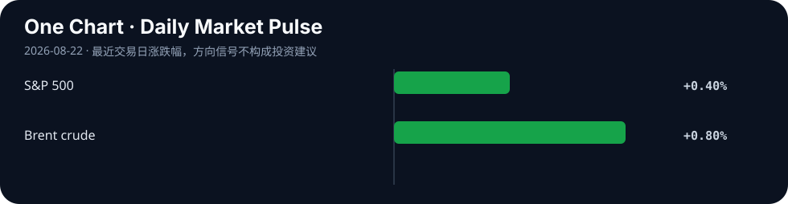

# Daily Intelligence
> 2026-08-22｜Saturday

## Today’s Thesis｜今日一句话
AI 治理与资本市场正在发出同一个信号：无论是限制权力集中，还是压低长期融资成本，书面承诺和一次性操作都不够；只有能持续改变激励、权限与现金流的机制，才会被社会和市场定价。

## ① Executive Summary｜30 秒
- **AI**：OpenAI Strategic Futures 团队作者 Dean Ball 发布 AI Futures 创刊文，提出先进 AI 可能改变国家、企业与个人之间的权力平衡，并主张用可追责、隐私优先的制度机制限制权力集中；文章明确代表作者观点，而非 OpenAI 组织立场 [A1]。
- **商业**：周五标普 500 上涨 0.4%，Ross Stores 因利润和收入优于预期上涨 4.4%，显示企业盈利仍支撑风险偏好；比特币升破 7.7 万美元、黄金一度突破每盎司 4690 美元，反映资金也在寻找对冲货币与政策不确定性的资产 [B1]。
- **宏观**：10 年美债收益率从周四的 4.69%升至 4.73%，30 年期仍接近 2007 年以来高位；财政部扩大长债回购只能改善流动性，未能消除油价、通胀和债务供给带来的期限溢价 [M1][M2]。

## ② AI Daily

### AI Futures 把“能力竞赛”改写为“权力结构”问题
**What Happened**：OpenAI 8 月 20 日推出 AI Futures。创刊文作者 Dean Ball 称，该团队将研究自由社会如何在变革性 AI 出现时保留个人权利与能动性，并关注 AI 是否让国家或大型组织在更少依赖广泛社会协作的情况下集中权力 [A1]。

**Why It Matters**：模型能力通常以准确率、速度和成本衡量，但真正决定长期采用的可能是权力如何分配：谁能调用高权限代理、谁拥有数据和算力、谁承担错误责任、个人能否拒绝或申诉。

**Second-order Effect**：能力集中于少数平台 → 企业和政府提高对统一基础设施的依赖 → 单点决策影响扩大 → 市场要求可移植性、审计和责任主体 → 控制面与制度设计成为产品竞争的一部分。

### “可追责”必须与隐私同时成立
文章提出，在 AI 影响旁观者人身或财产的高风险行动中，应能追溯到负责任的人或人类控制的组织，同时强调匿名使用和自由表达仍需被保护 [A1]。这不是简单实名制，而是要把追责范围限定在高风险行动，并避免把全面监控包装成安全。

### 观点边界本身就是治理信号
页面明确说明文章只代表作者，而不必然代表 OpenAI 其他员工或组织 [A1]。对高影响 AI 而言，区分个人研究判断、公司承诺和可执行政策，是防止叙事被误当制度的重要一步。

## ③ Business Daily
**企业盈利**：Ross Stores 周五上涨 4.4%，公司报告的利润与收入超过市场预期，并称新老客户兴趣均增加 [B1]。消费并未因高长端利率立即失速，但折扣零售走强也说明价格敏感度仍高。

**替代资产**：比特币升破 7.7 万美元，黄金一度超过每盎司 4690 美元；财政部回购预期与美元走弱为两者提供支持 [B1]。这不是单一“避险”交易，而是流动性、政策可信度与稀缺资产叙事叠加。

**AI 商业模式**：如果客户担心权力和数据集中，供应商仅承诺“模型更强”不足以扩大采用。可导出数据、细粒度权限、独立审计、人工否决和多供应商切换，将从合规功能变成收入与留存能力。

## ④ Macro Observation｜机制分析
**世界正在发生什么？** 周五美股反弹，但 10 年美债收益率升至 4.73%，高于财政部回购宣布前水平；30 年期仍接近 2007 年以来高位。Brent 原油收于 92.67 美元，上涨 0.8% [M1]。

**为什么发生？** [事实] 市场同时面对政府债务供给、油价推动的通胀担忧和科技企业融资需求 [M1]。[事实] 财政部扩大回购主要用于改善旧券流动性，并不直接减少未来赤字或整体债务 [M2]。[推断] 因此政策可以短暂改善交易条件，却无法永久压低投资者要求的真实回报和期限补偿。

**资本如何流动？** 长债收益率上升 → 远期现金流折现更重 → 高估值项目必须更快兑现收入；同时，美元与政策不确定性推动部分资金流向黄金、比特币和现金流更近的企业。

**接下来关注什么？** 观察 10 年期能否稳定回到 4.69%以下、Brent 是否继续抬升通胀预期，以及回购实际成交量能否改善长端市场深度而非只带来短暂价格反应。

## ⑤ Signal Dashboard
| 指标 | 最新观察 | 今日 | 信号 |
|---|---:|:---:|---|
| [美国 10 年期国债](https://apnews.com/article/96ef9586e1288e50843b4d2b1ccebc32) | 4.73% | ↑ 4bp | 回购效果短暂 |
| [S&P 500](https://apnews.com/article/96ef9586e1288e50843b4d2b1ccebc32) | 7,674.37 / +0.4% | ↑ | 盈利支撑风险偏好 |
| [Brent 原油](https://apnews.com/article/96ef9586e1288e50843b4d2b1ccebc32) | $92.67 / +0.8% | ↑ | 通胀压力增加 |
| [Bitcoin](https://apnews.com/article/96ef9586e1288e50843b4d2b1ccebc32) | > $77,000 | ↑ | 流动性与政策交易 |
| [Gold](https://apnews.com/article/96ef9586e1288e50843b4d2b1ccebc32) | 一度 > $4,690/oz | ↑ | 货币不确定性对冲 |

## ⑥ Deep Insight
**真正的约束必须能改变行为，而不只是写在纸上**

AI Futures 创刊文借“纸面屏障”讨论权力：声明权利并不会自动阻止权力集中，制度必须让不同主体相互制衡 [A1]。债市本周给出了相似的实时实验。财政部扩大长债回购后，收益率短暂下降，但 10 年期周五又升至 4.73% [M1][M2]。市场把政策意图与实际债务、通胀和资本需求分开定价。

这一共同机制对企业 AI 很关键。隐私原则、人工监督和负责任使用如果只存在于政策页面，就像回购公告一样，可能改变短期预期，却未必改变系统行为。有效约束需要落到权限边界、日志、撤销能力、独立评测和明确责任主体。

资本成本会迫使这些制度从口号变成产品。高长端利率压低远期收益价值，企业不会为抽象治理无限付费；但如果控制机制能减少事故、审查时间和供应商锁定，它就能转化为可验证现金流。治理的商业价值不是“看起来更安全”，而是降低尾部损失并扩大可部署工作范围。

非共识之处在于，分散并不必然等于安全。过度分散可能让高能力系统更容易被滥用，而过度集中又放大单点权力。可行路径更像资产组合：关键权限分离、责任可追溯、客户能退出，同时对真正高风险行动设置窄而强的集体约束。

**反方观点**：AI 权力集中仍是远期风险，当前更紧迫的是生产率和部署；债券收益率反弹也可能主要由油价和短期仓位驱动，并非对财政工具的长期否定。

**证伪条件**：1. 长端回购在后续操作中持续压低期限溢价，即使债务供给与通胀预期没有改善；2. 缺少可移植、审计和退出机制的 AI 平台仍能在受监管行业长期维持高续约与低事故率。

## ⑦ Tomorrow Watch
1. 10 年期收益率能否回落至 4.69%以下。
2. Brent 上涨是否继续传导到通胀预期。
3. 黄金与比特币同步上涨是否持续。
4. AI Futures 后续是否提出可执行的权力制衡机制。
5. 企业 AI 合同是否加入数据可移植、人工否决和独立审计条款。

## ⑧ One Chart

图表展示“意图”与“定价”的差距：美股反弹，但 10 年期收益率升至 4.73%、油价上涨，黄金与比特币也走强。市场正在同时购买增长，并为通胀、债务和政策可信度要求更高补偿。

## ⑨ Quote of the Day
> “Power tends to corrupt, and absolute power corrupts absolutely.”
> — Lord Acton

**中文理解**：权力倾向于腐化，绝对权力会导致绝对腐化。

**Why it matters today**：AI 的能力、数据和基础设施越集中，越需要可执行的制衡；资本市场同样不会仅凭政策承诺放弃对风险的定价。

## ⑩ Action Items｜今天值得思考什么
1. **区分** AI 供应商的观点、合同承诺和可验证技术控制。
2. **要求** 高权限代理具备日志、人工否决、撤销和责任归属。
3. **重算** 10 年期收益率 4.73%情景下 AI 项目的净现值。
4. **跟踪** 长债回购的实际成交量、市场深度和持续效果。
5. **测试** 更换模型或平台时，数据、流程和审计记录能否迁移。

## 信息边界
本报告以 2026-08-22 Asia/Shanghai 可获得信息为截止点；市场数据反映美国 8 月 21 日收盘。AI Futures 文章明确代表作者观点，并非 OpenAI 组织立场。黄金与比特币价格为报道中的盘中或阈值描述，不作为实时行情。事实与推断已分开标注，不构成投资建议。

## Sources

### AI
- [A1：OpenAI — Introducing AI Futures](https://openai.com/index/introducing-ai-futures/)

### Business & Macro
- [B1：AP — US stocks rise, even as the bond market applies more pressure](https://apnews.com/article/96ef9586e1288e50843b4d2b1ccebc32)
- [M1：AP — US stocks rise, even as the bond market applies more pressure](https://apnews.com/article/96ef9586e1288e50843b4d2b1ccebc32)
- [M2：U.S. Treasury — Increased long-end liquidity support buybacks](https://home.treasury.gov/news/press-releases/sb0607)
