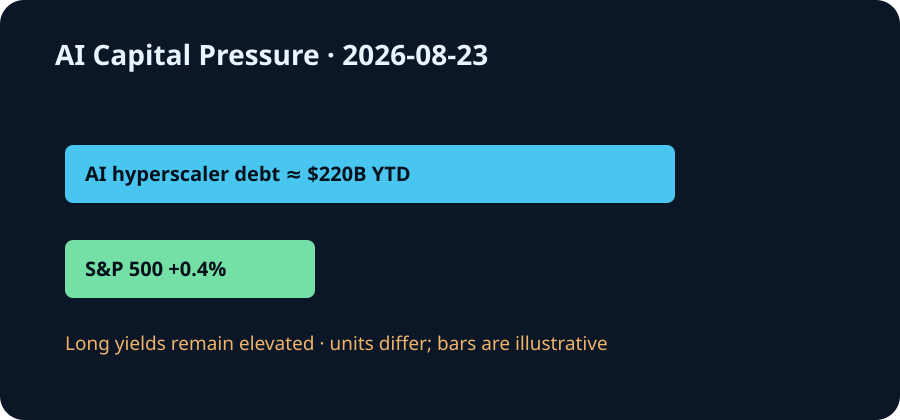

# Daily Intelligence
> 2026-08-23｜Sunday

## Today’s Thesis｜今日一句话
AI 基础设施正在从技术扩张变成久期竞争：当年内约 2200 亿美元的 AI 企业债与高位政府融资共同争夺资金，市场会把模型能力、设施利用率和可验证现金流放进同一张资产负债表。

## ① Executive Summary｜30 秒
- **AI**：Harvey 与 PacerPro 把实时联邦法院案卷、提醒和文件接入法律 AI，显示专业代理的护城河正从生成能力转向权威上下文、及时性和责任控制 [A1]。
- **商业**：Reuters 引述 BNP Paribas 数据称，2026 年截至 8 月 10 日，AI hyperscaler 债券发行已达约 2200 亿美元；买方仍认可头部发行人信用，却要求更高收益率吸收供给 [B1]。
- **宏观**：周五标普 500 上涨 0.4%、纳指上涨 0.4%，但长债收益率继续施压，说明股市仍愿意购买增长，债市却在提高增长必须跨越的回报门槛 [M1]。

## ② AI Daily

### 权威上下文成为专业代理的新护城河
**What Happened**：Harvey 8 月 21 日宣布与 PacerPro 合作，把美国联邦法院的实时案卷智能、提醒和文件带入诉讼工作流 [A1]。

**Why It Matters**：法律工作最昂贵的错误通常不是措辞不佳，而是漏掉新文件、截止日或程序变化。模型在正确时间调用正确记录，比一次回答更强更接近可计费价值。

**Second-order Effect**：实时案卷接入 → 代理持续监控案件 → 律师聚焦异常与判断 → 服务速度提高；同时，错误映射、权限越界或延迟提醒的损失变大，日志、来源与人工批准由合规成本变成产品功能。

### 上下文越实时，责任越不能模糊
实时数据减少“模型不知道最新情况”，却增加“系统是否读对案件、文件是否完整、提醒是否及时”的责任。专业代理必须证明来源、刷新时间、访问权限和失败升级路径，而不能只展示模型榜单。

### 软件价值向接口和控制面迁移
模型逐渐通用后，案卷、身份、支付与审计系统成为代理完成工作的必要接口。掌握接口的平台可提高留存和定价权，但也承担集成故障、数据许可与客户集中风险。

## ③ Business Daily
**法律科技**：Harvey–PacerPro 说明垂直 AI 正通过接入工作系统扩大价值 [A1]。持续监控、检索、协作与审计，比孤立的问答更容易形成经常性收入。

**资本市场**：AI hyperscaler 年内发债约 2200 亿美元，部分大型买家开始看到“消化不良” [B1]。当前边际担忧不是头部公司马上违约，而是供给速度超过投资者愿意按原价格承接的能力。

**零售与需求**：Ross Stores 周五因利润和收入超预期上涨 4.4%，公司称新客户与老客户兴趣均增加 [M1]。消费仍有韧性，但高长端利率会逐步传导到住房、汽车和企业融资。

## ④ Macro Observation｜机制分析
**世界正在发生什么？** 周五美股反弹，标普 500 与纳指均涨 0.4%，道指涨 1%；债市压力却未消失，30 年期收益率仍接近 2007 年以来高位 [M1]。与此同时，AI hyperscaler 年内发债约 2200 亿美元 [B1]。

**为什么发生？** [事实] AI 数据中心需要在收入完全兑现前投入大量资本；政府债务和企业债同时增加久期供给 [B1][M2]。[推断] 股票投资者可以买增长期权，债券投资者必须先得到固定补偿，因此两类市场可以短期给出不同信号。

**资本如何流动？** AI 企业从内部现金流转向债券 → 固收买方要求更高利差 → 企业债与国债争夺资产负债表 → 全经济最低回报率上升。资金将更偏好已有客户、利用率与可计量节省的项目。

**接下来关注什么？** 下周消费者信心和通胀数据将检验高利率是否开始压低需求 [M3]；同时观察新发 AI 债券的订单覆盖、发行后表现，以及资本开支与已签约收入的匹配。

## ⑤ Signal Dashboard
| 指标 | 最新观察 | 今日 | 信号 |
|---|---:|:---:|---|
| [AI hyperscaler 年内发债](https://sa.marketscreener.com/news/us-corporate-ai-debt-surge-tests-investor-limits-as-fatigue-emerges-ce7858dad88bf326) | 约 $220B | ↑ | 买方承接受考验 |
| [S&P 500](https://apnews.com/article/96ef9586e1288e50843b4d2b1ccebc32) | +0.4% | ↑ | 股票仍买增长 |
| [Nasdaq](https://apnews.com/article/96ef9586e1288e50843b4d2b1ccebc32) | +0.4% | ↑ | 风险偏好修复 |
| [Dow](https://apnews.com/article/96ef9586e1288e50843b4d2b1ccebc32) | +1.0% | ↑ | 上涨更广泛 |
| [30 年美债收益率](https://apnews.com/article/96ef9586e1288e50843b4d2b1ccebc32) | 2007 年以来高位附近 | ↑ | 久期成本仍高 |

## ⑥ Deep Insight
**AI 的新稀缺资源不是 token，而是被验证过的上下文和愿意承担久期的资本**

专业代理与 AI 债券看似属于两个市场，实际都在回答同一问题：未来收益能否被今天可信地承保。实时法院案卷在信息侧缩短“事实发生—团队发现—采取行动”的距离 [A1]；hyperscaler 发债在金融侧把未来需求折现成今天的建设资金 [B1]。

两者都把不确定性移到系统内部。实时数据不会自动产生正确判断，它要求案件匹配、权限、时间戳和人工升级。债务也不会自动产生生产率，它要求设施利用率、客户收入和现金流在利息到期前兑现。系统越自动、融资越长期，错误被放大的时间越长。

因此，产品指标与信用指标正在汇合。专业客户关心漏报率、提醒延迟、证据可追溯性和节省工时；债券投资者关心资本开支转化为收入的速度、利息覆盖和资产剩余价值。两者最终都问：每一单位资本能否产生可审计的经济结果。

非共识之处在于，垂直数据接口可能比模型本身更有议价权。模型可以替换，但经过权限配置、嵌入流程并积累审计记录的实时案卷系统更难迁移。代价是接口成为单点风险：数据延迟、映射错误或授权失效会被代理快速传播。

**反方观点**：大型云厂商现金流充足，2200 亿美元供给相对全球固收市场仍可消化；能力跃迁也可能迅速提高利用率，使融资成本被新增利润覆盖。

**证伪条件**：1. 后续大型 AI 债券持续强劲超额认购，发行利差和二级表现没有恶化；2. 专业代理在计入数据许可、复核与错误成本后，连续两个季度提高客户自由现金流与留存。

## ⑦ Tomorrow Watch
1. AI 基础设施债券的订单覆盖与发行利差。
2. hyperscaler 是否披露资本开支对应的已签约收入和利用率。
3. Harvey–PacerPro 是否披露提醒延迟、覆盖与错误升级机制。
4. 消费者信心和通胀数据是否强化“更久更高”的利率路径。
5. 股票反弹与长债压力的背离能否持续。

## ⑧ One Chart

图表呈现核心张力：AI 企业债供给已达约 2200 亿美元，美股周五仍上涨，但长债收益率维持高压。不同指标口径不可直接相加；共同指向资本正在要求 AI 更快证明回报。

## ⑨ Quote of the Day
> “It is impossible for a man to learn what he thinks he already knows.”
> — Epictetus

**中文理解**：如果先认定自己已经知道，就无法继续学习。

**Why it matters today**：实时案卷和债市反馈都迫使系统更新旧判断；真正危险的是让代理或投资计划把过时假设当成确定事实。

## ⑩ Action Items｜今天值得思考什么
1. **核算** AI 项目的利息覆盖、利用率与收入兑现时间。
2. **要求** 专业代理记录数据来源、刷新时间、权限与批准节点。
3. **区分** 信用质量担忧和供给消化压力。
4. **测试** 实时数据接口失效时，工作流能否安全降级。
5. **跟踪** 每单位 AI 投入带来的可审计节省与自由现金流。

## 信息边界
本报告以 2026-08-23 Asia/Shanghai 可获得信息为截止点；美国市场数据反映 8 月 21 日收盘。2200 亿美元为 Reuters 引述 BNP Paribas 截至 8 月 10 日的 hyperscaler 发债统计。事实与推断已分开标注，不构成投资建议。

## Sources

### AI
- [A1：Harvey Partners with PacerPro to Bring Real-Time Docket Intelligence to Litigators](https://www.harvey.ai/newsroom)

### Business & Macro
- [B1：Reuters — US corporate AI debt surge tests investor limits as fatigue emerges](https://sa.marketscreener.com/news/us-corporate-ai-debt-surge-tests-investor-limits-as-fatigue-emerges-ce7858dad88bf326)
- [M1：AP — US stocks rise, even as the bond market applies more pressure](https://apnews.com/article/96ef9586e1288e50843b4d2b1ccebc32)
- [M2：U.S. Treasury — Quarterly Refunding Statement, August 2026](https://home.treasury.gov/news/press-releases/sb0590)
- [M3：AP — Consumer confidence and inflation reports ahead](https://apnews.com/article/f036e0c2aa019cc924ad148a1a497dbd)
