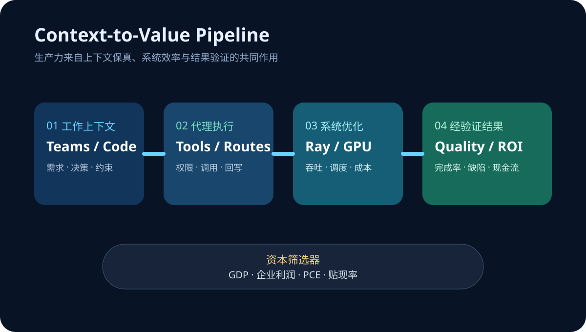

# Daily Intelligence
> 2026-08-25｜Tuesday

## Today’s Thesis｜今日一句话
AI 的下一轮生产力竞争不再取决于“谁能调用最强模型”，而取决于谁能把真实工作上下文送进代理、把推理与后训练成本压进可持续区间，并用明天的宏观数据证明这些效率足以覆盖资本成本。

## ① Executive Summary｜30 秒
- **AI**：Microsoft 正把 Teams 对话直接转成 GitHub Copilot 的编码上下文；代理入口从独立聊天框移到工作发生的地方，减少人工复制、重述与上下文损耗 [A1]。
- **商业**：NVIDIA 在 Ray Summit 展示从 FlashInfer、Dynamo 到拓扑感知调度的全栈推理优化，并披露 GPU 原生数据处理案例可降低约 80% 成本；竞争重心正下沉到系统吞吐与每 token 成本 [A2]。
- **宏观**：BEA 将于 8 月 26 日同一时间发布二季度 GDP 第二次估计、企业利润与 7 月个人收入和支出；增长、利润与通胀将被放进同一个资本成本判断框架 [M1]。

## ② AI Daily

### 上下文入口正在成为产品
**What Happened**：Microsoft 8 月 21 日介绍 Teams 与 GitHub Copilot 的衔接：开发者可从发生讨论的对话中启动编码任务，让需求、决策和约束更直接地进入代理工作流 [A1]。

**Why It Matters**：企业代理最常见的失败并非模型完全不会做，而是任务背景散落在会议、聊天、工单与代码库。每一次手动转述都会丢失约束，也会增加验证成本。

**Second-order Effect**：对话成为可执行上下文 → 代理更靠近真实流程 → 身份、权限与审计必须跨应用连续 → 协作平台获得新的分发与数据优势。

### 成本优化从模型层下沉到系统层
NVIDIA 在 8 月 24—26 日的 Ray Summit 议程中，把 kernel 优化、分布式 serving、GB200/GB300 拓扑感知调度与 GPU 原生预处理放在同一条流水线上 [A2]。官方案例称 Ray Data 与 cuDF 的组合曾把多模态数据处理成本降低 80%；这不是模型变小，而是减少数据搬运与空闲等待。

### “最强模型”不等于“最低任务成本”
生产系统的单位经济学由输入准备、路由、推理、工具调用、重试、人工审核与失败恢复共同决定。能让上下文少丢一次、GPU 少空转一分钟的系统优化，可能比一次基准提升更快转化为利润。

## ③ Business Daily
**协作软件**：Teams 把对话接到编码代理，意味着协作席位不再只售卖沟通效率，也开始售卖“上下文到行动”的转化率 [A1]。平台的护城河将取决于它能否在不越权的前提下连接更多工作对象。

**AI 基础设施**：NVIDIA 与开源推理生态的协作显示，硬件价值正通过调度、kernel 和 serving 软件被放大 [A2]。芯片供应商若能降低整条任务链成本，就能把定价权从单卡性能延伸到集群经济学。

**企业采购**：采购指标应从模型榜单转向端到端任务成本：完成一次合格任务需要多少上下文准备、推理、重试与人工时间。模型价格只是其中一行。

## ④ Macro Observation｜机制分析
**世界正在发生什么？** BEA 计划于 8 月 26 日 8:30 ET 同时发布二季度 GDP 第二次估计与企业利润，以及 7 月个人收入和支出 [M1]。同日还将进入 Ray Summit 的开放模型后训练议程 [A2]。

**为什么发生？** [事实] AI 投资需要大量前置资本，回报却取决于未来利用率与生产率。[推断] 当增长、企业利润和消费通胀在同一窗口更新，市场会同时重估收入增速、利润承受力与折现率。

**资本如何流动？** 若名义增长强但通胀黏性高 → 长期利率门槛维持 → 资本偏好能立即降低单位成本的基础设施与工作流；若利润和通胀同时降温 → 远期 AI 叙事的融资约束反而可能加重。

**接下来关注什么？** 不只看单个 PCE 数字，还要看实际消费、收入、利润修正与 GDP 构成是否一致；AI 侧则观察 80% 案例能否在不同数据、硬件与负载上复现。

## ⑤ Signal Dashboard
| 指标 | 最新观察 | 今日 | 信号 |
|---|---:|:---:|---|
| [GPU 原生数据处理成本](https://www.nvidia.com/en-us/events/ray-summit/) | 案例约 -80% | ↓ | 系统优化释放 ROI |
| [Ray Summit 2026](https://www.nvidia.com/en-us/events/ray-summit/) | 8 月 24—26 日 | → | 推理与后训练工程集中验证 |
| [GDP 第二次估计](https://www.bea.gov/news/schedule) | 8 月 26 日 8:30 ET | → | 增长修正窗口 |
| [企业利润](https://www.bea.gov/news/schedule) | 8 月 26 日 8:30 ET | → | AI 支出承受力 |
| [个人收入与支出](https://www.bea.gov/news/schedule) | 8 月 26 日 8:30 ET | → | 消费与通胀验证 |

## ⑥ Deep Insight
**AI 的稀缺品正在从答案转向高保真上下文与低摩擦执行**

模型能力普及后，同一家企业可以同时访问多个前沿模型。真正难复制的是：谁知道某个需求为何提出、哪些约束不可突破、谁拥有批准权、结果应写回哪里。Teams 到 GitHub Copilot 的连接展示了一个关键方向——把代理放到上下文产生处，而不是要求人把工作搬进聊天框 [A1]。

但上下文越完整，计算链越长。更多消息、代码、工具和验证意味着更高 token、延迟与失败恢复成本。因此，NVIDIA 在 Ray Summit 强调的 kernel、分布式 serving、拓扑调度与 GPU 数据处理，不只是底层技术细节，而是决定代理能否从演示走向利润表的成本结构 [A2]。

这两条线最终汇合为一个运营指标：每单位高保真上下文能产生多少经验证的任务价值。上下文连接提高成功率，系统优化降低完成成本；只有二者同时成立，AI 才能在较高资本成本下持续扩张。

非共识之处在于，平台整合并不必然带来生产力。若权限边界模糊、错误上下文被自动放大，连接越顺畅，返工和安全事故也可能传播得越快。低延迟不是低风险，高吞吐也不是高价值。

**反方观点**：Teams—Copilot 只是入口便利，并未证明任务质量改善；80% 是特定案例结果，不能外推到所有训练与推理负载。

**证伪条件**：1. 上下文直连后返工率、完成时间或缺陷率没有改善；2. GPU 原生流程在真实异构负载中无法保持显著成本优势；3. 宏观利润数据走弱时，企业仍不削减低回报 AI 项目，说明资本成本并非主要筛选器。

## ⑦ Tomorrow Watch
1. BEA 对二季度实际增长的修正方向及贡献项。
2. 7 月核心 PCE、实际消费与收入是否同向。
3. 企业利润能否支持持续的 AI 资本开支。
4. NVIDIA 的开放模型后训练议程是否披露可复现吞吐、延迟与利用率。
5. 协作平台能否提供跨应用权限、来源与结果回写的完整审计链。

## ⑧ One Chart

图表把价值链拆成四段：工作上下文进入代理、系统调度压低计算浪费、输出经过验证转成业务结果，最后由增长、利润和贴现率决定资本是否继续投入。

## ⑨ Quote of the Day
> “The first principle is that you must not fool yourself—and you are the easiest person to fool.”
> — Richard Feynman

**中文理解**：首要原则是不欺骗自己，而自己恰恰是最容易被欺骗的人。

**Why it matters today**：AI 演示、成本案例与宏观预测都容易挑选最有利的样本。真正的进步来自预先定义指标、保留失败数据，并让结果经得起复现。

## ⑩ Action Items｜今天值得思考什么
1. **测量** 从需求对话到可验收结果的完整耗时，而非只看模型响应时间。
2. **拆分** token、数据准备、工具调用、重试和人工审核的任务成本。
3. **验证** 任何大幅降本案例的硬件、数据规模、基线与可迁移性。
4. **约束** 跨应用代理的身份、最小权限、来源记录与结果回写。
5. **对照** 明日 GDP、利润、实际消费与 PCE，更新 AI 项目的最低回报假设。

## 信息边界
本报告以 2026-08-25 07:02 Asia/Shanghai 可获得信息为截止点。8 月 26 日的美国宏观数据尚未发布，本文只陈述官方日程与分析框架；80% 为 NVIDIA 页面引用的特定 Anyscale 案例，并非行业通用降幅。事实与推断已分开标注，不构成投资建议。

## Sources

### AI
- [A1：Microsoft Tech Community — Turn conversations into code with GitHub Copilot in Microsoft Teams](https://techcommunity.microsoft.com/blog/microsoftteamsblog/turn-conversations-into-code-with-github-copilot-in-microsoft-teams/4548305)
- [A2：NVIDIA — NVIDIA at Ray Summit 2026](https://www.nvidia.com/en-us/events/ray-summit/)

### Business & Macro
- [M1：U.S. Bureau of Economic Analysis — Release Schedule](https://www.bea.gov/news/schedule)
