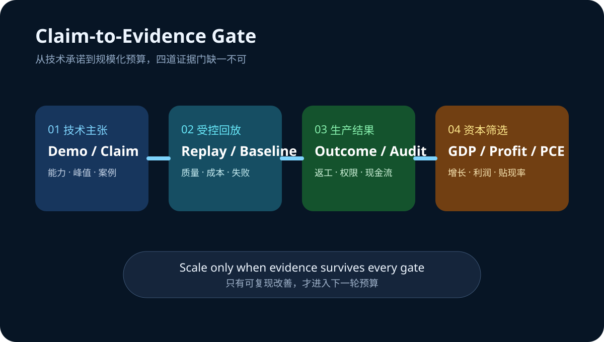

# Daily Intelligence
> 2026-08-26｜Wednesday

## Today’s Thesis｜今日一句话
今天不是再增加一个 AI 叙事的日子，而是把技术承诺送进同一套验证框架：系统效率要经受真实负载，资本回报要经受增长、利润与通胀数据，只有可复现的改善才配获得下一轮预算。

## ① Executive Summary｜30 秒
- **AI**：Ray Summit 进入最后一天，开放模型后训练、分布式推理与拓扑调度从演示走向可复现性检验；关键问题不再是“能否运行”，而是“在什么负载和基线下持续更便宜” [A1]。
- **商业**：Microsoft 把 Teams 对话接入 GitHub Copilot，说明代理价值越来越依赖上下文流转；采购方应同时测量任务完成率、返工和权限事故，而不是只看调用量 [A2]。
- **宏观**：BEA 计划于美东 8:30 同时发布二季度 GDP 第二次估计、企业利润和 7 月个人收入与支出；截至本报告截止点尚未发布，结果将共同检验 AI 投资的收入、利润与折现率假设 [M1]。

## ② AI Daily

### 后训练与推理进入“可复现”阶段
**What Happened**：NVIDIA 的 Ray Summit 日程覆盖 FlashInfer、Dynamo、GB200/GB300 拓扑感知调度、GPU 原生数据处理与开放模型后训练，并在 8 月 26 日收尾 [A1]。

**Why It Matters**：单次演示可以隐藏数据准备、冷启动、失败重试和人工校正。生产价值需要把这些成本放回分母，比较相同质量门槛下的端到端任务成本。

**Second-order Effect**：更多优化进入系统层 → 性能优势更依赖负载与配置 → 基准可迁移性下降 → 企业必须保留自己的回放集、质量门槛和成本账本。

### 上下文连接提高价值，也扩大错误半径
Teams 对话可成为 GitHub Copilot 编码任务的上下文 [A2]。这减少复制与重述，却也可能把错误需求、过期决策或越权信息更快送进执行链。连接器越顺畅，来源、身份和批准链越不能缺席。

### 代理采购需要“双指标”
只测速度会奖励草率输出，只测质量会忽略不可持续成本。更可靠的组合是：经验证任务完成率 × 每个合格结果的全成本，并把安全事件、返工与人工审核计入。

## ③ Business Daily
**AI 基础设施**：硬件、kernel、serving 与调度正在组成一个共同产品。供应商的定价权将取决于能否在客户真实负载中稳定降低单位合格结果成本，而非展示单项峰值 [A1]。

**协作软件**：当聊天记录直接触发编码任务，协作平台从信息容器升级为执行入口 [A2]。这会提高席位黏性，也把权限、审计与责任归属变成采购条款。

**企业预算**：今天的宏观发布窗口会把增长、利润和消费通胀同时更新 [M1]。若资本成本维持高位，预算更可能流向有回放测试、明确基线和短回收期的 AI 项目。

## ④ Macro Observation｜机制分析
**世界正在发生什么？** BEA 官方日程显示，二季度 GDP 第二次估计、企业利润以及 7 月个人收入与支出将在 8 月 26 日 8:30 ET 发布 [M1]。本报告生成时为 Asia/Shanghai 07:02，数据尚未到发布时间。

**为什么发生？** [事实] 三组数据会在同一窗口更新增长、企业盈利和消费价格信息。[推断] 市场将用它们共同修正收入增长预期、企业投资承受力与贴现率，而不是孤立解读某一个数字。

**资本如何流动？** 增长与利润上修、通胀受控 → 可支持生产率投资；增长弱而核心通胀黏性高 → 资金偏向现金流确定、回收期短的项目；利润走弱 → 高投入、低利用率的 AI 基础设施最先面临预算审查。

**接下来关注什么？** 观察实际消费、可支配收入、企业利润与 GDP 构成是否互相印证；避免用尚未发布的数据为既有仓位或技术叙事背书。

## ⑤ Signal Dashboard
| 指标 | 最新观察 | 今日 | 信号 |
|---|---:|:---:|---|
| [Ray Summit 2026](https://www.nvidia.com/en-us/events/ray-summit/) | 8 月 24—26 日 | → | 最后一天进入复现检验 |
| [GPU 原生数据处理成本](https://www.nvidia.com/en-us/events/ray-summit/) | 特定案例约 -80% | ↓ | 需验证基线与迁移性 |
| [GDP 第二次估计](https://www.bea.gov/news/schedule) | 8 月 26 日 8:30 ET | → | 截止点尚未发布 |
| [企业利润](https://www.bea.gov/news/schedule) | 同时发布 | → | 投资承受力验证 |
| [个人收入与支出](https://www.bea.gov/news/schedule) | 同时发布 | → | 消费与通胀验证 |

## ⑥ Deep Insight
**AI 的下一道门槛不是能力，而是证据可迁移性**

过去一年，AI 系统常用模型榜单、单次演示或供应商案例证明价值。但企业真正购买的是在自己的数据、权限、延迟和质量要求下持续完成任务的能力。Ray Summit 展示的 kernel、serving、拓扑调度和 GPU 数据处理说明，巨大改进可能来自系统工程而非模型参数 [A1]；这也意味着结果更依赖具体环境。

上下文连接同样如此。Teams 到 GitHub Copilot 可以减少需求搬运 [A2]，但若来源、批准权和回写位置不清楚，更快执行只会更快放大错误。连接带来的不是自动生产力，而是一个需要治理的放大器。

宏观层面提供了相同教训。今天计划发布的 GDP、利润与个人收入支出数据 [M1] 不应被提前猜测；它们的价值在于用实际观测更新资本回报假设。技术团队也应采用同样纪律：先声明基线、负载与证伪条件，再看结果是否支持扩张。

非共识之处在于，更多监控和验证并不必然拖慢创新。若回放集、成本账本和权限链成为标准基础设施，它们会减少重复试错，使真正有效的优化更快跨团队复制。

**反方观点**：严格验证会增加早期项目成本，小团队可能因此错过速度窗口；供应商案例即使不可完全迁移，也仍能提供方向性价值。

**证伪条件**：1. 经控制的回放测试无法预测生产表现；2. 上下文直连没有改善完成时间或质量；3. 企业在利润和资本成本变化后仍不调整 AI 项目组合，说明宏观约束并非主要筛选器。

## ⑦ Tomorrow Watch
1. GDP 第二次估计相对初值的修正方向与贡献项。
2. 企业利润与实际消费是否支持持续资本开支。
3. 核心 PCE、收入和消费是否给出一致信号。
4. Ray Summit 案例是否公开硬件、数据规模、基线、质量门槛与失败样本。
5. Teams—Copilot 类连接器是否提供可审计的来源、权限与结果回写。

## ⑧ One Chart

图表把 AI 扩张拆成四道门：技术主张、受控回放、生产结果与资本筛选。任何一环缺少可验证证据，都不应直接推导出规模化预算。

## ⑨ Quote of the Day
> “It is a capital mistake to theorize before one has data.”
> — Arthur Conan Doyle

**中文理解**：在掌握数据之前就建立理论，是一个根本性的错误。

**Why it matters today**：今天的宏观数据尚未发布，技术案例也需要复现。先记录证据再形成结论，能避免把期待误写成事实。

## ⑩ Action Items｜今天值得思考什么
1. **冻结** 今天宏观数据发布前的基线假设，发布后再更新判断。
2. **建立** 一组代表真实任务的回放集，保留失败与人工校正。
3. **计算** 每个合格结果的端到端成本，而非单独的模型价格。
4. **记录** 跨应用代理的来源、权限、批准人与结果回写位置。
5. **要求** 所有降本案例同时披露基线、质量门槛和适用边界。

## 信息边界
本报告以 2026-08-26 07:02 Asia/Shanghai 可获得信息为截止点。网页检索与直接访问在本次运行中因 DNS 解析失败而不可用；本文仅沿用此前已核验的一手来源与官方日程，不声称 8 月 26 日 BEA 数据已经发布。约 80% 为 NVIDIA 页面引用的特定案例，不是行业通用结果。事实、日程与推断已分开标注，不构成投资建议。

## Sources

### AI
- [A1：NVIDIA — NVIDIA at Ray Summit 2026](https://www.nvidia.com/en-us/events/ray-summit/)
- [A2：Microsoft Tech Community — Turn conversations into code with GitHub Copilot in Microsoft Teams](https://techcommunity.microsoft.com/blog/microsoftteamsblog/turn-conversations-into-code-with-github-copilot-in-microsoft-teams/4548305)

### Business & Macro
- [M1：U.S. Bureau of Economic Analysis — Release Schedule](https://www.bea.gov/news/schedule)
