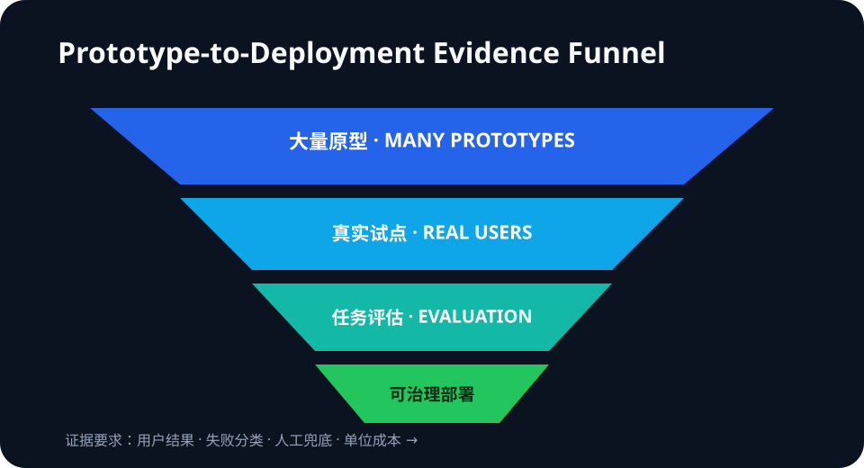

# Daily Intelligence
> 2026-08-29｜Saturday

## Today’s Thesis｜今日一句话
AI 产品的瓶颈正从“能否做出演示”转向“能否在真实用户、明确风险和单位经济约束下稳定工作”；原型数量越多，部署证据、评估设计与责任边界就越值钱。

## ① Executive Summary｜30 秒
- **AI**：OpenAI 与泰国高等教育、科学、研究与创新部启动一个为期 8 周的加速项目，覆盖 10 家医疗、健康与教育初创公司；每家公司须设定产品、试点、评估或商业里程碑，并在结项时提供代表性用户证据与初步评估 [A1]。这是项目设计与目标，不是已实现结果。
- **商业**：项目为每队提供 2,000 美元 API credits、技术指导和本地研究、资金、院校网络。平台竞争因此从模型访问延伸到评估、试点渠道和行业生态，但泰国使用量及增长数字仍是 OpenAI 内部披露 [B1]。
- **宏观**：BEA 最新正式数据仍显示二季度实际 GDP 年化增长 1.5%、私人国内最终需求增长 4.2%；7 月实际 PCE近乎不变、储蓄率 3.0%、核心 PCE 同比 3.3% [M1][M2]。增长与通胀组合要求 AI 项目更早证明实际价值，而非依赖演示热度。

## ② AI Daily

### 从原型到部署是一条不同的能力链
**What Happened**：OpenAI 与泰国 MHESI 宣布首期 AI Accelerator，10 家团队各有 5 家聚焦医疗健康与教育。8 周课程覆盖产品设计、工程、自动测试、评估、负责任 AI、隐私安全、成本、增长与融资；结项预期包括可工作的产品或实质升级、代表性用户证据、初步评估与可信实施路径 [A1]。

**Why It Matters**：模型能力让原型变便宜，却没有自动解决异常场景、数据责任、人工升级、成本和用户信任。进入医院电话与儿童教育等高风险场景后，“跑通一次”与“可依赖地运行”之间的差距会放大。

**Second-order Effect**：原型成本下降 → 试点数量上升 → 真实边缘案例暴露 → 评估与责任设计成为交付瓶颈 → 能提供场景数据、用户渠道和风险治理的本地伙伴获得更高价值。

### 两个案例展示了验证问题
CARIVA 计划开发医院电话多语种语音代理，并让系统识别潜在医疗紧急情况、转交人工；项目目标是在一家医院的真实呼叫流程中试点 [A1]。关键指标不是“对话自然”，而是紧急情况召回、误报、升级延迟和人工接管质量。

Curico 计划在托育中心试点儿童学习工具，并开展教师培训、辅助评分测试与家庭学习产品增长 [A1]。这些均是未来目标；正式效果判断仍需年龄适配、安全事件、学习增量、教师工作量与退出机制数据。

### 采用规模不能替代产品证据
OpenAI 称泰国位列 ChatGPT 周活用户前 20，2026 年以来 Codex 周活增长超过 350 倍 [B1]。高增长说明开发者兴趣，但低基数、收入、留存和生产率未披露。使用量是漏斗顶部信号，不是部署质量的证明。

## ③ Business Daily
**平台策略**：2,000 美元 credits 只是入口。更稀缺的是把团队接入医院、学校、大学、政府与投资者网络，并把试点转化为可复用评估资产 [B1]。

**采购标准**：高风险场景的采购不应只看模型榜单或 Demo Day。应要求任务级基线、失败分类、人工兜底、单位成本、数据边界和上线后监测。

**本地生态**：政府、大学、行业专家和平台公司共同参与，可以降低试点协调成本；也会产生选择偏差与供应商依赖。项目结束后的独立评估和可迁移性才决定长期价值。

## ④ Macro Observation｜机制分析
**世界正在发生什么？** BEA 二季度第二次估计显示实际 GDP 年化增长 1.5%、私人国内最终需求增长 4.2%、实际 GDI 增长 2.2%；7 月个人收入增长 0.4%、名义 PCE 增长 0.2%、实际 PCE低于 0.1%，储蓄率为 3.0%，核心 PCE 同比 3.3% [M1][M2]。

**为什么发生？** [事实] 私人需求仍有韧性，但最新实际消费接近停滞，通胀仍高于低通胀环境。[推断] 企业与公共机构可以继续试验 AI，却更难长期容忍没有基线、没有风险指标和没有单位经济的项目。

**资本如何流动？** 资金会从广泛原型分散向拥有真实分发渠道和验证闭环的项目集中：医院呼叫流、学校课程和监管可接受性比单次演示更难复制。平台 credits 能降低试用门槛，但不能替代客户获取、评估和持续运维。

**接下来关注什么？** 观察 11 月 Demo Day 是否披露代表性样本、任务级错误率和试点结果；项目是否从目标语言转为可复核的部署证据；以及真实消费放缓是否让试点预算更偏向短回报、低风险场景。

## ⑤ Signal Dashboard
| 指标 | 最新观察 | 今日 | 信号 |
|---|---:|:---:|---|
| [泰国加速项目](https://openai.com/index/supporting-next-generation-ai-startups-thailand/) | 10 家、8 周 | ↑ | 从原型转向部署准备 |
| [每队 API credits](https://openai.com/index/supporting-next-generation-ai-startups-thailand/) | 2,000 美元 | → | 试验门槛下降 |
| [泰国 Codex 周活](https://openai.com/index/supporting-next-generation-ai-startups-thailand/) | 年初以来 >350 倍 | ↑ | 公司自报、基数未披露 |
| [Q2 实际 GDP](https://www.bea.gov/news/2026/gdp-second-estimate-and-corporate-profits-2nd-quarter-2026) | +1.5% 年化 | → | 增长温和 |
| [7 月储蓄率](https://www.bea.gov/news/2026/personal-income-and-outlays-july-2026) | 3.0% | ↓ | 消费缓冲有限 |

## ⑥ Deep Insight
**Demo 之后，真正的产品才开始出现**

生成式 AI 把“做出一个看起来能工作的东西”从数月压缩到数天。这个变化很重要，但也让 Demo 的信息含量下降：当许多团队都能展示自然对话、自动摘要或个性化反馈，竞争优势不再由首次成功决定，而由系统如何处理失败决定。

泰国加速项目把这种转向写进了项目结构。课程不只讲模型和工程，还纳入自动测试、评估、隐私安全、成本与增长；结项要求代表性用户证据和初步评估 [A1]。这是一份合理的部署清单，但目前仍是计划。是否有效，要等每个团队公布实际指标、样本和边界。

医疗电话案例最能说明问题。识别普通预约请求很容易展示，识别低频但高损失的紧急情况则需要足够案例、明确召回目标、人工升级和持续监测。儿童教育同样如此：内容生成速度不是学习效果，活跃用户也不是安全与能力迁移。

商业上，本地生态成为模型平台的新护城河。平台提供 credits 和模型，政府连接政策与人才，大学提供领域知识，医院和学校提供验证环境 [B1]。这些关系能把技术能力转成部署机会，也意味着评估必须防止由供应方单独定义成功。

宏观约束会加速这场筛选。私人需求尚有韧性，但实际消费停滞与核心通胀黏性意味着预算不会无限宽松 [M1][M2]。当资本要求回报，最能存活的项目不是演示最炫，而是能解释失败、控制风险并证明用户净收益的项目。

**反方观点**：早期团队若被要求过多评估与治理，可能错失快速迭代；小样本试点也无法给出稳定因果结论。

**证伪条件**：1. 原型表现能长期稳定预测真实部署质量；2. 高风险产品无需场景级评估仍能维持低事故率；3. 加速项目的真实用户证据与商业里程碑不能提高后续采用或留存。

## ⑦ Tomorrow Watch
1. 10 家团队是否公开各自的产品、试点、评估或商业里程碑。
2. 医疗语音代理是否报告紧急情况召回、误报与人工升级数据。
3. 教育工具是否把参与度与学习增量、安全性分开测量。
4. 350 倍使用增长是否能转化为留存、收入和可验证生产率。
5. Demo Day 是否允许外部复核，而不仅是供应方叙事。

## ⑧ One Chart

图表展示 AI 产品从大量原型，经过真实试点、任务评估和运行治理，收敛为少量可规模化部署；越靠后，证据要求越高。

## ⑨ Quote of the Day
> “Ideas are easy. Implementation is hard.”
> — Guy Kawasaki

**中文理解**：想法容易，实施很难。

**Why it matters today**：模型降低了想法和原型的成本，但真实场景中的可靠性、责任与价值仍必须靠实施证明。

## ⑩ Action Items｜今天值得思考什么
1. **定义** 每个试点必须跨越的一个用户结果和一个风险门槛。
2. **记录** Demo 成功之外的失败类型、人工接管和单位成本。
3. **区分** 使用量、试点完成、商业采用与实际效果四种证据。
4. **要求** 高风险场景的代表性样本和上线后监测方案。
5. **复核** 平台或项目方披露的增长数字是否给出基数与独立验证。

## 信息边界
本报告以 2026-08-29 07:00 Asia/Shanghai 可获得信息为截止点。泰国项目、团队目标、使用量和增长数字来自 OpenAI 公司页面；合作与里程碑是已宣布安排，试点效果尚未发生或尚未披露。宏观数字来自 BEA 8 月 26 日正式发布。关于资本流向、采购标准与平台护城河的内容为机制推断，不构成投资建议。

## Sources

### AI
- [A1：OpenAI — Supporting Thailand’s next generation of AI startups](https://openai.com/index/supporting-next-generation-ai-startups-thailand/)

### Business
- [B1：OpenAI — Supporting Thailand’s next generation of AI startups](https://openai.com/index/supporting-next-generation-ai-startups-thailand/)

### Macro
- [M1：U.S. Bureau of Economic Analysis — GDP (Second Estimate) and Corporate Profits, 2nd Quarter 2026](https://www.bea.gov/news/2026/gdp-second-estimate-and-corporate-profits-2nd-quarter-2026)
- [M2：U.S. Bureau of Economic Analysis — Personal Income and Outlays, July 2026](https://www.bea.gov/news/2026/personal-income-and-outlays-july-2026)
