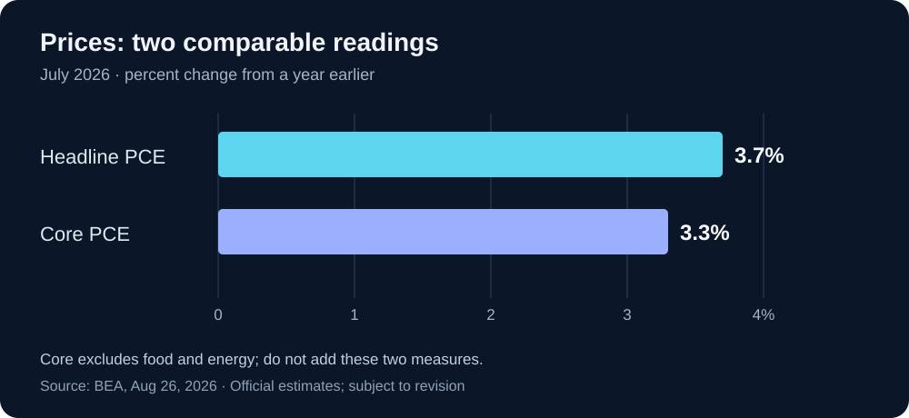

# Daily Intelligence

> 2026-08-30｜Sunday｜完整版补刊

本期于 2026-08-31 补编；信息窗口截止 2026-08-30 23:59（Asia/Shanghai）。只采用窗口内已公开的消息，不把补编当天的新进展写成昨日已知事实。

## Today’s Thesis｜今日一句话

AI 扩张的约束正在从“能否做到”转向“能否承担”：网络防御需要可复核的修复，企业投资需要可兑现的现金流，宏观判断需要独立于乐观叙事的价格证据。

## ① Executive Summary｜30 秒

- **AI**：OpenAI 托管的网络防御联合公开信呼吁跨机构行动；这是风险判断与行动倡议，不是已经兑现的安全能力或拨款。公开信在 8 月 27 日已有公开报道。[公开信](https://openai.com/collective-cyberdefense/) · [发布日期旁证](https://www.axios.com/2026/08/27/openai-anthropic-issue-dire-cyber-threat-warning)
- **商业**：采购 AI 防御工具时，值得验收的是修复是否生效、误报是否增加工作量，以及关键业务能否恢复。本报告提出这些评价口径，不宣称已有公司达到某一收益水平。
- **宏观**：Warsh 8 月 28 日在 Jackson Hole 讨论 AI、政策沟通与通胀，强调政策纪律而非预先承诺某次决定。演讲不是新的利率决议。[美联储演讲](https://www.federalreserve.gov/newsevents/speech/warsh20260828a.htm)
- **数据**：美国 7 月总体与核心 PCE 价格指数分别同比上涨 3.7% 和 3.3%，均为 BEA 8 月 26 日公布的估计；不是 8 月通胀，也不是当日市场价格。[BEA](https://www.bea.gov/news/2026/personal-income-and-outlays-july-2026)

## ② AI Daily

### 联合警告之后，真正的问题是组织能否执行

**What Happened**：公开信把未来数月 AI 网络攻击风险上升列为签署方判断，倡议扩大防御资源并验证修复效果。它面向企业、技术供应方、政府及前沿模型公司分别提出行动方向。[一手原文](https://openai.com/collective-cyberdefense/)

**Why It Matters｜本报告分析**：能力演示与组织应对之间存在一道交付缺口。模型可能帮助发现问题，但组织仍要决定谁有权修复、何时变更、失败如何恢复。发现速度加快，如果变更审批和验证吞吐量没有同步提升，未处理队列反而可能增长。因此“发现更多问题”不能单独作为安全改善的证据。

**Second-order Effect｜待验证机制**：候选问题增加 → 人工分诊负担上升 → 需要按实际暴露和业务影响排序 → 能提供可靠验证的产品更容易证明价值。反向情形也存在：如果模型降低误报并减少复核时间，队列可以缩短。应记录两种结果，不能只展示发现总量。

### 自动化的最小交付单位，应是一项可关闭的风险

以下是本报告的工作流建议，而非公开信已经实现的产品功能。

一个完整单位至少包含：问题及其影响范围、修复授权、验证证据、回退办法、责任人。只有生成补丁而没有部署证据，状态仍是“待实施”；只看到任务结束而没有验证结果，状态仍是“未知”。这能避免把模型输出、系统动作和真实效果压成一个“已完成”。

对于小团队，可先选一个低风险、可撤销的内部流程，记录从发现到复核的完整时间。不要为了提高自动化比例扩大生产权限。对于不能中断的业务，是否变更应由相应责任人决定；这不是让模型根据一句自然语言自行判断风险的场景。

### 采购问题从“用了什么模型”变为“减少了什么损失”

模型名称能说明技术选型，却不能回答误报、漏报和恢复能力。建议供应方展示同一批任务的完整分母：发现多少、确认多少、已修复多少、复核通过多少、仍有多少未观察。缺少观测不能记为零风险，拒绝执行也不能为了报表好看而移出分母。

**反方提醒**：过重的验收流程同样可能延误真正紧急的修复。合理做法不是所有动作采用同一审批强度，而是按可逆性与影响范围分级，再确认各级都有责任人和证据出口。

## ③ Business Daily

### 网络防御的商业机会，不等于供应商收入已经增长

联合倡议说明参与者在推动防御投入，但并未为本报告提供可据以计算行业新增订单的合同数据。因此不从签名数量推导市场规模，不把潜在预算记成已实现收入。[公开信](https://openai.com/collective-cyberdefense/)

**本报告的商业分析**：买方支付意愿可能来自三个不同来源：减少重复人工、缩短风险暴露窗口、改善业务恢复。第一项相对容易计时，后两项需要更谨慎的证据。不能把没有发生事故全部归功于工具，因为同一时期也可能改变了权限、业务规模或攻击暴露。

一个较可靠的试点评估可以同时展示“任务周期”和“全部运行成本”。成本包括工具费用、人工复核、误报处理、变更与恢复演练；收益只计入已观察到的部分。尚未兑现的避免损失可作为情景分析，但不能混进确定节省额。

### 长期承诺应匹配已经验证的使用需求

**资本配置假设**：若企业同时面对更高的技术投入与不确定的融资环境，分阶段采购可能比一次性锁定最大容量更有吸引力。先验证一个任务的稳定使用量，再增加容量，可以保留调整空间。

这不是对全行业采购行为的统计结论。本期没有取得足以验证该趋势的合同样本，也没有据此推荐任何证券。值得继续观察的是续约、使用率和服务成本，而不是只看发布会数量或宣传中的最大处理能力。

## ④ Macro Observation｜机制分析

**已核验事实**：Warsh 的 8 月 28 日演讲讨论了 AI 对经济的潜在影响，并批评常态化前瞻指引可能限制政策灵活性；他的判断与未来委员会正式决定须区分。[美联储原文](https://www.federalreserve.gov/newsevents/speech/warsh20260828a.htm)

**统计背景**：BEA 7 月总体与核心 PCE 价格指数环比均为 0.2%；同比口径则分别为 3.7% 和 3.3%。不同时间跨度回答不同问题，不能把单月改善直接等同于持续回到目标。[BEA 原始发布](https://www.bea.gov/news/2026/personal-income-and-outlays-july-2026)

**本报告分析：为什么 AI 乐观不等于低利率？** 技术提高效率可能降低部分单位成本，但基础设施建设也需要现实资源，且效率改善未必立即传导到终端价格。影响方向与速度取决于需求、竞争、产能和价格传导。不能从“长期生产率可能提高”直接跳到“下一次会议一定降息”。

**资本如何受影响？** 对需要提前支出的项目，等待收益兑现的时间越长，资金成本假设越重要。对买方来说，保留分期扩容和退出选项是一种管理不确定性的方法，不是对利率方向的押注。对宏观观察者来说，应同时看实际活动与价格变化，避免只挑能支持原有故事的数据。

**观察边界**：本期未采集周五收盘行情、周末加密资产价格或利率期货概率，因此没有市场涨跌表，也不宣称市场已经按上述机制重新定价。中国 8 月 PMI 不在本期已核验资料中，不以往年同月数据补位。

## ⑤ Signal Dashboard

| 信号 | 观察与时点 | 证据状态 | 不能推出的结论 |
|---|---|---|---|
| [网络防御联合公开信](https://openai.com/collective-cyberdefense/) | 8 月 27 日已有公开报道 | 行业倡议与风险判断 | 所有承诺已执行或攻击已按预测发生 |
| [Jackson Hole 演讲](https://www.federalreserve.gov/newsevents/speech/warsh20260828a.htm) | 8 月 28 日 | 官员公开讲话 | 新的委员会利率决定 |
| [美国总体 PCE 价格指数](https://www.bea.gov/news/2026/personal-income-and-outlays-july-2026) | 7 月同比 +3.7% | 官方估计，可修订 | 8 月通胀或当天涨幅 |
| [美国核心 PCE 价格指数](https://www.bea.gov/news/2026/personal-income-and-outlays-july-2026) | 7 月同比 +3.3% | 官方估计，可修订 | 与总体指数相加后的通胀率 |
| 企业 AI 安全工具实际收益 | 本期没有匹配样本 | 未观察 | 零收益或普遍正收益 |
| 下一次政策决定 | 本期不作确定性预测 | 待正式决议 | 演讲已锁定结果 |

## ⑥ Deep Insight

### 同一个错误：把可用能力当成已兑现结果

以下为本报告独立分析。

AI 部署与宏观判断看似相距很远，却容易出现同一种推理短路：找到一个有解释力的中间指标，便把它当成最后结果。找到漏洞不等于风险已经减少，买到算力不等于利润增长，看到技术进步也不等于总体价格立即下降。这些指标并非无用；问题是中间还隔着哪些必要条件。

以企业流程为例，模型输出之后还有权限、执行、验证和业务使用。任意一环没有发生，结果就可能停留在候选状态。如果汇报只计算“生成数量”，组织可能奖励最容易扩大、却与收益最远的环节。一个项目看上去高速增长，实际未处理工作也可能同步堆积。

更好的测量单位是同一批任务的状态变化。先固定任务集合，记录哪些完成、哪些失败、哪些被拒绝、哪些尚未观测，再讨论成本与收益。这样既不把失败隐藏起来，也不把未知强行转换为负面结论。减少未解决问题和减少报告中的条目，是两件不同的事。

资本预算也存在类似问题。一次性采购金额容易观察，持续使用收益较晚出现。若用采购额证明未来需求，再用对未来需求的乐观为新采购背书，就会形成自我强化的论证。打断循环需要来自不同环节的证据，例如真实任务量、付费续约和扣除全部成本后的交付收益，而不是重复引用同一个增长数字。

这并不意味着应该等待所有不确定性消失再行动。对可逆、低成本的试验，提前尝试有价值；对长期、不可逆的承诺，则需要更强证据。把风险大小与验证强度匹配，通常比一律激进或一律保守更有用。此处提出的是决策框架，不是对任何具体机构行为的认证。

**反方观点**：过分强调短期可测收益，可能使组织错失需要多年积累的通用能力。某些基础建设确实无法用一个季度回报衡量。

**如何检验**：为长期项目设置阶段性学习目标，而非只设短期利润目标；若后续证据显示部署规模扩大、单位总成本下降、质量稳定且客户持续使用，可以提高投入。若只有输出数量增加而验收与使用停滞，就应重新检查中间环节。框架是否有效，要看它是否改善了实际选择，而不是指标是否更漂亮。

## ⑦ Tomorrow Watch｜截至本期窗口的下一步

1. 联合倡议是否出现可核验的具体实施安排、服务覆盖与修复验证结果，而不只是新增签名。
2. 安全试点是否公开误报、人工介入和失败分母，允许比较总工作量。
3. 后续政策沟通与正式决议是否一致；避免把讲话中的原则写成已发生的政策动作。
4. 下一批价格与活动数据是否相互支持，还是显示行业之间明显分化。
5. 进入 8 月 31 日后，再核验当日发布的中国官方经济数据；本期不预填结果。

## ⑧ One Chart

同月、同为同比的两项价格指标；横轴从零开始。核心 PCE 排除食品和能源，两者是不同口径而非可相加的组成部分。图中不混入环比、储蓄率或预测值。[数据来源：BEA，2026-08-26](https://www.bea.gov/news/2026/personal-income-and-outlays-july-2026)

## ⑨ Quote of the Day

> “I stand here today committed to a discipline, not to a decision.”
> — Kevin Warsh

**中文理解**：我今天在这里承诺的是一套纪律，而不是一个预定决定。

**Why it matters today**：这句话出自 8 月 28 日演讲结尾。对本期的启发是：先明确什么证据足以改变判断，再决定行动；不要把愿望当作事实。[原文出处](https://www.federalreserve.gov/newsevents/speech/warsh20260828a.htm)

## ⑩ Action Items｜今天值得思考什么

1. **固定分母**：选择一个 AI 流程，保留完成、失败、拒绝和未知四种状态。
2. **补齐验收**：为“已完成”增加独立结果证据，不只接受工具返回成功。
3. **拆分预算**：区分试验、扩容和长期承诺，为每阶段写清触发条件。
4. **检查口径**：把实际值、预测、倡议和分析分开，标出数据期与发布日期。
5. **留下反证**：为自己的核心判断写一个可能使其失效的观察结果。

## 信息边界

本期为 2026-08-30 正式完整版补刊，补编日期为 2026-08-31，新闻窗口截止于 8 月 30 日 23:59（Asia/Shanghai）。公开信无固定发布日期标识，其在窗口内已公开由 8 月 27 日报道旁证；签署名单是动态页面，本期不统计或倒推某日签署总数。演讲与 BEA 页面均有明确发布日期。公开信的风险预期、官员判断、官方统计估计与本报告原创分析分别标记；未以 8 月 31 日新消息回填，也未虚构市场报价、合同或客户回报。行动建议是研究与流程管理参考，不构成投资建议、安全保证或执行生产变更的授权。

## Sources

- [A1：联合公开信 — A call for collective action on cyber defense](https://openai.com/collective-cyberdefense/)
- [A2：Axios，2026-08-27 — 仅用于核验公开信已公开的日期](https://www.axios.com/2026/08/27/openai-anthropic-issue-dire-cyber-threat-warning)
- [M1：Federal Reserve，2026-08-28 — In Our Time](https://www.federalreserve.gov/newsevents/speech/warsh20260828a.htm)
- [M2：BEA，2026-08-26 — Personal Income and Outlays, July 2026](https://www.bea.gov/news/2026/personal-income-and-outlays-july-2026)
