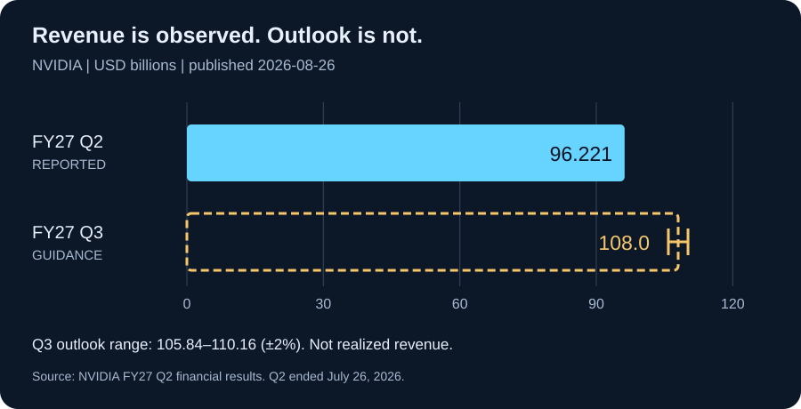

# Daily Intelligence
> 2026-08-31｜Monday

## Today’s Thesis｜今日一句话
AI 的扩张正在同时触及物理设备与资本预算：接口标准降低接入成本，但只有把操作权限、失败成本和客户回报一起纳入验收，算力增长才可能转化为可持续生产率。

## ① Executive Summary｜30 秒
- **AI**：Anthropic 8 月 27 日开放 Model Hardware Standard（MHS）有限研究预览，把代理接入实验室和制造设备；目前是申请制、尚待开源，不是已经普遍可用的成熟工业标准。[A1](https://modelhardwarestandard.com/)
- **商业**：NVIDIA 8 月 26 日披露 FY2027 第二季度收入 962.21 亿美元、同比增长 106%；这是供应商已确认的季度收入，不等于下游客户已获得同等投资回报。[B1](https://nvidianews.nvidia.com/news/nvidia-announces-financial-results-for-second-quarter-fiscal-2027)
- **宏观**：BEA 7 月实际 PCE 环比按表列精度为 0.0%，个人储蓄率 3.0%。消费量与储蓄缓冲提示预算约束仍值得观察，不能只用 AI 资本开支概括全经济。[M1](https://www.bea.gov/news/2026/personal-income-and-outlays-july-2026)
- **今天的判断**：从“模型能调用设备”到“组织允许设备动作”，中间需要独立的权限控制、结果验证和事故责任；这些是本报告的工程与商业分析，不是对某个产品安全性的认证。

## ② AI Daily

### 硬件有了共同接口，责任不会自动统一
**What Happened**：Anthropic 的 MHS 研究预览面向科研与先进制造，通过共同驱动描述设备能力和限制，并允许代理经 MCP、命令行或 API 操作设备。公司强调模型仍有物理推理局限，需要专家监督。[A2](https://www.anthropic.com/news/model-hardware-standard-research-preview)

**Why It Matters**：软件任务的错误通常还能撤销，物理操作却可能消耗样本、改变环境或损坏仪器。因而接入越方便，越应把“能发现设备”“能读取状态”“能提出动作”“能执行动作”拆成不同权限。把接口连通当作上线许可，会掩盖最重要的组织决策。

**Second-order Effect**：接入成本下降 → 可尝试的自动化组合增加 → 跨设备故障与责任交界变多 → 独立状态检查和可追溯操作记录更有价值。这是一条待验证的机制链，不代表事故已经增加。

### 自然语言说明不是物理安全屏障
**技术事实边界**：公告描述了设备元信息、约束和执行接口，也展示了早期合作案例；这些来自供应方及其合作伙伴，不是跨场景独立认证。[A2](https://www.anthropic.com/news/model-hardware-standard-research-preview)

**本报告建议**：描述文件应帮助模型理解设备，但温度、位置、速度、耗材等边界应由模型外部的确定性控制承担。遇到读数缺失、状态不一致或通信中断时，系统需要预先定义暂停和人工接管方式，不能把“没有报错”当作动作完成。

**采购问题**：是否能在模型失联时保持受控状态？人工接管是否需要绕过繁琐权限？同一任务换模型后，权限范围是否保持不变？这三项比演示中一次流畅的自然语言操作更接近交付能力。

### 本周值得跟踪的是标准落地，而非名称扩散
MHS 官方站点将当前阶段写明为有限预览，并计划通过合作测试完善安全评估与实践，再走向开源。[A1](https://modelhardwarestandard.com/) 因此今天不能把“已宣布支持”“申请加入”与“已部署、已审计”计为同一种采用。

建议分别观察驱动可用性、独立实现、任务复现和生产运行四层证据。一个标准可能获得广泛关注，却长期停留在适配阶段；也可能先在狭窄场景形成可靠收益，再逐步扩展。二者对预算安排的含义不同。

## ③ Business Daily

### 财报确认需求，不能替客户回答回报
NVIDIA 的最新财报还披露数据中心收入约 890 亿美元；第三季度收入指引为 1,080 亿美元、上下浮动 2%。前者是报告期业绩，后者是管理层预期，不能并列成两个已经实现的数据点。[B1](https://nvidianews.nvidia.com/news/nvidia-announces-financial-results-for-second-quarter-fiscal-2027)

**机制分析**：产业链上游在设备交付时确认价值，下游则要经历部署、使用、收费和回款。上游增长与下游回报之间存在时间差，不足以单独证明泡沫，也不足以证明所有投入合理。最有信息量的是同一批客户的利用率、付费续约和扣除运行成本后的收益。

**商业模式变化的假设**：若通用接口降低设备适配壁垒，集成商可能从一次性接口开发，转向维护、验证、故障诊断和持续服务。设备商则可能把接口支持与服务合同捆绑。这个转变能否发生，取决于买方是否愿意为可复核结果付费，而不只是购买“AI ready”标签。

**买方今天能做的事**：把试点费用和扩容费用分开。先证明一个稳定任务能减少总成本，再增加设备或算力；不能用演示成功率替代包含人工复核、停机、失败样本与维护的完整成本。

## ④ Macro Observation｜机制分析

**世界正在发生什么？** BEA 8 月 26 日发布的 7 月数据还显示个人收入环比增加 0.4%、名义 PCE 增加 0.2%。名义支出增长与实际消费接近持平可以同时成立；不同口径不能混用。[M1](https://www.bea.gov/news/2026/personal-income-and-outlays-july-2026)

**为什么重要？** 当价格变化吸收部分名义增长时，企业不能仅凭销售额增加推断需求量走强。类似地，AI 项目不能凭 token 消耗上升推断有效产出提升。两个领域共同需要做的是把价格、数量和质量拆开，而不是强行建立因果关系。

**资本如何流动？** 一种可能路径是：基础设施投资继续领先，应用侧预算更强调短周期回报；拥有明确任务分母和成本账本的项目，更容易解释扩容必要性。但本报告没有资金流量或客户合同数据，不能把这条推断描述成已经观察到的资本迁移。

**接下来关注什么？** 比较后续实际消费、企业预算与 AI 服务回款，而不是用单月消费或单家公司财报判断经济拐点。中国 2026 年 8 月 PMI 在本次检索中未获得可核验的一手当期结果，保留“待核实”；不能替换成 2025 年同月数值，也不能据此断言今年尚未发布。

## ⑤ Signal Dashboard

| 指标 | 最新观察与时点 | 状态 | 解释边界 |
|---|---|---|---|
| [MHS](https://modelhardwarestandard.com/) | 8 月 27 日研究预览 | 已宣布 | 申请制，不等于正式开源 |
| [NVIDIA 季度收入](https://nvidianews.nvidia.com/news/nvidia-announces-financial-results-for-second-quarter-fiscal-2027) | FY27 Q2：962.21 亿美元 | 公司财报 | 季度截至 7 月 26 日 |
| [NVIDIA 下一季指引](https://nvidianews.nvidia.com/news/nvidia-announces-financial-results-for-second-quarter-fiscal-2027) | FY27 Q3：1,080 亿美元 ±2% | 前瞻预期 | 尚未实现 |
| [美国实际 PCE](https://www.bea.gov/news/2026/personal-income-and-outlays-july-2026) | 7 月环比 0.0%（表列精度） | 官方估计 | 不代表精确零变化 |
| [美国个人储蓄率](https://www.bea.gov/news/2026/personal-income-and-outlays-july-2026) | 7 月 3.0% | 官方估计 | 不是同比增速 |
| 中国 8 月 PMI | 本轮未核验到当期一手结果 | 待核实 | 未观测不等于未发布 |

## ⑥ Deep Insight

### 下一层稀缺能力，是证明“动作完成且值得做”
以下为本报告的独立机制分析。

数字代理和物理代理之间，最容易被忽略的区别并不是输入换成了摄像头，而是错误的成本结构变了。在文档中生成一个错误段落，可以删除重写；在设备上执行一个错误动作，可能已消耗不可恢复的时间、材料和安全余量。因此，将软件代理的体验直接搬到物理流程，不足以构成可靠产品。

标准化能解决一部分复杂性：不同设备不必每次从零定义通信方式。但它无法替代场景责任。谁能允许动作、谁确认目标状态、谁承担停机成本，这些仍要由使用组织明确。模型对设备的理解可以不断提高，组织对权限的划分却不能随对话临时漂移。

一个有用的验收单位不是“调用成功”，而是“目标任务完成”。设备接受指令只是中间事件；传感器确认状态、检查样本质量、记录异常并决定是否复核，才接近结果。这也意味着可观测性不是附加功能：没有独立结果证据，系统越自动，错误越可能在流程末端才被发现。

商业上的对应关系同样清楚。采购算力得到的是资源，不是利润；生成输出得到的是候选结果，不是生产率。若一个项目节省了执行时间，却增加了更昂贵的复核与停机成本，它可能只是把成本移了位置。真正的分母应包含成功任务、失败任务、放弃任务和人工处理，不能只选演示成功的部分。

由此可以提出一个待验证的判断：未来竞争优势会部分转向运行证据的积累。能记录失败原因、复现边缘案例、保持换模型后权限一致的组织，可能比单纯接入更多模型的组织更容易扩展。但这不是必然趋势；在低风险、可完全撤销的任务里，轻量工具仍可能更有经济性。

**反方观点**：过早建设完整治理平台会让小规模试验承担不必要成本。对低风险任务，人工盯守和有限自动化可能足够，复杂系统本身也会引入故障。

**证伪条件**：1. 独立结果验证持续增加成本，却不能降低失败损失；2. 只凭接口连通即可长期稳定完成复杂任务；3. 运行证据完善的项目并未获得更高续约或更低总成本。应通过相似任务的长期比较判断，而非凭一次演示决定。

## ⑦ Tomorrow Watch

1. MHS 是否新增可公开检验的驱动、测试报告和独立实现，而不只是合作名单。
2. 实验室案例是否报告失败次数、人工介入和跨设备复现结果。
3. AI 基础设施客户是否披露利用率与回款，帮助连接投入与实际收益。
4. 中国 8 月 PMI 一手结果是否可核验；核对年份、发布时间和分项后再更新判断。
5. 后续消费数据能否支持真实需求改善；不将单月读数直接外推为趋势。

## ⑧ One Chart

图表单位为十亿美元：FY27 Q2 已报告收入 96.221；FY27 Q3 指引中值 108.0，区间 105.84—110.16。后者是前瞻值，不是第三季度实际收入；横轴从零开始，空心条用于区别预期。[B1](https://nvidianews.nvidia.com/news/nvidia-announces-financial-results-for-second-quarter-fiscal-2027)

## ⑨ Quote of the Day

> “For a successful technology, reality must take precedence over public relations, for nature cannot be fooled.”
> — Richard P. Feynman

**中文理解**：技术要成功，现实必须优先于公关，因为自然无法被愚弄。

**Why it matters today**：当 AI 开始操作物理设备，语言上的可信不能替代结果验证。引语出处为 NASA 收录的材料，注明源于挑战者号调查报告附录 F。[Q1](https://ntrs.nasa.gov/api/citations/20010069514/downloads/20010069514.pdf)

## ⑩ Action Items｜今天值得思考什么

1. **拆分权限**：为一个代理流程分别列出发现、读取、建议和执行权限。
2. **定义完成**：为每个动作指定独立可观测结果，而非只检查接口返回成功。
3. **补全成本**：将人工复核、失败、耗材和停机计入试点账本。
4. **分开状态**：财报实际值、公司指引、合作计划与机制推断单独标记。
5. **保留未知**：当期 PMI 未核验之前，不引用旧年份数字填空。

## 信息边界

本报告信息截止于 2026-08-31 09:50 Asia/Shanghai，使用本轮网页检索核验的一手公开资料。主题覆盖最近可核验公告，不将 8 月 26—27 日事件称为今天新发生。MHS 能力与案例为供应方披露；财报为公司报告且报表标注未经审计；指引为预测；BEA 为可修订的官方估计。中国当期 PMI 未核验，未填写数值。未采集盘中价格，因此没有把历史报价冒充当前市场。分析与行动建议不构成投资建议或工业安全认证。

## Sources

### AI
- [A1：Model Hardware Standard — 官方项目与预览状态](https://modelhardwarestandard.com/)
- [A2：Anthropic — Previewing the Model Hardware Standard，2026-08-27](https://www.anthropic.com/news/model-hardware-standard-research-preview)

### Business
- [B1：NVIDIA — Financial Results for Second Quarter Fiscal 2027，2026-08-26](https://nvidianews.nvidia.com/news/nvidia-announces-financial-results-for-second-quarter-fiscal-2027)

### Macro
- [M1：BEA — Personal Income and Outlays, July 2026，2026-08-26](https://www.bea.gov/news/2026/personal-income-and-outlays-july-2026)

### Quote
- [Q1：NASA NTRS — Two Opinions，引述 Feynman 调查报告附录](https://ntrs.nasa.gov/api/citations/20010069514/downloads/20010069514.pdf)
