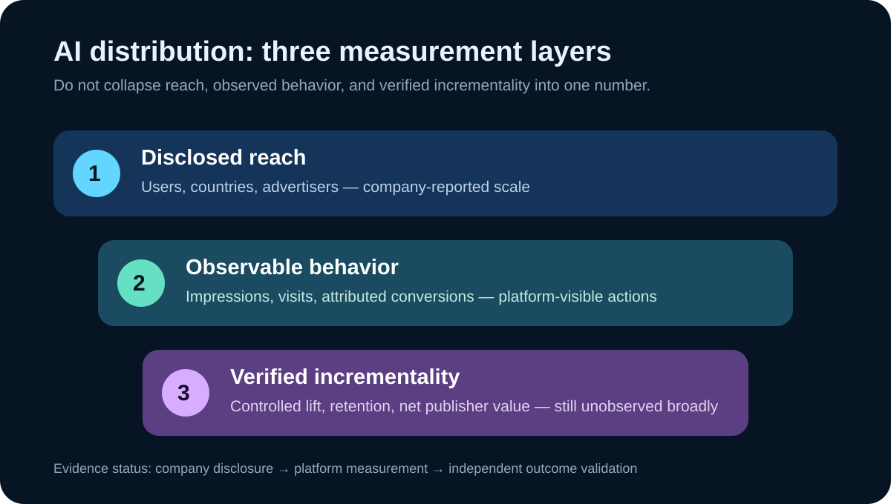

# Daily Intelligence
> 2026-09-01｜Tuesday

## Today’s Thesis｜今日一句话
AI 入口正在从“吸引使用”转向“分配注意力与商业机会”：当广告、推荐和生成式搜索进入同一决策界面，真正稀缺的不是更多曝光，而是用户控制、来源选择与可复核的增量价值。

## ① Executive Summary｜30 秒
- **AI**：OpenAI 8 月 31 日称 ChatGPT Ads 上线不足 200 天，年化收入运行率达到 10 亿美元，并将自助购买扩至印度、欧洲、中东和北非；这是公司的运行率与覆盖披露，不是经审计的全年已实现收入。[A1](https://openai.com/index/expanding-access-to-ai-with-chatgpt-ads/)
- **商业**：Google 同日更新称，网站所有者可控制内容是否出现在生成式搜索中，并获得展示页面与国家等 Search Console 指标；选择退出也意味着放弃来自这些功能的流量和展示。[B1](https://blog.google/products-and-platforms/products/search/new-controls-website-owners/)
- **宏观**：BEA 8 月 26 日第二次估计显示，美国二季度实际 GDP 年化环比增长 1.5%，低于一季度 2.1%；数据可修订，也不能单独解释 AI 广告或搜索产品的需求。[M1](https://www.bea.gov/data/gdp/gross-domestic-product)
- **今天的判断**：AI 入口开始同时承担答案、发现和商业分发。平台披露证明商业化在推进，但广告主回报、出版者净流量与用户信任仍需独立分母。

## ② AI Daily

### 广告进入对话，相关性不再只是模型问题
**What Happened**：OpenAI 表示 ChatGPT Ads 已在 40 多个国家提供，广告平台被数万广告主使用，并披露 ChatGPT 的周活跃用户超过 10 亿。公司称广告会清晰标注、与回答分离，广告主不能访问私人对话；这些均是平台方陈述。[A1](https://openai.com/index/expanding-access-to-ai-with-chatgpt-ads/)

**Why It Matters**：传统搜索广告围绕查询词和页面位置分配注意力；对话式入口同时包含目标、约束和比较过程，商业信息可能更接近决定形成的时刻。因此“相关”与“影响”必须拆开：广告是否契合当前任务是一项产品指标，回答是否保持独立则是另一项治理要求。

**Second-order Effect**：更细的上下文 → 更高的商业匹配潜力 → 广告主愿意测试更多预算 → 用户更需要知道哪些内容来自答案、哪些来自付费分发。这是一条机制推断，不是已经观察到广告提高决策质量。

### 平台指标不能替代用户结果
OpenAI 披露一个电商广告主在 28 天内获得 3 倍广告支出回报，另有技术合作伙伴称超过 80% 的广告引导流量来自新客户。[A1](https://openai.com/index/expanding-access-to-ai-with-chatgpt-ads/) 两者都是个案或合作伙伴报告，缺少完整样本、行业分布与失败案例，不能外推成全平台平均效果。

对采购者，更稳健的验证单位是增量：在相同受众与时间窗中，广告是否带来原本不会发生的有效行动。点击、对话或归因转化都可能重复计入已有需求。若没有对照组、退款和长期留存，漂亮的短期回报仍可能高估价值。

### 控制权正在成为产品功能
Google 的生成式搜索控制让网站决定是否参与回答的引用与展示，并明确指出退出将失去相关流量和展示。[B1](https://blog.google/products-and-platforms/products/search/new-controls-website-owners/) 这把过去模糊的“是否被抓取、是否被训练、是否被展示”进一步拆成可操作选择，但公告不证明所有发布者都会因此获得更好的经济结果。

## ③ Business Daily

### 分发平台开始给供给侧一张可见账单
Google 称 AI Overviews 月活跃用户超过 25 亿、AI Mode 月活跃用户超过 10 亿，并在 Search Console 提供生成式搜索展示次数、出现页面和国家信息。[B1](https://blog.google/products-and-platforms/products/search/new-controls-website-owners/) 这些是平台披露且两个产品可能有用户重叠，不能相加成总用户数。

**商业机制**：内容供给者过去只能看到总搜索流量变化，现在获得更细的生成式展示数据，就能把“被引用”与“获得访问”分开。若展示高而点击低，内容可能成为平台答案的输入，却没有转化成站点关系；若退出后品牌发现下降，控制权也有机会成本。

**对平台的约束**：只提供展示次数还不足以解决价值分配。出版者真正需要比较的是点击质量、订阅、复访与制作成本。平台若只优化生成式功能内部的满意度，可能与开放网络的长期供给激励发生张力；这是待检验的商业风险，不是已证实的流量伤害。

**买方动作**：将“生成式搜索出现率”“站点访问”“有效转化”设为三层漏斗，先建立基线再调整参与策略。不要因某一平台给出巨大用户规模，就把全部覆盖视为可购买或可兑现受众。

## ④ Macro Observation｜机制分析

**世界正在发生什么？** BEA 的二季度第二次估计显示实际 GDP 年化环比增长 1.5%，一季度为 2.1%；二季度增长来自消费、出口和投资增加，部分被政府支出下降抵消。[M1](https://www.bea.gov/data/gdp/gross-domestic-product)

**为什么重要？** 总量仍增长，但增速较前季放缓。企业因此更有理由要求新渠道说明增量贡献，而不是把用户规模或展示次数直接视为收入。GDP 是全经济估计，不能证明某个 AI 产品预算会扩大或收缩。

**资本如何流动？** 一种可能路径是，拥有自助购买、归因接口和可观察转化的 AI 平台更容易吸收试验预算；同时，出版者会把预算投向能证明订阅与复访的内容。这里没有跨平台预算流数据，不能把该机制写成已发生的资本迁移。

**接下来关注什么？** 比较广告收入运行率能否转为已实现收入、网站生成式展示能否转为高质量访问，以及后续 GDP 修订是否改变增长判断。中国 2026 年 8 月 PMI 本轮未取得可核验的一手当期页面，状态保留为“待核实”；未观测不等于零或未发布。

## ⑤ Signal Dashboard

| 指标 | 最新观察与时点 | 状态 | 解释边界 |
|---|---|---|---|
| [ChatGPT Ads 年化收入运行率](https://openai.com/index/expanding-access-to-ai-with-chatgpt-ads/) | 10 亿美元；8 月 31 日披露 | 公司披露 | 不是全年已实现或经审计收入 |
| [ChatGPT 周活跃用户](https://openai.com/index/expanding-access-to-ai-with-chatgpt-ads/) | 超过 10 亿 | 公司披露 | 不等于广告可触达人数 |
| [AI Overviews 月活跃用户](https://blog.google/products-and-platforms/products/search/new-controls-website-owners/) | 超过 25 亿 | 公司披露 | 与 AI Mode 可能重叠 |
| [AI Mode 月活跃用户](https://blog.google/products-and-platforms/products/search/new-controls-website-owners/) | 超过 10 亿 | 公司披露 | 不可与上项相加 |
| [美国实际 GDP](https://www.bea.gov/data/gdp/gross-domestic-product) | 2026 Q2 年化环比 +1.5% | 官方第二次估计 | 可修订，不是同比 |
| 中国 8 月 PMI | 本轮未核验到当期一手页面 | 待核实 | 未观测不等于未发布 |

## ⑥ Deep Insight

### 当答案成为货架，衡量方式就是市场规则
以下为本报告的独立机制分析。

生成式入口把三个过去相对分开的环节叠到一起：理解用户意图、组织答案、分配商业信息。这样做降低了用户在多个页面之间切换的成本，却也让平台同时拥有解释问题与安排曝光的位置。决定权并非只来自模型能力，更来自界面规定什么被看见、什么可以计量。

商业化本身不是问题。免费服务需要收入，广告也能提供用户原本不知道的选项。关键在于答案与广告是否可区分、个性化边界是否可控、平台是否能证明推荐没有反向塑造回答。只有“广告不影响答案”的原则声明还不够，长期信任需要可审计的产品行为与用户可理解的控制。

供给侧同样面临新的交换。网站允许内容进入生成式回答，可能得到品牌曝光和访问；也可能只贡献信息而失去直接关系。Google 新增控制和展示指标，意味着这种交换开始可被管理，但“被展示”仍不是“获得价值”。若出版者把展示次数设为唯一目标，就可能优化更容易被引用的内容，却牺牲独特性、订阅和长期信任。

这也是 Goodhart 定律在 AI 分发中的现实含义：指标一旦成为目标，参与者会围绕它调整。广告主会优化归因窗口，平台会优化满意度与收入，网站会优化被引用概率。每个局部指标都可能改善，而用户获得的信息质量、出版者经济性和广告增量却没有同步上升。

更好的做法不是拒绝指标，而是成对设置指标：展示与点击、点击与增量转化、短期回报与长期留存、广告收入与信任投诉。成对指标不能消除博弈，但能让单一数字更难掩盖成本转移。

**反方观点**：更多控制和指标会增加操作复杂度，小型网站与广告主可能无力建立对照实验，最终仍由大型参与者受益。轻量默认设置在多数低风险场景可能比完整测量体系更实用。

**证伪条件**：1. 生成式展示与长期站点价值稳定正相关；2. 简单平台归因能在多行业复现真实增量；3. 用户对广告与答案的区分长期保持清晰，且无需额外审计。应等待跨周期、跨样本证据，而不是用上线初期个案下结论。

## ⑦ Tomorrow Watch

1. ChatGPT Ads 的年化运行率是否在后续财务披露中转化为已实现收入。
2. 广告与回答分离原则是否出现可公开验证的审计或透明度报告。
3. Search Console 是否补充生成式展示的点击、订阅或更可比较的流量质量指标。
4. 网站选择退出后，传统搜索与生成式入口的流量变化是否可分开观察。
5. 中国 8 月 PMI 一手结果能否核验；确认年份、发布时间和分项后再使用。

## ⑧ One Chart

图中将平台披露拆成覆盖、可观察行为与已验证增量三层。OpenAI 和 Google 已披露覆盖与部分平台指标；跨样本的真实增量仍未观测。图是证据层级示意，不按不同周期与产品口径比较用户规模。[A1](https://openai.com/index/expanding-access-to-ai-with-chatgpt-ads/) [B1](https://blog.google/products-and-platforms/products/search/new-controls-website-owners/)

## ⑨ Quote of the Day

> “Any observed statistical regularity will tend to collapse once pressure is placed upon it for control purposes.”
> — Charles Goodhart

**中文理解**：一旦某个已观察到的统计规律被施加压力、用作控制目标，它往往会失效。

**Why it matters today**：当展示、点击和归因收入成为 AI 分发的目标，参与者会改变行为；指标仍有用，但必须与反向指标和真实结果一起看。英格兰银行 2026 年研讨会材料将此句列为 Charles Goodhart（1975）。[Q1](https://www.bankofengland.co.uk/-/media/boe/files/events/2026/money-workshop-slides.pdf)

## ⑩ Action Items｜今天值得思考什么

1. **拆分漏斗**：分别记录生成式展示、站点访问、有效转化和长期留存。
2. **建立对照**：广告回报优先看增量实验，不只看平台归因。
3. **核对控制**：确认是否允许参与生成式回答，以及退出的流量机会成本。
4. **成对指标**：覆盖率配投诉率，短期回报配退款与留存。
5. **保留未知**：PMI 与跨平台净流量未核验时，不用旧值或个案填空。

## 信息边界

本报告信息截止于 2026-09-01 07:20 Asia/Shanghai，使用本轮网页检索核验的一手公开资料。OpenAI 与 Google 的用户、收入运行率、广告案例和产品效果均为公司披露；Google 两项月活用户可能重叠。BEA 数据为可修订的官方估计。未采集盘中市场价格。中国当期 PMI 未核验，未填写数值。机制分析、反方观点与行动建议是本报告判断，不构成投资建议、广告效果保证或平台审计结论。

## Sources

### AI
- [A1：OpenAI — A milestone in expanding access to AI，2026-08-31](https://openai.com/index/expanding-access-to-ai-with-chatgpt-ads/)

### Business
- [B1：Google — New opportunities, control and insights for website owners，更新于 2026-08-31](https://blog.google/products-and-platforms/products/search/new-controls-website-owners/)

### Macro
- [M1：BEA — Gross Domestic Product, Q2 2026 second estimate，2026-08-26](https://www.bea.gov/data/gdp/gross-domestic-product)

### Quote
- [Q1：Bank of England — Workshop on analysing the information content of money，2026](https://www.bankofengland.co.uk/-/media/boe/files/events/2026/money-workshop-slides.pdf)
