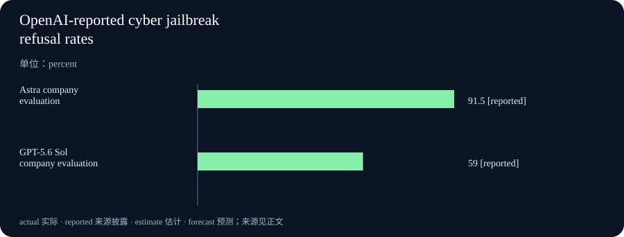

# Daily Intelligence
> 2026-09-02｜Wednesday

## Today’s Thesis｜今日一句话
前沿 AI 正从“同一模型、统一入口”转向“同一能力、分层授权”：竞争优势不再只由基准分数决定，而由谁能把权限、监控、数据托管和人工复核写成可执行的交付契约决定。

## Executive Summary｜30 秒
- **AI**：OpenAI 9 月 1 日称 Astra 达到其 Preparedness Framework 的 Critical 网络安全能力门槛，是公司首个被如此定级的模型；高级网络能力将先限于少量测试者，完整系统卡计划在发布时提供。[A1](https://openai.com/index/path-to-astra/)
- **产品**：Anthropic 同期发布 Fable 5.1 与 Mythos 5.1，称两者是同一底层模型、采用不同防护与访问范围；Fable 一般可用，Mythos 仅通过受信访问计划提供。[A2](https://www.anthropic.com/claude-fable-and-mythos-5-1)
- **商业**：Anthropic 宣布 Enterprise Frontier Safeguards（EFS），让监控活动数据保存在客户控制的云账户，并把告警交给客户团队复核；产品从今年秋季起分阶段推出，尚不是全面可用的已交付能力。[B1](https://www.anthropic.com/news/enterprise-frontier-safeguards)
- **宏观**：BEA 日程显示，美国 7 月国际贸易数据定于 9 月 3 日 8:30 ET 发布；在本报告截止时它仍是未来发布，不能预填结果。[M1](https://www.bea.gov/news/schedule)
- **今天的判断**：模型供应商正在把“安全”变成产品架构与市场分层。真正可采购的不是抽象安全承诺，而是明确到数据位置、密钥所有者、监控触发、暂停方式与复核责任的运行边界。

## AI Daily

### Critical 不等于默认向所有人开放
**What Happened**：OpenAI 表示，Astra 在其评估中已经满足 Critical 网络安全能力门槛：在适当工具和访问条件下，模型可以在没有人逐步指导时发现未知漏洞，并为多个加固系统开发利用方式。该结论来自公司内部与专家评估，不是独立监管认证。[A1](https://openai.com/index/path-to-astra/)

OpenAI 披露，Astra 在 ExploitBench 已知漏洞基准上达到 100%，并在包含 20 个较新高危 V8 漏洞的内部数据集上表现显著高于 GPT-5.6 Sol；评估期间发现的两个零日漏洞正在向维护者披露。公司同时限定：这些结果对应带 Daybreak Blue 访问的能力，不是默认生产配置。[A1](https://openai.com/index/path-to-astra/)

**Why It Matters**：过去，模型版本名常被当成能力承诺；现在，版本名只说明潜在能力，实际可用范围还取决于账户风险、工具权限、监控和任务上下文。采购方若只问“模型能不能做”，会遗漏更重要的问题：在自己的账户、数据、地区和审批链下，哪些动作能被执行，哪些会暂停，谁能恢复。

**Second-order Effect**：能力提升 → 潜在损害半径扩大 → 默认访问趋于收紧 → 合法防守任务也可能遭遇更多摩擦 → 企业开始为受信访问、审计证据和复核流程投入预算。这是一条机制推断，并不证明受限访问已经降低真实世界攻击数量。

### 同一底模开始成为不同风险产品
Anthropic 称 Fable 5.1 和 Mythos 5.1 是同一模型，但防护水平不同：前者一般可用，后者只通过受信访问计划提供，用于网络安全和生命科学等高风险能力。[A2](https://www.anthropic.com/claude-fable-and-mythos-5-1) 这种设计把“模型是什么”与“用户被允许做什么”拆开，也意味着公开基准不能直接代表任一客户的生产体验。

Anthropic 还称，新版网络安全防护相较此前减少 60% 的误报拦截，并允许 Fable 5.1 发现软件漏洞、但不允许开发利用方式。[A2](https://www.anthropic.com/claude-fable-and-mythos-5-1) 这是供应商测试口径；缺少跨客户任务分布与独立复现实验，不能解释为所有合法工作都减少 60% 摩擦。

## Business Daily

### 数据托管位置正在成为交易条件
Anthropic 的 EFS 试图解决一个结构性冲突：跨会话、跨账户识别严重滥用需要保留活动数据，而受监管客户又可能不能把敏感日志交给模型供应商。其方案是把活动数据存进客户自己的 AWS、Azure 或 Google Cloud 账户，由客户控制加密密钥、访问政策和审计日志；自动系统分析滚动窗口，告警送回客户，由客户人员决定后续动作。[B1](https://www.anthropic.com/news/enterprise-frontier-safeguards)

**商业机制**：若模型供应商持有数据、检测和复核三项权力，客户只能接受一套外部控制。EFS 把数据保管和人工复核还给客户，供应商保留自动检测能力。这种职责拆分有机会把合规阻力从“不能用”改成“满足条件后可用”，但也把存储费、日志治理、告警响应和误报处置成本重新放回客户。

Anthropic 称 EFS 与超过 100 家客户共同设计，覆盖金融、医疗、制造、电信、法律、零售和公共部门；还称其讨论覆盖四分之一 Fortune 100 与美国全部全球系统重要性银行。[B1](https://www.anthropic.com/news/enterprise-frontier-safeguards) 这些是参与范围的公司披露，不是上线客户数、续约率或风险降低率。

**买方动作**：在采购表中分开记录五个字段：提示与输出保存在哪里、谁持有密钥、模型供应商能否人工查看、告警由谁确认、权限变更何时传播到缓存和长任务。只写“ZDR”或“合规”不足以描述运行时控制。

**反方观点**：客户自持日志并不会自动带来更强安全。若客户缺少 24/7 响应、跨账户关联或清晰升级路径，告警只是从供应商队列移动到另一个无人处理的队列。架构能划分责任，不能替代执行能力。

## Macro Observation｜机制分析

**世界正在发生什么？** BEA 当前日程显示，9 月 3 日将发布美国 2026 年 7 月国际贸易数据，9 月 30 日才发布二季度 GDP 第三次估计和 8 月个人收入与支出。[M1](https://www.bea.gov/news/schedule) 因此本期没有把未来结果当作已发生观察。

**为什么重要？** 前沿模型的安全投资具有明显固定成本：隔离训练环境、持续监控、客户自持存储、人工复核和受限访问都需要基础设施。经济增速、贸易与企业预算环境会影响客户愿意为这些控制支付多少，但现有宏观日程本身不能证明安全预算会上升或下降。

**资本如何流动？** 一种待验证路径是：模型能力越接近高后果任务，收入机会越多地转向能承担合规与控制成本的大客户；供应商则把资源从单纯训练扩展到监控、身份、访问和证据系统。没有分业务收入与成本数据，不能把这写成已确认的利润改善。

**接下来关注什么？** 等待 9 月 3 日贸易数据实际发布后再判断外需与进口变化；同时观察 Astra 的发布系统卡、Anthropic EFS 的正式可用范围、误报与告警处理指标。中国 2026 年 8 月 PMI 本轮仍未取得可核验的一手当期页面，状态保留为待核实；未观测不等于零或未发布。

## Signal Dashboard

| 指标 | 最新观察与时点 | 状态 | 解释边界 |
|---|---|---|---|
| [Astra Critical 网络能力](https://openai.com/index/path-to-astra/) | 9 月 1 日公司定级 | 公司评估 | 不是独立认证；高级能力非默认开放 |
| [Astra 网络越狱拒绝率](https://openai.com/index/path-to-astra/) | 91.5% | 公司评估 | 特定评测集，不等于生产攻击拦截率 |
| [GPT-5.6 Sol 网络越狱拒绝率](https://openai.com/index/path-to-astra/) | 59% | 公司评估 | 同页对照；不代表所有部署配置 |
| [EFS 共创客户](https://www.anthropic.com/news/enterprise-frontier-safeguards) | 超过 100 家 | 公司披露 | 不是正式上线或付费客户数 |
| [Fable 5.1 网络防护误报变化](https://www.anthropic.com/claude-fable-and-mythos-5-1) | 较此前少 60% | 公司测试 | 缺少跨客户独立复现 |
| [美国 7 月国际贸易](https://www.bea.gov/news/schedule) | 定于 9 月 3 日 8:30 ET | 已排期／未发布 | 不预填结果 |
| 中国 8 月 PMI | 本轮未核验到当期一手页面 | 待核实 | 未观测不等于未发布 |

## Deep Insight

### 权限层正在成为模型产品真正的边界
以下为本报告的独立机制分析。

当模型只能写一段文本时，产品边界大致等于模型边界；当模型能够连续使用终端、浏览器、代码仓库、医疗记录或安全工具时，产品边界变成一条更长的链：身份决定账户，账户决定工具，工具决定数据，数据决定动作，监控决定动作能否继续。链上任一环节配置错误，都可能让“模型总体上安全”失去实际意义。

OpenAI 与 Anthropic 同日信息提供了两种相近答案。前者先对能力定级，再限制高级网络能力的可达范围，并在任务层设置可能暂停或终止工作的监控；后者把同一底模封装成不同访问产品，再让企业把监控数据留在自己的云环境。共同点不是某家公司更安全，而是安全承诺正在从模型拒绝率扩展到身份、数据和运行时架构。

这会改变企业采购的比较单位。传统模型评估把准确率、速度和价格放在一张表上；前沿代理还需要一张“授权矩阵”：哪个角色可以调用什么工具，能读哪些数据，能执行哪些不可逆动作，连续运行多久需要复核，权限被撤销后旧会话与缓存何时失效。没有这张矩阵，所谓“最强模型”可能只是理论能力最强，而不是在组织约束下完成任务最可靠。

分层授权还会制造新的市场结构。高风险能力不会自然成为所有用户的标准功能，而可能通过受信计划、行业方案和客户自持基础设施交付。大型机构更容易承担日志平台、安全运营和审计成本，小型团队则可能只能获得较窄能力。能力民主化与风险控制之间因此出现分配问题：谁有资源证明自己值得获得更强工具，谁就更早获得生产率优势。

监控也有内在张力。为了识别跨会话滥用，系统需要保存更多上下文；为了保护隐私，组织希望少保存、少暴露。客户自持数据能缓解“谁保管”的冲突，却没有消除“保存多少、保存多久、谁能关联”的判断。过少监控可能漏掉攻击链，过多监控则扩大敏感数据面。正确答案不是永久固定的 retention 数字，而是与威胁、数据类别和复核能力匹配的最小充分观察。

最关键的评价指标因此不是单一拒绝率。拒绝率提高可能同时增加合法任务阻断；误报减少也可能牺牲漏报。更完整的指标组至少包括：严重滥用检出率、合法任务误停率、告警确认时间、权限撤销传播时间、越权动作实际执行率，以及人工复核后被推翻的比例。只有同时观察安全收益与业务摩擦，才能判断防护是否把风险真正降低，而非仅把风险转移给用户。

**反方观点**：复杂授权与监控会拖慢产品价值，许多低风险任务根本不需要企业级控制。把所有工作都套进最严格流程，会促使用户绕过系统，反而降低总体安全。更合理的目标应是按任务后果分级，而不是把最高风险模型的控制复制给每个摘要或草稿任务。

**证伪条件**：若后续独立证据显示，统一开放访问并未提高严重滥用，细粒度权限没有改善事故范围，客户自持日志也没有提高受监管行业采用或响应质量，那么“授权层成为主要竞争边界”的判断应下调。当前只有供应商披露与架构描述，尚无跨平台长期结果。

## Tomorrow Watch

1. Astra 发布时的系统卡是否给出独立红队、默认配置与 Daybreak Blue 配置的可比结果。
2. OpenAI 的任务暂停机制是否公布误停、恢复和申诉口径。
3. Anthropic EFS 是否明确滚动监控窗口、权限撤销传播与客户响应责任。
4. Fable 5.1 的“误报减少 60%”能否在真实企业任务分布中复现。
5. BEA 9 月 3 日发布美国 7 月国际贸易数据后，再记录实际值、修订与分项。

## One Chart

图中比较 OpenAI 在同一公告中披露的网络越狱评测拒绝率：Astra 为 91.5%，GPT-5.6 Sol 为 59%。两项均是公司在特定评测集上的结果，不是生产环境攻击拦截率，也不能单独衡量漏报、误报或真实伤害。[A1](https://openai.com/index/path-to-astra/)

## Quote of the Day

> “Every access to every object must be checked for authority.”
> — Jerome H. Saltzer and Michael D. Schroeder

**中文理解**：对每一个对象的每一次访问，都必须检查其是否获得授权。

**Why it matters today**：当代理能跨工具、长任务和多会话行动时，一次登录成功不能替代后续每次敏感访问的授权判断。这句话来自 Saltzer 与 Schroeder 的信息保护基本原则，对应“完全中介”原则。[Q1](https://web.mit.edu/saltzer/www/publications/protection/Basic.html)

## Action Items｜今天值得思考什么

1. **画授权矩阵**：按角色列出工具、数据、可逆与不可逆动作，不用模型名代替权限说明。
2. **核对数据托管**：明确日志位置、密钥所有者、保留期限与人工可见范围。
3. **成对度量**：把严重滥用检出率与合法任务误停率放在同一看板。
4. **测试撤权**：验证账户权限变化能否传播到旧会话、缓存和正在运行的代理。
5. **保留未来状态**：BEA 排期与未核验 PMI 不预填数值，实际发布后再更新观察。

## 信息边界

本报告信息截止于 2026-09-02 09:00 Asia/Shanghai，使用本轮网页检索并打开的一手公开页面。Astra 能力、评测、防护和发布计划均为 OpenAI 披露；Fable/Mythos、EFS、客户数量、成本与误报变化均为 Anthropic 披露。供应商评测不等于独立认证或生产事故率。BEA 页面仅证明发布日程，不证明未来结果。中国当期 PMI 未核验，未填写数值。机制分析、反方观点、证伪条件与行动建议是本报告判断，不构成投资建议或安全认证。

## Sources

### AI
- [A1：OpenAI — Path to Astra: critical capabilities and frontier safeguards，2026-09-01](https://openai.com/index/path-to-astra/)
- [A2：Anthropic — Claude Fable 5.1 and Mythos 5.1，2026-09-01](https://www.anthropic.com/claude-fable-and-mythos-5-1)

### Business
- [B1：Anthropic — Developing Enterprise Frontier Safeguards with our customers，2026-09-01](https://www.anthropic.com/news/enterprise-frontier-safeguards)

### Macro
- [M1：U.S. Bureau of Economic Analysis — Release Schedule，页面更新于 2026-09-01](https://www.bea.gov/news/schedule)

### Quote
- [Q1：MIT / Saltzer and Schroeder — Basic Principles of Information Protection](https://web.mit.edu/saltzer/www/publications/protection/Basic.html)
