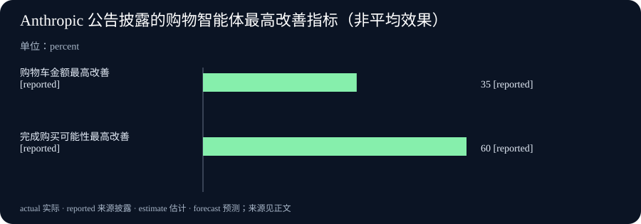

# Daily Intelligence

2026-09-03 · Thursday · 信息截止 07:20（Asia/Shanghai）

## Today’s Thesis｜从“会推荐”到“可成交”的控制面

商务智能体的竞争正在从聊天体验转向交易控制面：真正稀缺的不是再多一个推荐入口，而是把目录真值、工具权限、界面确认、实时复核和领域评测连成一条可审计链。Anthropic 在 9 月 2 日公布的商务智能体蓝图，价值主要不在模型演示，而在把“模型最多只能提出、关键动作由系统批准”写进架构。

## Executive Summary｜执行摘要

- Anthropic 发布购物智能体与商家智能体参考实现，覆盖零售、旅行、电信和票务，并声称采用 Claude 的零售商曾观察到购物车金额最高增加 35%、完成购买可能性最高增加 60%；这些是公司披露的客户观察，缺少样本、基线和实验设计，不能当成普遍因果效果。[来源](https://claude.com/blog/claude-for-commerce-agents)
- 工程指南主张以单智能体循环承载共享上下文，用技能处理长尾流程、用工具连接真实系统；价格、库存、退款和上线批准应由执行层约束，而不是靠提示词自律。[来源](https://claude.com/blog/the-anatomy-of-effective-commerce-agents)
- 公开方案说明参考代码没有 SLA、演示后端未生产加固；这意味着“可运行蓝图”只是起点，采用者仍承担权限、测试、数据与事故处置责任。[来源](https://claude.com/solutions/commerce)
- 美国 7 月国际贸易数据定于 9 月 3 日 08:30 EDT 发布，晚于本期截点；今日只能把它列为待观察事件，不能填入结果。[来源](https://www.bea.gov/news/schedule)

## AI Daily｜架构信号

### 一个循环，技能承载长尾

工程材料把核心结构描述为一个模型处于标准智能体循环中：读取目标与上下文，通过工具行动，用技能装载程序知识，再观察结果。其反对按每个业务意图拆分智能体的理由，是购物、退货、库存、偏好和当前购物车常处在同一会话；频繁交接会损失状态、增加延迟与成本。这是 Anthropic 的工程判断，并非所有行业都已独立证明的通用最优解。[来源](https://claude.com/blog/the-anatomy-of-effective-commerce-agents)

这套判断给产品团队一个可检验问题：如果任务之间共享的状态多于各自独有状态，优先维护一个清晰的会话状态和一组窄技能；只有研究任务足够独立，或另一个领域已有独立合规边界时，再考虑子流程交接。评估指标应是端到端任务成功率、总轮次、工具错误和恢复率，而不是单次模型回复分数。

### 界面也是权限系统

购物端参考实现连接目录、购物车、结账、偏好和订单历史，但把支付交给既有结账系统。商家端可以分析销售、发现库存问题、提出促销和起草营销活动；默认情况下，建议先进入暂存，由人在真实界面批准后才执行。[来源](https://claude.com/blog/claude-for-commerce-agents) 工程指南进一步强调：消费者侧不向模型暴露扣款方法；商家侧写工具先返回暂存 ID，应用动作只接受已由真实界面批准的 ID，并在执行时按当前限制重新检查。[来源](https://claude.com/blog/the-anatomy-of-effective-commerce-agents)

这把“人在环中”从一句原则变成可测试的接口契约。模型是否听话仍然重要，但决定损失上限的是工具有没有危险方法、后端是否验证金额与商品、批准是否可伪造、限制在执行时是否过期。若批准仅存在于对话文本中，模型就同时扮演提议者与授权解释者，隔离并不成立。

## Business Daily｜价值归属与采用成本

Anthropic 将蓝图定位为可自行派生的开放参考实现，支持 Messages API、Agent SDK、Managed Agents 以及多种云环境。公司列出的价值链包括平台、Visa、Mastercard、系统集成商和商户既有系统；同时明确 Claude 不承担店面、目录、供应链和最后一公里，也不在智能体中做广告或付费排序。[来源](https://claude.com/solutions/commerce)

因此，模型供应商试图占据“智能层”，而商户保留客户关系和交易事实。短期商业机会在集成：把目录、订单、库存、促销审批和客服政策做成稳定工具。长期议价权则可能落在谁拥有客户意图、决策轨迹和评测数据。商户若只购买聊天前端，会把最有价值的反馈闭环交给别人；若能保存经过同意的任务结果、失败类型和人工修正，则可持续改进自己的规则与评测集。

35% 与 60% 是值得跟踪的方向性信号，却不能直接进入收入预测。公告使用“最高”口径，没有披露多少客户达到该结果，也没有给出客单价、转化基线、流量组成或统计区间。[来源](https://claude.com/blog/claude-for-commerce-agents) 业务负责人应要求按渠道、意图、新老客户和商品类别拆解，并同时查看退款、投诉、折扣泄漏和人工接管率。购物车更大可能来自更好的组合推荐，也可能来自高价商品偏置；完成率提高也可能由样本选择造成。

## Macro Observation｜宏观观察

美国经济的下一项高频确认点是 7 月商品和服务国际贸易数据。BEA 日程显示发布时点为 9 月 3 日 08:30 EDT，晚于本期北京时间 07:20 的截点；数值目前为未观测，不等于零，也不代表数据缺席。[来源](https://www.bea.gov/news/schedule)

贸易数据与智能体商务之间暂时只有机制联系，不能宣称当日因果关系。若跨境智能体降低商品发现和比价成本，它可能提高可贸易商品的需求弹性；但最终成交仍受支付、关税、履约和退货成本约束。今晚应观察进口、出口与贸易差额的共同变化，再判断内需、外需和库存周期，而不是只看一个赤字标题。

## Signal Dashboard｜信号仪表盘

| 信号 | 状态 | 证据边界 | 下一验证 |
|---|---|---|---|
| 商务智能体蓝图 | 已发布 | 公司参考实现；不是托管产品承诺 | 检查仓库许可、威胁模型与更新节奏 |
| 购物车最高 +35% | 公司披露 | 最高值；样本和基线未披露 | 索取分布、实验设计与净收入指标 |
| 完成购买可能性最高 +60% | 公司披露 | 最高值；不等同整体转化率提升 | 核对流量、意图与退款后效果 |
| 关键动作批准 | 架构主张 | 取决于后端强制实施 | 测试伪造批准、过期批准和重放 |
| 美国 7 月贸易 | 待发布 | 截点时未观测 | 08:30 EDT 后读取 BEA 正式稿 |

## Deep Insight｜深度洞察

商务智能体让传统软件里分散的三个控制面重新合并：语言负责解释意图，工具负责改变状态，界面负责让人理解并批准后果。过去的电商漏斗把搜索、商品页、购物车和结账分成稳定页面；智能体把这些页面折叠成一段连续对话。便利的代价是，用户较难看见系统何时从“建议”跨到“动作”，企业也更难从页面路径判断错误发生在哪里。因此，架构不能只优化回答质量，还要显式标记状态转换：查到的价格、拟加入的商品、暂存的折扣、批准的动作和最终执行结果必须各有身份与时间。

参考实现最重要的启示，是把信任问题改写为能力问题。提示词可以说“不要编价格”，但真正可靠的设计是让价格只由目录工具返回；提示词可以说“未经同意不要改促销”，但可靠设计是写操作只产生暂存对象，应用接口只接受独立批准过的对象。这样，模型失误仍会带来糟糕建议，却较难直接变成扣款、错误折扣或不可逆发布。控制点还必须在执行时复核，因为库存、权限和限额可能在提议与批准之间变化。

这一模式会改变软件采购。企业过去询问模型准确率和单价，今后还应询问四组问题。第一，事实从哪里来，目录和政策是否有单一真值；第二，模型实际能调用哪些方法，每种方法的最坏后果多大；第三，批准如何产生、存储、撤销与审计；第四，评测是否覆盖自己的商品、价格、权限和异常流程。通用演示通过，并不能证明对某家商户有效；官方方案也明确参考代码没有 SLA、演示后端未做生产加固。[来源](https://claude.com/solutions/commerce)

反方观点是，过多批准会把智能体重新变成复杂表单，抹掉对话效率。这个风险成立，所以批准粒度不应一刀切。低风险、可撤销、价值受限的动作可以由预先策略授权；支付、退款、价格大幅变化和公开发布则保留明确批准。目标不是让人确认每一步，而是让自动化预算与潜在损失匹配。最有效的系统会逐渐把重复批准编码成政策，但仍保留金额、频率、对象和时效边界。

可证伪条件也很清楚：若真实部署显示单智能体因上下文膨胀而持续降低正确率，领域拆分在同等成本下反而更好，就应放弃单循环偏好；若后端强制约束仍无法降低错误执行或欺诈损失，说明风险主要位于身份、数据或流程之外；若购物车与完成率提高却伴随退款、投诉或补贴成本更快上升，商业价值主张也不成立。把这些条件写入评测，才能将“可信商务智能体”从营销词变成运营假设。

## Tomorrow Watch｜明日观察

- BEA 正式贸易稿发布后，记录 7 月进口、出口和差额，并保留修订信息。
- 检查商务蓝图仓库中的许可、威胁模型、权限边界和默认测试，区分示例与生产保障。
- 关注采用者是否披露 35% 与 60% 指标的样本、基线、持续时间和退款后结果。
- 观察支付网络、商户平台与模型供应商如何分配身份、同意、争议和数据责任。

## One Chart｜一图

图中只呈现 Anthropic 公告披露的两项“最高”百分比指标，单位均为 percent，但分别衡量购物车金额和完成购买可能性，不能相互加减，也不能当成平均效果。[来源](https://claude.com/blog/claude-for-commerce-agents)

## Quote of the Day｜每日一句

> “Simplicity does not precede complexity, but follows it.” — Alan J. Perlis

“简单并不先于复杂，而是在复杂之后形成。”耶鲁托管的《Epigrams in Programming》页面列为第 31 条；它提醒我们，商务智能体的简洁体验必须建立在对权限、状态与失败路径的充分处理之后。[来源](https://cs.yale.edu/homes/perlis-alan/quotes.html)

## Action Items｜行动项

- 画一张当前交易流程的能力图：每个工具读取什么、能改变什么、失败时如何恢复。
- 选择一个低风险流程做窄试验，预先定义成功率、人工接管、退款和投诉指标。
- 对写操作实施“暂存—独立批准—执行时复核”，并测试重放、过期与越权场景。
- 将 35% 和 60% 保留为供应商披露，不写入内部基准，直到拿到可复核的实验设计。
