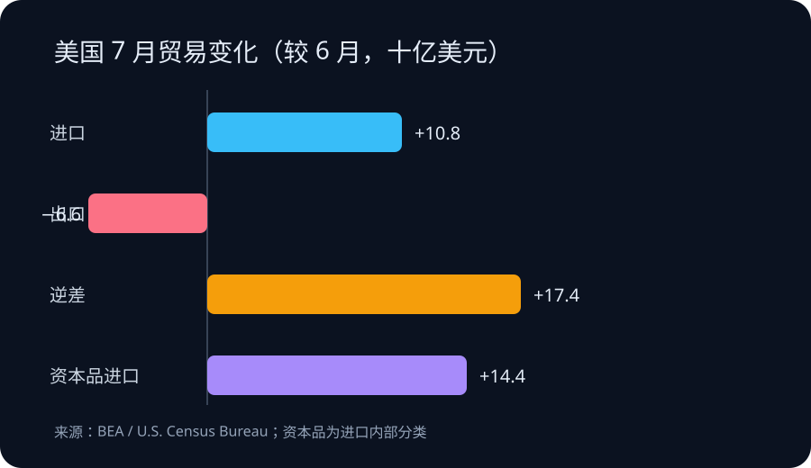

# Daily Intelligence

2026-09-04 · Friday · 信息截止 07:20（Asia/Shanghai）

## Today’s Thesis｜从“学过 AI”到“改进工作”的证据链

AI 普及的下一道门槛不是再发一个工具，而是把短课、真实任务、结果核验与同伴复盘连成学习闭环；宏观数据同时提醒，数字能力扩张仍会通过硬件进口与成本结构进入实体账本。

## Executive Summary｜执行摘要

- Google 9 月 3 日宣布扩展 Google AI Educator Series：课程免费、按需学习，单节少于 15 分钟，并计划每月第一个星期三增加模块；这证明培训供给增加，不证明教师节省了多少时间或学生学习结果改善。[来源](https://blog.google/products-and-platforms/products/education/new-ai-educator-trainings-september-2026/)
- 新模块覆盖家长通知、个性化支持、学生研究与互动学习；9 月 19 日的线上活动为 10 小时自由参与形式，并提供与 ISTE 对齐的数字徽章。徽章记录课程完成，不能替代课堂效果评估。[来源](https://blog.google/products-and-platforms/products/education/new-ai-educator-trainings-september-2026/)
- BEA 与美国人口普查局公布，7 月商品和服务贸易逆差为 886 亿美元，较修订后的 6 月扩大 174 亿美元；出口下降 66 亿美元，进口增加 108 亿美元。[来源](https://www.bea.gov/news/2026/us-international-trade-goods-and-services-july-2026)
- 7 月资本品进口增加 144 亿美元，其中计算机增加 69 亿、计算机配件增加 66 亿、半导体增加 12 亿。分类变化可以支持“数字设备采购增强”的假设，但不能单凭一个月数据断言 AI 投资是唯一原因。[来源](https://www.bea.gov/news/2026/us-international-trade-goods-and-services-july-2026)

## AI Daily｜能力建设信号

### 微课降低启动成本，真实任务决定迁移

Google 将培训拆成少于 15 分钟的学习单元，并按月加入内容。公司称课程来自教师反馈，新增主题包括自动起草缺交作业通知、用 Guided Learning 提供苏格拉底式引导、用 Deep Research规划研究，以及制作互动学习体验。[来源](https://blog.google/products-and-platforms/products/education/new-ai-educator-trainings-september-2026/) 这种设计降低了教师从“知道工具”到“完成一次尝试”的时间成本，也使培训可嵌入零散工作时间。

但可访问性只是采用链条的第一环。课程完成率、徽章数和活动参与人数衡量的是接触与参与；真正的工作流价值还需观察任务耗时、修改次数、事实错误、学生独立完成度与公平性。若只奖励工具使用，教师可能优化可见产出，而没有改善学习目标。

### 把一次演示变成可复核循环

可验证的最小循环可分四步：选择一个高频、低风险任务；保存不用 AI 的基线；使用工具并记录人工修改；由同伴或学生反馈结果。家长通知可以比较起草时间与纠错次数，研究计划可以检查来源质量与学生能否解释检索路径。不同任务需要不同指标，不能用一个“满意度”覆盖全部结果。

Google 的公告描述了产品与课程提供方观察到的需求，包括实用应用与教师社区；它没有给出样本、调查方法或对照结果。[来源](https://blog.google/products-and-platforms/products/education/new-ai-educator-trainings-september-2026/) 因而这些反馈适合生成试验假设，不适合当作教育系统整体需求的估计。

## Business Daily｜培训产品的价值归属

免费微课把获客、产品教育和认证结合在一起。对平台而言，课程可以降低首次使用摩擦并增加生态熟悉度；对学校而言，它节省了自行设计入门材料的成本，但也带来供应商口径偏差。采购方应保留自己的教学目标、数据规则和退出路径，避免把“会使用某平台”误写成可迁移的 AI 素养。

培训商业模式的关键资产可能不是课程视频，而是任务模板、反馈数据和同行实践。平台若只统计注册、完成和徽章，会高估短期参与；学校若只看节省时间，也可能忽略复核负担与学生能力变化。更稳健的合同或项目验收应同时记录采用、质量、风险和迁移四类指标。

## Macro Observation｜宏观观察

BEA 数据显示，7 月美国贸易逆差扩大至 886 亿美元，环比增加 24.4%；出口为 3107 亿美元，下降 2.1%，进口为 3993 亿美元，增加 2.8%。商品逆差扩大 176 亿美元至 1196 亿美元，服务顺差增加 2 亿美元至 310 亿美元。[来源](https://www.bea.gov/news/2026/us-international-trade-goods-and-services-july-2026) 这些数据经季节调整但未按价格变化调整，因此名义金额同时包含数量与价格影响。

资本品进口增加 144 亿美元，其中计算机与配件合计增加 135 亿美元。[来源](https://www.bea.gov/news/2026/us-international-trade-goods-and-services-july-2026) 这与数字基础设施采购加快相容，却不能建立因果：进口可能反映订单时点、库存补充、价格或关税预期。下一步应结合国内设备投资、库存、企业资本开支和后续月份修订判断，而不是把单月进口直接等同于生产率提升。

## Signal Dashboard｜信号仪表盘

| 信号 | 状态 | 证据边界 | 下一验证 |
|---|---|---|---|
| 教师 AI 微课 | 已扩展 | Google 公告；供给与设计已观察 | 跟踪完成率、迁移率与错误率 |
| 单节少于 15 分钟 | 项目设计 | 不代表总培训投入或效果 | 记录真实学习与复核时间 |
| 9 月 19 日活动 | 已宣布 | 10 小时自由参与；尚未发生 | 活动后核对参与与完成口径 |
| 7 月贸易逆差 886 亿美元 | 官方发布 | 季调名义值；6 月已修订 | 核对 10 月发布的后续修订 |
| 计算机及配件进口 +135 亿美元 | 官方分类 | 单月变化；原因未识别 | 对照设备投资、库存与价格 |

## Deep Insight｜深度洞察

生成式 AI 培训很容易落入“内容完成即能力获得”的错觉。传统软件培训常围绕菜单与操作步骤，完成后至少能稳定复现功能；生成式工具的输出依赖任务描述、上下文、资料与复核，操作成功不等于结果可靠。课程必须把判断力和验证动作纳入目标，否则学习者只会更快地产生需要别人检查的文本。

短课仍有明确价值：它把采用成本切成可安排的小块，并让组织快速发现哪些任务值得继续。但每节课后需要一个迁移任务，要求学习者用自己的材料完成真实工作，注明工具做了什么、人工改了什么、结果由谁检查。这样，徽章才是进入实践的起点，而非能力终点。

组织层面的学习闭环还需要可比较的基线。若教师此前写通知需要 20 分钟，AI 初稿只需 3 分钟，却花 18 分钟核对事实与语气，那么净节省有限；若研究计划更完整但学生无法解释来源选择，则成品质量掩盖了能力外包。衡量时应把准备、生成、检查、返工和沟通全算进去。

贸易数据提供了另一层约束。数字化培训看似轻资产，但其背后依赖设备、芯片、网络与算力。7 月计算机及配件进口显著上升，说明数字能力扩张可能在宏观账本中表现为资本品流动。[来源](https://www.bea.gov/news/2026/us-international-trade-goods-and-services-july-2026) 然而硬件投入只有在流程改进、技能迁移和可持续产出中兑现，才会转化为生产率；采购本身仍是成本和库存。

可证伪条件包括：参与者完成课程后，真实任务的净耗时或错误率没有改善；学生对来源与推理的解释能力下降；不同供应商之间的技能无法迁移；以及设备采购持续增长但产出指标没有相应变化。出现这些结果时，应缩小试点、重做任务与指标，而不是增加课程数量来掩盖问题。

## Tomorrow Watch｜明日观察

- 为一个教师高频任务建立无 AI 基线，记录全流程耗时、错误与返工。
- 观察 Google 后续模块是否公开评估设计，而不仅是课程与徽章数量。
- 跟踪 9 月 19 日活动后的参与、完成与课堂迁移数据，区分各层口径。
- 将资本品进口与设备投资、库存和企业资本开支交叉验证。

## One Chart｜一图

图中比较 7 月相对 6 月的贸易分项变化：进口增加 108 亿美元、出口减少 66 亿美元，逆差因而扩大 174 亿美元；资本品进口增加 144 亿美元，属于进口内部分类，不能与总进口变化简单相加。[来源](https://www.bea.gov/news/2026/us-international-trade-goods-and-services-july-2026)

## Quote of the Day｜每日一句

> “A program without a loop and a structured variable isn't worth writing.” — Alan J. Perlis

“没有循环和结构化变量的程序，不值得写。”耶鲁托管的《Epigrams in Programming》列为第 18 条。今天可把它借作学习设计提醒：一次课程不是能力，只有任务、反馈与修正构成循环，知识才会进入工作。[来源](https://cs.yale.edu/homes/perlis-alan/quotes.html)

## Action Items｜行动项

- 选一个低风险教师任务，记录不用 AI 与使用 AI 的完整耗时和质量差异。
- 将“课程完成、真实任务迁移、结果质量、学生能力”设为四个独立指标。
- 要求每个 AI 产出保留来源、人工修改和最终责任人，便于复盘。
- 对设备进口信号保持假设口径，等待投资、库存和后续月份数据交叉验证。
